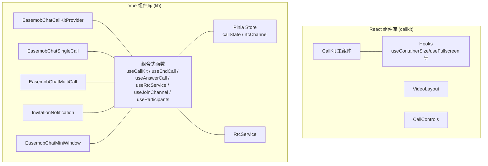
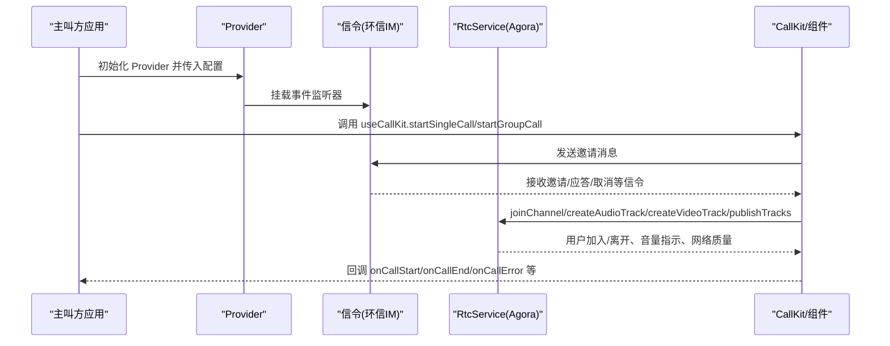
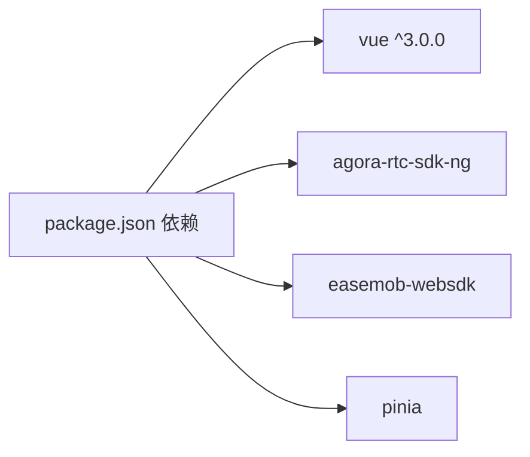

# API 参考

<cite>
**本文引用的文件**
- [package.json](file://package.json)
- [README.md](file://README.md)
- [USAGE.md](file://USAGE.md)
- [callkit/index.ts](file://callkit/index.ts)
- [callkit/types/index.ts](file://callkit/types/index.ts)
- [callkit/CallKit.tsx](file://callkit/CallKit.tsx)
- [lib/index.ts](file://lib/index.ts)
- [lib/types.ts](file://lib/types.ts)
- [lib/components/EasemobChatCallKitProvider.vue](file://lib/components/EasemobChatCallKitProvider.vue)
- [lib/composables/useCallKit.ts](file://lib/composables/useCallKit.ts)
- [lib/composables/useEndCall.ts](file://lib/composables/useEndCall.ts)
- [lib/composables/useAnswerCall.ts](file://lib/composables/useAnswerCall.ts)
- [lib/composables/useRtcService.ts](file://lib/composables/useRtcService.ts)
- [lib/composables/useJoinChannel.ts](file://lib/composables/useJoinChannel.ts)
- [lib/composables/useParticipants.ts](file://lib/composables/useParticipants.ts)
- [lib/services/RtcService.ts](file://lib/services/RtcService.ts)
- [lib/store/callState.ts](file://lib/store/callState.ts)
</cite>

## 目录
1. [简介](#简介)
2. [项目结构](#项目结构)
3. [核心组件](#核心组件)
4. [架构总览](#架构总览)
5. [详细组件与 API 分类](#详细组件与-api-分类)
6. [依赖关系分析](#依赖关系分析)
7. [性能与行为特性](#性能与行为特性)
8. [故障排查](#故障排查)
9. [结论](#结论)
10. [附录](#附录)

## 简介
本文件为 EaseMob Chat CallKit Vue3 组件库的完整 API 参考，覆盖组件 API、组合式函数 API、服务 API 与类型定义。文档按功能分类组织，提供参数说明、返回值定义、使用示例与注意事项，并包含版本信息、废弃警告与迁移建议，确保与实际代码保持同步。

## 项目结构
- 两套对外 API：
  - callkit（React 组件库）：提供 CallKit 主组件、布局、控件、Hooks 等。
  - lib（Vue 组件库）：提供 Provider、单人/群组通话组件、Pinia Store、组合式函数与 RTC 服务等。
- 两大模块：
  - 组件层：React/Vue 组件负责 UI 与交互。
  - 服务与状态层：CallService、RtcService、Pinia Store、信令与事件管理。

图表来源
- [callkit/index.ts](file://callkit/index.ts#L1-L46)
- [lib/index.ts](file://lib/index.ts#L1-L58)

章节来源
- [package.json](file://package.json#L1-L53)
- [callkit/index.ts](file://callkit/index.ts#L1-L46)
- [lib/index.ts](file://lib/index.ts#L1-L58)

## 核心组件
- React 组件库（callkit）
  - CallKit：主通话容器，支持多种布局模式、实时通话、邀请流程、铃声与日志。
  - VideoLayout：视频布局容器。
  - CallControls：通话控制按钮集合。
  - Hooks：容器尺寸、全屏、可调整大小、拖拽、计时器、邀请计时器等。
- Vue 组件库（lib）
  - Provider：全局配置与事件监听器挂载。
  - 单人/群组通话组件：封装 UI 与交互。
  - 组合式函数：useCallKit、useEndCall、useAnswerCall、useRtcService、useJoinChannel、useParticipants。
  - 服务与 Store：RtcService、callState、rtcChannel。

章节来源
- [callkit/CallKit.tsx](file://callkit/CallKit.tsx#L51-L800)
- [lib/components/EasemobChatCallKitProvider.vue](file://lib/components/EasemobChatCallKitProvider.vue#L1-L115)
- [lib/composables/useCallKit.ts](file://lib/composables/useCallKit.ts#L1-L123)
- [lib/composables/useEndCall.ts](file://lib/composables/useEndCall.ts#L1-L131)
- [lib/composables/useAnswerCall.ts](file://lib/composables/useAnswerCall.ts#L1-L168)
- [lib/composables/useRtcService.ts](file://lib/composables/useRtcService.ts#L1-L192)
- [lib/composables/useJoinChannel.ts](file://lib/composables/useJoinChannel.ts#L1-L185)
- [lib/composables/useParticipants.ts](file://lib/composables/useParticipants.ts#L1-L120)
- [lib/services/RtcService.ts](file://lib/services/RtcService.ts#L1-L719)
- [lib/store/callState.ts](file://lib/store/callState.ts#L1-L263)

## 架构总览
- 信令层：通过环信 IM 发送/接收通话邀请、应答、取消等信令。
- RTC 层：通过 Agora RTC SDK 管理音视频轨道、发布/订阅、设备切换、网络质量。
- 状态层：Pinia Store 管理通话状态、频道、用户映射、加入/离开状态。
- UI 层：React/Vue 组件负责渲染与交互，支持自定义图标、铃声、日志级别等。

图表来源
- [lib/components/EasemobChatCallKitProvider.vue](file://lib/components/EasemobChatCallKitProvider.vue#L62-L103)
- [lib/composables/useCallKit.ts](file://lib/composables/useCallKit.ts#L10-L122)
- [lib/composables/useJoinChannel.ts](file://lib/composables/useJoinChannel.ts#L76-L178)
- [lib/services/RtcService.ts](file://lib/services/RtcService.ts#L109-L171)

## 详细组件与 API 分类

### 组件 API（React）

#### CallKit 主组件 API
- 功能概览
  - 支持视频/音频/群组通话模式。
  - 邀请流程：展示邀请、自动拒绝计时、移除邀请用户。
  - 实时通话：本地/远端视频窗口、说话指示器、网络质量。
  - UI 控件：静音、摄像头、扬声器、屏幕分享、最小化、全屏、拖拽、调整大小。
  - 铃声与日志：可配置铃声源、音量、循环、日志级别与前缀。
  - 群组成员选择：支持基于 groupId 获取成员或自定义提供器。
- 关键属性（Props）
  - 布局与外观：layoutMode、maxVideos、aspectRatio、gap、backgroundImage、customIcons。
  - 控件可见性与初始状态：showControls、muted、cameraEnabled、speakerEnabled、screenSharing。
  - 真实通话配置：chatClient、enableRealCall、useRTCToken。
  - 邀请与群组：invitationCustomContent、acceptText、rejectText、showInvitationAvatar、showInvitationTimer、autoRejectTime、groupMembers、userSelectTitle、initiateGroupCallTitle、webimGroupId、userInfoProvider、groupInfoProvider。
  - 事件回调：onVideoClick、onMuteToggle、onCameraToggle、onSpeakerToggle、onCameraFlip、onScreenShareToggle、onHangup、onAddParticipant、onInvitationAccept、onInvitationReject、onCallStart、onCallEnd、onLayoutModeChange、onCallError、onReceivedCall、onRemoteUserJoined、onRemoteUserLeft、onRtcEngineCreated、onEndCallWithReason、onRingtoneStart、onRingtoneEnd、onCallStatusChanged。
  - 日志与编码：logLevel、enableLogging、logPrefix、speakingVolumeThreshold、encoderConfig。
  - 交互与尺寸：resizable、min/maxWidth/Height、onResize、draggable、dragHandle、onDragStart/OnDrag/OnDragEnd、managedPosition、initialPosition、initialSize、isMinimized、minimizedSize、onMinimizedChange、onMinimizedToggle。
- 关键方法（通过 ref 调用）
  - showInvitation(invitation)：显示邀请。
  - hideInvitation()：隐藏邀请。
  - startCall(videos)：开始演示模式通话。
  - endCall()：结束通话。
  - updateVideos(videos)：更新视频列表。
  - getCallStatus()：查询通话状态。
  - showPreview(mode?)：显示预览界面。
  - startGroupCall(options)：发起多人通话（返回消息体或 null）。
  - startSingleCall(options)：发起单人通话。
  - answerCall(result)：接听真实通话。
  - exitCall(reason?)：挂断真实通话。
  - setUserInfo(map)：设置用户信息。
  - toggleMute()/toggleCamera()：切换静音/摄像头，返回新状态。
  - isMuted()/isCameraEnabled()：查询当前状态。
  - getJoinedMembers()：获取已加入成员。
  - refreshLocalVideoStatus()/playLocalVideoManually()：刷新/手动播放本地视频。
  - createLocalVideoTrackForGroupCall()/createLocalVideoTrackFor1v1Preview()：创建本地视频轨道。
  - addParticipants(newMembers)：添加参与者。
  - adjustSize(size)：动态调整尺寸。
- 使用示例
  - 在父组件中通过 ref 调用 startGroupCall 或 startSingleCall，并在 onCallStart 中渲染视频窗口。
  - 配置 userInfoProvider/groupInfoProvider 以支持群组成员自动拉取。
- 注意事项
  - enableRealCall 与 chatClient 必须正确初始化，否则真实通话不可用。
  - useRTCToken 控制是否校验 RTC Token。
  - onCallError/onEndCallWithReason 用于错误与结束回调处理。
  - 自定义图标需遵循 CallKitIconMap/Header/Controls 的键名规范。

章节来源
- [callkit/types/index.ts](file://callkit/types/index.ts#L178-L307)
- [callkit/types/index.ts](file://callkit/types/index.ts#L125-L176)
- [callkit/CallKit.tsx](file://callkit/CallKit.tsx#L51-L800)

#### VideoLayout 组件 API
- 功能概览
  - 提供视频窗口布局容器，配合布局策略计算与渲染。
- 关键属性
  - 与布局相关的 props（如 mode、rows、cols、itemsPerRow、maxCols、gap、headerHeight、controlsHeight、maxVideos）。
- 使用示例
  - 作为 CallKit 的子组件使用，或在自定义布局中复用。

章节来源
- [callkit/types/index.ts](file://callkit/types/index.ts#L30-L84)

#### CallControls 组件 API
- 功能概览
  - 提供通话控制按钮（静音、摄像头、扬声器、挂断、接听/拒绝、屏幕分享等）。
- 关键属性
  - 自定义图标映射：controls.icon 名称需与内置一致。
- 使用示例
  - 通过 customIcons.controls.* 覆盖默认图标。

章节来源
- [callkit/types/index.ts](file://callkit/types/index.ts#L323-L337)
- [callkit/types/index.ts](file://callkit/types/index.ts#L351-L356)

### 组件 API（Vue）

#### EasemobChatCallKitProvider 组件 API
- 功能概览
  - 全局 Provider，负责初始化 RTC 服务、挂载事件监听器、合并配置、设置日志级别。
- 关键属性
  - chatClient：可选，支持延迟初始化。
  - agoraAppId：[已废弃] 仅用于向后兼容。
  - initConfig：debug、enableRingtone、resizable、draggable、inviteTimeout。
- 生命周期
  - onMounted：标记已挂载，渲染插槽。
  - onUnmounted：销毁 RTC 服务。
- 使用示例
  - 在根组件注册 Provider，并传入 chatClient 与 initConfig。

章节来源
- [lib/components/EasemobChatCallKitProvider.vue](file://lib/components/EasemobChatCallKitProvider.vue#L1-L115)

#### EasemobChatSingleCall / EasemobChatMultiCall 组件 API
- 功能概览
  - 单人/群组通话 UI 组件，内部使用组合式函数与 Store 管理状态。
- 关键点
  - 通过 Provider 注入全局配置与事件监听。
  - 与 useCallKit/useJoinChannel 等组合式函数协作。

章节来源
- [lib/index.ts](file://lib/index.ts#L18-L24)

#### InvitationNotification / EasemobChatMiniWindow 组件 API
- 功能概览
  - 邀请通知与迷你窗口组件，支持自定义内容与交互。
- 关键属性
  - InvitationNotification：invitation、onAccept、onReject、customContent、acceptText、rejectText、showAvatar、showTimer、autoRejectTime、className/style。
- 使用示例
  - 在 Provider 下使用，结合 useCallKit 的邀请流程。

章节来源
- [callkit/types/index.ts](file://callkit/types/index.ts#L95-L123)
- [lib/index.ts](file://lib/index.ts#L18-L24)

### 组合式函数 API（Vue）

#### useCallKit
- 功能概览
  - 发起单人/群组通话，发送邀请消息，初始化邀请状态。
- 返回值
  - startSingleCall(targetId, type, msg)：Promise<void>。
  - startGroupCall(groupId, members, type, msg, groupName?, groupAvatar?)：Promise<void>。
- 使用示例
  - 在组件中调用 startSingleCall 或 startGroupCall，并在 Provider 内使用。

章节来源
- [lib/composables/useCallKit.ts](file://lib/composables/useCallKit.ts#L1-L123)

#### useEndCall
- 功能概览
  - 通话结束相关操作：挂断、取消邀请、处理远程取消/拒绝、异常结束。
- 返回值
  - hangup(reason?)、hangupCall()、cancelCall()、handleRemoteCancel()、handleRemoteRefuse()、handleAbnormalEnd()：Promise<void>。
  - canHangup()、canCancel()：boolean。
- 使用示例
  - 在挂断按钮点击时调用 hangup 或 hangupCall。

章节来源
- [lib/composables/useEndCall.ts](file://lib/composables/useEndCall.ts#L1-L131)

#### useAnswerCall
- 功能概览
  - 被叫方接听/拒绝/忙碌拒绝通话，发送 answerCall 信令。
- 返回值
  - acceptCall()、rejectCall()、busyRejectCall()：Promise<void>。
- 使用示例
  - 在收到邀请后根据用户选择调用对应方法。

章节来源
- [lib/composables/useAnswerCall.ts](file://lib/composables/useAnswerCall.ts#L1-L168)

#### useRtcService
- 功能概览
  - 访问 RtcService 的组合式 API，管理本地/远端流、音视频开关、设备切换占位。
- 返回值
  - 响应式状态：localStream、remoteStreams、isVideoEnabled、isAudioEnabled、isConnected、activeChannel。
  - 控制方法：toggleVideo(enabled?)、toggleAudio(enabled?)、switchCamera(deviceId?)、switchMicrophone(deviceId?)。
  - 流管理：getLocalStream()、getRemoteStream(userId)、addRemoteStream(userId, stream)、removeRemoteStream(userId)、setLocalStream(stream)。
  - reset()。
- 使用示例
  - 在组件中绑定 localStream 与 remoteStreams，控制音视频开关。

章节来源
- [lib/composables/useRtcService.ts](file://lib/composables/useRtcService.ts#L1-L192)

#### useJoinChannel
- 功能概览
  - 获取 RTC Token、加入频道、创建并发布音视频轨道。
- 返回值
  - joinChannel()：Promise<void>。
  - isJoining：boolean。
- 使用示例
  - 在信令确认后调用 joinChannel，自动创建轨道并发布。

章节来源
- [lib/composables/useJoinChannel.ts](file://lib/composables/useJoinChannel.ts#L1-L185)

#### useParticipants
- 功能概览
  - 自动生成参与者列表，自动过滤已离开用户，标记邀请中/已加入状态。
- 返回值
  - participants：ComputedRef<Participant[]>。
- 使用示例
  - 在 UI 中渲染参与者列表，自动处理加入/离开状态。

章节来源
- [lib/composables/useParticipants.ts](file://lib/composables/useParticipants.ts#L1-L120)

### 服务 API（Vue）

#### RtcService
- 功能概览
  - 封装 Agora RTC SDK，管理客户端、音视频轨道、发布/订阅、设备切换、网络质量。
- 关键方法
  - initialize()：Promise<void>。
  - setAppId(appId)：void。
  - joinChannel(channelName, token, uid, appId?)：Promise<number|string>。
  - leaveChannel()：Promise<void>。
  - createAudioTrack()：Promise<IMicrophoneAudioTrack>。
  - createVideoTrack()：Promise<ICameraVideoTrack>。
  - publishTracks(tracks)：Promise<void>。
  - toggleAudio(enabled)：Promise<boolean>。
  - toggleVideo(enabled)：Promise<boolean>。
  - switchCamera(deviceId)：Promise<boolean>。
  - switchMicrophone(deviceId)：Promise<boolean>。
  - subscribeRemoteUser(user, mediaType)：Promise<void>。
  - getLocalVideoStream()：MediaStream|null。
  - getRemoteVideoTrack(userId)：IRemoteVideoTrack|null。
  - getRemoteAudioTrack(userId)：IRemoteAudioTrack|null。
  - isMuted()：boolean。
  - isCameraEnabled()：boolean。
  - getClient()：IAgoraRTCClient|null。
  - destroy()：Promise<void>。
- 使用示例
  - 在 useJoinChannel 中调用 joinChannel、createAudioTrack、createVideoTrack、publishTracks。

章节来源
- [lib/services/RtcService.ts](file://lib/services/RtcService.ts#L1-L719)

### 类型定义（Vue）

#### EasemobChatCallKitOptions / EasemobChatCallKitInstance
- EasemobChatCallKitOptions
  - appKey、userId、accessToken、debug。
  - enableRingtone、resizable、draggable。
  - chatClient。
- EasemobChatCallKitInstance
  - startCall(targetId, type)、endCall()、startChat(targetId)、isInCall、callType、targetUser、config。

章节来源
- [lib/types.ts](file://lib/types.ts#L1-L34)

#### ProviderConfig
- chatClient、agoraAppId（已废弃）、initConfig：debug、enableRingtone、resizable、draggable、inviteTimeout。

章节来源
- [lib/types.ts](file://lib/types.ts#L36-L46)

#### UseCallKitReturn / UseEndCallReturn / UseAnswerCallReturn
- UseCallKitReturn：startSingleCall、startGroupCall。
- UseEndCallReturn：hangup、hangupCall、cancelCall、handleRemoteCancel、handleRemoteRefuse、handleAbnormalEnd、canHangup、canCancel。
- UseAnswerCallReturn：acceptCall、rejectCall、busyRejectCall。

章节来源
- [lib/types.ts](file://lib/types.ts#L51-L91)

#### 常量与枚举（Vue）
- HANGUP_REASON、CALL_STATUS、CALL_TYPE：导出于 lib/types/callstate.types。

章节来源
- [lib/index.ts](file://lib/index.ts#L46-L46)

### 类型定义（React）

#### CallKitProps / CallKitRef
- CallKitProps：布局、外观、控件、真实通话、邀请、事件回调、日志、编码、交互与尺寸等。
- CallKitRef：showInvitation、hideInvitation、startCall、endCall、updateVideos、getCallStatus、showPreview、startGroupCall、startSingleCall、answerCall、exitCall、setUserInfo、toggleMute、toggleCamera、isMuted、isCameraEnabled、getJoinedMembers、refreshLocalVideoStatus、playLocalVideoManually、createLocalVideoTrackForGroupCall、createLocalVideoTrackFor1v1Preview、addParticipants、adjustSize。

章节来源
- [callkit/types/index.ts](file://callkit/types/index.ts#L178-L307)
- [callkit/types/index.ts](file://callkit/types/index.ts#L125-L176)

#### 布局与视频类型
- LayoutMode、LayoutConfig、LayoutOptions、LayoutStrategy、VideoWindowProps、VideoSize、ContainerSize、VideoSwitchingState。
- InvitationInfo、InvitationNotificationProps。

章节来源
- [callkit/types/index.ts](file://callkit/types/index.ts#L20-L123)

#### 图标类型
- CustomIconProps、CallControlsIconMap、HeaderIconMap、CallKitIconMap。

章节来源
- [callkit/types/index.ts](file://callkit/types/index.ts#L312-L356)

### 版本信息与废弃警告

- 版本
  - 包版本：1.0.0（参见 package.json）。
- 废弃与兼容
  - Provider 的 agoraAppId 参数已废弃，仅用于向后兼容；实际 appId 将在加入频道时从环信服务器动态获取。
  - React 组件库导出的类型与组件与 Vue 组件库存在差异，需按库选择相应 API。

章节来源
- [lib/components/EasemobChatCallKitProvider.vue](file://lib/components/EasemobChatCallKitProvider.vue#L80-L87)
- [package.json](file://package.json#L1-L53)

### 迁移指南
- 从 Provider 的 agoraAppId 迁移到动态获取 appId
  - 移除传入的 agoraAppId，依赖环信服务器返回的 appId。
  - 在 useJoinChannel 中通过环信 SDK 获取 RTCToken 与 appId，并传入 joinChannel。
- 从 React CallKit 迁移到 Vue 组件库
  - 使用 EasemobChatCallKitProvider 注册全局配置。
  - 使用 useCallKit/useEndCall/useAnswerCall/useRtcService/useJoinChannel/useParticipants 替代 React 的 ref 方法。
  - 使用 Pinia Store 管理状态，而非 React 组件内部状态。

章节来源
- [lib/components/EasemobChatCallKitProvider.vue](file://lib/components/EasemobChatCallKitProvider.vue#L80-L92)
- [lib/composables/useJoinChannel.ts](file://lib/composables/useJoinChannel.ts#L39-L71)

## 依赖关系分析

图表来源
- [package.json](file://package.json#L33-L51)

章节来源
- [package.json](file://package.json#L33-L51)

## 性能与行为特性
- 性能优化
  - React：MemoizedFullLayoutManager 降低布局重渲染成本。
  - Vue：useRtcService 返回响应式状态，避免不必要的组件重渲染。
- 行为特性
  - 邀请超时：单人通话超时自动隐藏界面；多人通话保持等待用户手动挂断。
  - 网络质量：通过 RtcService 事件回调上报网络质量与音量指示。
  - 设备切换：摄像头/麦克风切换需在轨道可用时进行，失败时记录日志。

章节来源
- [callkit/CallKit.tsx](file://callkit/CallKit.tsx#L45-L45)
- [lib/store/callState.ts](file://lib/store/callState.ts#L115-L131)
- [lib/services/RtcService.ts](file://lib/services/RtcService.ts#L664-L673)

## 故障排查
- 常见问题
  - 无法发起真实通话：检查 chatClient 是否初始化，enableRealCall 是否开启。
  - 邀请无响应：确认 Provider 已挂载事件监听器，信令发送成功。
  - 音视频无法打开：检查设备权限与轨道状态，使用 toggleAudio/toggleVideo 重试。
  - 频道加入失败：确认 RTCToken 获取成功，joinChannel 参数正确。
- 日志与调试
  - React：通过 logLevel、enableLogging、logPrefix 调整日志级别与前缀。
  - Vue：Provider 初始化时设置日志级别，组件内使用 logger 输出调试信息。

章节来源
- [callkit/CallKit.tsx](file://callkit/CallKit.tsx#L199-L216)
- [lib/components/EasemobChatCallKitProvider.vue](file://lib/components/EasemobChatCallKitProvider.vue#L66-L77)

## 结论
本 API 参考覆盖了 React 与 Vue 两套组件库的核心能力，包括组件 API、组合式函数、服务与类型定义。通过清晰的分类与示例，开发者可快速集成真实通话、邀请流程、音视频控制与状态管理。建议在迁移过程中关注 Provider 的配置变更与 appId 动态获取策略，确保稳定运行。

## 附录
- 快速开始与使用示例
  - React：参考 README 与 USAGE 文档，了解组件引入与基础配置。
  - Vue：通过 Provider 注册，使用组合式函数与 Store 管理状态。

章节来源
- [README.md](file://README.md)
- [USAGE.md](file://USAGE.md)