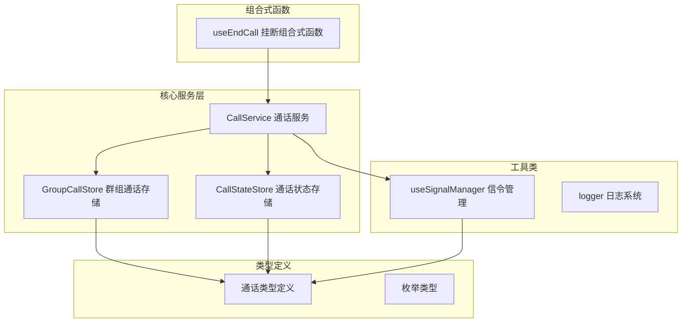
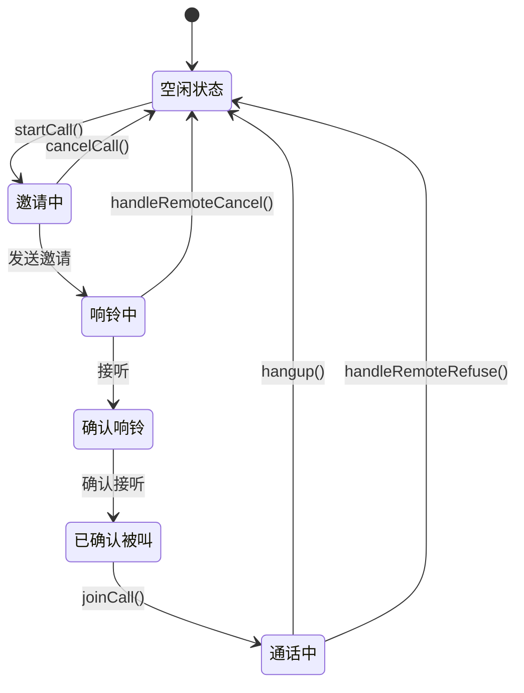
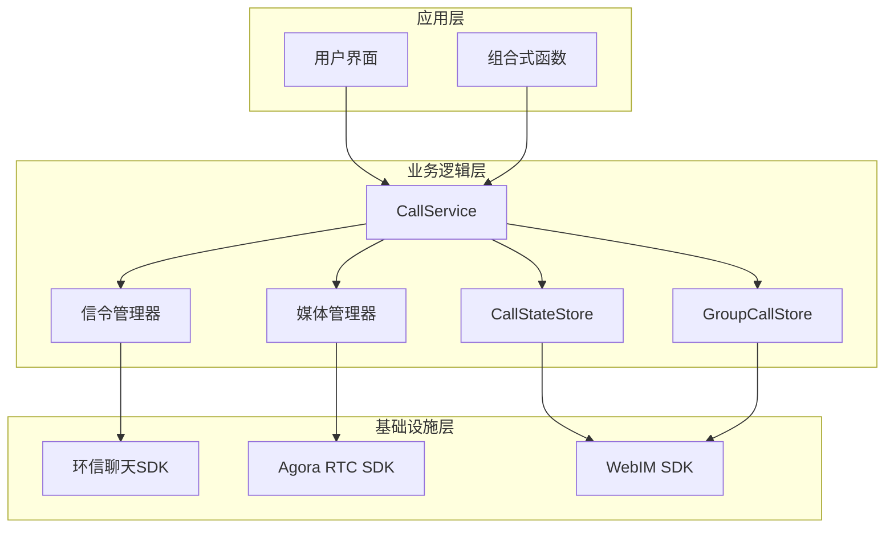
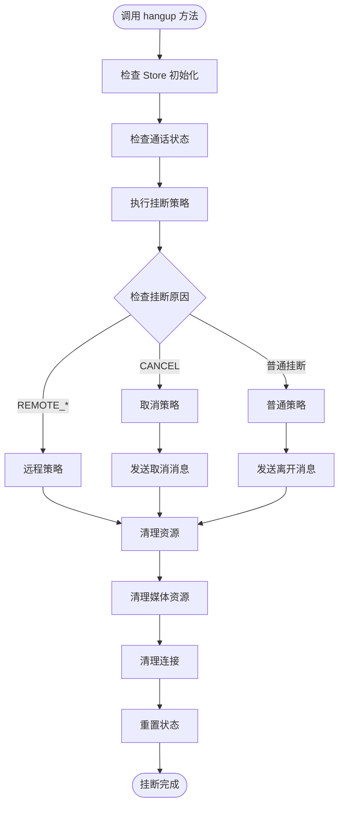
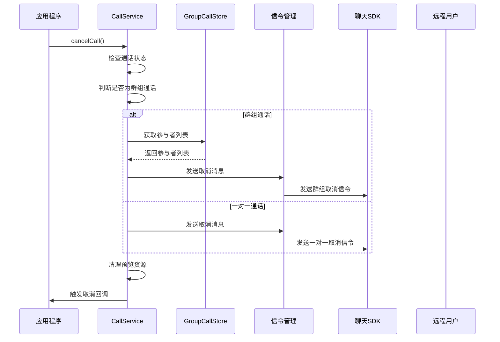
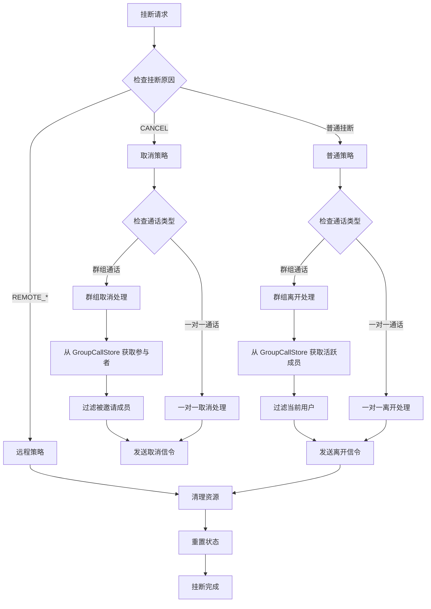
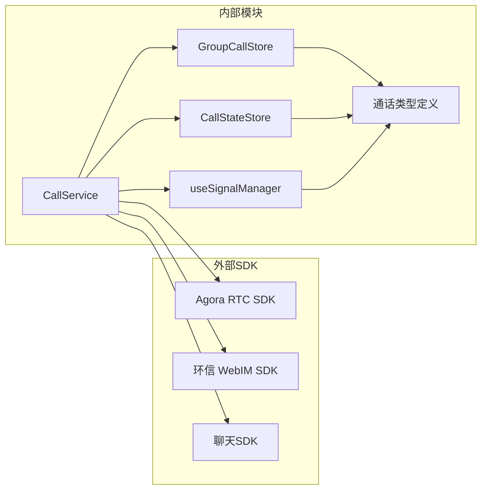
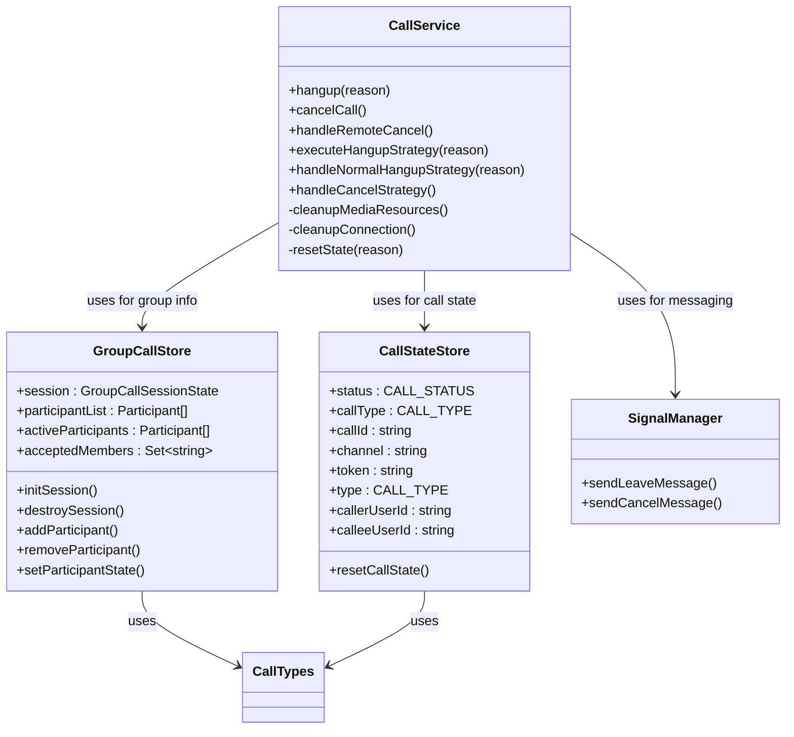

# CallService 通话服务

<cite>
**本文档引用的文件**
- [CallService.ts](file://lib/services/CallService.ts)
- [GroupCallStore.ts](file://lib/modules/groupCall/viewModel/GroupCallStore.ts)
- [callState.ts](file://lib/store/callState.ts)
- [callstate.types.ts](file://lib/types/callstate.types.ts)
- [useSignalManager.ts](file://lib/composables/useSignalManager.ts)
- [GroupCall 模块导出](file://lib/modules/groupCall/index.ts)
</cite>

## 更新摘要
**所做更改**
- 更新了群组信息和参与者列表获取机制的说明
- 新增了 GroupCallStore 在挂断策略中的具体应用
- 更新了架构图以反映服务层重构后的依赖关系
- 增强了模块化和可维护性的说明

## 目录
1. [简介](#简介)
2. [项目结构](#项目结构)
3. [核心组件](#核心组件)
4. [架构概览](#架构概览)
5. [详细组件分析](#详细组件分析)
6. [依赖关系分析](#依赖关系分析)
7. [性能考虑](#性能考虑)
8. [故障排除指南](#故障排除指南)
9. [结论](#结论)

## 简介

CallService 是 EasyWeb IM 通话服务的核心组件，负责管理实时通信会话的完整生命周期。该服务集成了环信即时通讯 SDK 和 Agora 实时音视频 SDK，提供了完整的通话功能，包括呼叫发起、接听、挂断、媒体资源管理等。

**更新** 服务层已进行重构，现在从 GroupCallStore 获取群组信息和参与者列表，而不是从 callStateStore 获取，显著提高了代码的模块化和可维护性。

## 项目结构

项目采用模块化架构设计，主要包含以下核心模块：

**图表来源**
- [CallService.ts:1-359](file://lib/services/CallService.ts#L1-L359)
- [GroupCallStore.ts:1-223](file://lib/modules/groupCall/viewModel/GroupCallStore.ts#L1-L223)
- [callState.ts:1-187](file://lib/store/callState.ts#L1-L187)

**章节来源**
- [CallService.ts:1-359](file://lib/services/CallService.ts#L1-L359)
- [GroupCallStore.ts:1-223](file://lib/modules/groupCall/viewModel/GroupCallStore.ts#L1-L223)
- [callState.ts:1-187](file://lib/store/callState.ts#L1-L187)

## 核心组件

### 通话状态管理

CallService 提供了完整的通话状态管理机制，支持多种通话类型和状态转换：

**图表来源**
- [callstate.types.ts:13-22](file://lib/types/callstate.types.ts#L13-L22)
- [CallService.ts:76-100](file://lib/services/CallService.ts#L76-L100)

### 通话类型支持

服务支持四种主要的通话类型：
- **一对一音频通话** (`AUDIO_1V1`)
- **一对一视频通话** (`VIDEO_1V1`) 
- **多人音频通话** (`AUDIO_MULTI`)
- **多人视频通话** (`VIDEO_MULTI`)

**章节来源**
- [callstate.types.ts:42-48](file://lib/types/callstate.types.ts#L42-L48)

## 架构概览

CallService 采用分层架构设计，实现了清晰的关注点分离。**更新** 重构后的架构中，GroupCallStore 作为群组通话的单一事实源，提供了更好的模块化管理。

**图表来源**
- [CallService.ts:1-359](file://lib/services/CallService.ts#L1-L359)
- [GroupCallStore.ts:1-223](file://lib/modules/groupCall/viewModel/GroupCallStore.ts#L1-L223)

## 详细组件分析

### 挂断相关方法详解

#### hangup() 方法

hangup() 是通话服务的核心挂断方法，负责处理各种挂断场景：

**方法签名与参数**
- 参数: `reason: HANGUP_REASON = HANGUP_REASON.HANGUP`
- 返回值: `Promise<void>`

**内部执行流程**

**图表来源**
- [CallService.ts:26-87](file://lib/services/CallService.ts#L26-L87)

**异常处理机制**
- Store 初始化检查失败时记录错误并返回
- 轨道清理过程中的错误会被捕获并记录
- 即使出现异常，也会尽力重置基本状态

**媒体资源清理策略**
- 优先取消发布本地轨道，避免资源泄漏
- 彻底停止底层 MediaStreamTrack
- 清理所有缓存的视频流
- 释放摄像头和麦克风硬件资源

**章节来源**
- [CallService.ts:26-87](file://lib/services/CallService.ts#L26-L87)

#### cancelCall() 方法

cancelCall() 专门处理主动取消呼叫的场景：

**核心特性**
- 仅在邀请阶段有效（CALL_STATUS.INVITING）
- 向被叫方发送取消消息
- 清理预览模式资源
- 触发相应的 UI 更新

**执行流程**

**图表来源**
- [CallService.ts:180-250](file://lib/services/CallService.ts#L180-L250)

**章节来源**
- [CallService.ts:180-250](file://lib/services/CallService.ts#L180-L250)

#### handleRemoteCancel() 方法

handleRemoteCancel() 处理来自远程用户的取消操作：

**处理逻辑**
- 接收远程取消信令
- 检查通话状态一致性
- 触发相应的挂断流程
- 更新 UI 状态

**章节来源**
- [CallService.ts:347-349](file://lib/services/CallService.ts#L347-L349)

### 信令发送机制

#### leaveCall 信令发送

leaveCall 信令用于通知通话中的其他参与者用户已离开：

**发送条件**
- 一对一通话：发送给被叫方或主叫方
- 多人通话：发送给所有已加入的成员

**实现细节**
- 使用 receiverList 指定接收者列表
- 支持群组定向消息
- 异常情况下不会影响挂断流程

**章节来源**
- [CallService.ts:102-178](file://lib/services/CallService.ts#L102-L178)

#### cancelCall 信令发送

cancelCall 信令用于主动取消正在进行的呼叫邀请：

**发送策略**
- 仅向未加入的成员发送
- 优化消息发送，避免重复通知
- 支持群组和一对一场景

**章节来源**
- [CallService.ts:180-250](file://lib/services/CallService.ts#L180-L250)

### 挂断策略机制

CallService 实现了灵活的挂断策略，根据不同场景采用不同的处理方式：

**图表来源**
- [CallService.ts:75-178](file://lib/services/CallService.ts#L75-L178)

**章节来源**
- [CallService.ts:75-178](file://lib/services/CallService.ts#L75-L178)

## 依赖关系分析

### 外部依赖

CallService 依赖多个外部 SDK 和库：

**图表来源**
- [CallService.ts:1-8](file://lib/services/CallService.ts#L1-L8)
- [GroupCallStore.ts:1-5](file://lib/modules/groupCall/viewModel/GroupCallStore.ts#L1-L5)

### 内部依赖关系

**更新** 重构后的依赖关系更加清晰，GroupCallStore 作为群组通话的单一事实源：

**图表来源**
- [CallService.ts:10-359](file://lib/services/CallService.ts#L10-L359)
- [GroupCallStore.ts:10-223](file://lib/modules/groupCall/viewModel/GroupCallStore.ts#L10-L223)
- [callState.ts:7-187](file://lib/store/callState.ts#L7-L187)

**章节来源**
- [CallService.ts:1-359](file://lib/services/CallService.ts#L1-L359)
- [GroupCallStore.ts:1-223](file://lib/modules/groupCall/viewModel/GroupCallStore.ts#L1-L223)
- [callState.ts:1-187](file://lib/store/callState.ts#L1-L187)

## 性能考虑

### 资源管理优化

CallService 实现了多项性能优化措施：

1. **轨道复用机制**：避免重复创建媒体轨道
2. **异步清理**：使用 Promise 和定时器确保资源完全释放
3. **内存管理**：及时清理事件监听器和缓存数据
4. **设备资源优化**：合理管理摄像头和麦克风资源

### 并发控制

- 使用 `isAnswering` 标志防止重复接听
- 轨道创建过程中的竞态条件处理
- 多设备场景下的状态同步

### 模块化优势

**更新** 重构后的模块化设计带来了以下优势：
- **单一事实源**：GroupCallStore 作为群组信息的唯一来源，避免了状态不一致
- **职责分离**：CallStateStore 专注于通话状态，GroupCallStore 专注群组管理
- **可维护性提升**：每个模块职责明确，便于单独测试和维护
- **扩展性增强**：新增群组功能时无需修改核心通话逻辑

## 故障排除指南

### 常见问题及解决方案

**问题1：挂断后资源未完全释放**
- 检查轨道是否正确取消发布
- 确认所有 MediaStreamTrack 都已停止
- 验证事件监听器是否已移除

**问题2：铃声播放异常**
- 检查铃声文件路径配置
- 验证音频权限和浏览器兼容性
- 确认铃声对象正确初始化

**问题3：信令发送失败**
- 检查网络连接状态
- 验证用户身份认证
- 确认目标用户在线状态

**问题4：群组通话参与者信息缺失**
- 检查 GroupCallStore 是否正确初始化
- 验证参与者列表是否已加载
- 确认用户状态过滤逻辑正确

**章节来源**
- [CallService.ts:252-315](file://lib/services/CallService.ts#L252-L315)

## 结论

CallService 通话服务提供了完整、健壮的实时通信解决方案。**更新** 经过服务层重构后，其设计特点更加突出：

1. **完整的生命周期管理**：从邀请到挂断的全流程覆盖
2. **灵活的策略机制**：针对不同场景的智能处理
3. **完善的错误处理**：全面的异常捕获和恢复机制
4. **优化的资源管理**：高效的媒体资源和内存管理
5. **清晰的架构设计**：模块化和可维护性的良好平衡
6. **单一事实源**：GroupCallStore 提供了可靠的群组信息管理

**更新** 特别值得强调的是，重构后的架构显著提升了代码的模块化程度和可维护性。GroupCallStore 作为群组通话的单一事实源，确保了群组信息的一致性和可靠性，同时保持了与其他模块的松耦合关系。这种设计为未来的功能扩展和维护提供了坚实的基础。

该服务为开发者提供了可靠的通话功能基础，支持多种通话场景和复杂的业务需求。