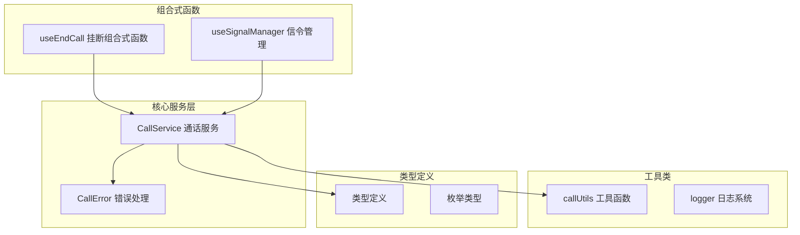
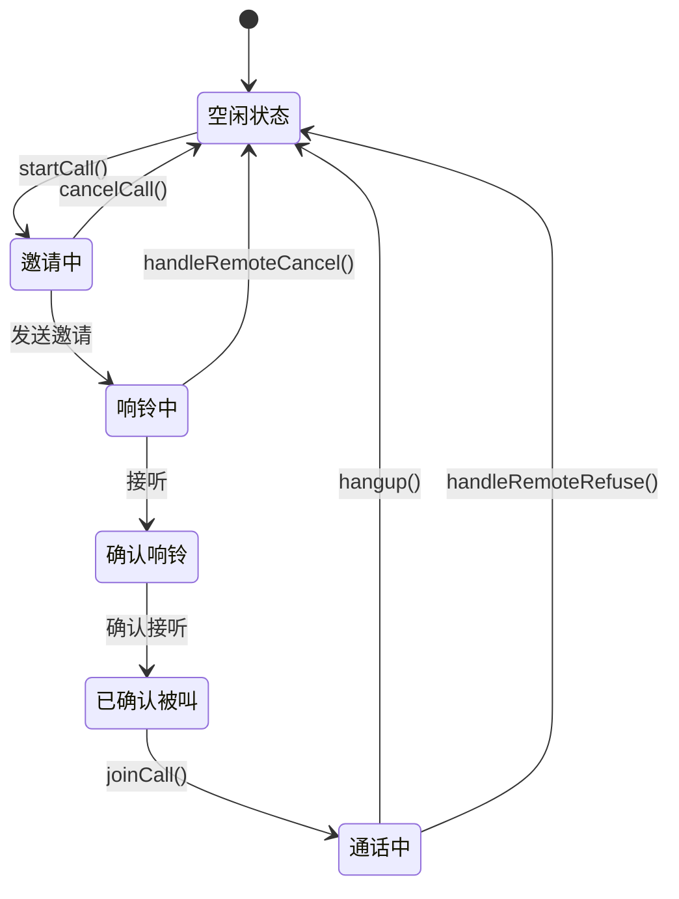
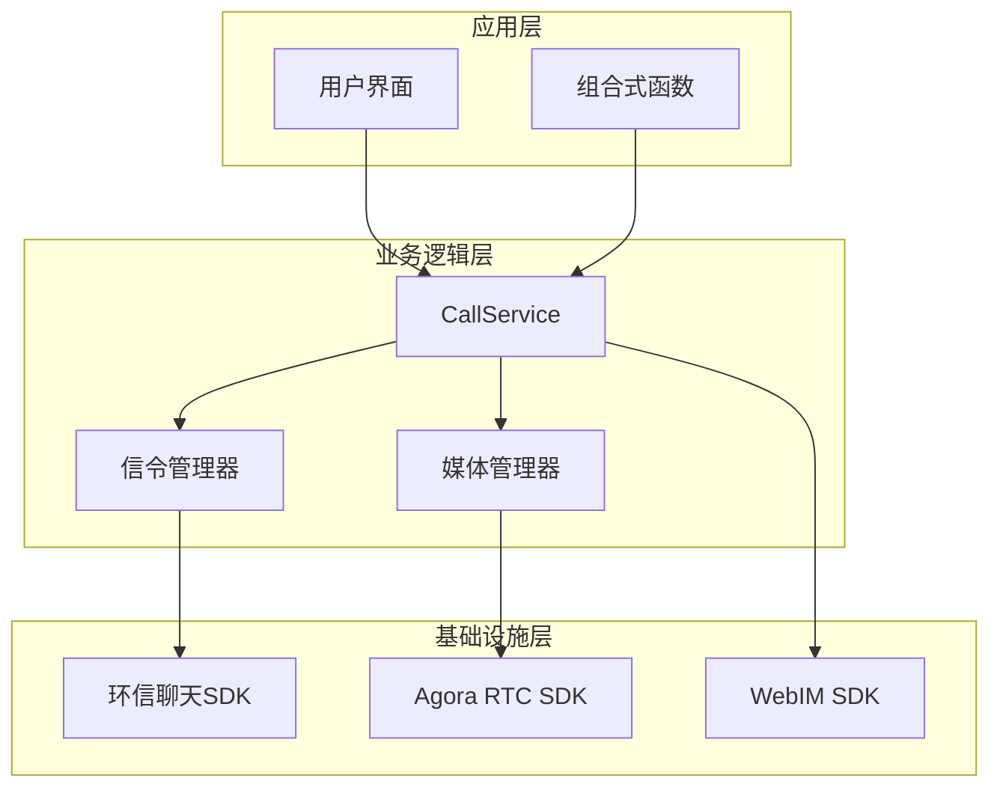
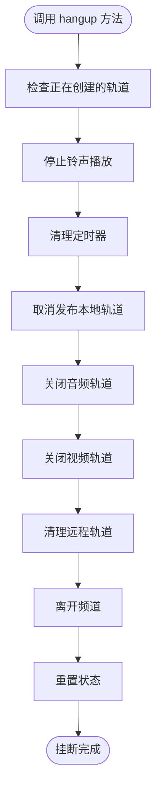
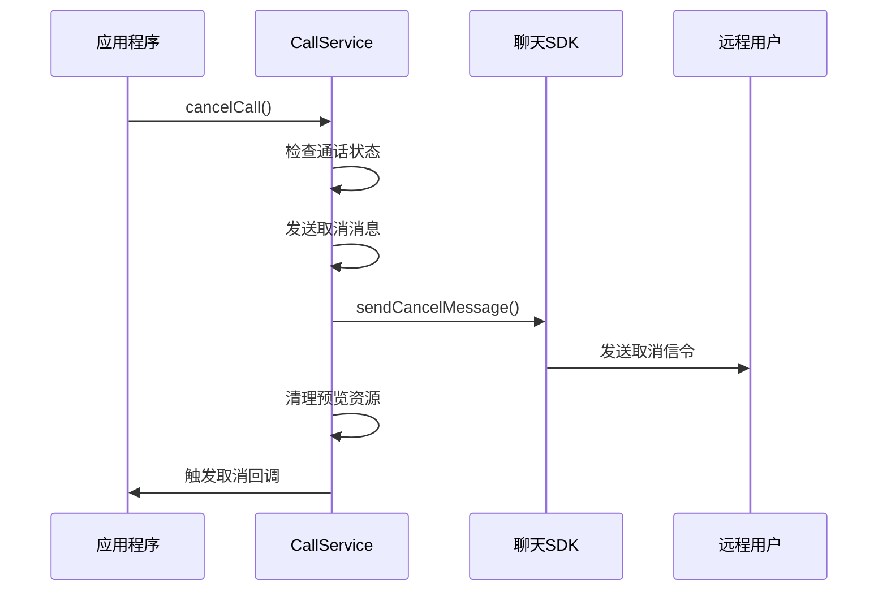
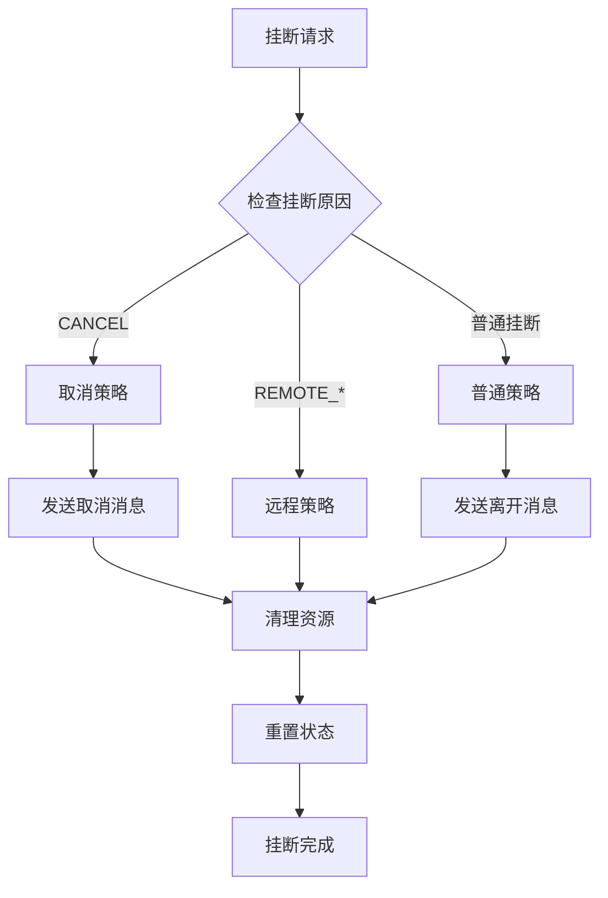
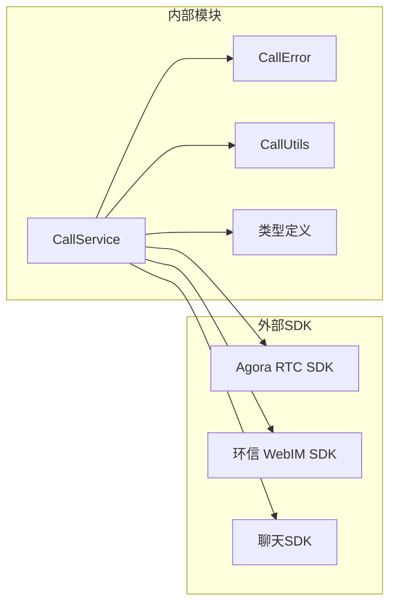
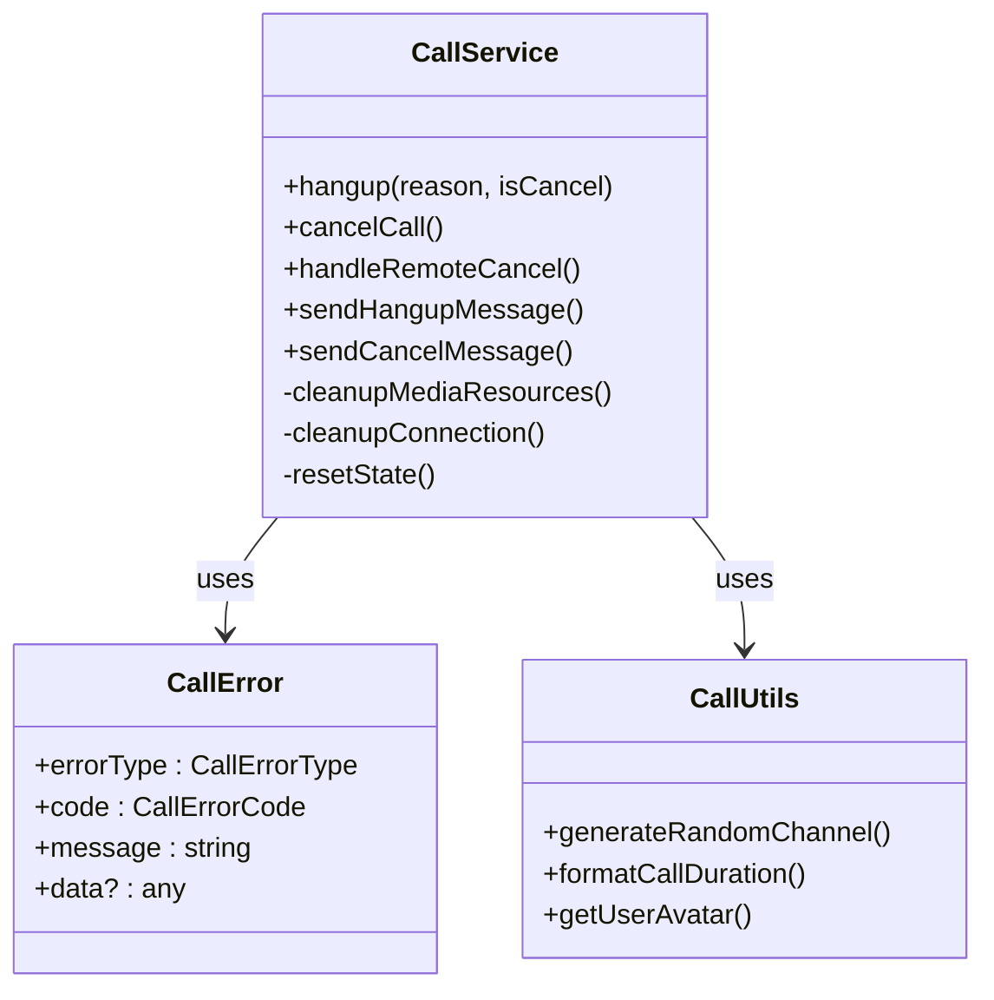

# CallService 通话服务

<cite>
**本文档引用的文件**
- [CallService.ts](file://callkit/services/CallService.ts)
- [CallError.ts](file://callkit/services/CallError.ts)
- [callUtils.ts](file://callkit/utils/callUtils.ts)
- [index.ts](file://callkit/types/index.ts)
- [CallService.ts](file://lib/services/CallService.ts)
- [useEndCall.ts](file://lib/composables/useEndCall.ts)
</cite>

## 目录
1. [简介](#简介)
2. [项目结构](#项目结构)
3. [核心组件](#核心组件)
4. [架构概览](#架构概览)
5. [详细组件分析](#详细组件分析)
6. [依赖关系分析](#依赖关系分析)
7. [性能考虑](#性能考虑)
8. [故障排除指南](#故障排除指南)
9. [结论](#结论)

## 简介

CallService 是 EasyWeb IM 通话服务的核心组件，负责管理实时通信会话的完整生命周期。该服务集成了环信即时通讯 SDK 和 Agora 实时音视频 SDK，提供了完整的通话功能，包括呼叫发起、接听、挂断、媒体资源管理等。

## 项目结构

项目采用模块化架构设计，主要包含以下核心模块：

**图表来源**
- [CallService.ts](file://callkit/services/CallService.ts#L116-L4478)
- [CallError.ts](file://callkit/services/CallError.ts#L1-L43)
- [callUtils.ts](file://callkit/utils/callUtils.ts#L1-L85)

**章节来源**
- [CallService.ts](file://callkit/services/CallService.ts#L1-L100)
- [index.ts](file://callkit/types/index.ts#L1-L356)

## 核心组件

### 通话状态管理

CallService 提供了完整的通话状态管理机制，支持多种通话类型和状态转换：

**图表来源**
- [CallService.ts](file://callkit/services/CallService.ts#L15-L32)
- [CallService.ts](file://callkit/services/CallService.ts#L1360-L1683)

### 通话类型支持

服务支持四种主要的通话类型：
- **一对一音频通话** (`AUDIO_1V1`)
- **一对一视频通话** (`VIDEO_1V1`) 
- **多人音频通话** (`AUDIO_MULTI`)
- **多人视频通话** (`VIDEO_MULTI`)

**章节来源**
- [CallService.ts](file://callkit/services/CallService.ts#L26-L32)

## 架构概览

CallService 采用分层架构设计，实现了清晰的关注点分离：

**图表来源**
- [CallService.ts](file://callkit/services/CallService.ts#L1-L285)
- [CallService.ts](file://lib/services/CallService.ts#L1-L298)

## 详细组件分析

### 挂断相关方法详解

#### hangup() 方法

hangup() 是通话服务的核心挂断方法，负责处理各种挂断场景：

**方法签名与参数**
- 参数: `reason: string = HANGUP_REASON.HANGUP`
- 参数: `isCancel: boolean = false`
- 返回值: `Promise<void>`

**内部执行流程**

**图表来源**
- [CallService.ts](file://callkit/services/CallService.ts#L1360-L1683)

**异常处理机制**
- 轨道清理过程中的错误会被捕获并记录
- 即使出现异常，也会尽力重置基本状态
- 使用 try-catch 包装所有清理操作

**媒体资源清理策略**
- 优先取消发布本地轨道，避免资源泄漏
- 彻底停止底层 MediaStreamTrack
- 清理所有缓存的视频流
- 释放摄像头和麦克风硬件资源

**章节来源**
- [CallService.ts](file://callkit/services/CallService.ts#L1360-L1683)

#### cancelCall() 方法

cancelCall() 专门处理主动取消呼叫的场景：

**核心特性**
- 仅在邀请阶段有效（CALL_STATUS.INVITING）
- 向被叫方发送取消消息
- 清理预览模式资源
- 触发相应的 UI 更新

**执行流程**

**图表来源**
- [CallService.ts](file://callkit/services/CallService.ts#L1685-L1720)

**章节来源**
- [CallService.ts](file://callkit/services/CallService.ts#L1685-L1720)

#### handleRemoteCancel() 方法

handleRemoteCancel() 处理来自远程用户的取消操作：

**处理逻辑**
- 接收远程取消信令
- 检查通话状态一致性
- 触发相应的挂断流程
- 更新 UI 状态

**章节来源**
- [CallService.ts](file://callkit/services/CallService.ts#L2653-L2668)

### 信令发送机制

#### leaveCall 信令发送

leaveCall 信令用于通知通话中的其他参与者用户已离开：

**发送条件**
- 一对一通话：发送给被叫方或主叫方
- 多人通话：发送给所有已加入的成员

**实现细节**
- 使用 receiverList 指定接收者列表
- 支持群组定向消息
- 异常情况下不会影响挂断流程

**章节来源**
- [CallService.ts](file://callkit/services/CallService.ts#L1722-L1775)

#### cancelCall 信令发送

cancelCall 信令用于主动取消正在进行的呼叫邀请：

**发送策略**
- 仅向未加入的成员发送
- 优化消息发送，避免重复通知
- 支持群组和一对一场景

**章节来源**
- [CallService.ts](file://callkit/services/CallService.ts#L1685-L1720)

### 挂断策略机制

CallService 实现了灵活的挂断策略，根据不同场景采用不同的处理方式：

**图表来源**
- [CallService.ts](file://lib/services/CallService.ts#L74-L192)

**章节来源**
- [CallService.ts](file://lib/services/CallService.ts#L74-L192)

## 依赖关系分析

### 外部依赖

CallService 依赖多个外部 SDK 和库：

**图表来源**
- [CallService.ts](file://callkit/services/CallService.ts#L1-L12)

### 内部依赖关系

**图表来源**
- [CallService.ts](file://callkit/services/CallService.ts#L116-L4478)
- [CallError.ts](file://callkit/services/CallError.ts#L18-L42)
- [callUtils.ts](file://callkit/utils/callUtils.ts#L1-L85)

**章节来源**
- [CallService.ts](file://callkit/services/CallService.ts#L1-L285)
- [CallError.ts](file://callkit/services/CallError.ts#L1-L43)
- [callUtils.ts](file://callkit/utils/callUtils.ts#L1-L85)

## 性能考虑

### 资源管理优化

CallService 实现了多项性能优化措施：

1. **轨道复用机制**：避免重复创建媒体轨道
2. **异步清理**：使用 Promise 和定时器确保资源完全释放
3. **内存管理**：及时清理事件监听器和缓存数据
4. **设备资源优化**：合理管理摄像头和麦克风资源

### 并发控制

- 使用 `isAnswering` 标志防止重复接听
- 轨道创建过程中的竞态条件处理
- 多设备场景下的状态同步

## 故障排除指南

### 常见问题及解决方案

**问题1：挂断后资源未完全释放**
- 检查轨道是否正确取消发布
- 确认所有 MediaStreamTrack 都已停止
- 验证事件监听器是否已移除

**问题2：铃声播放异常**
- 检查铃声文件路径配置
- 验证音频权限和浏览器兼容性
- 确认铃声对象正确初始化

**问题3：信令发送失败**
- 检查网络连接状态
- 验证用户身份认证
- 确认目标用户在线状态

**章节来源**
- [CallService.ts](file://callkit/services/CallService.ts#L4154-L4215)

## 结论

CallService 通话服务提供了完整、健壮的实时通信解决方案。其设计特点包括：

1. **完整的生命周期管理**：从邀请到挂断的全流程覆盖
2. **灵活的策略机制**：针对不同场景的智能处理
3. **完善的错误处理**：全面的异常捕获和恢复机制
4. **优化的资源管理**：高效的媒体资源和内存管理
5. **清晰的架构设计**：模块化和可维护性的良好平衡

该服务为开发者提供了可靠的通话功能基础，支持多种通话场景和复杂的业务需求。