# RtcService 音视频服务

<cite>
**本文档引用的文件**
- [lib/services/RtcService.ts](file://lib/services/RtcService.ts)
- [lib/composables/useRtcService.ts](file://lib/composables/useRtcService.ts)
- [lib/store/rtcChannel.ts](file://lib/store/rtcChannel.ts)
- [lib/store/types.ts](file://lib/store/types.ts)
- [lib/types/callstate.types.ts](file://lib/types/callstate.types.ts)
- [lib/utils/logger.ts](file://lib/utils/logger.ts)
- [callkit/services/CallService.ts](file://callkit/services/CallService.ts)
- [callkit/utils/callUtils.ts](file://callkit/utils/callUtils.ts)
</cite>

## 目录
1. [简介](#简介)
2. [项目结构](#项目结构)
3. [核心组件](#核心组件)
4. [架构概览](#架构概览)
5. [详细组件分析](#详细组件分析)
6. [依赖关系分析](#依赖关系分析)
7. [性能考虑](#性能考虑)
8. [故障排除指南](#故障排除指南)
9. [结论](#结论)
10. [附录](#附录)

## 简介

RtcService 是本项目中的核心音视频服务组件，基于 Agora RTC SDK 实现，负责管理音视频通话的完整生命周期。该服务提供了完整的 WebRTC 音视频操作封装，包括频道管理、设备控制、媒体轨道管理等功能。

主要职责包括：
- 初始化 WebRTC 连接和客户端
- 管理本地音视频流的创建、发布和销毁
- 处理远程用户的订阅和轨道管理
- 设备切换和状态监控
- 网络质量监控和音量指示器
- 事件监听和错误处理

## 项目结构

项目采用模块化架构设计，RtcService 位于 lib/services 目录下，配合 Pinia 状态管理和 Vue 组合式 API 提供响应式数据绑定。

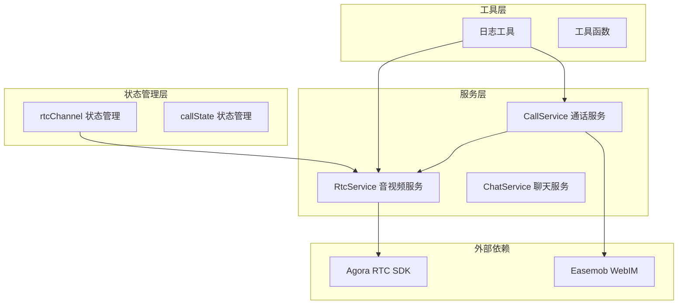

**图表来源**
- [lib/services/RtcService.ts](file://lib/services/RtcService.ts#L1-L719)
- [lib/store/rtcChannel.ts](file://lib/store/rtcChannel.ts#L1-L410)

**章节来源**
- [lib/services/RtcService.ts](file://lib/services/RtcService.ts#L1-L719)
- [lib/store/rtcChannel.ts](file://lib/store/rtcChannel.ts#L1-L410)

## 核心组件

### RtcService 类

RtcService 是音视频服务的核心实现，提供了完整的 WebRTC 功能封装：

#### 主要功能特性
- **频道管理**: 加入/离开频道、频道状态监控
- **轨道管理**: 本地/远程音视频轨道的创建、发布、订阅、销毁
- **设备控制**: 摄像头和麦克风的切换、状态管理
- **事件处理**: 用户加入/离开、发布/取消发布、网络质量变化
- **状态监控**: 音量指示器、网络质量监控

#### 核心配置接口
```typescript
interface RtcServiceConfig {
  appId: string
  encoderConfig?: VideoEncoderConfigurationPreset
  onNetworkQualityChange?: (quality: any) => void
  onUserJoined?: (userId: string) => void
  onUserLeft?: (userId: string) => void
  onUserPublished?: (user: IAgoraRTCRemoteUser, mediaType: 'audio' | 'video') => void
  onUserUnpublished?: (user: IAgoraRTCRemoteUser, mediaType: 'audio' | 'video') => void
  onVolumeIndicator?: (volumes: any[]) => void
  chatClient?: any
}
```

**章节来源**
- [lib/services/RtcService.ts](file://lib/services/RtcService.ts#L30-L40)

### 状态管理系统

系统采用 Pinia 状态管理，提供响应式的音视频状态管理：

#### 状态数据结构
```typescript
interface RtcChannelState {
  channels: Record<string, RtcChannelInfo>
  activeChannelId: string | null
  isConnected: boolean
  localStream: MediaStream | null
  remoteStreams: Record<string, MediaStream>
  audioEnabled: boolean
  videoEnabled: boolean
  rtcService: any
  agoraAppId: string | null
  callDuration: number
  callStartTime: number
  uidToUserIdMap: Map<string, string>
  joinedRtcUsers: Set<string>
  pendingUserIds: Set<string>
  leftUsers: Set<string>
}
```

**章节来源**
- [lib/store/types.ts](file://lib/store/types.ts#L58-L75)

## 架构概览

RtcService 采用分层架构设计，各组件职责清晰分离：

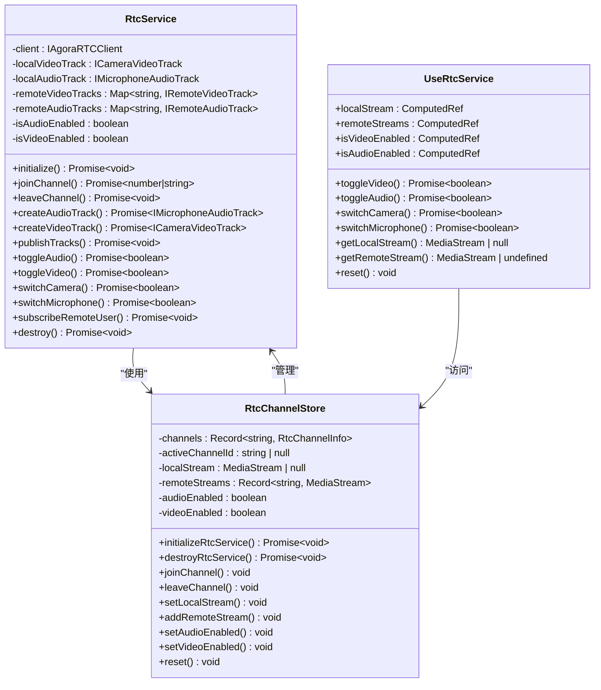

**图表来源**
- [lib/services/RtcService.ts](file://lib/services/RtcService.ts#L42-L77)
- [lib/store/rtcChannel.ts](file://lib/store/rtcChannel.ts#L7-L28)
- [lib/composables/useRtcService.ts](file://lib/composables/useRtcService.ts#L52-L192)

## 详细组件分析

### 频道管理功能

#### 加入频道流程
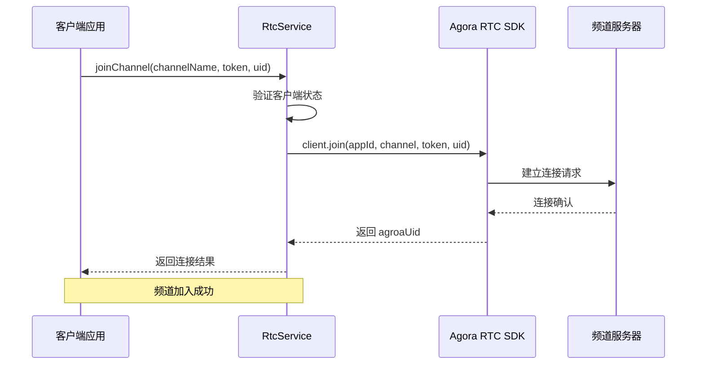

**图表来源**
- [lib/services/RtcService.ts](file://lib/services/RtcService.ts#L109-L138)

#### 离开频道流程
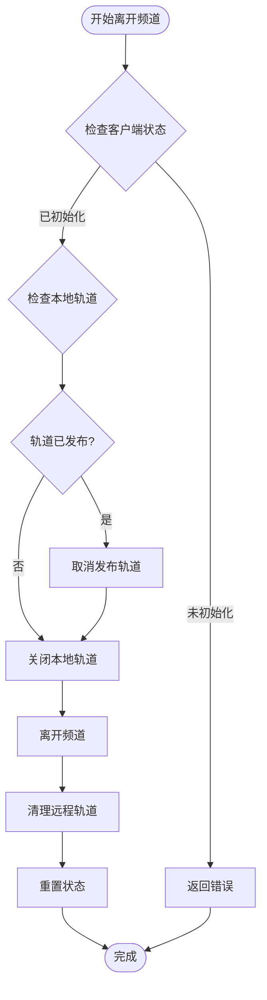

**图表来源**
- [lib/services/RtcService.ts](file://lib/services/RtcService.ts#L143-L171)

**章节来源**
- [lib/services/RtcService.ts](file://lib/services/RtcService.ts#L109-L171)

### 媒体轨道管理

#### 本地轨道创建和发布
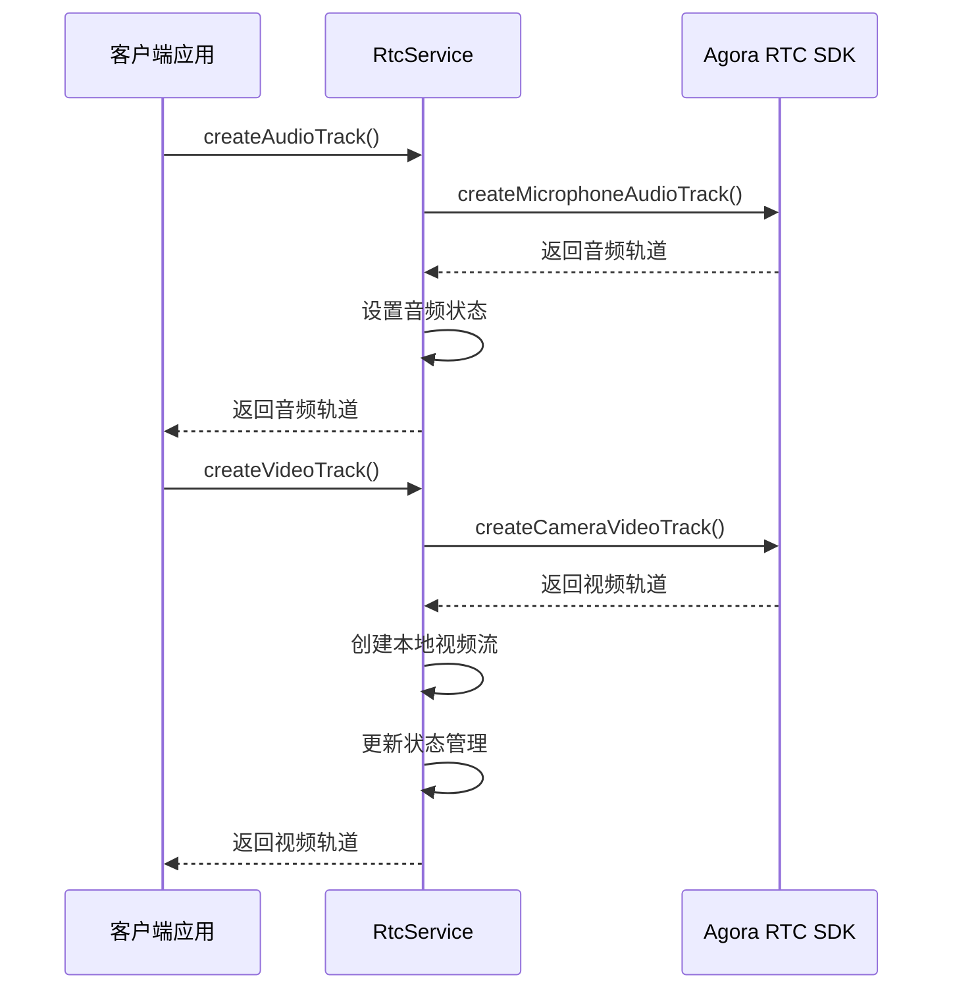

**图表来源**
- [lib/services/RtcService.ts](file://lib/services/RtcService.ts#L176-L221)

#### 轨道状态切换机制
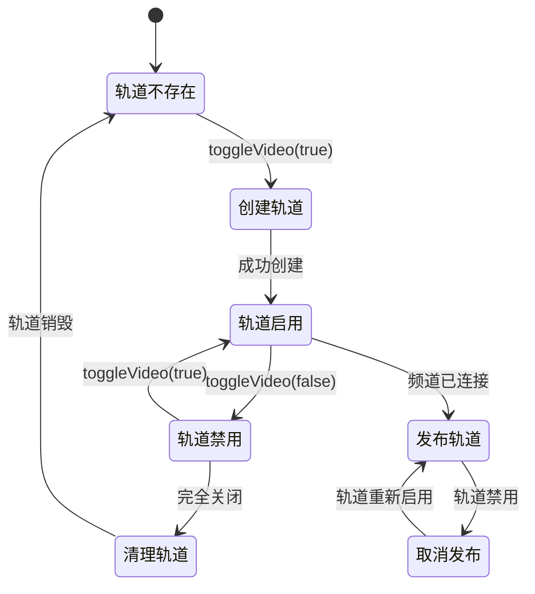

**图表来源**
- [lib/services/RtcService.ts](file://lib/services/RtcService.ts#L272-L354)

**章节来源**
- [lib/services/RtcService.ts](file://lib/services/RtcService.ts#L176-L354)

### 设备控制功能

#### 摄像头切换流程
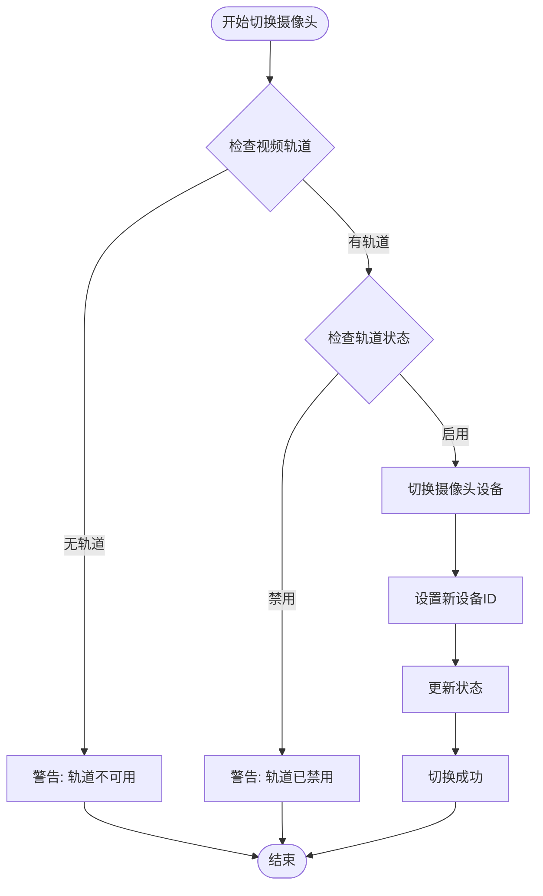

**图表来源**
- [lib/services/RtcService.ts](file://lib/services/RtcService.ts#L359-L375)

#### 麦克风切换流程
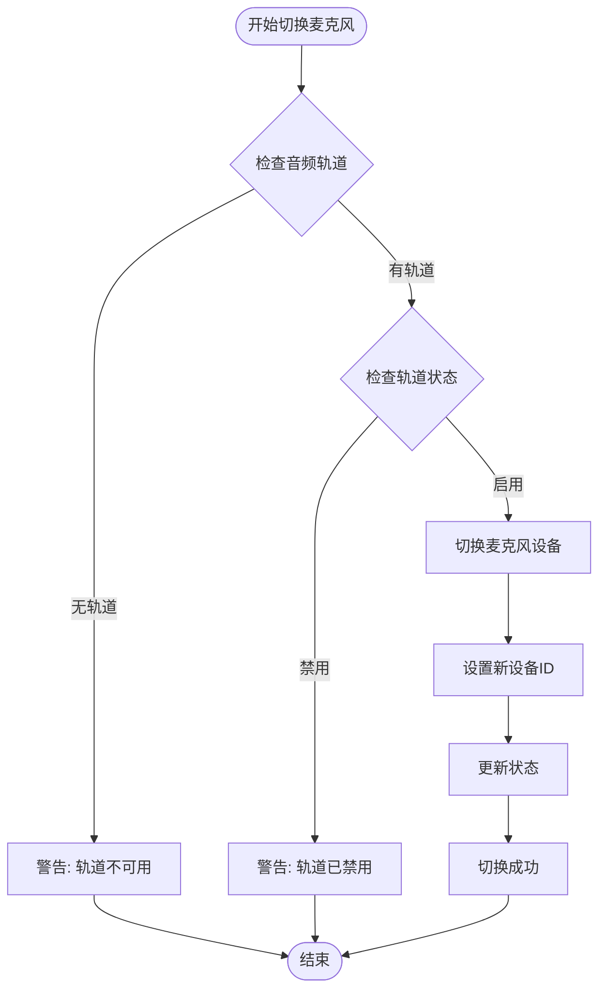

**图表来源**
- [lib/services/RtcService.ts](file://lib/services/RtcService.ts#L380-L394)

**章节来源**
- [lib/services/RtcService.ts](file://lib/services/RtcService.ts#L359-L394)

### 事件处理和回调

#### 用户加入事件处理
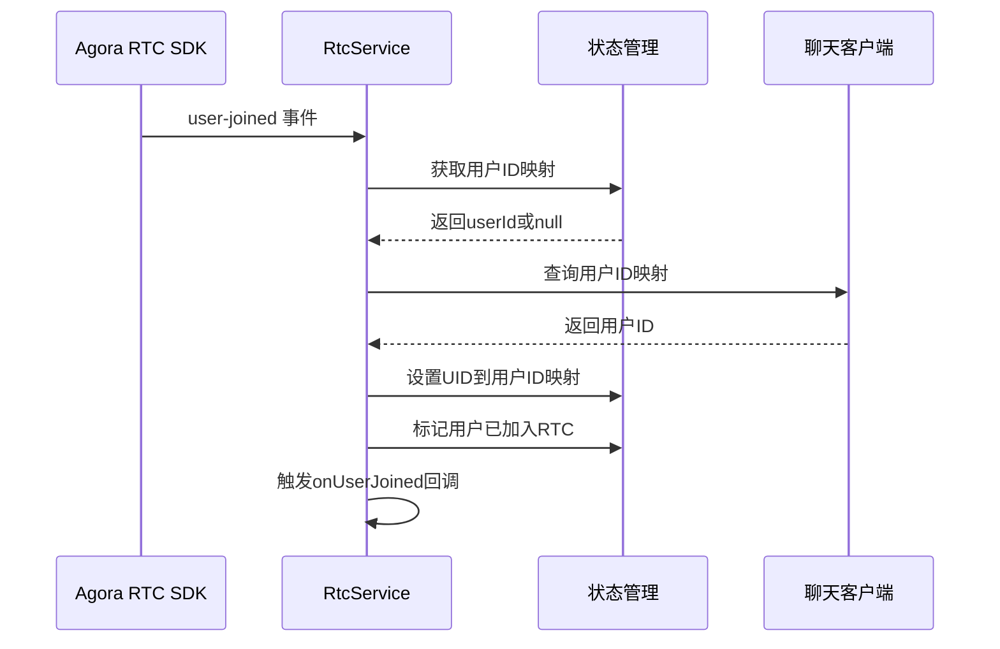

**图表来源**
- [lib/services/RtcService.ts](file://lib/services/RtcService.ts#L548-L593)

#### 自动订阅机制
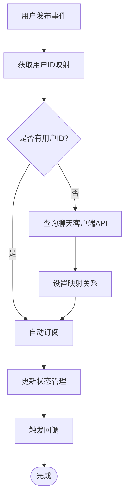

**图表来源**
- [lib/services/RtcService.ts](file://lib/services/RtcService.ts#L615-L649)

**章节来源**
- [lib/services/RtcService.ts](file://lib/services/RtcService.ts#L548-L673)

### 组合式API集成

#### useRtcService 组合式函数
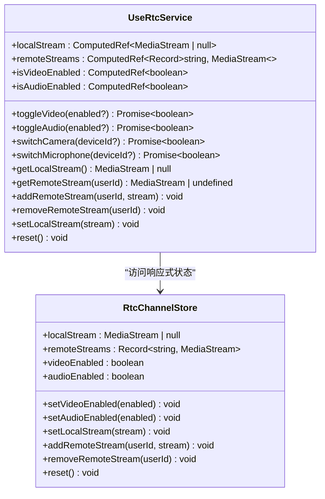

**图表来源**
- [lib/composables/useRtcService.ts](file://lib/composables/useRtcService.ts#L52-L192)
- [lib/store/rtcChannel.ts](file://lib/store/rtcChannel.ts#L56-L60)

**章节来源**
- [lib/composables/useRtcService.ts](file://lib/composables/useRtcService.ts#L52-L192)

## 依赖关系分析

### 外部依赖关系

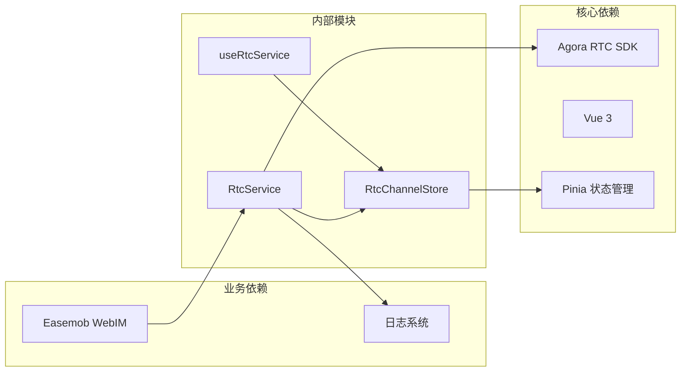

**图表来源**
- [lib/services/RtcService.ts](file://lib/services/RtcService.ts#L18-L28)
- [lib/store/rtcChannel.ts](file://lib/store/rtcChannel.ts#L1-L6)

### 内部模块耦合

系统采用松耦合设计，通过接口和事件实现模块间通信：

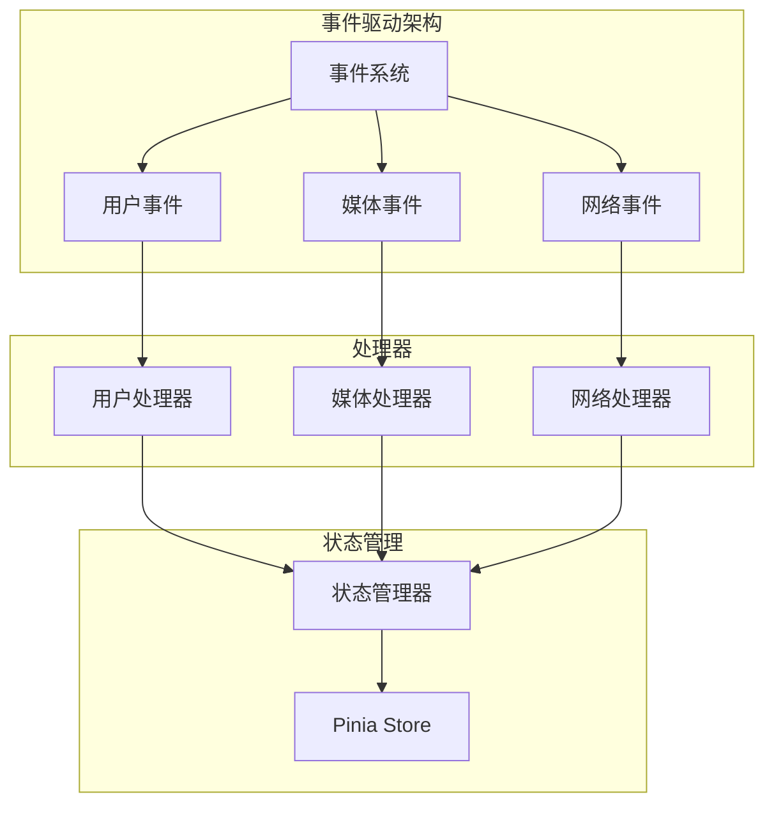

**图表来源**
- [lib/services/RtcService.ts](file://lib/services/RtcService.ts#L544-L673)
- [lib/store/rtcChannel.ts](file://lib/store/rtcChannel.ts#L27-L30)

**章节来源**
- [lib/services/RtcService.ts](file://lib/services/RtcService.ts#L18-L28)
- [lib/store/rtcChannel.ts](file://lib/store/rtcChannel.ts#L1-L6)

## 性能考虑

### 资源管理优化

1. **轨道生命周期管理**: 确保轨道创建、使用和销毁的完整生命周期管理
2. **内存泄漏防护**: 通过事件监听器的正确注册和移除防止内存泄漏
3. **设备资源释放**: 及时停止和关闭媒体轨道以释放设备资源
4. **状态同步**: 使用响应式状态管理确保UI和业务逻辑的一致性

### 性能监控指标

- **网络质量监控**: 实时监控上行/下行网络质量
- **音量指示器**: 监控用户说话状态和音量水平
- **连接状态跟踪**: 跟踪客户端连接状态变化
- **轨道状态监控**: 监控本地和远程轨道的健康状态

### 最佳实践建议

1. **及时清理资源**: 在组件卸载时调用 `destroy()` 方法清理所有资源
2. **错误处理**: 实现完善的错误处理机制，包括网络异常和设备权限问题
3. **状态管理**: 使用 Pinia 状态管理确保全局状态一致性
4. **性能监控**: 定期监控网络质量和设备状态

## 故障排除指南

### 常见问题及解决方案

#### 频道加入失败
**问题症状**: 加入频道时抛出异常或连接超时
**可能原因**:
- 网络连接不稳定
- Token 验证失败
- AppId 配置错误
- 用户权限不足

**解决步骤**:
1. 检查网络连接状态
2. 验证 AppId 和 Token 配置
3. 确认用户具有加入频道的权限
4. 查看日志获取详细错误信息

#### 轨道创建失败
**问题症状**: 无法创建音频或视频轨道
**可能原因**:
- 设备权限未授权
- 设备被其他应用占用
- 浏览器兼容性问题
- 设备ID无效

**解决步骤**:
1. 检查浏览器权限设置
2. 关闭其他占用设备的应用
3. 尝试刷新页面重新获取权限
4. 检查设备ID的有效性

#### 音视频质量差
**问题症状**: 音频卡顿、视频模糊或延迟高
**可能原因**:
- 网络带宽不足
- CPU 使用率过高
- 设备性能不足
- 编码配置不当

**解决步骤**:
1. 降低视频分辨率和帧率
2. 关闭不必要的应用程序
3. 检查设备温度和风扇状态
4. 调整编码配置参数

### 调试工具和方法

#### 日志系统
系统内置完整的日志系统，支持不同级别的日志输出：

```typescript
// 日志级别定义
enum LogLevel {
  ERROR,    // 错误日志
  WARN,     // 警告日志  
  INFO,     // 信息日志
  DEBUG,    // 调试日志
  VERBOSE   // 详细日志
}
```

**章节来源**
- [lib/utils/logger.ts](file://lib/utils/logger.ts#L1-L231)

#### 错误处理机制
```mermaid
flowchart TD
ErrorOccurred[发生错误] --> CheckErrorType{检查错误类型}
CheckErrorType --> |网络错误| HandleNetworkError[处理网络错误]
CheckErrorType --> |设备错误| HandleDeviceError[处理设备错误]
CheckErrorType --> |业务错误| HandleBusinessError[处理业务错误]
CheckErrorType --> |其他错误| HandleOtherError[处理其他错误]
HandleNetworkError --> RetryOperation[重试操作]
HandleDeviceError --> RequestPermission[请求权限]
HandleBusinessError --> ShowErrorMessage[显示错误信息]
HandleOtherError --> LogError[记录错误日志]
RetryOperation --> CheckRetryLimit{检查重试次数}
CheckRetryLimit --> |超过限制| FallbackToDefault[回退到默认状态]
CheckRetryLimit --> |未超过| WaitAndRetry[等待后重试]
WaitAndRetry --> ErrorOccurred
FallbackToDefault --> End([结束])
ShowErrorMessage --> End
LogError --> End
```

**图表来源**
- [lib/services/RtcService.ts](file://lib/services/RtcService.ts#L92-L95)

## 结论

RtcService 音视频服务提供了完整的 WebRTC 音视频通话解决方案，具有以下特点：

### 核心优势
1. **完整的功能覆盖**: 包含频道管理、设备控制、轨道管理等所有核心功能
2. **良好的架构设计**: 采用分层架构和事件驱动模式，职责清晰
3. **完善的错误处理**: 提供全面的错误处理和恢复机制
4. **性能优化**: 注重资源管理和性能监控
5. **易于集成**: 提供清晰的 API 接口和组合式 API

### 技术特色
- 基于 Agora RTC SDK 的专业音视频能力
- 响应式状态管理确保 UI 和业务逻辑同步
- 事件驱动的架构设计支持灵活的功能扩展
- 完善的日志系统便于问题诊断和性能分析

### 应用场景
该服务适用于各种音视频通话场景，包括：
- 一对一视频通话
- 多人视频会议
- 音频通话
- 在线教育和培训
- 远程医疗咨询

通过合理使用 RtcService，开发者可以快速构建稳定可靠的音视频通话功能，为用户提供优质的实时通信体验。

## 附录

### API 参考

#### RtcService 主要方法

| 方法名 | 参数 | 返回值 | 描述 |
|--------|------|--------|------|
| `initialize` | 无 | `Promise<void>` | 初始化 RTC 客户端 |
| `joinChannel` | `channelName, token, uid, appId?` | `Promise<number|string>` | 加入频道 |
| `leaveChannel` | 无 | `Promise<void>` | 离开频道 |
| `createAudioTrack` | 无 | `Promise<IMicrophoneAudioTrack>` | 创建音频轨道 |
| `createVideoTrack` | 无 | `Promise<ICameraVideoTrack>` | 创建视频轨道 |
| `publishTracks` | `tracks: any[]` | `Promise<void>` | 发布本地轨道 |
| `toggleAudio` | `enabled?: boolean` | `Promise<boolean>` | 切换音频状态 |
| `toggleVideo` | `enabled?: boolean` | `Promise<boolean>` | 切换视频状态 |
| `switchCamera` | `deviceId: string` | `Promise<boolean>` | 切换摄像头 |
| `switchMicrophone` | `deviceId: string` | `Promise<boolean>` | 切换麦克风 |
| `subscribeRemoteUser` | `user, mediaType` | `Promise<void>` | 订阅远程用户 |
| `destroy` | 无 | `Promise<void>` | 销毁服务 |

#### 状态管理 API

| 方法名 | 参数 | 返回值 | 描述 |
|--------|------|--------|------|
| `initializeRtcService` | `agoraAppId: string` | `Promise<void>` | 初始化 RTC 服务 |
| `destroyRtcService` | 无 | `Promise<void>` | 销毁 RTC 服务 |
| `joinChannel` | `channelId: string, userId: string` | 无 | 加入频道 |
| `leaveChannel` | `channelId: string, userId: string` | 无 | 离开频道 |
| `setLocalStream` | `stream: MediaStream | null` | 无 | 设置本地流 |
| `addRemoteStream` | `userId: string, stream: MediaStream` | 无 | 添加远程流 |
| `setAudioEnabled` | `enabled: boolean` | 无 | 设置音频状态 |
| `setVideoEnabled` | `enabled: boolean` | 无 | 设置视频状态 |
| `reset` | 无 | 无 | 重置状态 |

### 最佳实践清单

1. **资源管理**
   - 在组件卸载时调用 `destroy()` 方法
   - 及时停止和关闭不需要的轨道
   - 监控设备使用状态

2. **错误处理**
   - 实现完整的错误捕获和处理
   - 提供用户友好的错误提示
   - 记录详细的错误日志

3. **性能优化**
   - 合理设置编码参数
   - 监控网络质量和设备状态
   - 优化 UI 更新频率

4. **用户体验**
   - 提供清晰的状态反馈
   - 实现优雅的降级策略
   - 支持多种设备和浏览器