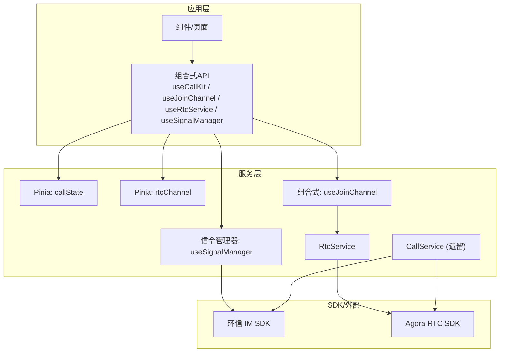
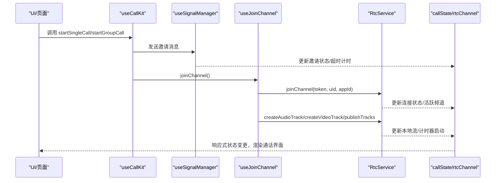
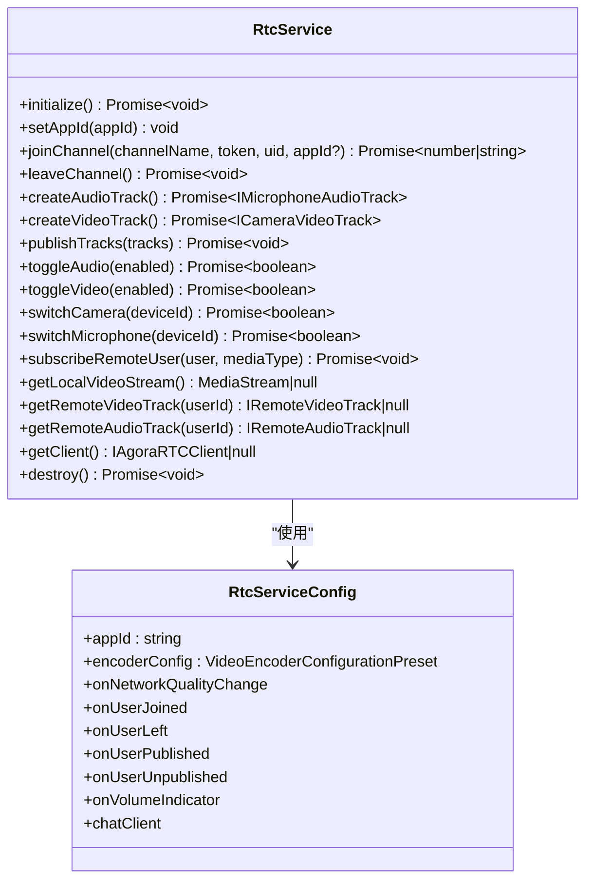
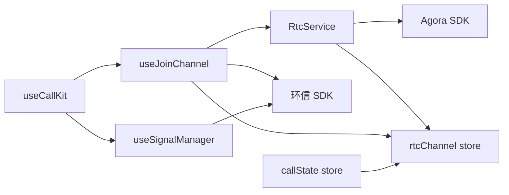

# 服务层 API

<cite>
**本文引用的文件**
- [lib/index.ts](file://lib/index.ts)
- [lib/services/RtcService.ts](file://lib/services/RtcService.ts)
- [lib/composables/useRtcService.ts](file://lib/composables/useRtcService.ts)
- [lib/store/rtcChannel.ts](file://lib/store/rtcChannel.ts)
- [lib/composables/useJoinChannel.ts](file://lib/composables/useJoinChannel.ts)
- [lib/composables/useCallKit.ts](file://lib/composables/useCallKit.ts)
- [lib/composables/useSignalManager.ts](file://lib/composables/useSignalManager.ts)
- [lib/store/callState.ts](file://lib/store/callState.ts)
- [lib/types.ts](file://lib/types.ts)
- [lib/core/sdk/imSDK/index.ts](file://lib/core/sdk/imSDK/index.ts)
- [callkit/services/CallService.ts](file://callkit/services/CallService.ts)
- [callkit/services/CallError.ts](file://callkit/services/CallError.ts)
- [callkit/types/index.ts](file://callkit/types/index.ts)
</cite>

## 目录
1. [简介](#简介)
2. [项目结构](#项目结构)
3. [核心组件](#核心组件)
4. [架构总览](#架构总览)
5. [详细组件分析](#详细组件分析)
6. [依赖关系分析](#依赖关系分析)
7. [性能考量](#性能考量)
8. [故障排查指南](#故障排查指南)
9. [结论](#结论)
10. [附录](#附录)

## 简介
本文件面向服务层 API 的使用者与维护者，系统性梳理并说明服务层中 CallService 与 RtcService 的接口定义、方法签名、属性、配置项、生命周期与依赖注入方式，以及服务间的协作与事件通信机制。文档同时提供服务初始化流程、配置与扩展方法、在应用中的集成步骤与最佳实践，帮助开发者快速、正确地在项目中使用与扩展音视频通话能力。

## 项目结构
服务层主要位于 lib 目录，围绕“信令层”“实时音视频层”“状态管理层”“组合式 API 层”组织，形成清晰的分层职责与依赖关系：
- 信令层：负责与环信 IM 交互，发送/接收通话相关命令消息
- 实时音视频层：封装 Agora WebRTC 能力，管理本地/远端音视频轨道与频道
- 状态管理层：使用 Pinia 管理通话状态、频道状态、用户映射等
- 组合式 API 层：对外暴露易用的响应式 API，简化上层调用

图表来源
- [lib/composables/useCallKit.ts](file://lib/composables/useCallKit.ts#L1-L123)
- [lib/composables/useJoinChannel.ts](file://lib/composables/useJoinChannel.ts#L1-L185)
- [lib/composables/useRtcService.ts](file://lib/composables/useRtcService.ts#L1-L192)
- [lib/composables/useSignalManager.ts](file://lib/composables/useSignalManager.ts#L1-L354)
- [lib/store/callState.ts](file://lib/store/callState.ts#L1-L263)
- [lib/store/rtcChannel.ts](file://lib/store/rtcChannel.ts#L1-L410)
- [lib/services/RtcService.ts](file://lib/services/RtcService.ts#L1-L719)
- [lib/core/sdk/imSDK/index.ts](file://lib/core/sdk/imSDK/index.ts#L1-L12)
- [callkit/services/CallService.ts](file://callkit/services/CallService.ts#L1-L4478)

章节来源
- [lib/index.ts](file://lib/index.ts#L1-L58)

## 核心组件
- RtcService：封装 Agora WebRTC 的客户端、音视频轨道创建与发布、订阅、设备切换、网络质量与音量指示等能力
- useRtcService：组合式 API，提供响应式状态与音视频控制方法
- useJoinChannel：封装加入/离开频道、获取 Token、创建并发布轨道的流程
- useSignalManager：集中管理所有通话信令的发送（邀请、接听、取消、离开等）
- useCallKit：对外暴露的高层 API，封装单人/群组通话发起流程
- Pinia 状态：callState 与 rtcChannel，分别管理通话状态与频道/媒体状态
- CallService（遗留）：历史实现，仍保留部分逻辑与错误类型定义

章节来源
- [lib/services/RtcService.ts](file://lib/services/RtcService.ts#L1-L719)
- [lib/composables/useRtcService.ts](file://lib/composables/useRtcService.ts#L1-L192)
- [lib/composables/useJoinChannel.ts](file://lib/composables/useJoinChannel.ts#L1-L185)
- [lib/composables/useSignalManager.ts](file://lib/composables/useSignalManager.ts#L1-L354)
- [lib/composables/useCallKit.ts](file://lib/composables/useCallKit.ts#L1-L123)
- [lib/store/callState.ts](file://lib/store/callState.ts#L1-L263)
- [lib/store/rtcChannel.ts](file://lib/store/rtcChannel.ts#L1-L410)
- [callkit/services/CallService.ts](file://callkit/services/CallService.ts#L1-L4478)

## 架构总览
服务层采用“组合式 API + Pinia 状态 + 服务封装”的设计，将复杂流程拆分为可复用的模块：
- 信令与状态：通过 useSignalManager 与 Pinia store 协作，保证 UI 与业务状态一致
- 音视频：通过 RtcService 与 useRtcService 解耦设备与轨道管理，便于测试与替换
- 生命周期：从“发起邀请”到“加入频道”再到“发布轨道”，每一步都有明确的状态推进与资源清理

图表来源
- [lib/composables/useCallKit.ts](file://lib/composables/useCallKit.ts#L1-L123)
- [lib/composables/useSignalManager.ts](file://lib/composables/useSignalManager.ts#L1-L354)
- [lib/composables/useJoinChannel.ts](file://lib/composables/useJoinChannel.ts#L1-L185)
- [lib/services/RtcService.ts](file://lib/services/RtcService.ts#L1-L719)
- [lib/store/callState.ts](file://lib/store/callState.ts#L1-L263)
- [lib/store/rtcChannel.ts](file://lib/store/rtcChannel.ts#L1-L410)

## 详细组件分析

### RtcService（实时音视频服务）
职责与能力
- 初始化 Agora 客户端、设置角色、注册事件监听
- 管理本地音视频轨道的创建、发布与切换
- 订阅远端用户的音视频轨道并播放
- 设备切换（摄像头/麦克风）、网络质量与音量指示
- 频道加入/离开、资源清理与销毁

接口与配置
- 配置项（RtcServiceConfig）
  - appId：Agora 应用标识
  - encoderConfig：视频编码配置
  - onNetworkQualityChange：网络质量回调
  - onUserJoined/onUserLeft：用户加入/离开回调
  - onUserPublished/onUserUnpublished：用户发布/取消发布回调
  - onVolumeIndicator：音量指示回调
  - chatClient：环信客户端，用于用户映射
- 方法
  - initialize()：初始化客户端
  - setAppId(appId)：动态更新 appId
  - joinChannel(channelName, token, uid, appId?)：加入频道
  - leaveChannel()：离开频道
  - createAudioTrack()/createVideoTrack()：创建本地轨道
  - publishTracks(tracks)：发布本地轨道
  - toggleAudio(toggle)/toggleVideo(toggle)：切换音频/视频
  - switchCamera(deviceId)/switchMicrophone(deviceId)：切换设备
  - subscribeRemoteUser(user, mediaType)：订阅远端用户
  - getLocalVideoStream()/getRemoteVideoTrack(userId)/getRemoteAudioTrack(userId)
  - getClient()：获取底层客户端
  - destroy()：销毁服务并清理资源

异常与错误处理
- 方法内部捕获异常并记录日志，调用方需根据返回值与日志判断结果
- 网络/设备异常会通过事件回调与日志暴露，便于上层处理

生命周期与依赖注入
- 通过 useRtcChannelStore.initializeRtcService 初始化并持有实例
- 事件监听在初始化时绑定，离开/销毁时清理
- 与 Pinia 状态配合，自动同步用户映射与频道状态

图表来源
- [lib/services/RtcService.ts](file://lib/services/RtcService.ts#L1-L719)

章节来源
- [lib/services/RtcService.ts](file://lib/services/RtcService.ts#L1-L719)
- [lib/store/rtcChannel.ts](file://lib/store/rtcChannel.ts#L80-L121)

### useRtcService（组合式 API）
职责
- 对外暴露响应式状态（本地/远端流、音视频开关、连接状态、活跃频道）
- 提供音视频控制方法（切换、设备切换、流管理）
- 与 rtcChannel store 协同，统一管理媒体资源

接口
- 响应式状态
  - localStream、remoteStreams、isVideoEnabled、isAudioEnabled、isConnected、activeChannel
- 控制方法
  - toggleVideo(toggle?)、toggleAudio(toggle?)、switchCamera(deviceId?)、switchMicrophone(deviceId?)
- 流管理
  - getLocalStream()、getRemoteStream(userId)、addRemoteStream(userId, stream)、removeRemoteStream(userId)、setLocalStream(stream)
- 其他
  - reset()

章节来源
- [lib/composables/useRtcService.ts](file://lib/composables/useRtcService.ts#L1-L192)
- [lib/store/rtcChannel.ts](file://lib/store/rtcChannel.ts#L1-L410)

### useJoinChannel（加入频道）
职责
- 获取环信 RTC Token
- 调用 RtcService 加入频道
- 创建并发布本地音视频轨道
- 启动通话计时器

接口
- joinChannel()：加入频道并发布轨道
- isJoining：是否正在加入中

章节来源
- [lib/composables/useJoinChannel.ts](file://lib/composables/useJoinChannel.ts#L1-L185)
- [lib/store/rtcChannel.ts](file://lib/store/rtcChannel.ts#L1-L410)

### useSignalManager（信令管理器）
职责
- 统一封装所有通话信令发送：邀请、接听、取消、离开、忙碌拒绝、响铃、确认等
- 通过 ChatService 与环信 IM 交互

接口
- sendInviteMessage(targetId, chatType, message, groupId?)
- sendAnswerMessage(targetId, payload, result?)
- sendCancelMessage(to, chatType, receiverList?)
- sendLeaveMessage(to, chatType, receiverList?)
- sendBusyAnswerMessage(targetId, payload)
- sendAlertMessage(targetId)
- sendConfirmRingMessage(targetId, payload)
- sendConfirmCalleeMessage(targetId, payload)

章节来源
- [lib/composables/useSignalManager.ts](file://lib/composables/useSignalManager.ts#L1-L354)

### useCallKit（高层组合式 API）
职责
- 对外暴露高层 API：单人/群组通话发起
- 与信令管理器协作发送邀请消息
- 群组通话场景下，在发送邀请后立即加入频道并发布轨道

接口
- startSingleCall(targetId, type, msg)：发起单人通话
- startGroupCall(groupId, members, type, msg, groupName?, groupAvatar?)

章节来源
- [lib/composables/useCallKit.ts](file://lib/composables/useCallKit.ts#L1-L123)

### Pinia 状态管理（callState 与 rtcChannel）
职责
- callState：管理通话状态、邀请信息、超时计时、用户映射等
- rtcChannel：管理频道、连接状态、本地/远端流、音视频开关、计时器、UID/用户映射等

关键行为
- 初始化/重置：在新通话开始时清理 leftUsers，避免挂断后误显“邀请中”
- 用户映射：维护 uidToUserIdMap，支持用户加入/离开/待加入队列
- 计时器：通话开始计时，结束停止

章节来源
- [lib/store/callState.ts](file://lib/store/callState.ts#L1-L263)
- [lib/store/rtcChannel.ts](file://lib/store/rtcChannel.ts#L1-L410)

### CallService（遗留服务）
职责
- 历史实现，封装环信 IM 与 Agora 的集成逻辑
- 提供邀请发送、接听、挂断、状态机推进等方法
- 定义 CallError 类型与错误码

注意
- 当前项目中更推荐使用 RtcService 与组合式 API；CallService 仍可用于兼容或参考

章节来源
- [callkit/services/CallService.ts](file://callkit/services/CallService.ts#L1-L4478)
- [callkit/services/CallError.ts](file://callkit/services/CallError.ts#L1-L43)
- [callkit/types/index.ts](file://callkit/types/index.ts#L1-L356)

## 依赖关系分析
- RtcService 依赖 Agora RTC SDK 与 Pinia 状态（rtcChannel）
- useJoinChannel 依赖 RtcService、Pinia 状态与环信 SDK
- useSignalManager 依赖 ChatService 与环信 SDK
- useCallKit 依赖 useSignalManager、useJoinChannel、Pinia 状态
- callState/rtcChannel 作为全局状态中心，被多个模块依赖

图表来源
- [lib/services/RtcService.ts](file://lib/services/RtcService.ts#L1-L719)
- [lib/composables/useJoinChannel.ts](file://lib/composables/useJoinChannel.ts#L1-L185)
- [lib/composables/useSignalManager.ts](file://lib/composables/useSignalManager.ts#L1-L354)
- [lib/composables/useCallKit.ts](file://lib/composables/useCallKit.ts#L1-L123)
- [lib/store/callState.ts](file://lib/store/callState.ts#L1-L263)
- [lib/store/rtcChannel.ts](file://lib/store/rtcChannel.ts#L1-L410)
- [lib/core/sdk/imSDK/index.ts](file://lib/core/sdk/imSDK/index.ts#L1-L12)

## 性能考量
- 资源释放：离开频道与销毁服务时，需停止并关闭本地/远端轨道，避免内存泄漏
- 重复加入防护：加入频道过程中设置防抖标记，避免并发调用导致异常
- 轨道复用：优先复用已创建的本地轨道，减少重复创建与发布成本
- 网络质量与音量指示：按需启用，避免频繁回调造成 UI 抖动
- 计时器管理：通话计时器在合适时机启动与停止，避免泄漏

## 故障排查指南
常见问题与定位建议
- 无法获取 RTC Token
  - 检查环信 SDK 是否初始化，确认 getRTCToken 返回值
  - 查看日志与错误回调，确认 appId/uid/token 是否有效
- 加入频道失败
  - 确认 Token 有效且未过期
  - 检查客户端连接状态，避免重复加入
- 音视频轨道异常
  - 检查轨道是否已发布，切换摄像头/麦克风时是否启用
  - 离开/销毁时是否正确停止轨道
- 用户映射问题
  - 检查 uidToUserIdMap 是否正确建立，必要时通过环信 API 补充映射
- 信令发送失败
  - 检查 ChatClient 是否初始化，查看信令发送返回值与错误日志

章节来源
- [lib/composables/useJoinChannel.ts](file://lib/composables/useJoinChannel.ts#L39-L71)
- [lib/services/RtcService.ts](file://lib/services/RtcService.ts#L114-L138)
- [lib/store/rtcChannel.ts](file://lib/store/rtcChannel.ts#L544-L673)

## 结论
服务层通过清晰的分层与组合式 API，将复杂的音视频通话流程抽象为可复用的服务与状态模块。RtcService 与 useRtcService 提供了对底层 SDK 的统一封装，结合 useJoinChannel、useSignalManager 与 Pinia 状态，实现了从信令到媒体的全链路能力。建议在新项目中优先使用组合式 API 与 Pinia 状态，以获得更好的可维护性与可测试性。

## 附录

### CallService 与 RtcService 的方法与配置对比（概览）
- CallService（遗留）
  - 方法：startCall(...)、answerCall(...)、hangup(...)、getAccessToken()、setUserInfo()、getCallStatus()、getCurrentCallInfo() 等
  - 配置：CallServiceConfig（回调、铃声、音量阈值、编码配置、RTC Token 等）
  - 错误：CallErrorType/CallErrorCode
- RtcService（推荐）
  - 方法：initialize/joinChannel/leaveChannel/createAudioTrack/createVideoTrack/publishTracks/toggleAudio/toggleVideo/switchCamera/switchMicrophone/subscribeRemoteUser/getLocalVideoStream/getRemoteVideoTrack/getRemoteAudioTrack/getClient/destroy
  - 配置：RtcServiceConfig（appId、编码、事件回调、环信客户端）

章节来源
- [callkit/services/CallService.ts](file://callkit/services/CallService.ts#L68-L114)
- [callkit/services/CallError.ts](file://callkit/services/CallError.ts#L1-L43)
- [lib/services/RtcService.ts](file://lib/services/RtcService.ts#L30-L40)

### 服务初始化与生命周期（集成要点）
- 初始化顺序
  - 初始化环信 SDK 并获取 ChatClient
  - 初始化 RtcService（通过 rtcChannel.store.initializeRtcService）
  - 在发起通话前，调用 useCallKit 的 startSingleCall 或 startGroupCall
  - 由 useJoinChannel 完成加入频道、创建并发布轨道、启动计时器
- 生命周期管理
  - 通话结束时，调用 leaveChannel/destroy，确保轨道与计时器清理
  - Pinia 状态在新通话开始时重置，避免状态污染

章节来源
- [lib/store/rtcChannel.ts](file://lib/store/rtcChannel.ts#L84-L121)
- [lib/composables/useJoinChannel.ts](file://lib/composables/useJoinChannel.ts#L76-L178)
- [lib/store/callState.ts](file://lib/store/callState.ts#L156-L188)

### 服务间协作与事件通信
- 事件流
  - 用户加入/离开：RtcService 事件 -> rtcChannel.store 更新 -> UI 响应
  - 用户发布/取消发布：自动订阅远端轨道，触发回调
  - 信令事件：useSignalManager 发送命令消息 -> 对端处理 -> 状态更新
- 数据流
  - callState：通话状态、邀请信息、超时计时
  - rtcChannel：频道、连接、本地/远端流、音视频开关、计时器、UID 映射

章节来源
- [lib/services/RtcService.ts](file://lib/services/RtcService.ts#L544-L673)
- [lib/composables/useSignalManager.ts](file://lib/composables/useSignalManager.ts#L73-L102)
- [lib/store/callState.ts](file://lib/store/callState.ts#L89-L131)
- [lib/store/rtcChannel.ts](file://lib/store/rtcChannel.ts#L292-L329)