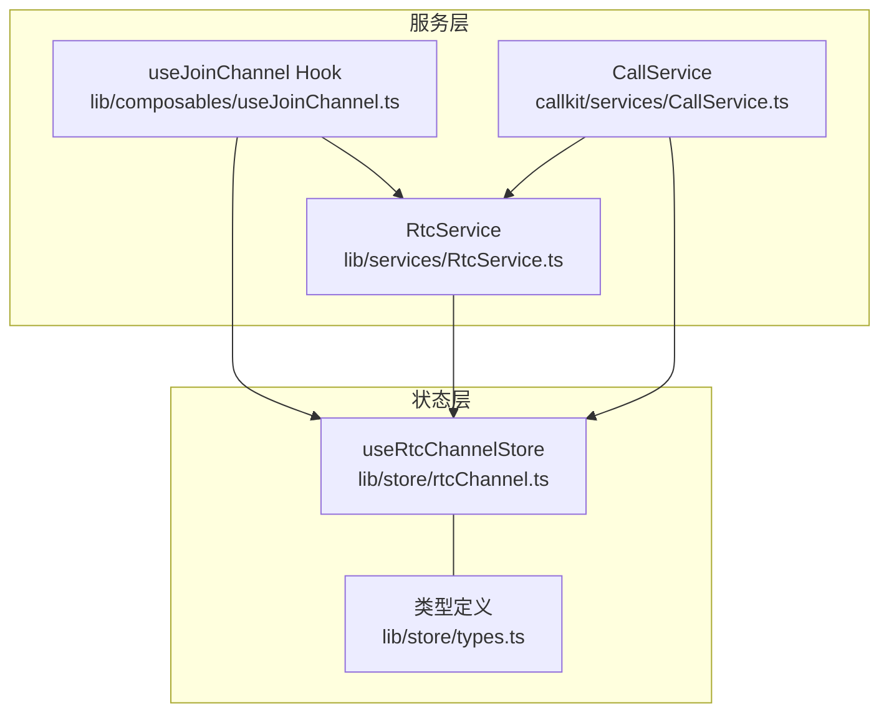
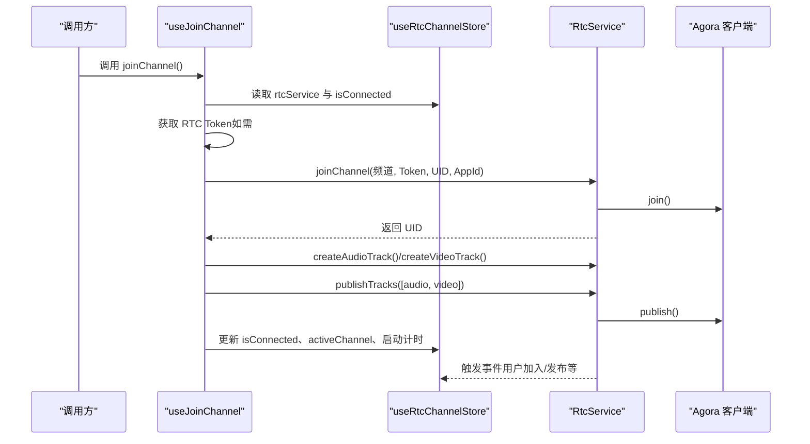
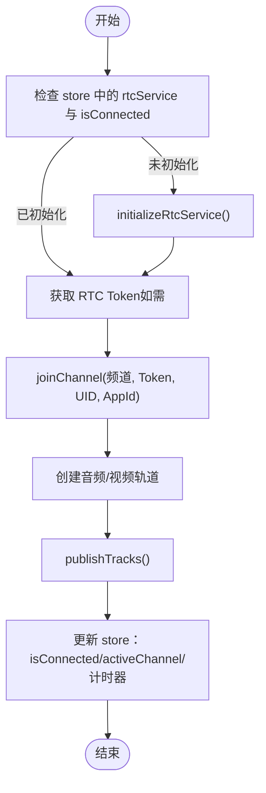
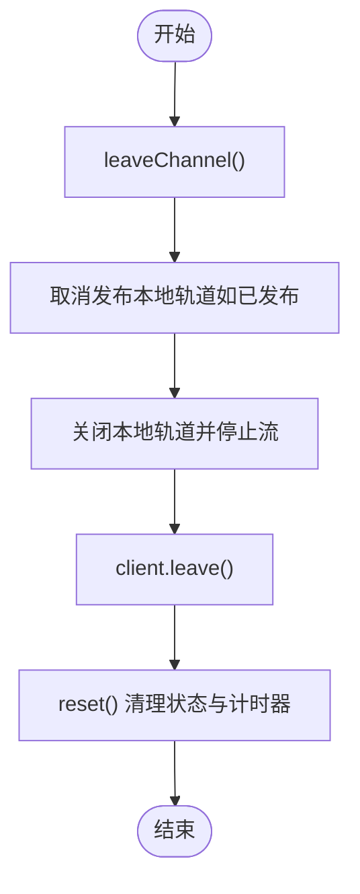
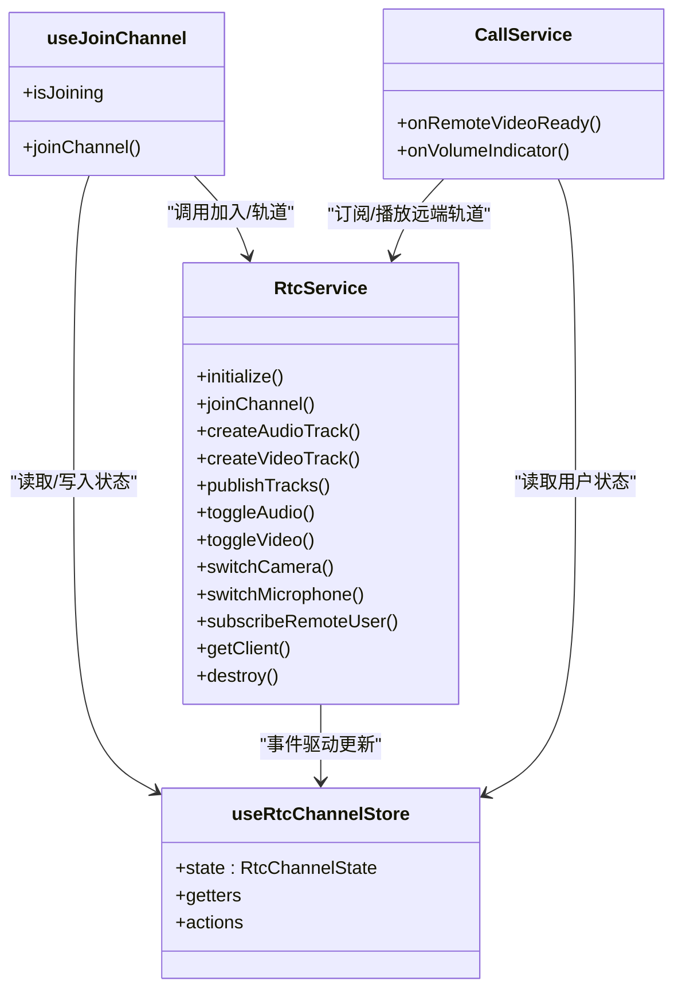

# RTC频道存储

<cite>
**本文引用的文件**
- [rtcChannel.ts](file://lib/store/rtcChannel.ts)
- [types.ts](file://lib/store/types.ts)
- [useJoinChannel.ts](file://lib/composables/useJoinChannel.ts)
- [RtcService.ts](file://lib/services/RtcService.ts)
- [CallService.ts](file://callkit/services/CallService.ts)
</cite>

## 目录
1. [简介](#简介)
2. [项目结构](#项目结构)
3. [核心组件](#核心组件)
4. [架构总览](#架构总览)
5. [详细组件分析](#详细组件分析)
6. [依赖关系分析](#依赖关系分析)
7. [性能考虑](#性能考虑)
8. [故障排查指南](#故障排查指南)
9. [结论](#结论)

## 简介
本文件面向 RTC 频道存储 useRtcChannelStore 的使用者，提供完整的 API 文档与实现解析。重点涵盖：
- RtcChannel 接口的状态结构与字段含义
- 频道相关的 actions 方法（加入/离开/切换设备/静音/计时等）
- 状态管理的 getter 计算属性
- 频道加入/离开的完整流程示例
- 多用户状态管理与设备切换的实现细节
- 异常处理与状态恢复机制

## 项目结构
围绕 RTC 频道存储的相关模块分布如下：
- lib/store/rtcChannel.ts：Pinia store，集中管理频道状态、媒体状态、用户状态与计时器
- lib/store/types.ts：RtcChannelState、RtcChannelInfo 等类型定义
- lib/composables/useJoinChannel.ts：封装加入频道的业务流程（含 Token 获取、轨道创建与发布）
- lib/services/RtcService.ts：封装 Agora WebRTC SDK 的客户端、轨道管理与设备切换
- callkit/services/CallService.ts：上层通话服务，负责远端用户状态更新与说话检测等

图表来源
- [rtcChannel.ts](file://lib/store/rtcChannel.ts#L1-L410)
- [types.ts](file://lib/store/types.ts#L57-L86)
- [useJoinChannel.ts](file://lib/composables/useJoinChannel.ts#L1-L185)
- [RtcService.ts](file://lib/services/RtcService.ts#L1-L719)
- [CallService.ts](file://callkit/services/CallService.ts#L1968-L3488)

章节来源
- [rtcChannel.ts](file://lib/store/rtcChannel.ts#L1-L410)
- [types.ts](file://lib/store/types.ts#L57-L86)

## 核心组件
- useRtcChannelStore：Pinia store，提供频道状态、媒体状态、用户状态与计时器管理
- RtcService：封装 Agora 客户端、轨道创建/发布/订阅、设备切换、网络质量与音量指示
- useJoinChannel：组合式 API，封装加入频道的完整流程（Token 获取、轨道创建与发布、状态更新）

章节来源
- [rtcChannel.ts](file://lib/store/rtcChannel.ts#L7-L410)
- [RtcService.ts](file://lib/services/RtcService.ts#L42-L719)
- [useJoinChannel.ts](file://lib/composables/useJoinChannel.ts#L26-L185)

## 架构总览
下图展示从“加入频道”到“媒体轨道发布”的关键交互路径，以及状态更新与事件驱动的关系。

图表来源
- [useJoinChannel.ts](file://lib/composables/useJoinChannel.ts#L76-L178)
- [RtcService.ts](file://lib/services/RtcService.ts#L109-L138)
- [RtcService.ts](file://lib/services/RtcService.ts#L176-L238)
- [rtcChannel.ts](file://lib/store/rtcChannel.ts#L149-L169)

## 详细组件分析

### RtcChannel 接口与状态结构
- RtcChannelState 字段概览
  - channels：记录所有频道信息，键为 channelId，值为 RtcChannelInfo
  - activeChannelId：当前活跃频道 ID
  - isConnected：是否已加入频道
  - localStream：本地媒体流
  - remoteStreams：远程用户的媒体流映射
  - audioEnabled、videoEnabled：本地音频/视频开关状态
  - rtcService：RtcService 实例
  - agoraAppId：Agora 应用标识
  - callDuration、callStartTime、_timer：通话时长与计时器
  - uidToUserIdMap：Agora UID 到环信 userId 的映射
  - joinedRtcUsers：已加入 RTC 的用户集合
  - pendingUserIds：待加入 RTC 的用户集合（收到 answerCall 但尚未加入）
  - leftUsers：已明确离开的用户集合（避免挂断后仍显示“邀请中”）

- RtcChannelInfo 字段概览
  - channelId、callId：频道与通话标识
  - participants：参与用户 ID 列表
  - joinTime、lastActiveTime：加入与最后活跃时间
  - isGroup：是否为群组通话

章节来源
- [types.ts](file://lib/store/types.ts#L57-L86)
- [rtcChannel.ts](file://lib/store/rtcChannel.ts#L11-L28)

### Getter 计算属性
- activeChannel：根据 activeChannelId 返回当前频道信息
- activeChannelParticipantCount：当前频道参与者数量
- channelIds：所有频道 ID 列表
- getRtcService：返回 RTC 服务实例
- formattedCallDuration：格式化通话时长（HH:mm:ss 或 mm:ss）

章节来源
- [rtcChannel.ts](file://lib/store/rtcChannel.ts#L33-L75)

### Actions 方法详解

#### 初始化与销毁
- initializeRtcService(agoraAppId)：初始化 RtcService 并注入环信客户端
- destroyRtcService()：销毁 RtcService，清理资源

章节来源
- [rtcChannel.ts](file://lib/store/rtcChannel.ts#L84-L121)

#### 频道生命周期
- createChannel(channelId, callId, isGroup=false)：创建频道
- setActiveChannel(channelId)：设置当前活跃频道
- joinChannel(channelId, userId)：仅更新 store 中的频道与参与者（信令层使用）
- leaveChannel(channelId, userId)：移除参与者，若频道为空则删除频道；若为当前活跃频道则清空
- removeChannel(channelId)：直接删除频道
- reset()：重置所有状态，停止本地与远程轨道，清理计时器

章节来源
- [rtcChannel.ts](file://lib/store/rtcChannel.ts#L126-L200)
- [rtcChannel.ts](file://lib/store/rtcChannel.ts#L372-L409)

#### 媒体与流管理
- setLocalStream(stream)：设置本地媒体流
- addRemoteStream(userId, stream)：添加远程媒体流
- removeRemoteStream(userId)：移除远程媒体流
- setAudioEnabled(enabled)/setVideoEnabled(enabled)：启用/禁用本地音频/视频
- startCallTimer()/stopCallTimer()/updateCallDuration()：通话计时控制

章节来源
- [rtcChannel.ts](file://lib/store/rtcChannel.ts#L204-L272)

#### 用户与设备映射
- setUidToUserIdMapping(uid, userId)：建立 UID 到 userId 的映射
- getUserIdByUid(uid)：按 UID 查询 userId
- markUserJoinedRtc(userId)/markUserLeftRtc(userId)：标记用户加入/离开 RTC
- isUserInRtc(userId)/hasUserLeft(userId)：查询用户状态
- clearLeftUsers()：清空“已离开”用户集合
- addPendingUserId(userId)/removePendingUserId(userId)/popPendingUserId()：待加入用户集合管理

章节来源
- [rtcChannel.ts](file://lib/store/rtcChannel.ts#L277-L368)

### 设备切换与媒体控制（结合 RtcService）
- 切换音频/视频：toggleAudio(enabled)/toggleVideo(enabled)
- 切换摄像头/麦克风：switchCamera(deviceId)/switchMicrophone(deviceId)
- 订阅远程用户：subscribeRemoteUser(user, mediaType)
- 获取本地/远程轨道：getLocalVideoStream()/getRemoteVideoTrack(userId)/getRemoteAudioTrack(userId)
- 离开频道与销毁：leaveChannel()/destroy()

章节来源
- [RtcService.ts](file://lib/services/RtcService.ts#L242-L354)
- [RtcService.ts](file://lib/services/RtcService.ts#L359-L395)
- [RtcService.ts](file://lib/services/RtcService.ts#L398-L423)
- [RtcService.ts](file://lib/services/RtcService.ts#L428-L488)
- [RtcService.ts](file://lib/services/RtcService.ts#L143-L171)
- [RtcService.ts](file://lib/services/RtcService.ts#L678-L719)

### 频道加入/离开完整流程示例

#### 加入频道流程

图表来源
- [useJoinChannel.ts](file://lib/composables/useJoinChannel.ts#L76-L178)
- [RtcService.ts](file://lib/services/RtcService.ts#L109-L138)
- [RtcService.ts](file://lib/services/RtcService.ts#L176-L238)
- [rtcChannel.ts](file://lib/store/rtcChannel.ts#L149-L169)

#### 离开频道流程

图表来源
- [RtcService.ts](file://lib/services/RtcService.ts#L143-L171)
- [RtcService.ts](file://lib/services/RtcService.ts#L514-L539)
- [rtcChannel.ts](file://lib/store/rtcChannel.ts#L372-L409)

### 多用户状态管理与设备切换实现细节
- 用户状态管理
  - 通过 uidToUserIdMap 维护 UID 与 userId 的映射
  - 通过 joinedRtcUsers/leftUsers/pendingUserIds 三集合管理用户生命周期
  - RtcService 在 user-joined/user-published 等事件中自动匹配 userId 并标记用户状态
- 设备切换
  - 切换摄像头/麦克风时，RtcService 会校验轨道可用性与启用状态
  - 切换视频时，若轨道失效会重新创建并发布，同时更新本地流到 store
- 远端用户状态更新
  - CallService 监听音量指示与远端发布/取消发布事件，动态更新 UI 状态（静音、摄像头状态、说话者提示）

章节来源
- [RtcService.ts](file://lib/services/RtcService.ts#L544-L673)
- [CallService.ts](file://callkit/services/CallService.ts#L2150-L2166)
- [CallService.ts](file://callkit/services/CallService.ts#L3457-L3488)

## 依赖关系分析
- useRtcChannelStore 依赖 RtcService 与聊天客户端（用于 userId 映射）
- useJoinChannel 依赖 useRtcChannelStore 与 RtcService，协调加入流程
- RtcService 依赖 Agora SDK，并通过事件驱动更新 store
- CallService 依赖 RtcService 与 store，负责 UI 状态同步

图表来源
- [rtcChannel.ts](file://lib/store/rtcChannel.ts#L7-L410)
- [RtcService.ts](file://lib/services/RtcService.ts#L42-L719)
- [useJoinChannel.ts](file://lib/composables/useJoinChannel.ts#L26-L185)
- [CallService.ts](file://callkit/services/CallService.ts#L1968-L3488)

## 性能考虑
- 轨道生命周期管理：视频切换时避免重复发布，必要时重建并及时停止旧轨道
- 计时器优化：统一使用 store 内部定时器，离开频道时及时清理
- 远端轨道管理：离开频道或销毁服务时，逐个停止远端轨道，避免资源泄漏
- 事件监听：销毁服务时移除所有监听，防止内存泄漏

章节来源
- [RtcService.ts](file://lib/services/RtcService.ts#L272-L354)
- [RtcService.ts](file://lib/services/RtcService.ts#L514-L539)
- [RtcService.ts](file://lib/services/RtcService.ts#L678-L719)
- [rtcChannel.ts](file://lib/store/rtcChannel.ts#L372-L409)

## 故障排查指南
- 加入频道失败
  - 检查 RtcService 是否已初始化
  - 确认 Token 获取是否成功
  - 查看 Agora 客户端连接状态（CONNECTING/CONNECTED）
- 轨道发布失败
  - 确认本地轨道已创建且未被销毁
  - 检查客户端连接状态后再执行 publish
- 设备切换失败
  - 确保对应轨道处于启用状态
  - 检查设备 ID 是否有效
- 用户状态异常
  - 检查 uidToUserIdMap 是否正确建立
  - 确认 leftUsers/pendingUserIds 的状态一致性
- 远端无流
  - 确认已触发 subscribeRemoteUser
  - 检查 CallService 的音量指示与远端发布事件处理

章节来源
- [useJoinChannel.ts](file://lib/composables/useJoinChannel.ts#L76-L178)
- [RtcService.ts](file://lib/services/RtcService.ts#L242-L354)
- [RtcService.ts](file://lib/services/RtcService.ts#L398-L423)
- [CallService.ts](file://callkit/services/CallService.ts#L2150-L2166)

## 结论
useRtcChannelStore 通过 Pinia 集中管理 RTC 频道、媒体与用户状态，配合 RtcService 的设备与轨道能力，以及 useJoinChannel 的业务编排，实现了从加入到离开的完整闭环。其设计强调：
- 状态与行为分离：store 负责状态，service 负责底层能力
- 事件驱动：RtcService 通过事件更新 store，保证 UI 与底层一致
- 生命周期清晰：加入/离开/销毁均有完善的资源清理与状态恢复