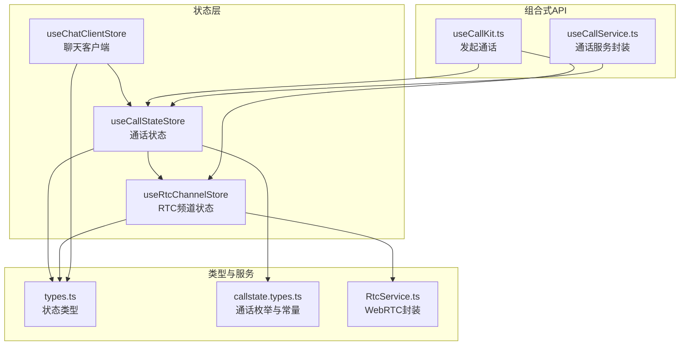
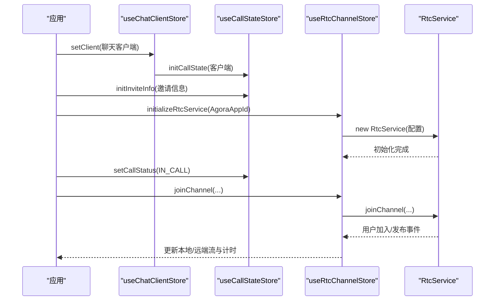
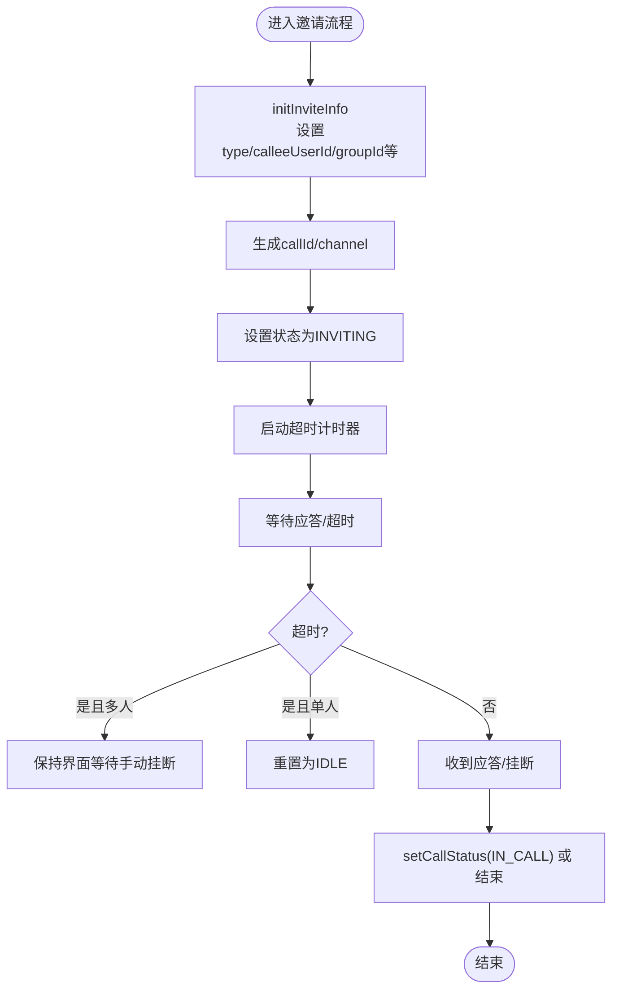
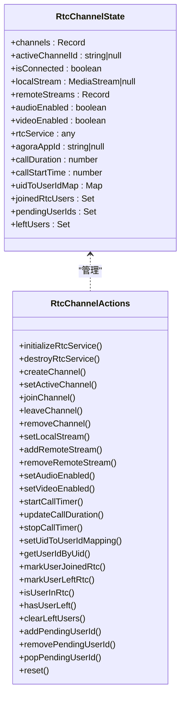
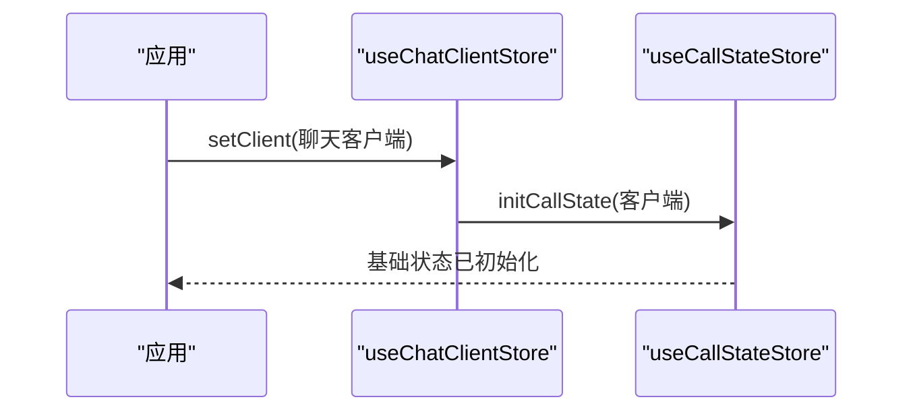
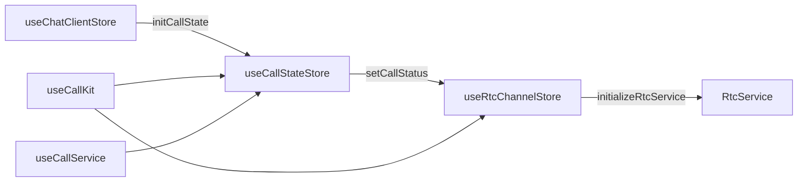

# 状态管理 API

<cite>
**本文引用的文件**
- [lib/store/callState.ts](file://lib/store/callState.ts)
- [lib/store/rtcChannel.ts](file://lib/store/rtcChannel.ts)
- [lib/store/chatClient.ts](file://lib/store/chatClient.ts)
- [lib/store/types.ts](file://lib/store/types.ts)
- [lib/types/callstate.types.ts](file://lib/types/callstate.types.ts)
- [lib/services/RtcService.ts](file://lib/services/RtcService.ts)
- [lib/composables/useCallKit.ts](file://lib/composables/useCallKit.ts)
- [lib/composables/useCallService.ts](file://lib/composables/useCallService.ts)
- [.trae/documents/修复CallService中CallState store初始化检查问题.md](file://.trae/documents/修复CallService中CallState store初始化检查问题.md)
</cite>

## 目录
1. [简介](#简介)
2. [项目结构](#项目结构)
3. [核心组件](#核心组件)
4. [架构总览](#架构总览)
5. [详细组件分析](#详细组件分析)
6. [依赖关系分析](#依赖关系分析)
7. [性能考量](#性能考量)
8. [故障排查指南](#故障排查指南)
9. [结论](#结论)
10. [附录](#附录)

## 简介
本文件为状态管理 API 参考文档，聚焦于 Pinia store 的接口定义与使用规范，覆盖以下核心 store：
- useCallStateStore：通话状态管理
- useRtcChannelStore：实时音视频通道状态管理
- useChatClientStore：聊天客户端连接状态与初始化

文档内容包括：
- 状态结构与类型定义
- Action 方法与 Getter 计算属性
- 状态初始化、更新与重置策略
- 状态间依赖关系与数据流转
- 状态订阅与组件使用最佳实践
- 调试与性能优化建议

## 项目结构
状态管理相关代码主要位于 lib/store 目录，配合 lib/types 中的类型定义与 lib/services/RtcService 提供底层能力。

图表来源
- [lib/store/callState.ts](file://lib/store/callState.ts#L1-L263)
- [lib/store/rtcChannel.ts](file://lib/store/rtcChannel.ts#L1-L410)
- [lib/store/chatClient.ts](file://lib/store/chatClient.ts#L1-L23)
- [lib/store/types.ts](file://lib/store/types.ts#L1-L86)
- [lib/types/callstate.types.ts](file://lib/types/callstate.types.ts#L1-L93)
- [lib/services/RtcService.ts](file://lib/services/RtcService.ts#L1-L719)
- [lib/composables/useCallKit.ts](file://lib/composables/useCallKit.ts#L1-L123)
- [lib/composables/useCallService.ts](file://lib/composables/useCallService.ts#L1-L299)

章节来源
- [lib/store/callState.ts](file://lib/store/callState.ts#L1-L263)
- [lib/store/rtcChannel.ts](file://lib/store/rtcChannel.ts#L1-L410)
- [lib/store/chatClient.ts](file://lib/store/chatClient.ts#L1-L23)
- [lib/store/types.ts](file://lib/store/types.ts#L1-L86)
- [lib/types/callstate.types.ts](file://lib/types/callstate.types.ts#L1-L93)
- [lib/services/RtcService.ts](file://lib/services/RtcService.ts#L1-L719)
- [lib/composables/useCallKit.ts](file://lib/composables/useCallKit.ts#L1-L123)
- [lib/composables/useCallService.ts](file://lib/composables/useCallService.ts#L1-L299)

## 核心组件
本节概述三个核心 store 的职责与关键接口。

- useCallStateStore
  - 职责：维护通话生命周期状态、邀请流程、超时控制、用户信息映射、窗口模式等
  - 关键状态：status、type、callId、channel、token、callerDevId、calleeUserId、groupId、groupName、groupAvatar、invitedMembers、joinedMembers、inviteTimeout、userInfoMap、UIdToUserIdMap、isMinimized 等
  - 关键 Action：initCallState、initInviteInfo、buildAndUpdateInviteState、setUserInfo、updateInvitedMembers、startTimeoutTimer、clearTimeoutTimer、handleTimeout、setCallStatus、updateCallState、resetCallState、generateCallId
  - 关键 Getter：getCallStatus、getCallState、getUserInfo、getInviteTimeoutTimer、isInviting、isInCall、getInvitedMembers、getIsMinimized

- useRtcChannelStore
  - 职责：管理 RTC 频道、本地/远端媒体流、音频/视频开关、通话计时、UID/UserId 映射、参与用户集合
  - 关键状态：channels、activeChannelId、isConnected、localStream、remoteStreams、audioEnabled、videoEnabled、rtcService、agoraAppId、callDuration、callStartTime、uidToUserIdMap、joinedRtcUsers、pendingUserIds、leftUsers
  - 关键 Action：initializeRtcService、destroyRtcService、createChannel、setActiveChannel、joinChannel、leaveChannel、removeChannel、setLocalStream、addRemoteStream、removeRemoteStream、setAudioEnabled、setVideoEnabled、startCallTimer、updateCallDuration、stopCallTimer、setUidToUserIdMapping、getUserIdByUid、markUserJoinedRtc、markUserLeftRtc、isUserInRtc、hasUserLeft、clearLeftUsers、addPendingUserId、removePendingUserId、popPendingUserId、reset
  - 关键 Getter：activeChannel、activeChannelParticipantCount、channelIds、getRtcService、formattedCallDuration

- useChatClientStore
  - 职责：保存聊天客户端实例，初始化通话状态所需的基础信息（如设备ID、用户ID、token）
  - 关键状态：client
  - 关键 Action：setClient（初始化 callStateStore）
  - 关键 Getter：getChatClient、getClientDeviceId

章节来源
- [lib/store/callState.ts](file://lib/store/callState.ts#L7-L206)
- [lib/store/rtcChannel.ts](file://lib/store/rtcChannel.ts#L7-L409)
- [lib/store/chatClient.ts](file://lib/store/chatClient.ts#L6-L22)
- [lib/store/types.ts](file://lib/store/types.ts#L43-L85)
- [lib/types/callstate.types.ts](file://lib/types/callstate.types.ts#L42-L67)

## 架构总览
状态管理采用分层设计：
- 应用层提供 Pinia 实例，各 store 通过 defineStore 定义
- useChatClientStore 负责初始化基础信息并联动 useCallStateStore
- useCallStateStore 管理通话生命周期并与 useRtcChannelStore 协作
- useRtcChannelStore 通过 RtcService 封装 WebRTC 操作，驱动媒体流与计时

图表来源
- [lib/store/chatClient.ts](file://lib/store/chatClient.ts#L10-L16)
- [lib/store/callState.ts](file://lib/store/callState.ts#L44-L71)
- [lib/store/rtcChannel.ts](file://lib/store/rtcChannel.ts#L84-L109)
- [lib/services/RtcService.ts](file://lib/services/RtcService.ts#L82-L96)

## 详细组件分析

### useCallStateStore 接口详解
- 状态定义
  - 基础状态：status、type、callId、channel、token、callerDevId、calleeUserId、groupId、groupName、groupAvatar、invitedMembers、joinedMembers、inviteMessageId、duration
  - 超时设置：inviteTimeout、inviteTimeoutTimer
  - 用户映射：userInfoMap、UIdToUserIdMap
  - 窗口模式：isMinimized
- Action
  - initCallState：基于聊天客户端填充设备ID、用户ID、token
  - initInviteInfo：构建邀请状态（含群呼），设置 callId、channel、初始状态与超时计时
  - buildAndUpdateInviteState：组合初始化与返回完整状态
  - setUserInfo/updateInvitedMembers：维护用户信息与受邀成员
  - startTimeoutTimer/clearTimeoutTimer/handleTimeout：邀请超时控制（单人与多人差异处理）
  - setCallStatus：状态变更钩子（从 IDLE 转换时联动清理 leftUsers）
  - updateCallState/resetCallState：增量更新与重置
  - generateCallId：生成唯一通话ID
- Getter
  - getCallStatus/getCallState：只读访问
  - getUserInfo：按用户ID查询昵称/头像
  - getInviteTimeoutTimer：超时定时器句柄
  - isInviting/isInCall：便捷判断
  - getInvitedMembers/getIsMinimized：受邀成员与窗口模式

图表来源
- [lib/store/callState.ts](file://lib/store/callState.ts#L50-L131)

章节来源
- [lib/store/callState.ts](file://lib/store/callState.ts#L7-L206)
- [lib/store/types.ts](file://lib/store/types.ts#L43-L55)
- [lib/types/callstate.types.ts](file://lib/types/callstate.types.ts#L42-L48)

### useRtcChannelStore 接口详解
- 状态定义
  - 频道集合：channels、activeChannelId、isConnected
  - 媒体流：localStream、remoteStreams
  - 音视频开关：audioEnabled、videoEnabled
  - 服务与配置：rtcService、agoraAppId
  - 计时：callDuration、callStartTime、_timer
  - 用户集合与映射：uidToUserIdMap、joinedRtcUsers、pendingUserIds、leftUsers
- Action
  - initializeRtcService/destroyRtcService：服务生命周期管理
  - createChannel/setActiveChannel/joinChannel/leaveChannel/removeChannel：频道管理
  - setLocalStream/addRemoteStream/removeRemoteStream：媒体流管理
  - setAudioEnabled/setVideoEnabled：音视频开关
  - startCallTimer/updateCallDuration/stopCallTimer：通话计时
  - setUidToUserIdMapping/getUserIdByUid：UID/UserId 映射
  - markUserJoinedRtc/markUserLeftRtc/isUserInRtc/hasUserLeft：用户状态管理
  - clearLeftUsers/addPendingUserId/removePendingUserId/popPendingUserId：待加入/离开用户队列
  - reset：彻底清理并停止所有轨道
- Getter
  - activeChannel/activeChannelParticipantCount/channelIds：频道信息
  - getRtcService/formattedCallDuration：服务实例与格式化时长

图表来源
- [lib/store/rtcChannel.ts](file://lib/store/rtcChannel.ts#L11-L28)
- [lib/store/rtcChannel.ts](file://lib/store/rtcChannel.ts#L80-L409)

章节来源
- [lib/store/rtcChannel.ts](file://lib/store/rtcChannel.ts#L7-L409)
- [lib/store/types.ts](file://lib/store/types.ts#L57-L85)
- [lib/services/RtcService.ts](file://lib/services/RtcService.ts#L42-L719)

### useChatClientStore 接口详解
- 状态定义：client
- Action：setClient（设置客户端并调用 useCallStateStore.initCallState）
- Getter：getChatClient、getClientDeviceId

图表来源
- [lib/store/chatClient.ts](file://lib/store/chatClient.ts#L10-L16)
- [lib/store/callState.ts](file://lib/store/callState.ts#L44-L48)

章节来源
- [lib/store/chatClient.ts](file://lib/store/chatClient.ts#L6-L22)

### 类型系统与状态结构
- CallState 扩展自 CALL_INFO，增加状态字段与映射表
- RtcChannelState 描述频道与媒体流状态
- CALL_STATUS/CALL_TYPE 提供状态机与通话类型常量
- INVITE_INFO 描述邀请参数（单人/群组）

章节来源
- [lib/store/types.ts](file://lib/store/types.ts#L43-L85)
- [lib/types/callstate.types.ts](file://lib/types/callstate.types.ts#L11-L67)

## 依赖关系分析
- useChatClientStore → useCallStateStore：setClient 调用 initCallState
- useCallStateStore → useRtcChannelStore：setCallStatus 时联动清理 leftUsers；群呼场景下主动 joinChannel
- useRtcChannelStore → RtcService：initializeRtcService/destroyRtcService；媒体流与计时
- useCallKit/useCallService：组合式 API，统一对外暴露状态与操作

图表来源
- [lib/store/chatClient.ts](file://lib/store/chatClient.ts#L10-L16)
- [lib/store/callState.ts](file://lib/store/callState.ts#L142-L151)
- [lib/store/rtcChannel.ts](file://lib/store/rtcChannel.ts#L84-L109)
- [lib/services/RtcService.ts](file://lib/services/RtcService.ts#L82-L96)
- [lib/composables/useCallKit.ts](file://lib/composables/useCallKit.ts#L10-L122)
- [lib/composables/useCallService.ts](file://lib/composables/useCallService.ts#L91-L299)

章节来源
- [lib/store/chatClient.ts](file://lib/store/chatClient.ts#L1-L23)
- [lib/store/callState.ts](file://lib/store/callState.ts#L1-L263)
- [lib/store/rtcChannel.ts](file://lib/store/rtcChannel.ts#L1-L410)
- [lib/services/RtcService.ts](file://lib/services/RtcService.ts#L1-L719)
- [lib/composables/useCallKit.ts](file://lib/composables/useCallKit.ts#L1-L123)
- [lib/composables/useCallService.ts](file://lib/composables/useCallService.ts#L1-L299)

## 性能考量
- 媒体轨道生命周期
  - 离开频道或销毁服务时，需停止本地/远端轨道，避免资源泄漏
  - 切换摄像头/麦克风时避免重复发布，减少不必要的网络与设备操作
- 计时与定时器
  - 邀请超时与通话计时需在合适时机清理，防止内存泄漏
  - 多人通话超时策略避免自动隐藏界面，减少误操作
- 响应式更新
  - 对 Set/Map 等集合进行强制更新以确保视图刷新
- 日志与可观测性
  - 使用 logger 输出关键事件，便于定位问题与性能瓶颈

章节来源
- [lib/store/rtcChannel.ts](file://lib/store/rtcChannel.ts#L373-L408)
- [lib/services/RtcService.ts](file://lib/services/RtcService.ts#L143-L171)
- [lib/services/RtcService.ts](file://lib/services/RtcService.ts#L243-L354)
- [lib/store/callState.ts](file://lib/store/callState.ts#L115-L131)

## 故障排查指南
- Pinia 初始化问题
  - 症状：调用 store 报错或返回 undefined
  - 原因：应用未正确安装 Pinia 或 store 未通过 defineStore 正确注册
  - 解决：确保在应用入口通过 app.use(pinia) 安装 Pinia，并在组件中使用 store
- store 访问检查
  - 修复要点：将 getter 属性检查改为属性存在性检查，避免将 getter 当作方法调用
- 超时与挂断
  - 单人通话超时：自动重置为 IDLE
  - 多人通话超时：保持界面等待手动挂断，避免资源提前释放
- 媒体流异常
  - 检查本地/远端轨道是否已停止
  - 确认 UID/UserId 映射是否正确建立，避免“邀请中”状态残留

章节来源
- [.trae/documents/修复CallService中CallState store初始化检查问题.md](file://.trae/documents/修复CallService中CallState store初始化检查问题.md#L1-L42)
- [lib/store/callState.ts](file://lib/store/callState.ts#L115-L131)
- [lib/store/rtcChannel.ts](file://lib/store/rtcChannel.ts#L373-L408)

## 结论
本状态管理方案通过清晰的 store 分层与类型约束，实现了从聊天客户端初始化、通话邀请、到 RTC 频道与媒体流的全链路状态管理。建议在组件中通过组合式 API 访问 store，遵循“只读状态、动作更新”的原则，并在生命周期钩子中妥善清理定时器与媒体轨道，以获得稳定与高性能的用户体验。

## 附录

### 组件使用最佳实践
- 在组件中通过组合式 API 获取状态与操作方法，避免直接导入 store 实例
- 使用 computed 监听 store 状态变化，避免不必要的重渲染
- 在 onUnmounted 中清理定时器与媒体轨道，防止内存泄漏
- 对于多人通话，避免在超时后自动隐藏界面，等待用户手动挂断

章节来源
- [lib/composables/useCallKit.ts](file://lib/composables/useCallKit.ts#L10-L122)
- [lib/composables/useCallService.ts](file://lib/composables/useCallService.ts#L91-L299)
- [lib/store/rtcChannel.ts](file://lib/store/rtcChannel.ts#L242-L272)