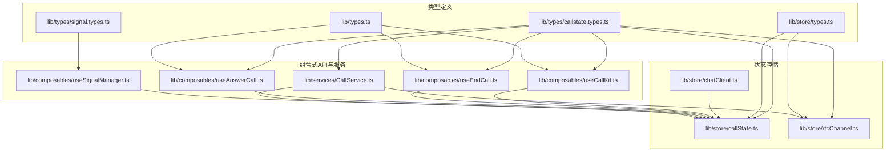
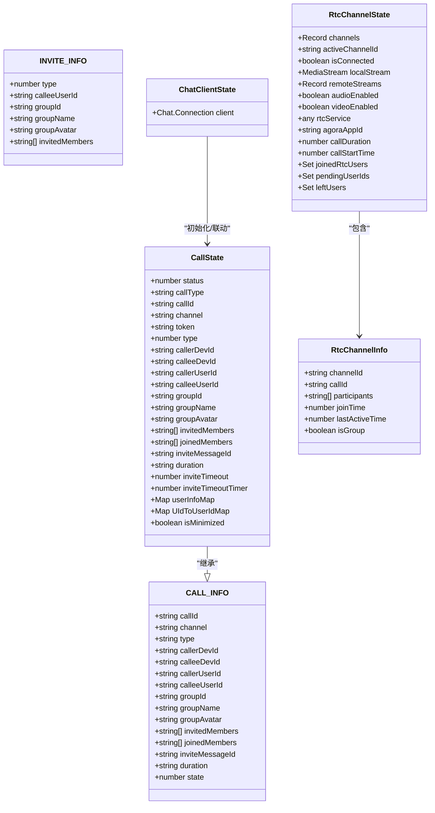
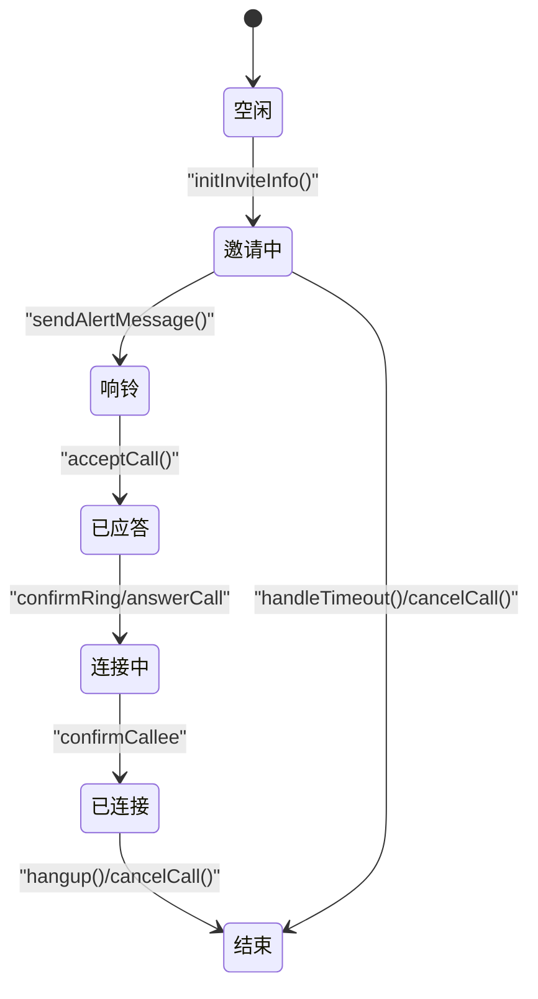
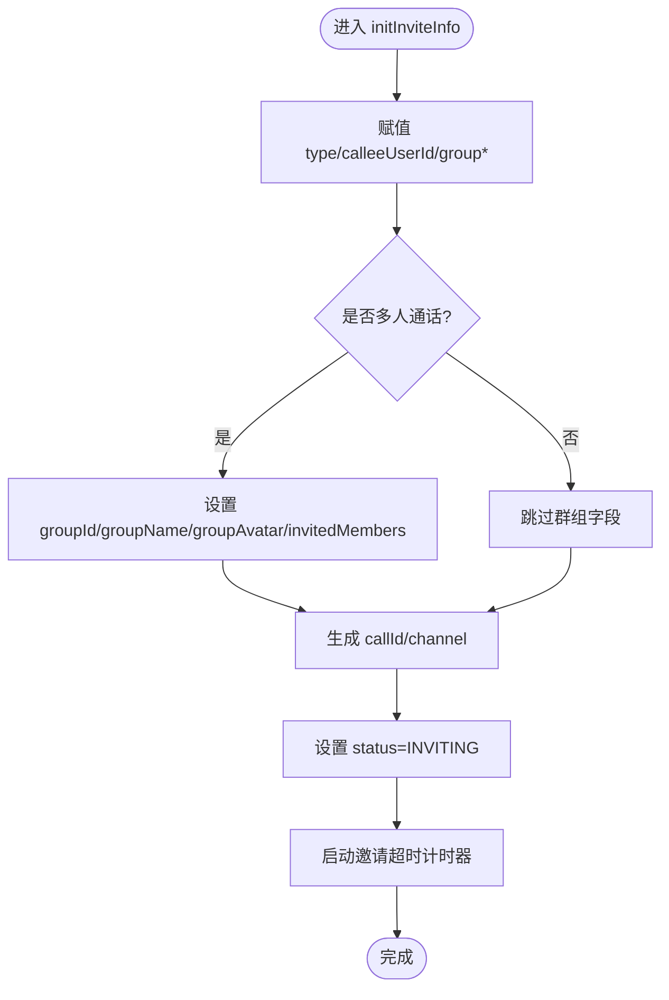
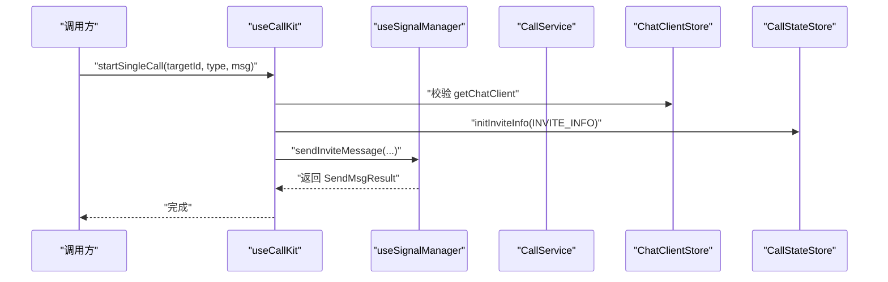
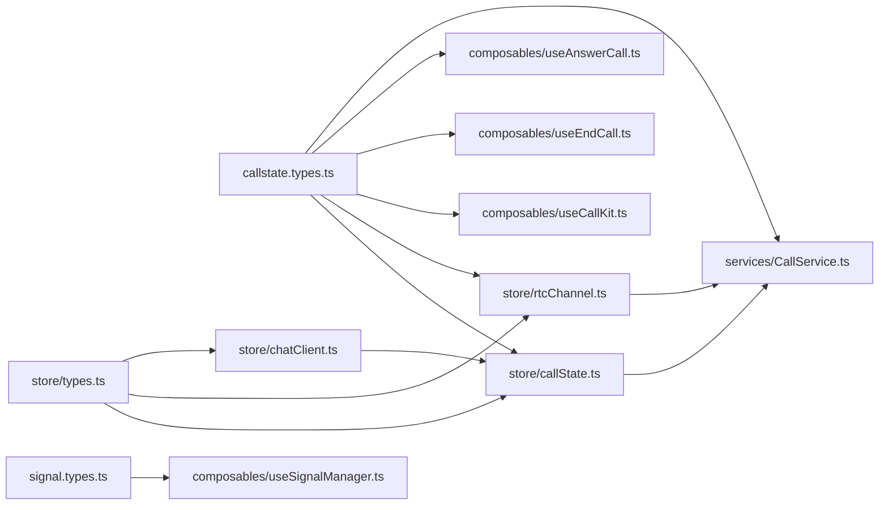

# 状态类型定义

<cite>
**本文档引用的文件**
- [lib/types/callstate.types.ts](file://lib/types/callstate.types.ts)
- [lib/types/signal.types.ts](file://lib/types/signal.types.ts)
- [lib/types.ts](file://lib/types.ts)
- [lib/store/types.ts](file://lib/store/types.ts)
- [lib/store/callState.ts](file://lib/store/callState.ts)
- [lib/store/rtcChannel.ts](file://lib/store/rtcChannel.ts)
- [lib/store/chatClient.ts](file://lib/store/chatClient.ts)
- [lib/composables/useCallKit.ts](file://lib/composables/useCallKit.ts)
- [lib/composables/useEndCall.ts](file://lib/composables/useEndCall.ts)
- [lib/composables/useAnswerCall.ts](file://lib/composables/useAnswerCall.ts)
- [lib/composables/useSignalManager.ts](file://lib/composables/useSignalManager.ts)
- [lib/services/CallService.ts](file://lib/services/CallService.ts)
- [lib/index.ts](file://lib/index.ts)
</cite>

## 目录
1. [简介](#简介)
2. [项目结构](#项目结构)
3. [核心组件](#核心组件)
4. [架构总览](#架构总览)
5. [详细组件分析](#详细组件分析)
6. [依赖分析](#依赖分析)
7. [性能考虑](#性能考虑)
8. [故障排查指南](#故障排查指南)
9. [结论](#结论)
10. [附录](#附录)

## 简介
本文件面向开发者，系统性梳理 Easemob Vue3 CallKit 中的状态管理类型定义与使用方式，重点覆盖以下主题：
- 核心状态接口：CallState、RtcChannel、ChatClient 等
- 枚举与常量类型：CALL_STATUS、CALL_TYPE、HANGUP_REASON 等
- 复合类型：INVITE_INFO、CALL_INFO、SignalMessageInviteExt 等
- 类型使用示例与最佳实践
- 类型间的继承与组合关系
- 类型安全开发指导与常见错误解决思路

## 项目结构
本项目采用“类型集中定义 + Pinia 状态存储 + 组合式 API + 服务层”的分层设计。类型定义主要集中在 lib/types 与 lib/store/types 中，状态存储位于 lib/store 下，业务逻辑通过 composable 与 service 层协调。

图表来源
- [lib/types/callstate.types.ts](file://lib/types/callstate.types.ts#L1-L93)
- [lib/types/signal.types.ts](file://lib/types/signal.types.ts#L1-L196)
- [lib/types.ts](file://lib/types.ts#L1-L91)
- [lib/store/types.ts](file://lib/store/types.ts#L1-L86)
- [lib/store/callState.ts](file://lib/store/callState.ts#L1-L263)
- [lib/store/rtcChannel.ts](file://lib/store/rtcChannel.ts#L1-L410)
- [lib/store/chatClient.ts](file://lib/store/chatClient.ts#L1-L23)
- [lib/composables/useCallKit.ts](file://lib/composables/useCallKit.ts#L1-L123)
- [lib/composables/useEndCall.ts](file://lib/composables/useEndCall.ts#L1-L131)
- [lib/composables/useAnswerCall.ts](file://lib/composables/useAnswerCall.ts#L1-L168)
- [lib/composables/useSignalManager.ts](file://lib/composables/useSignalManager.ts#L1-L354)
- [lib/services/CallService.ts](file://lib/services/CallService.ts#L1-L298)

章节来源
- [lib/index.ts](file://lib/index.ts#L33-L46)

## 核心组件
本节聚焦于状态相关的 TypeScript 类型与接口，按“基础类型 → 复合类型 → 存储类型 → 组合式API/服务”的顺序展开。

- 基础类型与常量
  - CallMode：音频/视频/群组三态
  - CALL_STATUS：通话状态整数枚举及命名常量映射
  - CALLKIT_CMD_MSG_RESULT_TYPE：信令命令消息结果类型
  - CALLKIT_ACTION_MSG_TYPE、CALLKIT_TEXT_MSG_ACTION：动作消息类型
  - CALLKIT_CMD_MSG_ACTION_TYPE：命令消息动作类型集合
  - CALL_TYPE：通话类型枚举（一对一音视频、多人音视频）
  - HANGUP_REASON：挂断原因枚举（含远端/本地/异常等）

- 复合类型
  - CALL_INFO：一次通话的完整元信息
  - INVITE_INFO：发起邀请所需的信息载体
  - SignalMessageInviteExt：邀请类文本消息扩展字段
  - SignalingExt 及其子类型：各类信令消息扩展字段
  - SignalingMessageOptions：信令消息配置

- 存储类型
  - CallState：Pinia 中维护的通话状态快照
  - RtcChannelState、RtcChannelInfo：RTC 频道状态与频道信息
  - ChatClientState：环信客户端状态
  - CallParticipant、CurrentCallInfo：通话参与者与当前通话信息

- 组合式API与服务
  - useCallKit、useEndCall、useAnswerCall：围绕状态变更的高层封装
  - useSignalManager：信令发送的统一入口
  - CallService：挂断、清理、状态重置等业务编排

章节来源
- [lib/types/callstate.types.ts](file://lib/types/callstate.types.ts#L1-L93)
- [lib/types/signal.types.ts](file://lib/types/signal.types.ts#L1-L196)
- [lib/types.ts](file://lib/types.ts#L1-L91)
- [lib/store/types.ts](file://lib/store/types.ts#L1-L86)

## 架构总览
下面的类图展示了核心类型之间的继承与组合关系，以及与状态存储的关联。

图表来源
- [lib/store/types.ts](file://lib/store/types.ts#L35-L86)
- [lib/store/callState.ts](file://lib/store/callState.ts#L43-L55)
- [lib/store/rtcChannel.ts](file://lib/store/rtcChannel.ts#L57-L75)
- [lib/store/chatClient.ts](file://lib/store/chatClient.ts#L10-L17)

## 详细组件分析

### CALL_STATUS 与状态流转
- 定义：整数枚举与命名常量映射，涵盖空闲、邀请中、响铃、连接中、已连接、结束等阶段。
- 使用：Pinia store 中以数字状态保存；getter 提供只读访问；setCallStatus 负责状态切换与副作用（如清空 leftUsers）。
- 流转要点：从 IDLE 切换到非 IDLE 时触发 RTC 清理；多人通话超时策略不同，需手动挂断才销毁资源。

图表来源
- [lib/store/callState.ts](file://lib/store/callState.ts#L142-L151)
- [lib/composables/useAnswerCall.ts](file://lib/composables/useAnswerCall.ts#L28-L76)
- [lib/composables/useCallKit.ts](file://lib/composables/useCallKit.ts#L101-L108)

章节来源
- [lib/types/callstate.types.ts](file://lib/types/callstate.types.ts#L12-L22)
- [lib/store/callState.ts](file://lib/store/callState.ts#L142-L151)

### CALL_TYPE 与通话类型
- 定义：一对一音频、一对一视频、多人视频、多人音频四种类型。
- 使用：在 INVITE_INFO、CALL_INFO、CallState 中体现；useCallKit 根据 UI 输入选择类型并初始化状态。
- 注意：多人通话与一对一通话在挂断策略、信令发送对象上存在差异。

章节来源
- [lib/types/callstate.types.ts](file://lib/types/callstate.types.ts#L42-L48)
- [lib/composables/useCallKit.ts](file://lib/composables/useCallKit.ts#L28-L31)
- [lib/composables/useCallKit.ts](file://lib/composables/useCallKit.ts#L74-L82)

### HANGUP_REASON 与挂断策略
- 定义：挂断原因枚举，覆盖本地挂断、取消、远端取消/拒绝、忙线、无响应、其他设备处理、异常结束等。
- 使用：CallService.hangup 根据原因选择策略；普通挂断发送 leaveCall，取消发送 cancelCall；远端原因不发送消息。
- 最佳实践：对外暴露 useEndCall，内部统一调用 CallService，避免直接操作 store。

章节来源
- [lib/types/callstate.types.ts](file://lib/types/callstate.types.ts#L69-L92)
- [lib/composables/useEndCall.ts](file://lib/composables/useEndCall.ts#L18-L28)
- [lib/services/CallService.ts](file://lib/services/CallService.ts#L75-L86)
- [lib/services/CallService.ts](file://lib/services/CallService.ts#L102-L164)

### INVITE_INFO 与 CALL_INFO
- INVITE_INFO：发起邀请时必需的输入，包含类型、被叫用户、群组信息（多人场景）、受邀成员列表。
- CALL_INFO：一次通话的完整元信息，继承自 CALL_INFO 的字段，额外在 CallState 中增加运行时状态与映射表。
- 使用：useCallKit.initInviteInfo 会将 INVITE_INFO 映射到 CallState，并生成 callId/channel，进入 INVITING 状态。

章节来源
- [lib/store/types.ts](file://lib/store/types.ts#L35-L42)
- [lib/store/types.ts](file://lib/store/types.ts#L43-L55)
- [lib/store/callState.ts](file://lib/store/callState.ts#L49-L71)

### 信令消息类型与扩展
- SignalMessageInviteExt：邀请类文本消息扩展，包含 action、callId、频道名、聊天类型、推送扩展、APNS 扩展、用户信息等。
- SignalingExt 及子类型：alert、confirmRing、answerCall、confirmCallee、cancelCall、leaveCall 的扩展字段定义。
- SignalingMessageOptions：信令消息配置，包含消息类型、聊天类型、接收方、动作、扩展字段等。

章节来源
- [lib/types/signal.types.ts](file://lib/types/signal.types.ts#L3-L44)
- [lib/types/signal.types.ts](file://lib/types/signal.types.ts#L50-L102)
- [lib/types/signal.types.ts](file://lib/types/signal.types.ts#L173-L194)

### CallState 存储与行为
- 状态字段：基础状态、通话类型、callId/channel/token、主被叫标识、群组信息、成员列表、邀请消息ID、时长、超时设置、定时器、用户信息映射、窗口模式等。
- 行为方法：initCallState、initInviteInfo、setUserInfo、startTimeoutTimer、clearTimeoutTimer、handleTimeout、updateCallState、setCallStatus、resetCallState、buildAndUpdateInviteState、generateCallId。
- 计算属性：getCallStatus、getCallState、getUserInfo、getInviteTimeoutTimer、isInviting、isInCall、getInvitedMembers、getIsMinimized。

图表来源
- [lib/store/callState.ts](file://lib/store/callState.ts#L49-L71)

章节来源
- [lib/store/callState.ts](file://lib/store/callState.ts#L11-L37)
- [lib/store/callState.ts](file://lib/store/callState.ts#L42-L206)

### RtcChannel 存储与行为
- 状态字段：channels、activeChannelId、isConnected、localStream、remoteStreams、音频/视频开关、rtcService、agoraAppId、通话时长/开始时间、UID 映射、加入/待加入/离开用户集合。
- 行为方法：initializeRtcService、destroyRtcService、createChannel、joinChannel、leaveChannel、removeChannel、setLocalStream、addRemoteStream、removeRemoteStream、setAudioEnabled、setVideoEnabled、startCallTimer、updateCallDuration、stopCallTimer、setUidToUserIdMapping、getUserIdByUid、markUserJoinedRtc、markUserLeftRtc、isUserInRtc、hasUserLeft、clearLeftUsers、addPendingUserId、removePendingUserId、popPendingUserId、reset。
- 计算属性：activeChannel、activeChannelParticipantCount、channelIds、getRtcService、formattedCallDuration。

章节来源
- [lib/store/rtcChannel.ts](file://lib/store/rtcChannel.ts#L11-L28)
- [lib/store/rtcChannel.ts](file://lib/store/rtcChannel.ts#L80-L410)

### ChatClient 存储与联动
- 状态字段：client
- 行为方法：setClient，在设置 client 时联动初始化 CallState（填充 callerDevId、callerUserId、token）。
- 计算属性：getChatClient、getClientDeviceId

章节来源
- [lib/store/chatClient.ts](file://lib/store/chatClient.ts#L6-L22)

### 组合式API 与服务层
- useCallKit：发起单人/群组通话，初始化 INVITE_INFO，发送邀请消息，群组通话时立即加入 RTC 并更新状态为 IN_CALL。
- useEndCall：统一挂断入口，提供 hangup、hangupCall、cancelCall、handleRemoteCancel、handleRemoteRefuse、handleAbnormalEnd 及 canHangup/canCancel 辅助。
- useAnswerCall：被叫应答，发送 answerCall 信令，根据结果更新状态，支持 busy 拒绝。
- useSignalManager：封装所有信令发送（invite/alert/confirmRing/answerCall/confirmCallee/cancel/leave），统一获取 ChatClient 并调用 ChatService。
- CallService：挂断策略编排，清理媒体资源与连接，重置状态，记录事件日志。

图表来源
- [lib/composables/useCallKit.ts](file://lib/composables/useCallKit.ts#L13-L50)
- [lib/composables/useSignalManager.ts](file://lib/composables/useSignalManager.ts#L73-L102)
- [lib/store/chatClient.ts](file://lib/store/chatClient.ts#L18-L21)

章节来源
- [lib/composables/useCallKit.ts](file://lib/composables/useCallKit.ts#L10-L122)
- [lib/composables/useEndCall.ts](file://lib/composables/useEndCall.ts#L10-L130)
- [lib/composables/useAnswerCall.ts](file://lib/composables/useAnswerCall.ts#L20-L167)
- [lib/composables/useSignalManager.ts](file://lib/composables/useSignalManager.ts#L50-L353)
- [lib/services/CallService.ts](file://lib/services/CallService.ts#L9-L298)

## 依赖分析
- 类型依赖
  - callstate.types.ts 被 store/callState.ts、store/rtcChannel.ts、composables/*、services/* 广泛引用
  - signal.types.ts 被 useSignalManager.ts 引用
  - store/types.ts 被 store/callState.ts、store/rtcChannel.ts、store/chatClient.ts 引用
- 存储依赖
  - chatClientStore.initCallState 会在设置 client 时联动初始化 callState
  - callState.setCallStatus 在状态从 IDLE 切换到非 IDLE 时联动清理 rtcChannelStore.leftUsers
- 组合式API 依赖
  - useCallKit、useEndCall、useAnswerCall 均依赖 callState 与 signal 管理
  - CallService 依赖 callState、rtcChannel、signal 管理与 chatClient

图表来源
- [lib/types/callstate.types.ts](file://lib/types/callstate.types.ts#L1-L93)
- [lib/types/signal.types.ts](file://lib/types/signal.types.ts#L1-L196)
- [lib/store/types.ts](file://lib/store/types.ts#L1-L86)
- [lib/store/callState.ts](file://lib/store/callState.ts#L1-L263)
- [lib/store/rtcChannel.ts](file://lib/store/rtcChannel.ts#L1-L410)
- [lib/store/chatClient.ts](file://lib/store/chatClient.ts#L1-L23)
- [lib/composables/useCallKit.ts](file://lib/composables/useCallKit.ts#L1-L123)
- [lib/composables/useEndCall.ts](file://lib/composables/useEndCall.ts#L1-L131)
- [lib/composables/useAnswerCall.ts](file://lib/composables/useAnswerCall.ts#L1-L168)
- [lib/composables/useSignalManager.ts](file://lib/composables/useSignalManager.ts#L1-L354)
- [lib/services/CallService.ts](file://lib/services/CallService.ts#L1-L298)

## 性能考虑
- Pinia 状态粒度：将通话状态与 RTC 状态分离，降低耦合与不必要的响应式更新。
- 超时控制：邀请超时计时器在多人通话场景下不自动隐藏界面，避免资源误释放；单人通话则自动回到 IDLE。
- 媒体资源清理：CallService 在挂断后统一清理本地轨道与 RTC 连接，防止内存泄漏。
- 日志与可观测性：各模块均引入 logger，便于定位性能瓶颈与异常路径。

## 故障排查指南
- ChatClient 未初始化
  - 现象：useCallKit/useAnswerCall 抛出“ChatClient未初始化”警告或错误
  - 处理：确保在 Provider 内使用组件与组合式 API；确认 chatClientStore.setClient 已调用
  - 参考
    - [lib/composables/useCallKit.ts](file://lib/composables/useCallKit.ts#L22-L25)
    - [lib/composables/useSignalManager.ts](file://lib/composables/useSignalManager.ts#L57-L64)
    - [lib/store/chatClient.ts](file://lib/store/chatClient.ts#L10-L17)

- 挂断无效或状态未更新
  - 现象：调用 hangup/cancelCall 后 UI 未变化
  - 处理：确认 CallService.hangup 被调用；检查 CALL_STATUS 是否为 IDLE；多人通话需手动挂断
  - 参考
    - [lib/services/CallService.ts](file://lib/services/CallService.ts#L25-L47)
    - [lib/store/callState.ts](file://lib/store/callState.ts#L142-L151)

- 信令发送失败
  - 现象：sendInviteMessage/sendAnswerMessage 等抛错
  - 处理：检查 ChatClient 实例有效性；确认网络与 IM SDK 登录状态；查看 ChatService 的发送逻辑
  - 参考
    - [lib/composables/useSignalManager.ts](file://lib/composables/useSignalManager.ts#L73-L102)
    - [lib/composables/useSignalManager.ts](file://lib/composables/useSignalManager.ts#L110-L139)

- 多人通话超时不消失
  - 现象：邀请超时后界面仍显示“邀请中”
  - 处理：多人通话需手动挂断；检查 handleTimeout 分支逻辑
  - 参考
    - [lib/store/callState.ts](file://lib/store/callState.ts#L115-L131)

## 结论
本项目通过清晰的类型定义与分层架构，实现了通话状态的强类型约束与可维护性。建议在业务开发中：
- 优先使用导出的组合式 API 与服务层，避免直接操作 store
- 严格区分一对一与多人通话的信令与状态处理
- 在多人场景下，遵循“超时不清屏、需手动挂断”的约定
- 对外暴露统一的挂断入口，确保资源清理与状态重置的一致性

## 附录
- 类型导出与入口
  - lib/index.ts 导出组件、store、hooks、服务与类型常量（HANGUP_REASON、CALL_STATUS、CALL_TYPE）
  - lib/types.ts 导出 CallKit 配置、实例、Hook 返回类型等
  - lib/types/callstate.types.ts、lib/types/signal.types.ts 提供核心状态与信令类型

章节来源
- [lib/index.ts](file://lib/index.ts#L33-L46)
- [lib/types.ts](file://lib/types.ts#L33-L46)