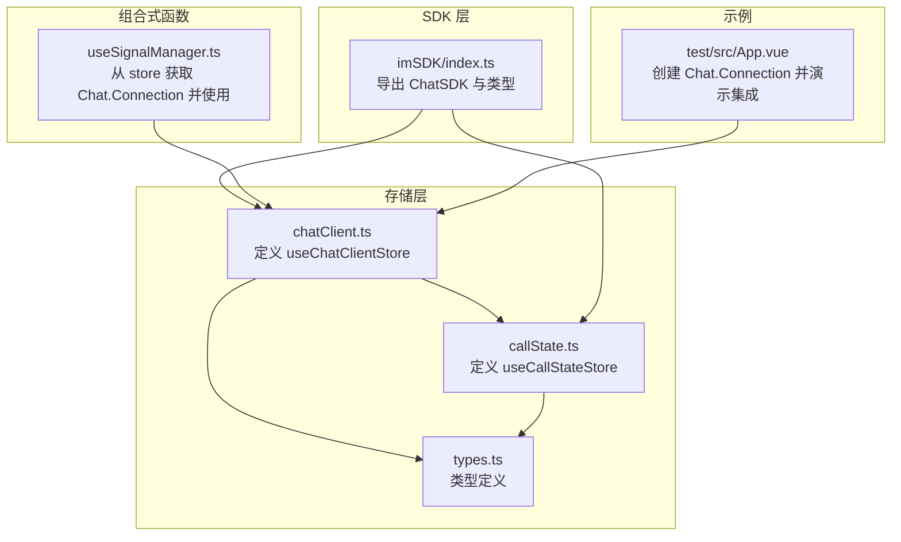
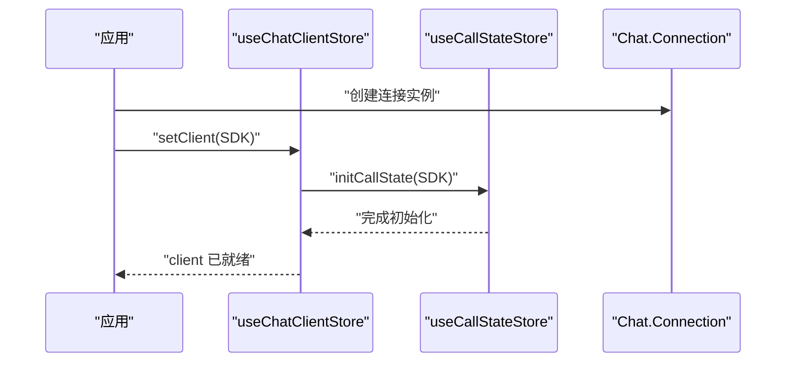
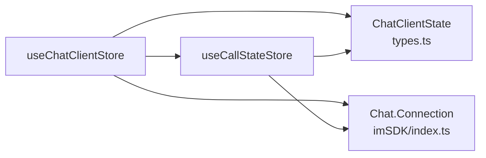

# 聊天客户端存储

<cite>
**本文引用的文件**
- [lib/store/chatClient.ts](file://lib/store/chatClient.ts)
- [lib/store/types.ts](file://lib/store/types.ts)
- [lib/store/callState.ts](file://lib/store/callState.ts)
- [lib/core/sdk/imSDK/index.ts](file://lib/core/sdk/imSDK/index.ts)
- [lib/composables/useSignalManager.ts](file://lib/composables/useSignalManager.ts)
- [test/src/App.vue](file://test/src/App.vue)
</cite>

## 目录
1. [简介](#简介)
2. [项目结构](#项目结构)
3. [核心组件](#核心组件)
4. [架构总览](#架构总览)
5. [详细组件分析](#详细组件分析)
6. [依赖关系分析](#依赖关系分析)
7. [性能考虑](#性能考虑)
8. [故障排查指南](#故障排查指南)
9. [结论](#结论)
10. [附录](#附录)

## 简介
本文件面向“聊天客户端存储”（useChatClientStore）的 API 文档，聚焦于 ChatClient 接口的状态结构、getter 计算属性与与之关联的 callState 初始化流程；并结合仓库中的环信 SDK 集成方式与状态同步机制，给出初始化与连接管理的完整示例路径、网络异常处理与自动重连策略建议。由于当前仓库中未提供完整的 ChatClient 初始化、连接、登录、登出、设备信息更新等动作实现，本文将基于现有代码进行严谨描述，并在缺失处明确标注。

## 项目结构
围绕 useChatClientStore 的相关文件组织如下：
- 存储层：chatClient.ts（定义 Pinia store）、callState.ts（通话状态 store）、types.ts（类型定义）
- SDK 层：imSDK/index.ts（封装环信 Web SDK 类型与导出）
- 组合式函数：useSignalManager.ts（演示如何从 store 获取 Chat.Connection 并进行消息发送）
- 示例：test/src/App.vue（演示如何创建 Chat.Connection 并与 store 集成）

图表来源
- [lib/store/chatClient.ts](file://lib/store/chatClient.ts#L1-L23)
- [lib/store/callState.ts](file://lib/store/callState.ts#L1-L263)
- [lib/store/types.ts](file://lib/store/types.ts#L1-L86)
- [lib/core/sdk/imSDK/index.ts](file://lib/core/sdk/imSDK/index.ts#L1-L12)
- [lib/composables/useSignalManager.ts](file://lib/composables/useSignalManager.ts#L50-L85)
- [test/src/App.vue](file://test/src/App.vue#L145-L156)

章节来源
- [lib/store/chatClient.ts](file://lib/store/chatClient.ts#L1-L23)
- [lib/store/types.ts](file://lib/store/types.ts#L1-L86)
- [lib/store/callState.ts](file://lib/store/callState.ts#L1-L263)
- [lib/core/sdk/imSDK/index.ts](file://lib/core/sdk/imSDK/index.ts#L1-L12)
- [lib/composables/useSignalManager.ts](file://lib/composables/useSignalManager.ts#L50-L85)
- [test/src/App.vue](file://test/src/App.vue#L145-L156)

## 核心组件
- useChatClientStore：负责保存 Chat.Connection 实例，并在设置客户端时联动初始化通话状态。
- useCallStateStore：负责通话生命周期状态管理，包括邀请、超时、最小化模式等。
- ChatClientState：定义客户端状态结构，包含 client 字段（Chat.Connection 或 null）。
- Chat.Connection：来自环信 Web SDK 的连接实例，提供上下文（context）与 jid 等信息。

章节来源
- [lib/store/chatClient.ts](file://lib/store/chatClient.ts#L6-L22)
- [lib/store/types.ts](file://lib/store/types.ts#L10-L12)
- [lib/store/callState.ts](file://lib/store/callState.ts#L11-L37)
- [lib/core/sdk/imSDK/index.ts](file://lib/core/sdk/imSDK/index.ts#L1-L12)

## 架构总览
useChatClientStore 与 useCallStateStore 的交互流程如下：

图表来源
- [lib/store/chatClient.ts](file://lib/store/chatClient.ts#L11-L16)
- [lib/store/callState.ts](file://lib/store/callState.ts#L44-L48)

## 详细组件分析

### ChatClient 状态结构
- 字段
  - client: Chat.Connection | null
    - 作用：保存当前登录并可用的环信连接实例
    - 初始值：null
- 关联上下文
  - client.context.jid.clientResource：设备标识（getter 中直接暴露）
- 类型定义
  - ChatClientState 定义于 types.ts，包含 client 字段

章节来源
- [lib/store/types.ts](file://lib/store/types.ts#L10-L12)
- [lib/store/chatClient.ts](file://lib/store/chatClient.ts#L7-L9)
- [lib/store/chatClient.ts](file://lib/store/chatClient.ts#L19-L21)

### Getter 计算属性
- getChatClient(state)
  - 返回当前 client 实例
- getClientDeviceId(state)
  - 返回 client.context.jid.clientResource（设备标识）
  - 若 client 为空则返回 undefined（类型安全）

章节来源
- [lib/store/chatClient.ts](file://lib/store/chatClient.ts#L18-L21)

### Actions 方法
- setClient(client: Chat.Connection)
  - 设置 client
  - 同步调用 useCallStateStore.initCallState(client)，完成通话相关上下文初始化（如 callerDevId、callerUserId、token 等）

注意：当前仓库未提供 initializeClient、connect、disconnect、login、logout、updateDeviceInfo 等具体实现。以下为基于现有能力的可扩展建议（非仓库已有实现）：
- initializeClient：建议在此方法中完成 SDK 初始化、配置加载与默认参数设置
- connect：建议在此方法中建立与环信服务器的连接，并监听连接状态变化
- disconnect：建议在此方法中断开连接并清理资源
- login：建议在此方法中完成用户认证流程（用户名/密码或 Token）
- logout：建议在此方法中执行登出并清理会话信息
- updateDeviceInfo：建议在此方法中更新设备标识与上下文信息

章节来源
- [lib/store/chatClient.ts](file://lib/store/chatClient.ts#L10-L16)
- [lib/store/callState.ts](file://lib/store/callState.ts#L44-L48)

### 与环信 SDK 的集成方式
- SDK 导出
  - imSDK/index.ts 导出 ChatSDK 与类型 Chat、ChatSDKStatic
- 连接实例
  - test/src/App.vue 展示了如何创建 Chat.Connection 实例并赋值给 store 的 client
- 信令使用
  - useSignalManager.ts 演示了从 store 获取 Chat.Connection 并构造 ChatService 进行消息发送

章节来源
- [lib/core/sdk/imSDK/index.ts](file://lib/core/sdk/imSDK/index.ts#L1-L12)
- [lib/composables/useSignalManager.ts](file://lib/composables/useSignalManager.ts#L50-L85)
- [test/src/App.vue](file://test/src/App.vue#L145-L156)

### 状态同步机制
- setClient 会触发 useCallStateStore.initCallState(client)，将 client 的上下文（如 userId、token、设备标识）写入通话状态
- 该机制确保后续通话相关操作（如邀请、接听、挂断）能直接使用 store 中的上下文信息

章节来源
- [lib/store/chatClient.ts](file://lib/store/chatClient.ts#L11-L16)
- [lib/store/callState.ts](file://lib/store/callState.ts#L44-L48)

### 完整示例（初始化与连接管理）
- 创建连接实例
  - 参考路径：[test/src/App.vue](file://test/src/App.vue#L145-L156)
- 设置客户端到 store
  - 参考路径：[lib/store/chatClient.ts](file://lib/store/chatClient.ts#L11-L16)
- 从 store 获取连接并发送信令
  - 参考路径：[lib/composables/useSignalManager.ts](file://lib/composables/useSignalManager.ts#L57-L85)

章节来源
- [test/src/App.vue](file://test/src/App.vue#L145-L156)
- [lib/store/chatClient.ts](file://lib/store/chatClient.ts#L11-L16)
- [lib/composables/useSignalManager.ts](file://lib/composables/useSignalManager.ts#L57-L85)

### 网络异常处理与自动重连策略
- 当前仓库未提供具体的网络异常处理与自动重连实现
- 建议策略（概念性指导，非仓库实现）：
  - 在 connect 流程中增加错误捕获与重试计数
  - 在 disconnected 事件中触发指数退避重连
  - 登录失败时清理无效 token 并引导重新登录
  - 登出时统一清理 store 与 SDK 资源

[本节为通用实践建议，不直接分析具体文件，故无章节来源]

## 依赖关系分析
- useChatClientStore 依赖
  - ChatClientState 类型（types.ts）
  - Chat.Connection 类型（来自 imSDK/index.ts）
  - useCallStateStore（在 setClient 中调用）
- useCallStateStore 依赖
  - Chat.Connection（用于提取上下文）
  - 通话状态类型（CALL_STATUS、CALL_TYPE 等，位于 types/callstate.types）

图表来源
- [lib/store/chatClient.ts](file://lib/store/chatClient.ts#L1-L6)
- [lib/store/types.ts](file://lib/store/types.ts#L1-L12)
- [lib/store/callState.ts](file://lib/store/callState.ts#L1-L7)
- [lib/core/sdk/imSDK/index.ts](file://lib/core/sdk/imSDK/index.ts#L1-L12)

章节来源
- [lib/store/chatClient.ts](file://lib/store/chatClient.ts#L1-L6)
- [lib/store/types.ts](file://lib/store/types.ts#L1-L12)
- [lib/store/callState.ts](file://lib/store/callState.ts#L1-L7)
- [lib/core/sdk/imSDK/index.ts](file://lib/core/sdk/imSDK/index.ts#L1-L12)

## 性能考虑
- 避免频繁重建 Chat.Connection 实例，尽量复用已登录连接
- 在 setClient 时仅做必要初始化，避免阻塞主线程
- 对超时计时器（inviteTimeoutTimer）进行及时清理，防止内存泄漏
- 在多端登录场景下，合理管理设备标识（clientResource），避免冲突

[本节提供通用建议，不直接分析具体文件，故无章节来源]

## 故障排查指南
- “ChatClient未初始化”
  - 现象：从 store 获取 client 为空时抛出错误
  - 排查：确认已在应用启动阶段创建 Chat.Connection 并调用 setClient
  - 参考路径：[lib/composables/useSignalManager.ts](file://lib/composables/useSignalManager.ts#L57-L64)
- 设备标识为空
  - 现象：getClientDeviceId 返回 undefined
  - 排查：确认 client 已成功登录且 context.jid.clientResource 可用
  - 参考路径：[lib/store/chatClient.ts](file://lib/store/chatClient.ts#L19-L21)
- 通话状态异常
  - 现象：邀请超时后界面未按预期隐藏
  - 排查：检查 useCallStateStore.handleTimeout 的逻辑与 isMultiCall 分支
  - 参考路径：[lib/store/callState.ts](file://lib/store/callState.ts#L115-L131)

章节来源
- [lib/composables/useSignalManager.ts](file://lib/composables/useSignalManager.ts#L57-L64)
- [lib/store/chatClient.ts](file://lib/store/chatClient.ts#L19-L21)
- [lib/store/callState.ts](file://lib/store/callState.ts#L115-L131)

## 结论
- 当前仓库提供了基础的 useChatClientStore 与 useCallStateStore，实现了 Chat.Connection 的保存与通话上下文初始化
- 未提供 initializeClient、connect、disconnect、login、logout、updateDeviceInfo 等具体实现，需在应用侧补充
- 建议在应用层完成 SDK 初始化、连接与登录流程，并通过 setClient 完成与通话状态的同步
- 网络异常处理与自动重连策略应作为后续扩展重点

[本节为总结性内容，不直接分析具体文件，故无章节来源]

## 附录

### API 概览（基于现有实现）
- 状态
  - client: Chat.Connection | null
- Getter
  - getChatClient(state): Chat.Connection | null
  - getClientDeviceId(state): string | undefined
- Action
  - setClient(client: Chat.Connection): void

章节来源
- [lib/store/types.ts](file://lib/store/types.ts#L10-L12)
- [lib/store/chatClient.ts](file://lib/store/chatClient.ts#L6-L22)