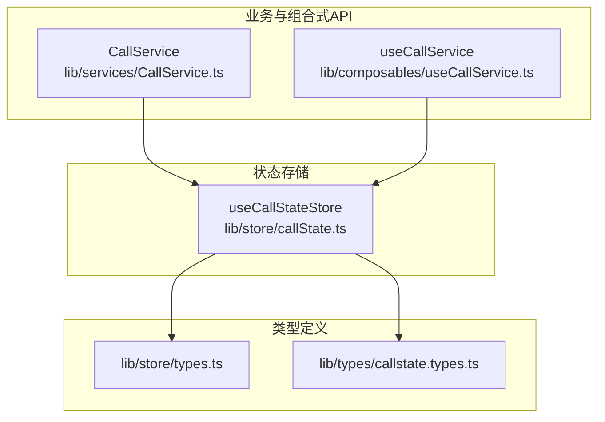
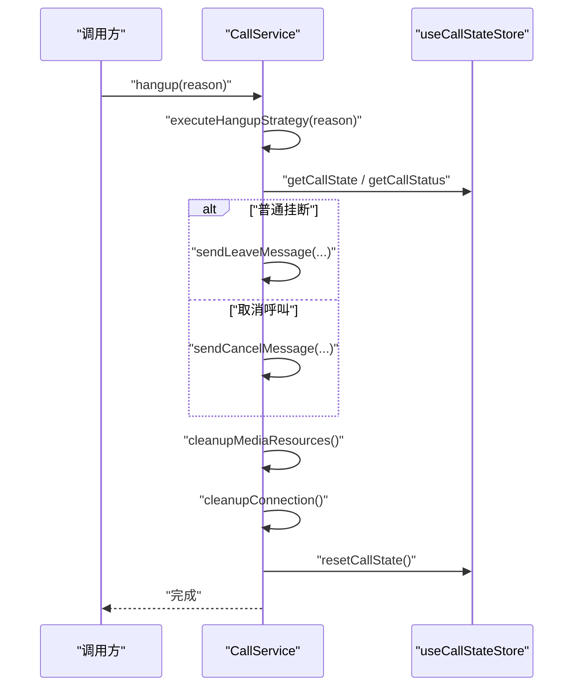
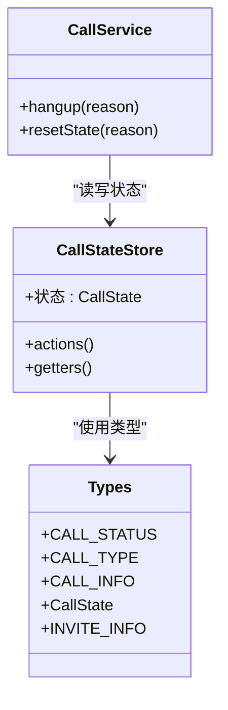

# 通话状态存储

<cite>
**本文引用的文件**
- [lib/store/callState.ts](file://lib/store/callState.ts)
- [lib/store/types.ts](file://lib/store/types.ts)
- [lib/types/callstate.types.ts](file://lib/types/callstate.types.ts)
- [.trae/documents/修复CallService中CallState store初始化检查问题.md](file://.trae/documents/修复CallService中CallState store初始化检查问题.md)
- [lib/services/CallService.ts](file://lib/services/CallService.ts)
- [lib/composables/useCallService.ts](file://lib/composables/useCallService.ts)
</cite>

## 目录
1. [简介](#简介)
2. [项目结构](#项目结构)
3. [核心组件](#核心组件)
4. [架构总览](#架构总览)
5. [详细组件分析](#详细组件分析)
6. [依赖分析](#依赖分析)
7. [性能考虑](#性能考虑)
8. [故障排查指南](#故障排查指南)
9. [结论](#结论)
10. [附录](#附录)

## 简介
本文件为通话状态存储（useCallStateStore）的权威 API 文档，覆盖 CallState 接口的完整状态结构、所有 actions 方法、所有 getters 计算属性，以及状态初始化、更新与重置的完整示例与生命周期管理说明。读者可据此在 Vue3 + Pinia 环境中正确使用通话状态存储，实现从邀请、超时、通话中到结束的全链路状态流转。

## 项目结构
通话状态存储位于 lib/store 目录，核心文件如下：
- lib/store/callState.ts：定义 useCallStateStore，包含 state、actions、getters
- lib/store/types.ts：定义 CallState、INVITE_INFO、CALL_INFO 等类型
- lib/types/callstate.types.ts：定义 CALL_STATUS、CALL_TYPE、HANGUP_REASON 等常量与接口
- lib/services/CallService.ts：业务服务类，直接依赖 useCallStateStore 进行状态重置与清理
- lib/composables/useCallService.ts：组合式 API，封装对 store 的读写与事件绑定
- .trae/documents/修复CallService中CallState store初始化检查问题.md：关于 store 初始化检查与错误处理的修复说明

图表来源
- [lib/store/callState.ts](file://lib/store/callState.ts#L1-L263)
- [lib/store/types.ts](file://lib/store/types.ts#L1-L86)
- [lib/types/callstate.types.ts](file://lib/types/callstate.types.ts#L1-L93)
- [lib/services/CallService.ts](file://lib/services/CallService.ts#L1-L298)
- [lib/composables/useCallService.ts](file://lib/composables/useCallService.ts#L1-L299)

章节来源
- [lib/store/callState.ts](file://lib/store/callState.ts#L1-L263)
- [lib/store/types.ts](file://lib/store/types.ts#L1-L86)
- [lib/types/callstate.types.ts](file://lib/types/callstate.types.ts#L1-L93)
- [lib/services/CallService.ts](file://lib/services/CallService.ts#L1-L298)
- [lib/composables/useCallService.ts](file://lib/composables/useCallService.ts#L1-L299)

## 核心组件
- useCallStateStore：基于 Pinia 的通话状态存储，提供状态、动作与计算属性
- 类型系统：
  - CALL_STATUS/CALL_TYPE/HANGUP_REASON：通话状态与类型枚举
  - CALL_INFO：通话基本信息接口
  - CallState：扩展自 CALL_INFO 的完整状态接口
  - INVITE_INFO：邀请信息接口

章节来源
- [lib/store/callState.ts](file://lib/store/callState.ts#L7-L37)
- [lib/store/types.ts](file://lib/store/types.ts#L35-L55)
- [lib/types/callstate.types.ts](file://lib/types/callstate.types.ts#L11-L67)

## 架构总览
以下序列图展示从业务服务到状态存储的关键交互路径，包括挂断流程中的状态重置与清理。

图表来源
- [lib/services/CallService.ts](file://lib/services/CallService.ts#L25-L276)
- [lib/store/callState.ts](file://lib/store/callState.ts#L156-L188)

章节来源
- [lib/services/CallService.ts](file://lib/services/CallService.ts#L25-L276)
- [lib/store/callState.ts](file://lib/store/callState.ts#L156-L188)

## 详细组件分析

### CallState 接口与状态结构
- 基础通话状态
  - status：当前通话状态（IDLE/INVITING/ALERTING/CONFIRM_RING/RECEIVED_CONFIRM_RING/ANSWER_CALL/CONFIRM_CALLEE/IN_CALL）
  - callType：通话类型（audio/video/null）
  - callId、channel、token：通话标识、信令通道名、内部令牌
  - type：CALL_TYPE（一对一/多人群组）
  - callerDevId、calleeDevId、callerUserId、calleeUserId：主被叫设备与用户标识
  - groupId、groupName、groupAvatar：群组通话相关
  - invitedMembers、joinedMembers：受邀与已加入成员列表
  - inviteMessageId、duration：邀请消息 ID、通话时长
- 超时与定时器
  - inviteTimeout：邀请超时时间（毫秒，默认 30000）
  - inviteTimeoutTimer：邀请超时定时器句柄
- 用户信息映射
  - userInfoMap：用户 ID 到用户信息（昵称、头像）的映射
  - UIdToUserIdMap：UID 到用户 ID 的映射（用于 RTC）
- 窗口模式
  - isMinimized：是否为小窗口模式

章节来源
- [lib/store/types.ts](file://lib/store/types.ts#L43-L55)
- [lib/types/callstate.types.ts](file://lib/types/callstate.types.ts#L49-L67)
- [lib/store/callState.ts](file://lib/store/callState.ts#L11-L37)

### Actions 方法详解

- initCallState(chatClient)
  - 作用：基于 ChatClient 初始化主被叫设备与用户信息、令牌
  - 输入：chatClient.Connection
  - 影响：填充 callerDevId、callerUserId、token
  - 典型调用：在登录或初始化阶段调用
  - 章节来源
    - [lib/store/callState.ts](file://lib/store/callState.ts#L44-L48)

- initInviteInfo(inviteInfo)
  - 作用：初始化邀请信息并进入 INVITING 状态
  - 输入：INVITE_INFO（type、calleeUserId、groupId、groupName、groupAvatar、invitedMembers）
  - 行为：
    - 群组通话时写入群组信息与受邀成员
    - 生成 callId、channel
    - 设置状态为 INVITING
    - 启动邀请超时计时器
  - 章节来源
    - [lib/store/callState.ts](file://lib/store/callState.ts#L50-L71)
    - [lib/store/types.ts](file://lib/store/types.ts#L35-L42)

- setUserInfo(userId, userInfo)
  - 作用：设置指定用户的昵称与头像
  - 输入：userId、{ nickname?, avatarURL? }
  - 行为：向 userInfoMap 写入用户信息
  - 章节来源
    - [lib/store/callState.ts](file://lib/store/callState.ts#L73-L80)

- updateInvitedMembers(members)
  - 作用：更新受邀成员列表
  - 输入：string[] 成员 ID 列表
  - 章节来源
    - [lib/store/callState.ts](file://lib/store/callState.ts#L82-L84)

- startTimeoutTimer(callback?)
  - 作用：启动邀请超时计时器；支持超时回调
  - 行为：
    - 清理旧定时器
    - 若 inviteTimeout 存在，则设置新定时器
    - 超时后调用 handleTimeout 并执行回调
  - 章节来源
    - [lib/store/callState.ts](file://lib/store/callState.ts#L89-L100)
    - [lib/store/callState.ts](file://lib/store/callState.ts#L115-L131)

- clearTimeoutTimer()
  - 作用：清除邀请超时计时器
  - 章节来源
    - [lib/store/callState.ts](file://lib/store/callState.ts#L105-L110)

- handleTimeout()
  - 作用：处理邀请超时逻辑
  - 行为：
    - 单人通话：设置状态为 IDLE（自动隐藏界面）
    - 多人通话：保持当前状态（等待用户手动挂断）
  - 章节来源
    - [lib/store/callState.ts](file://lib/store/callState.ts#L115-L131)

- updateCallState(partialState)
  - 作用：部分更新通话状态
  - 输入：Partial<CallState>
  - 章节来源
    - [lib/store/callState.ts](file://lib/store/callState.ts#L135-L137)

- setCallStatus(status)
  - 作用：设置通话状态
  - 行为：
    - 状态变更时，若从 IDLE 转为非 IDLE，清空 leftUsers（由 RTC 频道 store 负责）
  - 章节来源
    - [lib/store/callState.ts](file://lib/store/callState.ts#L142-L151)

- resetCallState()
  - 作用：重置所有通话状态
  - 行为：
    - 清除超时计时器
    - 状态归零（IDLE）、清空 callId/channel/callee 等
    - 清空群组通话相关字段
    - 重置通话类型为默认值
    - 清空用户信息映射与 UID 映射
    - 重置窗口模式
  - 章节来源
    - [lib/store/callState.ts](file://lib/store/callState.ts#L156-L188)

- buildAndUpdateInviteState(inviteInfo)
  - 作用：构建并更新邀请状态（包装 initInviteInfo）
  - 返回：当前 CallState
  - 章节来源
    - [lib/store/callState.ts](file://lib/store/callState.ts#L194-L198)

- generateCallId()
  - 作用：生成唯一通话 ID
  - 返回：string
  - 章节来源
    - [lib/store/callState.ts](file://lib/store/callState.ts#L203-L205)

### Getters 计算属性详解

- getCallStatus()
  - 返回：当前通话状态（CALL_STATUS）
  - 章节来源
    - [lib/store/callState.ts](file://lib/store/callState.ts#L214-L216)

- getCallState()
  - 返回：当前 CallState（只读视图）
  - 章节来源
    - [lib/store/callState.ts](file://lib/store/callState.ts#L217-L219)

- getUserInfo()
  - 返回：(userId) => 用户信息
  - 行为：从 userInfoMap 获取用户信息，不存在则返回空对象
  - 章节来源
    - [lib/store/callState.ts](file://lib/store/callState.ts#L221-L231)

- getInviteTimeoutTimer()
  - 返回：inviteTimeoutTimer 当前值
  - 章节来源
    - [lib/store/callState.ts](file://lib/store/callState.ts#L233-L235)

- isInviting()
  - 返回：是否处于 INVITING 状态
  - 章节来源
    - [lib/store/callState.ts](file://lib/store/callState.ts#L239-L241)

- isInCall()
  - 返回：是否处于通话中（非 IDLE）
  - 章节来源
    - [lib/store/callState.ts](file://lib/store/callState.ts#L246-L249)

- getInvitedMembers()
  - 返回：invitedMembers 数组
  - 章节来源
    - [lib/store/callState.ts](file://lib/store/callState.ts#L251-L253)

- getIsMinimized()
  - 返回：是否为小窗口模式
  - 章节来源
    - [lib/store/callState.ts](file://lib/store/callState.ts#L258-L260)

### 状态初始化、更新与重置示例

- 初始化
  - 步骤：
    1) 调用 initCallState(chatClient) 填充主被叫信息与令牌
    2) 调用 buildAndUpdateInviteState(inviteInfo) 或 initInviteInfo(inviteInfo) 进入 INVITING
    3) 可选：setUserInfo(userId, { nickname?, avatarURL? }) 填充用户信息
  - 章节来源
    - [lib/store/callState.ts](file://lib/store/callState.ts#L44-L48)
    - [lib/store/callState.ts](file://lib/store/callState.ts#L194-L198)
    - [lib/store/callState.ts](file://lib/store/callState.ts#L50-L71)
    - [lib/store/callState.ts](file://lib/store/callState.ts#L73-L80)

- 更新
  - 正常更新：updateCallState({ status, type, ... })
  - 设置状态：setCallStatus(CALL_STATUS)
  - 更新受邀成员：updateInvitedMembers([...])
  - 章节来源
    - [lib/store/callState.ts](file://lib/store/callState.ts#L135-L137)
    - [lib/store/callState.ts](file://lib/store/callState.ts#L142-L151)
    - [lib/store/callState.ts](file://lib/store/callState.ts#L82-L84)

- 重置
  - 结束或取消通话后：resetCallState()
  - 章节来源
    - [lib/store/callState.ts](file://lib/store/callState.ts#L156-L188)

### 生命周期与依赖关系

- 生命周期关键节点
  - INVITING → CONNECTING/ANSWER_CALL → IN_CALL → IDLE（结束）
  - INVITING → 超时（单人：IDLE；多人：保持等待）
- 依赖关系
  - CallService 通过 useCallStateStore 访问状态并调用 resetCallState
  - setCallStatus 在状态从 IDLE 转为非 IDLE 时，联动 RTC 频道 store 清理 leftUsers
  - 超时计时器由 startTimeoutTimer/stopTimeoutTimer 管理，handleTimeout 决定后续行为
- 章节来源
  - [lib/services/CallService.ts](file://lib/services/CallService.ts#L25-L276)
  - [lib/store/callState.ts](file://lib/store/callState.ts#L142-L151)
  - [lib/store/callState.ts](file://lib/store/callState.ts#L89-L131)

## 依赖分析

图表来源
- [lib/store/callState.ts](file://lib/store/callState.ts#L1-L263)
- [lib/services/CallService.ts](file://lib/services/CallService.ts#L1-L298)
- [lib/store/types.ts](file://lib/store/types.ts#L1-L86)
- [lib/types/callstate.types.ts](file://lib/types/callstate.types.ts#L1-L93)

章节来源
- [lib/store/callState.ts](file://lib/store/callState.ts#L1-L263)
- [lib/services/CallService.ts](file://lib/services/CallService.ts#L1-L298)
- [lib/store/types.ts](file://lib/store/types.ts#L1-L86)
- [lib/types/callstate.types.ts](file://lib/types/callstate.types.ts#L1-L93)

## 性能考虑
- 定时器管理：每次启动超时计时器前先清理旧计时器，避免重复计时导致内存泄漏
- 映射结构：userInfoMap/UIdToUserIdMap 采用 Map，适合频繁读写与清理
- 状态合并：updateCallState 使用浅合并，建议仅传入必要字段，减少不必要的响应式更新
- 资源清理：挂断流程中优先清理媒体资源与 RTC 连接，再重置状态，保证资源释放顺序

## 故障排查指南
- “CallState store not properly initialized”
  - 现象：在 CallService 中检查 getCallStatus 时报错
  - 原因：将 getter 属性误当作方法检查
  - 解决：改为属性访问检查；确保 Pinia 已正确安装；在使用 store 前进行初始化检查
  - 章节来源
    - [.trae/documents/修复CallService中CallState store初始化检查问题.md](file://.trae/documents/修复CallService中CallState store初始化检查问题.md#L1-L42)
    - [lib/services/CallService.ts](file://lib/services/CallService.ts#L29-L47)

- 超时后界面未隐藏
  - 现象：单人通话超时后界面仍显示
  - 原因：应由 setCallStatus(IDLE) 触发隐藏
  - 解决：确认 handleTimeout 流程中调用了 setCallStatus
  - 章节来源
    - [lib/store/callState.ts](file://lib/store/callState.ts#L115-L131)

- 多人通话超时不自动隐藏
  - 现象：多人通话超时后界面保持等待
  - 原因：多人通话需用户手动挂断
  - 解决：遵循 handleTimeout 的设计，等待用户主动结束
  - 章节来源
    - [lib/store/callState.ts](file://lib/store/callState.ts#L115-L131)

- 状态重置不彻底
  - 现象：多次通话后状态残留
  - 解决：调用 resetCallState，确保定时器、映射、窗口模式均被重置
  - 章节来源
    - [lib/store/callState.ts](file://lib/store/callState.ts#L156-L188)

## 结论
useCallStateStore 提供了完整的通话状态管理能力，涵盖邀请、超时、通话中与结束等全流程。通过明确的 actions 与 getters，结合 CallService 的统一调度，可实现稳定可靠的通话体验。遵循本文的初始化、更新与重置示例，以及故障排查建议，可在复杂场景中保持状态一致性与资源可控性。

## 附录

### API 一览（按类别）

- 状态字段（CallState）
  - 基础：status、callType、callId、channel、token、type、callerDevId、calleeDevId、callerUserId、calleeUserId、groupId、groupName、groupAvatar、invitedMembers、joinedMembers、inviteMessageId、duration
  - 超时：inviteTimeout、inviteTimeoutTimer
  - 用户映射：userInfoMap、UIdToUserIdMap
  - 窗口：isMinimized

- Actions
  - initCallState
  - initInviteInfo
  - setUserInfo
  - updateInvitedMembers
  - startTimeoutTimer
  - clearTimeoutTimer
  - handleTimeout
  - updateCallState
  - setCallStatus
  - resetCallState
  - buildAndUpdateInviteState
  - generateCallId

- Getters
  - getCallStatus
  - getCallState
  - getUserInfo
  - getInviteTimeoutTimer
  - isInviting
  - isInCall
  - getInvitedMembers
  - getIsMinimized