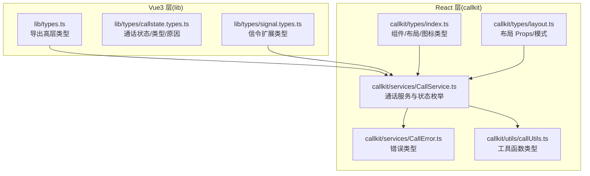
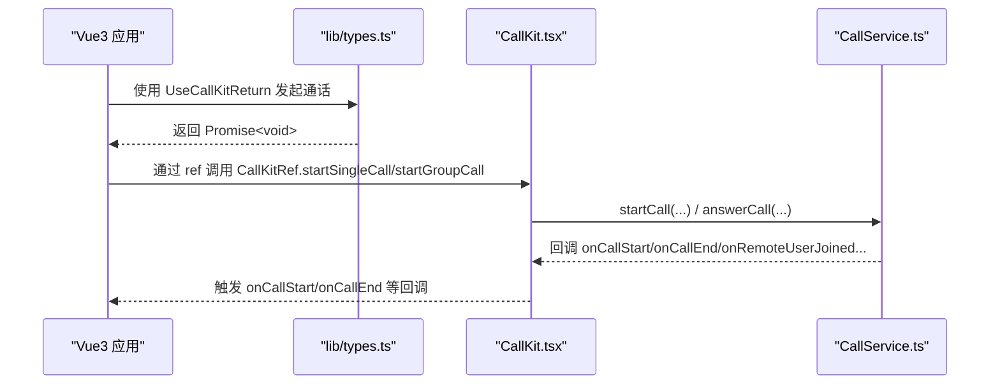
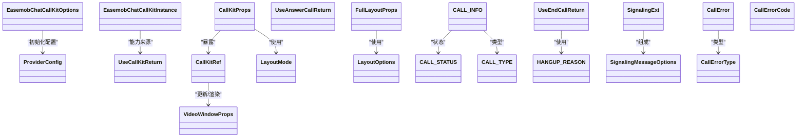

# 类型定义

<cite>
**本文引用的文件**
- [lib/types.ts](file://lib/types.ts)
- [lib/types/callstate.types.ts](file://lib/types/callstate.types.ts)
- [lib/types/signal.types.ts](file://lib/types/signal.types.ts)
- [callkit/types/index.ts](file://callkit/types/index.ts)
- [callkit/types/layout.ts](file://callkit/types/layout.ts)
- [callkit/services/CallService.ts](file://callkit/services/CallService.ts)
- [callkit/services/CallError.ts](file://callkit/services/CallError.ts)
- [callkit/utils/callUtils.ts](file://callkit/utils/callUtils.ts)
- [lib/index.ts](file://lib/index.ts)
- [callkit/CallKit.tsx](file://callkit/CallKit.tsx)
</cite>

## 目录
1. [简介](#简介)
2. [项目结构](#项目结构)
3. [核心类型总览](#核心类型总览)
4. [架构概览](#架构概览)
5. [详细类型解析](#详细类型解析)
6. [依赖关系分析](#依赖关系分析)
7. [性能与最佳实践](#性能与最佳实践)
8. [故障排查指南](#故障排查指南)
9. [结论](#结论)

## 简介
本文件为 Easemob Chat CallKit Vue3 项目的“类型定义参考”，聚焦于 TypeScript 类型、接口与枚举的完整说明，覆盖以下关键类型族：
- Vue3 生态导出类型：EasemobChatCallKitOptions、EasemobChatCallKitInstance、ProviderConfig、UseCallKitReturn 等
- 通话状态与信令类型：CALL_STATUS、CALL_TYPE、CALL_INFO、HANGUP_REASON、SignalingExt 等
- React 组件与布局类型：CallKitProps、CallKitRef、VideoWindowProps、LayoutMode、LayoutOptions、FullLayoutProps 等
- 错误与工具类型：CallError、CallErrorCode、CallErrorType、UseEndCallReturn、UseAnswerCallReturn 等

文档同时解释类型之间的继承与组合关系、泛型使用、约束与取值范围，并提供类型安全编程建议与常见错误的解决思路。

## 项目结构
类型定义主要分布在两个层面：
- lib/types：面向 Vue3 生态的高层 API 类型与导出
- callkit/types：React 组件层的 UI/交互类型与布局类型

图表来源
- [lib/types.ts](file://lib/types.ts#L1-L91)
- [lib/types/callstate.types.ts](file://lib/types/callstate.types.ts#L1-L93)
- [lib/types/signal.types.ts](file://lib/types/signal.types.ts#L1-L196)
- [callkit/types/index.ts](file://callkit/types/index.ts#L1-L356)
- [callkit/types/layout.ts](file://callkit/types/layout.ts#L1-L132)
- [callkit/services/CallService.ts](file://callkit/services/CallService.ts#L1-L4478)
- [callkit/services/CallError.ts](file://callkit/services/CallError.ts#L1-L43)
- [callkit/utils/callUtils.ts](file://callkit/utils/callUtils.ts#L1-L85)

章节来源
- [lib/types.ts](file://lib/types.ts#L1-L91)
- [callkit/types/index.ts](file://callkit/types/index.ts#L1-L356)

## 核心类型总览
- Vue3 导出类型族
  - EasemobChatCallKitOptions：初始化 Provider 的配置项
  - EasemobChatCallKitInstance：实例能力集合（别名：EasemobChatCallKitInstance）
  - ProviderConfig：Provider 初始化配置（含延迟初始化与兼容参数）
  - UseCallKitReturn：组合式函数返回的发起通话能力
  - UseEndCallReturn：挂断相关能力与状态检查
  - UseAnswerCallReturn：接听/拒绝/忙碌拒绝能力
- 通话状态与类型
  - CALL_STATUS、CALL_TYPE、CALL_INFO、HANGUP_REASON
  - 信令扩展：SignalingExt 及其子类型（Invite/Alert/ConfirmRing/AnswerCall/ConfirmCallee/CancelCall/LeaveCall）
- React 组件与布局
  - CallKitProps、CallKitRef：组件属性与暴露方法
  - VideoWindowProps：视频窗口数据模型
  - LayoutMode、LayoutOptions、LayoutStrategy、BaseLayoutProps、FullLayoutProps：布局体系
  - CallControlsIconMap/HeaderIconMap/CallKitIconMap：图标定制映射
- 错误与工具
  - CallError、CallErrorCode、CallErrorType：统一错误模型
  - 工具函数类型：generateRandomChannel、formatCallDuration、getUserAvatar、calculateSafePosition

章节来源
- [lib/types.ts](file://lib/types.ts#L1-L91)
- [lib/types/callstate.types.ts](file://lib/types/callstate.types.ts#L1-L93)
- [lib/types/signal.types.ts](file://lib/types/signal.types.ts#L1-L196)
- [callkit/types/index.ts](file://callkit/types/index.ts#L1-L356)
- [callkit/types/layout.ts](file://callkit/types/layout.ts#L1-L132)
- [callkit/services/CallError.ts](file://callkit/services/CallError.ts#L1-L43)
- [callkit/utils/callUtils.ts](file://callkit/utils/callUtils.ts#L1-L85)

## 架构概览
类型在组件与服务之间形成清晰的契约边界：
- 组件层（React）通过 CallKitProps/CallKitRef 暴露能力，内部依赖 CallService 管理状态与信令
- 服务层（CallService）维护 CALL_STATUS/CALL_TYPE/CALL_INFO/HANGUP_REASON，并通过信令扩展与 IM/RTC 通信
- Vue3 层（lib）提供高层 API（ProviderConfig、UseCallKitReturn 等），对接 React 组件并导出类型

图表来源
- [lib/types.ts](file://lib/types.ts#L51-L65)
- [callkit/CallKit.tsx](file://callkit/CallKit.tsx#L1-L200)
- [callkit/services/CallService.ts](file://callkit/services/CallService.ts#L1-L4478)

## 详细类型解析

### Vue3 导出类型族
- EasemobChatCallKitOptions
  - 字段要点：appKey、userId、accessToken、debug、enableRingtone、resizable、draggable、chatClient
  - 约束与用途：作为 Provider 初始化参数，驱动底层连接与 UI 行为
- EasemobChatCallKitInstance（别名：EasemobChatCallKitInstance）
  - 字段要点：startCall/endCall、startChat、isInCall/callType/targetUser、config
  - 约束与用途：对外暴露的实例能力，便于上层控制
- ProviderConfig
  - 字段要点：chatClient（可选，支持延迟初始化）、agoraAppId（已废弃）、initConfig（debug、enableRingtone、resizable、draggable、inviteTimeout）
  - 约束与用途：Provider 的配置入口，initConfig 用于运行期行为开关
- UseCallKitReturn
  - 字段要点：startSingleCall(targetId, type, msg)、startGroupCall(groupId, members, type, msg, groupName?, groupAvatar?)
  - 约束与用途：组合式函数返回，封装单人/群组通话发起流程
- UseEndCallReturn
  - 字段要点：hangup(reason?)、hangupCall()、cancelCall()、handleRemoteCancel()、handleRemoteRefuse()、handleAbnormalEnd()、canHangup()、canCancel()
  - 约束与用途：挂断相关动作与状态检查，保证在不同状态下执行合法操作
- UseAnswerCallReturn
  - 字段要点：acceptCall()、rejectCall()、busyRejectCall()
  - 约束与用途：接听/拒绝/忙碌拒绝的组合式能力

章节来源
- [lib/types.ts](file://lib/types.ts#L1-L91)

### 通话状态与类型
- CALL_MODE（lib/types/callstate.types.ts）
  - 取值："audio" | "video" | "group"
- CALL_STATUS_NAME（lib/types/callstate.types.ts）
  - 取值："idle" | "inviting" | "ringing" | "connecting" | "connected" | "ended"
- CALL_STATUS（lib/types/callstate.types.ts）
  - 数字枚举：0~7，对应 IDLE、INVITING、ALERTING、CONFIRM_RING、RECEIVED_CONFIRM_RING、ANSWER_CALL、CONFIRM_CALLEE、IN_CALL
- CALLKIT_CMD_MSG_RESULT_TYPE（lib/types/callstate.types.ts）
  - 取值："accept" | "refuse" | "busy"
- CALLKIT_CMD_MSG_ACTION_TYPE（lib/types/callstate.types.ts）
  - 取值："confirmRing" | "alert" | "answerCall" | "leaveCall" | "confirmCallee" | "cancelCall"
- CALL_TYPE（lib/types/callstate.types.ts）
  - 数值枚举：0（AUDIO_1V1）、1（VIDEO_1V1）、2（VIDEO_MULTI）、3（AUDIO_MULTI）；React 层 CallService.ts 亦定义同名枚举
- CALL_INFO（lib/types/callstate.types.ts）
  - 字段要点：callId、channel、token、type、callerDevId、calleeDevId、callerUserId、calleeUserId、groupId/groupName/groupAvatar、invitedMembers/joinedMembers、inviteMessageId、duration、state
  - 约束与用途：描述一次通话的元信息，贯穿信令与 UI
- HANGUP_REASON（lib/types/callstate.types.ts）
  - 取值："hangup" | "cancel" | "remoteCancel" | "refuse" | "remoteRefuse" | "busy" | "noResponse" | "remoteNoResponse" | "handleOnOtherDevice" | "abnormalEnd"
  - 约束与用途：挂断原因分类，配合 UseEndCallReturn 使用

章节来源
- [lib/types/callstate.types.ts](file://lib/types/callstate.types.ts#L1-L93)
- [callkit/services/CallService.ts](file://callkit/services/CallService.ts#L14-L66)

### 信令扩展类型
- SignalMessageInviteExt（lib/types/signal.types.ts）
  - 字段要点：action 固定为 "invite"、callId、calleeIMName、callerDevId、callerIMName、channelName、chatType、type、ts、msgType、em_push_ext（含 custom）、em_apns_ext（固定 em_push_type 为 "voip"）、ease_chat_uikit_user_info（可选）
  - 约束与用途：文本消息中的邀请扩展，用于 IM 推送与 APNS
- BaseSignalingExt（lib/types/signal.types.ts）
  - 字段要点：action、callId、ts、msgType
  - 约束与用途：所有 CMD 信令扩展的基础字段
- InviteSignalingExt/AlertSignalingExt/ConfirmRingSignalingExt/AnswerCallSignalingExt/ConfirmCalleeSignalingExt/CancelCallSignalingExt/LeaveCallSignalingExt（lib/types/signal.types.ts）
  - 字段要点：各自 action 与特定字段（如 channelName、callerDevId、calleeDevId、result、status、ext 等）
  - 约束与用途：标准化各阶段信令的扩展字段
- SignalingExt（lib/types/signal.types.ts）
  - 联合类型：上述所有扩展类型的并集
- SignalingMessageOptions（lib/types/signal.types.ts）
  - 字段要点：type 固定为 "cmd"、chatType（"singleChat" | "groupChat"）、to、action、ext（SignalingExt）、receiverList、deliverOnlineOnly
  - 约束与用途：构造 CMD 信令消息的配置

章节来源
- [lib/types/signal.types.ts](file://lib/types/signal.types.ts#L1-L196)

### React 组件与布局类型
- VideoWindowProps（callkit/types/index.ts）
  - 字段要点：id、stream、videoElement、muted、cameraEnabled、nickname、avatar、isLocalVideo、isWaiting、onVideoClick、removed
  - 约束与用途：描述单个视频窗口的数据模型，用于渲染与交互
- LayoutMode（callkit/types/index.ts 与 callkit/types/layout.ts）
  - 取值："multi-party" | "one-to-one" | "preview" | "screen-share" | "minimized" | "main-video" | "voice-call"
  - 约束与用途：布局模式枚举，驱动不同布局策略
- LayoutConfig（callkit/types/index.ts）
  - 字段要点：rows、cols、itemsPerRow、maxCols、mode
  - 约束与用途：布局计算结果，描述网格与行列分布
- VideoSize/ContainerSize（callkit/types/index.ts）
  - 字段要点：VideoSize(width、height、actualWidth、actualHeight)；ContainerSize(width、height)
  - 约束与用途：容器与视频尺寸信息
- VideoSwitchingState（callkit/types/index.ts）
  - 字段要点：isVideoSwitching、switchingFromVideoId、switchingToVideoId
  - 约束与用途：视频切换过程的状态
- LayoutStrategy（callkit/types/index.ts）
  - 方法要点：calculateLayout、calculateVideoSize、renderLayout
  - 约束与用途：布局策略接口，抽象布局算法
- LayoutOptions（callkit/types/index.ts）
  - 字段要点：aspectRatio、gap、headerHeight、controlsHeight、maxVideos
  - 约束与用途：布局计算的输入参数
- InvitationInfo（callkit/types/index.ts）
  - 字段要点：id、callerUserId、type（"video"|"audio"|"group"）、callerName、callerAvatar、groupId/groupName/groupAvatar、memberCount、timestamp、customData
  - 约束与用途：邀请信息的数据模型
- InvitationNotificationProps（callkit/types/index.ts）
  - 字段要点：invitation、onAccept、onReject、customContent、acceptText、rejectText、showAvatar、showTimer、autoRejectTime、className、style
  - 约束与用途：邀请通知组件的属性
- CallKitRef（callkit/types/index.ts）
  - 方法要点：showInvitation/hideInvitation、startCall/endCall/updateVideos、getCallStatus、showPreview、startGroupCall、startSingleCall/answerCall/exitCall、setUserInfo、toggleMute/toggleCamera/isMuted/isCameraEnabled、getJoinedMembers、refreshLocalVideoStatus、playLocalVideoManually、createLocalVideoTrackForGroupCall/createLocalVideoTrackFor1v1Preview、addParticipants、adjustSize
  - 约束与用途：通过 ref 暴露给外部的 CallKit 能力集合
- CallKitProps（callkit/types/index.ts）
  - 字段要点：布局相关（layoutMode/maxVideos/aspectRatio/gap）、背景图、通话模式、控制按钮、真实通话配置（chatClient、enableRealCall、useRTCToken）、铃声配置、可调整大小/拖拽/内置位置管理、最小化、邀请配置、群组成员选择、用户/群组信息提供者、事件回调、日志配置、自定义图标、encoderConfig、错误与状态回调
  - 约束与用途：CallKit 主组件的完整属性集
- BaseLayoutProps/FullLayoutProps（callkit/types/layout.ts）
  - 字段要点：BaseLayoutProps 包含 videos/containerSize/prefixCls/renderVideoWindow/renderHeader/renderControls/aspectRatio/gap/maxVideos/backgroundImage/onMinimizedClick；FullLayoutProps 扩展了 callMode/callStatus/isShowingPreview/isFullscreen/onFullscreenToggle/isMinimized/onMinimizedToggle/showControls/muted/cameraEnabled/speakerEnabled/screenSharing/onMuteToggle/onCameraToggle/onSpeakerToggle/onCameraFlip/onScreenShareToggle/onHangup/onAddParticipant/onPreviewAccept/onPreviewReject/invitation/callInfo/isGroupCall/hasParticipants/isConnected/onLayoutModeChange/networkQuality/customIcons/iconRenderer/isDragging/justFinishedDrag
  - 约束与用途：布局组件的通用与完整属性，承载 UI 状态与交互
- LayoutComponent（callkit/types/layout.ts）
  - 类型要点：React.FC<FullLayoutProps>
  - 约束与用途：布局组件的类型别名
- CustomIconProps/CallControlsIconMap/HeaderIconMap/CallKitIconMap（callkit/types/index.ts）
  - 字段要点：CustomIconProps（type/width/height/color/[key: string]）；CallControlsIconMap/HeaderIconMap 支持多种控件图标；CallKitIconMap 组合 controls/header
  - 约束与用途：图标定制映射，支持组件级自定义

章节来源
- [callkit/types/index.ts](file://callkit/types/index.ts#L1-L356)
- [callkit/types/layout.ts](file://callkit/types/layout.ts#L1-L132)

### 错误与工具类型
- CallError（callkit/services/CallError.ts）
  - 字段要点：errorType（CallErrorType）、code（CallErrorCode | AgoraRTCErrorCode | number）、message、data
  - 约束与用途：统一错误对象，便于上层捕获与处理
- CallErrorCode/CallErrorType（callkit/services/CallError.ts）
  - 取值：CALL_STATE_ERROR、CALL_PARAM_ERROR、CALL_SIGNALING_ERROR；CALLKIT、RTC、CHAT
- 工具函数类型（callkit/utils/callUtils.ts）
  - generateRandomChannel(length): string
  - formatCallDuration(seconds): string
  - getUserAvatar(userId, userInfoProvider?): Promise<string | undefined>
  - calculateSafePosition(centerX, centerY, width, height, margin?): { left, top }

章节来源
- [callkit/services/CallError.ts](file://callkit/services/CallError.ts#L1-L43)
- [callkit/utils/callUtils.ts](file://callkit/utils/callUtils.ts#L1-L85)

## 依赖关系分析
- 类型到实现的映射
  - Vue3 导出类型（lib/types.ts）被 lib/index.ts 导出，供上层应用使用
  - React 组件（callkit/CallKit.tsx）消费 callkit/types/index.ts 与 layout.ts 中的类型
  - 服务层（callkit/services/CallService.ts）定义 CALL_STATUS/CALL_TYPE/CALL_INFO/HANGUP_REASON，并在组件中被使用
  - 信令类型（lib/types/signal.types.ts）与服务层协作，驱动 IM/RTC 信令流转
- 关键耦合点
  - CallKitProps 与 CallServiceConfig 存在字段对齐（如 useRTCToken、encoderConfig、ringtone 相关配置）
  - LayoutMode 在组件与服务层均出现，确保 UI 与状态一致
  - HANGUP_REASON 与 UseEndCallReturn 的方法一一对应，保证挂断语义一致

图表来源
- [lib/types.ts](file://lib/types.ts#L1-L91)
- [callkit/types/index.ts](file://callkit/types/index.ts#L1-L356)
- [callkit/types/layout.ts](file://callkit/types/layout.ts#L1-L132)
- [lib/types/callstate.types.ts](file://lib/types/callstate.types.ts#L1-L93)
- [lib/types/signal.types.ts](file://lib/types/signal.types.ts#L1-L196)
- [callkit/services/CallError.ts](file://callkit/services/CallError.ts#L1-L43)

章节来源
- [lib/index.ts](file://lib/index.ts#L33-L46)
- [callkit/CallKit.tsx](file://callkit/CallKit.tsx#L1-L200)

## 性能与最佳实践
- 类型安全优先
  - 使用字面量联合类型（如 "video" | "audio" | "group"）替代字符串字面量，避免拼写错误
  - 对可选字段（如 userInfoProvider、groupInfoProvider）进行空值检查后再使用
- 约束与默认值
  - 对数值范围（如 ringtoneVolume: 0-1、speakingVolumeThreshold: 1-100）进行校验
  - 对布局参数（aspectRatio、gap、maxVideos）设置合理默认值，避免布局异常
- 状态一致性
  - 通过 CALL_STATUS/CALL_TYPE/CALL_INFO 统一管理通话生命周期，避免状态漂移
  - 使用 HANGUP_REASON 与 UseEndCallReturn 的 can* 方法，确保在合法状态下执行操作
- 图标与资源
  - 通过 CallKitIconMap/CallControlsIconMap/HeaderIconMap 提供图标映射，减少重复渲染
  - 铃声资源路径与 loop/enableRingtone 配置保持一致，避免播放异常
- 信令健壮性
  - SignalingExt 的 action 与字段严格匹配，避免 IM/RTC 信令不一致导致的异常
  - deliverOnlineOnly 与 receiverList 的组合使用，确保目标用户接收

[本节为通用指导，无需列出具体文件来源]

## 故障排查指南
- 常见类型错误
  - 传入 CallKitProps 的 callMode 与实际邀请类型不一致：检查 InvitationInfo.type 与 CallKitProps.callMode 的匹配
  - 未提供 userInfoProvider/groupInfoProvider 导致头像/群组信息缺失：在 ProviderConfig 或 CallKitProps 中配置相应提供者
  - 未设置 chatClient 导致真实通话不可用：确保 ProviderConfig.chatClient 或 CallKitProps.chatClient 已正确初始化
- 通话状态异常
  - CALL_STATUS 与 UI 状态不一致：检查 onCallStatusChanged 回调与组件内部状态同步
  - HANGUP_REASON 与挂断行为不符：核对 UseEndCallReturn.canHangup/canCancel 的返回值
- 信令问题
  - SignalingMessageOptions 的 chatType 与 action 不匹配：确保 chatType 与 action 符合规范
  - deliverOnlineOnly 与 receiverList 使用不当：单聊与群聊场景分别处理
- 错误处理
  - CallError 的 errorType/code/message 用于区分错误来源与类型，结合 CallErrorType/CallErrorCode 进行分支处理

章节来源
- [callkit/services/CallError.ts](file://callkit/services/CallError.ts#L1-L43)
- [lib/types/signal.types.ts](file://lib/types/signal.types.ts#L185-L194)
- [lib/types/callstate.types.ts](file://lib/types/callstate.types.ts#L69-L93)

## 结论
本文系统梳理了 Easemob Chat CallKit Vue3 的类型定义，涵盖 Vue3 层与 React 层的关键类型族，并结合服务层与工具层的实现，给出类型之间的关系、约束与使用建议。遵循本文的类型安全实践与排错指引，可在复杂音视频通话场景中提升开发效率与稳定性。