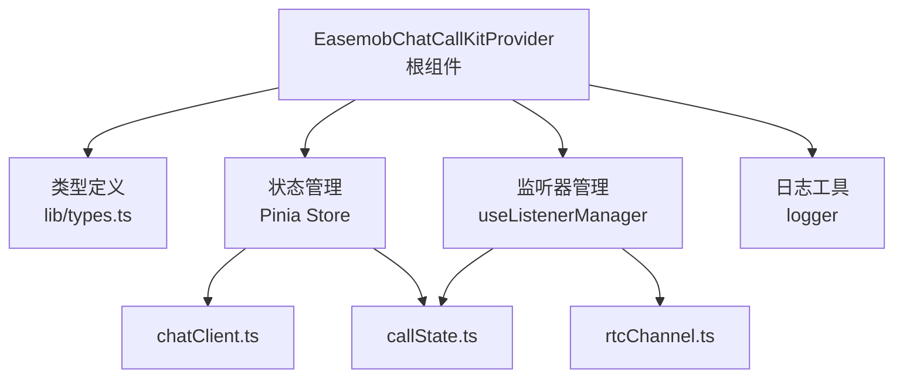
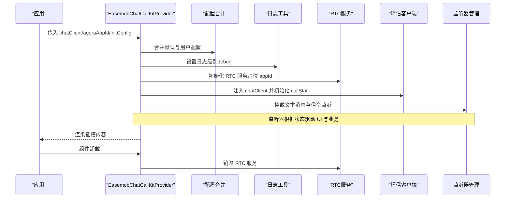
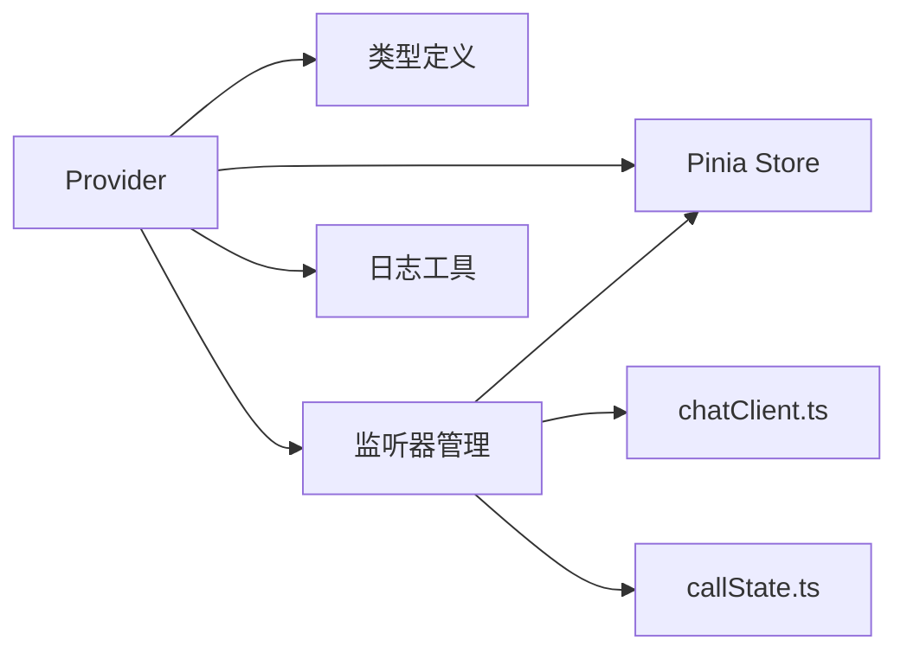
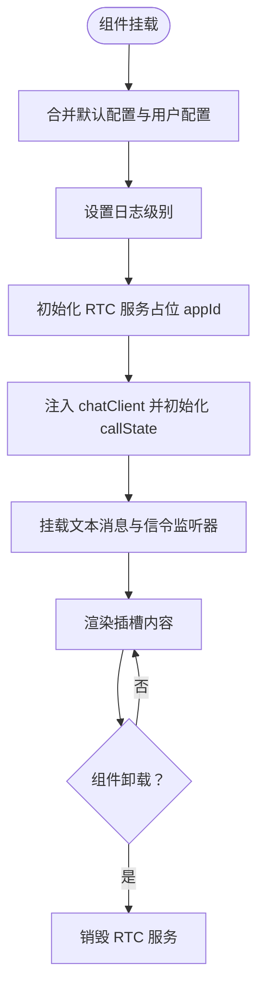

# Provider 组件 API

<cite>
**本文引用的文件**
- [lib/components/EasemobChatCallKitProvider.vue](file://lib/components/EasemobChatCallKitProvider.vue)
- [lib/types.ts](file://lib/types.ts)
- [lib/index.ts](file://lib/index.ts)
- [lib/composables/useListenerManager.ts](file://lib/composables/useListenerManager.ts)
- [lib/store/chatClient.ts](file://lib/store/chatClient.ts)
- [lib/store/callState.ts](file://lib/store/callState.ts)
- [lib/store/types.ts](file://lib/store/types.ts)
- [lib/utils/logger.ts](file://lib/utils/logger.ts)
- [USAGE.md](file://USAGE.md)
- [README.md](file://README.md)
- [lib/ARCHITECTURE.md](file://lib/ARCHITECTURE.md)
- [lib/SIGNALING_IMPLEMENTATION.md](file://lib/SIGNALING_IMPLEMENTATION.md)
</cite>

## 目录
1. [简介](#简介)
2. [项目结构](#项目结构)
3. [核心组件](#核心组件)
4. [架构总览](#架构总览)
5. [详细组件分析](#详细组件分析)
6. [依赖关系分析](#依赖关系分析)
7. [性能考量](#性能考量)
8. [故障排查指南](#故障排查指南)
9. [结论](#结论)
10. [附录](#附录)

## 简介
EasemobChatCallKitProvider 是 CallKit 系统的根组件，负责：
- 全局配置合并与响应式管理（initConfig）
- 环信客户端实例注入与初始化
- 事件监听器挂载（文本消息与信令）
- RTC 服务初始化（AppId 从服务器动态获取）
- 生命周期钩子与资源清理（onMounted/onUnmounted）

其职责是为上层组件提供统一的上下文与状态基础，确保通话链路从“配置 → 客户端 → 监听 → 业务”顺畅衔接。

## 项目结构
- 组件层：Provider 位于 lib/components，作为根容器
- 类型层：lib/types.ts 定义 ProviderConfig、initConfig 字段与类型别名
- 状态层：Pinia Store（chatClient、callState、rtcChannel）集中管理全局状态
- 监听层：useListenerManager 负责文本消息与信令监听
- 工具层：logger 提供日志级别与调试开关
- 示例与文档：USAGE.md 提供使用示例；README.md、ARCHITECTURE.md、SIGNALING_IMPLEMENTATION.md 提供架构与流程说明

图表来源
- [lib/components/EasemobChatCallKitProvider.vue](file://lib/components/EasemobChatCallKitProvider.vue#L1-L115)
- [lib/types.ts](file://lib/types.ts#L36-L46)
- [lib/composables/useListenerManager.ts](file://lib/composables/useListenerManager.ts#L1-L684)
- [lib/store/chatClient.ts](file://lib/store/chatClient.ts#L1-L23)
- [lib/store/callState.ts](file://lib/store/callState.ts#L1-L263)
- [lib/utils/logger.ts](file://lib/utils/logger.ts#L1-L231)

章节来源
- [lib/components/EasemobChatCallKitProvider.vue](file://lib/components/EasemobChatCallKitProvider.vue#L1-L115)
- [lib/types.ts](file://lib/types.ts#L1-L49)
- [lib/index.ts](file://lib/index.ts#L1-L57)

## 核心组件
- 组件名称：EasemobChatCallKitProvider
- 作用：根容器，承载全局配置、状态与监听器，向上提供上下文
- 依赖：Vue 组合式 API（watchEffect、computed、onMounted、onUnmounted）、Pinia Store、监听器管理器、日志工具

章节来源
- [lib/components/EasemobChatCallKitProvider.vue](file://lib/components/EasemobChatCallKitProvider.vue#L7-L14)

## 架构总览
Provider 的初始化流程如下：
- 接收 props：chatClient、agoraAppId、initConfig
- 合并默认配置与用户配置，形成 effectiveInitConfig
- 设置日志级别（debug）
- 初始化 RTC 服务（占位 appId，实际 appId 由服务器下发）
- 将 chatClient 注入到 chatClientStore，并触发 callStateStore 初始化
- 挂载文本消息与信令监听器
- 组件卸载时销毁 RTC 服务

图表来源
- [lib/components/EasemobChatCallKitProvider.vue](file://lib/components/EasemobChatCallKitProvider.vue#L19-L113)
- [lib/store/chatClient.ts](file://lib/store/chatClient.ts#L10-L16)
- [lib/composables/useListenerManager.ts](file://lib/composables/useListenerManager.ts#L619-L682)
- [lib/utils/logger.ts](file://lib/utils/logger.ts#L91-L94)

章节来源
- [lib/components/EasemobChatCallKitProvider.vue](file://lib/components/EasemobChatCallKitProvider.vue#L19-L113)
- [lib/store/chatClient.ts](file://lib/store/chatClient.ts#L10-L16)
- [lib/composables/useListenerManager.ts](file://lib/composables/useListenerManager.ts#L619-L682)
- [lib/utils/logger.ts](file://lib/utils/logger.ts#L91-L94)

## 详细组件分析

### Provider 属性与配置项
- chatClient
  - 类型：Connection（环信 WebSDK 实例）
  - 必填：是
  - 作用：注入环信客户端，供全局状态与监听器使用
  - 说明：Provider 会将其保存到 chatClientStore，并触发 callStateStore 初始化

- agoraAppId
  - 类型：string
  - 必填：是（用于初始化占位）
  - 作用：Provider 会以此初始化 RTC 服务；实际 AppId 将在加入频道时从服务器动态获取
  - 说明：该参数用于向后兼容，实际运行时以服务器下发为准

- initConfig（对象）
  - 类型：见 ProviderConfig.initConfig
  - 必填：否
  - 默认值：见默认配置对象
  - 字段与含义：
    - debug: boolean — 开启调试模式，影响日志级别
    - enableRingtone: boolean — 是否启用铃声
    - resizable: boolean — 是否允许窗口可调整大小
    - draggable: boolean — 是否允许窗口可拖动
    - inviteTimeout: number — 邀请超时时间（毫秒），默认 30000

- effectiveInitConfig（响应式配置）
  - 由默认配置与用户配置合并生成，供全局使用
  - Provider 会将其写入全局配置对象 globalConfig，并设置日志级别

章节来源
- [lib/types.ts](file://lib/types.ts#L36-L46)
- [lib/components/EasemobChatCallKitProvider.vue](file://lib/components/EasemobChatCallKitProvider.vue#L19-L57)
- [lib/store/callState.ts](file://lib/store/callState.ts#L31-L31)

### 生命周期钩子与资源管理
- onMounted
  - 将 mounted 设为 true，渲染插槽内容
- onUnmounted
  - 销毁 RTC 服务，释放资源

章节来源
- [lib/components/EasemobChatCallKitProvider.vue](file://lib/components/EasemobChatCallKitProvider.vue#L105-L113)

### 全局状态初始化过程
- chatClientStore.setClient
  - 将 chatClient 保存到 store，并调用 callStateStore.initCallState
- callStateStore.initCallState
  - 初始化 callerDevId、callerUserId、token 等基础信息
- inviteTimeout
  - 从 effectiveInitConfig 读取并写入 callStateStore，用于邀请超时控制

章节来源
- [lib/store/chatClient.ts](file://lib/store/chatClient.ts#L10-L16)
- [lib/store/callState.ts](file://lib/store/callState.ts#L44-L48)
- [lib/components/EasemobChatCallKitProvider.vue](file://lib/components/EasemobChatCallKitProvider.vue#L66-L69)

### 事件监听器挂载
- 监听器管理器 useListenerManager
  - mountTextMessageListener：监听文本消息，处理通话邀请与用户属性
  - mountSignalListener：监听信令消息，处理 alert、confirmRing、answerCall、confirmCallee、cancelCall、leaveCall 等
- 挂载时机
  - 在 chatClientStore.getChatClient 存在时挂载
  - Provider 顶层创建监听器管理器实例，避免重复创建

章节来源
- [lib/composables/useListenerManager.ts](file://lib/composables/useListenerManager.ts#L619-L682)
- [lib/components/EasemobChatCallKitProvider.vue](file://lib/components/EasemobChatCallKitProvider.vue#L63-L103)

### 日志与调试
- 日志级别
  - 通过 effectiveInitConfig.debug 控制日志级别
  - Logger.setDebug 根据 debug 动态调整
- 日志输出
  - Provider 初始化、配置合并、监听器挂载等关键节点均输出日志

章节来源
- [lib/utils/logger.ts](file://lib/utils/logger.ts#L91-L94)
- [lib/components/EasemobChatCallKitProvider.vue](file://lib/components/EasemobChatCallKitProvider.vue#L66-L77)

### 使用示例
- 全局注册插件与样式
- 在根组件中放置 Provider，传入 chatClient、agoraAppId 与 initConfig
- 在路由视图外层包裹 InvitationNotification 以显示来电弹窗

章节来源
- [USAGE.md](file://USAGE.md#L16-L56)
- [README.md](file://README.md#L138-L155)

## 依赖关系分析
- Provider 依赖
  - 类型定义：ProviderConfig、initConfig 字段
  - 状态管理：chatClientStore、callStateStore、rtcChannelStore
  - 监听器：useListenerManager
  - 工具：logger
- 组件耦合
  - Provider 与监听器管理器解耦，通过 store 交互
  - 与 RTC 服务通过 store 初始化，避免直接耦合

图表来源
- [lib/components/EasemobChatCallKitProvider.vue](file://lib/components/EasemobChatCallKitProvider.vue#L8-L14)
- [lib/types.ts](file://lib/types.ts#L36-L46)
- [lib/composables/useListenerManager.ts](file://lib/composables/useListenerManager.ts#L1-L16)

章节来源
- [lib/components/EasemobChatCallKitProvider.vue](file://lib/components/EasemobChatCallKitProvider.vue#L8-L14)
- [lib/types.ts](file://lib/types.ts#L36-L46)
- [lib/composables/useListenerManager.ts](file://lib/composables/useListenerManager.ts#L1-L16)

## 性能考量
- 配置合并与响应式
  - 通过 computed 生成 globalConfig，避免重复计算
  - initConfig 合并采用浅拷贝策略，减少深拷贝开销
- 监听器挂载
  - 仅在 chatClientStore.getChatClient 存在时挂载，避免无效监听
- 资源清理
  - onUnmounted 销毁 RTC 服务，防止内存泄漏

章节来源
- [lib/components/EasemobChatCallKitProvider.vue](file://lib/components/EasemobChatCallKitProvider.vue#L50-L57)
- [lib/components/EasemobChatCallKitProvider.vue](file://lib/components/EasemobChatCallKitProvider.vue#L105-L113)

## 故障排查指南
- 未传入 chatClient
  - 现象：日志警告“未接收到环信客户端实例”，监听器未挂载
  - 处理：确保在 Provider 外层完成环信 SDK 登录并传入 chatClient
- 日志级别过低
  - 现象：无法看到调试信息
  - 处理：将 initConfig.debug 设为 true
- 邀请超时
  - 现象：单人通话超时自动隐藏界面；多人通话保持界面等待手动挂断
  - 处理：调整 initConfig.inviteTimeout；多人通话需手动挂断
- RTC 初始化异常
  - 现象：加入频道失败
  - 处理：确认 agoraAppId 传入；实际 AppId 由服务器下发，需等待服务器返回

章节来源
- [lib/components/EasemobChatCallKitProvider.vue](file://lib/components/EasemobChatCallKitProvider.vue#L32-L40)
- [lib/utils/logger.ts](file://lib/utils/logger.ts#L91-L94)
- [lib/store/callState.ts](file://lib/store/callState.ts#L115-L131)
- [lib/SIGNALING_IMPLEMENTATION.md](file://lib/SIGNALING_IMPLEMENTATION.md#L1-L183)

## 结论
EasemobChatCallKitProvider 作为 CallKit 的根组件，承担了全局配置、状态初始化与事件监听的关键职责。通过清晰的类型定义、响应式配置与监听器管理，它为上层组件提供了稳定可靠的上下文。合理配置 initConfig（尤其是 debug、enableRingtone、resizable、draggable、inviteTimeout）与正确的 chatClient 注入，是保证通话链路顺畅的基础。

## 附录

### ProviderConfig 字段说明
- chatClient: Connection（环信 WebSDK 实例）
- agoraAppId: string（用于初始化占位，实际以服务器下发为准）
- initConfig: 对象
  - debug: boolean（默认 false）
  - enableRingtone: boolean（默认 true）
  - resizable: boolean（默认 true）
  - draggable: boolean（默认 true）
  - inviteTimeout: number（默认 30000 毫秒）

章节来源
- [lib/types.ts](file://lib/types.ts#L36-L46)
- [lib/components/EasemobChatCallKitProvider.vue](file://lib/components/EasemobChatCallKitProvider.vue#L19-L26)

### Provider 初始化流程图

图表来源
- [lib/components/EasemobChatCallKitProvider.vue](file://lib/components/EasemobChatCallKitProvider.vue#L19-L113)