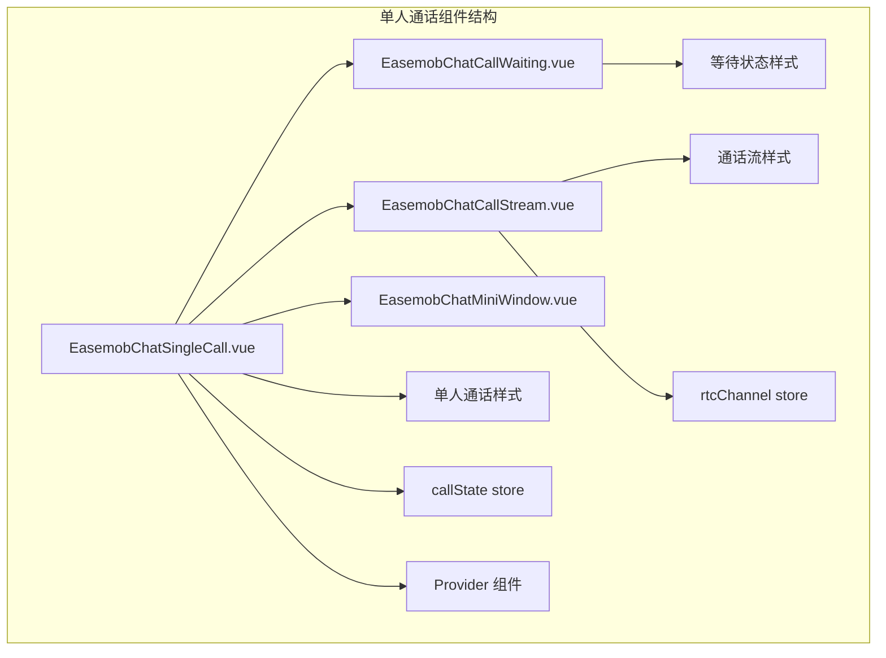
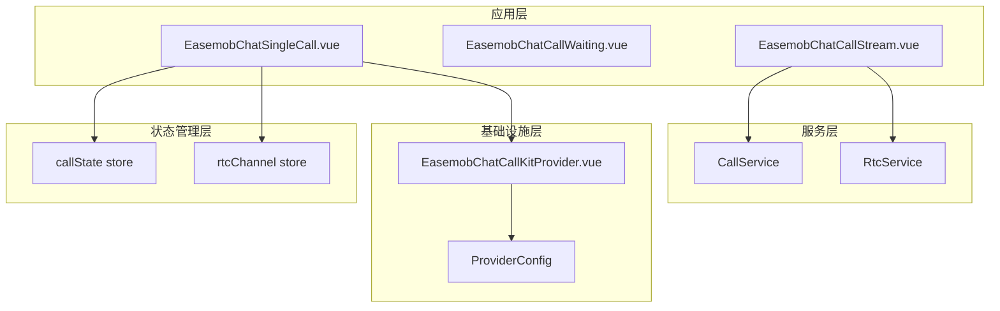
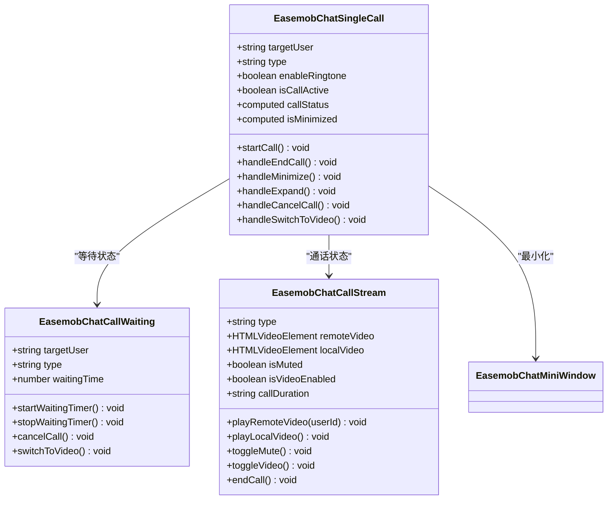
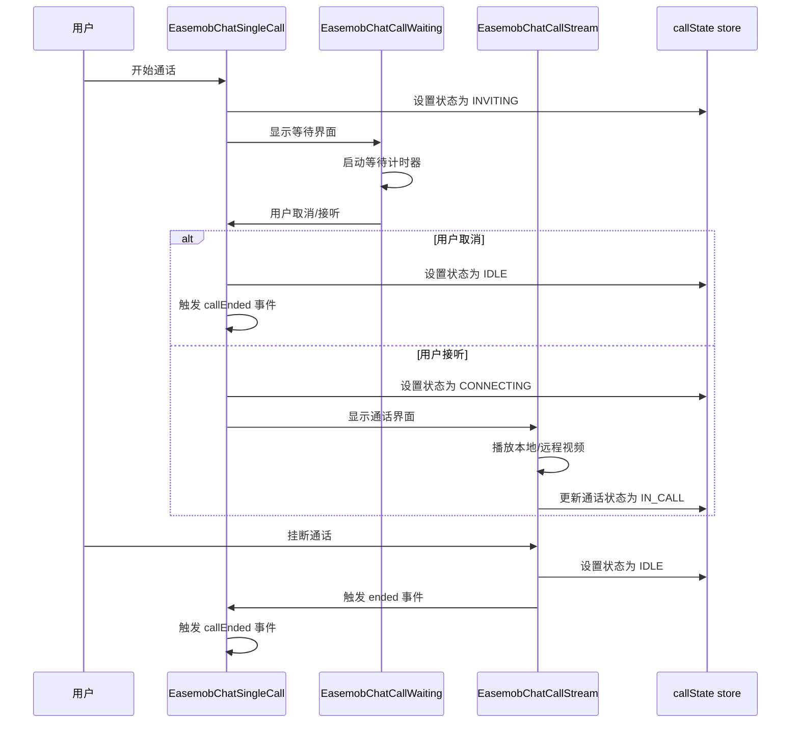
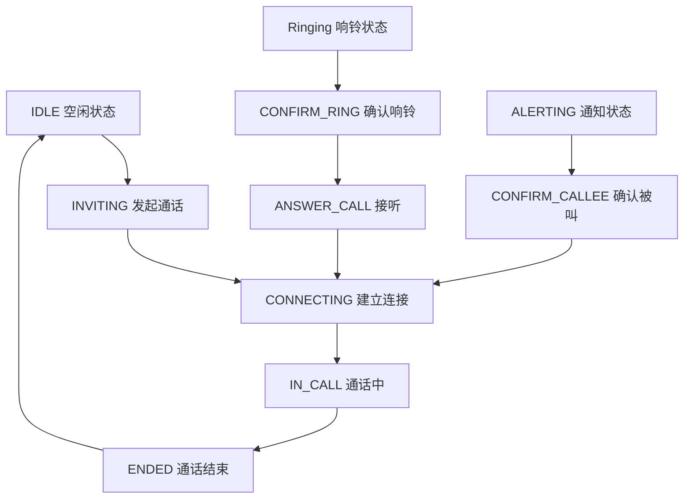
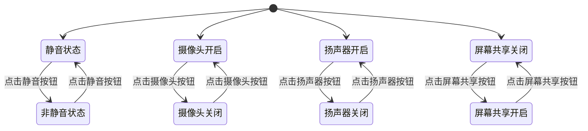
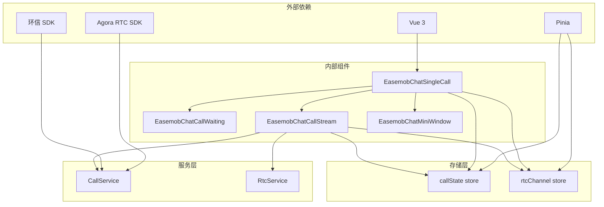

# 单人通话组件 API

<cite>
**本文档引用的文件**
- [EasemobChatSingleCall.vue](file://lib/components/singleCall/EasemobChatSingleCall.vue)
- [EasemobChatCallWaiting.vue](file://lib/components/singleCall/EasemobChatCallWaiting.vue)
- [EasemobChatCallStream.vue](file://lib/components/singleCall/EasemobChatCallStream.vue)
- [EasemobChatSingleCall.css](file://lib/components/singleCall/styles/EasemobChatSingleCall.css)
- [EasemobChatCallWaiting.css](file://lib/components/singleCall/styles/EasemobChatCallWaiting.css)
- [EasemobChatCallStream.css](file://lib/components/singleCall/styles/EasemobChatCallStream.css)
- [EasemobChatCallKitProvider.vue](file://lib/components/EasemobChatCallKitProvider.vue)
- [index.ts](file://lib/index.ts)
- [callState.ts](file://lib/store/callState.ts)
- [callstate.types.ts](file://lib/types/callstate.types.ts)
- [types.ts](file://lib/types.ts)
- [useCallService.ts](file://lib/composables/useCallService.ts)
</cite>

## 目录
1. [简介](#简介)
2. [项目结构](#项目结构)
3. [核心组件](#核心组件)
4. [架构概览](#架构概览)
5. [详细组件分析](#详细组件分析)
6. [依赖关系分析](#依赖关系分析)
7. [性能考虑](#性能考虑)
8. [故障排除指南](#故障排除指南)
9. [结论](#结论)

## 简介

EasemobChatSingleCall 是一个 Vue 3 组件，用于实现一对一音视频通话功能。该组件提供了完整的通话生命周期管理，包括通话发起、等待接听、通话中控制、通话结束等各个环节。

该组件采用模块化设计，主要包含以下核心功能：
- 一对一音视频通话的完整生命周期管理
- 通话状态的实时监控和响应
- 音视频控制按钮的集成
- 通话信息显示和状态指示
- 小窗口模式和大窗口模式的切换

## 项目结构

基于提供的代码库，EasemobChatSingleCall 组件位于 lib/components/singleCall 目录下，包含以下主要文件：

**图表来源**
- [EasemobChatSingleCall.vue](file://lib/components/singleCall/EasemobChatSingleCall.vue#L1-L134)
- [EasemobChatCallWaiting.vue](file://lib/components/singleCall/EasemobChatCallWaiting.vue#L1-L89)
- [EasemobChatCallStream.vue](file://lib/components/singleCall/EasemobChatCallStream.vue#L1-L322)

**章节来源**
- [EasemobChatSingleCall.vue](file://lib/components/singleCall/EasemobChatSingleCall.vue#L1-L134)
- [EasemobChatCallWaiting.vue](file://lib/components/singleCall/EasemobChatCallWaiting.vue#L1-L89)
- [EasemobChatCallStream.vue](file://lib/components/singleCall/EasemobChatCallStream.vue#L1-L322)

## 核心组件

### EasemobChatSingleCall 主组件

EasemobChatSingleCall 是单人通话的主要容器组件，负责管理通话的整体流程和状态。

**主要功能特性：**
- 基于 Pinia store 的状态管理
- 动态加载等待状态和通话状态组件
- 最小化窗口模式支持
- 事件发射和监听机制

**核心属性配置：**
- `targetUser`: 目标用户的唯一标识符
- `type`: 通话类型，支持 'audio' 或 'video'
- `enableRingtone`: 是否启用铃声功能

**事件接口：**
- `callStarted`: 通话开始事件
- `callEnded`: 通话结束事件
- `callCanceled`: 通话取消事件

**章节来源**
- [EasemobChatSingleCall.vue](file://lib/components/singleCall/EasemobChatSingleCall.vue#L37-L51)
- [EasemobChatSingleCall.vue](file://lib/components/singleCall/EasemobChatSingleCall.vue#L78-L102)

### CallControls 子组件

CallControls 提供音视频通话的控制按钮，包含以下功能：

**控制按钮功能：**
- 静音切换按钮
- 摄像头开关按钮
- 扬声器控制按钮
- 屏幕共享按钮
- 挂断按钮

**状态属性：**
- `muted`: 静音状态
- `cameraEnabled`: 摄像头状态
- `speakerEnabled`: 扬声器状态
- `screenSharing`: 屏幕共享状态

**事件回调：**
- `onMuteToggle`: 静音状态切换回调
- `onCameraToggle`: 摄像头状态切换回调
- `onSpeakerToggle`: 扬声器状态切换回调
- `onScreenShareToggle`: 屏幕共享状态切换回调
- `onHangup`: 挂断回调

**章节来源**
- [EasemobChatCallStream.vue](file://lib/components/singleCall/EasemobChatCallStream.vue#L49-L50)
- [EasemobChatCallStream.vue](file://lib/components/singleCall/EasemobChatCallStream.vue#L95-L144)

### CallInfoBar 子组件

CallInfoBar 负责显示通话过程中的信息，包括：
- 通话时长显示
- 参与者信息
- 网络状态指示
- 通话状态提示

**章节来源**
- [EasemobChatCallStream.vue](file://lib/components/singleCall/EasemobChatCallStream.vue#L28-L28)

## 架构概览

EasemobChatSingleCall 采用分层架构设计，实现了清晰的关注点分离：

**图表来源**
- [EasemobChatSingleCall.vue](file://lib/components/singleCall/EasemobChatSingleCall.vue#L54-L61)
- [EasemobChatCallStream.vue](file://lib/components/singleCall/EasemobChatCallStream.vue#L63-L65)
- [EasemobChatCallKitProvider.vue](file://lib/components/EasemobChatCallKitProvider.vue#L28-L57)

**章节来源**
- [EasemobChatSingleCall.vue](file://lib/components/singleCall/EasemobChatSingleCall.vue#L29-L35)
- [EasemobChatCallStream.vue](file://lib/components/singleCall/EasemobChatCallStream.vue#L42-L50)

## 详细组件分析

### EasemobChatSingleCall 组件详细分析

#### 组件类图

**图表来源**
- [EasemobChatSingleCall.vue](file://lib/components/singleCall/EasemobChatSingleCall.vue#L37-L108)
- [EasemobChatCallWaiting.vue](file://lib/components/singleCall/EasemobChatCallWaiting.vue#L33-L78)
- [EasemobChatCallStream.vue](file://lib/components/singleCall/EasemobChatCallStream.vue#L52-L144)

#### 通话生命周期流程

**图表来源**
- [EasemobChatSingleCall.vue](file://lib/components/singleCall/EasemobChatSingleCall.vue#L78-L124)
- [EasemobChatCallWaiting.vue](file://lib/components/singleCall/EasemobChatCallWaiting.vue#L50-L76)
- [EasemobChatCallStream.vue](file://lib/components/singleCall/EasemobChatCallStream.vue#L128-L144)

#### 状态管理模式

**图表来源**
- [callstate.types.ts](file://lib/types/callstate.types.ts#L13-L22)
- [callState.ts](file://lib/store/callState.ts#L14-L151)

**章节来源**
- [EasemobChatSingleCall.vue](file://lib/components/singleCall/EasemobChatSingleCall.vue#L110-L124)
- [callState.ts](file://lib/store/callState.ts#L142-L151)

### CallControls 组件详细分析

#### 控制按钮状态管理

**图表来源**
- [EasemobChatCallStream.vue](file://lib/components/singleCall/EasemobChatCallStream.vue#L95-L126)

**章节来源**
- [EasemobChatCallStream.vue](file://lib/components/singleCall/EasemobChatCallStream.vue#L95-L144)

### CallInfoBar 组件详细分析

#### 信息显示逻辑

CallInfoBar 组件负责显示通话过程中的各种信息，包括：
- 实时通话时长显示
- 对方用户信息展示
- 网络质量状态指示
- 通话状态文本提示

**章节来源**
- [EasemobChatCallStream.vue](file://lib/components/singleCall/EasemobChatCallStream.vue#L74-L86)

## 依赖关系分析

### 组件间依赖关系

**图表来源**
- [EasemobChatSingleCall.vue](file://lib/components/singleCall/EasemobChatSingleCall.vue#L30-L35)
- [EasemobChatCallStream.vue](file://lib/components/singleCall/EasemobChatCallStream.vue#L42-L49)

### Provider 组件集成

EasemobChatCallKitProvider 作为全局 Provider，负责：
- 环信客户端实例的注入
- RTC 服务的初始化
- 全局配置的管理
- 事件监听器的挂载

**章节来源**
- [EasemobChatCallKitProvider.vue](file://lib/components/EasemobChatCallKitProvider.vue#L28-L113)
- [index.ts](file://lib/index.ts#L3-L24)

## 性能考虑

### 状态管理优化

1. **响应式状态监听**：使用 Pinia 的 `$subscribe` 方法监听状态变化，避免不必要的组件重渲染
2. **条件渲染**：根据通话状态动态渲染不同的子组件，减少 DOM 元素数量
3. **事件清理**：在组件卸载时清理定时器和事件监听器，防止内存泄漏

### 视频流优化

1. **延迟播放**：远程视频采用延迟播放策略，确保媒体轨道就绪后再开始播放
2. **重试机制**：实现有限次数的播放重试，提高视频流稳定性
3. **资源清理**：通话结束后及时清理视频元素的 `srcObject`，释放媒体资源

## 故障排除指南

### 常见问题及解决方案

#### 通话状态异常

**问题描述**：通话状态无法正确切换或显示异常

**可能原因**：
- Pinia store 未正确初始化
- 状态监听器未正确设置
- 组件卸载时机不当

**解决方案**：
1. 确保在应用根组件中正确安装 Provider
2. 检查 store 的初始化顺序
3. 验证组件的生命周期钩子调用

#### 视频播放失败

**问题描述**：远程视频无法播放或播放卡顿

**可能原因**：
- 媒体轨道未就绪
- 网络连接不稳定
- 设备权限问题

**解决方案**：
1. 实现重试机制和错误处理
2. 检查网络连接状态
3. 验证设备权限和浏览器兼容性

#### 音频问题

**问题描述**：通话中出现音频异常或无声

**可能原因**：
- 静音状态未正确同步
- 音频设备选择错误
- 浏览器兼容性问题

**解决方案**：
1. 确保音频状态的双向绑定
2. 提供设备选择和切换功能
3. 测试不同浏览器的兼容性

**章节来源**
- [EasemobChatSingleCall.vue](file://lib/components/singleCall/EasemobChatSingleCall.vue#L110-L131)
- [EasemobChatCallStream.vue](file://lib/components/singleCall/EasemobChatCallStream.vue#L146-L190)

## 结论

EasemobChatSingleCall 组件提供了一个完整、健壮的一对一音视频通话解决方案。通过模块化的架构设计和清晰的职责分离，该组件能够满足大多数音视频通话场景的需求。

**主要优势：**
- 完整的通话生命周期管理
- 灵活的状态管理和响应式更新
- 丰富的控制按钮和信息显示
- 良好的性能优化和错误处理
- 简洁的 API 接口和易于集成

**适用场景：**
- 企业级即时通讯应用
- 在线教育平台
- 医疗问诊系统
- 视频会议应用

通过合理使用该组件，开发者可以快速构建高质量的音视频通话功能，提升用户体验和产品竞争力。