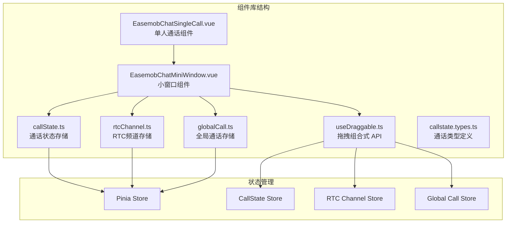
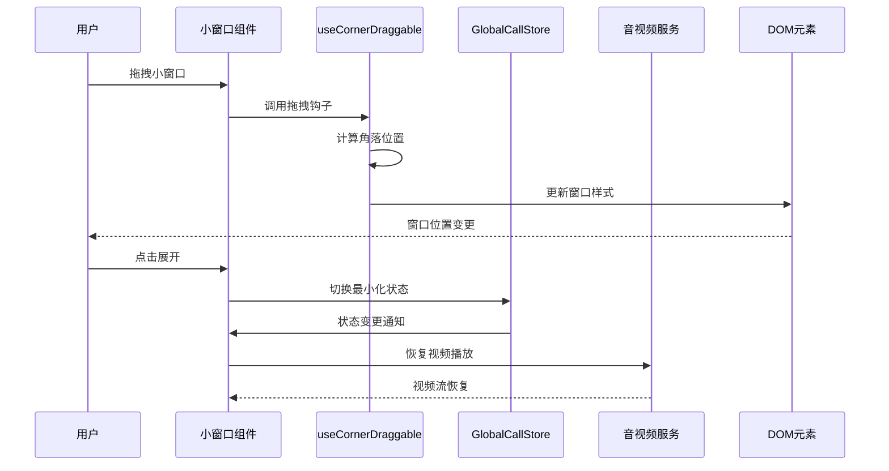
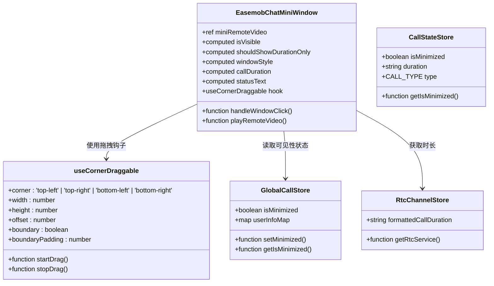
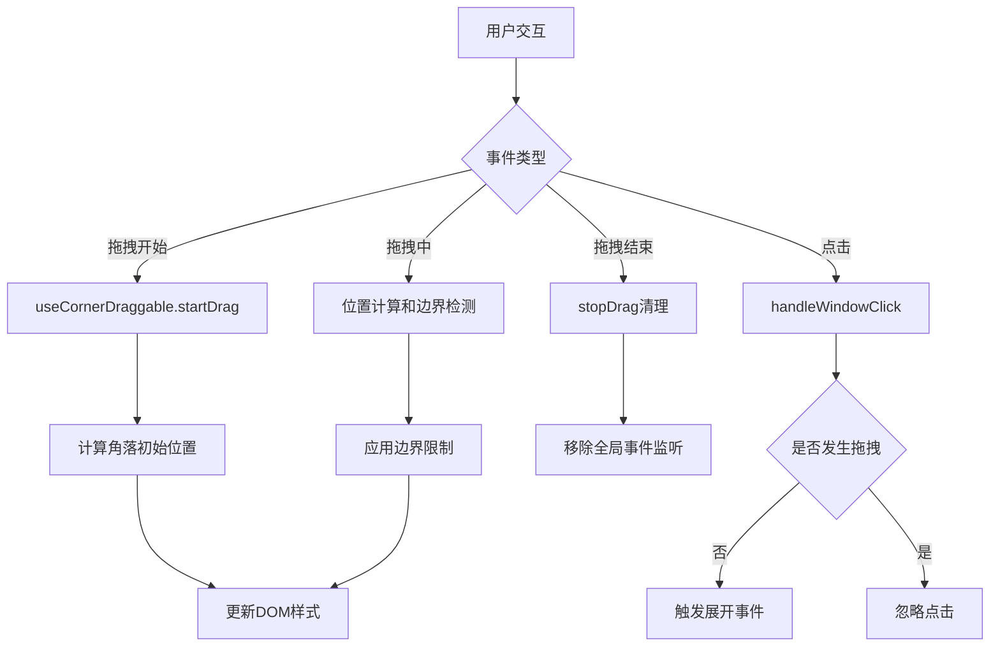
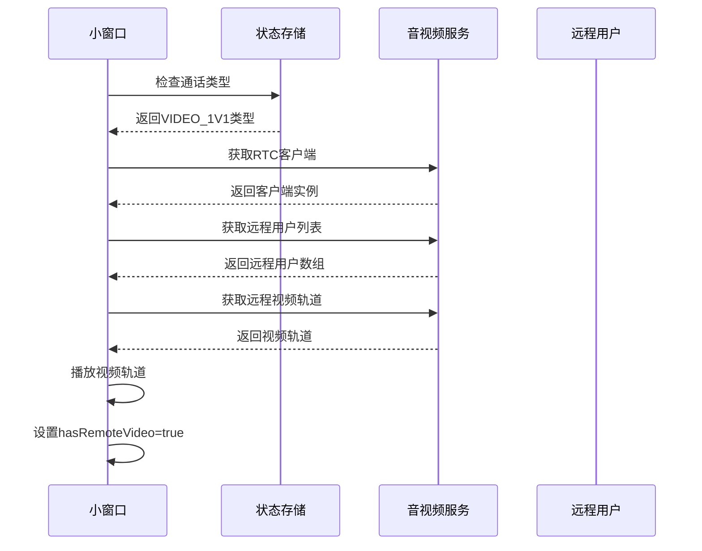
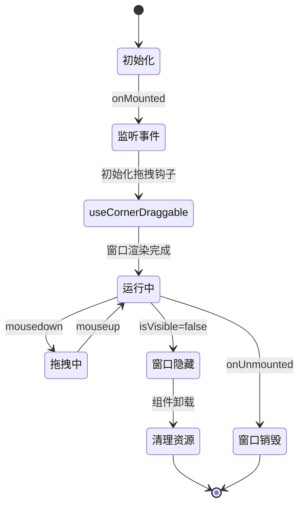
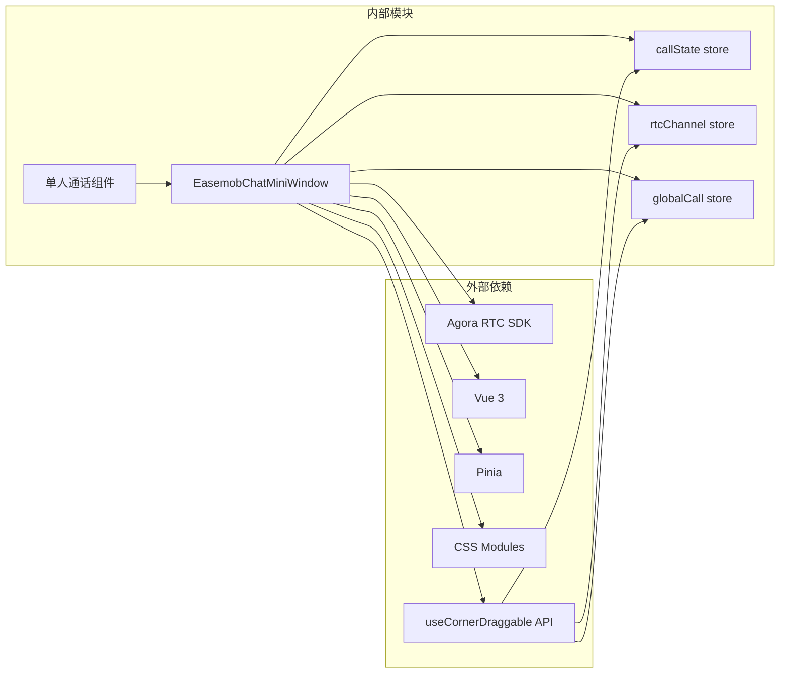

# 小窗口组件 API

<cite>
**本文档引用的文件**
- [EasemobChatMiniWindow.vue](file://lib/components/EasemobChatMiniWindow.vue)
- [useDraggable.ts](file://lib/composables/useDraggable.ts)
- [callState.ts](file://lib/store/callState.ts)
- [rtcChannel.ts](file://lib/store/rtcChannel.ts)
- [globalCall.ts](file://lib/store/globalCall.ts)
- [EasemobChatSingleCall.vue](file://lib/components/singleCall/EasemobChatSingleCall.vue)
</cite>

## 更新摘要
**变更内容**
- 更新可见性控制：组件现在使用 GlobalCallStore 的 isMinimized 状态来控制窗口可见性，而非直接依赖 callStateStore
- 新增全局状态管理：引入 GlobalCallStore 来管理跨通话域的共享状态
- 更新依赖关系：组件依赖关系从 callStateStore 转向 globalCallStore
- 优化状态架构：将最小化状态从通话状态存储迁移到全局状态存储

## 目录
1. [简介](#简介)
2. [项目结构](#项目结构)
3. [核心组件](#核心组件)
4. [架构概览](#架构概览)
5. [详细组件分析](#详细组件分析)
6. [依赖关系分析](#依赖关系分析)
7. [性能考虑](#性能考虑)
8. [故障排除指南](#故障排除指南)
9. [结论](#结论)

## 简介

EasemobChatMiniWindow 是环信聊天小程序中的悬浮通话小窗口组件，提供通话过程中的最小化显示和交互功能。该组件支持拖拽移动、尺寸调整、远程视频播放等特性，为用户提供便捷的通话管理体验。

**更新** 组件现已重构，使用 GlobalCallStore 的 isMinimized 状态来控制窗口可见性，实现了更清晰的状态分离和更好的跨组件通信机制。

## 项目结构

小窗口组件位于环信聊天小程序的组件库中，采用 Vue 3 Composition API 构建：



**图表来源**
- [EasemobChatMiniWindow.vue:37-44](file://lib/components/EasemobChatMiniWindow.vue#L37-L44)
- [useDraggable.ts:1-323](file://lib/composables/useDraggable.ts#L1-L323)
- [callState.ts:1-187](file://lib/store/callState.ts#L1-L187)
- [globalCall.ts:1-41](file://lib/store/globalCall.ts#L1-L41)

**章节来源**
- [EasemobChatMiniWindow.vue:1-378](file://lib/components/EasemobChatMiniWindow.vue#L1-L378)
- [useDraggable.ts:1-323](file://lib/composables/useDraggable.ts#L1-L323)

## 核心组件

### 组件概述

EasemobChatMiniWindow 是一个轻量级的 Vue 3 组件，提供以下核心功能：

- **悬浮窗口显示**：固定定位的小窗口，支持多种通话模式
- **智能拖拽移动**：使用 useCornerDraggable API 提供精确的角落定位
- **远程视频播放**：一对一视频通话时显示对方视频流
- **状态指示**：显示通话时长和当前通话状态
- **自动尺寸管理**：根据通话类型自动调整窗口尺寸
- **全局状态控制**：通过 GlobalCallStore 管理最小化状态

### 主要特性

| 特性 | 描述 | 实现方式 |
|------|------|----------|
| 全局状态管理 | 使用 GlobalCallStore 控制窗口可见性 | isMinimized getter |
| 智能角落定位 | 固定在屏幕角落，支持四种角落选择 | useCornerDraggable API |
| 精确拖拽 | 鼠标拖拽移动窗口，支持边界检测 | useDraggable 基础 API |
| 视频播放 | 远程视频流播放 | Agora RTC SDK |
| 状态显示 | 通话时长和状态文本 | 计算属性 |
| 尺寸管理 | 自动调整窗口大小 | 响应式计算属性 |
| 边界限制 | 窗口位置边界约束 | 数学计算限制 |

**更新** 新的全局状态管理系统提供了更清晰的状态分离，将最小化状态从通话状态存储中独立出来，便于跨组件共享和管理。

**章节来源**
- [EasemobChatMiniWindow.vue:64-65](file://lib/components/EasemobChatMiniWindow.vue#L64-L65)
- [useDraggable.ts:284-320](file://lib/composables/useDraggable.ts#L284-L320)

## 架构概览

小窗口组件采用分层架构设计，与状态管理和音视频服务解耦：



**图表来源**
- [EasemobChatMiniWindow.vue:64-65](file://lib/components/EasemobChatMiniWindow.vue#L64-L65)
- [useDraggable.ts:284-320](file://lib/composables/useDraggable.ts#L284-L320)

## 详细组件分析

### 组件属性接口

| 属性名 | 类型 | 默认值 | 描述 |
|--------|------|--------|------|
| isVisible | boolean | computed | 小窗口可见性状态（来自 GlobalCallStore） |
| windowStyle | object | computed | 窗口样式对象（包含拖拽样式） |
| callDuration | string | computed | 格式化通话时长 |
| shouldShowDurationOnly | boolean | computed | 是否只显示时长模式 |

### 数据模型



**图表来源**
- [EasemobChatMiniWindow.vue:37-53](file://lib/components/EasemobChatMiniWindow.vue#L37-L53)
- [useDraggable.ts:284-320](file://lib/composables/useDraggable.ts#L284-L320)
- [globalCall.ts:8-41](file://lib/store/globalCall.ts#L8-L41)
- [callState.ts:184-185](file://lib/store/callState.ts#L184-L185)

### 事件处理机制

小窗口组件实现了完整的事件处理流程：



**更新** 新的全局状态管理系统通过 GlobalCallStore 的 isMinimized getter 提供了更稳定的可见性控制。

**图表来源**
- [EasemobChatMiniWindow.vue:64-65](file://lib/components/EasemobChatMiniWindow.vue#L64-L65)
- [useDraggable.ts:189-224](file://lib/composables/useDraggable.ts#L189-L224)

### 视频播放流程

一对一视频通话的小窗口视频播放流程：



**图表来源**
- [EasemobChatMiniWindow.vue:142-184](file://lib/components/EasemobChatMiniWindow.vue#L142-L184)

**章节来源**
- [EasemobChatMiniWindow.vue:1-378](file://lib/components/EasemobChatMiniWindow.vue#L1-L378)

### 组件生命周期

小窗口组件的生命周期管理：



**图表来源**
- [EasemobChatMiniWindow.vue:186-264](file://lib/components/EasemobChatMiniWindow.vue#L186-L264)

**章节来源**
- [EasemobChatMiniWindow.vue:186-264](file://lib/components/EasemobChatMiniWindow.vue#L186-L264)

## 依赖关系分析

### 组件间依赖



**更新** 组件现在依赖 GlobalCallStore 来管理最小化状态，这是一个新的内部依赖。

**图表来源**
- [EasemobChatMiniWindow.vue:37-53](file://lib/components/EasemobChatMiniWindow.vue#L37-L53)
- [useDraggable.ts:284-320](file://lib/composables/useDraggable.ts#L284-L320)

### 状态管理依赖

小窗口组件与状态管理的关系：

| 依赖模块 | 用途 | 影响范围 |
|----------|------|----------|
| globalCall.store | 全局通话状态管理 | 窗口显示/隐藏、用户信息映射 |
| callState.store | 通话状态管理 | 通话类型判断、状态转换 |
| rtcChannel.store | 音视频通道管理 | 远程视频轨道获取、通话时长显示 |
| useCornerDraggable | 拖拽位置管理 | 窗口位置计算、边界检测 |
| Pinia store | 全局状态存储 | 状态持久化和响应式更新 |

**更新** 新增了对 GlobalCallStore 的依赖，用于管理跨通话域的共享状态，特别是最小化窗口的可见性控制。

**章节来源**
- [globalCall.ts:1-41](file://lib/store/globalCall.ts#L1-L41)
- [callState.ts:1-187](file://lib/store/callState.ts#L1-L187)
- [rtcChannel.ts:1-410](file://lib/store/rtcChannel.ts#L1-L410)
- [useDraggable.ts:284-320](file://lib/composables/useDraggable.ts#L284-L320)

## 性能考虑

### 性能优化策略

1. **事件监听优化**
   - 使用 useCornerDraggable API 提供的统一事件处理机制
   - 在组件卸载时及时清理事件监听器

2. **内存管理**
   - 组件销毁时停止所有远程视频轨道
   - 清理 video 元素的 srcObject 引用

3. **渲染优化**
   - 使用 computed 属性缓存计算结果
   - 避免不必要的 DOM 操作

4. **资源管理**
   - 小窗口隐藏时停止视频播放
   - 重试机制限制最大重试次数

**更新** 新的全局状态管理系统通过 Pinia 的响应式机制提供了更高效的状态更新和内存管理。

**章节来源**
- [EasemobChatMiniWindow.vue:222-264](file://lib/components/EasemobChatMiniWindow.vue#L222-L264)
- [useDraggable.ts:189-224](file://lib/composables/useDraggable.ts#L189-L224)

## 故障排除指南

### 常见问题及解决方案

| 问题类型 | 症状 | 可能原因 | 解决方案 |
|----------|------|----------|----------|
| 视频无法播放 | 小窗口显示占位符 | 远程视频轨道获取失败 | 检查 RTC 服务初始化状态 |
| 窗口无法拖拽 | 拖拽无效 | 事件监听器未正确绑定 | 验证 useCornerDraggable 配置 |
| 位置异常 | 窗口超出屏幕边界 | 边界计算错误 | 检查窗口尺寸和屏幕尺寸计算 |
| 内存泄漏 | 组件卸载后资源未释放 | 事件监听器未清理 | 确认 onUnmounted 生命周期处理 |
| 角落定位不准确 | 窗口位置偏移 | 角落计算错误 | 验证 useCornerDraggable 参数 |
| 窗口不显示 | 小窗口始终隐藏 | GlobalCallStore.isMinimized 为 false | 检查全局状态管理逻辑 |

**更新** 新增了与 GlobalCallStore 相关的故障排除项，特别是窗口不显示的问题。

### 调试建议

1. **启用日志记录**
   ```javascript
   // 在组件中添加调试日志
   logger.info('小窗口状态变更', { isVisible, windowX, windowY })
   ```

2. **检查依赖状态**
   - 验证 RTC 服务客户端状态
   - 确认通话状态存储的正确性
   - 检查远程用户列表是否为空
   - 验证 useCornerDraggable 配置参数
   - 检查 GlobalCallStore 的 isMinimized 状态

3. **性能监控**
   - 监控事件监听器数量
   - 检查内存使用情况
   - 验证视频轨道播放状态

**章节来源**
- [EasemobChatMiniWindow.vue:142-184](file://lib/components/EasemobChatMiniWindow.vue#L142-L184)
- [useDraggable.ts:284-320](file://lib/composables/useDraggable.ts#L284-L320)

## 结论

EasemobChatMiniWindow 组件提供了完整的通话小窗口功能，经过重构后具有以下特点：

1. **功能完整性**：支持拖拽、视频播放、状态显示等核心功能
2. **用户体验**：简洁的界面设计和流畅的交互体验
3. **性能优化**：合理的资源管理和内存控制
4. **扩展性**：清晰的架构设计便于功能扩展
5. **精确性**：使用 useCornerDraggable API 提供精确的角落定位和边界检测
6. **状态管理**：通过 GlobalCallStore 实现了更清晰的状态分离和管理

**更新** 新的全局状态管理系统显著提升了组件的架构清晰度和可维护性，通过 GlobalCallStore 的 isMinimized getter 提供了更可靠的窗口可见性控制，同时保持了与现有组件的良好兼容性。

该组件与环信聊天小程序的其他组件紧密协作，为用户提供了一致的通话体验。通过合理的状态管理和事件处理机制，确保了组件的稳定性和可靠性。