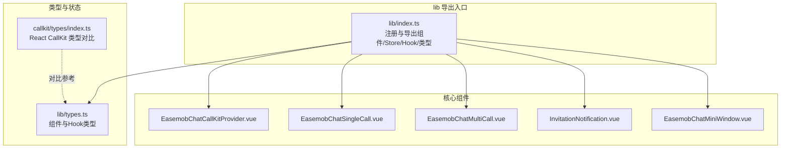
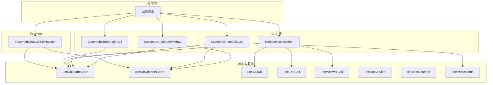
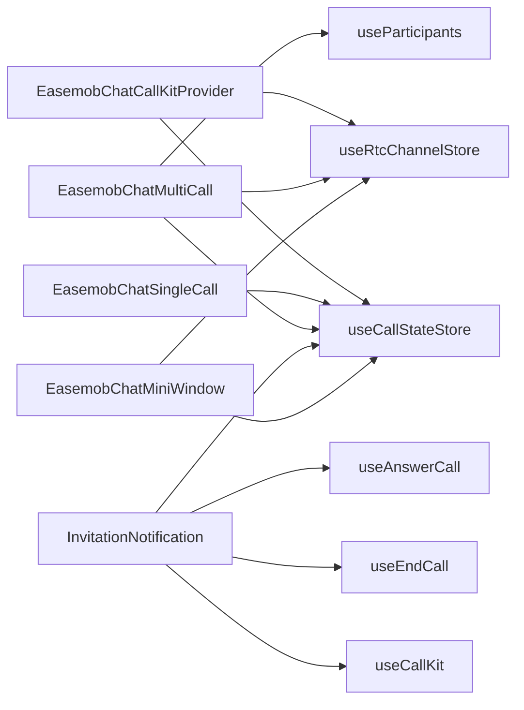

# 组件 API

<cite>
**本文档引用的文件**
- [lib/index.ts](file://lib/index.ts)
- [lib/types.ts](file://lib/types.ts)
- [lib/components/EasemobChatCallKitProvider.vue](file://lib/components/EasemobChatCallKitProvider.vue)
- [lib/components/singleCall/EasemobChatSingleCall.vue](file://lib/components/singleCall/EasemobChatSingleCall.vue)
- [lib/components/multiCall/EasemobChatMultiCall.vue](file://lib/components/multiCall/EasemobChatMultiCall.vue)
- [lib/components/InvitationNotification.vue](file://lib/components/InvitationNotification.vue)
- [lib/components/EasemobChatMiniWindow.vue](file://lib/components/EasemobChatMiniWindow.vue)
- [callkit/index.ts](file://callkit/index.ts)
- [callkit/types/index.ts](file://callkit/types/index.ts)
</cite>

## 目录
1. [简介](#简介)
2. [项目结构](#项目结构)
3. [核心组件](#核心组件)
4. [架构总览](#架构总览)
5. [组件详细分析](#组件详细分析)
6. [依赖关系分析](#依赖关系分析)
7. [性能考量](#性能考量)
8. [故障排查指南](#故障排查指南)
9. [结论](#结论)
10. [附录](#附录)

## 简介
本文件为 Vue3 组件库“Easemob Chat CallKit”的组件 API 参考文档，覆盖以下核心组件：
- EasemobChatCallKitProvider
- EasemobChatSingleCall
- EasemobChatMultiCall
- InvitationNotification
- EasemobChatMiniWindow

内容包括：属性（Props）、事件（Events）、插槽（Slots）、方法（Methods）、生命周期钩子、响应式数据绑定、事件处理机制、组件间依赖与组合方式，以及常见使用场景与最佳实践。

## 项目结构
该仓库包含两套导出入口：
- lib 目录：Vue3 组件与类型导出，适合以组件形式直接使用
- callkit 目录：React 组件与类型导出，作为对比参考

本 API 文档聚焦 lib 目录下的 Vue3 组件与类型定义。

图表来源
- [lib/index.ts](file://lib/index.ts#L1-L58)
- [lib/types.ts](file://lib/types.ts#L1-L91)
- [callkit/types/index.ts](file://callkit/types/index.ts#L1-L356)

章节来源
- [lib/index.ts](file://lib/index.ts#L1-L58)
- [callkit/index.ts](file://callkit/index.ts#L1-L46)

## 核心组件
本节概述各组件职责与对外接口要点：
- EasemobChatCallKitProvider：提供全局配置注入、聊天客户端与 RTC 服务初始化、事件监听挂载、日志级别设置等能力
- EasemobChatSingleCall：单人通话 UI 与交互，含待接通与通话中两个阶段，支持最小化窗口
- EasemobChatMultiCall：多人通话 UI 与交互，含主副视频布局、成员管理、邀请与超时处理、挂断流程
- InvitationNotification：来电弹窗，根据状态显示/隐藏，提供接听/拒绝操作
- EasemobChatMiniWindow：小窗模式，支持拖拽、展开、音频/视频两种形态，显示通话时长与远程视频

章节来源
- [lib/components/EasemobChatCallKitProvider.vue](file://lib/components/EasemobChatCallKitProvider.vue#L1-L115)
- [lib/components/singleCall/EasemobChatSingleCall.vue](file://lib/components/singleCall/EasemobChatSingleCall.vue#L1-L134)
- [lib/components/multiCall/EasemobChatMultiCall.vue](file://lib/components/multiCall/EasemobChatMultiCall.vue#L1-L1074)
- [lib/components/InvitationNotification.vue](file://lib/components/InvitationNotification.vue#L1-L332)
- [lib/components/EasemobChatMiniWindow.vue](file://lib/components/EasemobChatMiniWindow.vue#L1-L425)

## 架构总览
组件间依赖与协作关系如下：

图表来源
- [lib/components/EasemobChatCallKitProvider.vue](file://lib/components/EasemobChatCallKitProvider.vue#L1-L115)
- [lib/components/singleCall/EasemobChatSingleCall.vue](file://lib/components/singleCall/EasemobChatSingleCall.vue#L1-L134)
- [lib/components/multiCall/EasemobChatMultiCall.vue](file://lib/components/multiCall/EasemobChatMultiCall.vue#L1-L1074)
- [lib/components/InvitationNotification.vue](file://lib/components/InvitationNotification.vue#L1-L332)
- [lib/components/EasemobChatMiniWindow.vue](file://lib/components/EasemobChatMiniWindow.vue#L1-L425)
- [lib/index.ts](file://lib/index.ts#L1-L58)
- [lib/types.ts](file://lib/types.ts#L1-L91)

## 组件详细分析

### EasemobChatCallKitProvider
- 作用：全局 Provider，负责：
  - 合并默认与用户配置（如调试、铃声、可拖拽、可调整大小、邀请超时）
  - 注入聊天客户端实例到 store
  - 初始化 RTC 服务（占位 appId，实际由信令动态下发）
  - 挂载文本消息与信令事件监听器
  - 提供全局响应式配置（enableRingtone、resizable、draggable、debug）
  - 组件卸载时销毁 RTC 服务
- 生命周期钩子：onMounted/onUnmounted
- 响应式数据绑定：computed 全局配置；watchEffect 监听聊天客户端与配置变更
- 事件处理：通过 useListenerManager 挂载监听器
- 插槽：默认插槽（仅在挂载完成后渲染）

属性（Props）
- chatClient：可选，环信客户端连接实例
- agoraAppId：可选（已废弃），仅用于占位
- initConfig：可选，初始化配置对象
  - debug：boolean
  - enableRingtone：boolean
  - resizable：boolean
  - draggable：boolean
  - inviteTimeout：number（毫秒）

事件（Events）
- 无显式 defineEmits，通过内部监听器与 store 通信

方法（Methods）
- 无公开方法，内部通过 store 与监听器管理状态

章节来源
- [lib/components/EasemobChatCallKitProvider.vue](file://lib/components/EasemobChatCallKitProvider.vue#L1-L115)
- [lib/types.ts](file://lib/types.ts#L36-L46)

### EasemobChatSingleCall
- 作用：单人通话 UI，包含待接通与通话中两个阶段，支持最小化窗口
- 生命周期钩子：onMounted/onUnmounted
- 响应式数据绑定：computed 通话状态；store.$subscribe 监听状态变化
- 事件处理：emit callStarted/callEnded/callCanceled

属性（Props）
- targetUser：string
- type：'audio' | 'video'
- enableRingtone：boolean（默认 true）

事件（Events）
- callStarted：void
- callEnded：void
- callCanceled：void

方法（Methods）
- 无公开方法，内部通过 store 管理状态与 UI 切换

章节来源
- [lib/components/singleCall/EasemobChatSingleCall.vue](file://lib/components/singleCall/EasemobChatSingleCall.vue#L1-L134)

### EasemobChatMultiCall
- 作用：多人通话 UI，包含主副视频布局、成员管理、邀请与超时处理、挂断流程
- 生命周期钩子：onMounted/onUnmounted
- 响应式数据绑定：computed 参与者、主/副视频、背景样式、是否最小化、是否显示等；watch 监听远程用户与渲染锁
- 事件处理：emit callStarted/callEnded/addParticipant/participantTimeout/error 等

属性（Props）
- groupId：string（可选）
- groupName：string（可选）
- groupAvatar：string（可选）
- participants：Participant[]（可选，内部自动管理）
- type：'audio' | 'video'（默认 'video'）
- maxParticipants：number（默认 18）
- backgroundImage：string（可选）
- currentUserId：string（可选）
- autoShow：boolean（默认 true）

事件（Events）
- callStarted：void
- callEnded：void
- addParticipant：void
- participantTimeout：userId: string
- userLeft：userId: string（已弃用）
- userJoined：userId: string（已弃用）
- error：error: Error

方法（Methods）
- 无公开方法，内部通过 store 与 RTC 服务管理状态与渲染

章节来源
- [lib/components/multiCall/EasemobChatMultiCall.vue](file://lib/components/multiCall/EasemobChatMultiCall.vue#L1-L1074)

### InvitationNotification
- 作用：来电弹窗，根据通话状态与聊天客户端就绪状态决定显示/隐藏，提供接听/拒绝操作
- 生命周期钩子：onMounted
- 响应式数据绑定：computed callerName/callerAvatar/callType/isGroupCall/callDescription；watch 监听通话状态
- 事件处理：handleAccept/handleReject，内部调用 useAnswerCall

属性（Props）
- 无

事件（Events）
- 无显式 defineEmits

方法（Methods）
- 无公开方法

章节来源
- [lib/components/InvitationNotification.vue](file://lib/components/InvitationNotification.vue#L1-L332)

### EasemobChatMiniWindow
- 作用：小窗模式，支持拖拽、展开、音频/视频两种形态，显示通话时长与远程视频
- 生命周期钩子：onMounted/onUnmounted；watch 监听可见性
- 响应式数据绑定：computed shouldShowDurationOnly/callDuration/statusText；computed windowStyle；watch 监听窗口大小变化
- 事件处理：emit expand/close

属性（Props）
- 无

事件（Events）
- expand：void
- close：void

方法（Methods）
- 无公开方法

章节来源
- [lib/components/EasemobChatMiniWindow.vue](file://lib/components/EasemobChatMiniWindow.vue#L1-L425)

## 依赖关系分析

图表来源
- [lib/components/EasemobChatCallKitProvider.vue](file://lib/components/EasemobChatCallKitProvider.vue#L1-L115)
- [lib/components/singleCall/EasemobChatSingleCall.vue](file://lib/components/singleCall/EasemobChatSingleCall.vue#L1-L134)
- [lib/components/multiCall/EasemobChatMultiCall.vue](file://lib/components/multiCall/EasemobChatMultiCall.vue#L1-L1074)
- [lib/components/InvitationNotification.vue](file://lib/components/InvitationNotification.vue#L1-L332)
- [lib/components/EasemobChatMiniWindow.vue](file://lib/components/EasemobChatMiniWindow.vue#L1-L425)
- [lib/index.ts](file://lib/index.ts#L1-L58)

章节来源
- [lib/index.ts](file://lib/index.ts#L1-L58)

## 性能考量
- 渲染锁与防抖：多人通话组件对视频渲染加锁与防抖，避免并发渲染导致的性能问题
- 远程用户轮询：在特定条件下轮询订阅远程用户音视频轨道，减少首帧卡顿
- 小窗视频轨道释放：小窗隐藏或组件卸载时主动停止远程视频轨道，释放资源
- 最小化窗口：音频/群组通话仅显示时长，减少渲染负载

章节来源
- [lib/components/multiCall/EasemobChatMultiCall.vue](file://lib/components/multiCall/EasemobChatMultiCall.vue#L494-L641)
- [lib/components/multiCall/EasemobChatMultiCall.vue](file://lib/components/multiCall/EasemobChatMultiCall.vue#L278-L368)
- [lib/components/EasemobChatMiniWindow.vue](file://lib/components/EasemobChatMiniWindow.vue#L258-L304)

## 故障排查指南
- Provider 未挂载事件监听器
  - 现象：Provider 未挂载事件监听器，日志提示“未挂载事件监听器：缺少环信客户端实例”
  - 原因：未传入 chatClient 或未初始化
  - 处理：确保在 Provider 上传入 chatClient，并保证其已登录
- 来电弹窗不显示
  - 现象：收到 ALERTING 状态但弹窗不出现
  - 原因：聊天客户端未登录或未初始化
  - 处理：确认 ChatClient 已登录并具备设备 ID
- 小窗远程视频播放失败
  - 现象：小窗视频轨道未找到或播放异常
  - 原因：远程用户尚未发布媒体或轨道未订阅
  - 处理：等待远程用户发布媒体，或手动触发订阅；必要时重试
- 多人通话渲染异常
  - 现象：视频渲染卡顿或重复渲染
  - 原因：并发渲染或未正确去重
  - 处理：使用渲染锁与防抖；确保 video 元素去重

章节来源
- [lib/components/EasemobChatCallKitProvider.vue](file://lib/components/EasemobChatCallKitProvider.vue#L93-L103)
- [lib/components/InvitationNotification.vue](file://lib/components/InvitationNotification.vue#L110-L126)
- [lib/components/EasemobChatMiniWindow.vue](file://lib/components/EasemobChatMiniWindow.vue#L175-L217)
- [lib/components/multiCall/EasemobChatMultiCall.vue](file://lib/components/multiCall/EasemobChatMultiCall.vue#L498-L629)

## 结论
上述组件围绕“通话状态管理”“实时音视频通道”“用户交互”三大维度构建，通过 Provider 注入全局配置与服务，配合多个 UI 组件实现完整的单人/多人通话体验。建议在业务侧按需组合使用，并遵循 Provider 的初始化顺序与 Hook 的使用规范，以获得稳定可靠的通话体验。

## 附录

### 组件组合使用方式与最佳实践
- Provider 放置于应用根节点，确保全局配置与服务可用
- 单人通话与多人通话组件根据业务场景选择使用，必要时结合小窗模式提升用户体验
- 来电弹窗与通话状态联动，确保在聊天客户端就绪后才显示
- 多人通话中合理使用邀请超时与成员管理，避免无效等待

章节来源
- [lib/components/EasemobChatCallKitProvider.vue](file://lib/components/EasemobChatCallKitProvider.vue#L1-L115)
- [lib/components/singleCall/EasemobChatSingleCall.vue](file://lib/components/singleCall/EasemobChatSingleCall.vue#L1-L134)
- [lib/components/multiCall/EasemobChatMultiCall.vue](file://lib/components/multiCall/EasemobChatMultiCall.vue#L1-L1074)
- [lib/components/InvitationNotification.vue](file://lib/components/InvitationNotification.vue#L1-L332)
- [lib/components/EasemobChatMiniWindow.vue](file://lib/components/EasemobChatMiniWindow.vue#L1-L425)