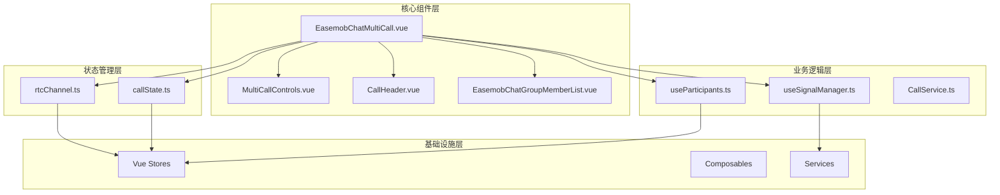
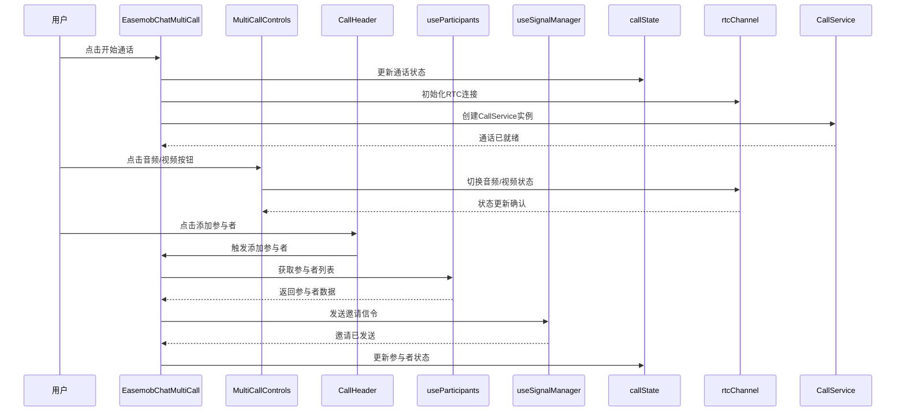
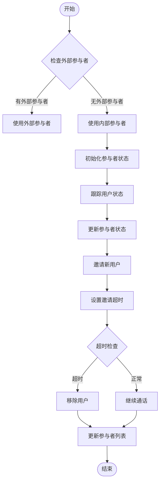
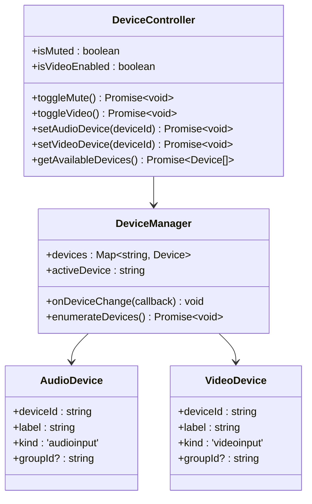
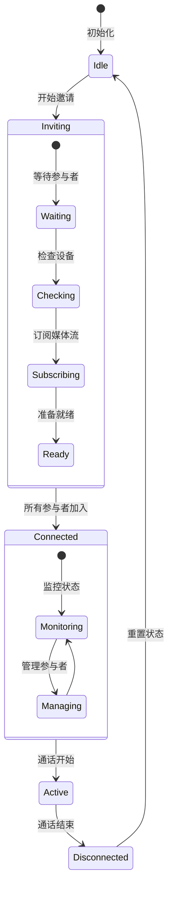
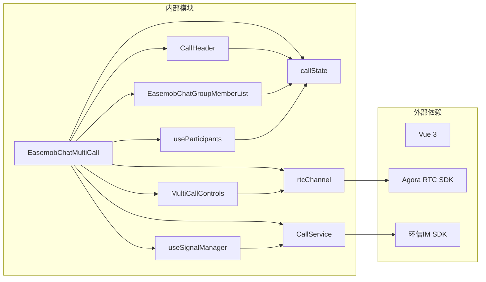

# 群组通话组件 API

<cite>
**本文档引用的文件**
- [EasemobChatMultiCall.vue](file://lib/components/multiCall/EasemobChatMultiCall.vue)
- [MultiCallControls.vue](file://lib/components/multiCall/MultiCallControls.vue)
- [CallHeader.vue](file://lib/components/multiCall/CallHeader.vue)
- [EasemobChatGroupMemberList.vue](file://lib/components/multiCall/EasemobChatGroupMemberList.vue)
- [useParticipants.ts](file://lib/composables/useParticipants.ts)
- [useSignalManager.ts](file://lib/composables/useSignalManager.ts)
- [callState.ts](file://lib/store/callState.ts)
- [rtcChannel.ts](file://lib/store/rtcChannel.ts)
- [CallService.ts](file://lib/services/CallService.ts)
- [EasemobChatMultiCall.vue](file://test/src/App.vue)
</cite>

## 目录
1. [简介](#简介)
2. [项目结构](#项目结构)
3. [核心组件](#核心组件)
4. [架构概览](#架构概览)
5. [详细组件分析](#详细组件分析)
6. [依赖关系分析](#依赖关系分析)
7. [性能考虑](#性能考虑)
8. [故障排除指南](#故障排除指南)
9. [结论](#结论)

## 简介

EasemobChatMultiCall 是一个专为环信即时通讯服务设计的 Vue 3 群组通话组件，提供了完整的多人音视频通话解决方案。该组件支持群组语音和视频通话，具备成员管理、屏幕共享、设备控制等高级功能。

### 主要特性

- **多人音视频通话**：支持最多18人的群组通话
- **智能成员管理**：自动邀请、移除和状态跟踪
- **设备控制**：音频、视频设备的动态切换
- **实时状态同步**：通话状态、网络质量、设备状态的实时更新
- **响应式布局**：支持桌面和移动端的自适应布局
- **主持人权限管理**：支持主持人对通话的控制权限

## 项目结构



**图表来源**
- [EasemobChatMultiCall.vue](file://lib/components/multiCall/EasemobChatMultiCall.vue#L1-L1067)
- [MultiCallControls.vue](file://lib/components/multiCall/MultiCallControls.vue)
- [CallHeader.vue](file://lib/components/multiCall/CallHeader.vue)

**章节来源**
- [EasemobChatMultiCall.vue](file://lib/components/multiCall/EasemobChatMultiCall.vue#L1-L1067)
- [test/src/App.vue](file://test/src/App.vue#L49-L72)

## 核心组件

### EasemobChatMultiCall 组件

EasemobChatMultiCall 是整个群组通话系统的核心组件，负责协调各个子组件和业务逻辑。

#### 主要属性

| 属性名 | 类型 | 必需 | 默认值 | 描述 |
|--------|------|------|--------|------|
| groupId | string | 否 | - | 群组唯一标识符 |
| groupName | string | 否 | - | 群组名称 |
| groupAvatar | string | 否 | - | 群组头像URL |
| participants | Participant[] | 否 | - | 参与者列表（可选，内部自动管理） |
| type | 'audio' \| 'video' | 是 | - | 通话类型 |
| maxParticipants | number | 否 | 18 | 最大参与者数量 |
| backgroundImage | string | 否 | - | 背景图片URL |
| currentUserId | string | 否 | - | 当前用户ID |
| autoShow | boolean | 否 | true | 是否自动显示/隐藏 |

#### 主要事件

| 事件名 | 参数 | 描述 |
|--------|------|------|
| callStarted | - | 通话开始事件 |
| callEnded | - | 通话结束事件 |
| addParticipant | - | 添加参与者按钮点击事件 |
| participantTimeout | userId: string | 邀请超时事件 |
| userLeft | userId: string | 用户离开事件（已废弃） |
| userJoined | userId: string | 用户加入事件（已废弃） |
| error | error: Error | 错误事件 |

#### 主要方法

| 方法名 | 参数 | 返回值 | 描述 |
|--------|------|--------|------|
| startCall | - | Promise<void> | 开始群组通话 |
| endCall | - | Promise<void> | 结束群组通话 |
| toggleMute | - | Promise<void> | 切换音频状态 |
| toggleVideo | - | Promise<void> | 切换视频状态 |
| handleAddParticipant | - | void | 处理添加参与者 |
| handleInviteMembers | userIds: string[] | Promise<void> | 邀请成员加入 |

**章节来源**
- [EasemobChatMultiCall.vue](file://lib/components/multiCall/EasemobChatMultiCall.vue#L173-L212)
- [EasemobChatMultiCall.vue](file://lib/components/multiCall/EasemobChatMultiCall.vue#L637-L736)

### MultiCallControls 子组件

MultiCallControls 提供了群组通话的控制面板，包含音频、视频和挂断等核心控制按钮。

#### 主要属性

| 属性名 | 类型 | 必需 | 默认值 | 描述 |
|--------|------|------|--------|------|
| isMuted | boolean | 是 | - | 音频是否静音 |
| isVideoEnabled | boolean | 是 | - | 视频是否启用 |
| isGroupCall | boolean | 否 | false | 是否为群组通话 |
| hasParticipants | boolean | 否 | false | 是否有参与者 |
| isConnected | boolean | 否 | false | 是否已连接 |

#### 主要事件

| 事件名 | 参数 | 描述 |
|--------|------|------|
| toggleMute | - | 切换音频状态 |
| toggleVideo | - | 切换视频状态 |
| endCall | - | 结束通话 |

**章节来源**
- [MultiCallControls.vue](file://lib/components/multiCall/MultiCallControls.vue)

### CallHeader 子组件

CallHeader 显示群组通话的头部信息，包括群组名称、通话时长和操作按钮。

#### 主要属性

| 属性名 | 类型 | 必需 | 默认值 | 描述 |
|--------|------|------|--------|------|
| groupId | string | 否 | - | 群组ID |
| groupName | string | 否 | - | 群组名称 |
| groupAvatar | string | 否 | - | 群组头像 |
| duration | string | 否 | - | 通话时长 |
| isMinimized | boolean | 否 | false | 是否最小化 |

#### 主要事件

| 事件名 | 参数 | 描述 |
|--------|------|------|
| addParticipant | - | 添加参与者 |
| minimize | - | 最小化窗口 |

**章节来源**
- [CallHeader.vue](file://lib/components/multiCall/CallHeader.vue)

## 架构概览



**图表来源**
- [EasemobChatMultiCall.vue](file://lib/components/multiCall/EasemobChatMultiCall.vue#L637-L736)
- [useSignalManager.ts](file://lib/composables/useSignalManager.ts)
- [useParticipants.ts](file://lib/composables/useParticipants.ts)
- [callState.ts](file://lib/store/callState.ts)
- [rtcChannel.ts](file://lib/store/rtcChannel.ts)

## 详细组件分析

### 成员管理系统



**图表来源**
- [EasemobChatMultiCall.vue](file://lib/components/multiCall/EasemobChatMultiCall.vue#L378-L401)
- [useParticipants.ts](file://lib/composables/useParticipants.ts)

#### 参与者数据结构

```typescript
interface Participant {
  userId: string
  userName: string
  avatar?: string
  isHost?: boolean
  isMuted?: boolean
  isInviting?: boolean // 是否邀请中
  hasJoined?: boolean // 是否已加入RTC频道
}
```

#### 成员管理功能

| 功能 | 方法 | 描述 |
|------|------|------|
| 添加成员 | handleInviteMembers | 通过信令系统邀请成员加入 |
| 移除成员 | clearInvitationTimer | 处理邀请超时自动移除 |
| 状态跟踪 | hasAudioTrack | 检测用户音频轨道状态 |
| 实时更新 | scheduleRender | 防抖渲染视频流 |

**章节来源**
- [EasemobChatMultiCall.vue](file://lib/components/multiCall/EasemobChatMultiCall.vue#L403-L429)
- [EasemobChatMultiCall.vue](file://lib/components/multiCall/EasemobChatMultiCall.vue#L757-L787)

### 设备控制系统



**图表来源**
- [EasemobChatMultiCall.vue](file://lib/components/multiCall/EasemobChatMultiCall.vue#L686-L716)
- [rtcChannel.ts](file://lib/store/rtcChannel.ts)

#### 设备控制功能

| 功能 | 方法 | 描述 |
|------|------|------|
| 音频切换 | toggleMute | 切换音频输入设备 |
| 视频切换 | toggleVideo | 切换视频输入设备 |
| 设备枚举 | getAvailableDevices | 获取可用设备列表 |
| 设备选择 | setAudioDevice/setVideoDevice | 选择特定设备 |

**章节来源**
- [EasemobChatMultiCall.vue](file://lib/components/multiCall/EasemobChatMultiCall.vue#L686-L716)

### 通话状态管理



**图表来源**
- [callState.ts](file://lib/store/callState.ts)
- [EasemobChatMultiCall.vue](file://lib/components/multiCall/EasemobChatMultiCall.vue#L637-L684)

#### 通话状态

| 状态 | 描述 | 触发条件 |
|------|------|----------|
| Idle | 空闲状态 | 组件初始化 |
| Inviting | 邀请中 | 开始邀请参与者 |
| Connected | 已连接 | 所有参与者准备就绪 |
| Active | 通话中 | 通话正式开始 |
| Disconnected | 已断开 | 通话结束 |

**章节来源**
- [callState.ts](file://lib/store/callState.ts)

## 依赖关系分析



**图表来源**
- [EasemobChatMultiCall.vue](file://lib/components/multiCall/EasemobChatMultiCall.vue#L149-L161)
- [CallService.ts](file://lib/services/CallService.ts)

### 核心依赖

| 依赖项 | 版本 | 用途 |
|--------|------|------|
| Vue 3 | ^3.2.0 | 响应式框架 |
| Agora RTC SDK | ^4.0.0 | 音视频传输 |
| 环信IM SDK | ^latest | 即时通讯 |
| TypeScript | ^4.0.0 | 类型安全 |

**章节来源**
- [package.json](file://package.json)

## 性能考虑

### 渲染优化

1. **防抖渲染机制**：使用 `scheduleRender` 函数避免频繁渲染
2. **虚拟DOM优化**：合理使用 `computed` 和 `watch` 优化响应式更新
3. **资源清理**：及时清理定时器和事件监听器

### 内存管理

1. **组件卸载清理**：在 `onUnmounted` 中清理所有资源
2. **定时器管理**：统一管理邀请超时和轮询检查定时器
3. **事件监听器**：避免内存泄漏的事件监听器管理

### 网络优化

1. **媒体流复用**：避免重复创建媒体流
2. **订阅管理**：智能管理远程用户的媒体订阅
3. **连接池**：复用RTC连接减少资源消耗

## 故障排除指南

### 常见问题及解决方案

#### 邀请超时问题

**问题描述**：参与者邀请后长时间未加入

**解决方案**：
1. 检查网络连接状态
2. 验证用户设备权限
3. 查看邀请超时配置

#### 音频/视频异常

**问题描述**：音频或视频无法正常工作

**解决方案**：
1. 检查设备权限是否已授权
2. 验证设备是否被其他应用占用
3. 重启设备权限设置

#### 通话中断

**问题描述**：通话过程中意外中断

**解决方案**：
1. 检查网络稳定性
2. 验证RTC服务状态
3. 重新建立连接

**章节来源**
- [EasemobChatMultiCall.vue](file://lib/components/multiCall/EasemobChatMultiCall.vue#L378-L401)
- [EasemobChatMultiCall.vue](file://lib/components/multiCall/EasemobChatMultiCall.vue#L272-L352)

## 结论

EasemobChatMultiCall 组件提供了一个完整、稳定、高性能的群组通话解决方案。其设计充分考虑了实际应用场景的需求，具备以下优势：

1. **完整的功能覆盖**：从基础的音视频通话到高级的成员管理
2. **良好的用户体验**：直观的操作界面和流畅的交互体验
3. **强大的扩展性**：模块化的架构设计便于功能扩展
4. **稳定的性能表现**：经过优化的渲染机制和资源管理

该组件适合集成到各种需要群组通话功能的应用场景中，为用户提供高质量的音视频通信体验。