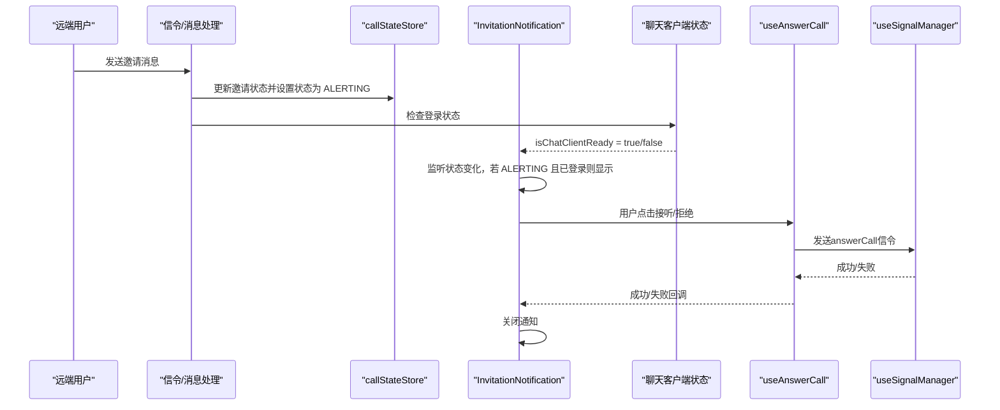
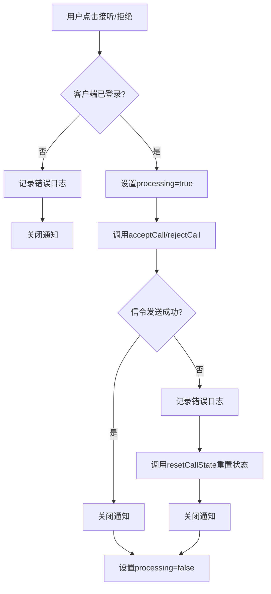
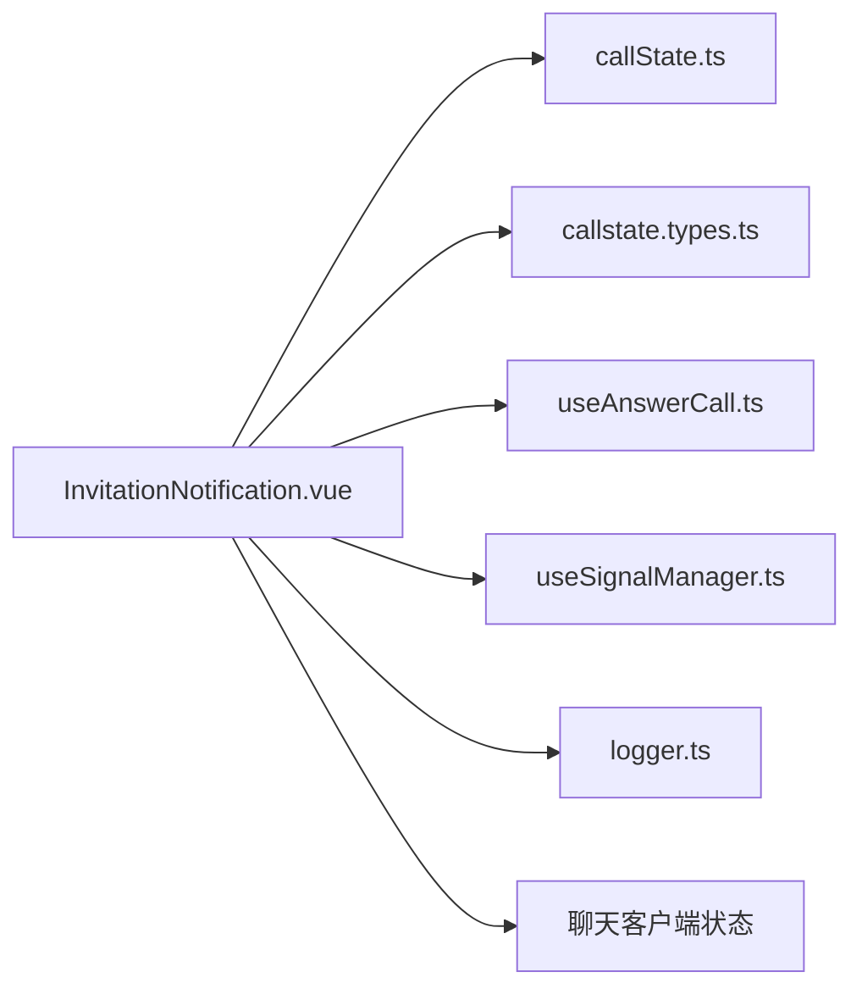

# 通知组件 API

<cite>
**本文引用的文件**
- [lib/components/InvitationNotification.vue](file://lib/components/InvitationNotification.vue)
- [lib/store/callState.ts](file://lib/store/callState.ts)
- [lib/composables/useAnswerCall.ts](file://lib/composables/useAnswerCall.ts)
- [lib/composables/useSignalManager.ts](file://lib/composables/useSignalManager.ts)
- [lib/composables/useListenerManager.ts](file://lib/composables/useListenerManager.ts)
- [lib/types/callstate.types.ts](file://lib/types/callstate.types.ts)
- [lib/utils/logger.ts](file://lib/utils/logger.ts)
- [USAGE.md](file://USAGE.md)
- [callkit/types/index.ts](file://callkit/types/index.ts)
- [callkit/components/InvitationContent.tsx](file://callkit/components/InvitationContent.tsx)
</cite>

## 更新摘要
**变更内容**
- 新增错误处理增强章节，详细说明信令失败时的状态重置机制
- 更新组件交互行为，强调兜底状态重置确保 UI 不卡住
- 补充完整的错误处理流程图和状态重置机制说明

## 目录
1. [简介](#简介)
2. [项目结构](#项目结构)
3. [核心组件](#核心组件)
4. [架构总览](#架构总览)
5. [组件详细分析](#组件详细分析)
6. [错误处理增强机制](#错误处理增强机制)
7. [依赖关系分析](#依赖关系分析)
8. [性能考量](#性能考量)
9. [故障排查指南](#故障排查指南)
10. [结论](#结论)
11. [附录](#附录)

## 简介
本文件为 InvitationNotification 通知组件的详细 API 文档，聚焦于"来电通知"的接收、显示与处理机制。该组件负责在收到远端发起的通话邀请时，以右上角滑入式通知的形式展示邀请者信息、通话类型与操作按钮，并在用户交互（接听/拒绝）或超时后自动关闭。组件与通话状态管理、环信客户端状态、接听/拒绝对组合式 API 等模块协同工作，形成完整的来电通知闭环。

**更新** 本版本新增了信令失败时的状态重置增强机制，确保 UI 不会因为网络异常或信令发送失败而卡住。

## 项目结构
与 InvitationNotification 相关的核心文件与职责概览：
- 组件实现：lib/components/InvitationNotification.vue
- 通话状态与常量：lib/types/callstate.types.ts、lib/store/callState.ts
- 接听/拒绝对组合式 API：lib/composables/useAnswerCall.ts
- 信令管理：lib/composables/useSignalManager.ts
- 信令监听管理：lib/composables/useListenerManager.ts
- 日志工具：lib/utils/logger.ts
- 使用示例与集成方式：USAGE.md
- React 版 InvitationContent（对比参考）：callkit/components/InvitationContent.tsx
- 类型定义（包含 InvitationInfo、CALL_STATUS/CALL_TYPE 等）：callkit/types/index.ts

```mermaid
graph TB
subgraph "通知组件层"
IN["InvitationNotification.vue"]
end
subgraph "状态与类型层"
CST["callState.ts<br/>Pinia Store"]
CT["callstate.types.ts<br/>CALL_STATUS/CALL_TYPE"]
end
subgraph "业务能力层"
UA["useAnswerCall.ts<br/>acceptCall/rejectCall"]
USM["useSignalManager.ts<br/>信令发送"]
ULM["useListenerManager.ts<br/>信令监听"]
LG["logger.ts<br/>日志"]
end
subgraph "外部依赖"
CC["聊天客户端状态<br/>chatClientStore"]
END
IN --> CST
IN --> CT
IN --> UA
IN --> USM
IN --> ULM
IN --> LG
IN --> CC
```

**图表来源**
- [lib/components/InvitationNotification.vue:48-184](file://lib/components/InvitationNotification.vue#L48-L184)
- [lib/store/callState.ts:1-263](file://lib/store/callState.ts#L1-L263)
- [lib/types/callstate.types.ts:1-93](file://lib/types/callstate.types.ts#L1-L93)
- [lib/composables/useAnswerCall.ts](file://lib/composables/useAnswerCall.ts)
- [lib/composables/useSignalManager.ts](file://lib/composables/useSignalManager.ts)
- [lib/composables/useListenerManager.ts](file://lib/composables/useListenerManager.ts)
- [lib/utils/logger.ts](file://lib/utils/logger.ts)

**章节来源**
- [lib/components/InvitationNotification.vue:1-338](file://lib/components/InvitationNotification.vue#L1-L338)
- [lib/store/callState.ts:1-263](file://lib/store/callState.ts#L1-L263)
- [lib/types/callstate.types.ts:1-93](file://lib/types/callstate.types.ts#L1-L93)
- [USAGE.md:32-56](file://USAGE.md#L32-L56)

## 核心组件
- 组件名称：InvitationNotification
- 组件类型：Vue 单文件组件（SFC）
- 作用域：全局右上角固定定位，采用滑入/滑出过渡动画
- 触发条件：当通话状态为 ALERTING 且聊天客户端已登录时显示；否则隐藏
- 显示内容：邀请者头像/占位符、邀请者名称、通话类型描述（一对一/群组）、操作按钮（接听/拒绝）
- 交互行为：点击接听/拒绝后调用对应组合式 API，期间禁用按钮；异常时记录日志并关闭通知

**更新** 组件现在具备增强的错误处理能力，在信令发送失败时会自动重置状态，确保 UI 不会卡住。

**章节来源**
- [lib/components/InvitationNotification.vue:1-46](file://lib/components/InvitationNotification.vue#L1-L46)
- [lib/components/InvitationNotification.vue:110-126](file://lib/components/InvitationNotification.vue#L110-L126)
- [lib/components/InvitationNotification.vue:128-174](file://lib/components/InvitationNotification.vue#L128-L174)

## 架构总览
InvitationNotification 的运行时交互序列如下：



**图表来源**
- [lib/components/InvitationNotification.vue:110-126](file://lib/components/InvitationNotification.vue#L110-L126)
- [lib/store/callState.ts:94-131](file://lib/store/callState.ts#L94-L131)
- [lib/composables/useAnswerCall.ts](file://lib/composables/useAnswerCall.ts)

**章节来源**
- [lib/components/InvitationNotification.vue:110-184](file://lib/components/InvitationNotification.vue#L110-L184)
- [lib/store/callState.ts:94-131](file://lib/store/callState.ts#L94-L131)

## 组件详细分析

### 组件属性与事件
- 组件无对外暴露的 props（作为全局通知组件，其数据来源于内部状态管理）
- 组件事件：无对外事件抛出（内部通过组合式 API 与状态管理交互）

**章节来源**
- [lib/components/InvitationNotification.vue:1-46](file://lib/components/InvitationNotification.vue#L1-L46)

### 数据流与计算属性
- 邀请者名称与头像：从 callStateStore 的用户信息映射中获取，若无则回退为默认占位
- 通话类型：根据 CALL_TYPE 推断为 video/audio
- 群组判断：当类型为多人通话时，描述中包含群组名称
- 客户端就绪：通过聊天客户端设备 ID 判断是否已登录

**章节来源**
- [lib/components/InvitationNotification.vue:63-108](file://lib/components/InvitationNotification.vue#L63-L108)
- [lib/store/callState.ts:220-232](file://lib/store/callState.ts#L220-L232)

### 显示与交互
- 显示条件：监听通话状态变化，仅在 ALERTING 且客户端已登录时显示
- 按钮交互：禁用处理中按钮；成功后自动关闭；失败记录日志
- 自动超时：组件本身不内置倒计时，超时逻辑由状态管理统一处理（单人通话超时会重置状态）

**更新** 错误处理增强：当接听或拒绝通话过程中发生异常时，组件会自动调用 `callStateStore.resetCallState()` 来重置状态，确保 UI 不会卡住。

**章节来源**
- [lib/components/InvitationNotification.vue:110-126](file://lib/components/InvitationNotification.vue#L110-L126)
- [lib/components/InvitationNotification.vue:128-174](file://lib/components/InvitationNotification.vue#L128-L174)
- [lib/store/callState.ts:114-131](file://lib/store/callState.ts#L114-L131)

### 样式与布局
- 固定定位：右上角，z-index 较高，避免遮挡
- 卡片式设计：圆角、阴影、模糊背景，信息区与操作区分层
- 响应式间距：头像、信息、按钮之间留白适配不同屏幕
- 按钮样式：绿色接听、红色拒绝，悬停缩放反馈

**章节来源**
- [lib/components/InvitationNotification.vue:187-338](file://lib/components/InvitationNotification.vue#L187-L338)

### 与状态管理的协作
- 状态来源：callStateStore 提供当前通话状态、类型、邀请信息、用户信息映射
- 状态变更：组件监听状态变化以决定显示/隐藏
- 超时处理：单人通话超时自动重置状态；多人通话保持界面等待用户手动挂断

**章节来源**
- [lib/store/callState.ts:142-151](file://lib/store/callState.ts#L142-L151)
- [lib/store/callState.ts:114-131](file://lib/store/callState.ts#L114-L131)

### 与接听/拒绝对组合式 API 的协作
- 接听：调用 acceptCall，成功后关闭通知
- 拒绝：调用 rejectCall，成功后关闭通知
- 异常处理：捕获错误并记录日志，同时关闭通知

**更新** 错误处理增强：在 useAnswerCall 组合式 API 中，当信令发送失败时会调用 `callStateStore.resetCallState()` 来重置状态，确保 UI 不会卡住。

**章节来源**
- [lib/components/InvitationNotification.vue:128-174](file://lib/components/InvitationNotification.vue#L128-L174)
- [lib/composables/useAnswerCall.ts](file://lib/composables/useAnswerCall.ts)

### 与聊天客户端状态的协作
- 客户端就绪判断：通过设备 ID 存在性判断是否已登录
- 未登录时的行为：收到 ALERTING 状态时不显示通知，并记录警告日志

**章节来源**
- [lib/components/InvitationNotification.vue:103-108](file://lib/components/InvitationNotification.vue#L103-L108)
- [lib/components/InvitationNotification.vue:118-124](file://lib/components/InvitationNotification.vue#L118-L124)

### 与日志系统的协作
- 显示通知、接听/拒绝失败、未登录尝试接听/拒绝等关键节点均记录日志

**章节来源**
- [lib/components/InvitationNotification.vue:116-117](file://lib/components/InvitationNotification.vue#L116-L117)
- [lib/components/InvitationNotification.vue:133-138](file://lib/components/InvitationNotification.vue#L133-L138)
- [lib/components/InvitationNotification.vue:157-162](file://lib/components/InvitationNotification.vue#L157-L162)
- [lib/utils/logger.ts](file://lib/utils/logger.ts)

### 与类型系统的关系
- 通话状态与类型：CALL_STATUS、CALL_TYPE
- 邀请信息：InvitationInfo（包含 callerUserId/type/group 等）

**章节来源**
- [lib/types/callstate.types.ts:11-48](file://lib/types/callstate.types.ts#L11-L48)
- [callkit/types/index.ts:95-108](file://callkit/types/index.ts#L95-L108)

### 与 React 版 InvitationContent 的对比参考
- React 版本提供倒计时自动拒绝、自定义图标渲染、头像/名称显示策略等能力，可作为扩展参考
- Vue 版本专注于通知卡片的展示与交互，不包含倒计时逻辑（由状态管理统一处理）

**章节来源**
- [callkit/components/InvitationContent.tsx:96-114](file://callkit/components/InvitationContent.tsx#L96-L114)
- [callkit/components/InvitationContent.tsx:144-170](file://callkit/components/InvitationContent.tsx#L144-L170)

## 错误处理增强机制

### 信令失败时的状态重置
InvitationNotification 组件实现了完善的错误处理增强机制，确保在网络异常或信令发送失败时 UI 不会卡住：



**图表来源**
- [lib/components/InvitationNotification.vue:128-180](file://lib/components/InvitationNotification.vue#L128-L180)
- [lib/composables/useAnswerCall.ts:72-77](file://lib/composables/useAnswerCall.ts#L72-L77)

### 兜底状态重置机制
当发生以下情况时，组件会自动调用 `callStateStore.resetCallState()`：

1. **接听失败**：`handleAccept()` 方法中捕获异常后调用 `resetCallState()`
2. **拒绝失败**：`handleReject()` 方法中捕获异常后调用 `resetCallState()`
3. **信令发送失败**：`useAnswerCall()` 组合式 API 中捕获异常后调用 `resetCallState()`

### 状态重置的完整性
`resetCallState()` 方法会重置所有相关状态，包括：
- 清除超时计时器
- 重置通话状态为 IDLE
- 清空所有通话相关数据
- 重置用户信息映射
- 清空群组通话相关状态

**章节来源**
- [lib/components/InvitationNotification.vue:147-149](file://lib/components/InvitationNotification.vue#L147-L149)
- [lib/components/InvitationNotification.vue:174-176](file://lib/components/InvitationNotification.vue#L174-L176)
- [lib/composables/useAnswerCall.ts:74-76](file://lib/composables/useAnswerCall.ts#L74-L76)
- [lib/store/callState.ts:155-188](file://lib/store/callState.ts#L155-L188)

## 依赖关系分析
- 组件对状态管理的依赖：高度依赖 callStateStore 的状态与计算属性
- 组件对业务能力的依赖：依赖 useAnswerCall 提供的 acceptCall/rejectCall
- 组件对类型系统的依赖：依赖 CALL_STATUS/CALL_TYPE 与 InvitationInfo 类型
- 组件对日志系统的依赖：关键路径记录日志



**图表来源**
- [lib/components/InvitationNotification.vue:48-58](file://lib/components/InvitationNotification.vue#L48-L58)
- [lib/store/callState.ts:1-263](file://lib/store/callState.ts#L1-L263)
- [lib/types/callstate.types.ts:1-93](file://lib/types/callstate.types.ts#L1-L93)
- [lib/composables/useAnswerCall.ts](file://lib/composables/useAnswerCall.ts)
- [lib/composables/useSignalManager.ts](file://lib/composables/useSignalManager.ts)
- [lib/utils/logger.ts](file://lib/utils/logger.ts)

**章节来源**
- [lib/components/InvitationNotification.vue:48-58](file://lib/components/InvitationNotification.vue#L48-L58)

## 性能考量
- 渲染开销：通知卡片为轻量级 DOM，固定定位且过渡动画简单，性能开销低
- 状态监听：watch 监听通话状态变化，仅在 ALERTING 时触发显示逻辑，避免频繁更新
- 资源释放：组件卸载时无需额外清理；通知关闭后不残留 DOM
- 错误处理优化：通过兜底状态重置机制，避免异常状态持续占用内存
- 建议：避免在同一时间大量并发显示多个通知卡片；如需扩展倒计时，建议在状态层统一管理，减少组件内计时器

## 故障排查指南
- 问题：收到邀请但通知未显示
  - 检查聊天客户端是否已登录（设备 ID 是否存在）
  - 检查通话状态是否为 ALERTING
  - 查看日志中关于"未登录或未初始化"的警告
- 问题：点击接听/拒绝无效
  - 确认客户端已登录后再进行交互
  - 查看日志中的错误信息，确认 acceptCall/rejectCall 是否抛出异常
  - 检查网络连接状态，确认信令发送是否成功
- 问题：通知显示后无法关闭
  - 确认接听/拒绝流程是否成功完成
  - 若异常，组件会在 finally 中恢复处理状态并调用 `resetCallState()` 关闭通知
- 问题：UI 卡住无法响应
  - 检查是否有异常状态未被重置
  - 查看日志中关于错误处理的记录
  - 手动调用 `resetCallState()` 或刷新页面

**更新** 新增了错误处理增强机制的故障排查指导。

**章节来源**
- [lib/components/InvitationNotification.vue:118-124](file://lib/components/InvitationNotification.vue#L118-L124)
- [lib/components/InvitationNotification.vue:133-138](file://lib/components/InvitationNotification.vue#L133-L138)
- [lib/components/InvitationNotification.vue:157-162](file://lib/components/InvitationNotification.vue#L157-L162)

## 结论
InvitationNotification 以简洁的卡片形式实现了来电通知的核心能力：在合适的时机显示、展示必要的邀请信息、提供直观的操作入口，并与状态管理、客户端状态、业务能力与日志系统紧密协作。其设计遵循"组件专注展示与交互、状态与业务逻辑集中管理"的原则，具备良好的可维护性与扩展性。

**更新** 本版本通过引入信令失败时的状态重置增强机制，进一步提升了组件的健壮性和用户体验，确保在各种异常情况下 UI 都能保持正常响应。

## 附录

### 使用示例与集成要点
- 在根组件中放置 EasemobChatCallKitProvider，并在模板中插入 InvitationNotification
- 确保聊天客户端已初始化并登录，以便组件能够正确响应 ALERTING 状态
- 如需自定义样式，可通过外部样式覆盖组件的类名

**章节来源**
- [USAGE.md:32-56](file://USAGE.md#L32-L56)

### API 一览（组件内部）
- 监听与控制
  - 监听通话状态变化，仅在 ALERTING 且客户端已登录时显示
  - 组件挂载时检查当前状态，必要时立即显示
- 计算属性
  - 邀请者名称与头像
  - 通话类型（video/audio）
  - 群组判断与描述
  - 客户端就绪判断
- 交互方法
  - 接听：调用 acceptCall，异常时记录日志并调用 `resetCallState()` 关闭通知
  - 拒绝：调用 rejectCall，异常时记录日志并调用 `resetCallState()` 关闭通知
- 错误处理增强
  - 信令发送失败时自动重置状态
  - 确保 UI 不会卡住
- 样式
  - 固定定位、圆角、阴影、模糊背景、滑入/滑出动画

**更新** 新增了错误处理增强机制的 API 说明。

**章节来源**
- [lib/components/InvitationNotification.vue:63-108](file://lib/components/InvitationNotification.vue#L63-L108)
- [lib/components/InvitationNotification.vue:110-184](file://lib/components/InvitationNotification.vue#L110-L184)
- [lib/components/InvitationNotification.vue:187-338](file://lib/components/InvitationNotification.vue#L187-L338)
- [lib/composables/useAnswerCall.ts:72-77](file://lib/composables/useAnswerCall.ts#L72-L77)
- [lib/store/callState.ts:155-188](file://lib/store/callState.ts#L155-L188)