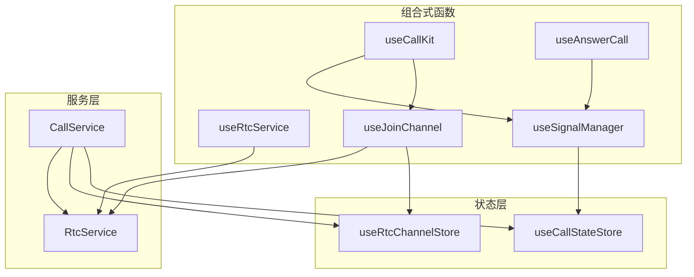
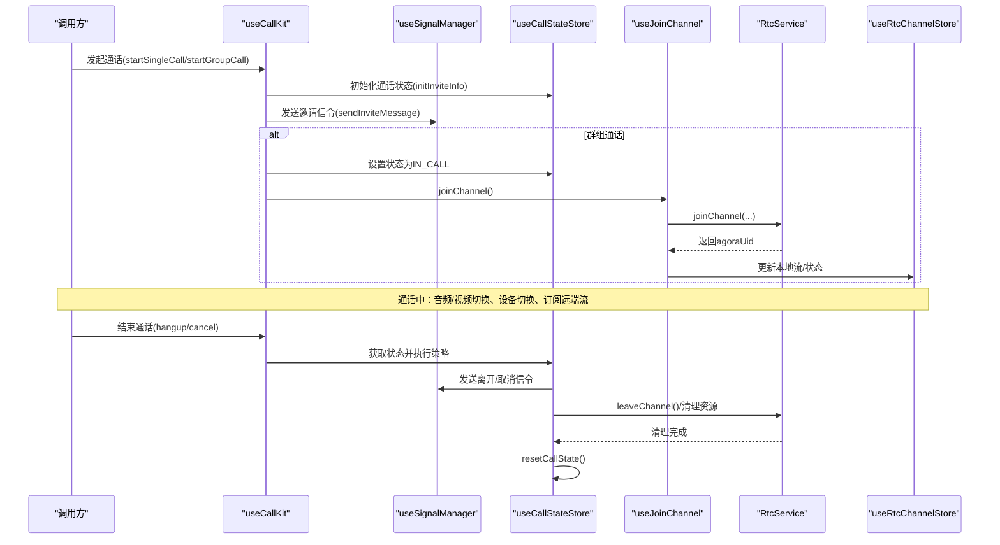
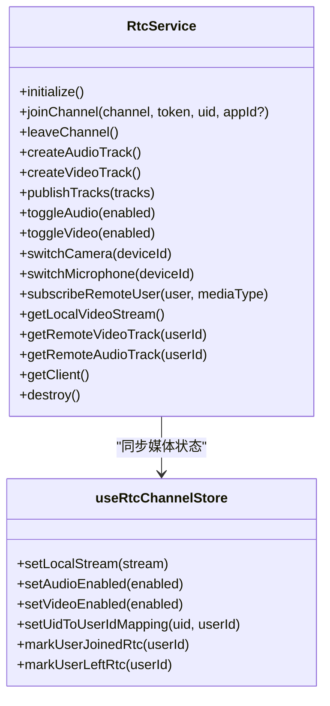
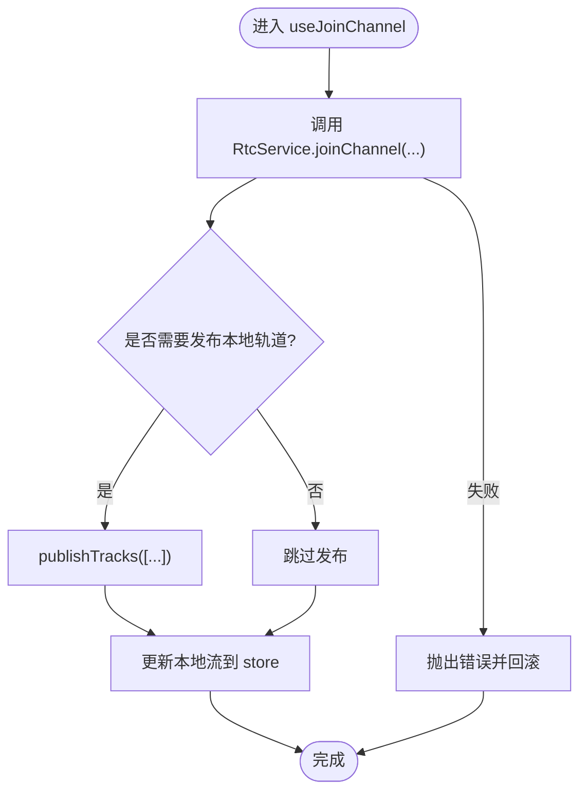
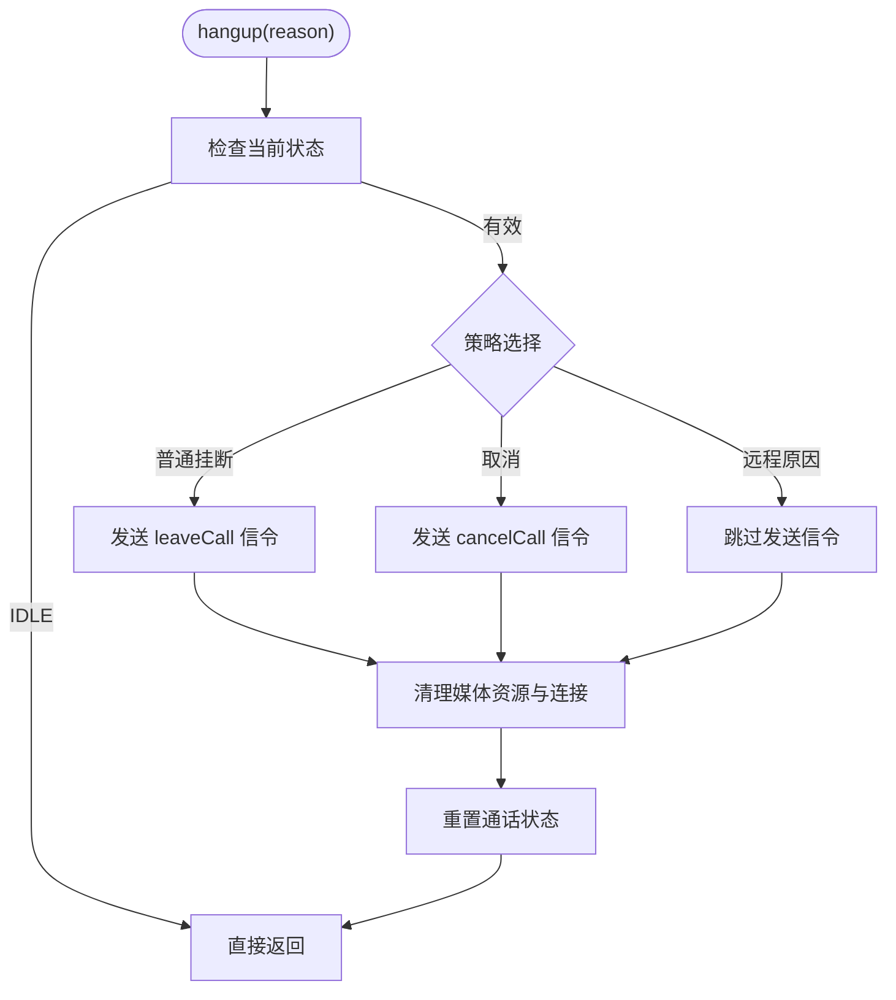
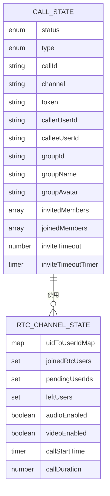
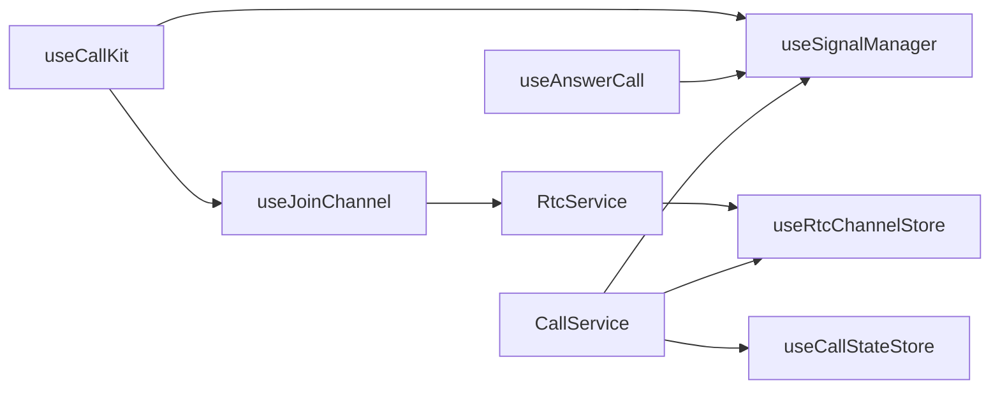

# RTC 服务 API

<cite>
**本文档引用的文件**
- [lib/services/RtcService.ts](file://lib/services/RtcService.ts)
- [lib/composables/useRtcService.ts](file://lib/composables/useRtcService.ts)
- [lib/composables/useJoinChannel.ts](file://lib/composables/useJoinChannel.ts)
- [lib/services/CallService.ts](file://lib/services/CallService.ts)
- [lib/composables/useSignalManager.ts](file://lib/composables/useSignalManager.ts)
- [lib/store/rtcChannel.ts](file://lib/store/rtcChannel.ts)
- [lib/store/callState.ts](file://lib/store/callState.ts)
- [lib/types/callstate.types.ts](file://lib/types/callstate.types.ts)
- [lib/composables/useCallKit.ts](file://lib/composables/useCallKit.ts)
- [lib/composables/useAnswerCall.ts](file://lib/composables/useAnswerCall.ts)
- [lib/store/types.ts](file://lib/store/types.ts)
- [lib/index.ts](file://lib/index.ts)
</cite>

## 目录
1. [简介](#简介)
2. [项目结构](#项目结构)
3. [核心组件](#核心组件)
4. [架构总览](#架构总览)
5. [详细组件分析](#详细组件分析)
6. [依赖关系分析](#依赖关系分析)
7. [性能考虑](#性能考虑)
8. [故障排查指南](#故障排查指南)
9. [结论](#结论)
10. [附录](#附录)

## 简介
本文件系统性梳理并说明 RTC 服务组合式函数的完整接口与实现，重点覆盖以下能力：
- 音视频通话服务函数 useRtcService 与 useJoinChannel 的完整接口定义与行为
- RTC 频道管理、设备控制、网络状态监控等实现方式
- 音频与视频设备的获取、切换与管理
- 频道加入与离开的完整流程，含错误处理与重连机制建议
- 在实际项目中的集成方式、性能优化与调试技巧

## 项目结构
围绕 RTC 服务与通话控制，核心目录与文件如下：
- 服务层：RtcService（封装 Agora WebRTC 操作）、CallService（通话生命周期与资源清理）
- 组合式函数：useRtcService、useJoinChannel、useSignalManager、useCallKit、useAnswerCall
- 状态层：callState（通话状态）、rtcChannel（频道与媒体流状态）
- 类型与常量：callstate.types（状态与类型定义）

图表来源
- [lib/composables/useCallKit.ts](file://lib/composables/useCallKit.ts#L1-L123)
- [lib/composables/useAnswerCall.ts](file://lib/composables/useAnswerCall.ts#L1-L168)
- [lib/composables/useRtcService.ts](file://lib/composables/useRtcService.ts)
- [lib/composables/useJoinChannel.ts](file://lib/composables/useJoinChannel.ts)
- [lib/composables/useSignalManager.ts](file://lib/composables/useSignalManager.ts#L1-L354)
- [lib/services/RtcService.ts](file://lib/services/RtcService.ts#L1-L719)
- [lib/services/CallService.ts](file://lib/services/CallService.ts#L1-L298)
- [lib/store/callState.ts](file://lib/store/callState.ts#L1-L263)
- [lib/store/rtcChannel.ts](file://lib/store/rtcChannel.ts#L1-L410)

章节来源
- [lib/index.ts](file://lib/index.ts#L1-L58)

## 核心组件
- useRtcService：封装 RTC 设备与媒体流控制，提供音频/视频开关、设备切换、订阅/发布等能力
- useJoinChannel：封装频道加入/离开流程，协调 RtcService 与 rtcChannel 状态
- RtcService：底层 Agora WebRTC 客户端封装，负责连接、发布/订阅、事件监听、设备管理
- useSignalManager：统一发送通话信令（邀请、接听、取消、离开、忙等）
- CallService：通话挂断与资源清理策略，统一处理异常与状态重置
- 状态存储：useCallStateStore（通话状态机）、useRtcChannelStore（频道与媒体流）

章节来源
- [lib/composables/useRtcService.ts](file://lib/composables/useRtcService.ts)
- [lib/composables/useJoinChannel.ts](file://lib/composables/useJoinChannel.ts)
- [lib/services/RtcService.ts](file://lib/services/RtcService.ts#L1-L719)
- [lib/composables/useSignalManager.ts](file://lib/composables/useSignalManager.ts#L1-L354)
- [lib/services/CallService.ts](file://lib/services/CallService.ts#L1-L298)
- [lib/store/callState.ts](file://lib/store/callState.ts#L1-L263)
- [lib/store/rtcChannel.ts](file://lib/store/rtcChannel.ts#L1-L410)

## 架构总览
下图展示了从发起通话到频道加入、媒体发布、订阅以及挂断清理的整体流程。

图表来源
- [lib/composables/useCallKit.ts](file://lib/composables/useCallKit.ts#L1-L123)
- [lib/composables/useSignalManager.ts](file://lib/composables/useSignalManager.ts#L1-L354)
- [lib/store/callState.ts](file://lib/store/callState.ts#L1-L263)
- [lib/composables/useJoinChannel.ts](file://lib/composables/useJoinChannel.ts)
- [lib/services/RtcService.ts](file://lib/services/RtcService.ts#L1-L719)
- [lib/services/CallService.ts](file://lib/services/CallService.ts#L1-L298)
- [lib/store/rtcChannel.ts](file://lib/store/rtcChannel.ts#L1-L410)

## 详细组件分析

### useRtcService 接口与能力
- 职责
  - 管理本地音视频轨道与媒体流
  - 控制音频/视频开关与设备切换
  - 订阅/发布远端媒体轨道
  - 监听网络质量与音量指示
- 关键方法（语义化说明）
  - initialize()：初始化 Agora 客户端
  - joinChannel(channel, token, uid, appId?)：加入频道
  - leaveChannel()：离开频道并清理本地轨道
  - createAudioTrack()/createVideoTrack()：创建本地轨道
  - publishTracks(tracks)：发布本地轨道
  - toggleAudio(enabled)/toggleVideo(enabled)：切换音频/视频
  - switchCamera(deviceId)/switchMicrophone(deviceId)：切换设备
  - subscribeRemoteUser(user, mediaType)：订阅远端用户
  - getLocalVideoStream()/getRemoteVideoTrack(userId)/getRemoteAudioTrack(userId)：获取媒体流/轨道
  - getClient()：获取底层客户端实例
  - destroy()：销毁服务并清理资源
- 设备与媒体状态
  - 通过 useRtcChannelStore 同步本地流、音频/视频开关状态
  - 通过 uid-to-userId 映射解析远端用户
- 网络状态监控
  - 通过事件监听 network-quality 与 volume-indicator 回调上报

图表来源
- [lib/services/RtcService.ts](file://lib/services/RtcService.ts#L1-L719)
- [lib/store/rtcChannel.ts](file://lib/store/rtcChannel.ts#L1-L410)

章节来源
- [lib/services/RtcService.ts](file://lib/services/RtcService.ts#L1-L719)
- [lib/store/rtcChannel.ts](file://lib/store/rtcChannel.ts#L1-L410)

### useJoinChannel 频道管理与流程
- 职责
  - 封装频道加入/离开流程
  - 协调 RtcService 与 rtcChannel 状态
  - 在群组通话中协助主叫方提前进入频道
- 关键流程
  - joinChannel()：调用 RtcService.joinChannel 并更新本地流与状态
  - leaveChannel()：调用 RtcService.leaveChannel 并重置状态
- 与状态层交互
  - 通过 useRtcChannelStore 维护频道列表、参与者、本地/远端流
  - 通过 useCallStateStore 设置通话状态（如 IN_CALL）

图表来源
- [lib/composables/useJoinChannel.ts](file://lib/composables/useJoinChannel.ts)
- [lib/services/RtcService.ts](file://lib/services/RtcService.ts#L109-L138)
- [lib/store/rtcChannel.ts](file://lib/store/rtcChannel.ts#L149-L185)

章节来源
- [lib/composables/useJoinChannel.ts](file://lib/composables/useJoinChannel.ts)
- [lib/services/RtcService.ts](file://lib/services/RtcService.ts#L109-L138)
- [lib/store/rtcChannel.ts](file://lib/store/rtcChannel.ts#L149-L185)

### 通话状态机与挂断策略
- 状态机（节选）
  - IDLE → INVITING → ALERTING → CONFIRM_RING → RECEIVED_CONFIRM_RING → ANSWER_CALL → CONFIRM_CALLEE → IN_CALL → ENDED
- 挂断策略
  - 普通挂断：发送 leaveCall 信令，清理媒体资源与连接，重置状态
  - 取消/远程取消：发送 cancelCall 信令，清理并重置
  - 异常结束：清理并强制重置状态
- 资源清理
  - 取消发布本地轨道、停止本地/远端轨道、离开频道、重置 store

图表来源
- [lib/services/CallService.ts](file://lib/services/CallService.ts#L25-L72)
- [lib/services/CallService.ts](file://lib/services/CallService.ts#L75-L164)
- [lib/services/CallService.ts](file://lib/services/CallService.ts#L194-L257)
- [lib/services/CallService.ts](file://lib/services/CallService.ts#L259-L276)

章节来源
- [lib/services/CallService.ts](file://lib/services/CallService.ts#L1-L298)
- [lib/types/callstate.types.ts](file://lib/types/callstate.types.ts#L1-L93)

### 信令管理与设备控制
- useSignalManager
  - 提供 sendInviteMessage、sendAnswerMessage、sendCancelMessage、sendLeaveMessage、sendBusyAnswerMessage、sendAlertMessage、sendConfirmRingMessage、sendConfirmCalleeMessage
  - 统一封装 ChatService 发送文本与信号消息
- 设备控制
  - 通过 RtcService.switchCamera/deviceId 与 switchMicrophone 切换设备
  - 通过 toggleAudio/toggleVideo 控制本地媒体开关

章节来源
- [lib/composables/useSignalManager.ts](file://lib/composables/useSignalManager.ts#L1-L354)
- [lib/services/RtcService.ts](file://lib/services/RtcService.ts#L358-L395)

### 状态模型与映射
- 通话状态（CallState）
  - 包含状态、类型、用户信息、超时计时器、群组信息等
  - 提供初始化、更新、重置、超时处理等动作
- 频道状态（RtcChannelState）
  - 维护频道列表、活跃频道、本地/远端流、音频/视频开关、UID↔userId 映射、加入/离开用户集合
  - 提供计时器、映射管理、待加入用户队列等

图表来源
- [lib/store/callState.ts](file://lib/store/callState.ts#L11-L37)
- [lib/store/rtcChannel.ts](file://lib/store/rtcChannel.ts#L11-L28)
- [lib/store/types.ts](file://lib/store/types.ts#L43-L86)

章节来源
- [lib/store/callState.ts](file://lib/store/callState.ts#L1-L263)
- [lib/store/rtcChannel.ts](file://lib/store/rtcChannel.ts#L1-L410)
- [lib/store/types.ts](file://lib/store/types.ts#L1-L86)

## 依赖关系分析
- useCallKit 依赖 useSignalManager 与 useJoinChannel，用于发起通话与加入频道
- useAnswerCall 依赖 useSignalManager 与 useCallStateStore，用于应答与状态变更
- RtcService 依赖 Agora SDK 与 useRtcChannelStore，负责媒体与事件
- CallService 依赖 useCallStateStore、useRtcChannelStore、useSignalManager，负责挂断与清理
- useJoinChannel 依赖 RtcService 与 useRtcChannelStore，负责频道生命周期

图表来源
- [lib/composables/useCallKit.ts](file://lib/composables/useCallKit.ts#L1-L123)
- [lib/composables/useAnswerCall.ts](file://lib/composables/useAnswerCall.ts#L1-L168)
- [lib/composables/useJoinChannel.ts](file://lib/composables/useJoinChannel.ts)
- [lib/composables/useSignalManager.ts](file://lib/composables/useSignalManager.ts#L1-L354)
- [lib/services/RtcService.ts](file://lib/services/RtcService.ts#L1-L719)
- [lib/services/CallService.ts](file://lib/services/CallService.ts#L1-L298)
- [lib/store/rtcChannel.ts](file://lib/store/rtcChannel.ts#L1-L410)

章节来源
- [lib/index.ts](file://lib/index.ts#L1-L58)

## 性能考虑
- 轨道复用与延迟创建
  - 避免重复创建本地轨道；仅在需要时创建并发布
  - 视频切换时优先启用已有轨道，必要时再发布
- 资源释放
  - 离开频道前取消发布并停止轨道，防止内存泄漏
  - 通话结束后重置 store，清理计时器与映射
- 网络质量与音量指示
  - 合理使用网络质量事件与音量指示回调，避免频繁渲染
- UI 与状态解耦
  - 将媒体状态与 UI 解耦，通过 store 驱动视图更新

## 故障排查指南
- 常见问题与定位
  - 无法加入频道：检查 appId、token、uid 与频道名；查看 RtcService.joinChannel 抛错
  - 设备切换失败：确认设备权限与可用性；查看 switchCamera/switchMicrophone 返回值
  - 无法发布轨道：确认客户端连接状态与轨道是否已存在；查看 publishTracks 抛错
  - 信令发送失败：检查 ChatClient 初始化与 useSignalManager getClient 抛错
  - 挂断后资源未释放：确认 CallService.cleanupMediaResources 与 cleanupConnection 是否执行
- 日志与调试
  - 使用 logger 输出关键路径日志，结合 LogLevel 调整输出级别
  - 在 RtcService 中启用更详细的日志级别以辅助定位

章节来源
- [lib/services/RtcService.ts](file://lib/services/RtcService.ts#L82-L96)
- [lib/composables/useSignalManager.ts](file://lib/composables/useSignalManager.ts#L57-L64)
- [lib/services/CallService.ts](file://lib/services/CallService.ts#L194-L257)
- [lib/utils/logger.ts](file://lib/utils/logger.ts#L1-L231)

## 结论
本文档系统梳理了 RTC 服务组合式函数的接口与实现，明确了 useRtcService 与 useJoinChannel 的职责边界与协作方式，给出了频道管理、设备控制、网络监控与挂断清理的完整流程。通过 Pinia 状态与组合式函数的解耦设计，项目实现了清晰的职责划分与良好的可维护性。建议在实际项目中遵循“按需创建、及时释放、统一信令、状态驱动”的原则，配合日志与调试工具，确保音视频通话的稳定性与性能。

## 附录
- 类型与常量参考
  - 通话状态与类型：CALL_STATUS、CALL_TYPE、CALLKIT_CMD_MSG_RESULT_TYPE、HANGUP_REASON
- 导出清单
  - 组件：EasemobChatCallKitProvider、EasemobChatSingleCall、EasemobChatMultiCall、InvitationNotification、EasemobChatMiniWindow
  - Store：useCallStateStore、useRtcChannelStore
  - Hook：useCallKit、useEndCall、useAnswerCall、useRtcService、useJoinChannel、useParticipants
  - 服务：RtcService
  - 类型：HANGUP_REASON、CALL_STATUS、CALL_TYPE 等

章节来源
- [lib/types/callstate.types.ts](file://lib/types/callstate.types.ts#L1-L93)
- [lib/index.ts](file://lib/index.ts#L1-L58)