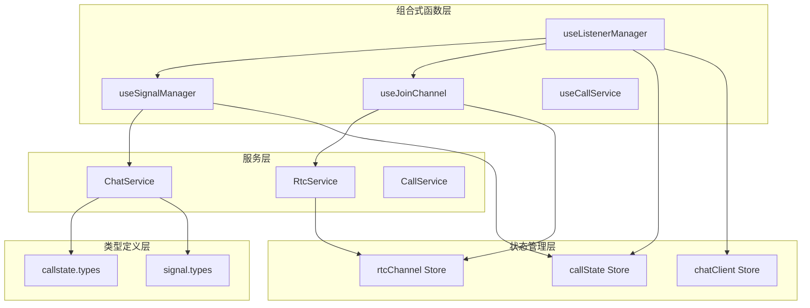
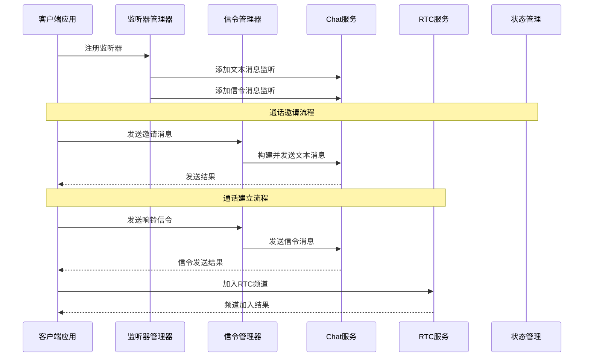
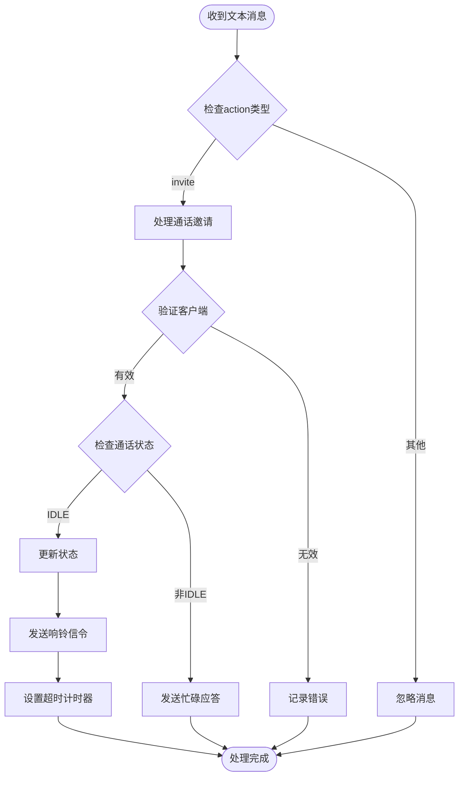
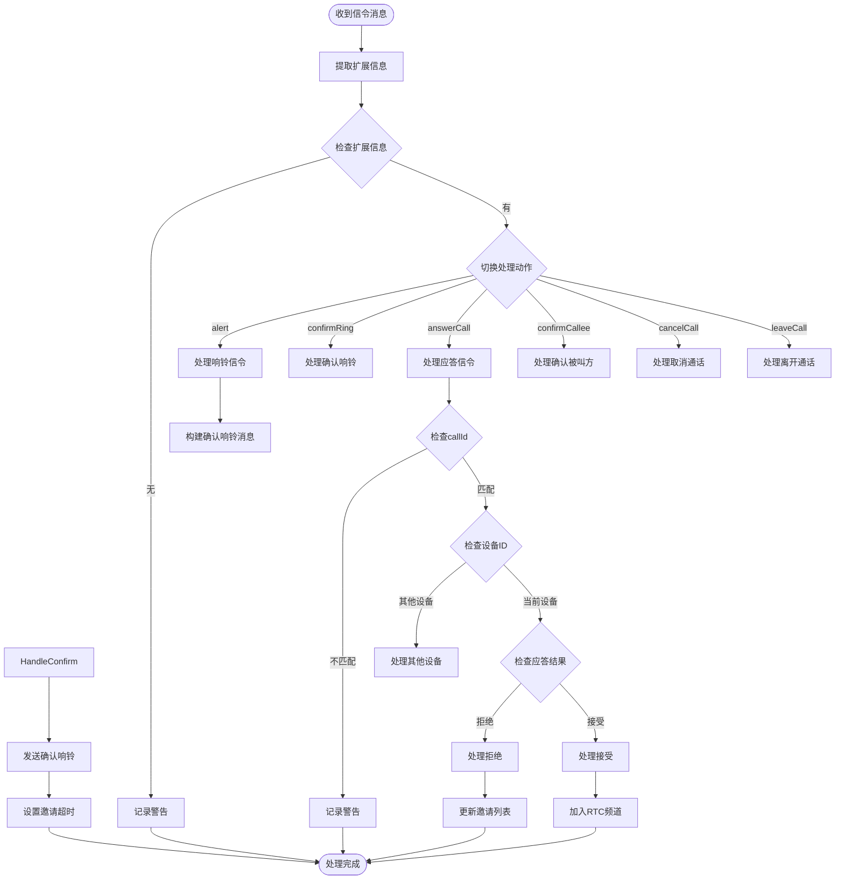
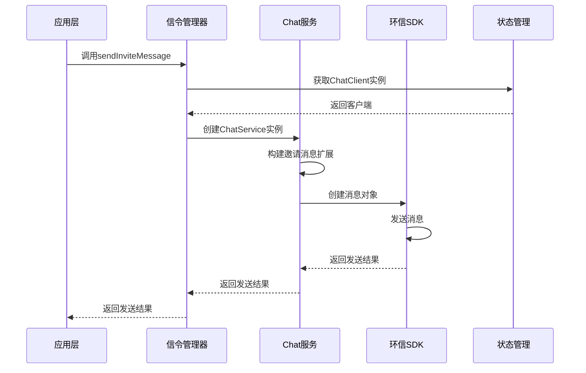
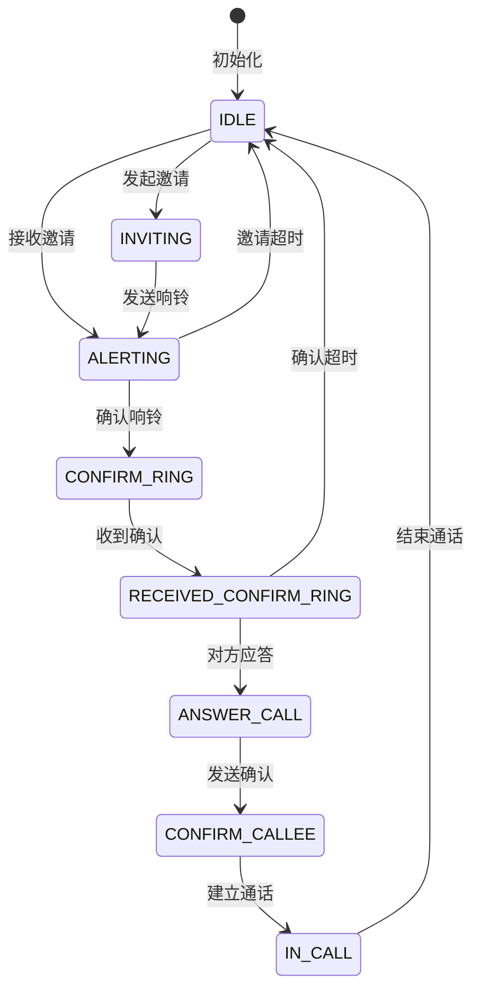
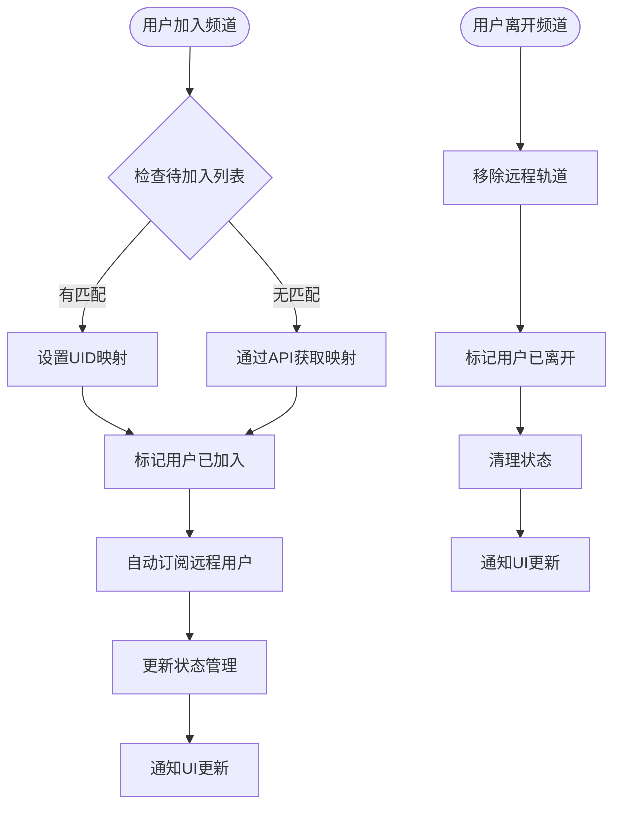
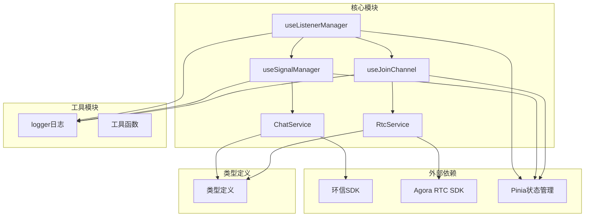

# 监听器管理 API

<cite>
**本文档引用的文件**
- [lib/composables/useListenerManager.ts](file://lib/composables/useListenerManager.ts)
- [lib/composables/useSignalManager.ts](file://lib/composables/useSignalManager.ts)
- [lib/services/ChatService.ts](file://lib/services/ChatService.ts)
- [lib/services/RtcService.ts](file://lib/services/RtcService.ts)
- [lib/composables/useJoinChannel.ts](file://lib/composables/useJoinChannel.ts)
- [lib/store/callState.ts](file://lib/store/callState.ts)
- [lib/store/rtcChannel.ts](file://lib/store/rtcChannel.ts)
- [lib/types/callstate.types.ts](file://lib/types/callstate.types.ts)
- [lib/types/signal.types.ts](file://lib/types/signal.types.ts)
</cite>

## 目录
1. [简介](#简介)
2. [项目结构](#项目结构)
3. [核心组件](#核心组件)
4. [架构概览](#架构概览)
5. [详细组件分析](#详细组件分析)
6. [依赖关系分析](#依赖关系分析)
7. [性能考虑](#性能考虑)
8. [故障排除指南](#故障排除指南)
9. [结论](#结论)

## 简介

本文档详细介绍了 Easemob Vue3 CallKit 项目中的监听器管理和信令管理组合式函数。重点涵盖了 `useListenerManager` 和 `useSignalManager` 等事件监听和信令处理函数的完整接口定义，详细描述了事件监听器的注册、注销和管理机制，包括内存泄漏防护和性能优化策略。

该系统实现了完整的实时通信架构，包括文本消息监听、信令消息处理、RTC频道管理等功能。系统采用 Vue3 Composition API 设计，结合 Pinia 状态管理，提供了类型安全的 API 接口和完善的错误处理机制。

## 项目结构

项目采用模块化设计，主要包含以下核心模块：



**图表来源**
- [lib/composables/useListenerManager.ts](file://lib/composables/useListenerManager.ts#L1-L684)
- [lib/composables/useSignalManager.ts](file://lib/composables/useSignalManager.ts#L1-L354)
- [lib/composables/useJoinChannel.ts](file://lib/composables/useJoinChannel.ts#L1-L185)

**章节来源**
- [lib/composables/useListenerManager.ts](file://lib/composables/useListenerManager.ts#L1-L684)
- [lib/composables/useSignalManager.ts](file://lib/composables/useSignalManager.ts#L1-L354)
- [lib/composables/useJoinChannel.ts](file://lib/composables/useJoinChannel.ts#L1-L185)

## 核心组件

### 监听器管理器 (useListenerManager)

`useListenerManager` 是系统的核心监听器管理组件，负责注册和管理各种消息监听器：

**主要功能**：
- 文本消息监听器注册 (`mountTextMessageListener`)
- 信令消息监听器注册 (`mountSignalListener`)
- 通话邀请消息处理
- 用户属性处理
- 信令消息分发和处理

**接口定义**：
```typescript
interface ListenerManagerReturn {
  mountTextMessageListener: () => void;
  mountSignalListener: () => void;
}
```

### 信令管理器 (useSignalManager)

`useSignalManager` 提供统一的信令发送接口，封装了所有通话相关的信令操作：

**主要信令类型**：
- 邀请信令 (`sendInviteMessage`)
- 响铃信令 (`sendAlertMessage`)
- 确认响铃信令 (`sendConfirmRingMessage`)
- 应答信令 (`sendAnswerMessage`)
- 确认被叫方信令 (`sendConfirmCalleeMessage`)
- 取消通话信令 (`sendCancelMessage`)
- 离开通话信令 (`sendLeaveMessage`)

**接口定义**：
```typescript
interface UseSignalManagerReturn {
  sendInviteMessage: (targetId: string | string[], chatType: Chat.ChatType, message: string, groupId?: string) => Promise<Chat.SendMsgResult>;
  sendAnswerMessage: (targetId: string, payload: any, result?: CALLKIT_CMD_MSG_RESULT_TYPE) => Promise<Chat.SendMsgResult>;
  sendCancelMessage: (to: string, chatType: "singleChat" | "groupChat", receiverList?: string[]) => Promise<Chat.SendMsgResult>;
  sendLeaveMessage: (to: string, chatType: "singleChat" | "groupChat", receiverList?: string[]) => Promise<Chat.SendMsgResult>;
  sendBusyAnswerMessage: (targetId: string, payload: any) => Promise<Chat.SendMsgResult>;
  sendAlertMessage: (targetId: string) => Promise<Chat.SendMsgResult>;
  sendConfirmRingMessage: (targetId: string, payload: any) => Promise<Chat.SendMsgResult>;
  sendConfirmCalleeMessage: (targetId: string, payload: any) => Promise<Chat.SendMsgResult>;
}
```

**章节来源**
- [lib/composables/useListenerManager.ts](file://lib/composables/useListenerManager.ts#L28-L31)
- [lib/composables/useSignalManager.ts](file://lib/composables/useSignalManager.ts#L7-L42)

## 架构概览

系统采用分层架构设计，实现了清晰的关注点分离：



**图表来源**
- [lib/composables/useListenerManager.ts](file://lib/composables/useListenerManager.ts#L619-L682)
- [lib/composables/useSignalManager.ts](file://lib/composables/useSignalManager.ts#L73-L102)
- [lib/services/ChatService.ts](file://lib/services/ChatService.ts#L144-L187)

## 详细组件分析

### 监听器管理器深度分析

#### 文本消息监听器

监听器管理器实现了对文本消息的完整处理流程：



**图表来源**
- [lib/composables/useListenerManager.ts](file://lib/composables/useListenerManager.ts#L56-L116)

#### 信令消息处理流程

系统支持多种信令消息类型，每种都有特定的处理逻辑：



**图表来源**
- [lib/composables/useListenerManager.ts](file://lib/composables/useListenerManager.ts#L141-L618)

**章节来源**
- [lib/composables/useListenerManager.ts](file://lib/composables/useListenerManager.ts#L56-L682)

### 信令管理器深度分析

#### 信令发送流程

信令管理器提供了统一的信令发送接口，实现了完整的信令构建和发送流程：



**图表来源**
- [lib/composables/useSignalManager.ts](file://lib/composables/useSignalManager.ts#L73-L102)
- [lib/services/ChatService.ts](file://lib/services/ChatService.ts#L144-L187)

#### 信令类型定义

系统定义了完整的信令类型体系，确保信令消息的一致性和可维护性：

**基础信令扩展接口**：
```typescript
interface BaseSignalingExt {
  action: string;
  callId: string;
  ts: number;
  msgType: string;
}
```

**具体信令类型**：
- 邀请信令 (`InviteSignalingExt`)
- 响铃信令 (`AlertSignalingExt`)  
- 确认响铃信令 (`ConfirmRingSignalingExt`)
- 应答信令 (`AnswerCallSignalingExt`)
- 确认被叫方信令 (`ConfirmCalleeSignalingExt`)
- 取消通话信令 (`CancelCallSignalingExt`)
- 离开通话信令 (`LeaveCallSignalingExt`)

**章节来源**
- [lib/composables/useSignalManager.ts](file://lib/composables/useSignalManager.ts#L50-L353)
- [lib/types/signal.types.ts](file://lib/types/signal.types.ts#L47-L195)

### 状态管理分析

#### 通话状态管理

系统使用 Pinia 实现了完整的通话状态管理：



**图表来源**
- [lib/store/callState.ts](file://lib/store/callState.ts#L13-L22)

#### RTC频道状态管理

RTC频道状态管理实现了复杂的用户连接和断开逻辑：



**图表来源**
- [lib/store/rtcChannel.ts](file://lib/store/rtcChannel.ts#L292-L315)

**章节来源**
- [lib/store/callState.ts](file://lib/store/callState.ts#L1-L263)
- [lib/store/rtcChannel.ts](file://lib/store/rtcChannel.ts#L1-L410)

## 依赖关系分析

系统采用了清晰的依赖层次结构，实现了良好的模块解耦：



**图表来源**
- [lib/composables/useListenerManager.ts](file://lib/composables/useListenerManager.ts#L1-L16)
- [lib/composables/useSignalManager.ts](file://lib/composables/useSignalManager.ts#L1-L5)

### 组件耦合度分析

系统在设计上实现了合理的耦合度控制：

**低耦合特性**：
- 组合式函数之间通过接口契约通信
- 服务层与UI层通过状态管理解耦
- 类型定义独立于实现逻辑

**高内聚特性**：
- 监听器管理器集中处理消息监听
- 信令管理器统一处理信令发送
- 状态管理器封装复杂的状态逻辑

**潜在循环依赖**：
- 通过接口和类型定义避免了循环导入
- 服务层通过工厂模式创建实例

**章节来源**
- [lib/composables/useListenerManager.ts](file://lib/composables/useListenerManager.ts#L1-L684)
- [lib/composables/useSignalManager.ts](file://lib/composables/useSignalManager.ts#L1-L354)

## 性能考虑

### 内存泄漏防护

系统实现了多重内存泄漏防护机制：

1. **监听器生命周期管理**：每个监听器都有明确的注册和注销时机
2. **定时器清理**：所有定时器在适当的时机被清除
3. **事件处理器清理**：移除不再使用的事件处理器
4. **资源释放**：及时释放媒体流和轨道资源

### 性能优化策略

**异步处理优化**：
- 使用 Promise 和 async/await 减少回调嵌套
- 实现错误隔离，避免单点故障影响整个系统
- 采用防抖和节流机制处理高频事件

**资源管理优化**：
- 音视频轨道的智能创建和销毁
- 媒体流的复用和缓存
- 网络资源的合理利用

**状态更新优化**：
- 批量状态更新减少不必要的重渲染
- 计算属性的合理使用
- 响应式数据的最小化更新

## 故障排除指南

### 常见问题及解决方案

**监听器未生效**：
1. 检查 ChatClient 是否正确初始化
2. 确认监听器注册顺序是否正确
3. 验证客户端权限配置

**信令发送失败**：
1. 检查网络连接状态
2. 验证用户登录状态
3. 确认目标用户在线状态

**RTC连接异常**：
1. 检查 Token 有效性
2. 验证 AppId 配置
3. 确认防火墙设置

**状态同步问题**：
1. 检查 Pinia store 的状态更新
2. 验证组件的响应式绑定
3. 确认状态变更的原子性

### 调试技巧

**日志记录**：
- 使用详细的日志级别区分不同重要性的信息
- 在关键节点添加调试信息
- 实现日志过滤和分类

**错误处理**：
- 实现统一的错误处理机制
- 提供友好的错误提示
- 记录错误上下文信息

**监控指标**：
- 监控关键性能指标
- 实现健康检查机制
- 提供性能分析工具

**章节来源**
- [lib/composables/useListenerManager.ts](file://lib/composables/useListenerManager.ts#L619-L682)
- [lib/composables/useSignalManager.ts](file://lib/composables/useSignalManager.ts#L57-L64)

## 结论

Easemob Vue3 CallKit 项目的监听器管理 API 设计精良，实现了完整的实时通信功能。系统通过组合式函数的设计模式，提供了类型安全、易于使用的 API 接口，同时保证了良好的性能和可靠性。

**主要优势**：
- 清晰的架构分层和职责分离
- 完善的错误处理和恢复机制
- 优秀的性能优化和资源管理
- 灵活的状态管理和生命周期控制

**适用场景**：
- 实时音视频通话应用
- 多人会议系统
- 实时协作工具
- 在线教育平台

该系统为开发者提供了强大的基础设施，可以快速构建高质量的实时通信应用。通过遵循本文档的最佳实践，开发者可以充分利用系统的功能特性，构建稳定可靠的通信应用。