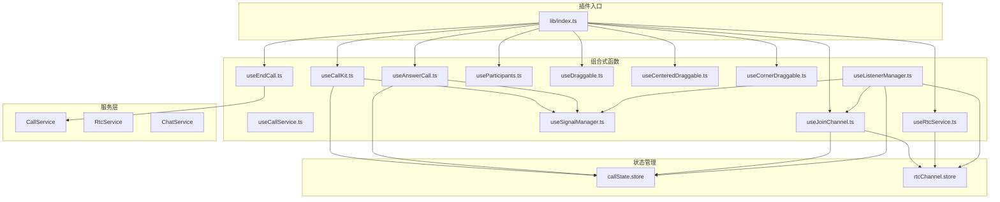
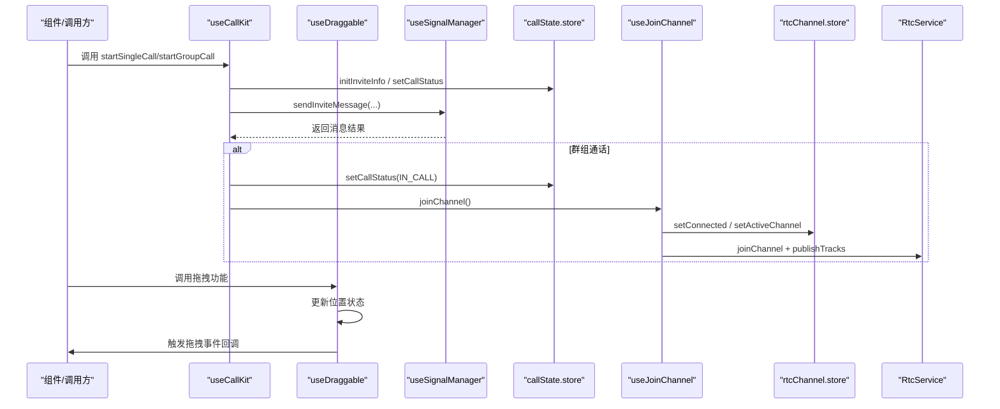
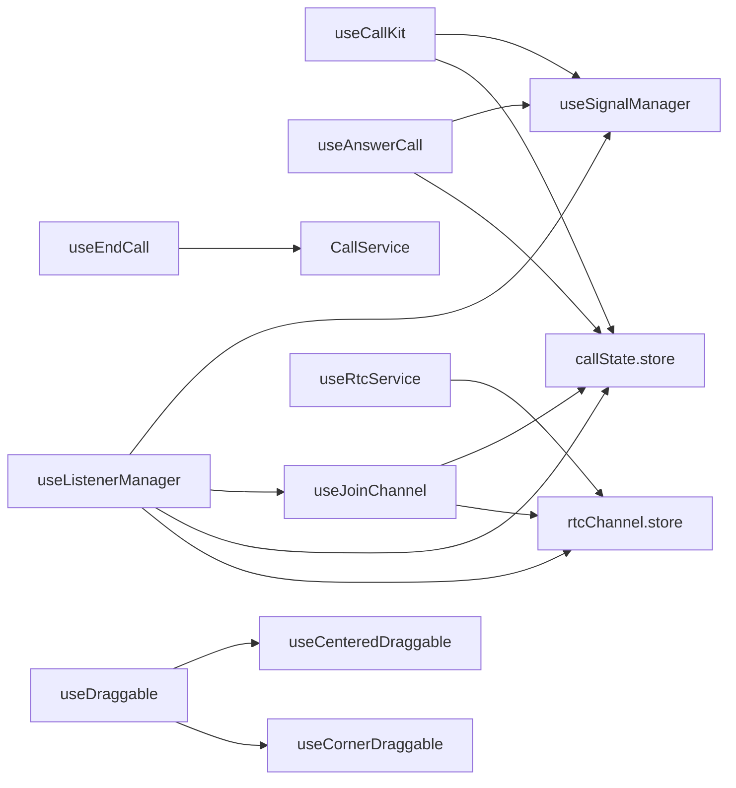

# 组合式 API

<cite>
**本文档引用的文件**
- [lib/index.ts](file://lib/index.ts)
- [lib/types.ts](file://lib/types.ts)
- [lib/composables/useCallKit.ts](file://lib/composables/useCallKit.ts)
- [lib/composables/useCallService.ts](file://lib/composables/useCallService.ts)
- [lib/composables/useEndCall.ts](file://lib/composables/useEndCall.ts)
- [lib/composables/useAnswerCall.ts](file://lib/composables/useAnswerCall.ts)
- [lib/composables/useRtcService.ts](file://lib/composables/useRtcService.ts)
- [lib/composables/useJoinChannel.ts](file://lib/composables/useJoinChannel.ts)
- [lib/composables/useParticipants.ts](file://lib/composables/useParticipants.ts)
- [lib/composables/useSignalManager.ts](file://lib/composables/useSignalManager.ts)
- [lib/composables/useListenerManager.ts](file://lib/composables/useListenerManager.ts)
- [lib/composables/useDraggable.ts](file://lib/composables/useDraggable.ts)
- [lib/types/callstate.types.ts](file://lib/types/callstate.types.ts)
- [lib/components/EasemobChatCallKitProvider.vue](file://lib/components/EasemobChatCallKitProvider.vue)
- [README.md](file://README.md)
- [USAGE.md](file://USAGE.md)
- [callkit/docs/CALLKIT_DRAG_EXAMPLES.md](file://callkit/docs/CALLKIT_DRAG_EXAMPLES.md)
</cite>

## 更新摘要
**变更内容**
- 新增 Vue 版本拖拽组合式 API：useDraggable、useCenteredDraggable、useCornerDraggable
- 更新核心组件章节以包含新的拖拽功能
- 更新架构总览以反映拖拽功能的集成
- 新增拖拽功能的详细使用说明和最佳实践

## 目录
1. [简介](#简介)
2. [项目结构](#项目结构)
3. [核心组件](#核心组件)
4. [架构总览](#架构总览)
5. [详细组件分析](#详细组件分析)
6. [依赖关系分析](#依赖关系分析)
7. [性能考虑](#性能考虑)
8. [故障排查指南](#故障排查指南)
9. [结论](#结论)
10. [附录](#附录)

## 简介
本文件为 easemob-chat-callkit-vue3 组合式函数 API 参考文档，聚焦于 useCallKit、useCallService、useEndCall、useAnswerCall、useRtcService、useJoinChannel、useDraggable、useCenteredDraggable、useCornerDraggable 等组合式函数的接口定义、参数与返回值、调用时机、状态管理与副作用处理，并提供实际使用示例与错误处理策略。文档同时说明这些组合式函数与组件的集成方式与最佳实践。

## 项目结构
该库采用"插件 + 组合式函数 + Store + 服务层"的分层设计：
- 插件入口导出组件、组合式函数与服务，统一注册与导出
- 组合式函数封装业务流程，协调 Store 与服务层
- Store（Pinia）集中管理通话状态与 RTC 状态
- 服务层负责与环信 IM 与声网 RTC 的交互
- **新增**：拖拽组合式函数提供通用的窗口拖拽功能



**图表来源**
- [lib/index.ts](file://lib/index.ts#L1-L64)
- [lib/composables/useCallKit.ts](file://lib/composables/useCallKit.ts#L1-L123)
- [lib/composables/useEndCall.ts](file://lib/composables/useEndCall.ts#L1-L131)
- [lib/composables/useAnswerCall.ts](file://lib/composables/useAnswerCall.ts#L1-L168)
- [lib/composables/useRtcService.ts](file://lib/composables/useRtcService.ts#L1-L192)
- [lib/composables/useJoinChannel.ts](file://lib/composables/useJoinChannel.ts#L1-L185)
- [lib/composables/useDraggable.ts](file://lib/composables/useDraggable.ts#L1-L320)
- [lib/composables/useSignalManager.ts](file://lib/composables/useSignalManager.ts#L1-L354)
- [lib/composables/useListenerManager.ts](file://lib/composables/useListenerManager.ts#L1-L684)

**章节来源**
- [lib/index.ts](file://lib/index.ts#L1-L64)
- [README.md](file://README.md#L1-L181)

## 核心组件
本节概述本次文档关注的组合式函数及其职责边界与返回类型。

- useCallKit
  - 职责：发起单人/群组通话邀请；初始化邀请信息；发送邀请消息；在群组场景下提前加入 RTC 频道
  - 返回类型：UseCallKitReturn
  - 关键方法：
    - startSingleCall(targetId, type, msg): Promise<void>
    - startGroupCall(groupId, members, type, msg, groupName?, groupAvatar?): Promise<void>

- useCallService
  - 职责：提供类型安全的通话操作接口；管理通话状态生命周期；封装 CallService 的调用（注释提示实际方法可能不完全对应）
  - 返回类型：UseCallServiceReturn
  - 关键方法：
    - startCall(targetId, callType): Promise<string>
    - acceptCall(callId): Promise<void>
    - rejectCall(callId): Promise<void>
    - endCall(callId?): Promise<void>
    - toggleAudio(enabled): Promise<void>
    - toggleVideo(enabled): Promise<void>
    - toggleSpeaker(enabled): Promise<void>
    - addParticipant(callId, userId): Promise<void>
    - removeParticipant(callId, userId): Promise<void>
    - onCallStarted/onCallConnected/onCallEnded/onCallFailed/onIncomingCall/onParticipantJoined/onParticipantLeft(cb): void
    - callService: CallService

- useEndCall
  - 职责：统一挂断/取消/异常结束等场景；检查当前可否挂断/取消
  - 返回类型：UseEndCallReturn
  - 关键方法：
    - hangup(reason?): Promise<void>
    - hangupCall(): Promise<void>
    - cancelCall(): Promise<void>
    - handleRemoteCancel(): Promise<void>
    - handleRemoteRefuse(): Promise<void>
    - handleAbnormalEnd(): Promise<void>
    - canHangup(): boolean
    - canCancel(): boolean

- useAnswerCall
  - 职责：被叫方接受/拒绝/忙碌拒绝通话；发送 answerCall 信令；更新状态
  - 返回类型：UseAnswerCallReturn
  - 关键方法：
    - acceptCall(): Promise<void>
    - rejectCall(): Promise<void>
    - busyRejectCall(): Promise<void>

- useRtcService
  - 职责：封装 RTC 音视频控制与流管理；提供响应式状态与设备切换能力
  - 返回类型：无显式接口定义（返回值见下方"返回值"小节）
  - 关键方法：
    - toggleVideo(enabled?): Promise<boolean>
    - toggleAudio(enabled?): Promise<boolean>
    - switchCamera(deviceId?): Promise<boolean>
    - switchMicrophone(deviceId?): Promise<boolean>
    - getLocalStream(): MediaStream | null
    - getRemoteStream(userId): MediaStream | undefined
    - addRemoteStream(userId, stream): void
    - removeRemoteStream(userId): void
    - setLocalStream(stream): void
    - reset(): void

- useJoinChannel
  - 职责：获取 RTC Token；加入频道；创建并发布音视频轨道；更新 RTC 状态
  - 返回类型：UseJoinChannelReturn
  - 关键方法：
    - joinChannel(): Promise<void>
    - isJoining: boolean

- useParticipants
  - 职责：自动生成并过滤群组参与者列表；自动处理离开用户；标记加入状态
  - 返回类型：无显式接口定义（返回值见下方"返回值"小节）
  - 关键方法：
    - participants: ComputedRef<Participant[]>

- useSignalManager
  - 职责：统一封装所有通话信令发送（邀请、应答、取消、离开、忙碌等）
  - 返回类型：UseSignalManagerReturn
  - 关键方法：
    - sendInviteMessage(targetId|targetIds, chatType, message, groupId?): Promise<Chat.SendMsgResult>
    - sendAnswerMessage(targetId, payload, result?): Promise<Chat.SendMsgResult>
    - sendCancelMessage(to, chatType, receiverList?): Promise<Chat.SendMsgResult>
    - sendLeaveMessage(to, chatType, receiverList?): Promise<Chat.SendMsgResult>
    - sendBusyAnswerMessage(targetId, payload): Promise<Chat.SendMsgResult>
    - sendAlertMessage(targetId): Promise<Chat.SendMsgResult>
    - sendConfirmRingMessage(targetId, payload): Promise<Chat.SendMsgResult>
    - sendConfirmCalleeMessage(targetId, payload): Promise<Chat.SendMsgResult>

- useListenerManager
  - 职责：全局监听文本消息与信令消息；驱动状态机流转；触发加入频道等副作用
  - 返回类型：ListenerManagerReturn
  - 关键方法：
    - mountTextMessageListener(): void
    - mountSignalListener(): void

- **新增** useDraggable
  - 职责：提供通用的窗口拖拽功能，支持居中定位、角落定位和自定义定位
  - 返回类型：DraggableReturn
  - 关键方法：
    - elementRef: Ref<HTMLElement | null>
    - isDragging: Ref<boolean>
    - hasDragged: Ref<boolean>
    - position: Ref<{x: number, y: number}>
    - style: ComputedRef<CSSProperties>
    - startDrag(e: MouseEvent | TouchEvent): void
    - stopDrag(): void

- **新增** useCenteredDraggable
  - 职责：提供居中定位的拖拽功能，适用于需要初始居中的弹窗类组件
  - 返回类型：DraggableReturn
  - 关键方法：继承 useDraggable 的所有方法

- **新增** useCornerDraggable
  - 职责：提供角落定位的拖拽功能，适用于悬浮窗、通知等组件
  - 返回类型：DraggableReturn
  - 关键方法：继承 useDraggable 的所有方法

**章节来源**
- [lib/types.ts](file://lib/types.ts#L51-L90)
- [lib/composables/useCallKit.ts](file://lib/composables/useCallKit.ts#L1-L123)
- [lib/composables/useCallService.ts](file://lib/composables/useCallService.ts#L47-L80)
- [lib/composables/useEndCall.ts](file://lib/composables/useEndCall.ts#L1-L131)
- [lib/composables/useAnswerCall.ts](file://lib/composables/useAnswerCall.ts#L7-L14)
- [lib/composables/useRtcService.ts](file://lib/composables/useRtcService.ts#L52-L192)
- [lib/composables/useJoinChannel.ts](file://lib/composables/useJoinChannel.ts#L18-L21)
- [lib/composables/useSignalManager.ts](file://lib/composables/useSignalManager.ts#L7-L42)
- [lib/composables/useListenerManager.ts](file://lib/composables/useListenerManager.ts#L28-L31)
- [lib/composables/useDraggable.ts](file://lib/composables/useDraggable.ts#L1-L320)

## 架构总览
组合式函数围绕"状态（Store）+ 服务（Service）+ 信令（Signal）+ RTC（Agora）+ 拖拽（Draggable）"协同工作，形成如下调用链路：



**图表来源**
- [lib/composables/useCallKit.ts](file://lib/composables/useCallKit.ts#L13-L121)
- [lib/composables/useSignalManager.ts](file://lib/composables/useSignalManager.ts#L73-L102)
- [lib/composables/useJoinChannel.ts](file://lib/composables/useJoinChannel.ts#L76-L183)
- [lib/composables/useDraggable.ts](file://lib/composables/useDraggable.ts#L189-L260)

## 详细组件分析

### useCallKit 接口参考
- 函数签名
  - startSingleCall(targetId: string, type: "audio" | "video", msg: string): Promise<void>
  - startGroupCall(groupId: string, members: string[], type: "audio" | "video", msg: string, groupName?: string, groupAvatar?: string): Promise<void>
- 参数说明
  - targetId：单人通话目标用户 ID
  - groupId：群组通话群组 ID
  - members：群组通话受邀成员列表
  - type：通话类型，"audio" 或 "video"
  - msg：邀请消息内容
  - groupName/groupAvatar：群组名称与头像（可选）
- 返回值
  - Promise<void>，内部通过信令与状态管理完成流程
- 调用时机与副作用
  - 单人通话：初始化邀请信息，发送邀请消息
  - 群组通话：初始化邀请信息，发送邀请消息后，立即设置为 IN_CALL 并加入 RTC 频道
- 错误处理策略
  - ChatClient 未初始化时记录警告并返回
  - 群组成员为空时记录警告并返回
  - 异常通过日志记录并抛出，便于上层捕获
- 最佳实践
  - 确保在 Provider 内使用，保证 ChatClient 已注入
  - 群组通话建议在调用前校验成员列表非空
  - 成功发送邀请后，结合状态管理与 UI 提示用户

**章节来源**
- [lib/composables/useCallKit.ts](file://lib/composables/useCallKit.ts#L10-L122)
- [lib/types.ts](file://lib/types.ts#L51-L65)

### useCallService 接口参考
- 函数签名
  - useCallService(callService: CallService): UseCallServiceReturn
- 返回类型 UseCallServiceReturn
  - callState: CallStateType
  - currentCall: Ref<CurrentCallInfo | null>
  - callStatus: Ref<string>
  - isInCall: Ref<boolean>
  - startCall(targetId: string, callType: "audio" | "video"): Promise<string>
  - acceptCall(callId: string): Promise<void>
  - rejectCall(callId: string): Promise<void>
  - endCall(callId?: string): Promise<void>
  - toggleAudio(enabled: boolean): Promise<void>
  - toggleVideo(enabled: boolean): Promise<void>
  - toggleSpeaker(enabled: boolean): Promise<void>
  - addParticipant(callId: string, userId: string): Promise<void>
  - removeParticipant(callId: string, userId: string): Promise<void>
  - onCallStarted(cb): void
  - onCallConnected(cb): void
  - onCallEnded(cb): void
  - onCallFailed(cb): void
  - onIncomingCall(cb): void
  - onParticipantJoined(cb): void
  - onParticipantLeft(cb): void
  - callService: CallService
- 参数与返回值说明
  - 方法均返回 Promise<void> 或 Promise<string>，内部通过 store 更新状态
  - 事件监听方法用于订阅通话生命周期事件
- 调用时机与副作用
  - 生命周期：onMounted/onUnmounted 内部保留初始化/清理逻辑（注释提示不应销毁共享服务实例）
- 错误处理策略
  - 发起/接受/结束通话失败时，记录错误并回滚状态
- 最佳实践
  - 通过 computed 订阅 callStatus/isInCall，驱动 UI 状态
  - 使用事件监听感知通话生命周期变化

**章节来源**
- [lib/composables/useCallService.ts](file://lib/composables/useCallService.ts#L47-L80)
- [lib/composables/useCallService.ts](file://lib/composables/useCallService.ts#L91-L299)

### useEndCall 接口参考
- 函数签名
  - hangup(reason?: HANGUP_REASON): Promise<void>
  - hangupCall(): Promise<void>
  - cancelCall(): Promise<void>
  - handleRemoteCancel(): Promise<void>
  - handleRemoteRefuse(): Promise<void>
  - handleAbnormalEnd(): Promise<void>
  - canHangup(): boolean
  - canCancel(): boolean
- 参数说明
  - reason：挂断原因（HANGUP_REASON 枚举）
- 返回值
  - Promise<void>，内部调用 CallService 执行具体挂断逻辑
- 调用时机与副作用
  - canHangup/canCancel 基于当前状态判断是否允许执行
- 错误处理策略
  - 异常通过日志记录并抛出
- 最佳实践
  - 在 UI 上根据 canHangup/canCancel 控制按钮可用性
  - 不同场景选择对应方法（如取消邀请 vs 正常挂断）

**章节来源**
- [lib/composables/useEndCall.ts](file://lib/composables/useEndCall.ts#L10-L130)
- [lib/types/callstate.types.ts](file://lib/types/callstate.types.ts#L69-L92)

### useAnswerCall 接口参考
- 函数签名
  - acceptCall(): Promise<void>
  - rejectCall(): Promise<void>
  - busyRejectCall(): Promise<void>
- 返回值
  - Promise<void>，内部发送 answerCall 信令并更新状态
- 调用时机与副作用
  - 仅在被叫方 ALERTING 状态下有效；发送信令后更新状态为 ANSWER_CALL
- 错误处理策略
  - 缺少主叫方信息时抛错并记录日志
- 最佳实践
  - 在收到邀请后及时调用，避免超时
  - 拒绝/忙碌拒绝时清理超时计时器并重置状态

**章节来源**
- [lib/composables/useAnswerCall.ts](file://lib/composables/useAnswerCall.ts#L20-L167)
- [lib/types/callstate.types.ts](file://lib/types/callstate.types.ts#L23-L29)

### useRtcService 接口参考
- 函数签名
  - useRtcService(): 返回包含响应式状态与控制方法的对象
- 返回值（节选）
  - localStream, remoteStreams, isVideoEnabled, isAudioEnabled, isConnected, activeChannel
  - toggleVideo(enabled?), toggleAudio(enabled?), switchCamera(deviceId?), switchMicrophone(deviceId?)
  - getLocalStream(), getRemoteStream(userId), addRemoteStream(userId, stream), removeRemoteStream(userId), setLocalStream(stream)
  - reset(): void
- 调用时机与副作用
  - 通过 rtcChannel.store 管理本地/远端流与设备状态
- 错误处理策略
  - 设备切换/状态切换失败时记录错误并回退到当前状态
- 最佳实践
  - 通过 computed 订阅本地/远端流，驱动视频播放
  - 在组件卸载时调用 reset 清理资源

**章节来源**
- [lib/composables/useRtcService.ts](file://lib/composables/useRtcService.ts#L52-L192)

### useJoinChannel 接口参考
- 函数签名
  - useJoinChannel(): { joinChannel(): Promise<void>, isJoining: boolean }
- 返回值
  - joinChannel(): Promise<void>，内部获取 RTC Token、加入频道、创建并发布音视频轨道、更新 RTC 状态
  - isJoining: boolean，防重复加入
- 调用时机与副作用
  - 在 useCallKit 的群组通话场景中由主叫方调用；被叫方在收到 confirmCallee 后由 useListenerManager 触发
- 错误处理策略
  - ChatClient 未初始化、Token 获取失败、加入频道失败均记录错误并返回
- 最佳实践
  - 在加入前检查当前连接状态，避免重复加入
  - 成功加入后启动通话计时

**章节来源**
- [lib/composables/useJoinChannel.ts](file://lib/composables/useJoinChannel.ts#L26-L184)

### useParticipants 接口参考
- 函数签名
  - useParticipants(currentUserId?: string): { participants: ComputedRef<Participant[]> }
- 返回值
  - participants: ComputedRef<Participant[]>，自动过滤离开用户并标注加入状态
- 数据模型 Participant
  - userId, userName, avatar?, isMuted, isInviting, hasJoined
- 调用时机与副作用
  - 基于 callState.store 与 rtcChannel.store 的响应式数据计算
- 最佳实践
  - 用于群组通话 UI 展示参与者列表，自动隐藏已离开用户

**章节来源**
- [lib/composables/useParticipants.ts](file://lib/composables/useParticipants.ts#L19-L119)

### useSignalManager 接口参考
- 函数签名
  - sendInviteMessage(targetId|targetIds, chatType, message, groupId?): Promise<Chat.SendMsgResult>
  - sendAnswerMessage(targetId, payload, result?): Promise<Chat.SendMsgResult>
  - sendCancelMessage(to, chatType, receiverList?): Promise<Chat.SendMsgResult>
  - sendLeaveMessage(to, chatType, receiverList?): Promise<Chat.SendMsgResult>
  - sendBusyAnswerMessage(targetId, payload): Promise<Chat.SendMsgResult>
  - sendAlertMessage(targetId): Promise<Chat.SendMsgResult>
  - sendConfirmRingMessage(targetId, payload): Promise<Chat.SendMsgResult>
  - sendConfirmCalleeMessage(targetId, payload): Promise<Chat.SendMsgResult>
- 返回值
  - Promise<Chat.SendMsgResult>，返回消息发送结果
- 调用时机与副作用
  - 由 useCallKit、useAnswerCall 等在合适时机调用
- 错误处理策略
  - 异常通过日志记录并抛出
- 最佳实践
  - 统一封装信令发送，避免各处重复实现

**章节来源**
- [lib/composables/useSignalManager.ts](file://lib/composables/useSignalManager.ts#L50-L353)

### useListenerManager 接口参考
- 函数签名
  - mountTextMessageListener(): void
  - mountSignalListener(): void
- 调用时机与副作用
  - 在 Provider 内挂载文本消息与信令消息监听器，驱动状态机流转
  - 处理 alert、confirmRing、answerCall、confirmCallee、cancelCall、leaveCall 等信令
  - 在收到 accept 时加入 RTC 频道；在收到 cancel/leave/refuse/busy 时执行挂断或移除成员
- 错误处理策略
  - 监听器挂载失败记录错误
- 最佳实践
  - 在 Provider 挂载完成后调用，确保 ChatClient 已就绪

**章节来源**
- [lib/composables/useListenerManager.ts](file://lib/composables/useListenerManager.ts#L37-L683)

### **新增** useDraggable 接口参考
- 函数签名
  - useDraggable(options: DraggableOptions = {}): DraggableReturn
- 参数说明
  - initialX: number - 初始 X 坐标，默认 0
  - initialY: number - 初始 Y 坐标，默认 0
  - centered: boolean - 是否初始居中（优先级高于 initialX/initialY），默认 false
  - width: number - 元素宽度（用于居中和边界计算），默认 0
  - height: number - 元素高度（用于居中和边界计算），默认 0
  - boundary: boolean - 是否启用边界限制，默认 false
  - boundaryPadding: number - 边界内边距（像素），默认 0
  - onDragStart: () => void - 拖拽开始时回调
  - onDragEnd: () => void - 拖拽结束时回调
- 返回值 DraggableReturn
  - elementRef: Ref<HTMLElement | null> - 元素引用
  - isDragging: Ref<boolean> - 是否正在拖拽
  - hasDragged: Ref<boolean> - 是否发生过拖拽
  - position: Ref<{x: number, y: number}> - 当前位置（左上角坐标）
  - style: ComputedRef<CSSProperties> - 样式对象（用于绑定到元素）
  - startDrag(e: MouseEvent | TouchEvent): void - 开始拖拽事件处理
  - stopDrag(): void - 停止拖拽
- 调用时机与副作用
  - 组件挂载时初始化位置，窗口大小变化时重新计算边界
  - 拖拽过程中禁用文本选择，拖拽结束后恢复
- 错误处理策略
  - 无特殊错误处理，依赖浏览器事件系统
- 最佳实践
  - 使用 position 和 style 绑定到元素，配合 startDrag 事件处理器
  - 启用 boundary 时设置合适的 boundaryPadding
  - 在移动端使用 TouchEvent 时注意 passive 事件处理

**章节来源**
- [lib/composables/useDraggable.ts](file://lib/composables/useDraggable.ts#L78-L260)

### **新增** useCenteredDraggable 接口参考
- 函数签名
  - useCenteredDraggable(elementWidth: number, elementHeight: number, options?: Omit<DraggableOptions, 'centered' | 'width' | 'height'>): DraggableReturn
- 参数说明
  - elementWidth: number - 元素宽度
  - elementHeight: number - 元素高度
  - options: Omit<DraggableOptions, 'centered' | 'width' | 'height'> - 其他 DraggableOptions 选项
- 返回值
  - 继承 useDraggable 的所有返回值，但自动启用 centered: true
- 调用时机与副作用
  - 直接调用 useDraggable({ centered: true, width: elementWidth, height: elementHeight, ...options })
- 错误处理策略
  - 继承 useDraggable 的错误处理机制
- 最佳实践
  - 适用于需要初始居中的弹窗类组件
  - 作为 useDraggable 的便捷包装函数

**章节来源**
- [lib/composables/useDraggable.ts](file://lib/composables/useDraggable.ts#L267-L278)

### **新增** useCornerDraggable 接口参考
- 函数签名
  - useCornerDraggable(corner: 'top-left' | 'top-right' | 'bottom-left' | 'bottom-right', elementWidth: number, elementHeight: number, offset?: number, options?: Omit<DraggableOptions, 'initialX' | 'initialY' | 'centered' | 'width' | 'height'>): DraggableReturn
- 参数说明
  - corner: 'top-left' | 'top-right' | 'bottom-left' | 'bottom-right' - 角落位置
  - elementWidth: number - 元素宽度
  - elementHeight: number - 元素高度
  - offset: number - 距离边缘的偏移量，默认 20
  - options: Omit<DraggableOptions, 'initialX' | 'initialY' | 'centered' | 'width' | 'height'> - 其他 DraggableOptions 选项
- 返回值
  - 继承 useDraggable 的所有返回值，但自动设置初始位置为指定角落
- 调用时机与副作用
  - 根据 corner 计算初始位置，然后调用 useDraggable
- 错误处理策略
  - 继承 useDraggable 的错误处理机制
- 最佳实践
  - 适用于悬浮窗、通知等需要固定在屏幕角落的组件
  - 通过 offset 参数控制距离边缘的间距

**章节来源**
- [lib/composables/useDraggable.ts](file://lib/composables/useDraggable.ts#L284-L317)

## 依赖关系分析
组合式函数之间的依赖关系如下：



**图表来源**
- [lib/composables/useCallKit.ts](file://lib/composables/useCallKit.ts#L1-L123)
- [lib/composables/useAnswerCall.ts](file://lib/composables/useAnswerCall.ts#L1-L168)
- [lib/composables/useEndCall.ts](file://lib/composables/useEndCall.ts#L1-L131)
- [lib/composables/useJoinChannel.ts](file://lib/composables/useJoinChannel.ts#L1-L185)
- [lib/composables/useRtcService.ts](file://lib/composables/useRtcService.ts#L1-L192)
- [lib/composables/useListenerManager.ts](file://lib/composables/useListenerManager.ts#L1-L684)
- [lib/composables/useDraggable.ts](file://lib/composables/useDraggable.ts#L1-L320)

**章节来源**
- [lib/composables/useCallKit.ts](file://lib/composables/useCallKit.ts#L1-L123)
- [lib/composables/useAnswerCall.ts](file://lib/composables/useAnswerCall.ts#L1-L168)
- [lib/composables/useEndCall.ts](file://lib/composables/useEndCall.ts#L1-L131)
- [lib/composables/useJoinChannel.ts](file://lib/composables/useJoinChannel.ts#L1-L185)
- [lib/composables/useRtcService.ts](file://lib/composables/useRtcService.ts#L1-L192)
- [lib/composables/useListenerManager.ts](file://lib/composables/useListenerManager.ts#L1-L684)
- [lib/composables/useDraggable.ts](file://lib/composables/useDraggable.ts#L1-L320)

## 性能考虑
- 防重复调用
  - useJoinChannel 内部维护 isJoining 标志，避免重复加入
- 状态响应式更新
  - 通过 Pinia store 的响应式特性减少不必要的渲染
- 日志与调试
  - 提供 debug 模式与详细日志，便于定位性能瓶颈
- RTC 资源管理
  - 组件卸载时调用 reset 清理本地/远端流与设备状态
- **新增** 拖拽性能优化
  - 拖拽过程中禁用过渡效果，避免视觉延迟
  - 使用 requestAnimationFrame 优化拖拽性能
  - 移动端使用 passive 事件处理提升性能
  - 窗口大小变化时智能重新计算边界

## 故障排查指南
- ChatClient 未初始化
  - 现象：调用组合式函数时记录警告并返回
  - 处理：确保在 EasemobChatCallKitProvider 内使用，并正确注入 chatClient
- Token 获取失败
  - 现象：加入频道失败，记录错误
  - 处理：检查环信 SDK 配置与网络连通性
- 重复加入频道
  - 现象：warn 日志提示已在连接/已连接状态或已在频道中
  - 处理：避免重复调用 joinChannel
- 信令消息异常
  - 现象：发送/接收信令失败
  - 处理：查看日志并确认消息格式与参数正确
- 被叫方多端处理
  - 现象：收到其他设备 confirmCallee 或 answerCall
  - 处理：按日志提示挂断当前通话，避免冲突
- **新增** 拖拽功能问题
  - 现象：拖拽无效或位置异常
  - 处理：检查元素定位方式（position: absolute/fixed），确认 hasDragged 标志正确更新
  - 现象：边界限制不生效
  - 处理：确认 boundary 选项启用且 width/height 正确设置
  - 现象：移动端拖拽卡顿
  - 处理：检查 passive 事件处理配置，确保 touchmove 事件正确处理

**章节来源**
- [lib/composables/useCallKit.ts](file://lib/composables/useCallKit.ts#L22-L25)
- [lib/composables/useJoinChannel.ts](file://lib/composables/useJoinChannel.ts#L84-L103)
- [lib/composables/useListenerManager.ts](file://lib/composables/useListenerManager.ts#L356-L371)
- [lib/composables/useDraggable.ts](file://lib/composables/useDraggable.ts#L108-L128)

## 结论
本文档系统梳理了 easemob-chat-callkit-vue3 的组合式函数 API，覆盖接口定义、参数与返回值、调用时机、状态管理与副作用处理，并提供了实际使用示例与错误处理策略。**新增的拖拽功能**为组件提供了灵活的窗口定位和交互能力，支持居中定位、角落定位和自定义定位等多种场景。遵循本文档的最佳实践，可在复杂通话场景中稳定集成与扩展。

## 附录

### 组合式函数与组件集成方式
- Provider 配置
  - 在根组件中放置 EasemobChatCallKitProvider，注入 chatClient 与初始化配置
  - Provider 内部挂载监听器、初始化 RTC 服务并在卸载时销毁
- 组件使用
  - 单人通话：使用 EasemobChatSingleCall 或通过 useCallKit 发起
  - 多人通话：使用 EasemobChatMultiCall 或通过 useCallKit 发起
  - **新增** 拖拽组件：使用支持拖拽的组件或通过 useDraggable 实现自定义拖拽功能
- 组合式函数使用
  - 在组件 setup 中调用 useCallKit/useAnswerCall/useEndCall/useRtcService/useJoinChannel/useDraggable 等，结合 store 状态与事件监听实现完整通话流程
  - **新增** 拖拽功能使用：通过 useCenteredDraggable 或 useCornerDraggable 快速实现常见布局需求

### **新增** 拖拽功能使用示例
- 基础拖拽使用
```typescript
import { useDraggable } from './useDraggable'

const { elementRef, style, startDrag } = useDraggable({
  centered: true,
  width: 360,
  height: 640,
  boundary: true
})
```

- 居中定位拖拽
```typescript
import { useCenteredDraggable } from './useDraggable'

const { elementRef, style, startDrag } = useCenteredDraggable(400, 300)
```

- 角落定位拖拽
```typescript
import { useCornerDraggable } from './useDraggable'

const { elementRef, style, startDrag } = useCornerDraggable('top-right', 300, 200, 30)
```

**章节来源**
- [lib/components/EasemobChatCallKitProvider.vue](file://lib/components/EasemobChatCallKitProvider.vue#L62-L113)
- [USAGE.md](file://USAGE.md#L32-L161)
- [callkit/docs/CALLKIT_DRAG_EXAMPLES.md](file://callkit/docs/CALLKIT_DRAG_EXAMPLES.md#L1-L257)