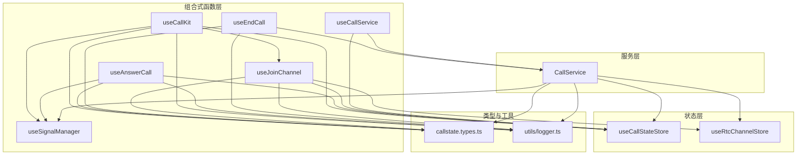
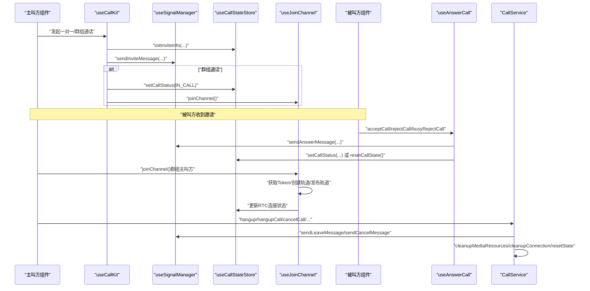
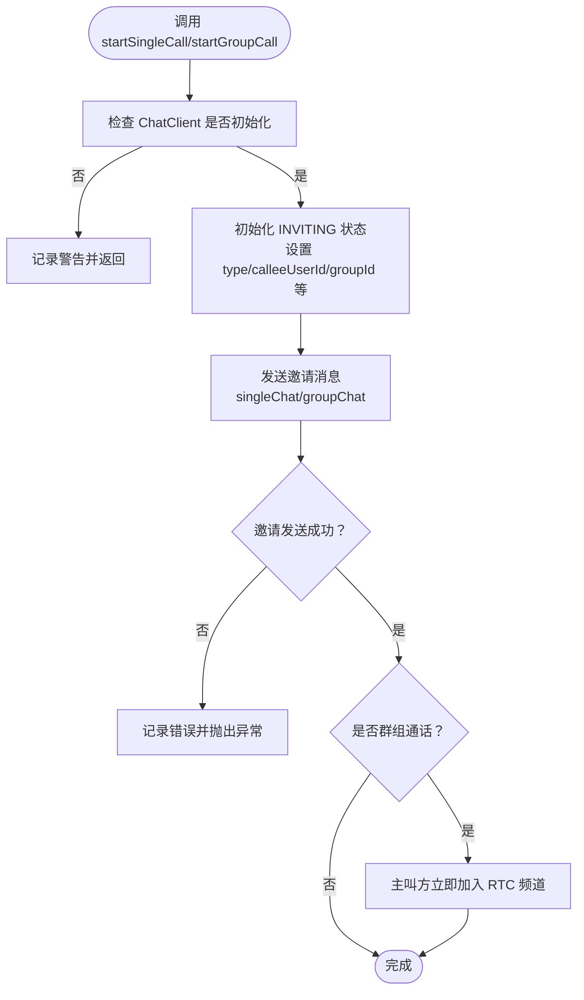
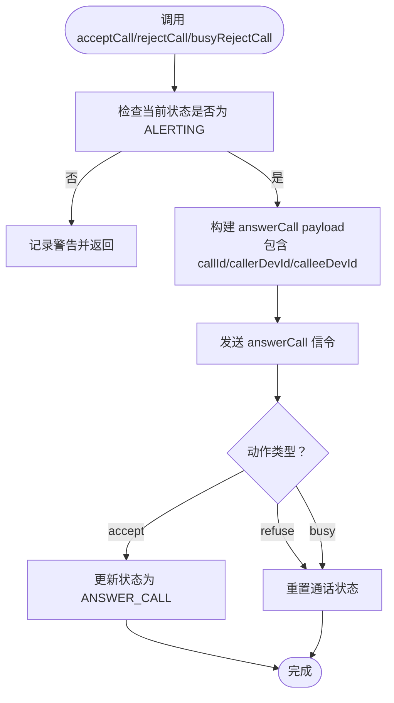
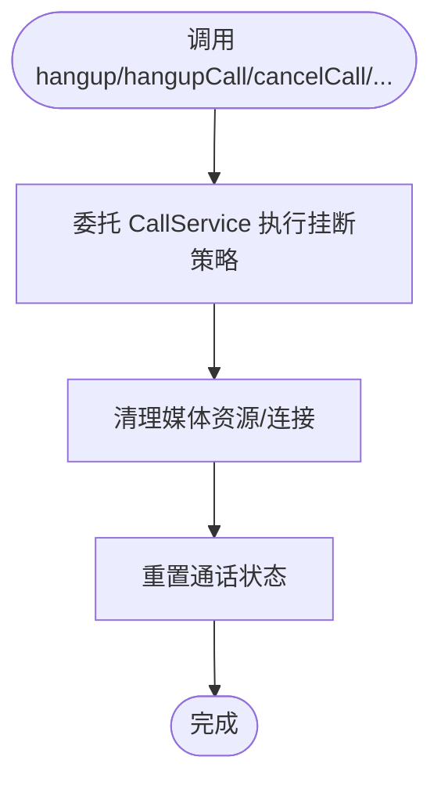
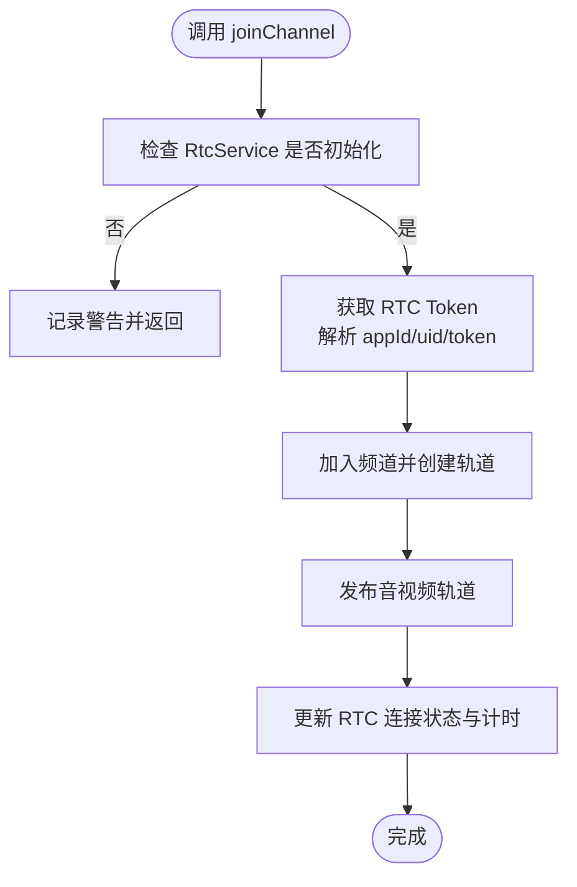
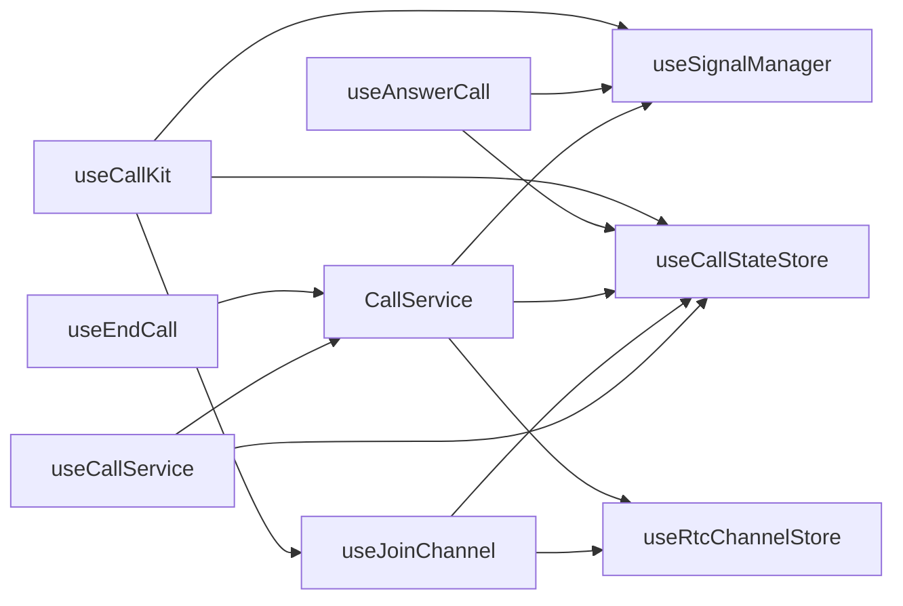

# 通话控制 API

<cite>
**本文档引用的文件**
- [lib/composables/useCallKit.ts](file://lib/composables/useCallKit.ts)
- [lib/composables/useCallService.ts](file://lib/composables/useCallService.ts)
- [lib/composables/useEndCall.ts](file://lib/composables/useEndCall.ts)
- [lib/composables/useAnswerCall.ts](file://lib/composables/useAnswerCall.ts)
- [lib/composables/useJoinChannel.ts](file://lib/composables/useJoinChannel.ts)
- [lib/composables/useSignalManager.ts](file://lib/composables/useSignalManager.ts)
- [lib/services/CallService.ts](file://lib/services/CallService.ts)
- [lib/store/callState.ts](file://lib/store/callState.ts)
- [lib/store/types.ts](file://lib/store/types.ts)
- [lib/types/callstate.types.ts](file://lib/types/callstate.types.ts)
- [lib/utils/index.ts](file://lib/utils/index.ts)
</cite>

## 目录
1. [简介](#简介)
2. [项目结构](#项目结构)
3. [核心组件](#核心组件)
4. [架构总览](#架构总览)
5. [详细组件分析](#详细组件分析)
6. [依赖关系分析](#依赖关系分析)
7. [性能考虑](#性能考虑)
8. [故障排除指南](#故障排除指南)
9. [结论](#结论)
10. [附录](#附录)

## 简介
本文件系统性梳理通话控制组合式函数的完整接口与实现，重点覆盖以下核心能力：
- useCallKit：发起一对一与群组通话的入口，负责初始化邀请状态与发送邀请信令，并在群组通话中协助加入 RTC 频道。
- useAnswerCall：被叫方接听、拒绝、忙碌拒绝的应答流程，负责发送 answerCall 信令并维护状态机。
- useEndCall：统一的挂断入口，支持多种挂断原因（普通挂断、取消、远程取消、远程拒绝、异常结束）。
- useCallService：对外暴露的通话服务组合式 API，提供状态、操作与事件监听等接口（当前实现为占位，建议结合实际服务层完善）。
- useJoinChannel：封装加入 RTC 频道的逻辑，负责获取 Token、创建并发布音视频轨道、更新频道状态。
- useSignalManager：集中管理所有通话信令的发送，包括邀请、应答、取消、离开、确认等。

同时，文档详细说明一对一通话与群组通话的差异实现、通话状态转换流程、函数间的协作关系与依赖关系，并提供最佳实践与常见问题排查建议。

## 项目结构
该模块围绕“组合式函数 + 服务层 + Pinia Store”的分层设计组织：
- 组合式函数层：useCallKit、useAnswerCall、useEndCall、useCallService、useJoinChannel、useSignalManager。
- 服务层：CallService 提供挂断策略与资源清理。
- 状态层：callState.ts 定义通话状态与计算属性；rtcChannel.ts 管理 RTC 频道状态。
- 类型层：callstate.types.ts 定义状态码、通话类型、挂断原因等枚举与接口。
- 工具层：logger、callUtils 等辅助工具。

图表来源
- [lib/composables/useCallKit.ts](file://lib/composables/useCallKit.ts#L1-L123)
- [lib/composables/useAnswerCall.ts](file://lib/composables/useAnswerCall.ts#L1-L168)
- [lib/composables/useEndCall.ts](file://lib/composables/useEndCall.ts#L1-L131)
- [lib/composables/useCallService.ts](file://lib/composables/useCallService.ts#L1-L299)
- [lib/composables/useJoinChannel.ts](file://lib/composables/useJoinChannel.ts#L1-L185)
- [lib/composables/useSignalManager.ts](file://lib/composables/useSignalManager.ts#L1-L354)
- [lib/services/CallService.ts](file://lib/services/CallService.ts#L1-L298)
- [lib/store/callState.ts](file://lib/store/callState.ts#L1-L263)
- [lib/types/callstate.types.ts](file://lib/types/callstate.types.ts#L1-L93)

章节来源
- [lib/composables/useCallKit.ts](file://lib/composables/useCallKit.ts#L1-L123)
- [lib/composables/useAnswerCall.ts](file://lib/composables/useAnswerCall.ts#L1-L168)
- [lib/composables/useEndCall.ts](file://lib/composables/useEndCall.ts#L1-L131)
- [lib/composables/useCallService.ts](file://lib/composables/useCallService.ts#L1-L299)
- [lib/composables/useJoinChannel.ts](file://lib/composables/useJoinChannel.ts#L1-L185)
- [lib/composables/useSignalManager.ts](file://lib/composables/useSignalManager.ts#L1-L354)
- [lib/services/CallService.ts](file://lib/services/CallService.ts#L1-L298)
- [lib/store/callState.ts](file://lib/store/callState.ts#L1-L263)
- [lib/types/callstate.types.ts](file://lib/types/callstate.types.ts#L1-L93)

## 核心组件
本节对四个核心组合式函数进行接口与行为说明，涵盖参数、返回值、调用时机与典型用法。

- useCallKit
  - 功能：发起一对一与群组通话。
  - 一对一通话
    - 参数：targetId（被叫用户 ID）、type（"audio"|"video"）、msg（邀请文本消息）。
    - 返回：Promise<void>。
    - 调用时机：主叫方准备发起通话时。
    - 行为要点：初始化 INVITING 状态，发送 singleChat 邀请消息；随后可配合加入频道与媒体发布。
  - 群组通话
    - 参数：groupId（群组 ID）、members（被邀请成员列表）、type（"audio"|"video"）、msg（邀请文本消息）、groupName/groupAvatar（可选）。
    - 返回：Promise<void>。
    - 调用时机：主叫方准备发起群组通话时。
    - 行为要点：初始化 INVITING 状态，发送 groupChat 邀请消息；主叫方立即进入 IN_CALL 并加入 RTC 频道。
  - 依赖：useSignalManager、useCallStateStore、useJoinChannel。

- useAnswerCall
  - 功能：被叫方接听、拒绝、忙碌拒绝通话。
  - 接受通话 acceptCall
    - 参数：无。
    - 返回：Promise<void>。
    - 调用时机：被叫方收到邀请且状态为 ALERTING 时。
    - 行为要点：发送 answerCall 信令（result=accept），更新状态为 ANSWER_CALL；预留加入 RTC 频道逻辑。
  - 拒绝通话 rejectCall
    - 参数：无。
    - 返回：Promise<void>。
    - 调用时机：被叫方拒绝。
    - 行为要点：发送 answerCall 信令（result=refuse），重置通话状态。
  - 忙碌拒绝 busyRejectCall
    - 参数：无。
    - 返回：Promise<void>。
    - 调用时机：被叫方正忙。
    - 行为要点：发送 answerCall 信令（result=busy），重置通话状态。
  - 依赖：useSignalManager、useCallStateStore。

- useEndCall
  - 功能：统一挂断入口，支持多种挂断原因。
  - 方法：
    - hangup(reason)：按原因挂断。
    - hangupCall()：普通挂断。
    - cancelCall()：取消邀请。
    - handleRemoteCancel()/handleRemoteRefuse()/handleAbnormalEnd()：处理远程取消、远程拒绝、异常结束。
  - 返回：Promise<void>。
  - 调用时机：任意需要结束通话的时刻。
  - 行为要点：委托 CallService 执行挂断策略、清理媒体资源与连接、重置状态。
  - 依赖：CallService、useCallStateStore。

- useCallService
  - 功能：对外暴露的通话服务组合式 API（当前为占位实现）。
  - 状态与操作：
    - callState/currentCall/callStatus/isInCall：只读状态。
    - startCall/acceptCall/rejectCall/endCall：通话生命周期操作。
    - toggleAudio/toggleVideo/toggleSpeaker：媒体开关。
    - addParticipant/removeParticipant：参与者管理。
    - onCallStarted/onCallConnected/onCallEnded/onCallFailed/onIncomingCall/onParticipantJoined/onParticipantLeft：事件监听。
  - 返回：UseCallServiceReturn。
  - 调用时机：组件挂载后订阅状态与事件。
  - 依赖：useCallStateStore、CallService（建议完善真实服务层对接）。

章节来源
- [lib/composables/useCallKit.ts](file://lib/composables/useCallKit.ts#L1-L123)
- [lib/composables/useAnswerCall.ts](file://lib/composables/useAnswerCall.ts#L1-L168)
- [lib/composables/useEndCall.ts](file://lib/composables/useEndCall.ts#L1-L131)
- [lib/composables/useCallService.ts](file://lib/composables/useCallService.ts#L1-L299)

## 架构总览
通话控制的整体流程围绕“信令 + 状态 + 服务 + RTC”协同工作：
- 发起阶段：useCallKit 初始化 INVITING 状态并发送邀请信令；群组通话中主叫方立即进入 IN_CALL 并加入 RTC 频道。
- 应答阶段：被叫方通过 useAnswerCall 发送 answerCall 信令，更新状态并准备加入频道。
- 进行阶段：useJoinChannel 获取 Token、创建并发布音视频轨道，更新 RTC 连接状态与计时。
- 结束阶段：useEndCall 委托 CallService 执行挂断策略，清理媒体与连接，重置状态。

图表来源
- [lib/composables/useCallKit.ts](file://lib/composables/useCallKit.ts#L1-L123)
- [lib/composables/useAnswerCall.ts](file://lib/composables/useAnswerCall.ts#L1-L168)
- [lib/composables/useEndCall.ts](file://lib/composables/useEndCall.ts#L1-L131)
- [lib/composables/useJoinChannel.ts](file://lib/composables/useJoinChannel.ts#L1-L185)
- [lib/composables/useSignalManager.ts](file://lib/composables/useSignalManager.ts#L1-L354)
- [lib/services/CallService.ts](file://lib/services/CallService.ts#L1-L298)

## 详细组件分析

### useCallKit：发起通话
- 接口定义
  - startSingleCall(targetId: string, type: "audio" | "video", msg: string): Promise<void>
  - startGroupCall(groupId: string, members: string[], type: "audio" | "video", msg: string, groupName?: string, groupAvatar?: string): Promise<void>
- 参数与返回
  - 一对一：targetId、type、msg；返回 Promise<void>。
  - 群组：groupId、members、type、msg、groupName、groupAvatar；返回 Promise<void>。
- 调用时机
  - 主叫方准备发起通话时。
- 实现要点
  - 初始化 INVITING 状态（包含通话类型、被叫/群组信息、随机 callId/channel）。
  - 发送邀请消息（单聊或群聊）。
  - 群组通话中，主叫方立即进入 IN_CALL 并加入 RTC 频道。
- 错误处理
  - ChatClient 未初始化时警告并返回。
  - 群组成员列表为空时警告并返回。
  - 发送邀请失败时记录错误并抛出异常。

图表来源
- [lib/composables/useCallKit.ts](file://lib/composables/useCallKit.ts#L13-L50)
- [lib/composables/useCallKit.ts](file://lib/composables/useCallKit.ts#L58-L117)

章节来源
- [lib/composables/useCallKit.ts](file://lib/composables/useCallKit.ts#L1-L123)

### useAnswerCall：被叫方应答
- 接口定义
  - acceptCall(): Promise<void>
  - rejectCall(): Promise<void>
  - busyRejectCall(): Promise<void>
- 参数与返回
  - 三个方法均无参数，返回 Promise<void>。
- 调用时机
  - 被叫方收到邀请且状态为 ALERTING 时。
- 实现要点
  - 接受：发送 answerCall 信令（result=accept），更新状态为 ANSWER_CALL；预留加入频道逻辑。
  - 拒绝/忙碌拒绝：发送 answerCall 信令（result=refuse/busy），重置通话状态。
  - 清理超时计时器，避免状态不一致。
- 错误处理
  - 无法获取主叫方用户 ID 时抛错。
  - 非 ALERTING 状态时警告并返回。

图表来源
- [lib/composables/useAnswerCall.ts](file://lib/composables/useAnswerCall.ts#L28-L76)
- [lib/composables/useAnswerCall.ts](file://lib/composables/useAnswerCall.ts#L81-L118)
- [lib/composables/useAnswerCall.ts](file://lib/composables/useAnswerCall.ts#L123-L159)

章节来源
- [lib/composables/useAnswerCall.ts](file://lib/composables/useAnswerCall.ts#L1-L168)

### useEndCall：统一挂断入口
- 接口定义
  - hangup(reason: HANGUP_REASON): Promise<void>
  - hangupCall(): Promise<void>
  - cancelCall(): Promise<void>
  - handleRemoteCancel(): Promise<void>
  - handleRemoteRefuse(): Promise<void>
  - handleAbnormalEnd(): Promise<void>
  - canHangup(): boolean
  - canCancel(): boolean
- 参数与返回
  - hangup 接受挂断原因枚举；其余为便捷方法；canHangup/canCancel 返回布尔值。
- 调用时机
  - 任意需要结束通话的时刻。
- 实现要点
  - 委托 CallService 执行挂断策略、清理媒体与连接、重置状态。
  - 提供 canHangup/canCancel 状态检查，便于 UI 控制按钮可用性。
- 错误处理
  - 记录错误并向上抛出，便于上层捕获与提示。

图表来源
- [lib/composables/useEndCall.ts](file://lib/composables/useEndCall.ts#L18-L98)
- [lib/services/CallService.ts](file://lib/services/CallService.ts#L25-L72)

章节来源
- [lib/composables/useEndCall.ts](file://lib/composables/useEndCall.ts#L1-L131)
- [lib/services/CallService.ts](file://lib/services/CallService.ts#L1-L298)

### useCallService：通话服务组合式 API（占位实现）
- 接口定义（占位）
  - 状态：callState/currentCall/callStatus/isInCall。
  - 操作：startCall/acceptCall/rejectCall/endCall。
  - 控制：toggleAudio/toggleVideo/toggleSpeaker。
  - 参与者：addParticipant/removeParticipant。
  - 事件：onCallStarted/onCallConnected/onCallEnded/onCallFailed/onIncomingCall/onParticipantJoined/onParticipantLeft。
- 参数与返回
  - startCall(targetId, type): Promise<string>。
  - 其余多为 Promise<void> 或无参。
- 调用时机
  - 组件挂载后订阅状态与事件。
- 实现要点
  - 当前实现为占位，直接更新 store 状态；建议替换为真实服务层调用。
- 最佳实践
  - 在组件卸载时避免销毁共享的服务实例。
  - 对外暴露原始服务实例以便扩展。

章节来源
- [lib/composables/useCallService.ts](file://lib/composables/useCallService.ts#L1-L299)

### useJoinChannel：加入 RTC 频道
- 接口定义
  - joinChannel(): Promise<void>
  - isJoining: boolean
- 参数与返回
  - 无参数，返回 Promise<void>。
- 调用时机
  - 信令确认后，主/被叫方准备加入频道时。
- 实现要点
  - 获取环信 SDK 的 RTC Token，解析 appId/uid/token。
  - 加入频道、创建并发布音视频轨道、更新 RTC 连接状态与计时。
  - 防重复加入与状态检查。
- 错误处理
  - Token 获取失败、频道加入失败时记录错误并抛出。

图表来源
- [lib/composables/useJoinChannel.ts](file://lib/composables/useJoinChannel.ts#L76-L178)

章节来源
- [lib/composables/useJoinChannel.ts](file://lib/composables/useJoinChannel.ts#L1-L185)

### useSignalManager：信令管理器
- 接口定义
  - sendInviteMessage(targetId, chatType, message, groupId?): Promise<Chat.SendMsgResult>
  - sendAnswerMessage(targetId, payload, result?): Promise<Chat.SendMsgResult>
  - sendCancelMessage(to, chatType, receiverList?): Promise<Chat.SendMsgResult>
  - sendLeaveMessage(to, chatType, receiverList?): Promise<Chat.SendMsgResult>
  - sendBusyAnswerMessage(targetId, payload): Promise<Chat.SendMsgResult>
  - sendAlertMessage(targetId): Promise<Chat.SendMsgResult>
  - sendConfirmRingMessage(targetId, payload): Promise<Chat.SendMsgResult>
  - sendConfirmCalleeMessage(targetId, payload): Promise<Chat.SendMsgResult>
- 参数与返回
  - 多数方法返回 Chat.SendMsgResult；部分方法带 receiverList（群组场景）。
- 调用时机
  - 发起邀请、应答、取消、离开、确认等各阶段。
- 实现要点
  - 统一封装信令发送逻辑，确保 ChatClient 初始化与错误处理。
  - 群组场景支持 receiverList 以定向通知。
- 错误处理
  - 发送失败时记录错误并抛出。

章节来源
- [lib/composables/useSignalManager.ts](file://lib/composables/useSignalManager.ts#L1-L354)

## 依赖关系分析
- 组件耦合与协作
  - useCallKit 依赖 useSignalManager 与 useCallStateStore；群组通话中还依赖 useJoinChannel。
  - useAnswerCall 依赖 useSignalManager 与 useCallStateStore。
  - useEndCall 依赖 CallService 与 useCallStateStore。
  - useJoinChannel 依赖 useRtcChannelStore、useCallStateStore、useChatClientStore。
  - CallService 依赖 useCallStateStore、useRtcChannelStore、useChatClientStore、useSignalManager。
- 状态依赖
  - 所有组件通过 Pinia store 共享通话状态，避免跨组件状态同步问题。
  - 通话状态转换由 store 的 action/gatter 控制，服务层仅做最终重置。
- 外部依赖
  - 环信 Chat SDK：用于发送信令与获取 RTC Token。
  - Agora RTC SDK：用于媒体轨道与频道连接。

图表来源
- [lib/composables/useCallKit.ts](file://lib/composables/useCallKit.ts#L1-L123)
- [lib/composables/useAnswerCall.ts](file://lib/composables/useAnswerCall.ts#L1-L168)
- [lib/composables/useEndCall.ts](file://lib/composables/useEndCall.ts#L1-L131)
- [lib/composables/useJoinChannel.ts](file://lib/composables/useJoinChannel.ts#L1-L185)
- [lib/services/CallService.ts](file://lib/services/CallService.ts#L1-L298)

章节来源
- [lib/composables/useCallKit.ts](file://lib/composables/useCallKit.ts#L1-L123)
- [lib/composables/useAnswerCall.ts](file://lib/composables/useAnswerCall.ts#L1-L168)
- [lib/composables/useEndCall.ts](file://lib/composables/useEndCall.ts#L1-L131)
- [lib/composables/useJoinChannel.ts](file://lib/composables/useJoinChannel.ts#L1-L185)
- [lib/services/CallService.ts](file://lib/services/CallService.ts#L1-L298)

## 性能考虑
- 避免重复加入频道：加入前检查连接状态与 store 标志，防止重复调用。
- 延迟初始化：CallService 中延迟获取 store 实例，确保 Pinia 激活后再使用。
- 资源清理：挂断时优先清理媒体轨道与连接，再重置状态，减少资源泄漏风险。
- 状态一致性：在状态转换的关键节点（如从 IDLE 切换到非 IDLE）清空 leftUsers，避免 UI 显示异常。
- 日志与可观测性：统一使用 logger 记录关键事件，便于定位问题。

## 故障排除指南
- ChatClient 未初始化
  - 现象：调用组合式函数时报错或警告。
  - 处理：确保在 Provider 包裹下使用，并在登录后初始化 ChatClient。
  - 参考路径：[lib/composables/useCallKit.ts](file://lib/composables/useCallKit.ts#L22-L25)，[lib/composables/useAnswerCall.ts](file://lib/composables/useAnswerCall.ts#L33-L36)，[lib/composables/useSignalManager.ts](file://lib/composables/useSignalManager.ts#L57-L64)。
- Token 获取失败
  - 现象：加入频道失败。
  - 处理：检查环信 SDK 配置与网络状态，确认 getRTCToken 返回有效数据。
  - 参考路径：[lib/composables/useJoinChannel.ts](file://lib/composables/useJoinChannel.ts#L39-L71)。
- 群组成员列表为空
  - 现象：群组通话初始化失败。
  - 处理：确保传入非空成员列表。
  - 参考路径：[lib/composables/useCallKit.ts](file://lib/composables/useCallKit.ts#L68-L71)。
- 非 ALERTING 状态接受通话
  - 现象：acceptCall 不生效。
  - 处理：确认状态机流转正确，避免在非 ALERTING 状态调用。
  - 参考路径：[lib/composables/useAnswerCall.ts](file://lib/composables/useAnswerCall.ts#L38-L43)。
- 挂断后资源未释放
  - 现象：媒体仍占用或频道未退出。
  - 处理：确保调用 useEndCall 并等待 CallService 清理完成。
  - 参考路径：[lib/services/CallService.ts](file://lib/services/CallService.ts#L194-L257)。

章节来源
- [lib/composables/useCallKit.ts](file://lib/composables/useCallKit.ts#L22-L25)
- [lib/composables/useAnswerCall.ts](file://lib/composables/useAnswerCall.ts#L33-L43)
- [lib/composables/useJoinChannel.ts](file://lib/composables/useJoinChannel.ts#L39-L71)
- [lib/services/CallService.ts](file://lib/services/CallService.ts#L194-L257)

## 结论
本通话控制 API 通过组合式函数将“发起、应答、挂断、加入频道、信令发送”等能力解耦并标准化，配合 Pinia store 实现状态共享与一致性管理。一对一与群组通话在信令与频道接入上存在差异，但整体状态机与错误处理策略保持一致。建议在生产环境中：
- 完善 useCallService 的真实服务层对接。
- 在 UI 层结合 canHangup/canCancel 等状态检查控制按钮可用性。
- 严格遵循状态机流转，避免跨状态调用导致的异常。

## 附录
- 通话状态与类型定义参考：[lib/types/callstate.types.ts](file://lib/types/callstate.types.ts#L1-L93)
- 通话状态存储与计算属性：[lib/store/callState.ts](file://lib/store/callState.ts#L1-L263)
- 通话状态与参与者类型：[lib/store/types.ts](file://lib/store/types.ts#L1-L86)
- 工具函数入口：[lib/utils/index.ts](file://lib/utils/index.ts#L1-L3)