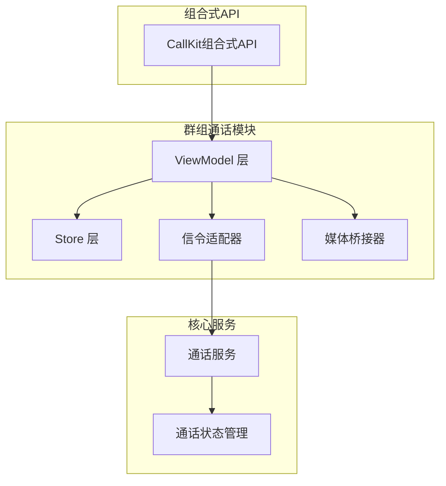
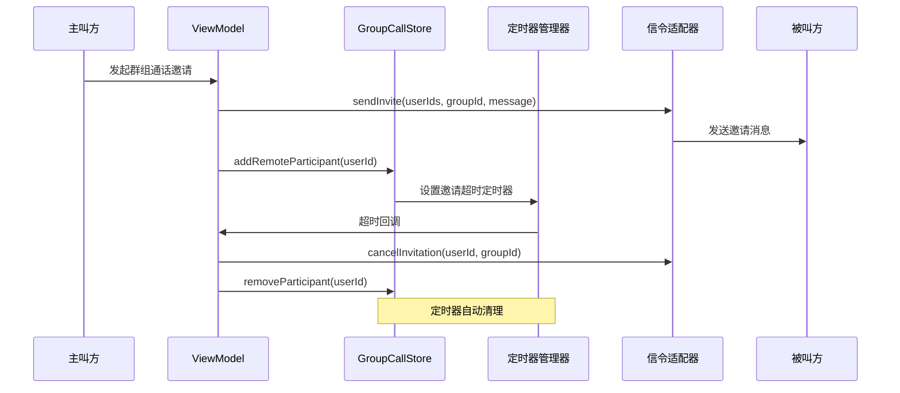
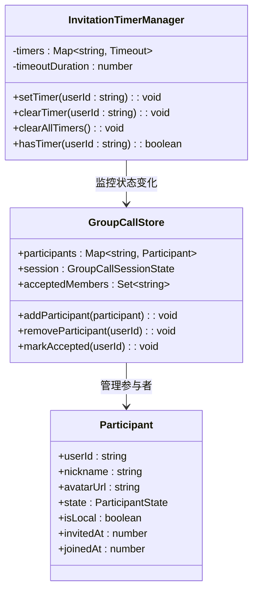
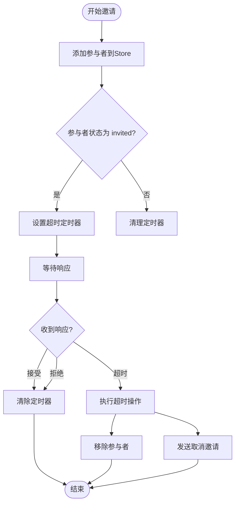
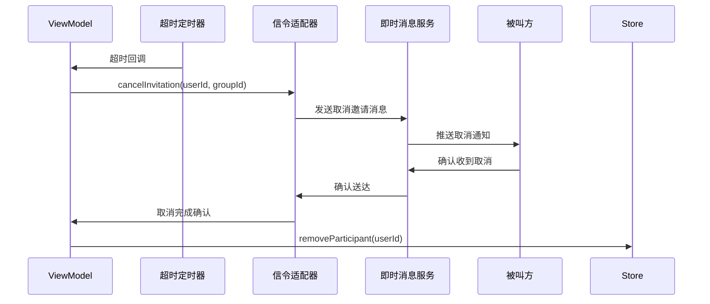
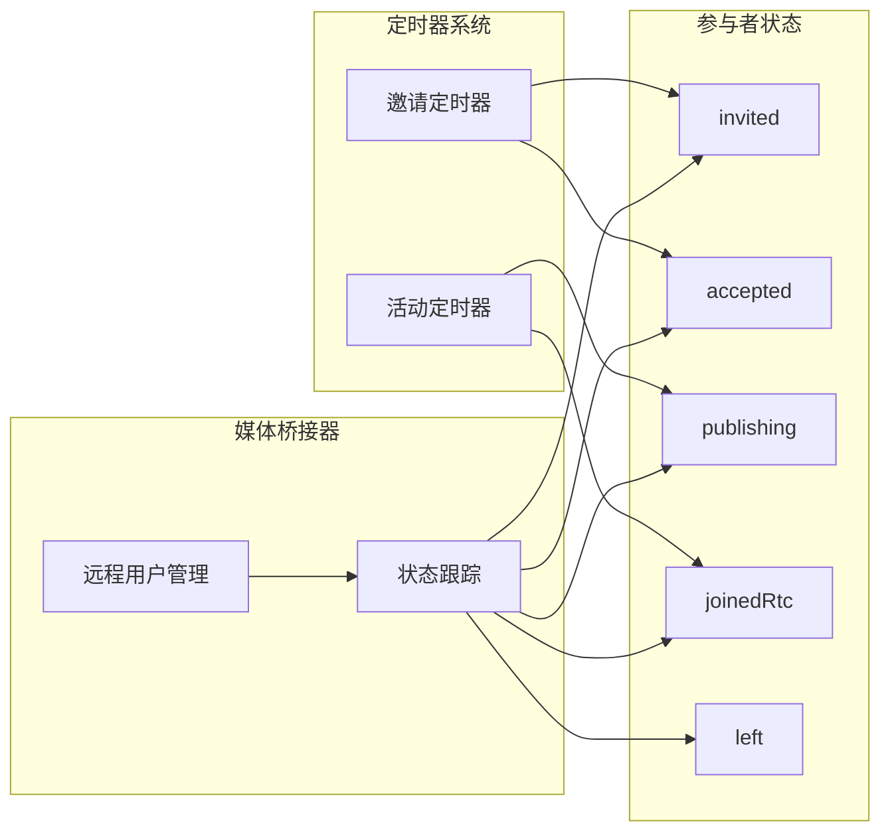
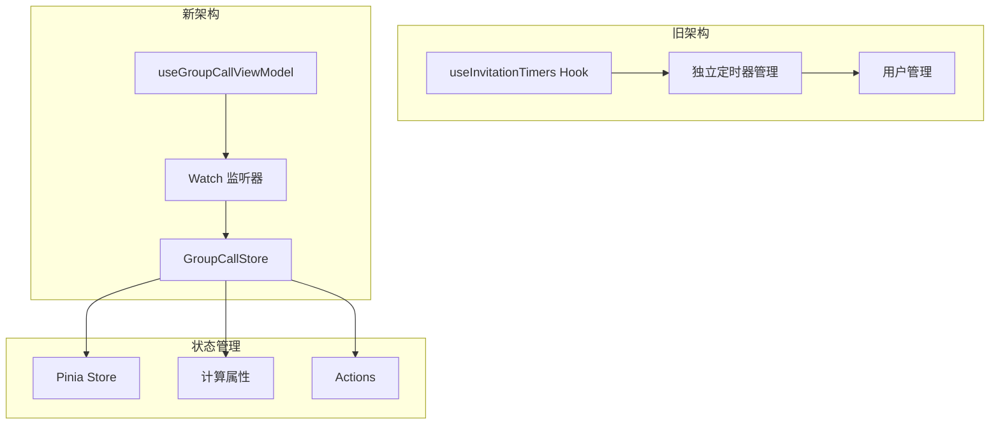
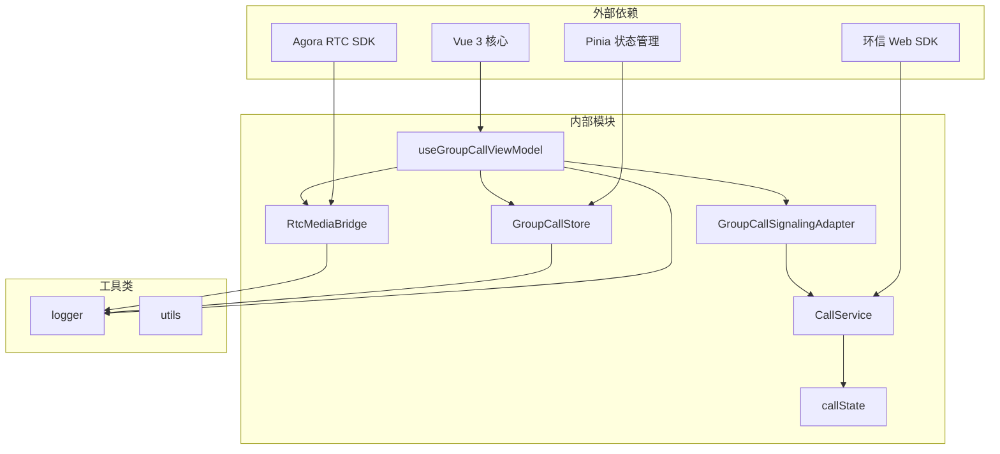

# 群组通话邀请计时器

<cite>
**本文档引用的文件**
- [useGroupCallViewModel.ts](file://lib/modules/groupCall/viewModel/useGroupCallViewModel.ts)
- [GroupCallStore.ts](file://lib/modules/groupCall/viewModel/GroupCallStore.ts)
- [GroupCallSignalingAdapter.ts](file://lib/modules/groupCall/signaling/GroupCallSignalingAdapter.ts)
- [RtcMediaBridge.ts](file://lib/modules/groupCall/media/RtcMediaBridge.ts)
- [callState.ts](file://lib/store/callState.ts)
- [CallService.ts](file://lib/services/CallService.ts)
- [useCallKit.ts](file://lib/composables/useCallKit.ts)
- [useInvitationTimers.ts](file://callkit/hooks/useInvitationTimers.ts)
- [types.ts](file://lib/modules/groupCall/types.ts)
</cite>

## 更新摘要
**变更内容**
- 更新：useInvitationTimers.ts 已被新的 GroupCallStore 替代，邀请定时器管理逻辑已集成到新架构的状态管理系统中
- 重构：邀请超时管理从独立的 Hook 迁移到 GroupCallStore 的状态管理中
- 优化：采用 Pinia 状态管理替代分散的定时器逻辑，提升代码组织性和可维护性

## 目录
1. [简介](#简介)
2. [项目结构](#项目结构)
3. [核心组件](#核心组件)
4. [架构概览](#架构概览)
5. [详细组件分析](#详细组件分析)
6. [依赖关系分析](#依赖关系分析)
7. [性能考虑](#性能考虑)
8. [故障排除指南](#故障排除指南)
9. [结论](#结论)

## 简介

本文档深入分析了 Easemob UIKit CallKit Vue3 项目中的群组通话邀请计时器功能。该功能实现了智能的参与者邀请超时管理机制，确保群组通话邀请过程的可靠性和用户体验。

群组通话邀请计时器是一个关键的实时通信功能，它监控每个被邀请参与者的响应状态，并在超时时间内自动处理未响应的参与者。该系统采用多种设计模式和技术实现，包括观察者模式、定时器管理和状态同步机制。

**重要更新**：邀请定时器管理逻辑已从独立的 `useInvitationTimers.ts` Hook 迁移到新的 `GroupCallStore` 状态管理系统中，实现了更高效的集中式状态管理。

## 项目结构

该项目采用模块化架构设计，群组通话功能位于 `lib/modules/groupCall/` 目录下，包含以下核心子模块：

**图表来源**
- [useGroupCallViewModel.ts:51-295](file://lib/modules/groupCall/viewModel/useGroupCallViewModel.ts#L51-L295)
- [GroupCallStore.ts:10-57](file://lib/modules/groupCall/viewModel/GroupCallStore.ts#L10-L57)

**章节来源**
- [useGroupCallViewModel.ts:1-295](file://lib/modules/groupCall/viewModel/useGroupCallViewModel.ts#L1-L295)
- [GroupCallStore.ts:1-223](file://lib/modules/groupCall/viewModel/GroupCallStore.ts#L1-L223)

## 核心组件

群组通话邀请计时器系统由多个相互协作的核心组件构成：

### 1. ViewModel 层
- **useGroupCallViewModel**: 主要的业务逻辑协调器
- **参与者状态管理**: 实时监控和管理参与者状态变化
- **定时器生命周期管理**: 精确控制定时器的创建、更新和清理

### 2. Store 层
- **useGroupCallStore**: 群组通话状态的单一事实源
- **参与者数据结构**: 管理参与者列表、状态映射和UID映射
- **会话状态管理**: 维护通话会话的完整生命周期

### 3. 信令适配器
- **GroupCallSignalingAdapter**: 将群组通话操作转换为现有信令调用
- **邀请管理**: 处理邀请发送、接受和取消逻辑
- **状态同步**: 确保各组件间的状态一致性

**章节来源**
- [useGroupCallViewModel.ts:10-45](file://lib/modules/groupCall/viewModel/useGroupCallViewModel.ts#L10-L45)
- [GroupCallStore.ts:10-76](file://lib/modules/groupCall/viewModel/GroupCallStore.ts#L10-L76)
- [GroupCallSignalingAdapter.ts:13-96](file://lib/modules/groupCall/signaling/GroupCallSignalingAdapter.ts#L13-L96)

## 架构概览

群组通话邀请计时器采用了分层架构设计，确保了良好的关注点分离和可维护性：

**图表来源**
- [useGroupCallViewModel.ts:229-236](file://lib/modules/groupCall/viewModel/useGroupCallViewModel.ts#L229-L236)
- [useGroupCallViewModel.ts:84-91](file://lib/modules/groupCall/viewModel/useGroupCallViewModel.ts#L84-L91)
- [GroupCallSignalingAdapter.ts:83-94](file://lib/modules/groupCall/signaling/GroupCallSignalingAdapter.ts#L83-L94)

## 详细组件分析

### 邀请超时定时器实现

#### 核心数据结构

**图表来源**
- [useGroupCallViewModel.ts:57-72](file://lib/modules/groupCall/viewModel/useGroupCallViewModel.ts#L57-L72)
- [GroupCallStore.ts:59-76](file://lib/modules/groupCall/viewModel/GroupCallStore.ts#L59-L76)

#### 定时器生命周期管理

定时器管理系统实现了精确的生命周期控制：

**图表来源**
- [useGroupCallViewModel.ts:75-106](file://lib/modules/groupCall/viewModel/useGroupCallViewModel.ts#L75-L106)
- [useGroupCallViewModel.ts:84-91](file://lib/modules/groupCall/viewModel/useGroupCallViewModel.ts#L84-L91)

#### 状态监控机制

系统通过深度监听参与者列表变化来实现智能状态管理：

| 状态类型 | 触发条件 | 处理逻辑 |
|---------|---------|---------|
| invited | 新参与者状态变为 invited 且之前不是 invited | 设置超时定时器 |
| accepted | 参与者状态变为 accepted | 清理对应定时器 |
| rejected | 参与者状态变为 rejected | 清理对应定时器 |
| left | 参与者状态变为 left | 清理对应定时器 |
| removed | 参与者从列表中移除 | 清理残留定时器 |

**章节来源**
- [useGroupCallViewModel.ts:74-106](file://lib/modules/groupCall/viewModel/useGroupCallViewModel.ts#L74-L106)
- [useGroupCallViewModel.ts:61-72](file://lib/modules/groupCall/viewModel/useGroupCallViewModel.ts#L61-L72)

### 信令集成

#### 邀请取消流程

**图表来源**
- [useGroupCallViewModel.ts:84-89](file://lib/modules/groupCall/viewModel/useGroupCallViewModel.ts#L84-L89)
- [GroupCallSignalingAdapter.ts:83-94](file://lib/modules/groupCall/signaling/GroupCallSignalingAdapter.ts#L83-L94)

**章节来源**
- [GroupCallSignalingAdapter.ts:83-94](file://lib/modules/groupCall/signaling/GroupCallSignalingAdapter.ts#L83-L94)
- [useGroupCallViewModel.ts:84-89](file://lib/modules/groupCall/viewModel/useGroupCallViewModel.ts#L84-L89)

### 媒体桥接器集成

媒体桥接器与定时器系统的协同工作确保了音视频流的正确管理：

**图表来源**
- [RtcMediaBridge.ts:67-132](file://lib/modules/groupCall/media/RtcMediaBridge.ts#L67-L132)
- [useGroupCallViewModel.ts:84-91](file://lib/modules/groupCall/viewModel/useGroupCallViewModel.ts#L84-L91)

**章节来源**
- [RtcMediaBridge.ts:67-132](file://lib/modules/groupCall/media/RtcMediaBridge.ts#L67-L132)
- [useGroupCallViewModel.ts:84-91](file://lib/modules/groupCall/viewModel/useGroupCallViewModel.ts#L84-L91)

### 独立 Hook 的演进

**重要更新**：虽然独立的 `useInvitationTimers.ts` Hook 仍然存在于 `callkit/hooks/` 目录中，但其功能已被新的架构所替代：

**图表来源**
- [useInvitationTimers.ts:1-70](file://callkit/hooks/useInvitationTimers.ts#L1-L70)
- [GroupCallStore.ts:10-223](file://lib/modules/groupCall/viewModel/GroupCallStore.ts#L10-L223)

**章节来源**
- [useInvitationTimers.ts:1-70](file://callkit/hooks/useInvitationTimers.ts#L1-L70)
- [GroupCallStore.ts:10-223](file://lib/modules/groupCall/viewModel/GroupCallStore.ts#L10-L223)

## 依赖关系分析

群组通话邀请计时器系统展现了清晰的依赖层次结构：

**图表来源**
- [useGroupCallViewModel.ts:1-9](file://lib/modules/groupCall/viewModel/useGroupCallViewModel.ts#L1-L9)
- [GroupCallStore.ts:1-5](file://lib/modules/groupCall/viewModel/GroupCallStore.ts#L1-L5)

**章节来源**
- [useGroupCallViewModel.ts:1-9](file://lib/modules/groupCall/viewModel/useGroupCallViewModel.ts#L1-L9)
- [GroupCallStore.ts:1-5](file://lib/modules/groupCall/viewModel/GroupCallStore.ts#L1-L5)

## 性能考虑

### 内存管理优化

系统采用了多项内存管理策略来确保长期运行的稳定性：

1. **定时器清理机制**: 自动清理已完成或超时的定时器
2. **状态映射优化**: 使用 Map 数据结构提高查找效率
3. **事件监听器管理**: 及时移除不再需要的事件监听器

### 并发处理

系统能够有效处理多个并发邀请场景：

- **多线程安全**: 定时器管理器使用线程安全的数据结构
- **状态一致性**: 通过 Pinia 状态管理确保全局状态一致性
- **异常恢复**: 自动处理定时器异常和状态不一致情况

### 架构演进优势

**新架构的优势**：
- **集中式状态管理**: 所有参与者状态统一存储在 GroupCallStore 中
- **响应式更新**: Vue 3 的响应式系统自动处理状态变化
- **更好的可测试性**: 集中式的状态管理便于单元测试
- **代码复用**: 邀请定时器逻辑与参与者状态管理紧密集成

## 故障排除指南

### 常见问题及解决方案

#### 1. 定时器未正确清理
**症状**: 内存泄漏，定时器持续运行
**解决方案**: 
- 检查参与者状态变更监听器
- 确保在参与者移除时调用 `clearInvitationTimer`
- 验证 `clearAllInvitationTimers` 的调用时机

#### 2. 邀请超时时间不准确
**症状**: 邀请超时时间与预期不符
**解决方案**:
- 检查 `INVITE_TIMEOUT_MS` 配置值
- 验证定时器创建和清理的时间点
- 确认系统时间同步状态

#### 3. 信令取消失败
**症状**: 超时后仍收到被叫方响应
**解决方案**:
- 检查 `cancelInvitation` 方法的调用
- 验证信令适配器的配置
- 确认网络连接状态

#### 4. 状态管理异常
**症状**: 参与者状态不一致或定时器未按预期工作
**解决方案**:
- 检查 GroupCallStore 的状态更新逻辑
- 验证 watch 监听器的触发条件
- 确认 Pinia 状态的响应式更新

**章节来源**
- [useGroupCallViewModel.ts:61-72](file://lib/modules/groupCall/viewModel/useGroupCallViewModel.ts#L61-L72)
- [useGroupCallViewModel.ts:239-244](file://lib/modules/groupCall/viewModel/useGroupCallViewModel.ts#L239-L244)

## 结论

群组通话邀请计时器系统展现了优秀的软件工程实践，通过以下关键特性实现了可靠的实时通信功能：

### 设计优势

1. **模块化架构**: 清晰的职责分离和依赖管理
2. **状态一致性**: 通过 Pinia 确保全局状态同步
3. **异常处理**: 完善的错误处理和恢复机制
4. **性能优化**: 高效的数据结构和内存管理

### 技术创新

1. **智能状态监控**: 基于深度监听的状态变化检测
2. **多层定时器管理**: 精确的生命周期控制
3. **信令集成**: 与现有 CallKit 生态系统的无缝集成
4. **媒体桥接**: 音视频流的统一管理

### 架构演进

**重要更新**：邀请定时器管理逻辑已成功迁移到新的 GroupCallStore 架构中，实现了：

- **集中式状态管理**: 所有参与者状态统一存储和管理
- **更好的代码组织**: 邀请定时器逻辑与业务逻辑紧密结合
- **提升可维护性**: 减少了代码重复和分散的状态管理
- **增强可测试性**: 集中式的状态管理便于单元测试和调试

该系统为群组实时通信提供了坚实的技术基础，其设计原则和实现模式可以作为类似项目的参考模板。通过持续的优化和扩展，该功能将继续支持更复杂的群组通信场景。