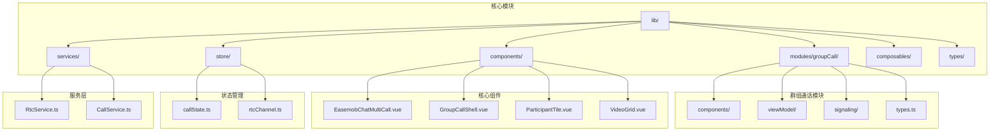
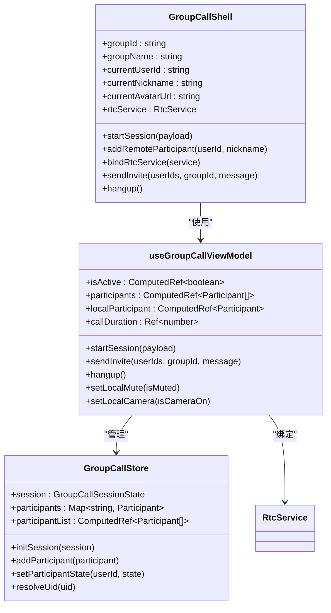
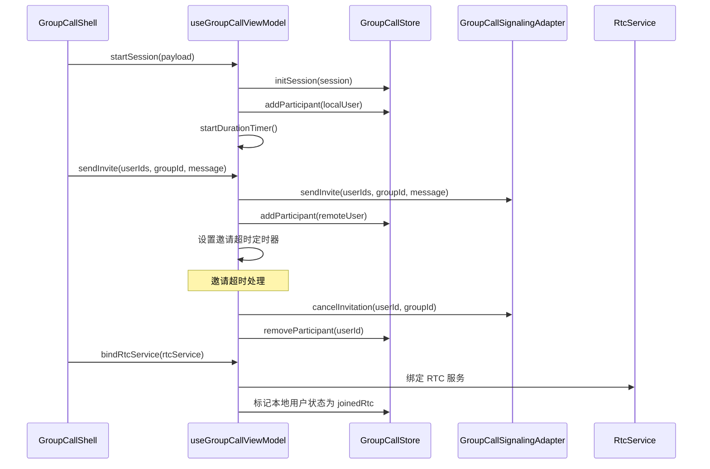
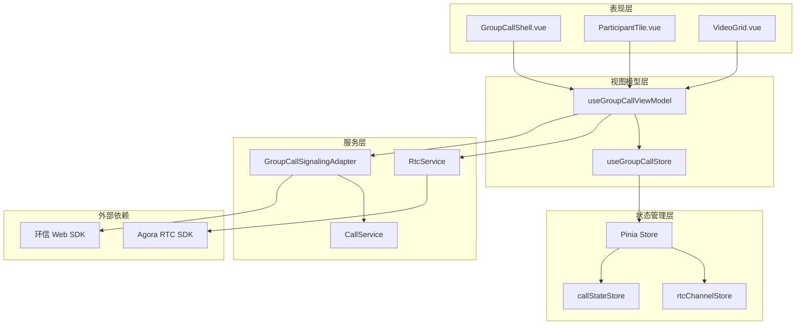
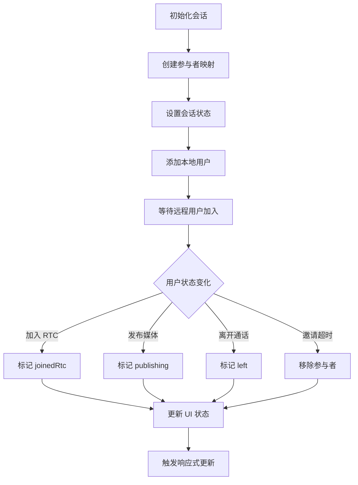
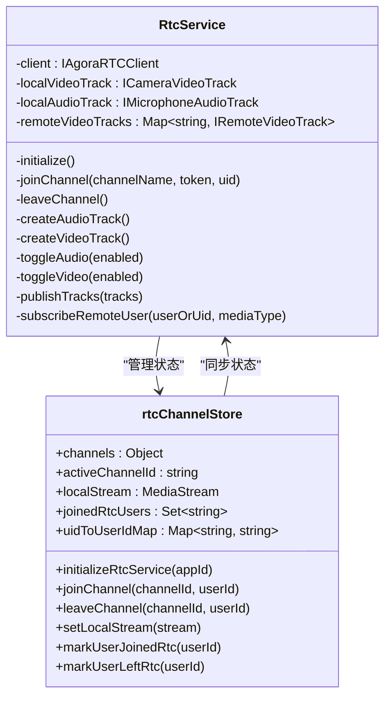
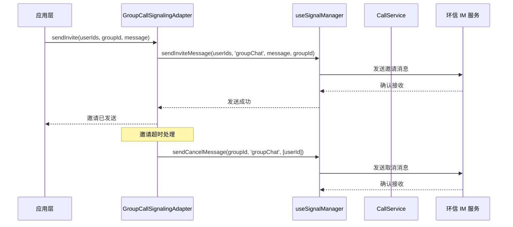
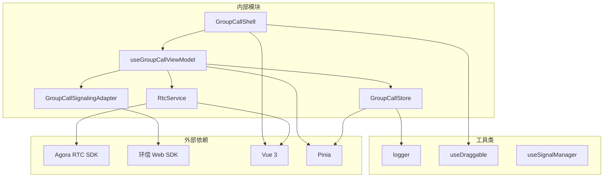

# 群组通话模块

<cite>
**本文档引用的文件**
- [README.md](file://README.md)
- [package.json](file://package.json)
- [lib/index.ts](file://lib/index.ts)
- [lib/modules/groupCall/index.ts](file://lib/modules/groupCall/index.ts)
- [lib/modules/groupCall/viewModel/GroupCallStore.ts](file://lib/modules/groupCall/viewModel/GroupCallStore.ts)
- [lib/modules/groupCall/viewModel/useGroupCallViewModel.ts](file://lib/modules/groupCall/viewModel/useGroupCallViewModel.ts)
- [lib/modules/groupCall/components/GroupCallShell.vue](file://lib/modules/groupCall/components/GroupCallShell.vue)
- [lib/components/multiCall/EasemobChatMultiCall.vue](file://lib/components/multiCall/EasemobChatMultiCall.vue)
- [lib/store/callState.ts](file://lib/store/callState.ts)
- [lib/store/rtcChannel.ts](file://lib/store/rtcChannel.ts)
- [lib/modules/groupCall/types.ts](file://lib/modules/groupCall/types.ts)
- [lib/modules/groupCall/signaling/GroupCallSignalingAdapter.ts](file://lib/modules/groupCall/signaling/GroupCallSignalingAdapter.ts)
- [lib/services/RtcService.ts](file://lib/services/RtcService.ts)
- [lib/types/callstate.types.ts](file://lib/types/callstate.types.ts)
</cite>

## 目录
1. [简介](#简介)
2. [项目结构](#项目结构)
3. [核心组件](#核心组件)
4. [架构概览](#架构概览)
5. [详细组件分析](#详细组件分析)
6. [依赖关系分析](#依赖关系分析)
7. [性能考虑](#性能考虑)
8. [故障排除指南](#故障排除指南)
9. [结论](#结论)

## 简介

群组通话模块是基于 Vue3 和环信聊天 SDK 的音视频通话解决方案，专门用于实现多人音视频通话功能。该模块采用现代化的架构设计，结合了 Pinia 状态管理、组合式函数和组件化开发模式，提供了完整的群组通话体验。

该模块的核心特点包括：
- 基于 Agora RTC SDK 的高质量音视频传输
- 完整的群组通话生命周期管理
- 实时参与者状态跟踪和管理
- 拖拽式通话窗口界面
- 邀请超时自动处理机制
- 本地和远程媒体流的统一管理

## 项目结构

项目采用模块化的组织方式，主要分为以下几个核心目录：

**图表来源**
- [lib/index.ts:1-67](file://lib/index.ts#L1-L67)
- [lib/modules/groupCall/index.ts:1-18](file://lib/modules/groupCall/index.ts#L1-L18)

**章节来源**
- [README.md:5-31](file://README.md#L5-L31)
- [package.json:1-53](file://package.json#L1-L53)

## 核心组件

### 群组通话 Shell 组件

GroupCallShell 是群组通话的核心容器组件，负责管理整个通话界面的状态和交互逻辑。

**图表来源**
- [lib/modules/groupCall/components/GroupCallShell.vue:1-300](file://lib/modules/groupCall/components/GroupCallShell.vue#L1-L300)
- [lib/modules/groupCall/viewModel/useGroupCallViewModel.ts:1-295](file://lib/modules/groupCall/viewModel/useGroupCallViewModel.ts#L1-L295)
- [lib/modules/groupCall/viewModel/GroupCallStore.ts:1-223](file://lib/modules/groupCall/viewModel/GroupCallStore.ts#L1-L223)

### 群组通话视图模型

useGroupCallViewModel 提供了群组通话的业务逻辑封装，实现了 MVVM 架构模式。

**图表来源**
- [lib/modules/groupCall/viewModel/useGroupCallViewModel.ts:136-178](file://lib/modules/groupCall/viewModel/useGroupCallViewModel.ts#L136-L178)
- [lib/modules/groupCall/signaling/GroupCallSignalingAdapter.ts:19-31](file://lib/modules/groupCall/signaling/GroupCallSignalingAdapter.ts#L19-L31)

**章节来源**
- [lib/modules/groupCall/components/GroupCallShell.vue:1-300](file://lib/modules/groupCall/components/GroupCallShell.vue#L1-L300)
- [lib/modules/groupCall/viewModel/useGroupCallViewModel.ts:1-295](file://lib/modules/groupCall/viewModel/useGroupCallViewModel.ts#L1-L295)

## 架构概览

群组通话模块采用了分层架构设计，确保了代码的可维护性和扩展性。

**图表来源**
- [lib/modules/groupCall/index.ts:1-18](file://lib/modules/groupCall/index.ts#L1-L18)
- [lib/services/RtcService.ts:1-748](file://lib/services/RtcService.ts#L1-L748)
- [lib/modules/groupCall/signaling/GroupCallSignalingAdapter.ts:1-66](file://lib/modules/groupCall/signaling/GroupCallSignalingAdapter.ts#L1-L66)

## 详细组件分析

### 群组通话存储管理

GroupCallStore 作为单一事实源，集中管理群组通话的所有状态信息。

**图表来源**
- [lib/modules/groupCall/viewModel/GroupCallStore.ts:43-57](file://lib/modules/groupCall/viewModel/GroupCallStore.ts#L43-L57)
- [lib/modules/groupCall/viewModel/GroupCallStore.ts:78-92](file://lib/modules/groupCall/viewModel/GroupCallStore.ts#L78-L92)

### RTC 服务集成

RtcService 封装了所有与音视频相关的 WebRTC 操作，提供了统一的接口。

**图表来源**
- [lib/services/RtcService.ts:42-79](file://lib/services/RtcService.ts#L42-L79)
- [lib/store/rtcChannel.ts:7-28](file://lib/store/rtcChannel.ts#L7-L28)

### 信令适配器

GroupCallSignalingAdapter 负责将新的群组通话动作转换为现有的 CallService 和 useSignalManager 调用。

**图表来源**
- [lib/modules/groupCall/signaling/GroupCallSignalingAdapter.ts:19-31](file://lib/modules/groupCall/signaling/GroupCallSignalingAdapter.ts#L19-L31)
- [lib/modules/groupCall/signaling/GroupCallSignalingAdapter.ts:55-64](file://lib/modules/groupCall/signaling/GroupCallSignalingAdapter.ts#L55-L64)

**章节来源**
- [lib/modules/groupCall/viewModel/GroupCallStore.ts:1-223](file://lib/modules/groupCall/viewModel/GroupCallStore.ts#L1-L223)
- [lib/services/RtcService.ts:1-748](file://lib/services/RtcService.ts#L1-L748)
- [lib/modules/groupCall/signaling/GroupCallSignalingAdapter.ts:1-66](file://lib/modules/groupCall/signaling/GroupCallSignalingAdapter.ts#L1-L66)

## 依赖关系分析

群组通话模块的依赖关系体现了清晰的分层架构：

**图表来源**
- [package.json:47-51](file://package.json#L47-L51)
- [lib/index.ts:1-67](file://lib/index.ts#L1-L67)

**章节来源**
- [package.json:1-53](file://package.json#L1-L53)
- [lib/index.ts:1-67](file://lib/index.ts#L1-L67)

## 性能考虑

群组通话模块在设计时充分考虑了性能优化：

### 响应式更新优化
- 使用 Vue3 的浅响应式更新机制，避免深层嵌套对象的性能开销
- 通过重新赋值 Map 来触发响应式更新，确保状态变更的及时性

### 媒体流管理
- 本地媒体流的创建和销毁采用延迟策略，减少资源占用
- 远程媒体流的订阅采用自动订阅机制，提高用户体验

### 内存管理
- 定时器和事件监听器在组件销毁时自动清理
- 媒体轨道的生命周期管理，防止内存泄漏

## 故障排除指南

### 常见问题及解决方案

**问题1：无法加入 RTC 频道**
- 检查 Agora App ID 配置是否正确
- 确认网络连接状态
- 验证 Token 生成和有效性

**问题2：媒体流无法正常播放**
- 检查浏览器权限设置
- 确认摄像头和麦克风设备可用
- 验证媒体轨道的发布状态

**问题3：参与者状态异常**
- 检查 UID 到用户 ID 的映射关系
- 确认邀请超时机制正常工作
- 验证用户离开事件的处理

**章节来源**
- [lib/services/RtcService.ts:118-147](file://lib/services/RtcService.ts#L118-L147)
- [lib/store/rtcChannel.ts:292-315](file://lib/store/rtcChannel.ts#L292-L315)
- [lib/modules/groupCall/viewModel/useGroupCallViewModel.ts:84-96](file://lib/modules/groupCall/viewModel/useGroupCallViewModel.ts#L84-L96)

## 结论

群组通话模块展现了现代前端音视频应用的最佳实践，通过合理的架构设计和组件化开发，实现了功能完整、性能优异的多人音视频通话解决方案。模块的主要优势包括：

1. **清晰的架构层次**：从表现层到服务层的分层设计，便于维护和扩展
2. **完善的生命周期管理**：从初始化到销毁的完整生命周期处理
3. **高效的媒体流管理**：基于 Agora SDK 的高性能音视频传输
4. **灵活的状态管理**：基于 Pinia 的响应式状态管理
5. **良好的错误处理**：完善的异常处理和故障恢复机制

该模块为开发者提供了一个可靠的群组通话基础框架，可以根据具体需求进行定制和扩展。