# 群组通话存储

<cite>
**本文档引用的文件**
- [package.json](file://package.json)
- [lib/index.ts](file://lib/index.ts)
- [lib/store/index.ts](file://lib/store/index.ts)
- [lib/types.ts](file://lib/types.ts)
- [lib/store/callState.ts](file://lib/store/callState.ts)
- [lib/store/rtcChannel.ts](file://lib/store/rtcChannel.ts)
- [lib/store/globalCall.ts](file://lib/store/globalCall.ts)
- [lib/store/singleCallRtc.ts](file://lib/store/singleCallRtc.ts)
- [lib/store/callTimer.ts](file://lib/store/callTimer.ts)
- [lib/store/chatClient.ts](file://lib/store/chatClient.ts)
- [lib/store/types.ts](file://lib/store/types.ts)
- [lib/core/events/CallKitEventBus.ts](file://lib/core/events/CallKitEventBus.ts)
- [lib/core/events/types.ts](file://lib/core/events/types.ts)
- [lib/modules/groupCall/viewModel/GroupCallStore.ts](file://lib/modules/groupCall/viewModel/GroupCallStore.ts)
- [lib/modules/groupCall/types.ts](file://lib/modules/groupCall/types.ts)
- [lib/modules/groupCall/media/RtcMediaBridge.ts](file://lib/modules/groupCall/media/RtcMediaBridge.ts)
- [lib/composables/useParticipants.ts](file://lib/composables/useParticipants.ts)
- [lib/services/UserProfileService.ts](file://lib/services/UserProfileService.ts)
- [callkit/services/CallService.ts](file://callkit/services/CallService.ts)
- [lib/modules/groupCall/index.ts](file://lib/modules/groupCall/index.ts)
- [README.md](file://README.md)
</cite>

## 更新摘要
**所做更改**
- 新增参与者资料管理功能章节，详细介绍动态修改昵称和头像URL的能力
- 更新 GroupCallStore 架构图，展示新的资料管理功能
- 新增参与者资料更新流程图，说明从全局存储到实时更新的完整链路
- 更新参与者列表生成逻辑，反映新的资料管理机制
- 新增 RtcMediaBridge 的资料丰富化功能说明

## 目录
1. [简介](#简介)
2. [项目结构](#项目结构)
3. [核心组件](#核心组件)
4. [架构概览](#架构概览)
5. [详细组件分析](#详细组件分析)
6. [参与者资料管理](#参与者资料管理)
7. [依赖关系分析](#依赖关系分析)
8. [性能考虑](#性能考虑)
9. [故障排除指南](#故障排除指南)
10. [结论](#结论)

## 简介

群组通话存储是一个基于 Vue 3 和 Pinia 的群组通话状态管理系统，专为 Easemob Chat CallKit 设计。该项目提供了完整的群组通话状态管理解决方案，包括通话状态跟踪、参与者管理、媒体流控制和事件通知等功能。

**更新** 系统现已增强参与者资料管理功能，支持动态修改昵称和头像URL，提供更加灵活和实时的用户信息展示能力。

该系统采用模块化设计，通过多个专门的 store 来管理不同方面的通话状态，确保代码的可维护性和可扩展性。系统支持单人通话和群组通话两种模式，并提供了丰富的事件机制来处理通话生命周期中的各种状态变化。

## 项目结构

项目采用清晰的模块化组织结构，主要分为以下几个核心目录：

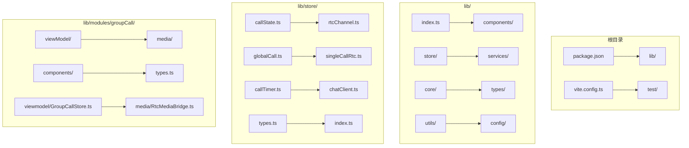

**图表来源**
- [lib/index.ts:1-90](file://lib/index.ts#L1-L90)
- [lib/store/index.ts:1-3](file://lib/store/index.ts#L1-L3)

**章节来源**
- [package.json:1-53](file://package.json#L1-L53)
- [lib/index.ts:1-90](file://lib/index.ts#L1-L90)

## 核心组件

### 状态管理架构

系统采用 Pinia 作为状态管理库，实现了以下核心 store：

1. **CallStateStore** - 主要通话状态管理
2. **RtcChannelStore** - RTC 频道和媒体流管理  
3. **GlobalCallStore** - 跨通话域的全局状态
4. **SingleCallRtcStore** - 单人通话的 RTC 用户状态
5. **CallTimerStore** - 通话计时器管理
6. **ChatClientStore** - 环信聊天客户端状态
7. **GroupCallStore** - 群组通话参与者状态管理（新增）

### 事件系统

系统内置了轻量级的事件总线机制，提供类型安全的发布/订阅功能：

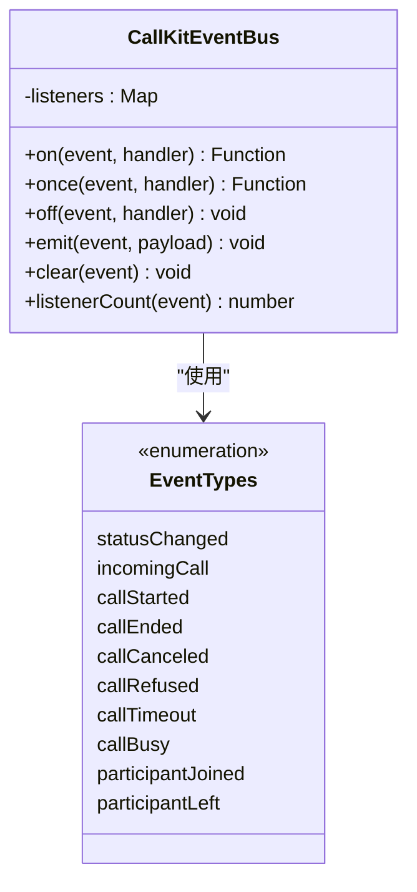

**图表来源**
- [lib/core/events/CallKitEventBus.ts:14-112](file://lib/core/events/CallKitEventBus.ts#L14-L112)
- [lib/core/events/types.ts:6-17](file://lib/core/events/types.ts#L6-L17)

**章节来源**
- [lib/store/callState.ts:9-215](file://lib/store/callState.ts#L9-L215)
- [lib/store/rtcChannel.ts:11-262](file://lib/store/rtcChannel.ts#L11-L262)
- [lib/store/globalCall.ts:8-56](file://lib/store/globalCall.ts#L8-L56)

## 架构概览

系统采用分层架构设计，各层职责清晰分离：

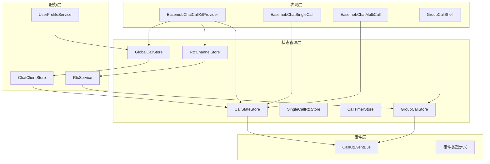

**图表来源**
- [lib/index.ts:1-90](file://lib/index.ts#L1-L90)
- [lib/store/callState.ts:1-215](file://lib/store/callState.ts#L1-L215)
- [lib/store/rtcChannel.ts:1-262](file://lib/store/rtcChannel.ts#L1-L262)

## 详细组件分析

### CallStateStore 分析

CallStateStore 是系统的核心状态管理组件，负责管理通话的全局状态：

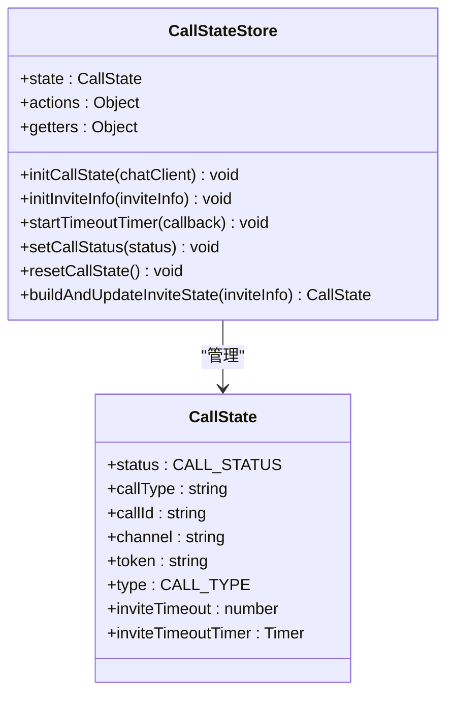

**图表来源**
- [lib/store/callState.ts:9-215](file://lib/store/callState.ts#L9-L215)
- [lib/store/types.ts:43-51](file://lib/store/types.ts#L43-L51)

#### 关键特性

1. **状态初始化**：通过 chatClient 初始化基础通话信息
2. **超时管理**：内置邀请超时机制，支持自定义超时时间
3. **状态转换**：提供类型安全的状态转换和事件通知
4. **重置机制**：完整的状态重置功能，支持多端场景

**章节来源**
- [lib/store/callState.ts:36-177](file://lib/store/callState.ts#L36-L177)

### RtcChannelStore 分析

RtcChannelStore 负责管理 RTC 频道和媒体流状态：

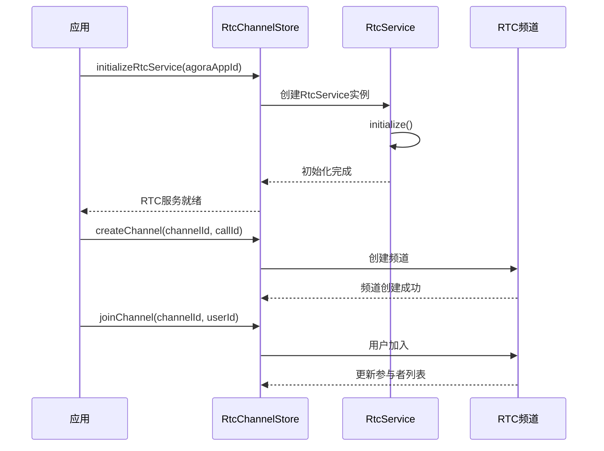

**图表来源**
- [lib/store/rtcChannel.ts:67-102](file://lib/store/rtcChannel.ts#L67-L102)
- [lib/store/rtcChannel.ts:119-152](file://lib/store/rtcChannel.ts#L119-L152)

#### 核心功能

1. **频道管理**：创建、加入、离开和删除 RTC 频道
2. **媒体流控制**：管理本地和远程媒体流
3. **用户状态同步**：跟踪用户的加入和离开状态
4. **服务生命周期**：管理 RTC 服务的初始化和销毁

**章节来源**
- [lib/store/rtcChannel.ts:56-262](file://lib/store/rtcChannel.ts#L56-L262)

### GlobalCallStore 分析

GlobalCallStore 提供跨通话域的全局状态管理：

```mermaid
flowchart TD
A[全局状态请求] --> B{状态类型}
B --> |用户信息| C[getUserInfo(userId)]
B --> |最小化状态| D[getIsMinimized]
B --> |用户信息映射| E[userInfoMap操作]
C --> F[返回用户信息对象]
D --> G[返回布尔值]
E --> H[Map操作]
H --> I[setUserInfo(userId, info)]
H --> J[batchSetUserInfo(entries)]
```

**图表来源**
- [lib/store/globalCall.ts:41-54](file://lib/store/globalCall.ts#L41-L54)

**章节来源**
- [lib/store/globalCall.ts:8-56](file://lib/store/globalCall.ts#L8-L56)

### GroupCallStore 分析

**更新** GroupCallStore 是新增的核心状态管理组件，专门负责群组通话的参与者状态管理：

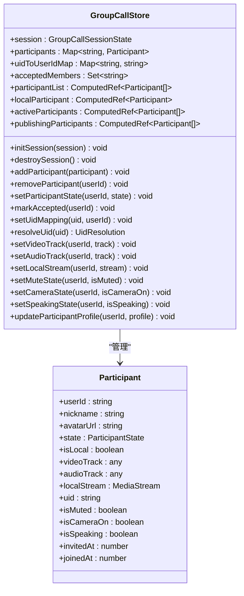

**图表来源**
- [lib/modules/groupCall/viewModel/GroupCallStore.ts:10-251](file://lib/modules/groupCall/viewModel/GroupCallStore.ts#L10-L251)
- [lib/modules/groupCall/types.ts:14-39](file://lib/modules/groupCall/types.ts#L14-L39)

#### 核心功能

1. **参与者管理**：添加、移除和更新参与者状态
2. **UID映射**：管理用户UID到用户ID的映射关系
3. **状态跟踪**：跟踪参与者的生命周期状态
4. **资料管理**：支持动态更新参与者的昵称和头像URL
5. **响应式更新**：确保状态变更的响应式传播

**章节来源**
- [lib/modules/groupCall/viewModel/GroupCallStore.ts:195-221](file://lib/modules/groupCall/viewModel/GroupCallStore.ts#L195-L221)

### 事件系统分析

系统内置了完整的事件通知机制：

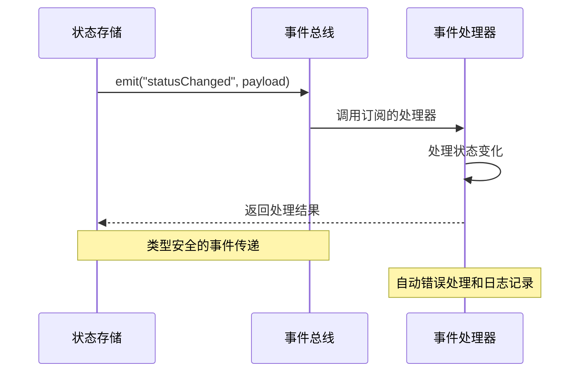

**图表来源**
- [lib/core/events/CallKitEventBus.ts:65-84](file://lib/core/events/CallKitEventBus.ts#L65-L84)

**章节来源**
- [lib/core/events/CallKitEventBus.ts:14-112](file://lib/core/events/CallKitEventBus.ts#L14-L112)
- [lib/core/events/types.ts:117-136](file://lib/core/events/types.ts#L117-L136)

## 参与者资料管理

**新增** 系统现已增强参与者资料管理功能，支持动态修改昵称和头像URL。

### 资料管理架构

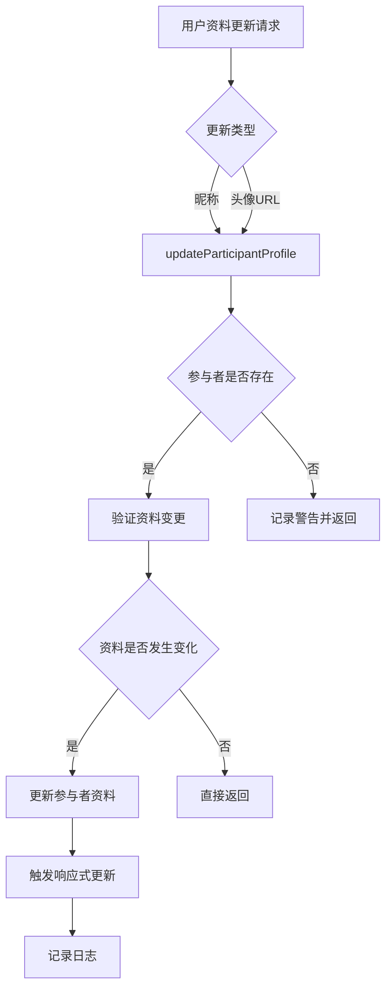

**图表来源**
- [lib/modules/groupCall/viewModel/GroupCallStore.ts:198-221](file://lib/modules/groupCall/viewModel/GroupCallStore.ts#L198-L221)

### 资料更新流程

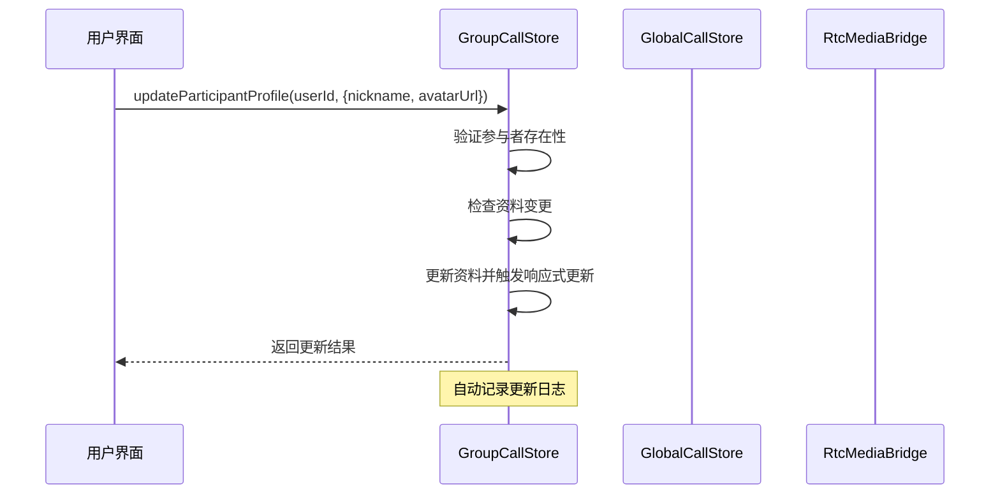

**图表来源**
- [lib/modules/groupCall/viewModel/GroupCallStore.ts:202-221](file://lib/modules/groupCall/viewModel/GroupCallStore.ts#L202-L221)

### 资料丰富化机制

**更新** 系统通过 RtcMediaBridge 实现自动资料丰富化：

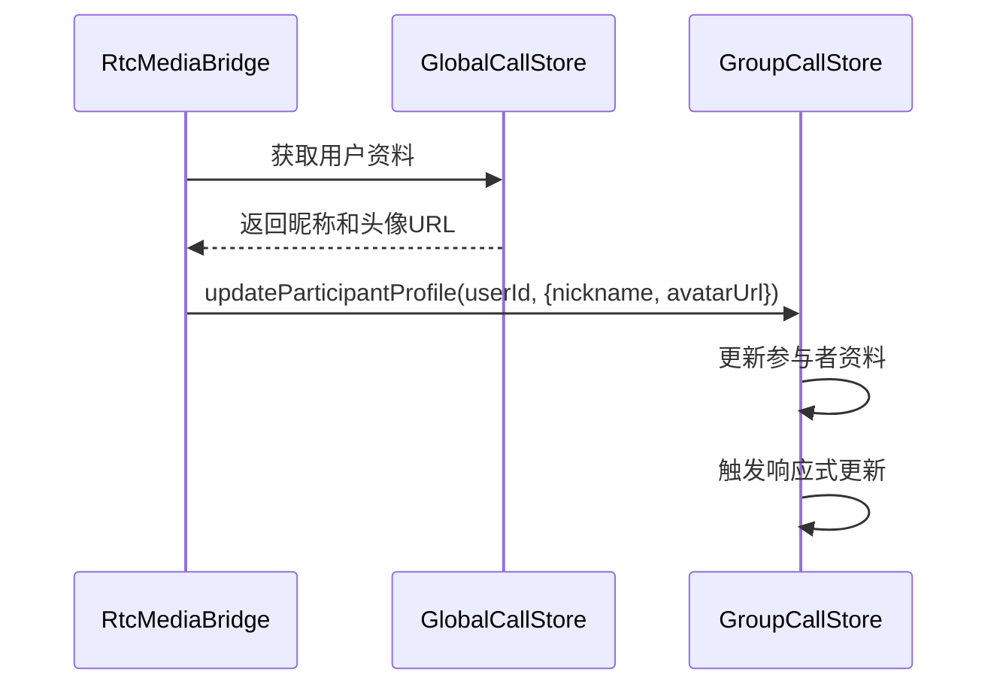

**图表来源**
- [lib/modules/groupCall/media/RtcMediaBridge.ts:248-257](file://lib/modules/groupCall/media/RtcMediaBridge.ts#L248-L257)

### 资料管理特性

1. **动态更新**：支持运行时动态修改参与者的昵称和头像URL
2. **类型安全**：完整的 TypeScript 类型定义，提供编译时类型检查
3. **响应式更新**：自动触发UI更新，无需手动刷新
4. **变更检测**：智能检测资料变更，避免不必要的更新
5. **错误处理**：对不存在的参与者进行安全处理，记录警告日志

**章节来源**
- [lib/modules/groupCall/viewModel/GroupCallStore.ts:195-221](file://lib/modules/groupCall/viewModel/GroupCallStore.ts#L195-L221)
- [lib/modules/groupCall/media/RtcMediaBridge.ts:248-257](file://lib/modules/groupCall/media/RtcMediaBridge.ts#L248-L257)

## 依赖关系分析

系统采用松耦合的设计，各组件之间的依赖关系清晰：

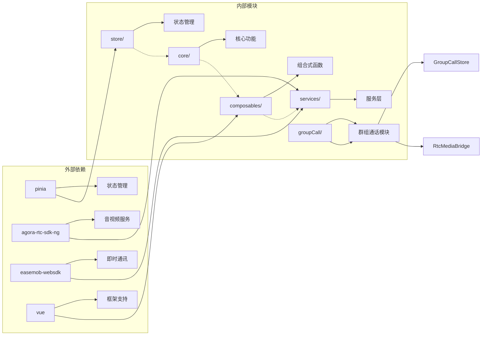

**图表来源**
- [package.json:47-51](file://package.json#L47-L51)
- [lib/index.ts:1-90](file://lib/index.ts#L1-L90)

**章节来源**
- [package.json:47-51](file://package.json#L47-L51)
- [lib/index.ts:1-90](file://lib/index.ts#L1-L90)

## 性能考虑

### 状态管理优化

1. **响应式更新**：使用 Pinia 的响应式系统，确保状态变更的高效传播
2. **内存管理**：及时清理定时器和媒体流轨道，防止内存泄漏
3. **懒加载**：RTC 服务采用延迟初始化，减少不必要的资源消耗
4. **资料缓存**：GlobalCallStore 缓存用户资料，减少重复查询

### 事件处理优化

1. **错误隔离**：事件处理器的异常不会影响其他处理器的执行
2. **日志控制**：提供多级别的日志输出，便于调试和性能监控
3. **订阅管理**：支持事件的动态订阅和取消，避免内存泄漏

### 资料管理优化

1. **智能更新**：资料变更检测避免不必要的状态更新
2. **批量处理**：支持批量设置用户信息，提高处理效率
3. **缓存策略**：用户资料缓存机制减少API调用频率

## 故障排除指南

### 常见问题及解决方案

1. **通话状态异常**
   - 检查 CallStateStore 的状态重置逻辑
   - 确认超时定时器的正确清理
   - 验证多端场景下的设备 ID 管理

2. **媒体流问题**
   - 确认 RTC 服务的正确初始化
   - 检查媒体权限和设备可用性
   - 验证流轨道的正确停止和清理

3. **事件处理问题**
   - 检查事件总线的订阅状态
   - 确认事件类型的正确使用
   - 验证处理器的错误处理机制

4. **资料管理问题**
   - **更新无效**：确认参与者确实存在于 participants Map 中
   - **UI不更新**：检查响应式更新机制是否正常工作
   - **资料丢失**：验证 GlobalCallStore 的缓存机制

**章节来源**
- [lib/store/callState.ts:141-159](file://lib/store/callState.ts#L141-L159)
- [lib/store/rtcChannel.ts:235-261](file://lib/store/rtcChannel.ts#L235-L261)
- [lib/core/events/CallKitEventBus.ts:77-83](file://lib/core/events/CallKitEventBus.ts#L77-L83)
- [lib/modules/groupCall/viewModel/GroupCallStore.ts:202-221](file://lib/modules/groupCall/viewModel/GroupCallStore.ts#L202-L221)

## 结论

群组通话存储提供了一个完整、健壮且高效的群组通话状态管理系统。通过模块化的架构设计和清晰的职责分离，系统能够有效管理复杂的通话状态和媒体流，同时提供了丰富的事件机制来处理各种业务场景。

**更新** 系统现已增强参与者资料管理功能，支持动态修改昵称和头像URL，为用户提供更加灵活和实时的用户信息展示能力。这一功能的实现体现了系统的高扩展性和良好的架构设计。

系统的主要优势包括：

1. **模块化设计**：每个 store 负责特定的功能领域，便于维护和扩展
2. **类型安全**：完整的 TypeScript 类型定义，提供编译时的类型检查
3. **事件驱动**：基于事件的通信机制，支持灵活的业务逻辑扩展
4. **性能优化**：合理的内存管理和资源清理策略
5. **错误处理**：完善的错误处理和日志记录机制
6. **资料管理**：动态更新参与者资料的能力，提升用户体验

该系统为开发者提供了一个可靠的基础设施，可以在此基础上构建各种复杂的通话应用场景。