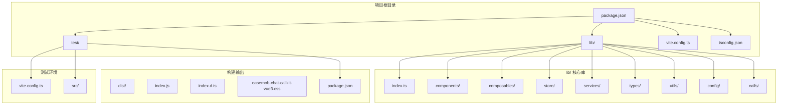
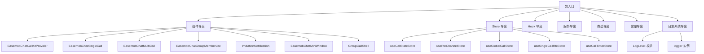
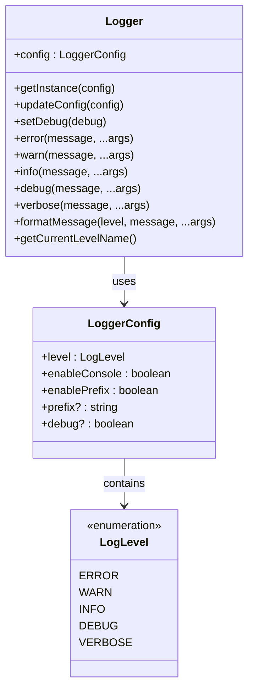
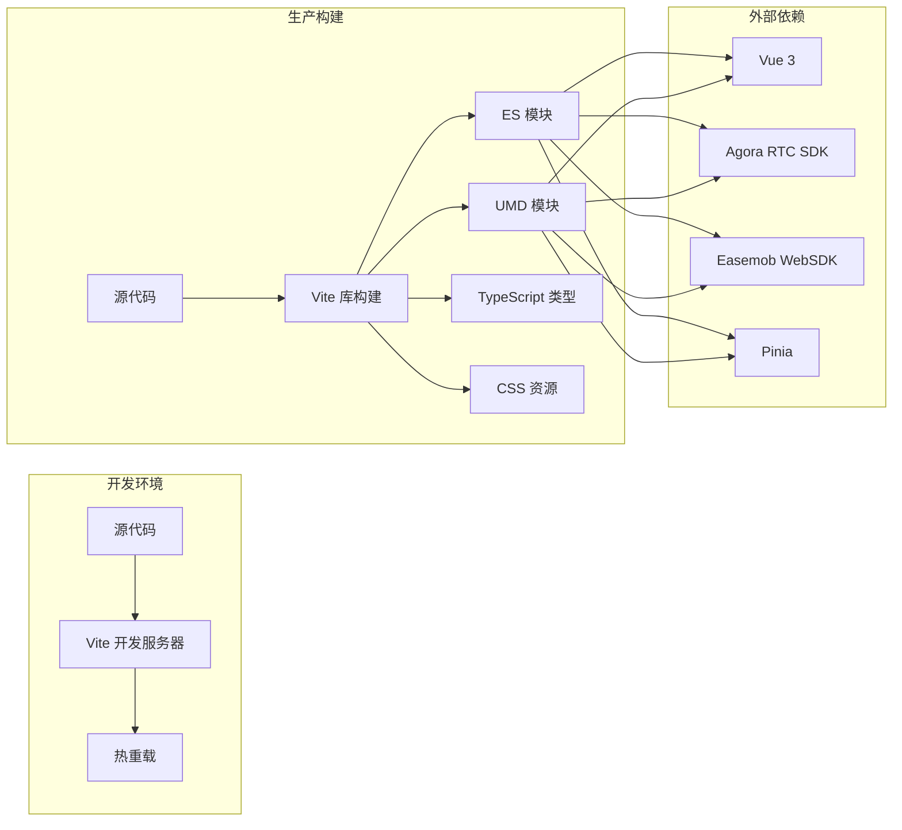
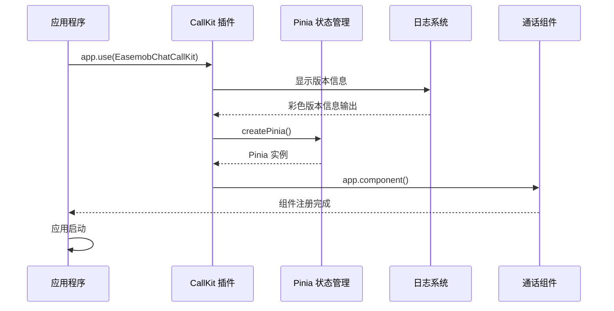
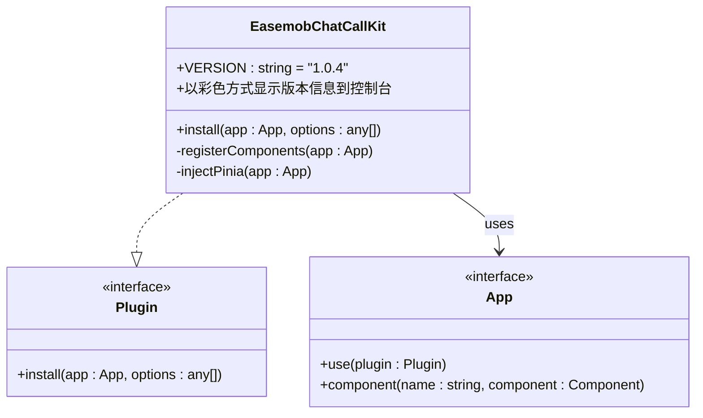
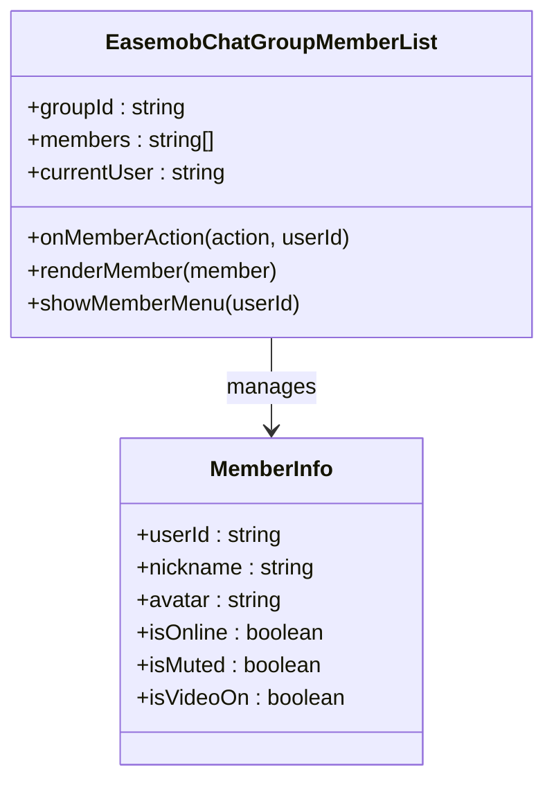
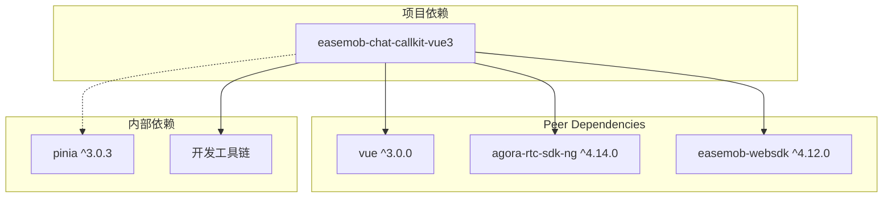
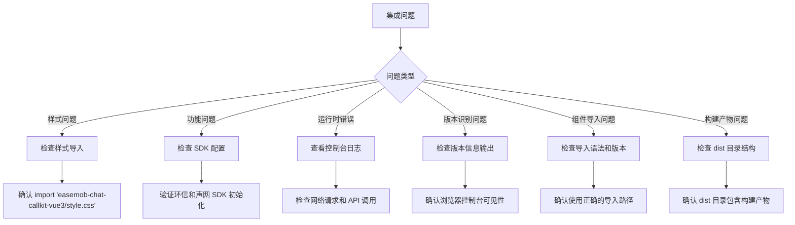

# 包元数据

<cite>
**本文档引用的文件**
- [package.json](file://package.json)
- [lib/index.ts](file://lib/index.ts)
- [lib/types.ts](file://lib/types.ts)
- [lib/utils/logger.ts](file://lib/utils/logger.ts)
- [CHANGELOG.md](file://CHANGELOG.md)
- [QUICK_START.md](file://QUICK_START.md)
- [USAGE.md](file://USAGE.md)
- [skills/callkit-integration.md](file://skills/callkit-integration.md)
- [lib/config/README.md](file://lib/config/README.md)
- [lib/callkit-static-assets/README.md](file://lib/callkit-static-assets/README.md)
- [lib/vite-env.d.ts](file://lib/vite-env.d.ts)
- [vite.config.ts](file://vite.config.ts)
- [vite.lib.config.ts](file://vite.lib.config.ts)
- [tsconfig.json](file://tsconfig.json)
- [tsconfig.app.json](file://tsconfig.app.json)
</cite>

## 更新摘要
**变更内容**
- **项目结构重组**：从 `release/dist` 迁移到标准 `dist` 目录结构，符合现代 npm 发布实践
- **包配置更新**：更新构建输出路径和导出配置，简化构建组织
- **版本升级**：版本号从 1.0.1 升级到 1.0.4
- **新增组件导出**：完整支持 EasemobChatGroupMemberList 组件导出
- **增强日志系统**：改进版本识别和控制台输出功能
- **优化构建流程**：清理机制和按需导入支持

## 目录
1. [简介](#简介)
2. [项目结构](#项目结构)
3. [核心组件](#核心组件)
4. [架构概览](#架构概览)
5. [详细组件分析](#详细组件分析)
6. [依赖分析](#依赖分析)
7. [性能考虑](#性能考虑)
8. [故障排除指南](#故障排除指南)
9. [结论](#结论)
10. [附录](#附录)

## 简介

Easemob Chat CallKit Vue3 是一个专为 Vue 3 应用程序设计的即时通讯通话插件。该项目提供了完整的音频和视频通话解决方案，集成了环信 IM SDK 和声网 RTC SDK，为开发者提供了一套开箱即用的通话组件和工具。

该插件的主要特点包括：
- 完整的单人和群组通话支持
- 自动化的通话状态管理和事件处理
- 灵活的组件化架构设计
- 丰富的配置选项和自定义能力
- 内置的静态资源管理系统
- **更新** 符合现代 npm 发布实践的标准化构建输出结构
- **更新** 改进的版本识别和控制台输出功能，提供更好的开发体验
- **更新** 新增完整的组件导出功能，支持更灵活的使用方式

**更新** 版本 1.0.4 引入了重要的项目结构重组，从传统的 `release/dist` 目录迁移到标准的 `dist` 目录结构，这使得包发布更加符合现代 npm 生态系统的最佳实践。同时，版本识别功能得到进一步改进，提供更好的开发体验和调试能力。

## 项目结构

基于仓库分析，该项目采用模块化组织结构，主要包含以下核心目录：



**更新** 项目结构重组的关键变化：
- **构建输出目录**：从 `release/dist` 迁移到标准的 `dist` 目录
- **包配置简化**：`package.json` 中的入口路径直接指向 `dist` 目录
- **导出配置优化**：`exports` 字段直接映射到 `dist` 目录结构
- **文件包含**：`files` 数组直接包含 `dist` 目录，确保构建产物正确发布

**图表来源**
- [package.json:1-77](file://package.json#L1-L77)
- [lib/index.ts:1-108](file://lib/index.ts#L1-L108)

**章节来源**
- [package.json:1-77](file://package.json#L1-L77)
- [lib/index.ts:1-108](file://lib/index.ts#L1-L108)

## 核心组件

### 包元数据定义

项目的核心包元数据定义在 `package.json` 中，包含了完整的包描述信息：

| 元数据字段 | 值 | 描述 |
|-----------|-----|------|
| **name** | `easemob-chat-callkit-vue3` | 包的注册名称 |
| **version** | `1.0.4` | 当前版本号（已更新） |
| **type** | `module` | ES 模块类型 |
| **description** | `Easemob Chat CallKit Vue3 Plugin` | 包的功能描述 |
| **main** | `./dist/index.js` | CommonJS 入口点 |
| **module** | `./dist/index.js` | ES 模块入口点 |
| **types** | `./dist/index.d.ts` | TypeScript 类型声明 |
| **exports** | 多入口导出配置 | 支持按需导入和样式导入 |

**更新** 包配置的现代化改进：
- **入口路径简化**：直接指向 `./dist/index.js`，无需复杂的路径转换
- **导出配置优化**：`exports` 字段直接映射到 `dist` 目录，支持更灵活的导入方式
- **文件包含**：`files` 数组直接包含 `dist` 目录，确保构建产物正确发布到 npm

### 版本识别功能

**更新** 版本 1.0.4 引入了改进的版本识别功能，在插件初始化时会以更友好的方式显示当前版本信息：

```mermaid
sequenceDiagram
participant App as 应用程序
participant Plugin as CallKit 插件
participant Console as 控制台
App->>Plugin : app.use(EasemobChatCallKit)
Plugin->>Plugin : VERSION = "1.0.4"
Plugin->>Console : console.info("%c[EasemobChatCallKit] v1.0.4 initialized", "color : #4ade80; font-weight : bold;")
Console-->>App : 显示彩色版本信息
```

**更新** 重要改进：从原来的 `console.log` 改为 `console.info`，使版本信息在浏览器控制台中以更醒目的方式显示，颜色为绿色，字体加粗，便于开发者快速识别插件初始化状态。

**图表来源**
- [lib/index.ts:86-91](file://lib/index.ts#L86-L91)

### 增强的组件导出功能

**新增** 版本 1.0.4 引入了完整的组件导出功能，现在可以按需导入所需的组件：



**更新** 新增了 EasemobChatGroupMemberList 组件的导出，这是一个专门用于群组通话中显示和管理成员列表的组件。这个组件提供了完整的群组成员交互功能，包括成员状态显示、操作按钮等。

**图表来源**
- [lib/index.ts:23-41](file://lib/index.ts#L23-L41)
- [lib/index.ts:86-108](file://lib/index.ts#L86-L108)

### 增强的日志系统

**新增** 版本 1.0.4 引入了增强的日志系统，提供彩色控制台输出和详细级别控制：



**图表来源**
- [lib/utils/logger.ts:49-484](file://lib/utils/logger.ts#L49-L484)

**章节来源**
- [lib/types.ts:6-110](file://lib/types.ts#L6-L110)
- [lib/index.ts:42-83](file://lib/index.ts#L42-L83)
- [lib/utils/logger.ts:1-484](file://lib/utils/logger.ts#L1-L484)

## 架构概览

### 构建系统架构

项目采用 Vite 作为构建工具，配置了专门的库构建配置：



**更新** 构建系统的关键改进：
- **输出目录标准化**：统一使用 `dist` 目录作为构建输出位置
- **清理机制**：构建前自动清理 `dist` 目录，确保构建一致性
- **资产命名**：CSS 资源统一命名为 `easemob-chat-callkit-vue3.css`

**图表来源**
- [vite.lib.config.ts:37-62](file://vite.lib.config.ts#L37-L62)
- [package.json:33-52](file://package.json#L33-L52)

### 插件安装流程



**图表来源**
- [lib/index.ts:86-108](file://lib/index.ts#L86-L108)

**章节来源**
- [vite.lib.config.ts:1-69](file://vite.lib.config.ts#L1-L69)
- [lib/index.ts:86-108](file://lib/index.ts#L86-L108)

## 详细组件分析

### 核心插件类

插件类实现了标准的 Vue 3 插件接口，提供了自动化的依赖注入和组件注册：



**图表来源**
- [lib/index.ts:86-108](file://lib/index.ts#L86-L108)

### 配置系统

项目提供了灵活的配置系统，支持多种配置方式：

| 配置类型 | 字段 | 默认值 | 说明 |
|---------|------|--------|------|
| **基础配置** | appKey | 必填 | 环信应用标识符 |
| | userId | 可选 | 当前用户ID |
| | accessToken | 可选 | 访问令牌 |
| | debug | false | 调试模式开关 |
| **功能配置** | enableRingtone | true | 铃声功能 |
| | resizable | true | 窗口可调整大小 |
| | draggable | true | 窗口可拖拽 |
| **SDK 配置** | chatClient | 可选 | 环信客户端实例 |
| | agoraClient | 可选 | 声网客户端实例 |
| **日志配置** | **新增** | debug | false | 启用详细日志输出 |

### 新增的群组成员列表组件

**新增** EasemobChatGroupMemberList 是版本 1.0.4 新增的重要组件，专门用于群组通话场景：



**图表来源**
- [lib/components/multiCall/EasemobChatGroupMemberList.vue](file://lib/components/multiCall/EasemobChatGroupMemberList.vue)

**章节来源**
- [lib/types.ts:6-110](file://lib/types.ts#L6-L110)
- [skills/callkit-integration.md:180-221](file://skills/callkit-integration.md#L180-L221)

### 静态资源管理

项目内置了完整的静态资源管理系统，支持本地和 CDN 资源：

```mermaid
flowchart TD
A[资源请求] --> B{资源类型}
B --> |背景图| C[callkit_bg.png]
B --> |SVG 图标| D[icons/]
B --> |音频资源| E[sounds/]
C --> F[本地路径]
D --> G[按需加载]
E --> H[自定义铃声]
F --> I[/callkit-static-assets/...]
G --> I
H --> I
```

**图表来源**
- [lib/config/README.md:121-142](file://lib/config/README.md#L121-L142)

**章节来源**
- [lib/config/README.md:1-201](file://lib/config/README.md#L1-L201)
- [lib/callkit-static-assets/README.md:1-231](file://lib/callkit-static-assets/README.md#L1-L231)

## 依赖分析

### 外部依赖关系

项目采用 peerDependencies 策略，避免重复打包：



**图表来源**
- [package.json:33-52](file://package.json#L33-L52)

### 构建时依赖

开发和构建相关的依赖包括：

| 依赖类型 | 包名 | 版本范围 | 用途 |
|---------|------|----------|------|
| **构建工具** | vite | ^7.1.2 | 开发服务器和构建 |
| | vue-tsc | ^3.0.5 | TypeScript 编译 |
| | typescript | ~5.8.3 | 类型检查 |
| **Vue 生态** | @vitejs/plugin-vue | ^6.0.1 | Vue 单文件组件支持 |
| | @vue/tsconfig | ^0.7.0 | TypeScript 配置 |
| **类型定义** | @types/node | ^24.3.0 | Node.js 类型 |
| **插件开发** | vite-plugin-dts | ^4.5.4 | TypeScript 声明文件生成 |

## 性能考虑

### 构建优化

项目在构建配置中采用了多项性能优化策略：

1. **代码分割**：启用 CSS 代码分割以减少初始加载时间
2. **外部化依赖**：将 Vue、Agora SDK、环信 SDK 外部化，避免重复打包
3. **UMD 和 ES 模块**：同时生成两种格式，适应不同使用场景
4. **清理机制**：构建前自动清理 `dist` 目录，确保构建一致性
5. **按需导出**：通过 exports 字段支持按需导入，减少包体积

### 运行时优化

- **按需加载**：静态资源采用按需加载策略
- **组件懒加载**：大型组件支持懒加载
- **状态管理优化**：使用 Pinia 提供高效的状态管理
- **日志级别控制**：通过 debug 配置控制日志输出级别，减少生产环境日志开销
- **版本输出优化**：使用 console.info 替代 console.log，提供更好的控制台体验
- **组件导出优化**：支持按需导入特定组件，减少不必要的代码加载

## 故障排除指南

### 常见安装问题

| 问题现象 | 可能原因 | 解决方案 |
|---------|---------|---------|
| `getActivePinia() was called but there was no active Pinia` | 忘记调用 `app.use(EasemobChatCallKit)` | 确保在 main.ts 中正确注册插件 |
| `Cannot find module 'pinia'` | 项目中存在冲突的 pinia 依赖 | 卸载项目中的 pinia，让插件内部处理 |
| 通话组件不显示 | 没有调用 `useCallKit().call()` | 确认已正确发起通话请求 |
| **更新** 版本信息未显示 | 控制台输出被禁用或浏览器不支持 | 检查浏览器控制台和日志级别设置，确认使用 console.info 输出 |
| **更新** 组件导入失败 | 导入路径不正确或版本过低 | 确认使用正确的导入语法和版本 1.0.4+ |
| **更新** 构建产物缺失 | `dist` 目录未正确生成 | 检查构建脚本和 `vite.lib.config.ts` 配置 |

### 集成问题诊断



**图表来源**
- [skills/callkit-integration.md:204-221](file://skills/callkit-integration.md#L204-L221)

**章节来源**
- [skills/callkit-integration.md:48-54](file://skills/callkit-integration.md#L48-L54)
- [skills/callkit-integration.md:204-221](file://skills/callkit-integration.md#L204-L221)

## 结论

Easemob Chat CallKit Vue3 是一个设计精良的通话插件，具有以下优势：

1. **完整的功能覆盖**：支持单人和群组通话，提供完整的生命周期管理
2. **灵活的集成方式**：支持多种使用场景，包括直接导入和本地安装
3. **良好的类型支持**：完整的 TypeScript 类型定义，提供优秀的开发体验
4. **清晰的架构设计**：模块化组织，易于维护和扩展
5. **完善的文档支持**：包含快速开始、完整 API 参考和集成指南
6. **增强的调试能力**：版本识别功能和彩色日志系统，提供更好的开发体验
7. **灵活的组件导出**：支持按需导入特定组件，提供更大的使用灵活性
8. **现代化的构建结构**：符合 npm 发布最佳实践的标准 `dist` 目录结构

**更新** 版本 1.0.4 在保持原有功能的基础上，进行了重要的项目结构重组。最重要的改进是从 `release/dist` 目录迁移到标准的 `dist` 目录结构，这使得包发布更加符合现代 npm 生态系统的要求。同时，版本识别功能得到进一步优化，提供更好的开发体验和调试效率。新增的 EasemobChatGroupMemberList 组件专门用于群组通话场景下的成员管理，大大增强了群组通话的功能完整性。

该插件适合需要在 Vue 3 应用中集成高质量通话功能的开发者使用。

## 附录

### 快速开始步骤

1. **安装依赖**：`pnpm add easemob-chat-callkit-vue3`
2. **导入样式**：`import 'easemob-chat-callkit-vue3/style.css'`
3. **注册插件**：`app.use(EasemobChatCallKit)`
4. **配置 Provider**：在根组件中使用 CallKit Provider
5. **发起通话**：使用 `useCallKit()` Hook 发起通话

### 版本兼容性

- **Vue**: ^3.0.0
- **Agora RTC SDK**: ^4.14.0
- **Easemob WebSDK**: ^4.12.0
- **Node.js**: 支持现代版本

### 版本历史

**更新** 版本 1.0.4 主要变更：
- **项目结构重组**：构建产物从 `release/dist` 迁移到标准 `dist/` 目录，入口路径更符合 npm 包惯例
- **组件导出增强**：新增 EasemobChatGroupMemberList 组件的完整导出支持
- **版本识别**：插件初始化时显示版本信息 `[EasemobChatCallKit] v1.0.4 initialized`
- **日志系统增强**：支持彩色控制台输出和详细级别控制
- **控制台输出优化**：将版本输出从 `console.log` 改为 `console.info`，提供更好的视觉体验
- **miniCore 兼容性**：增强对环信 IM SDK miniCore 版本的支持
- **样式文件版本控制**：修复样式文件构建问题
- **按需导入支持**：通过 exports 字段支持更灵活的导入方式

**章节来源**
- [QUICK_START.md:21-29](file://QUICK_START.md#L21-L29)
- [skills/callkit-integration.md:214-221](file://skills/callkit-integration.md#L214-L221)
- [CHANGELOG.md:1-37](file://CHANGELOG.md#L1-L37)