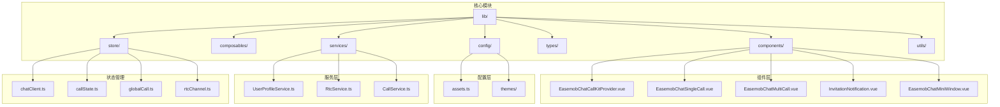
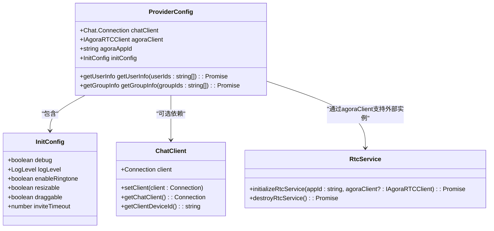
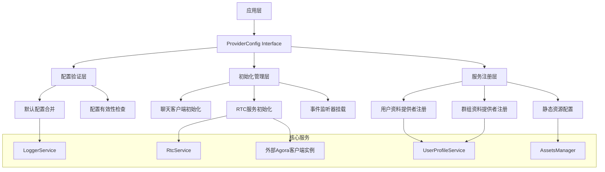
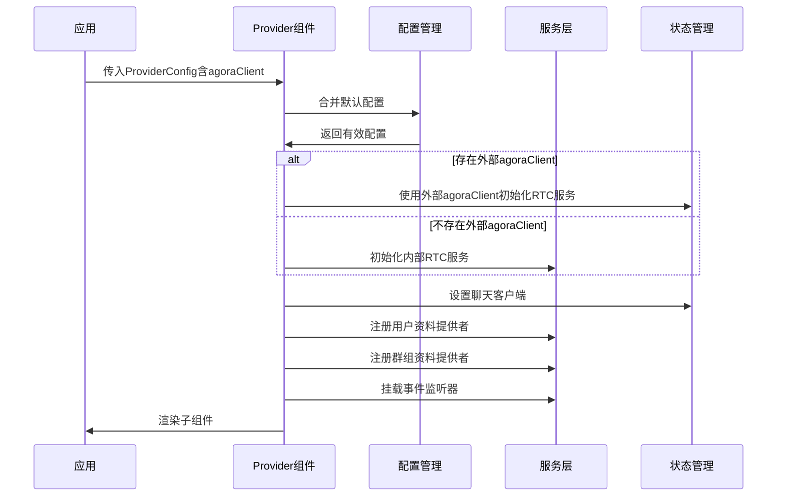
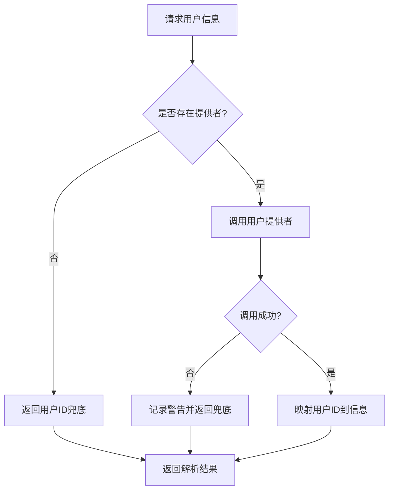
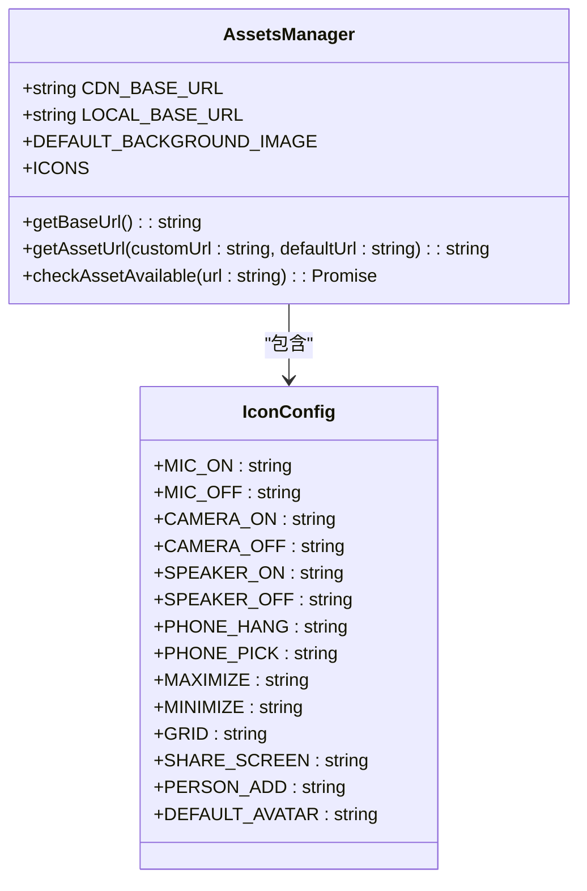
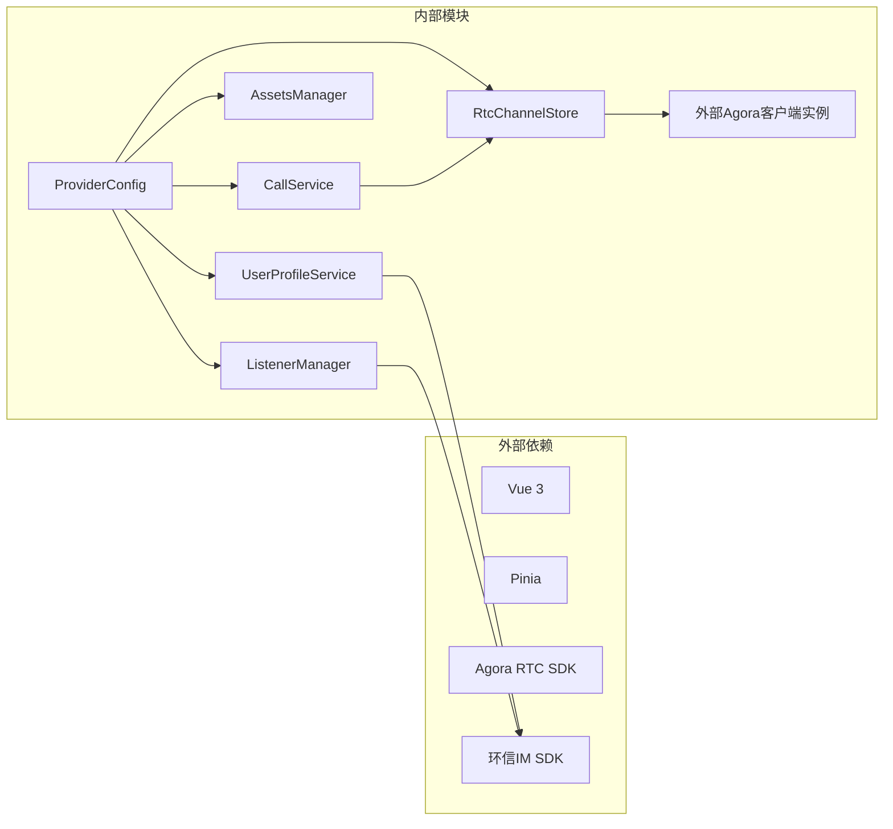

# Provider Config Interface

<cite>
**本文档引用的文件**
- [lib/index.ts](file://lib/index.ts)
- [lib/types.ts](file://lib/types.ts)
- [lib/components/EasemobChatCallKitProvider.vue](file://lib/components/EasemobChatCallKitProvider.vue)
- [lib/services/UserProfileService.ts](file://lib/services/UserProfileService.ts)
- [lib/config/assets.ts](file://lib/config/assets.ts)
- [lib/composables/useCallKit.ts](file://lib/composables/useCallKit.ts)
- [lib/composables/useListenerManager.ts](file://lib/composables/useListenerManager.ts)
- [lib/store/chatClient.ts](file://lib/store/chatClient.ts)
- [lib/types/callstate.types.ts](file://lib/types/callstate.types.ts)
- [lib/store/rtcChannel.ts](file://lib/store/rtcChannel.ts)
- [lib/services/RtcService.ts](file://lib/services/RtcService.ts)
- [USAGE.md](file://USAGE.md)
</cite>

## 更新摘要
**变更内容**
- 新增 agoraClient 属性，支持外部创建的Agora客户端实例集成
- 更新 ProviderConfig 接口定义，包含新的可选属性
- 增强 RTC 服务初始化逻辑，支持外部 Agora 客户端实例
- 更新组件初始化流程，体现外部客户端实例的使用

## 目录
1. [简介](#简介)
2. [项目结构](#项目结构)
3. [核心组件](#核心组件)
4. [架构概览](#架构概览)
5. [详细组件分析](#详细组件分析)
6. [依赖关系分析](#依赖关系分析)
7. [性能考虑](#性能考虑)
8. [故障排除指南](#故障排除指南)
9. [结论](#结论)

## 简介

Provider Config Interface 是 EaseMob Chat CallKit Vue3 组件库中的核心配置接口，它为开发者提供了灵活的配置选项来定制通话组件的行为和外观。该接口支持延迟初始化、用户资料提供者、群组资料提供者以及丰富的功能配置选项。**最新版本新增了对外部创建的Agora客户端实例的支持，允许开发者在组件外部管理Agora SDK的生命周期。**

## 项目结构

该项目采用模块化架构设计，主要包含以下核心目录：



**图表来源**
- [lib/index.ts:1-90](file://lib/index.ts#L1-L90)
- [lib/types.ts:1-95](file://lib/types.ts#L1-L95)

**章节来源**
- [lib/index.ts:1-90](file://lib/index.ts#L1-L90)
- [lib/types.ts:1-95](file://lib/types.ts#L1-L95)

## 核心组件

### ProviderConfig 接口定义

ProviderConfig 接口是整个 CallKit 组件库的核心配置接口，它定义了以下关键配置项：



**更新** 新增 agoraClient 属性，支持外部传入的Agora客户端实例

**图表来源**
- [lib/types.ts:39-65](file://lib/types.ts#L39-L65)
- [lib/store/chatClient.ts:6-22](file://lib/store/chatClient.ts#L6-L22)
- [lib/store/rtcChannel.ts:67-104](file://lib/store/rtcChannel.ts#L67-L104)

### 初始化配置选项

ProviderConfig 支持以下初始化配置选项：

| 配置项 | 类型 | 默认值 | 描述 |
|--------|------|--------|------|
| chatClient | Chat.Connection | undefined | 可选，支持延迟初始化 |
| agoraClient | IAgoraRTCClient | undefined | 可选，外部传入的Agora RTC客户端实例 |
| agoraAppId | string | undefined | [已废弃] Agora AppId将从环信服务器动态获取，此参数仅用于向后兼容 |
| initConfig | InitConfig | undefined | 全局配置对象 |

**更新** 新增 agoraClient 属性，允许外部管理Agora SDK生命周期

**章节来源**
- [lib/types.ts:39-65](file://lib/types.ts#L39-L65)
- [lib/components/EasemobChatCallKitProvider.vue:29-58](file://lib/components/EasemobChatCallKitProvider.vue#L29-L58)

## 架构概览

Provider Config Interface 采用了分层架构设计，确保了良好的可扩展性和可维护性。**最新版本增强了对外部Agora客户端实例的支持，为开发者提供了更灵活的集成方式**：



**更新** 新增外部Agora客户端实例支持，允许开发者在组件外部管理Agora SDK

**图表来源**
- [lib/components/EasemobChatCallKitProvider.vue:84-101](file://lib/components/EasemobChatCallKitProvider.vue#L84-L101)
- [lib/services/UserProfileService.ts:25-42](file://lib/services/UserProfileService.ts#L25-L42)

## 详细组件分析

### EasemobChatCallKitProvider 组件

EasemobChatCallKitProvider 是 Provider Config Interface 的主要实现组件，负责协调各个子系统的初始化和配置。**该组件现在支持外部传入的Agora客户端实例**：



**更新** 新增外部Agora客户端实例的初始化流程

**图表来源**
- [lib/components/EasemobChatCallKitProvider.vue:84-101](file://lib/components/EasemobChatCallKitProvider.vue#L84-L101)

#### 关键初始化流程

组件的初始化过程遵循严格的顺序，并新增了对外部Agora客户端实例的支持：

1. **配置合并阶段**：合并默认配置与用户配置
2. **日志配置阶段**：设置日志级别和调试模式
3. **RTC服务初始化**：**优先使用外部传入的agoraClient实例，否则初始化内部实例**
4. **聊天客户端设置**：配置环信聊天客户端
5. **资料提供者注册**：注册用户和群组信息提供者
6. **事件监听器挂载**：挂载消息和信令监听器

**更新** 第3步新增外部Agora客户端实例的优先使用逻辑

**章节来源**
- [lib/components/EasemobChatCallKitProvider.vue:84-101](file://lib/components/EasemobChatCallKitProvider.vue#L84-L101)

### 用户资料提供者系统

UserProfileService 提供了灵活的用户和群组信息获取机制：



**图表来源**
- [lib/services/UserProfileService.ts:48-80](file://lib/services/UserProfileService.ts#L48-L80)

#### 资料提供者接口

```typescript
interface UserInfoProvider {
  (userIds: string[]): Promise<UserProfile[]>
}

interface GroupInfoProvider {
  (groupIds: string[]): Promise<GroupProfile[]>
}
```

**章节来源**
- [lib/services/UserProfileService.ts:15-42](file://lib/services/UserProfileService.ts#L15-L42)

### 静态资源配置系统

AssetsManager 提供了灵活的静态资源管理能力：



**图表来源**
- [lib/config/assets.ts:10-74](file://lib/config/assets.ts#L10-L74)

**章节来源**
- [lib/config/assets.ts:10-74](file://lib/config/assets.ts#L10-L74)

## 依赖关系分析

### 组件间依赖关系



**更新** 新增外部Agora客户端实例依赖关系

**图表来源**
- [lib/index.ts:1-38](file://lib/index.ts#L1-L38)
- [lib/types.ts:1-3](file://lib/types.ts#L1-L3)

### 状态管理依赖

```mermaid
erDiagram
CHAT_CLIENT {
Connection client
setClient(Connection) void
getChatClient() Connection
getClientDeviceId() string
}
CALL_STATE {
string callId
string channel
CALL_TYPE type
CALL_STATUS status
string callerUserId
string calleeUserId
number inviteTimeout
}
GLOBAL_CALL {
map userInfo
map groupInfo
setUserInfo(string, UserInfo) void
getUserInfo(string) UserInfo
}
RTC_CHANNEL {
RtcService rtcService
initializeRtcService(string, IAgoraRTCClient?) Promise<void>
destroyRtcService() Promise<void>
}
CHAT_CLIENT ||--|| CALL_STATE : "管理"
CHAT_CLIENT ||--|| GLOBAL_CALL : "关联"
RTC_CHANNEL ||--|| CALL_STATE : "协作"
RTC_CHANNEL ||--|| EXTERNAL_AGGREGATE : "支持外部Agora实例"
```

**更新** 新增外部Agora客户端实例支持关系

**图表来源**
- [lib/store/chatClient.ts:6-22](file://lib/store/chatClient.ts#L6-L22)
- [lib/types/callstate.types.ts:49-67](file://lib/types/callstate.types.ts#L49-L67)
- [lib/store/rtcChannel.ts:67-104](file://lib/store/rtcChannel.ts#L67-L104)

**章节来源**
- [lib/store/chatClient.ts:6-22](file://lib/store/chatClient.ts#L6-L22)
- [lib/types/callstate.types.ts:49-67](file://lib/types/callstate.types.ts#L49-L67)

## 性能考虑

### 配置优化建议

1. **延迟初始化策略**：利用 `chatClient` 的可选特性支持延迟初始化
2. **外部实例复用**：**使用外部传入的agoraClient实例可以避免重复初始化，提升性能**
3. **资源加载优化**：合理配置 CDN 和本地资源路径
4. **日志级别控制**：根据环境调整日志级别以平衡性能和调试需求
5. **内存管理**：及时清理事件监听器和 RTC 服务实例

**更新** 新增外部Agora客户端实例的性能优化建议

### 性能监控指标

- 配置初始化时间
- 资源加载成功率
- 事件监听器数量
- 内存使用情况
- **外部Agora客户端实例复用率**

**更新** 新增外部Agora客户端实例复用率监控指标

## 故障排除指南

### 常见问题及解决方案

| 问题类型 | 症状 | 解决方案 |
|----------|------|----------|
| 配置无效 | 组件行为异常 | 检查 ProviderConfig 配置项 |
| 资源加载失败 | 图标或背景显示异常 | 验证 CDN 配置和网络连接 |
| 通话功能异常 | 无法发起或接受通话 | 检查聊天客户端初始化状态 |
| 资料提供者失效 | 用户头像显示为默认 | 验证用户资料提供者实现 |
| **外部Agora实例冲突** | **RTC服务初始化失败** | **验证外部agoraClient实例的有效性和生命周期管理** |
| **Agora客户端未正确注入** | **通话功能异常但日志正常** | **确认agoraClient属性正确传递给Provider组件** |

**更新** 新增外部Agora客户端实例相关的故障排除指南

**章节来源**
- [lib/components/EasemobChatCallKitProvider.vue:92-96](file://lib/components/EasemobChatCallKitProvider.vue#L92-L96)
- [lib/services/UserProfileService.ts:82-88](file://lib/services/UserProfileService.ts#L82-L88)

### 调试技巧

1. **启用详细日志**：使用 `logLevel: LogLevel.VERBOSE` 进行全面调试
2. **检查配置合并**：验证默认配置与用户配置的合并结果
3. **监控资源加载**：使用 `checkAssetAvailable` 方法验证资源可用性
4. **跟踪事件流**：通过事件总线监听通话状态变化
5. ****验证外部实例**：**确认agoraClient实例在Provider初始化前已创建并保持有效** |

**更新** 新增外部Agora客户端实例的调试技巧

**章节来源**
- [USAGE.md:844-888](file://USAGE.md#L844-L888)

## 结论

Provider Config Interface 为 EaseMob Chat CallKit Vue3 组件库提供了强大而灵活的配置能力。**最新版本通过新增的agoraClient属性，显著增强了对复杂应用场景的支持，允许开发者在组件外部精确控制Agora SDK的生命周期**。

### 主要优势

1. **高度可配置性**：支持丰富的配置选项和自定义提供者
2. **延迟初始化支持**：灵活的组件生命周期管理
3. **模块化设计**：清晰的职责分离和依赖关系
4. **完善的错误处理**：健壮的异常处理和恢复机制
5. ****外部实例集成**：**支持外部创建的Agora客户端实例，提升集成灵活性**

**更新** 新增外部实例集成功能的优势描述

### 最佳实践建议

1. **合理配置日志级别**：根据部署环境调整日志详细程度
2. **优化资源加载**：结合 CDN 和本地资源策略提升加载性能
3. **实现可靠的资料提供者**：确保用户和群组信息的准确获取
4. **监控组件生命周期**：及时清理资源防止内存泄漏
5. ****管理外部Agora实例**：**确保外部agoraClient实例的生命周期与应用一致，避免内存泄漏** |

**更新** 新增外部Agora客户端实例的最佳实践建议