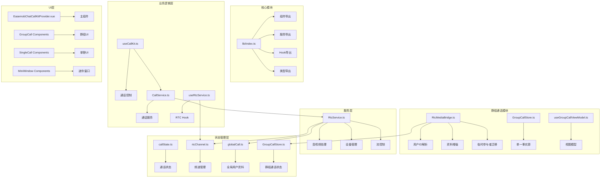
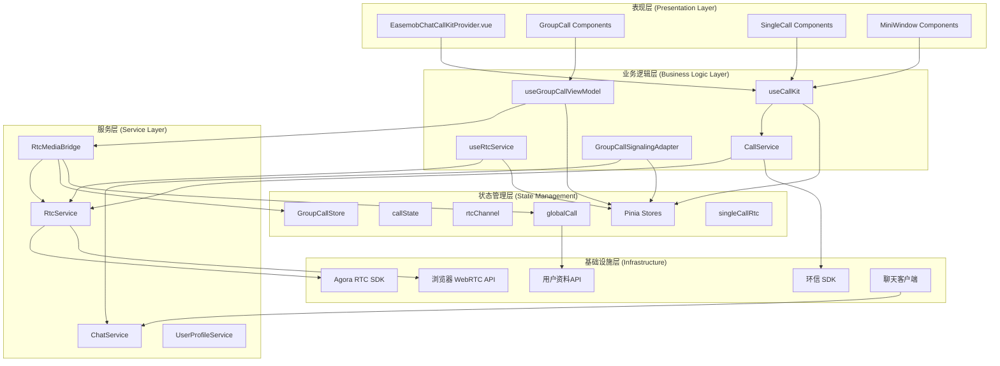
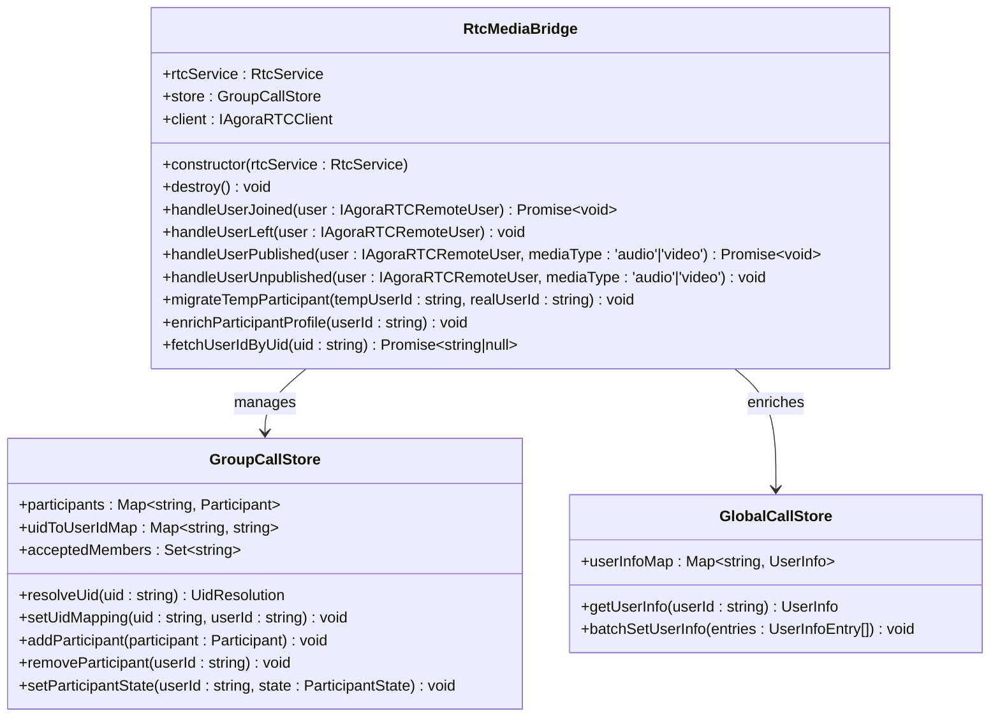
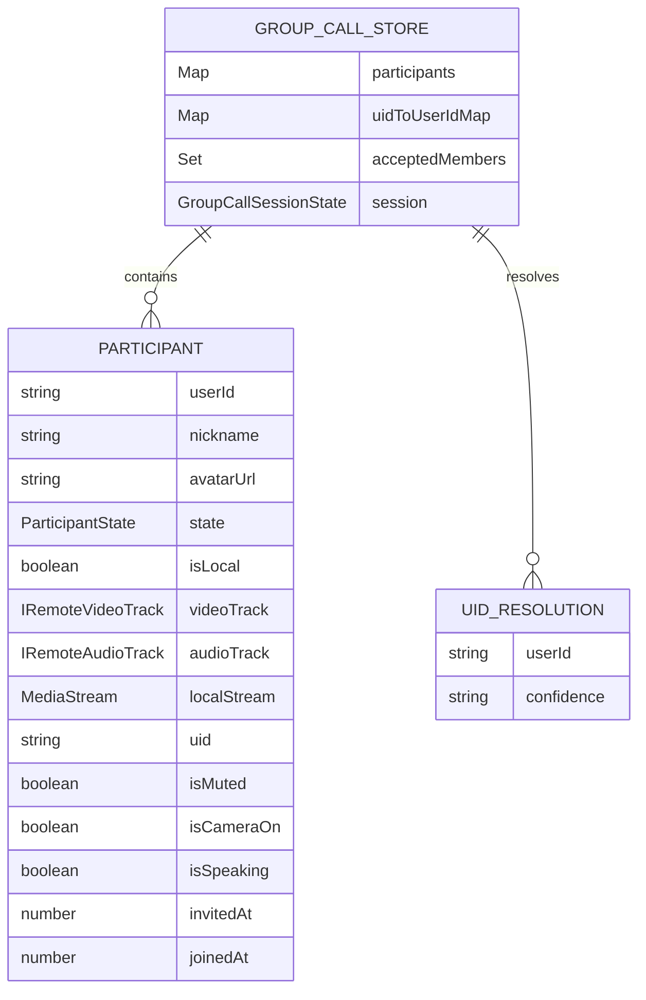
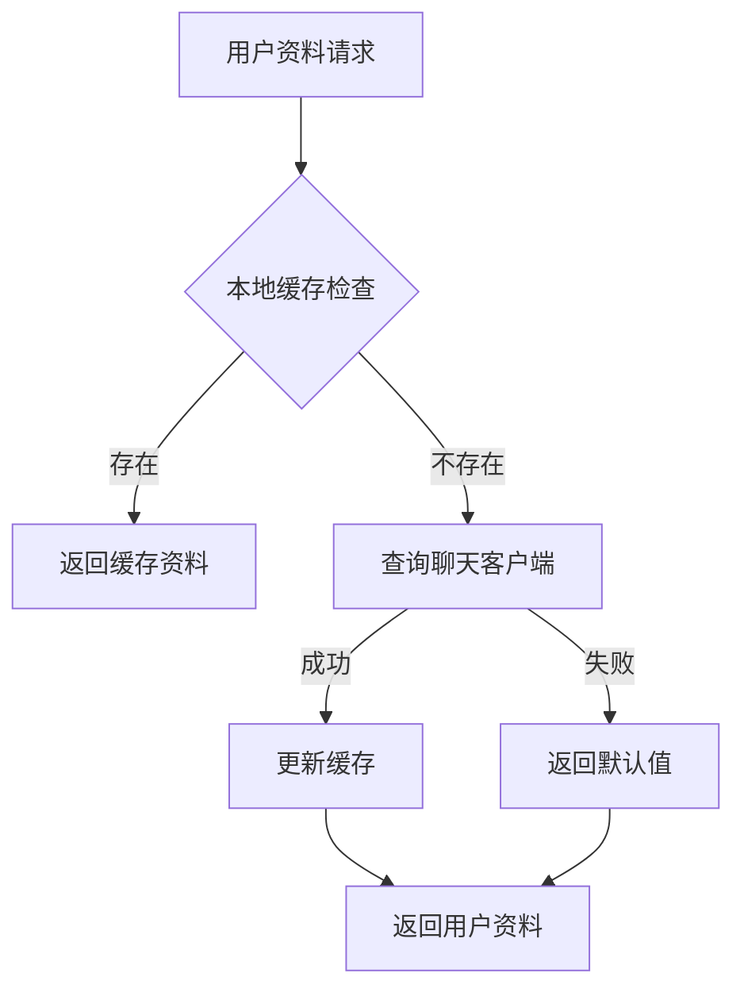
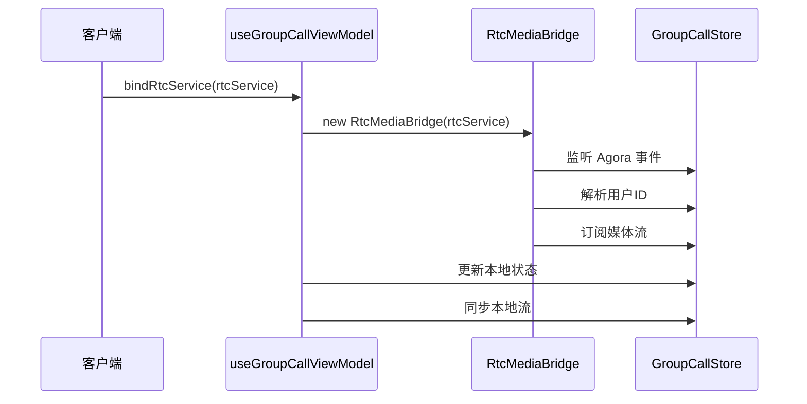
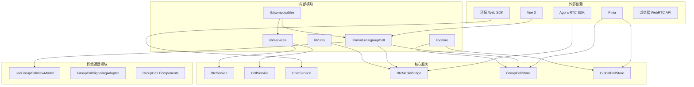

# Rtc 媒体桥接器

<cite>
**本文档引用的文件**
- [lib/modules/groupCall/media/RtcMediaBridge.ts](file://lib/modules/groupCall/media/RtcMediaBridge.ts)
- [lib/modules/groupCall/viewModel/GroupCallStore.ts](file://lib/modules/groupCall/viewModel/GroupCallStore.ts)
- [lib/modules/groupCall/types.ts](file://lib/modules/groupCall/types.ts)
- [lib/store/globalCall.ts](file://lib/store/globalCall.ts)
- [lib/store/chatClient.ts](file://lib/store/chatClient.ts)
- [lib/modules/groupCall/viewModel/useGroupCallViewModel.ts](file://lib/modules/groupCall/viewModel/useGroupCallViewModel.ts)
- [lib/modules/groupCall/index.ts](file://lib/modules/groupCall/index.ts)
- [lib/services/RtcService.ts](file://lib/services/RtcService.ts)
- [lib/services/CallService.ts](file://lib/services/CallService.ts)
- [lib/store/callState.ts](file://lib/store/callState.ts)
- [lib/store/rtcChannel.ts](file://lib/store/rtcChannel.ts)
- [lib/composables/useRtcService.ts](file://lib/composables/useRtcService.ts)
- [lib/composables/useCallKit.ts](file://lib/composables/useCallKit.ts)
- [lib/components/EasemobChatCallKitProvider.vue](file://lib/components/EasemobChatCallKitProvider.vue)
- [lib/core/events/types.ts](file://lib/core/events/types.ts)
- [lib/utils/logger.ts](file://lib/utils/logger.ts)
</cite>

## 更新摘要
**所做更改**
- 新增 RtcMediaBridge 核心组件，实现用户ID解析和资料增强功能
- 增强临时参与者迁移机制，支持动态用户映射解析
- 新增用户资料丰富化功能，从全局存储获取用户信息
- 更新群组通话状态管理架构，实现单一事实源

## 目录
1. [简介](#简介)
2. [项目结构](#项目结构)
3. [核心组件](#核心组件)
4. [架构概览](#架构概览)
5. [详细组件分析](#详细组件分析)
6. [依赖关系分析](#依赖关系分析)
7. [性能考虑](#性能考虑)
8. [故障排除指南](#故障排除指南)
9. [结论](#结论)

## 简介

Rtc Media Bridge 是一个基于 Vue 3 的实时音视频通话组件库，集成了环信即时通讯 SDK 和 Agora RTC SDK，提供了完整的音视频通话解决方案。该项目采用现代化的前端架构，使用 TypeScript、Pinia 状态管理和组合式 API 设计模式。

该组件库支持一对一和群组音视频通话，具备完善的通话状态管理、媒体设备控制、网络质量监控等功能。通过标准化的事件系统和状态管理机制，为开发者提供了一套完整的实时通信解决方案。

**更新** 新增 RtcMediaBridge 核心组件，专门负责监听 Agora 事件、订阅远程流并将媒体轨道写入状态管理器，实现用户ID解析和资料增强功能，支持临时参与者迁移。

## 项目结构

项目采用模块化设计，主要分为以下几个核心模块：

**图表来源**
- [lib/modules/groupCall/media/RtcMediaBridge.ts:1-277](file://lib/modules/groupCall/media/RtcMediaBridge.ts#L1-L277)
- [lib/modules/groupCall/viewModel/GroupCallStore.ts:1-252](file://lib/modules/groupCall/viewModel/GroupCallStore.ts#L1-L252)
- [lib/modules/groupCall/viewModel/useGroupCallViewModel.ts:200-299](file://lib/modules/groupCall/viewModel/useGroupCallViewModel.ts#L200-L299)

**章节来源**
- [lib/modules/groupCall/index.ts:1-18](file://lib/modules/groupCall/index.ts#L1-L18)
- [lib/modules/groupCall/types.ts:1-56](file://lib/modules/groupCall/types.ts#L1-L56)

## 核心组件

### 服务层组件

#### RtcService - RTC 服务核心
RtcService 是整个音视频通话系统的核心服务，负责封装所有 WebRTC 相关操作：

- **音视频设备管理**：创建、切换和控制本地音视频轨道
- **频道连接管理**：加入、离开 Agora RTC 频道
- **媒体流处理**：发布、订阅和管理远程媒体流
- **网络质量监控**：实时监控网络质量和用户音量指示
- **状态同步**：与应用状态管理系统集成

#### CallService - 通话服务
CallService 提供通话生命周期管理：

- **挂断策略**：支持多种挂断原因和策略
- **资源清理**：自动清理媒体资源和连接
- **状态重置**：重置通话状态和计时器
- **事件触发**：触发相应的业务事件

### 状态管理层组件

#### Pinia Store 系统
项目使用 Pinia 进行状态管理，包含多个专门的 store：

- **callState**：管理一对一通话的全局状态
- **rtcChannel**：管理 RTC 频道和媒体流状态
- **singleCallRtc**：管理单聊 RTC 特定状态
- **globalCall**：管理全局通话相关信息和用户资料
- **GroupCallStore**：管理群组通话的单一事实源状态

### 业务逻辑层组件

#### 组合式 API
提供易用的组合式 API：

- **useCallKit**：统一的通话控制入口
- **useRtcService**：RTC 服务的组合式 API
- **useGroupCallViewModel**：群组通话的视图模型
- **useJoinChannel**：频道加入逻辑
- **useParticipants**：参与者管理

### RtcMediaBridge - 媒体桥接器

**新增** RtcMediaBridge 是群组通话模块的核心组件，专门负责 Agora 事件监听和媒体流桥接：

- **用户ID解析**：从 GroupCallStore 映射表和 API 获取用户ID
- **资料增强**：从 GlobalCallStore 获取用户昵称和头像信息
- **临时参与者迁移**：处理临时用户占位符到真实用户的迁移
- **媒体流订阅**：统一管理远程媒体流的订阅和取消订阅
- **事件监听**：监听 user-joined、user-left、user-published 等 Agora 事件

**章节来源**
- [lib/modules/groupCall/media/RtcMediaBridge.ts:8-31](file://lib/modules/groupCall/media/RtcMediaBridge.ts#L8-L31)
- [lib/modules/groupCall/viewModel/GroupCallStore.ts:10-130](file://lib/modules/groupCall/viewModel/GroupCallStore.ts#L10-L130)
- [lib/store/globalCall.ts:8-55](file://lib/store/globalCall.ts#L8-L55)

## 架构概览

项目采用分层架构设计，各层职责清晰分离：

**图表来源**
- [lib/modules/groupCall/media/RtcMediaBridge.ts:13-31](file://lib/modules/groupCall/media/RtcMediaBridge.ts#L13-L31)
- [lib/modules/groupCall/viewModel/useGroupCallViewModel.ts:201-228](file://lib/modules/groupCall/viewModel/useGroupCallViewModel.ts#L201-L228)
- [lib/store/chatClient.ts:6-22](file://lib/store/chatClient.ts#L6-L22)

## 详细组件分析

### RtcMediaBridge 详细分析

RtcMediaBridge 是群组通话模块的核心组件，实现了完整的用户ID解析和媒体流桥接功能：

**图表来源**
- [lib/modules/groupCall/media/RtcMediaBridge.ts:13-31](file://lib/modules/groupCall/media/RtcMediaBridge.ts#L13-L31)
- [lib/modules/groupCall/viewModel/GroupCallStore.ts:10-130](file://lib/modules/groupCall/viewModel/GroupCallStore.ts#L10-L130)
- [lib/store/globalCall.ts:8-55](file://lib/store/globalCall.ts#L8-L55)

#### 用户ID解析机制

**多层解析策略**：
1. **直接映射**：首先检查 GroupCallStore 中已建立的 uid-to-userId 映射
2. **API 查询**：如果映射不存在，通过聊天客户端 API 查询用户ID
3. **临时占位**：如果仍然无法解析，创建临时用户占位符
4. **强推断**：基于 acceptedMembers 集合进行安全推断

**临时参与者迁移**：
- 当用户ID解析成功后，自动迁移临时占位符的数据
- 保留原有的状态、媒体轨道和时间戳信息
- 更新用户资料信息（昵称、头像等）

**章节来源**
- [lib/modules/groupCall/media/RtcMediaBridge.ts:65-110](file://lib/modules/groupCall/media/RtcMediaBridge.ts#L65-L110)
- [lib/modules/groupCall/media/RtcMediaBridge.ts:214-243](file://lib/modules/groupCall/media/RtcMediaBridge.ts#L214-L243)
- [lib/modules/groupCall/viewModel/GroupCallStore.ts:112-130](file://lib/modules/groupCall/viewModel/GroupCallStore.ts#L112-L130)

#### 媒体流订阅管理

**统一订阅策略**：
- 关闭 RtcService 内部自动订阅，避免重复订阅导致 INVALID_REMOTE_USER 错误
- 通过 RtcMediaBridge 统一管理远程用户的媒体流订阅
- 使用 uid 而非 user 对象进行订阅，确保 SDK 内部引用一致性

**媒体轨道写入**：
- 优先从 SDK remoteUsers 中获取最新实例
- 回退到 RtcService 的轨道获取方法
- 自动更新 GroupCallStore 中的媒体轨道状态

**章节来源**
- [lib/modules/groupCall/media/RtcMediaBridge.ts:122-184](file://lib/modules/groupCall/media/RtcMediaBridge.ts#L122-L184)
- [lib/services/RtcService.ts:108-122](file://lib/services/RtcService.ts#L108-L122)

### GroupCallStore 详细分析

GroupCallStore 实现了群组通话的单一事实源，替代了旧架构中的分散状态管理：

**图表来源**
- [lib/modules/groupCall/viewModel/GroupCallStore.ts:10-40](file://lib/modules/groupCall/viewModel/GroupCallStore.ts#L10-L40)
- [lib/modules/groupCall/types.ts:14-39](file://lib/modules/groupCall/types.ts#L14-L39)

#### 状态管理优化

**响应式更新机制**：
- 使用 Vue 3 的 ref 和 computed 实现响应式状态管理
- 通过重新赋值 Map 来触发深层次的响应式更新
- 提供丰富的 getter 方法简化状态访问

**参与者生命周期管理**：
- 完整的参与者状态转换：invited → accepted → joinedRtc → publishing → left
- 自动时间戳管理（invitedAt、joinedAt）
- 智能状态推断和迁移

**章节来源**
- [lib/modules/groupCall/viewModel/GroupCallStore.ts:78-92](file://lib/modules/groupCall/viewModel/GroupCallStore.ts#L78-L92)
- [lib/modules/groupCall/viewModel/GroupCallStore.ts:132-157](file://lib/modules/groupCall/viewModel/GroupCallStore.ts#L132-L157)

### GlobalCallStore 详细分析

GlobalCallStore 提供跨通话域的共享状态，特别是用户资料映射：

**图表来源**
- [lib/store/globalCall.ts:42-49](file://lib/store/globalCall.ts#L42-L49)
- [lib/modules/groupCall/media/RtcMediaBridge.ts:248-257](file://lib/modules/groupCall/media/RtcMediaBridge.ts#L248-L257)

#### 资料增强功能

**用户信息获取**：
- 支持批量设置用户信息，提高性能
- 提供默认值处理，避免空值问题
- 缓存机制减少重复查询

**跨模块协作**：
- RtcMediaBridge 通过 GlobalCallStore 获取用户资料
- useGroupCallViewModel 在邀请时预加载用户信息
- 统一的用户资料来源确保数据一致性

**章节来源**
- [lib/store/globalCall.ts:14-39](file://lib/store/globalCall.ts#L14-L39)
- [lib/modules/groupCall/media/RtcMediaBridge.ts:220-239](file://lib/modules/groupCall/media/RtcMediaBridge.ts#L220-L239)

### useGroupCallViewModel 详细分析

useGroupCallViewModel 提供了群组通话的完整业务逻辑：

**图表来源**
- [lib/modules/groupCall/viewModel/useGroupCallViewModel.ts:201-228](file://lib/modules/groupCall/viewModel/useGroupCallViewModel.ts#L201-L228)
- [lib/modules/groupCall/media/RtcMediaBridge.ts:33-63](file://lib/modules/groupCall/media/RtcMediaBridge.ts#L33-L63)

#### 绑定和解绑机制

**生命周期管理**：
- 支持动态绑定和解绑 RtcService
- 自动处理媒体桥接器的创建和销毁
- 保持本地用户状态的一致性

**本地状态同步**：
- 自动标记本地用户为 joinedRtc 状态
- 同步本地视频流到状态管理器
- 处理本地媒体设备状态变化

**章节来源**
- [lib/modules/groupCall/viewModel/useGroupCallViewModel.ts:201-228](file://lib/modules/groupCall/viewModel/useGroupCallViewModel.ts#L201-L228)
- [lib/modules/groupCall/viewModel/useGroupCallViewModel.ts:160-179](file://lib/modules/groupCall/viewModel/useGroupCallViewModel.ts#L160-L179)

## 依赖关系分析

项目采用了清晰的依赖关系设计：

**图表来源**
- [lib/modules/groupCall/media/RtcMediaBridge.ts:1-6](file://lib/modules/groupCall/media/RtcMediaBridge.ts#L1-L6)
- [lib/modules/groupCall/viewModel/GroupCallStore.ts:1-4](file://lib/modules/groupCall/viewModel/GroupCallStore.ts#L1-L4)
- [lib/store/chatClient.ts:1-4](file://lib/store/chatClient.ts#L1-L4)

### 核心依赖关系

**RtcMediaBridge 依赖**：
- 依赖 GroupCallStore 进行状态管理
- 依赖 GlobalCallStore 获取用户资料
- 依赖 RtcService 进行媒体流操作
- 依赖 ChatClientStore 获取用户ID映射

**状态管理依赖**：
- GroupCallStore 作为单一事实源
- GlobalCallStore 提供跨域用户资料
- useGroupCallViewModel 协调业务逻辑
- RtcMediaBridge 处理底层事件

**工具层依赖**：
- Logger 提供统一的日志记录功能
- 各种工具函数提供通用的功能支持

**章节来源**
- [lib/modules/groupCall/media/RtcMediaBridge.ts:1-6](file://lib/modules/groupCall/media/RtcMediaBridge.ts#L1-L6)
- [lib/modules/groupCall/viewModel/GroupCallStore.ts:1-4](file://lib/modules/groupCall/viewModel/GroupCallStore.ts#L1-L4)

## 性能考虑

### 内存管理优化

项目在内存管理方面采用了多项优化措施：

**资源清理机制**：
- RtcMediaBridge 在销毁时自动清理事件监听器
- 恢复 RtcService 的自动订阅功能
- GroupCallStore 使用 Map 数据结构，支持高效的增删改查

**状态管理优化**：
- Vue 3 响应式系统的深度优化
- 通过重新赋值触发深层次响应式更新
- 避免在 Pinia state 中存储大型对象

### 网络性能优化

**连接管理**：
- 统一的媒体流订阅管理，避免重复订阅
- 智能的用户ID解析缓存机制
- 动态的用户资料获取策略

**媒体流优化**：
- 优先使用 SDK 内部的最新实例
- 智能的媒体轨道创建和销毁
- 支持设备切换时的平滑过渡

### 用户体验优化

**响应式设计**：
- 实时的状态更新和 UI 响应
- 事件驱动的用户界面更新
- 流畅的动画和过渡效果

**错误处理**：
- 完善的错误捕获和处理机制
- 用户友好的错误提示
- 自动恢复和降级策略

## 故障排除指南

### 常见问题诊断

**用户ID解析问题**：
- 检查 GroupCallStore 的 uid-to-userId 映射是否正确
- 验证聊天客户端 API 的 getUserIdByRTCUIds 方法
- 确认临时占位符的迁移是否正常

**媒体流订阅问题**：
- 检查 RtcService 的自动订阅功能
- 验证 Agora SDK 的 remoteUsers 引用一致性
- 确认媒体轨道的正确写入

**状态同步问题**：
- 检查 Pinia store 的初始化状态
- 验证事件监听器的注册和注销
- 确认组件的生命周期管理

### 调试工具和方法

**日志系统**：
- 使用 Logger 类进行详细的日志记录
- 支持不同级别的日志输出
- 提供调试模式和详细模式

**状态监控**：
- 通过浏览器的 Vue DevTools 监控状态变化
- 使用 Agora 控制台监控连接状态
- 实时查看媒体流统计信息

**章节来源**
- [lib/utils/logger.ts:50-213](file://lib/utils/logger.ts#L50-L213)
- [lib/modules/groupCall/media/RtcMediaBridge.ts:33-63](file://lib/modules/groupCall/media/RtcMediaBridge.ts#L33-L63)

### 最佳实践建议

**开发阶段**：
- 使用调试模式进行开发和测试
- 建立完整的单元测试和集成测试
- 定期进行性能基准测试

**生产环境**：
- 配置适当的日志级别
- 监控关键指标和性能数据
- 建立故障转移和恢复机制

**维护建议**：
- 定期更新依赖包
- 保持代码结构的整洁
- 及时处理安全漏洞和兼容性问题

## 结论

Rtc Media Bridge 是一个设计精良的实时音视频通话组件库，具有以下显著特点：

**架构优势**：
- 清晰的分层架构设计，职责分离明确
- 响应式状态管理，易于维护和扩展
- 组合式 API 设计，提供良好的开发体验
- **新增** 专用的媒体桥接器，实现用户ID解析和资料增强

**功能完整性**：
- 支持一对一和群组音视频通话
- 完整的通话生命周期管理
- 丰富的媒体设备控制功能
- **新增** 智能的用户ID解析和临时参与者迁移机制

**技术先进性**：
- 采用最新的 Vue 3 技术栈
- 集成主流的第三方 SDK
- 提供完善的 TypeScript 类型支持
- **新增** 基于单一事实源的状态管理架构

**可扩展性**：
- 模块化的设计便于功能扩展
- 插件化的架构支持定制开发
- 良好的 API 设计便于二次开发
- **新增** 支持临时参与者迁移的灵活架构

**新增** RtcMediaBridge 的引入显著提升了群组通话的用户体验，通过智能的用户ID解析、资料增强和临时参与者迁移机制，解决了传统架构中的用户标识混乱和状态不一致问题。该组件库为实时通信应用开发提供了坚实的基础，开发者可以在此基础上快速构建功能丰富、性能优异的音视频通话应用。