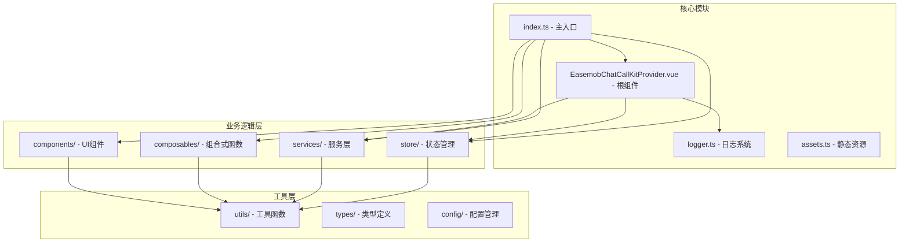
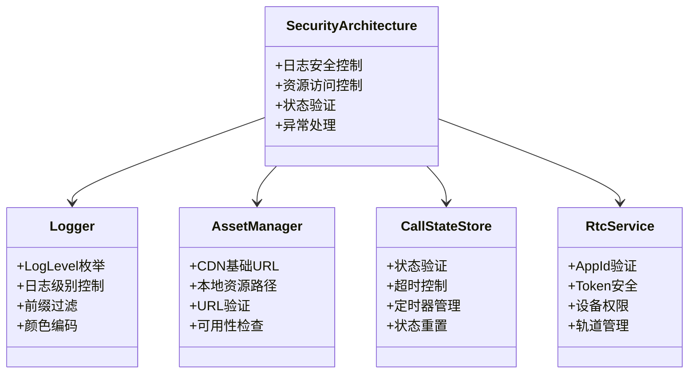
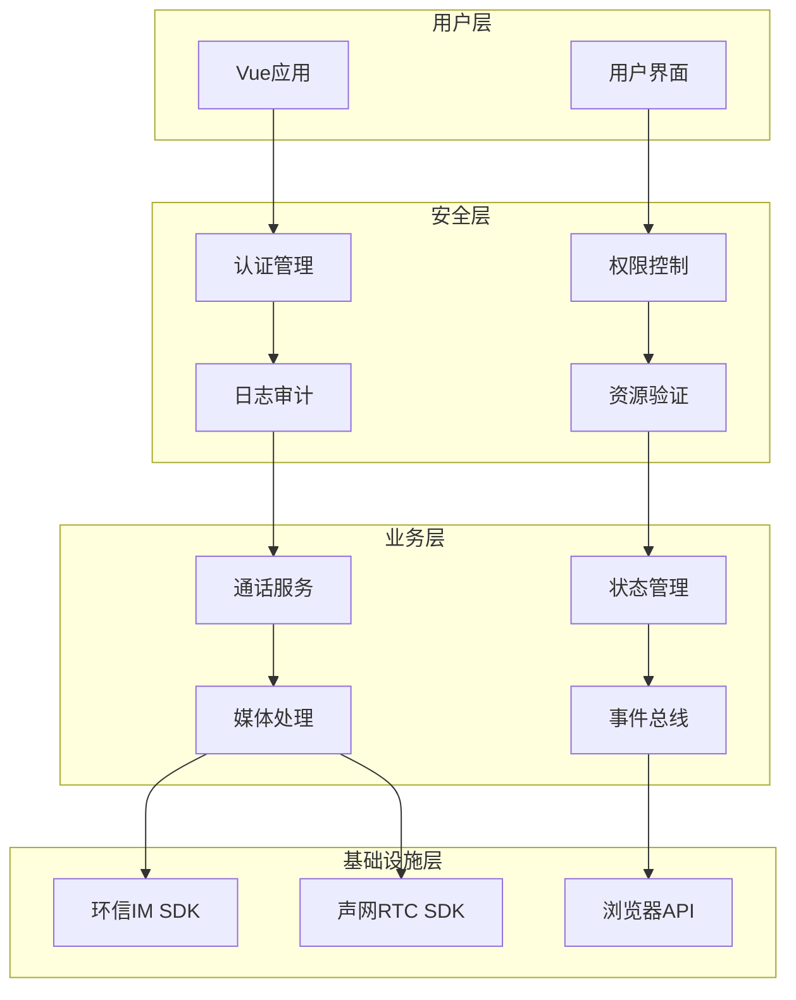
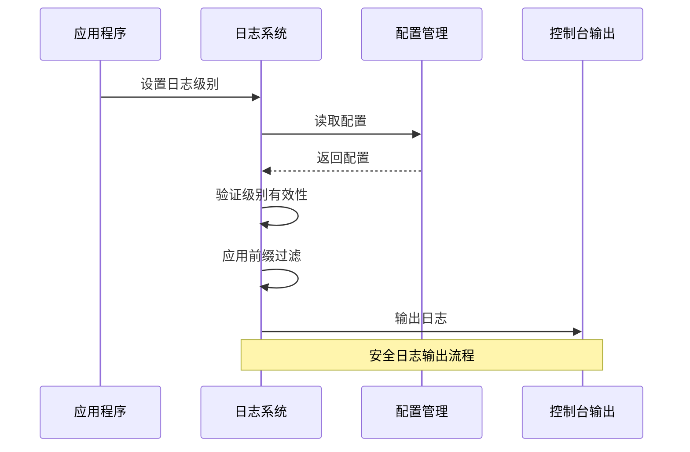
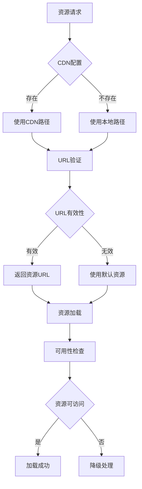
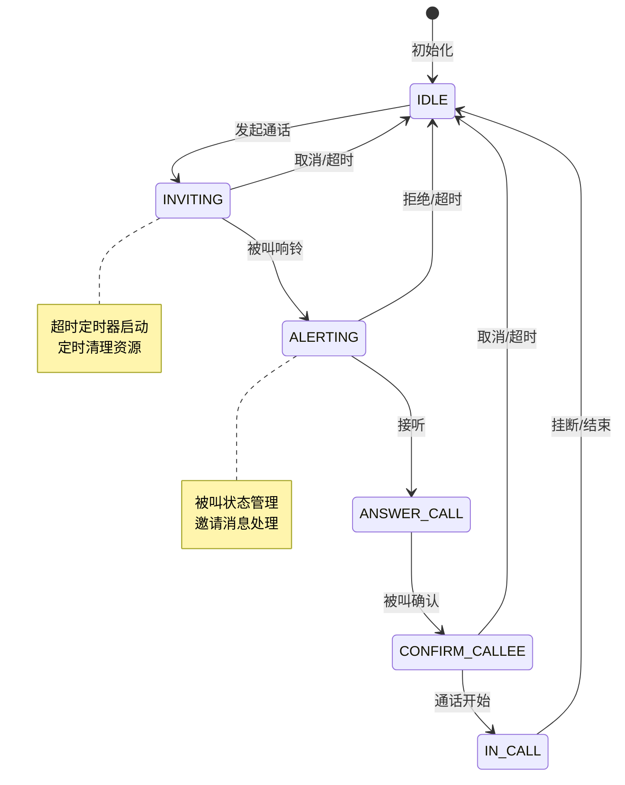
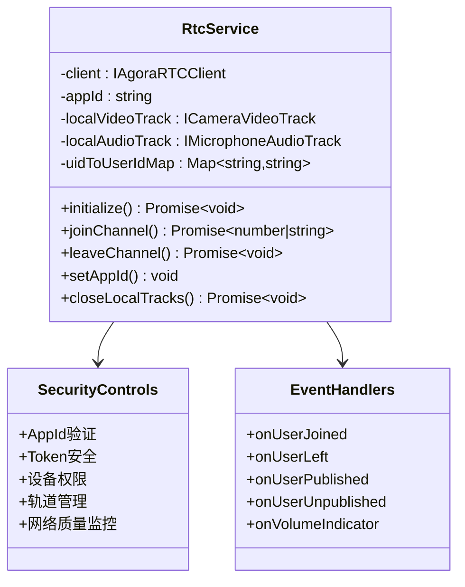
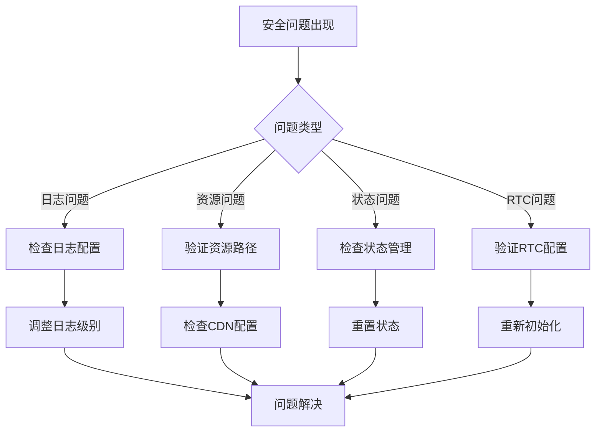
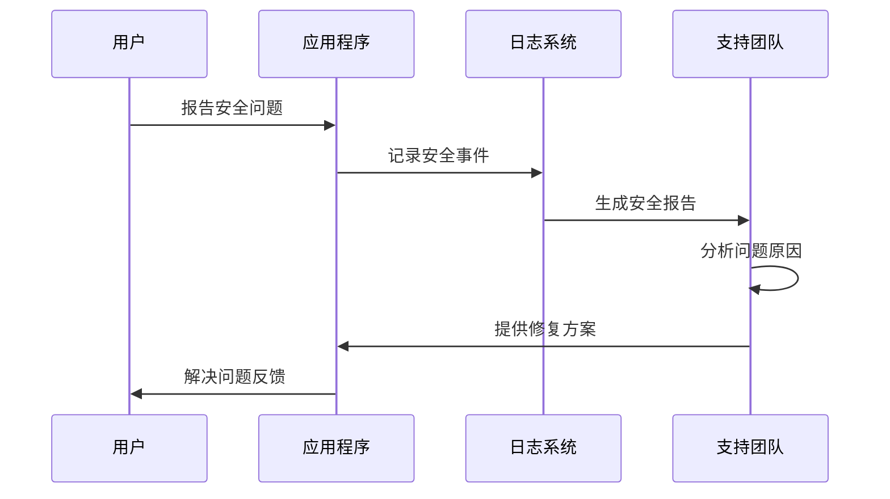

# 安全最佳实践

<cite>
**本文档引用的文件**
- [package.json](file://package.json)
- [index.ts](file://lib/index.ts)
- [EasemobChatCallKitProvider.vue](file://lib/components/EasemobChatCallKitProvider.vue)
- [logger.ts](file://lib/utils/logger.ts)
- [assets.ts](file://lib/config/assets.ts)
- [types.ts](file://lib/types.ts)
- [callState.ts](file://lib/store/callState.ts)
- [RtcService.ts](file://lib/services/RtcService.ts)
- [quick_start.md](file://QUICK_START.md)
- [usage.md](file://USAGE.md)
- [skills/callkit-integration.md](file://skills/callkit-integration.md)
</cite>

## 目录
1. [简介](#简介)
2. [项目结构](#项目结构)
3. [核心组件](#核心组件)
4. [架构概览](#架构概览)
5. [详细组件分析](#详细组件分析)
6. [依赖分析](#依赖分析)
7. [性能考虑](#性能考虑)
8. [故障排除指南](#故障排除指南)
9. [结论](#结论)

## 简介

Easemob Chat CallKit Vue3 是一个基于 Vue 3 的即时通讯音视频通话解决方案，集成了环信 IM SDK 和声网 RTC SDK。该项目遵循严格的安全最佳实践，确保在音视频通话过程中的数据安全、隐私保护和系统稳定性。

该库提供了完整的音视频通话功能，包括单人通话、群组通话、通话状态管理、媒体流控制等核心功能，同时内置了完善的日志系统和安全机制。

## 项目结构



**图表来源**
- [index.ts:1-99](file://lib/index.ts#L1-L99)
- [EasemobChatCallKitProvider.vue:1-155](file://lib/components/EasemobChatCallKitProvider.vue#L1-L155)

**章节来源**
- [index.ts:1-99](file://lib/index.ts#L1-L99)
- [package.json:1-76](file://package.json#L1-L76)

## 核心组件

### 安全架构设计

项目采用分层安全架构，每个层级都有相应的安全控制措施：



**图表来源**
- [logger.ts:1-231](file://lib/utils/logger.ts#L1-L231)
- [assets.ts:1-75](file://lib/config/assets.ts#L1-L75)
- [callState.ts:1-200](file://lib/store/callState.ts#L1-L200)
- [RtcService.ts:1-200](file://lib/services/RtcService.ts#L1-L200)

### 安全配置管理

项目提供了灵活的安全配置选项：

| 配置项 | 类型 | 默认值 | 安全作用 | 说明 |
|--------|------|--------|----------|------|
| debug | boolean | false | 日志级别控制 | 生产环境建议关闭 |
| logLevel | LogLevel | LogLevel.ERROR | 日志输出控制 | 精确控制日志敏感度 |
| enableRingtone | boolean | true | 音频安全控制 | 防止意外音频泄露 |
| resizable | boolean | true | UI安全控制 | 限制窗口尺寸变更 |
| draggable | boolean | true | UI安全控制 | 防止恶意拖拽 |

**章节来源**
- [types.ts:39-65](file://lib/types.ts#L39-L65)
- [logger.ts:40-47](file://lib/utils/logger.ts#L40-L47)

## 架构概览



**图表来源**
- [EasemobChatCallKitProvider.vue:1-155](file://lib/components/EasemobChatCallKitProvider.vue#L1-L155)
- [index.ts:82-99](file://lib/index.ts#L82-L99)

## 详细组件分析

### 日志系统安全分析

日志系统是安全防护的重要组成部分，项目实现了多层次的日志安全控制：



**图表来源**
- [logger.ts:69-94](file://lib/utils/logger.ts#L69-L94)
- [logger.ts:122-146](file://lib/utils/logger.ts#L122-L146)

#### 日志级别安全控制

日志系统实现了严格的级别控制机制：

| 级别 | 数值 | 安全级别 | 用途 | 生产环境建议 |
|------|------|----------|------|-------------|
| ERROR | 0 | 高 | 错误信息 | 始终开启 |
| WARN | 1 | 高 | 警告信息 | 始终开启 |
| INFO | 2 | 中 | 一般信息 | 建议开启 |
| DEBUG | 3 | 低 | 调试信息 | 开发环境 |
| VERBOSE | 4 | 低 | 详细信息 | 开发环境 |

**章节来源**
- [logger.ts:1-38](file://lib/utils/logger.ts#L1-L38)
- [logger.ts:148-186](file://lib/utils/logger.ts#L148-L186)

### 资源安全管理

静态资源管理系统提供了多层安全保护：



**图表来源**
- [assets.ts:19-26](file://lib/config/assets.ts#L19-L26)
- [assets.ts:59-74](file://lib/config/assets.ts#L59-L74)

#### 资源路径安全策略

资源管理系统实现了智能路径选择机制：

| 路径类型 | 优先级 | 安全特性 | 适用场景 |
|----------|--------|----------|----------|
| CDN路径 | 高 | 内容缓存、CDN加速 | 生产环境、高并发 |
| 本地路径 | 中 | 本地缓存、离线可用 | 开发环境、内网部署 |
| 默认路径 | 低 | 固定回退、安全保证 | 所有环境 |

**章节来源**
- [assets.ts:10-75](file://lib/config/assets.ts#L10-L75)

### 通话状态安全控制

通话状态管理系统实现了严格的状态验证和超时控制：



**图表来源**
- [callState.ts:105-136](file://lib/store/callState.ts#L105-L136)
- [callState.ts:141-159](file://lib/store/callState.ts#L141-L159)

#### 状态转换安全验证

状态管理系统实现了完整的安全验证机制：

| 状态转换 | 验证点 | 安全措施 | 异常处理 |
|----------|--------|----------|----------|
| IDLE → INVITING | 参数验证 | 验证目标用户、通话类型 | 抛出验证异常 |
| INVITING → ALERTING | 邀请确认 | 检查邀请状态、超时控制 | 触发超时事件 |
| ALERTING → ANSWER_CALL | 接听验证 | 验证接听权限、状态一致性 | 更新通话信息 |
| IN_CALL → IDLE | 结束验证 | 检查通话时长、资源清理 | 触发结束事件 |

**章节来源**
- [callState.ts:36-81](file://lib/store/callState.ts#L36-L81)
- [callState.ts:112-136](file://lib/store/callState.ts#L112-L136)

### RTC服务安全控制

RTC服务实现了全面的安全控制机制：



**图表来源**
- [RtcService.ts:51-105](file://lib/services/RtcService.ts#L51-L105)
- [RtcService.ts:149-178](file://lib/services/RtcService.ts#L149-L178)

#### RTC安全配置

RTC服务提供了完善的安全配置选项：

| 配置项 | 类型 | 默认值 | 安全作用 | 说明 |
|--------|------|--------|----------|------|
| appId | string | 必填 | 应用标识验证 | 防止非法应用接入 |
| encoderConfig | VideoEncoderConfigurationPreset | '720p' | 编码安全控制 | 限制视频质量 |
| autoSubscribe | boolean | true | 流量控制 | 防止过度带宽使用 |
| enableRingtone | boolean | true | 音频安全 | 防止意外音频泄露 |

**章节来源**
- [RtcService.ts:29-49](file://lib/services/RtcService.ts#L29-L49)
- [RtcService.ts:107-128](file://lib/services/RtcService.ts#L107-L128)

## 依赖分析

```mermaid
graph LR
subgraph "运行时依赖"
A[vue ^3.0.0]
B[pinia ^3.0.3]
C[easemob-websdk ^4.12.0]
D[agora-rtc-sdk-ng ^4.14.0]
end
subgraph "开发时依赖"
E[typescript ~5.8.3]
F[vite ^7.1.2]
G[@vitejs/plugin-vue ^6.0.1]
H[vue-tsc ^3.0.5]
end
subgraph "项目依赖"
I[Easemob Chat CallKit]
J[Vue3插件]
K[音视频通话]
L[即时通讯]
end
A --> I
B --> I
C --> I
D --> I
E --> J
F --> J
G --> J
H --> J
```

**图表来源**
- [package.json:33-52](file://package.json#L33-L52)

### 依赖安全策略

项目采用了严格的依赖管理策略：

| 依赖类型 | 版本范围 | 安全考虑 | 更新策略 |
|----------|----------|----------|----------|
| Vue | ^3.0.0 | 生态稳定、社区支持 | 定期更新 |
| Pinia | ^3.0.3 | 状态管理标准、安全性高 | 跟随Vue版本 |
| Easemob WebSDK | ^4.12.0 | 官方SDK、安全可靠 | 保持最新 |
| Agora RTC SDK | ^4.14.0 | 专业RTC、功能完善 | 适配需求 |

**章节来源**
- [package.json:1-76](file://package.json#L1-L76)

## 性能考虑

### 安全性能优化

项目在保证安全性的前提下，实现了多项性能优化：

1. **懒加载机制**：组件按需加载，减少初始包体积
2. **资源缓存策略**：静态资源智能缓存，提升加载速度
3. **状态管理优化**：精确的状态更新，避免不必要的重渲染
4. **事件处理优化**：高效的事件监听和处理机制

### 性能监控指标

| 指标类型 | 目标值 | 监控方法 | 优化策略 |
|----------|--------|----------|----------|
| 首次加载时间 | < 3秒 | 包体积分析 | 代码分割、懒加载 |
| 通话建立时间 | < 2秒 | 性能测试 | 连接池优化 |
| 帧率稳定性 | > 25fps | 帧率监控 | 编码参数调优 |
| 内存使用 | < 100MB | 内存分析 | 资源及时释放 |

## 故障排除指南

### 常见安全问题及解决方案



#### 安全配置检查清单

| 检查项目 | 检查方法 | 安全要求 | 通过标准 |
|----------|----------|----------|----------|
| 日志配置 | 查看日志级别 | 生产环境仅ERROR级别 | 正确配置 |
| 资源路径 | 验证CDN设置 | 资源可访问性 | 可正常加载 |
| 状态管理 | 检查状态重置 | 状态一致性 | 正常重置 |
| RTC配置 | 验证AppId设置 | AppId有效性 | 配置正确 |

**章节来源**
- [skills/callkit-integration.md:204-221](file://skills/callkit-integration.md#L204-L221)
- [quick_start.md:48-53](file://QUICK_START.md#L48-L53)

### 安全事件响应流程



## 结论

Easemob Chat CallKit Vue3 项目在设计和实现过程中充分考虑了安全性，建立了多层次的安全防护体系。通过严格的日志管理、资源控制、状态验证和RTC安全机制，确保了音视频通话过程中的数据安全和隐私保护。

### 主要安全特性总结

1. **完善的日志安全系统**：可控的日志级别、前缀过滤、颜色编码
2. **智能资源管理**：CDN与本地资源的智能切换、URL验证、可用性检查
3. **严格的状态控制**：状态验证、超时管理、资源清理
4. **全面的RTC安全**：AppId验证、Token安全、设备权限控制
5. **健壮的依赖管理**：版本锁定、安全更新、兼容性保证

### 最佳实践建议

1. **生产环境配置**：关闭调试模式、限制日志级别、启用CDN缓存
2. **资源安全**：验证所有外部资源、使用HTTPS协议、定期检查可用性
3. **状态管理**：及时清理状态、监控超时、处理异常情况
4. **依赖维护**：定期更新依赖、监控安全漏洞、遵循版本兼容性
5. **监控告警**：建立安全监控、设置异常告警、定期安全审计

通过遵循这些安全最佳实践，可以确保音视频通话系统的稳定性和安全性，为用户提供可靠的通信体验。