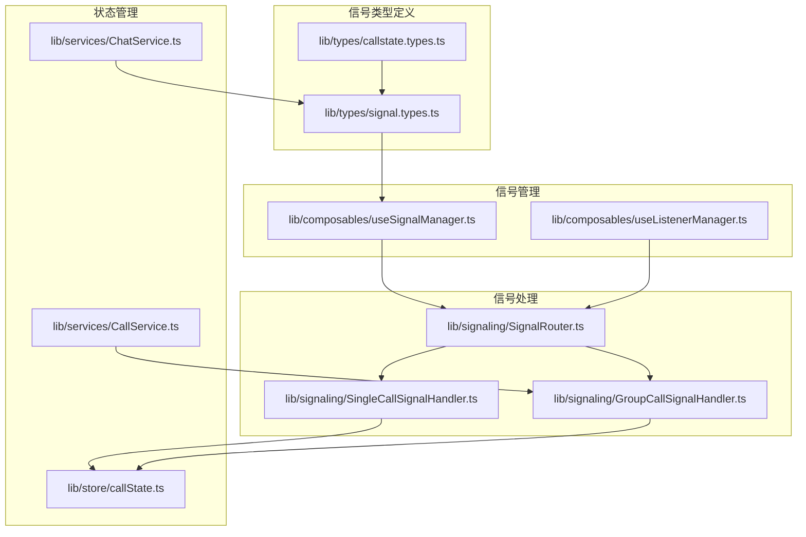
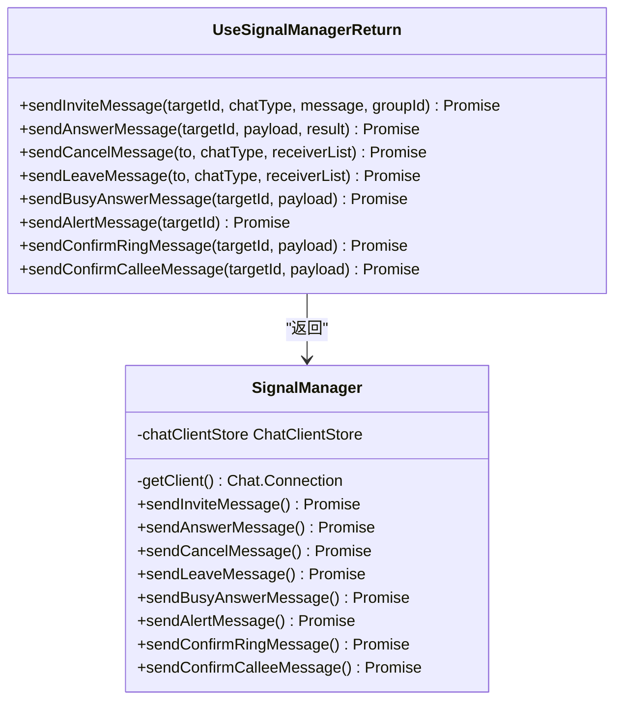
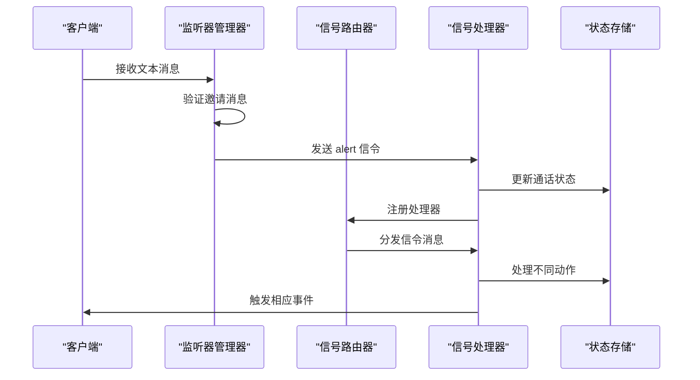
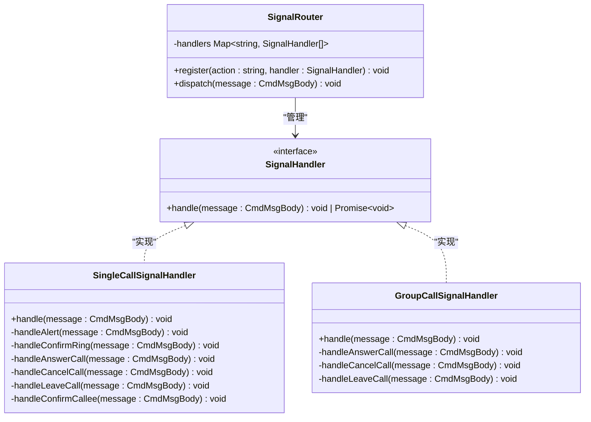
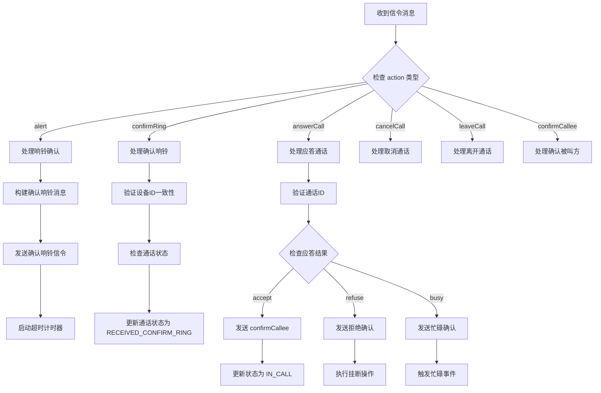
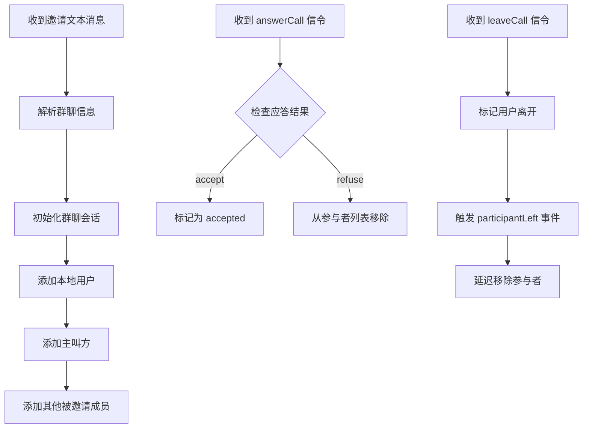
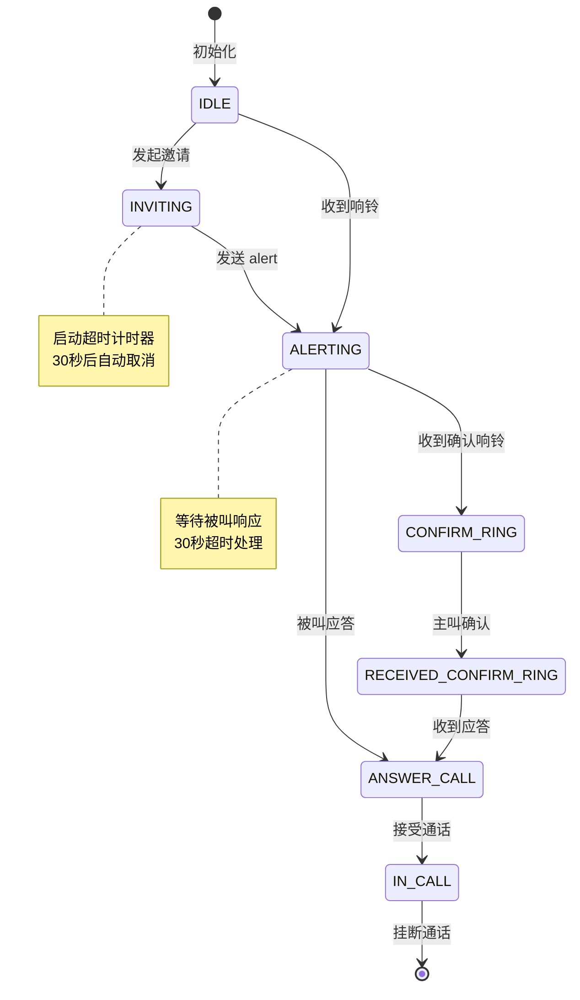
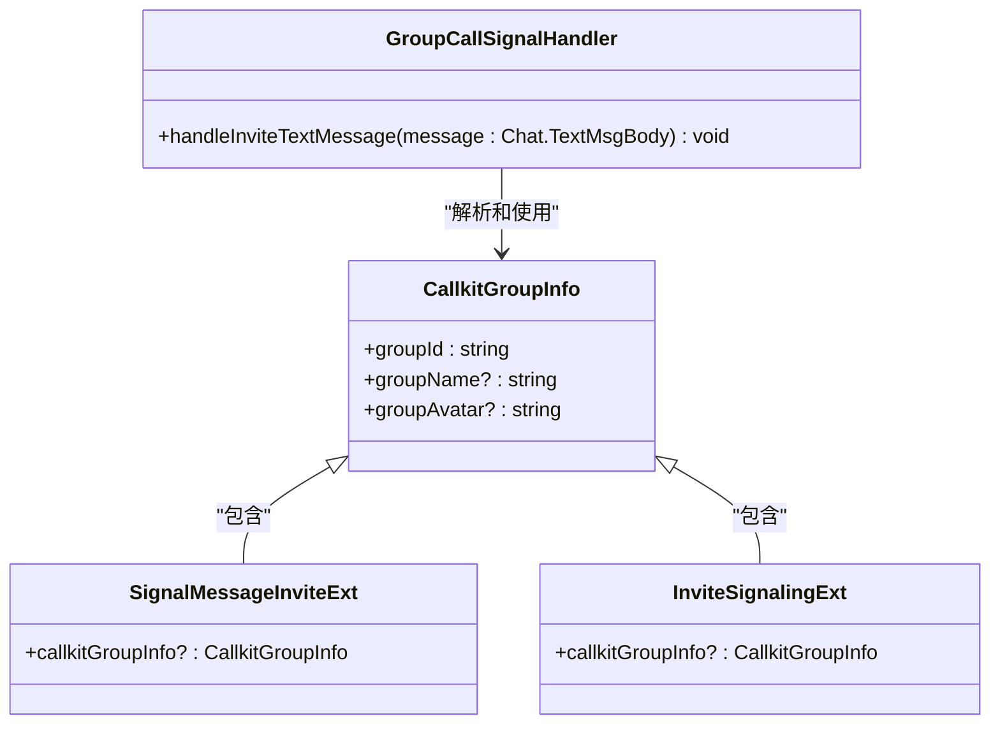
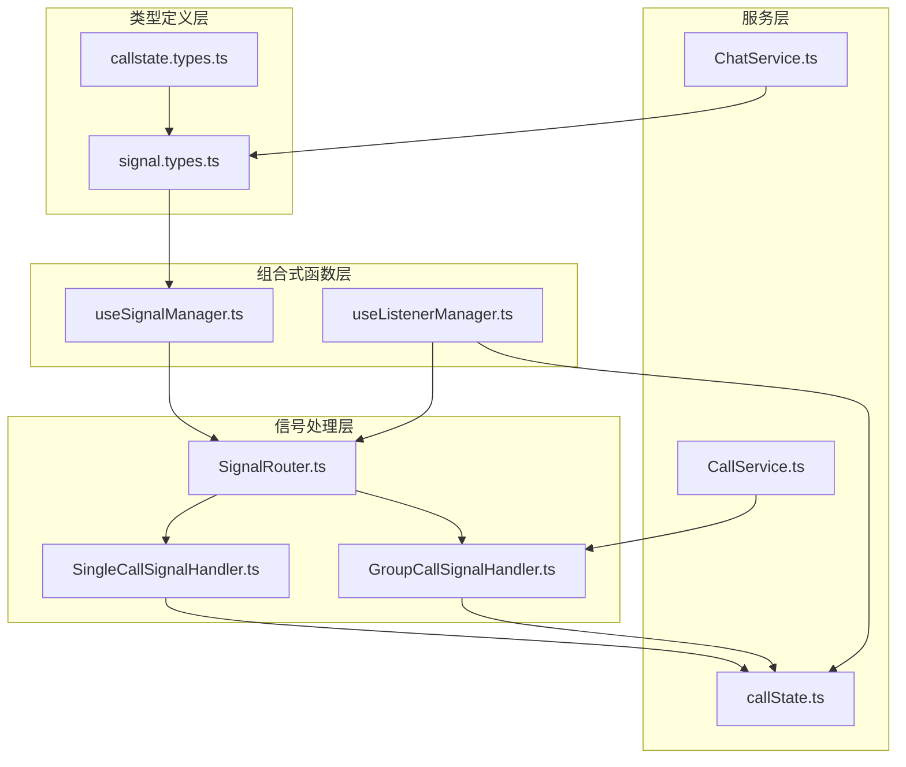

# 信号类型

<cite>
**本文档引用的文件**
- [lib/types/signal.types.ts](file://lib/types/signal.types.ts)
- [lib/types/callstate.types.ts](file://lib/types/callstate.types.ts)
- [lib/composables/useSignalManager.ts](file://lib/composables/useSignalManager.ts)
- [lib/composables/useListenerManager.ts](file://lib/composables/useListenerManager.ts)
- [lib/signaling/SignalRouter.ts](file://lib/signaling/SignalRouter.ts)
- [lib/signaling/SingleCallSignalHandler.ts](file://lib/signaling/SingleCallSignalHandler.ts)
- [lib/signaling/GroupCallSignalHandler.ts](file://lib/signaling/GroupCallSignalHandler.ts)
- [lib/store/callState.ts](file://lib/store/callState.ts)
- [lib/services/ChatService.ts](file://lib/services/ChatService.ts)
- [lib/services/CallService.ts](file://lib/services/CallService.ts)
</cite>

## 更新摘要
**所做更改**
- 新增 callkitGroupInfo 字段的详细说明和使用场景
- 更新群组通话信息传递机制的架构分析
- 增强群组通话状态管理和参与者信息处理
- 完善信令类型系统的群组通话支持

## 目录
1. [简介](#简介)
2. [项目结构](#项目结构)
3. [核心组件](#核心组件)
4. [架构概览](#架构概览)
5. [详细组件分析](#详细组件分析)
6. [依赖关系分析](#依赖关系分析)
7. [性能考虑](#性能考虑)
8. [故障排除指南](#故障排除指南)
9. [结论](#结论)

## 简介

本文档深入分析了 Easemob Uikit CallKit Vue3 项目中的信号类型系统。该项目实现了完整的实时通信信令处理机制，包括一对一通话和群组通话的完整信令流程。

项目的核心在于其精心设计的信号类型系统，该系统通过 TypeScript 接口定义了各种信令消息的数据结构，并通过路由器模式实现了高效的信令分发机制。

**更新** 新增了对 callkitGroupInfo 字段的支持，该字段用于在群组通话场景中传递群组信息，增强了群组通话的用户体验和功能完整性。

## 项目结构

项目采用模块化的架构设计，主要包含以下关键目录：

**图表来源**
- [lib/types/signal.types.ts:1-216](file://lib/types/signal.types.ts#L1-L216)
- [lib/composables/useSignalManager.ts:1-354](file://lib/composables/useSignalManager.ts#L1-L354)
- [lib/signaling/SignalRouter.ts:1-37](file://lib/signaling/SignalRouter.ts#L1-L37)

**章节来源**
- [lib/types/signal.types.ts:1-216](file://lib/types/signal.types.ts#L1-L216)
- [lib/composables/useSignalManager.ts:1-354](file://lib/composables/useSignalManager.ts#L1-L354)

## 核心组件

### 信号类型系统

信号类型系统基于 TypeScript 接口定义，提供了强类型的安全性保证：

#### 基础信令扩展接口
- **BaseSignalingExt**: 所有信令消息的基础接口，包含 `action`、`callId`、`ts`、`msgType` 字段
- **SignalMessageInviteExt**: 邀请消息的完整扩展字段定义

#### 特定信令类型
- **AlertSignalingExt**: 响铃确认信令
- **ConfirmRingSignalingExt**: 确认响铃信令
- **AnswerCallSignalingExt**: 应答通话信令
- **ConfirmCalleeSignalingExt**: 确认被叫方信令
- **CancelCallSignalingExt**: 取消通话信令
- **LeaveCallSignalingExt**: 离开通话信令

#### 群组通话增强字段
- **callkitGroupInfo**: 新增的群组信息字段，包含 `groupId`、`groupName`、`groupAvatar` 属性
- 支持群组通话场景中的信息传递和状态同步

**章节来源**
- [lib/types/signal.types.ts:57-200](file://lib/types/signal.types.ts#L57-L200)
- [lib/types/callstate.types.ts:33-40](file://lib/types/callstate.types.ts#L33-L40)

### 信令管理器

`useSignalManager` 提供了统一的信令发送接口：

**图表来源**
- [lib/composables/useSignalManager.ts:7-42](file://lib/composables/useSignalManager.ts#L7-L42)

**章节来源**
- [lib/composables/useSignalManager.ts:50-354](file://lib/composables/useSignalManager.ts#L50-L354)

## 架构概览

项目采用了经典的观察者模式和路由器模式相结合的架构：

**图表来源**
- [lib/composables/useListenerManager.ts:201-262](file://lib/composables/useListenerManager.ts#L201-L262)
- [lib/signaling/SignalRouter.ts:13-36](file://lib/signaling/SignalRouter.ts#L13-L36)

## 详细组件分析

### 信号路由器 (SignalRouter)

信号路由器是整个信令系统的核心协调器：

**图表来源**
- [lib/signaling/SignalRouter.ts:13-36](file://lib/signaling/SignalRouter.ts#L13-L36)
- [lib/signaling/SingleCallSignalHandler.ts:18-47](file://lib/signaling/SingleCallSignalHandler.ts#L18-L47)
- [lib/signaling/GroupCallSignalHandler.ts:19-38](file://lib/signaling/GroupCallSignalHandler.ts#L19-L38)

### 单聊信号处理器

单聊信号处理器专门处理一对一通话的各种信令：

#### 信令处理流程

**图表来源**
- [lib/signaling/SingleCallSignalHandler.ts:25-307](file://lib/signaling/SingleCallSignalHandler.ts#L25-L307)

**章节来源**
- [lib/signaling/SingleCallSignalHandler.ts:18-502](file://lib/signaling/SingleCallSignalHandler.ts#L18-L502)

### 群聊信号处理器

群聊信号处理器专注于群组通话的复杂状态管理：

#### 群聊参与者管理

**图表来源**
- [lib/signaling/GroupCallSignalHandler.ts:44-141](file://lib/signaling/GroupCallSignalHandler.ts#L44-L141)

**章节来源**
- [lib/signaling/GroupCallSignalHandler.ts:19-307](file://lib/signaling/GroupCallSignalHandler.ts#L19-L307)

### 通话状态管理

通话状态存储提供了完整的状态跟踪机制：

**图表来源**
- [lib/store/callState.ts:9-215](file://lib/store/callState.ts#L9-L215)

**章节来源**
- [lib/store/callState.ts:9-215](file://lib/store/callState.ts#L9-L215)

### 群组信息传递机制

**新增功能** 系统现在支持通过 callkitGroupInfo 字段传递群组信息：

#### 群组信息数据结构

**图表来源**
- [lib/types/signal.types.ts:45-51](file://lib/types/signal.types.ts#L45-L51)
- [lib/types/signal.types.ts:116-122](file://lib/types/signal.types.ts#L116-L122)
- [lib/signaling/GroupCallSignalHandler.ts:44-141](file://lib/signaling/GroupCallSignalHandler.ts#L44-L141)

#### 群组信息使用场景

1. **群组通话初始化**: 在收到邀请消息时解析群组信息
2. **参与者状态管理**: 将群组信息传递给参与者管理系统
3. **事件通知**: 在通话事件中包含群组相关信息
4. **状态同步**: 在多个组件间同步群组通话状态

**章节来源**
- [lib/types/signal.types.ts:45-51](file://lib/types/signal.types.ts#L45-L51)
- [lib/signaling/GroupCallSignalHandler.ts:44-141](file://lib/signaling/GroupCallSignalHandler.ts#L44-L141)
- [lib/composables/useListenerManager.ts:134-168](file://lib/composables/useListenerManager.ts#L134-L168)

## 依赖关系分析

项目中的依赖关系呈现清晰的层次结构：

**图表来源**
- [lib/types/signal.types.ts:1-216](file://lib/types/signal.types.ts#L1-L216)
- [lib/composables/useSignalManager.ts:1-354](file://lib/composables/useSignalManager.ts#L1-L354)
- [lib/signaling/SignalRouter.ts:1-37](file://lib/signaling/SignalRouter.ts#L1-L37)

**章节来源**
- [lib/types/signal.types.ts:1-216](file://lib/types/signal.types.ts#L1-L216)
- [lib/composables/useSignalManager.ts:1-354](file://lib/composables/useSignalManager.ts#L1-L354)

## 性能考虑

### 信令处理优化

1. **异步处理**: 所有信令处理都是异步的，避免阻塞主线程
2. **错误处理**: 完善的错误捕获和日志记录机制
3. **资源清理**: 及时清理超时计时器和事件监听器
4. **内存管理**: 使用 TypeScript 接口避免运行时类型检查开销

### 状态同步优化

1. **状态变更通知**: 通过事件总线通知状态变更，减少不必要的重新渲染
2. **条件更新**: 只在状态确实发生变化时才触发更新
3. **批量操作**: 支持批量状态更新操作

### 群组信息处理优化

**新增优化** 群组信息的高效处理机制：

1. **可选字段设计**: callkitGroupInfo 作为可选字段，不影响一对一通话
2. **渐进式处理**: 群组信息仅在群组通话场景中处理
3. **缓存机制**: 群组信息在多个组件间共享，避免重复获取
4. **类型安全**: 完整的 TypeScript 类型定义确保类型安全

## 故障排除指南

### 常见问题诊断

#### 信令超时问题
- **症状**: 通话邀请在30秒后自动取消
- **原因**: 被叫方未及时响应或网络延迟
- **解决方案**: 检查网络连接和被叫方设备状态

#### 设备ID不匹配
- **症状**: 确认响铃信令被忽略
- **原因**: 多端设备场景下的设备ID不一致
- **解决方案**: 确保使用正确的设备ID进行信令交互

#### 状态不一致
- **症状**: 通话状态显示异常
- **原因**: 信令处理顺序问题或状态更新冲突
- **解决方案**: 检查信令处理流程和状态同步机制

#### 群组信息缺失
- **症状**: 群组通话中群组信息显示为空
- **原因**: callkitGroupInfo 字段未正确设置或解析
- **解决方案**: 检查 ChatService 和 GroupCallSignalHandler 中的群组信息处理逻辑

**章节来源**
- [lib/signaling/SingleCallSignalHandler.ts:90-115](file://lib/signaling/SingleCallSignalHandler.ts#L90-L115)
- [lib/store/callState.ts:86-101](file://lib/store/callState.ts#L86-L101)

## 结论

Easemob Uikit CallKit Vue3 项目的信号类型系统展现了现代前端实时通信的最佳实践。通过精心设计的类型系统、路由器模式和状态管理机制，实现了高度模块化和可维护的信令处理架构。

该系统的主要优势包括：

1. **类型安全**: 完整的 TypeScript 类型定义确保编译时类型检查
2. **模块化设计**: 清晰的职责分离和模块边界
3. **可扩展性**: 路由器模式支持轻松添加新的信令类型
4. **错误处理**: 完善的错误处理和恢复机制
5. **性能优化**: 异步处理和资源管理优化

**更新** 新增的 callkitGroupInfo 字段显著增强了群组通话的功能性和用户体验。该字段的设计体现了系统在保持向后兼容性的同时，为群组通话场景提供了专门的优化支持。

这套信号类型系统为实时通信应用提供了一个坚实的技术基础，值得在类似的项目中借鉴和参考。