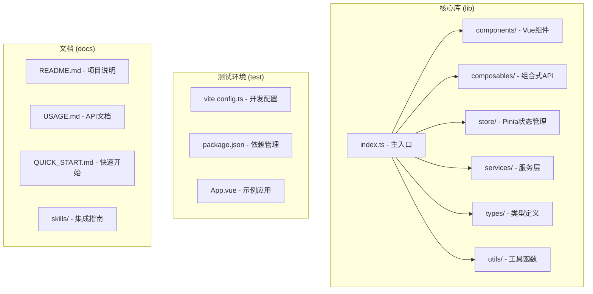
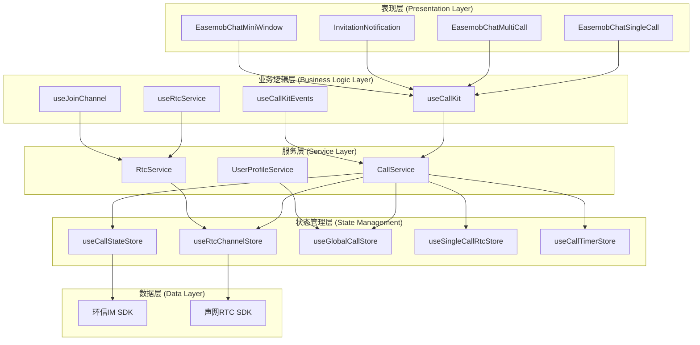
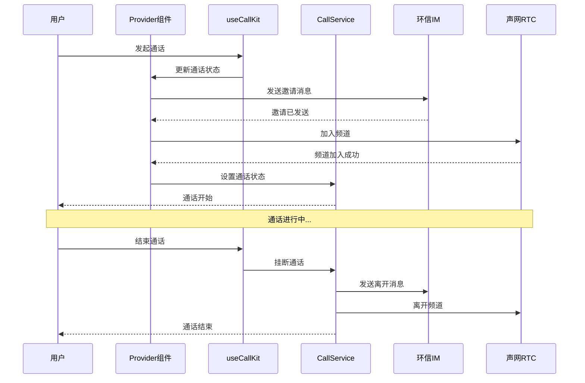
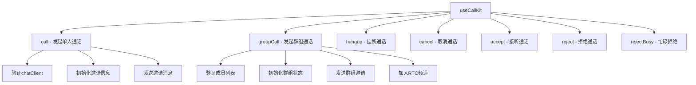
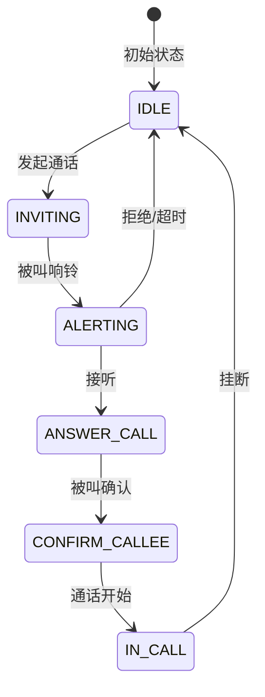
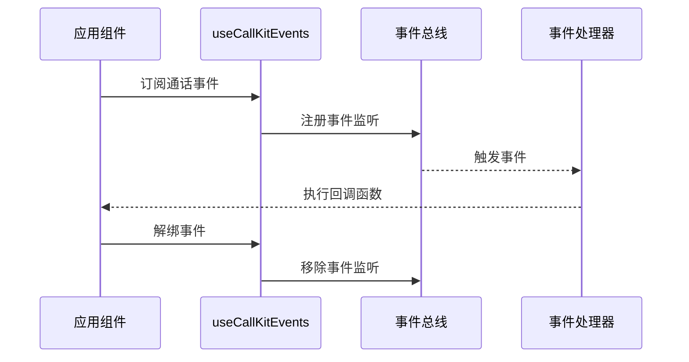
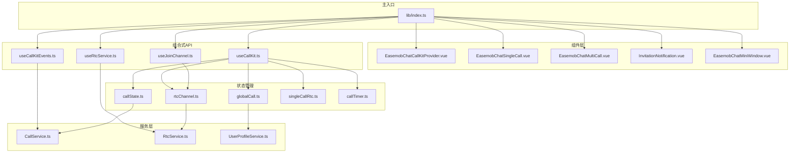

# 使用指南

<cite>
**本文档引用的文件**
- [README.md](file://README.md)
- [QUICK_START.md](file://QUICK_START.md)
- [USAGE.md](file://USAGE.md)
- [skills/callkit-integration.md](file://skills/callkit-integration.md)
- [package.json](file://package.json)
- [lib/index.ts](file://lib/index.ts)
- [lib/types.ts](file://lib/types.ts)
- [lib/composables/useCallKit.ts](file://lib/composables/useCallKit.ts)
- [lib/composables/useCallKitEvents.ts](file://lib/composables/useCallKitEvents.ts)
- [lib/components/EasemobChatCallKitProvider.vue](file://lib/components/EasemobChatCallKitProvider.vue)
- [lib/store/callState.ts](file://lib/store/callState.ts)
- [lib/services/CallService.ts](file://lib/services/CallService.ts)
- [vite.config.ts](file://vite.config.ts)
- [test/package.json](file://test/package.json)
</cite>

## 目录
1. [简介](#简介)
2. [项目结构](#项目结构)
3. [核心组件](#核心组件)
4. [架构概览](#架构概览)
5. [详细组件分析](#详细组件分析)
6. [依赖关系分析](#依赖关系分析)
7. [性能考虑](#性能考虑)
8. [故障排除指南](#故障排除指南)
9. [结论](#结论)
10. [附录](#附录)

## 简介

Easemob Chat CallKit Vue3 是一个基于 Vue 3 + 环信 IM SDK + 声网 RTC SDK 的音视频通话 UI 组件库。该项目提供了完整的单人通话和群组通话解决方案，内置了呼叫、接听、挂断、音视频控制、邀请通知等核心功能。

### 主要特性

- **单人通话**：1v1 音频/视频通话，支持呼叫、接听、挂断
- **群组通话**：多人音视频通话，支持邀请成员、视频网格布局
- **邀请通知**：被叫方自动弹出接听/拒绝弹窗
- **媒体控制**：静音、开关摄像头、切换前后置摄像头
- **视频布局**：单聊悬浮窗、群聊九宫格/主视频模式
- **自动显隐**：组件根据通话状态自动显示/隐藏，无需手动 `v-if`
- **灵活引入**：npm 包或源码 alias，开发调试灵活

**章节来源**
- [README.md:11-20](file://README.md#L11-L20)

## 项目结构

项目采用模块化设计，主要分为以下几个核心目录：



**图表来源**
- [lib/index.ts:1-99](file://lib/index.ts#L1-L99)
- [package.json:1-76](file://package.json#L1-L76)

### 核心模块说明

- **index.ts**：主入口文件，统一导出所有组件和API
- **components/**：包含所有Vue组件，如通话组件、通知组件等
- **composables/**：提供组合式API，如通话控制、事件监听等
- **store/**：基于Pinia的状态管理，包括通话状态、RTC状态等
- **services/**：底层服务实现，如CallService、RtcService等
- **types/**：完整的TypeScript类型定义
- **utils/**：工具函数和辅助方法

**章节来源**
- [lib/index.ts:22-39](file://lib/index.ts#L22-L39)

## 核心组件

### Provider 组件

`EasemobChatCallKitProvider` 是所有通话组件的根上下文，负责：

- 接收环信 `chatClient` 实例
- 初始化 RTC 服务
- 挂载 IM 消息监听（信令自动处理）
- 管理全局配置（debug、铃声、超时等）

### 通话组件

- **EasemobChatSingleCall**：单人通话组件，自动根据状态显示/隐藏
- **EasemobChatMultiCall**：群组通话组件，支持视频网格布局
- **InvitationNotification**：通话邀请通知组件
- **EasemobChatMiniWindow**：最小化通话窗口组件

### 组合式API

- **useCallKit**：统一的通话控制入口
- **useCallKitEvents**：通话生命周期事件订阅
- **useRtcService**：RTC服务管理
- **useJoinChannel**：频道加入/离开

**章节来源**
- [USAGE.md:58-210](file://USAGE.md#L58-L210)
- [lib/composables/useCallKit.ts:14-246](file://lib/composables/useCallKit.ts#L14-L246)

## 架构概览

项目采用分层架构设计，各层职责清晰分离：



**图表来源**
- [lib/components/EasemobChatCallKitProvider.vue:1-155](file://lib/components/EasemobChatCallKitProvider.vue#L1-L155)
- [lib/composables/useCallKit.ts:14-246](file://lib/composables/useCallKit.ts#L14-L246)
- [lib/services/CallService.ts:12-397](file://lib/services/CallService.ts#L12-L397)

### 数据流架构



**图表来源**
- [lib/composables/useCallKit.ts:22-149](file://lib/composables/useCallKit.ts#L22-L149)
- [lib/services/CallService.ts:28-75](file://lib/services/CallService.ts#L28-L75)

## 详细组件分析

### Provider 组件详解

Provider 组件是整个通话系统的核心，负责协调各个子系统的运行。

#### 核心功能

1. **环信客户端管理**：接收并存储 chatClient 实例
2. **RTC服务初始化**：自动初始化声网RTC服务
3. **事件监听**：挂载IM消息监听器和信令监听器
4. **配置管理**：处理全局配置选项

#### 配置选项

| 配置项 | 类型 | 默认值 | 说明 |
|--------|------|--------|------|
| `debug` | boolean | false | 开启调试模式 |
| `logLevel` | LogLevel | LogLevel.ERROR | 日志级别 |
| `enableRingtone` | boolean | true | 开启来电铃声 |
| `resizable` | boolean | true | 通话窗口可调整大小 |
| `draggable` | boolean | true | 通话窗口可拖动 |
| `inviteTimeout` | number | 30000 | 邀请超时时间(ms) |

**章节来源**
- [lib/components/EasemobChatCallKitProvider.vue:20-58](file://lib/components/EasemobChatCallKitProvider.vue#L20-L58)
- [USAGE.md:80-90](file://USAGE.md#L80-L90)

### useCallKit 组合式API

useCallKit 提供了统一的通话控制入口，涵盖了发起、接听、挂断、拒绝等所有通话操作。

#### 核心方法



**图表来源**
- [lib/composables/useCallKit.ts:15-246](file://lib/composables/useCallKit.ts#L15-L246)

#### 通话状态管理



**图表来源**
- [lib/store/callState.ts:13-31](file://lib/store/callState.ts#L13-L31)
- [lib/store/callState.ts:112-136](file://lib/store/callState.ts#L112-L136)

**章节来源**
- [lib/composables/useCallKit.ts:22-149](file://lib/composables/useCallKit.ts#L22-L149)
- [lib/store/callState.ts:36-177](file://lib/store/callState.ts#L36-L177)

### 通话事件系统

项目实现了完整的事件系统，用于监听通话生命周期中的各种事件。

#### 事件类型

| 事件名 | 触发时机 | 用途 |
|--------|----------|------|
| `statusChanged` | 通话状态变化 | 监控通话状态流转 |
| `incomingCall` | 收到通话邀请 | 显示邀请通知 |
| `callStarted` | 通话接通 | 执行通话开始逻辑 |
| `callEnded` | 通话结束 | 清理资源、统计时长 |
| `callCanceled` | 通话被取消 | 处理取消逻辑 |
| `callRefused` | 通话被拒绝 | 处理拒绝逻辑 |
| `callTimeout` | 邀请超时 | 处理超时逻辑 |
| `callBusy` | 对方忙线 | 处理忙线情况 |

#### 事件订阅示例



**图表来源**
- [lib/composables/useCallKitEvents.ts:36-136](file://lib/composables/useCallKitEvents.ts#L36-L136)

**章节来源**
- [lib/composables/useCallKitEvents.ts:8-142](file://lib/composables/useCallKitEvents.ts#L8-L142)
- [USAGE.md:441-474](file://USAGE.md#L441-L474)

## 依赖关系分析

### 外部依赖

项目对外部依赖有明确的要求和版本约束：

```mermaid
graph LR
subgraph "核心依赖"
A[Vue 3.0.0+]
B[easemob-websdk 4.12.0+]
C[agora-rtc-sdk-ng 4.14.0+]
D[pinia 3.0.3+]
end
subgraph "开发依赖"
E[typescript ~5.8.3]
F[vite ^7.1.2]
G[@vitejs/plugin-vue ^6.0.1]
H[vue-tsc ^3.0.5]
end
subgraph "项目依赖"
I[Easemob Chat CallKit Vue3]
end
I --> A
I --> B
I --> C
I --> D
I -.-> E
I -.-> F
I -.-> G
I -.-> H
```

**图表来源**
- [package.json:33-52](file://package.json#L33-L52)

### 内部模块依赖



**图表来源**
- [lib/index.ts:4-39](file://lib/index.ts#L4-L39)

**章节来源**
- [package.json:33-52](file://package.json#L33-L52)
- [lib/index.ts:1-99](file://lib/index.ts#L1-L99)

## 性能考虑

### 状态管理优化

项目使用 Pinia 进行状态管理，具有以下优势：

1. **响应式更新**：自动追踪状态变化，只更新受影响的组件
2. **模块化设计**：每个 store 独立管理自己的状态，避免全局状态污染
3. **开发工具支持**：完整的 Vue DevTools 支持，便于调试

### 组件渲染优化

1. **自动显示/隐藏**：组件根据通话状态自动控制显示，减少不必要的渲染
2. **懒加载**：Provider 组件在挂载完成后才渲染子组件
3. **事件解绑**：useCallKitEvents 返回的解绑函数确保事件监听器及时清理

### 资源管理

1. **RTC连接池**：复用 RTC 客户端实例，避免频繁创建销毁
2. **媒体流管理**：智能管理本地和远程媒体流，及时释放不再使用的资源
3. **定时器清理**：自动清理超时定时器，防止内存泄漏

## 故障排除指南

### 常见问题及解决方案

#### 1. Pinia 相关错误

**问题**：`[🍍] getActivePinia() was called but there was no active Pinia`

**原因**：忘记调用 `app.use(EasemobChatCallKit)`

**解决方案**：
```typescript
import { createApp } from 'vue'
import EasemobChatCallKit from 'easemob-chat-callkit-vue3'

const app = createApp(App)
app.use(EasemobChatCallKit) // 必须调用
app.mount('#app')
```

#### 2. 依赖版本冲突

**问题**：`Cannot find module 'pinia'`

**原因**：项目中存在手动安装的 pinia 依赖

**解决方案**：
- 卸载手动安装的 pinia：`npm uninstall pinia`
- 让 CallKit 内部自动处理 Pinia 注入

#### 3. 通话组件不显示

**问题**：通话组件不显示

**原因**：没有调用 `useCallKit().call()` 或 `groupCall()` 发起通话

**解决方案**：
```typescript
const { call, groupCall } = useCallKit()

// 确保调用了这些方法
await call({ targetId: 'user123', type: 'video' })
await groupCall({ groupId: 'group123', members: ['user1'], type: 'video' })
```

#### 4. 被叫方收不到邀请

**问题**：被叫方收不到通话邀请

**原因**：
- `chatClient` 未登录
- 未正确传入 Provider

**解决方案**：
```typescript
<EasemobChatCallKitProvider :chat-client="chatClient">
  {/* 确保 chatClient 已登录 */}
</EasemobChatCallKitProvider>
```

#### 5. 视频黑屏

**问题**：视频通话时出现黑屏

**原因**：
- Agora 未正确初始化
- Token 过期
- 设备权限未授权

**解决方案**：
1. 检查 Agora 客户端初始化
2. 验证 token 有效性
3. 确认设备权限已授权

**章节来源**
- [skills/callkit-integration.md:204-213](file://skills/callkit-integration.md#L204-L213)
- [QUICK_START.md:148-153](file://QUICK_START.md#L148-L153)

### 调试技巧

#### 日志级别配置

```typescript
import { LogLevel } from 'easemob-chat-callkit-vue3'

<EasemobChatCallKitProvider
  :chat-client="chatClient"
  :init-config="{ logLevel: LogLevel.DEBUG }"
>
```

可用的日志级别：
- `LogLevel.ERROR`：只输出错误
- `LogLevel.WARN`：错误 + 警告
- `LogLevel.INFO`：推荐生产环境
- `LogLevel.DEBUG`：开发调试
- `LogLevel.VERBOSE`：完整信令日志

#### 事件监听调试

```typescript
import { useCallKitEvents } from 'easemob-chat-callkit-vue3'

const { onCallStarted, onCallEnded, onIncomingCall } = useCallKitEvents()

onCallStarted((e) => {
  console.log('通话开始:', e.callId, e.channel)
})

onCallEnded((e) => {
  console.log('通话结束:', e.reason, '时长:', e.duration, 'ms')
})

onIncomingCall((e) => {
  console.log('收到来电:', e.callerUserId)
})
```

**章节来源**
- [README.md:103-121](file://README.md#L103-L121)
- [USAGE.md:380-474](file://USAGE.md#L380-L474)

## 结论

Easemob Chat CallKit Vue3 提供了一个完整、易用的音视频通话解决方案。通过清晰的架构设计、完善的组件体系和丰富的API，开发者可以快速集成高质量的通话功能。

### 主要优势

1. **开箱即用**：内置完整的通话功能，无需复杂配置
2. **易于集成**：简单的API设计，快速上手
3. **灵活配置**：丰富的配置选项满足不同需求
4. **完整文档**：详细的API文档和使用指南
5. **性能优化**：合理的架构设计保证良好的性能表现

### 最佳实践

1. **正确初始化**：确保 Provider 正确配置和初始化
2. **事件处理**：合理使用事件系统处理通话生命周期
3. **资源管理**：及时清理事件监听器和媒体资源
4. **错误处理**：完善错误处理机制提升用户体验
5. **性能监控**：合理使用日志级别进行性能监控

## 附录

### 快速开始步骤

1. **安装依赖**：
```bash
npm install easemob-websdk agora-rtc-sdk-ng
npm install easemob-chat-callkit-vue3
```

2. **注册插件**：
```typescript
import { createApp } from 'vue'
import EasemobChatCallKit from 'easemob-chat-callkit-vue3'

const app = createApp(App)
app.use(EasemobChatCallKit)
app.mount('#app')
```

3. **配置 Provider**：
```vue
<EasemobChatCallKitProvider :chat-client="chatClient">
  <InvitationNotification />
  <EasemobChatSingleCall />
  <EasemobChatMultiCall :group-id="groupId" />
</EasemobChatCallKitProvider>
```

4. **发起通话**：
```typescript
const { call, groupCall, hangup } = useCallKit()

await call({ targetId: 'user123', type: 'video' })
await hangup()
```

**章节来源**
- [QUICK_START.md:9-153](file://QUICK_START.md#L9-L153)
- [skills/callkit-integration.md:18-153](file://skills/callkit-integration.md#L18-L153)

### 开发环境配置

#### 源码模式开发

```typescript
// vite.config.ts
export default defineConfig({
  resolve: {
    alias: {
      'easemob-chat-callkit-vue3': path.resolve(__dirname, '../easemob-chat-callkit-vue3/lib/index.ts'),
      'easemob-chat-callkit-vue3/style.css': path.resolve(__dirname, '../easemob-chat-callkit-vue3/lib/style.css'),
    },
  },
})
```

#### 测试环境

项目提供了完整的测试环境，支持两种模式：

1. **源码模式**：实时热更新，适合开发调试
2. **包模式**：测试发布的npm包，验证生产环境

**章节来源**
- [README.md:131-152](file://README.md#L131-L152)
- [test/package.json:6-14](file://test/package.json#L6-L14)