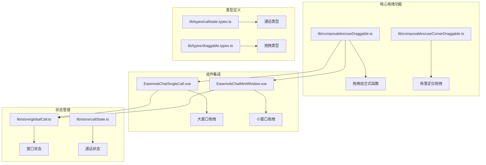
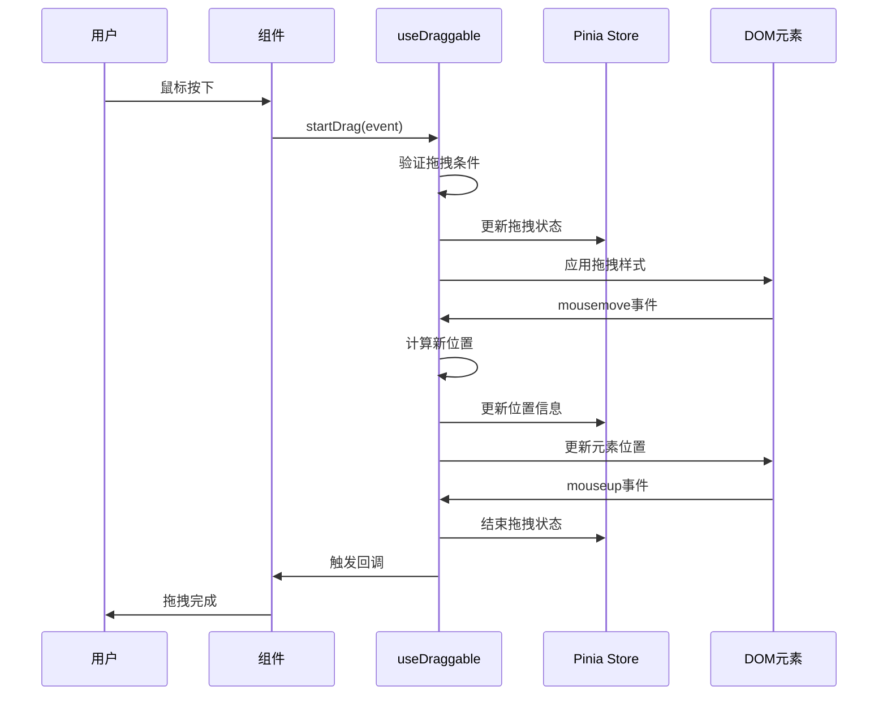
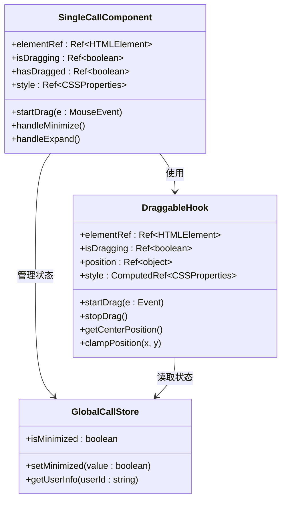
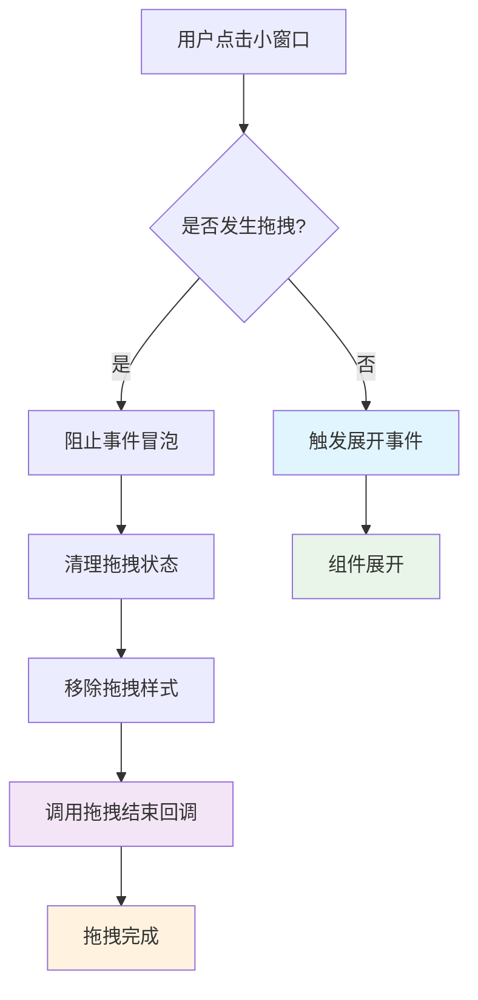
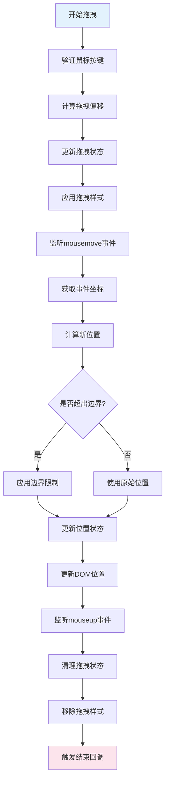
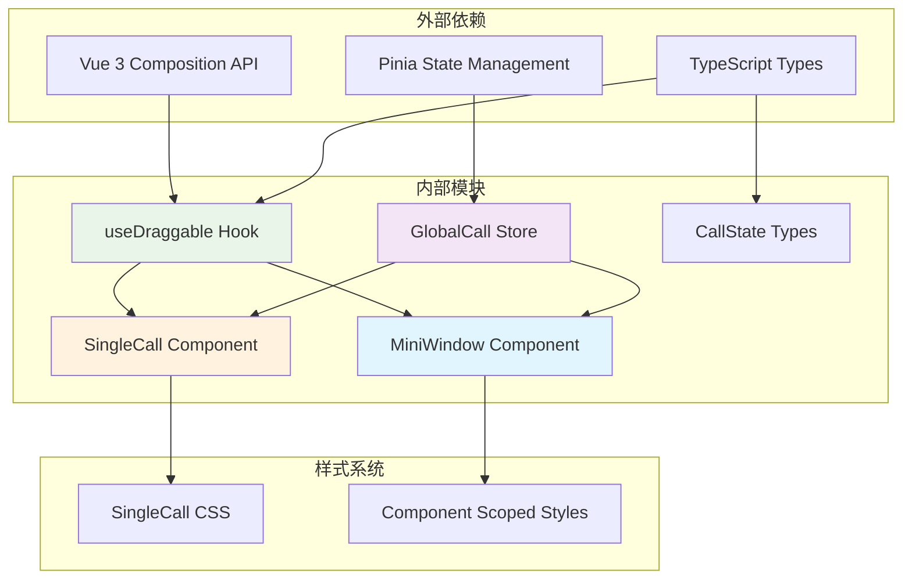
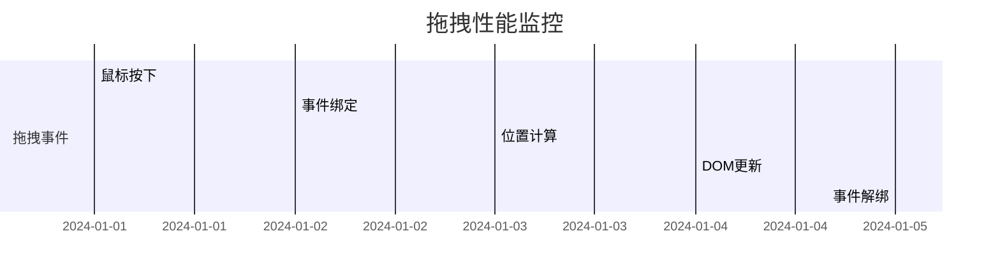

# UseDraggable

<cite>
**本文档引用的文件**
- [lib/composables/useDraggable.ts](file://lib/composables/useDraggable.ts)
- [lib/components/EasemobChatMiniWindow.vue](file://lib/components/EasemobChatMiniWindow.vue)
- [lib/components/singleCall/EasemobChatSingleCall.vue](file://lib/components/singleCall/EasemobChatSingleCall.vue)
- [lib/store/globalCall.ts](file://lib/store/globalCall.ts)
- [lib/types/callstate.types.ts](file://lib/types/callstate.types.ts)
- [lib/components/singleCall/styles/EasemobChatSingleCall.css](file://lib/components/singleCall/styles/EasemobChatSingleCall.css)
</cite>

## 目录
1. [简介](#简介)
2. [项目结构](#项目结构)
3. [核心组件](#核心组件)
4. [架构概览](#架构概览)
5. [详细组件分析](#详细组件分析)
6. [依赖关系分析](#依赖关系分析)
7. [性能考虑](#性能考虑)
8. [故障排除指南](#故障排除指南)
9. [结论](#结论)

## 简介

UseDraggable 是 EaseMob CallKit Vue3 版本中的核心拖拽功能实现，提供了一个强大而灵活的拖拽组合式函数，支持多种拖拽场景和配置选项。该功能主要应用于通话组件的窗口拖拽、小窗口的拖拽以及各种可拖拽UI元素的交互。

该实现基于 Vue 3 的 Composition API，提供了完整的拖拽状态管理、边界限制、触摸事件支持等功能，确保了良好的用户体验和跨设备兼容性。

## 项目结构

项目采用模块化的组织方式，拖拽功能主要分布在以下目录：

**图表来源**
- [lib/composables/useDraggable.ts:1-325](file://lib/composables/useDraggable.ts#L1-L325)
- [lib/components/EasemobChatMiniWindow.vue:1-380](file://lib/components/EasemobChatMiniWindow.vue#L1-L380)
- [lib/components/singleCall/EasemobChatSingleCall.vue:1-235](file://lib/components/singleCall/EasemobChatSingleCall.vue#L1-L235)

**章节来源**
- [lib/composables/useDraggable.ts:1-325](file://lib/composables/useDraggable.ts#L1-L325)
- [lib/components/EasemobChatMiniWindow.vue:1-380](file://lib/components/EasemobChatMiniWindow.vue#L1-L380)
- [lib/components/singleCall/EasemobChatSingleCall.vue:1-235](file://lib/components/singleCall/EasemobChatSingleCall.vue#L1-L235)

## 核心组件

### 拖拽组合式函数 (useDraggable)

useDraggable 是整个拖拽系统的核心，提供了完整的拖拽功能实现：

**主要特性：**
- 支持鼠标和触摸事件
- 边界限制和内边距控制
- 居中定位和固定位置
- 实时位置更新和样式绑定
- 拖拽状态管理和回调机制

**关键接口：**
- `elementRef`: DOM元素引用
- `isDragging`: 拖拽状态
- `position`: 当前位置坐标
- `style`: 应用到元素的样式
- `startDrag()`: 开始拖拽
- `stopDrag()`: 停止拖拽

**章节来源**
- [lib/composables/useDraggable.ts:78-324](file://lib/composables/useDraggable.ts#L78-L324)

### 角落定位拖拽 (useCornerDraggable)

专门用于角落定位的拖拽实现，支持四种角落位置：

**支持的角落位置：**
- `top-left`: 左上角
- `top-right`: 右上角  
- `bottom-left`: 左下角
- `bottom-right`: 右下角

**章节来源**
- [lib/composables/useDraggable.ts:286-322](file://lib/composables/useDraggable.ts#L286-L322)

## 架构概览

**图表来源**
- [lib/composables/useDraggable.ts:192-235](file://lib/composables/useDraggable.ts#L192-L235)
- [lib/components/EasemobChatMiniWindow.vue:87-103](file://lib/components/EasemobChatMiniWindow.vue#L87-L103)

## 详细组件分析

### 大窗口拖拽实现

大窗口组件使用居中定位的拖拽功能：

**图表来源**
- [lib/components/singleCall/EasemobChatSingleCall.vue:135-149](file://lib/components/singleCall/EasemobChatSingleCall.vue#L135-L149)
- [lib/store/globalCall.ts:8-55](file://lib/store/globalCall.ts#L8-L55)

**章节来源**
- [lib/components/singleCall/EasemobChatSingleCall.vue:135-149](file://lib/components/singleCall/EasemobChatSingleCall.vue#L135-L149)
- [lib/components/singleCall/EasemobChatSingleCall.vue:194-204](file://lib/components/singleCall/EasemobChatSingleCall.vue#L194-L204)

### 小窗口拖拽实现

小窗口组件使用角落定位的拖拽功能：

**图表来源**
- [lib/components/EasemobChatMiniWindow.vue:136-142](file://lib/components/EasemobChatMiniWindow.vue#L136-L142)
- [lib/components/EasemobChatMiniWindow.vue:174-216](file://lib/components/EasemobChatMiniWindow.vue#L174-L216)

**章节来源**
- [lib/components/EasemobChatMiniWindow.vue:87-118](file://lib/components/EasemobChatMiniWindow.vue#L87-L118)
- [lib/components/EasemobChatMiniWindow.vue:136-142](file://lib/components/EasemobChatMiniWindow.vue#L136-L142)

### 拖拽算法实现

拖拽算法的核心逻辑包括位置计算和边界限制：

**图表来源**
- [lib/composables/useDraggable.ts:174-190](file://lib/composables/useDraggable.ts#L174-L190)
- [lib/composables/useDraggable.ts:236-259](file://lib/composables/useDraggable.ts#L236-L259)

**章节来源**
- [lib/composables/useDraggable.ts:174-190](file://lib/composables/useDraggable.ts#L174-L190)
- [lib/composables/useDraggable.ts:236-259](file://lib/composables/useDraggable.ts#L236-L259)

## 依赖关系分析

**图表来源**
- [lib/composables/useDraggable.ts:1-5](file://lib/composables/useDraggable.ts#L1-L5)
- [lib/store/globalCall.ts:1-5](file://lib/store/globalCall.ts#L1-L5)

**章节来源**
- [lib/composables/useDraggable.ts:1-5](file://lib/composables/useDraggable.ts#L1-L5)
- [lib/store/globalCall.ts:1-5](file://lib/store/globalCall.ts#L1-L5)

## 性能考虑

### 优化策略

1. **事件处理优化**
   - 使用 `requestAnimationFrame` 进行位置更新
   - 避免不必要的 DOM 操作
   - 合并样式更新以减少重排

2. **内存管理**
   - 正确清理事件监听器
   - 及时移除临时样式和类名
   - 避免内存泄漏

3. **渲染性能**
   - 使用 `computed` 属性缓存计算结果
   - 条件渲染避免不必要的组件创建
   - 合理使用 `v-show` 和 `v-if`

### 性能监控

## 故障排除指南

### 常见问题及解决方案

**问题1: 拖拽无效**
- 检查元素是否正确绑定 `@mousedown="startDrag"`
- 确认 `elementRef` 是否正确设置
- 验证边界参数配置是否正确

**问题2: 拖拽位置异常**
- 检查 CSS 定位属性是否冲突
- 确认 `width` 和 `height` 参数是否正确设置
- 验证边界内边距计算

**问题3: 触摸设备不支持**
- 确认 `startDrag` 方法接收 `TouchEvent` 类型
- 检查 `getEventCoords` 函数是否正确处理触摸事件

**章节来源**
- [lib/composables/useDraggable.ts:192-235](file://lib/composables/useDraggable.ts#L192-L235)
- [lib/components/EasemobChatMiniWindow.vue:136-142](file://lib/components/EasemobChatMiniWindow.vue#L136-L142)

### 调试技巧

1. **启用调试日志**
   - 在关键函数中添加日志输出
   - 监控拖拽状态变化
   - 跟踪事件触发顺序

2. **性能分析**
   - 使用浏览器开发者工具分析渲染性能
   - 监控事件监听器数量
   - 检查内存使用情况

## 结论

UseDraggable 提供了一个完整、灵活且高性能的拖拽解决方案，具有以下优势：

1. **功能完整性**: 支持多种拖拽场景和配置选项
2. **用户体验**: 流畅的拖拽体验和精确的位置控制
3. **代码质量**: 清晰的架构设计和完善的错误处理
4. **扩展性**: 易于集成到不同的组件和场景中

该实现为 EaseMob CallKit Vue3 版本提供了可靠的拖拽基础，支持从简单的大窗口拖拽到复杂的角落定位拖拽等多种使用场景。通过合理的性能优化和错误处理，确保了在各种设备和浏览器环境下的稳定运行。