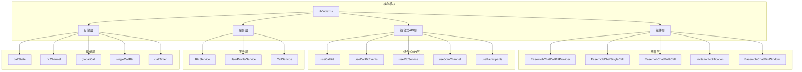
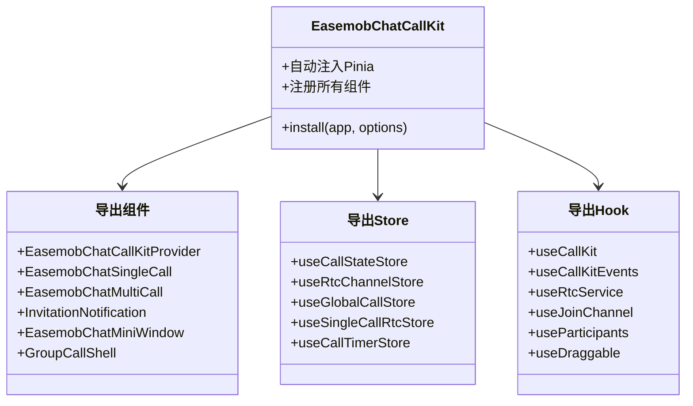
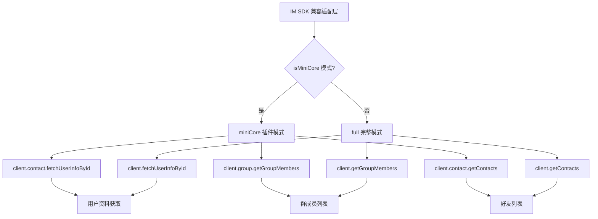
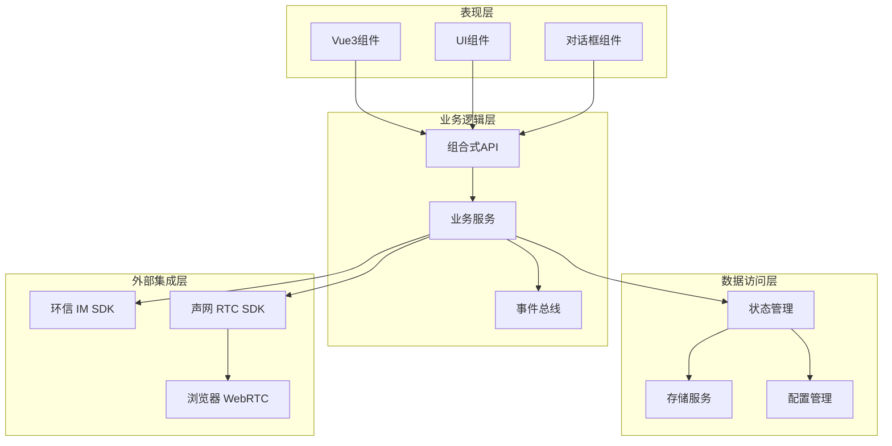
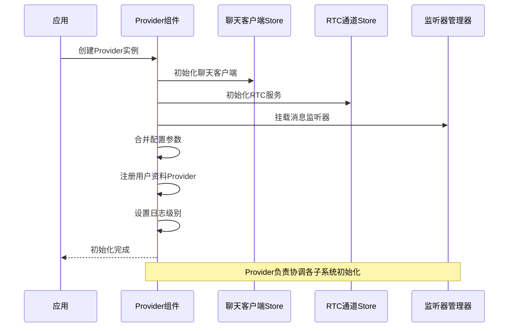
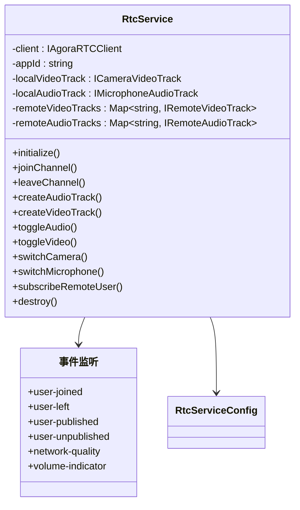
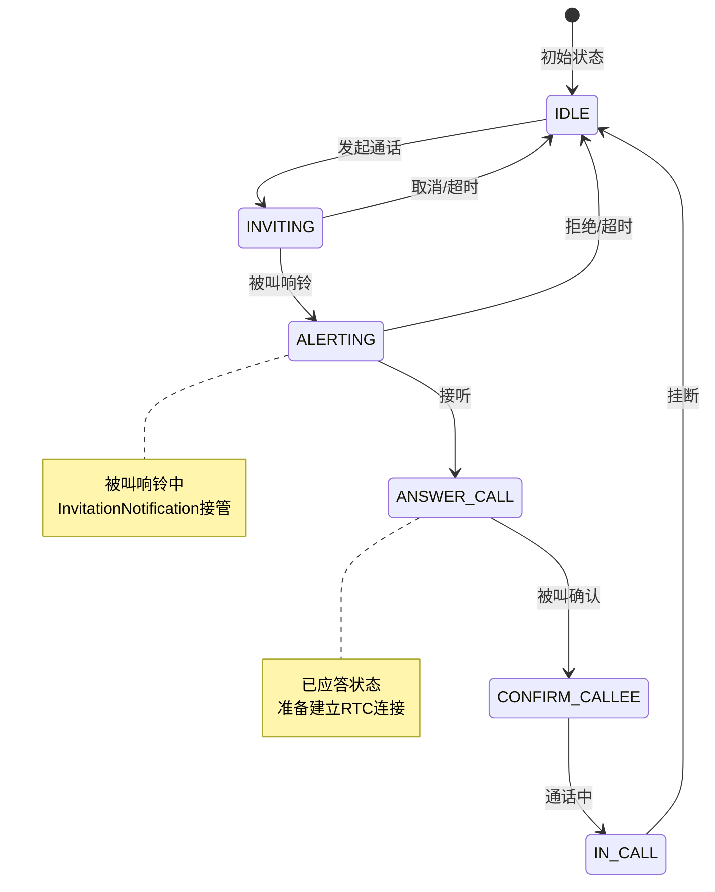
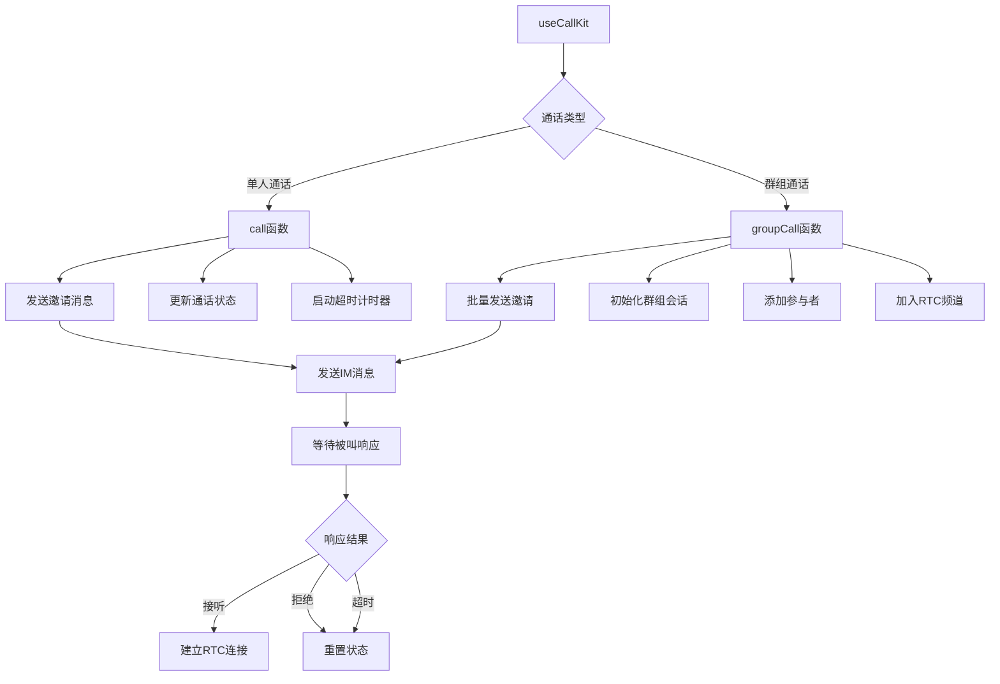

# IM SDK 兼容性适配器

<cite>
**本文档引用的文件**
- [package.json](file://package.json)
- [lib/index.ts](file://lib/index.ts)
- [lib/types.ts](file://lib/types.ts)
- [lib/components/EasemobChatCallKitProvider.vue](file://lib/components/EasememobChatCallKitProvider.vue)
- [lib/services/RtcService.ts](file://lib/services/RtcService.ts)
- [lib/store/callState.ts](file://lib/store/callState.ts)
- [lib/composables/useCallKit.ts](file://lib/composables/useCallKit.ts)
- [lib/modules/groupCall/index.ts](file://lib/modules/groupCall/index.ts)
- [lib/utils/imSdkAdapter.ts](file://lib/utils/imSdkAdapter.ts)
- [lib/core/events/CallKitEventBus.ts](file://lib/core/events/CallKitEventBus.ts)
- [QUICK_START.md](file://QUICK_START.md)
- [USAGE.md](file://USAGE.md)
</cite>

## 目录
1. [简介](#简介)
2. [项目结构](#项目结构)
3. [核心组件](#核心组件)
4. [架构概览](#架构概览)
5. [详细组件分析](#详细组件分析)
6. [依赖关系分析](#依赖关系分析)
7. [性能考虑](#性能考虑)
8. [故障排除指南](#故障排除指南)
9. [结论](#结论)

## 简介

IM SDK 兼容性适配器是一个专为 Easemob Chat CallKit 设计的 Vue3 插件，旨在提供统一的即时通讯和音视频通话解决方案。该项目的核心目标是为不同版本的环信 IM SDK（full 和 miniCore 模式）提供无缝兼容性，同时集成声网 RTC SDK 实现高质量的音视频通话功能。

该适配器通过抽象层设计，实现了以下关键特性：
- 支持环信 IM SDK 的 full 模式和 miniCore 插件模式
- 统一的通话控制接口，简化开发者集成
- 完整的音视频通话生命周期管理
- 类型安全的事件系统和状态管理
- 灵活的配置选项和扩展能力

## 项目结构

项目采用模块化的目录结构，按照功能和职责进行清晰的分离：



**图表来源**
- [lib/index.ts:1-99](file://lib/index.ts#L1-L99)
- [lib/components/EasemobChatCallKitProvider.vue:1-164](file://lib/components/EasemobChatCallKitProvider.vue#L1-L164)

**章节来源**
- [lib/index.ts:1-99](file://lib/index.ts#L1-L99)
- [package.json:1-76](file://package.json#L1-L76)

## 核心组件

### 插件入口和导出系统

lib/index.ts 作为整个插件的入口点，提供了统一的导出接口和自动安装功能：



**图表来源**
- [lib/index.ts:82-99](file://lib/index.ts#L82-L99)
- [lib/index.ts:22-39](file://lib/index.ts#L22-L39)

### IM SDK 兼容适配层

imSdkAdapter.ts 实现了环信 IM SDK 的兼容性适配，支持两种运行模式：



**图表来源**
- [lib/utils/imSdkAdapter.ts:1-97](file://lib/utils/imSdkAdapter.ts#L1-L97)

**章节来源**
- [lib/index.ts:1-99](file://lib/index.ts#L1-L99)
- [lib/utils/imSdkAdapter.ts:1-97](file://lib/utils/imSdkAdapter.ts#L1-L97)

## 架构概览

系统采用分层架构设计，确保各组件间的松耦合和高内聚：



**图表来源**
- [lib/components/EasemobChatCallKitProvider.vue:1-164](file://lib/components/EasemobChatCallKitProvider.vue#L1-L164)
- [lib/services/RtcService.ts:1-771](file://lib/services/RtcService.ts#L1-L771)

## 详细组件分析

### Provider 组件

EasemobChatCallKitProvider 是整个系统的根组件，负责初始化和协调各个子系统：



**图表来源**
- [lib/components/EasemobChatCallKitProvider.vue:32-162](file://lib/components/EasemobChatCallKitProvider.vue#L32-L162)

### RTC 服务管理

RtcService.ts 实现了完整的音视频通话服务管理：



**图表来源**
- [lib/services/RtcService.ts:51-771](file://lib/services/RtcService.ts#L51-L771)

### 通话状态管理

callState.ts 提供了完整的通话状态管理机制：



**图表来源**
- [lib/store/callState.ts:13-215](file://lib/store/callState.ts#L13-L215)

### 通话控制 API

useCallKit 提供了统一的通话控制接口：



**图表来源**
- [lib/composables/useCallKit.ts:22-149](file://lib/composables/useCallKit.ts#L22-L149)

**章节来源**
- [lib/components/EasemobChatCallKitProvider.vue:1-164](file://lib/components/EasemobChatCallKitProvider.vue#L1-L164)
- [lib/services/RtcService.ts:1-771](file://lib/services/RtcService.ts#L1-L771)
- [lib/store/callState.ts:1-215](file://lib/store/callState.ts#L1-L215)
- [lib/composables/useCallKit.ts:1-246](file://lib/composables/useCallKit.ts#L1-L246)

## 依赖关系分析

项目依赖关系呈现清晰的层次结构：

```mermaid
graph TB
subgraph "运行时依赖"
A[vue ^3.0.0]
B[easemob-websdk ^4.12.0]
C[agora-rtc-sdk-ng ^4.14.0]
D[pinia ^3.0.3]
end
subgraph "开发时依赖"
E[@vitejs/plugin-vue]
F[typescript ~5.8.3]
G[vite ^7.1.2]
H[vue-tsc ^3.0.5]
end
subgraph "项目内部模块"
I[lib/index.ts]
J[components/*]
K[composables/*]
L[services/*]
M[store/*]
N[utils/*]
end
I --> A
I --> D
I --> J
I --> K
I --> L
I --> M
I --> N
J --> I
K --> I
L --> I
M --> I
N --> I
L --> B
L --> C
J --> A
K --> A
```

**图表来源**
- [package.json:33-52](file://package.json#L33-L52)
- [lib/index.ts:1-99](file://lib/index.ts#L1-L99)

**章节来源**
- [package.json:1-76](file://package.json#L1-L76)
- [lib/index.ts:1-99](file://lib/index.ts#L1-L99)

## 性能考虑

### 内存管理优化

系统采用了多项内存管理策略来确保长期运行的稳定性：

1. **组件生命周期管理**：所有组件在卸载时自动清理事件监听器和定时器
2. **RTC资源释放**：离开频道时自动停止媒体轨道和清理远程流
3. **状态重置机制**：通话结束后自动重置所有相关状态
4. **缓存策略**：用户资料和群组信息采用智能缓存机制

### 并发处理

系统通过以下机制处理并发场景：

- **事件总线模式**：使用轻量级事件总线避免复杂的回调地狱
- **Promise链式调用**：确保异步操作的顺序性和错误处理
- **状态原子性更新**：通过 Pinia store 确保状态变更的一致性

### 网络优化

- **动态AppID获取**：从环信服务器动态获取声网AppID，减少配置复杂度
- **自动重连机制**：网络异常时自动尝试重连
- **带宽自适应**：根据网络质量动态调整视频编码配置

## 故障排除指南

### 常见问题诊断

#### IM SDK 兼容性问题

**症状**：用户资料获取失败或群成员列表为空

**解决方案**：
1. 检查 isMiniCore 配置是否正确
2. 确认环信 SDK 版本兼容性
3. 验证插件是否正确注册

#### RTC 连接问题

**症状**：无法建立音视频通话连接

**解决方案**：
1. 检查浏览器权限设置
2. 验证声网 AppID 配置
3. 确认网络环境和防火墙设置

#### 事件监听失效

**症状**：通话事件无法正常触发

**解决方案**：
1. 检查 Provider 组件是否正确初始化
2. 验证事件总线的订阅状态
3. 确认组件挂载顺序

**章节来源**
- [lib/utils/imSdkAdapter.ts:22-40](file://lib/utils/imSdkAdapter.ts#L22-L40)
- [lib/services/RtcService.ts:110-128](file://lib/services/RtcService.ts#L110-L128)
- [lib/core/events/CallKitEventBus.ts:23-84](file://lib/core/events/CallKitEventBus.ts#L23-L84)

## 结论

IM SDK 兼容性适配器通过精心设计的架构和完善的兼容性机制，成功解决了环信 IM SDK 在不同版本和模式下的兼容性问题。该系统的主要优势包括：

1. **高度兼容性**：支持环信 IM SDK 的 full 和 miniCore 两种模式
2. **统一接口**：提供简洁一致的 API 接口，降低学习成本
3. **完整生态**：集成了从 UI 组件到底层服务的完整解决方案
4. **类型安全**：全面的 TypeScript 类型定义，提升开发体验
5. **易于扩展**：模块化设计便于功能扩展和定制

该适配器为开发者提供了一个稳定可靠的即时通讯和音视频通话解决方案，能够满足大多数企业级应用的需求。通过合理的架构设计和完善的错误处理机制，确保了系统的稳定性和可维护性。