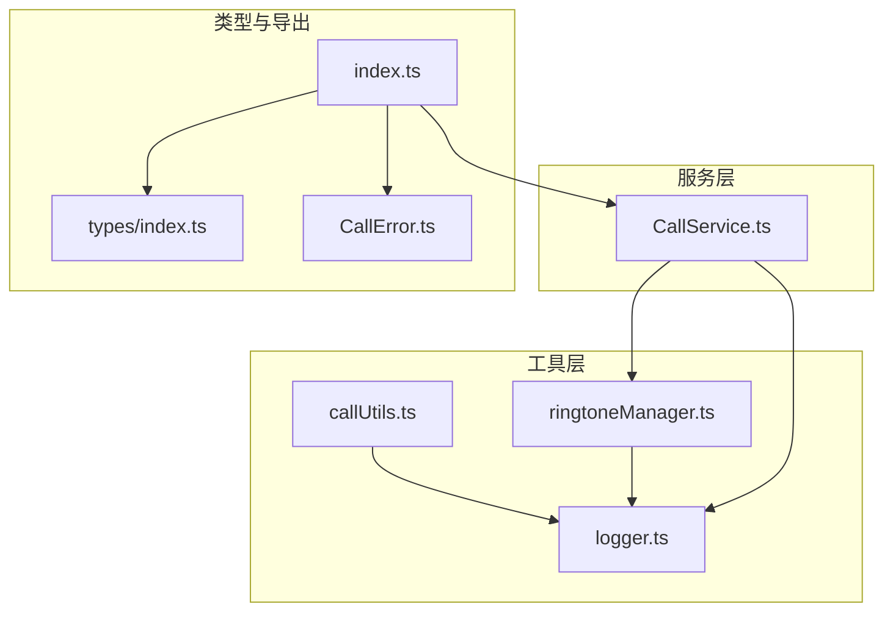
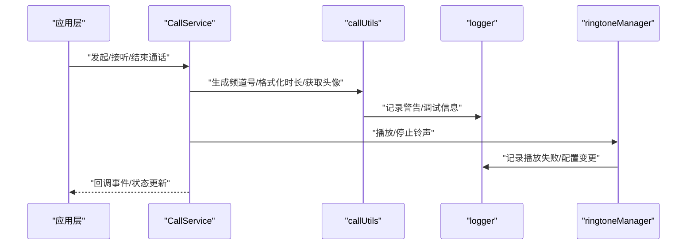
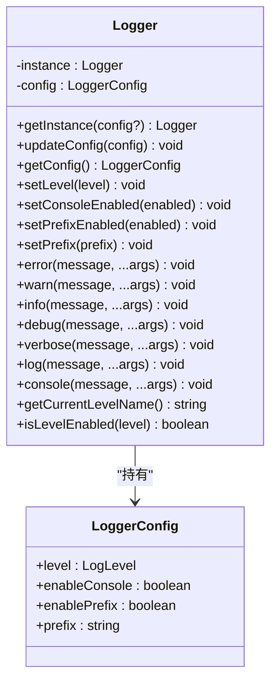
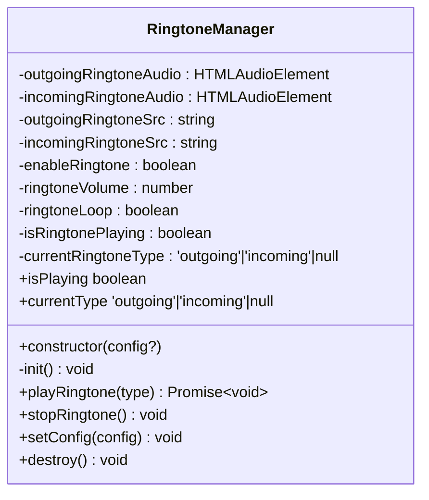
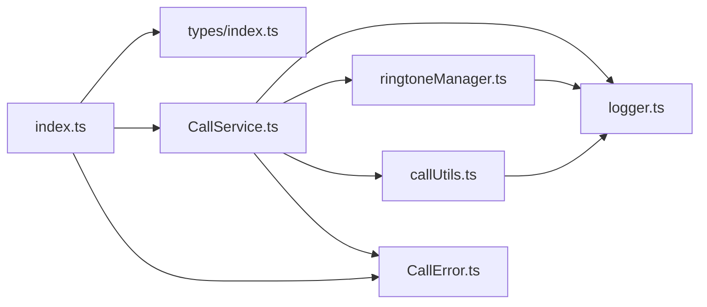

# 工具函数

<cite>
**本文引用的文件**
- [callUtils.ts](file://callkit/utils/callUtils.ts)
- [logger.ts](file://callkit/utils/logger.ts)
- [ringtoneManager.ts](file://callkit/utils/ringtoneManager.ts)
- [CallService.ts](file://callkit/services/CallService.ts)
- [index.ts](file://callkit/index.ts)
- [types/index.ts](file://callkit/types/index.ts)
- [CallError.ts](file://callkit/services/CallError.ts)
- [quickstart.md](file://callkit/docs/quickstart.md)
- [customization.md](file://callkit/docs/customization.md)
- [api_overview.md](file://callkit/docs/api_overview.md)
</cite>

## 目录
1. [简介](#简介)
2. [项目结构](#项目结构)
3. [核心组件](#核心组件)
4. [架构总览](#架构总览)
5. [详细组件分析](#详细组件分析)
6. [依赖关系分析](#依赖关系分析)
7. [性能考量](#性能考量)
8. [故障排查指南](#故障排查指南)
9. [结论](#结论)
10. [附录](#附录)

## 简介
本文件聚焦于项目中的工具函数与辅助类，系统性地介绍通话工具函数、日志管理器与铃声管理器的设计与使用方法。内容涵盖：
- 函数/类的职责边界与参数说明
- 返回值定义与典型使用场景
- 设计原则与最佳实践
- 扩展与自定义指南
- 在项目中的正确使用方式以提升开发效率与用户体验

## 项目结构
工具函数与辅助类主要位于 callkit/utils 目录，配合服务层 CallService 与类型定义共同构成完整的通话能力支撑体系。

图表来源
- [callUtils.ts](file://callkit/utils/callUtils.ts#L1-L85)
- [logger.ts](file://callkit/utils/logger.ts#L1-L181)
- [ringtoneManager.ts](file://callkit/utils/ringtoneManager.ts#L1-L139)
- [CallService.ts](file://callkit/services/CallService.ts#L1-L4478)
- [types/index.ts](file://callkit/types/index.ts#L1-L356)
- [index.ts](file://callkit/index.ts#L1-L46)
- [CallError.ts](file://callkit/services/CallError.ts#L1-L43)

章节来源
- [callUtils.ts](file://callkit/utils/callUtils.ts#L1-L85)
- [logger.ts](file://callkit/utils/logger.ts#L1-L181)
- [ringtoneManager.ts](file://callkit/utils/ringtoneManager.ts#L1-L139)
- [CallService.ts](file://callkit/services/CallService.ts#L1-L4478)
- [types/index.ts](file://callkit/types/index.ts#L1-L356)
- [index.ts](file://callkit/index.ts#L1-L46)
- [CallError.ts](file://callkit/services/CallError.ts#L1-L43)

## 核心组件
- 通话工具函数：提供频道号生成、通话时长格式化、用户头像获取、安全窗口位置计算等通用能力。
- 日志管理器：统一的日志输出与级别控制，支持单例配置、前缀与时间戳格式化、多级别输出。
- 铃声管理器：封装 HTMLAudioElement 的播放/停止与配置更新，支持外呼/来电两种铃声的独立配置与循环播放。

章节来源
- [callUtils.ts](file://callkit/utils/callUtils.ts#L1-L85)
- [logger.ts](file://callkit/utils/logger.ts#L1-L181)
- [ringtoneManager.ts](file://callkit/utils/ringtoneManager.ts#L1-L139)

## 架构总览
工具函数与辅助类在服务层 CallService 中被广泛使用，形成“工具层 -> 服务层 -> 类型与导出”的清晰分层。

图表来源
- [CallService.ts](file://callkit/services/CallService.ts#L1-L4478)
- [callUtils.ts](file://callkit/utils/callUtils.ts#L1-L85)
- [logger.ts](file://callkit/utils/logger.ts#L1-L181)
- [ringtoneManager.ts](file://callkit/utils/ringtoneManager.ts#L1-L139)

## 详细组件分析

### 通话工具函数（callUtils）
- generateRandomChannel(length: number = 8): string
  - 用途：生成指定长度的随机频道标识，用于通话通道区分。
  - 参数：length（可选，默认8），字符长度。
  - 返回：随机字符串。
  - 使用场景：创建唯一频道号，避免冲突。
  - 复杂度：O(n)，n为长度。
  - 注意：字符集固定，确保跨平台一致性。
- formatCallDuration(seconds: number): string
  - 用途：将秒数格式化为 HH:MM:SS 或 MM:SS。
  - 参数：seconds（秒数）。
  - 返回：格式化后的字符串。
  - 使用场景：UI 显示通话时长。
  - 复杂度：O(1)。
- getUserAvatar(userId: string, userInfoProvider?: (userIds: string[]) => Promise<Array<{ userId: string; avatarUrl?: string }>>): Promise<string | undefined>
  - 用途：通过用户信息提供者异步获取头像 URL；若未提供或失败，返回 undefined 以便组件使用默认头像。
  - 参数：
    - userId：用户ID。
    - userInfoProvider：可选的用户信息提供者函数，接收用户ID数组，返回包含头像URL的数组。
  - 返回：Promise<string | undefined>。
  - 使用场景：头像展示与回退策略。
  - 复杂度：取决于 userInfoProvider 的实现。
  - 错误处理：捕获异常并通过日志记录警告。
- calculateSafePosition(centerX: number, centerY: number, width: number, height: number, margin: number = 20): { left: number; top: number }
  - 用途：根据中心点与窗口尺寸计算安全位置，确保不超出视口且留有边距。
  - 参数：
    - centerX/centerY：目标中心坐标。
    - width/height：窗口宽高。
    - margin：边距，默认20。
  - 返回：{ left, top }。
  - 使用场景：最小化窗口、迷你窗口等动态定位。
  - 复杂度：O(1)。
  - 边界处理：限制 left/top 在 [margin, window.innerWidth - width - margin] 与 [margin, window.innerHeight - height - margin] 之间。

章节来源
- [callUtils.ts](file://callkit/utils/callUtils.ts#L1-L85)

### 日志管理器（Logger）
- 设计要点
  - 单例模式：getInstance 支持懒加载与配置更新。
  - 级别控制：ERROR/WARN/INFO/DEBUG/VERBOSE，可通过 setLevel 调整。
  - 输出控制：setConsoleEnabled 控制是否输出到控制台；setPrefixEnabled 控制是否带前缀；setPrefix 自定义前缀。
  - 格式化：自动添加时间戳与级别名称；支持自定义前缀。
  - 方法族：error/warn/info/debug/verbose/log/console；getCurrentLevelName/isLevelEnabled 提供查询能力。
- 配置项（LoggerConfig）
  - level：当前日志级别。
  - enableConsole：是否启用控制台输出。
  - enablePrefix：是否启用前缀。
  - prefix：自定义前缀字符串。
- 便捷导出
  - logger：默认实例。
  - logError/logWarn/logInfo/logDebug/logVerbose/log：便捷方法。

图表来源
- [logger.ts](file://callkit/utils/logger.ts#L1-L181)

章节来源
- [logger.ts](file://callkit/utils/logger.ts#L1-L181)

### 铃声管理器（RingtoneManager）
- 设计要点
  - 封装 HTMLAudioElement：分别维护外呼与来电音频对象。
  - 播放控制：playRingtone(type) 先停止当前播放，再按类型选择对应音频对象播放；stopRingtone() 停止并重置状态。
  - 配置更新：setConfig 支持动态更新铃声源、开关、音量与循环；内部会重新初始化音频对象。
  - 状态查询：isPlaying/currentType 提供播放状态与当前类型。
  - 错误处理：播放失败与未配置时记录警告/错误日志。
- 关键方法
  - playRingtone(type: 'outgoing' | 'incoming'): Promise<void>
  - stopRingtone(): void
  - setConfig(config): void
  - destroy(): void
  - get isPlaying(): boolean
  - get currentType(): 'outgoing' | 'incoming' | null

图表来源
- [ringtoneManager.ts](file://callkit/utils/ringtoneManager.ts#L1-L139)

章节来源
- [ringtoneManager.ts](file://callkit/utils/ringtoneManager.ts#L1-L139)

### 在服务层中的使用（CallService）
- 日志使用：大量使用 logger 与便捷方法进行错误/警告/信息/调试输出，便于问题定位与生产环境控制。
- 铃声使用：CallService 内部也实现了铃声初始化、播放与停止逻辑，并通过 onRingtoneStart/onRingtoneEnd 回调对外暴露。
- 用户头像：通过 getUserAvatar 获取头像，结合 userInfoProvider/groupInfoProvider 提供的用户/群组信息，完善 UI 展示。
- 频道号：generateRandomChannel 用于生成唯一频道标识，确保通话通道隔离。

章节来源
- [CallService.ts](file://callkit/services/CallService.ts#L1-L4478)
- [callUtils.ts](file://callkit/utils/callUtils.ts#L1-L85)
- [logger.ts](file://callkit/utils/logger.ts#L1-L181)

## 依赖关系分析
- callUtils 依赖 logger（用于记录警告）。
- ringtoneManager 依赖 logger（用于记录播放失败与配置变更）。
- CallService 依赖 logger、ringtoneManager、callUtils、CallError、类型定义等，形成完整通话生命周期管理。
- index.ts 汇总导出类型、组件与服务，便于上层应用统一引入。

图表来源
- [callUtils.ts](file://callkit/utils/callUtils.ts#L1-L85)
- [logger.ts](file://callkit/utils/logger.ts#L1-L181)
- [ringtoneManager.ts](file://callkit/utils/ringtoneManager.ts#L1-L139)
- [CallService.ts](file://callkit/services/CallService.ts#L1-L4478)
- [CallError.ts](file://callkit/services/CallError.ts#L1-L43)
- [types/index.ts](file://callkit/types/index.ts#L1-L356)
- [index.ts](file://callkit/index.ts#L1-L46)

章节来源
- [index.ts](file://callkit/index.ts#L1-L46)
- [types/index.ts](file://callkit/types/index.ts#L1-L356)
- [CallService.ts](file://callkit/services/CallService.ts#L1-L4478)

## 性能考量
- 通话工具函数
  - generateRandomChannel：O(n) 时间复杂度，n 为长度；建议在需要唯一性但不频繁调用的场景使用。
  - formatCallDuration：O(1) 时间复杂度，UI 展示时可高频调用。
  - getUserAvatar：异步调用 userInfoProvider，注意避免在热路径中阻塞；失败时返回 undefined，减少 UI 渲染成本。
  - calculateSafePosition：O(1) 时间复杂度，适合频繁触发的窗口定位。
- 日志管理器
  - 单例模式避免重复初始化；shouldLog 在输出前进行级别判断，降低控制台压力。
  - 建议在生产环境仅启用 ERROR/WARN 级别，避免过多 INFO/DEBUG 输出影响性能。
- 铃声管理器
  - playRingtone 先 stopRingtone，避免并发播放多个铃声造成资源浪费。
  - setConfig 会销毁并重建音频对象，建议批量配置后再生效，减少频繁初始化。

[本节为通用指导，无需特定文件引用]

## 故障排查指南
- 日志级别与输出
  - 若日志未出现，请检查 Logger.getInstance 的配置与 setLevel/setConsoleEnabled。
  - 使用 logError/logWarn/logInfo/logDebug/logVerbose 进行分级输出，便于定位问题。
- 铃声播放失败
  - 检查 outgoingRingtoneSrc/incomingRingtoneSrc 是否正确配置；确认音频文件可访问且格式符合预期。
  - 播放失败会记录错误日志，优先查看浏览器控制台与日志输出。
- 用户头像未显示
  - 确认 userInfoProvider 是否传入；若失败，组件应回退到默认头像。
  - 检查网络与跨域策略，确保头像 URL 可访问。
- 窗口定位异常
  - calculateSafePosition 会自动限制在视口范围内；若仍异常，检查 margin 与容器尺寸是否合理。

章节来源
- [logger.ts](file://callkit/utils/logger.ts#L1-L181)
- [ringtoneManager.ts](file://callkit/utils/ringtoneManager.ts#L1-L139)
- [callUtils.ts](file://callkit/utils/callUtils.ts#L1-L85)

## 结论
- 通话工具函数提供了频道号生成、时长格式化、头像获取与窗口定位等基础能力，简洁高效，适配多种 UI 场景。
- 日志管理器以单例与级别控制为核心，兼顾开发调试与生产环境输出需求。
- 铃声管理器封装了 HTMLAudioElement 的播放与配置，提供稳定的外呼/来电体验。
- 在 CallService 中，这些工具被系统化地组合使用，形成完整的通话生命周期管理。

[本节为总结，无需特定文件引用]

## 附录

### 使用示例与最佳实践
- 生成频道号
  - 场景：发起通话前生成唯一频道标识。
  - 建议：长度可根据业务需要调整，确保全局唯一。
- 格式化通话时长
  - 场景：UI 展示实时通话时长。
  - 建议：在组件中定时更新，避免频繁计算。
- 获取用户头像
  - 场景：通话界面展示对端头像。
  - 建议：提供 userInfoProvider 并处理失败回退；避免在主线程阻塞。
- 安全窗口位置
  - 场景：最小化窗口拖拽与定位。
  - 建议：结合容器尺寸与边距，确保不越界。
- 日志输出
  - 场景：记录关键流程与错误信息。
  - 建议：按级别输出，生产环境避免过量 DEBUG/INFO。
- 铃声播放
  - 场景：外呼/来电提示音。
  - 建议：提前加载音频资源，配置循环与音量；播放前停止当前铃声。

章节来源
- [quickstart.md](file://callkit/docs/quickstart.md#L1-L617)
- [customization.md](file://callkit/docs/customization.md#L1-L82)
- [api_overview.md](file://callkit/docs/api_overview.md#L1-L187)

### 扩展与自定义指南
- 自定义日志前缀与级别
  - 通过 Logger.getInstance(config) 传入自定义前缀与级别；或使用 updateConfig 动态更新。
- 自定义铃声
  - 通过 RingtoneManager.setConfig 或 CallService 的铃声配置项设置音频源、音量与循环。
- 自定义头像提供者
  - 实现 userInfoProvider/groupInfoProvider，返回包含头像 URL 的结构；失败时返回 undefined 以触发默认头像。
- 自定义图标与样式
  - 参考 API 文档中的自定义图标与样式配置，按需覆盖默认行为。

章节来源
- [logger.ts](file://callkit/utils/logger.ts#L1-L181)
- [ringtoneManager.ts](file://callkit/utils/ringtoneManager.ts#L1-L139)
- [types/index.ts](file://callkit/types/index.ts#L1-L356)
- [api_overview.md](file://callkit/docs/api_overview.md#L1-L187)