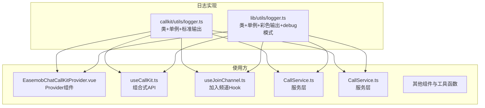
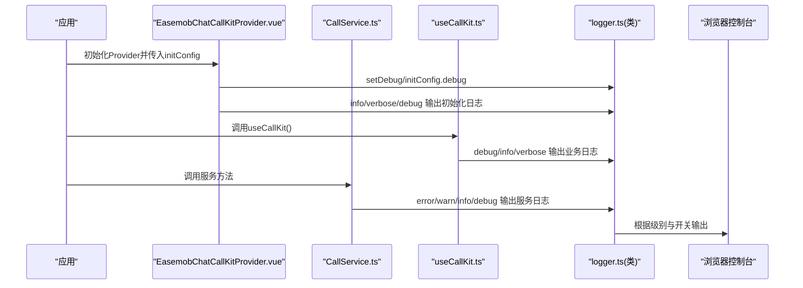
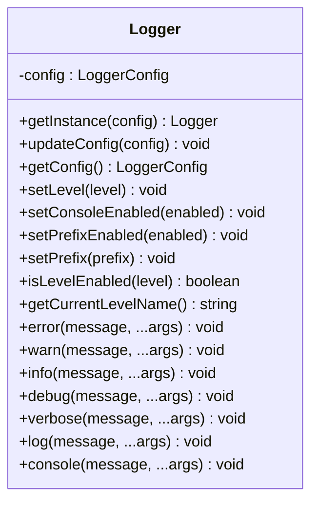
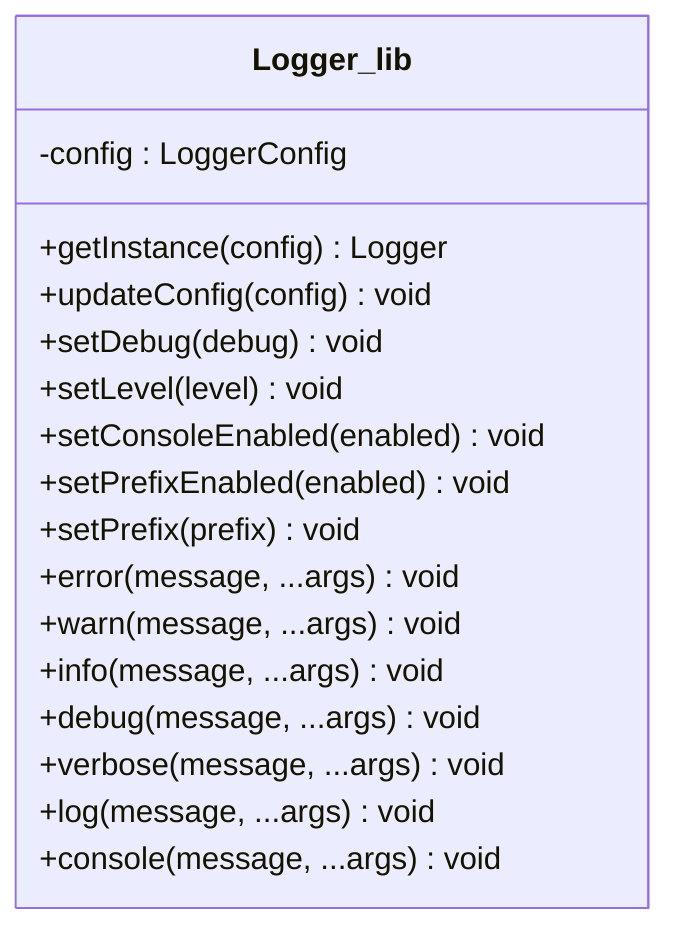
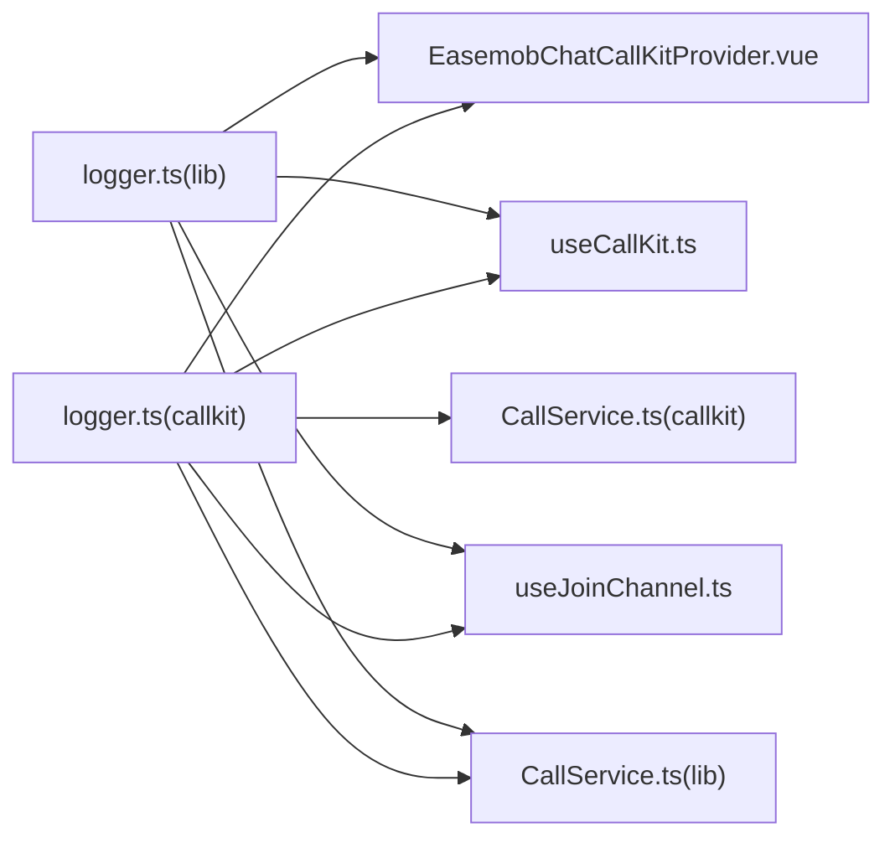

# 日志管理器

<cite>
**本文档引用的文件**
- [logger.ts](file://callkit/utils/logger.ts)
- [logger.ts](file://lib/utils/logger.ts)
- [EasemobChatCallKitProvider.vue](file://lib/components/EasemobChatCallKitProvider.vue)
- [useCallKit.ts](file://lib/composables/useCallKit.ts)
- [useJoinChannel.ts](file://lib/composables/useJoinChannel.ts)
- [CallService.ts](file://lib/services/CallService.ts)
- [CallService.ts](file://callkit/services/CallService.ts)
</cite>

## 更新摘要
**所做更改**
- 新增集中式 Logger 类的完整实现说明
- 更新日志级别管理、颜色输出和配置选项的详细描述
- 增强了日志管理器在 Vue3 生态中的应用说明
- 补充了调试模式自动级别切换的功能说明
- 更新了使用示例和最佳实践指导

## 目录
1. [简介](#简介)
2. [项目结构](#项目结构)
3. [核心组件](#核心组件)
4. [架构总览](#架构总览)
5. [详细组件分析](#详细组件分析)
6. [依赖关系分析](#依赖关系分析)
7. [性能考虑](#性能考虑)
8. [故障排查指南](#故障排查指南)
9. [结论](#结论)
10. [附录](#附录)

## 简介
本文件面向日志管理器模块，系统性阐述其设计目的、核心功能、配置选项与使用方法，覆盖日志级别设置、输出控制与调试信息管理；并提供开发与生产环境的使用示例、与其他组件的集成方式与最佳实践，以及常见问题排查与性能优化建议。日志管理器在本项目中承担统一的日志输出与级别控制职责，贯穿服务层、组合式API与组件层，确保在不同运行环境下具备一致且可控的日志行为。

**更新** 新增集中式 Logger 类，提供完整的日志级别管理、颜色输出和配置选项，替代直接的 console 调用

## 项目结构
日志管理器在项目中存在两套实现：
- callkit/utils/logger.ts：基于类的单例实现，提供标准日志级别与前缀控制，适用于 React/Vue3 组件与服务层。
- lib/utils/logger.ts：基于类的单例实现，新增 ANSI 彩色输出与 debug 模式自动级别切换，适用于 Vue3 生态的 lib 组件。

**图表来源**
- [logger.ts:28-172](file://callkit/utils/logger.ts#L28-L172)
- [logger.ts:50-216](file://lib/utils/logger.ts#L50-L216)
- [EasemobChatCallKitProvider.vue:14-14](file://lib/components/EasemobChatCallKitProvider.vue#L14-L14)
- [useCallKit.ts:5-5](file://lib/composables/useCallKit.ts#L5-L5)
- [useJoinChannel.ts:18-18](file://lib/composables/useJoinChannel.ts#L18-L18)
- [CallService.ts:9-9](file://lib/services/CallService.ts#L9-L9)
- [CallService.ts:12-12](file://callkit/services/CallService.ts#L12-L12)

**章节来源**
- [logger.ts:1-181](file://callkit/utils/logger.ts#L1-L181)
- [logger.ts:1-231](file://lib/utils/logger.ts#L1-L231)

## 核心组件
- 日志级别枚举与名称映射：提供 ERROR、WARN、INFO、DEBUG、VERBOSE 五级日志，便于统一控制输出粒度。
- Logger 类（双实现）：
  - callkit/utils/logger.ts：基础实现，支持设置日志级别、控制台开关、前缀开关与自定义前缀。
  - lib/utils/logger.ts：增强实现，支持 ANSI 彩色输出、debug 模式自动切换至 VERBOSE 级别。
- 单例实例导出：默认导出 logger 实例，便于全局直接使用。
- 便捷方法：提供 logError、logWarn、logInfo、logDebug、logVerbose、log 等快捷方法。

**章节来源**
- [logger.ts:2-17](file://callkit/utils/logger.ts#L2-L17)
- [logger.ts:28-172](file://callkit/utils/logger.ts#L28-L172)
- [logger.ts:1-38](file://lib/utils/logger.ts#L1-L38)
- [logger.ts:50-216](file://lib/utils/logger.ts#L50-L216)

## 架构总览
日志管理器通过单例模式在应用生命周期内统一管理日志配置与输出策略，使用方通过 import 直接调用 logger 或便捷方法，实现跨层一致的日志行为。

**图表来源**
- [EasemobChatCallKitProvider.vue:66-77](file://lib/components/EasemobChatCallKitProvider.vue#L66-L77)
- [useCallKit.ts:18-49](file://lib/composables/useCallKit.ts#L18-L49)
- [CallService.ts:29-75](file://lib/services/CallService.ts#L29-L75)
- [logger.ts:91-94](file://lib/utils/logger.ts#L91-L94)
- [logger.ts:149-154](file://lib/utils/logger.ts#L149-L154)

## 详细组件分析

### 日志级别与配置项
- 日志级别（按严重程度递增）：ERROR < WARN < INFO < DEBUG < VERBOSE
- 配置项：
  - level：当前日志级别阈值
  - enableConsole：是否启用控制台输出
  - enablePrefix：是否启用日志前缀
  - prefix：自定义前缀（默认值见各实现）
  - debug（lib 实现特有）：布尔开关，开启时自动将 level 切换为 VERBOSE

**章节来源**
- [logger.ts:19-25](file://callkit/utils/logger.ts#L19-L25)
- [logger.ts:40-47](file://lib/utils/logger.ts#L40-L47)

### Logger 类（callkit 实现）
- 单例模式：getInstance 支持首次创建与后续更新配置
- 关键方法：
  - setLevel、setConsoleEnabled、setPrefixEnabled、setPrefix
  - isLevelEnabled、getCurrentLevelName
  - error、warn、info、debug、verbose、log、console
- 输出策略：shouldLog 依据 enableConsole 与 level 控制是否输出；formatMessage 统一格式化时间戳、级别与消息

**图表来源**
- [logger.ts:28-172](file://callkit/utils/logger.ts#L28-L172)

**章节来源**
- [logger.ts:28-172](file://callkit/utils/logger.ts#L28-L172)

### Logger 类（lib 实现）
- 在 callkit 实现基础上增加：
  - ANSI_COLORS 与 LogLevelColors：为不同级别输出带颜色的文本
  - setDebug：根据 debug 布尔值自动切换 level 至 VERBOSE 或 ERROR
  - formatMessage：在消息中嵌入 ANSI 颜色控制序列
- 适用场景：Vue3 生态下更直观的日志输出

**图表来源**
- [logger.ts:50-216](file://lib/utils/logger.ts#L50-L216)

**章节来源**
- [logger.ts:1-38](file://lib/utils/logger.ts#L1-L38)
- [logger.ts:50-216](file://lib/utils/logger.ts#L50-L216)

### 使用示例与集成点

#### 开发环境（debug: true）
- Provider 初始化时设置 debug: true，lib 实现会自动将日志级别提升至 VERBOSE，便于开发调试。
- 示例路径：[EasemobChatCallKitProvider.vue:42-47](file://lib/components/EasemobChatCallKitProvider.vue#L42-L47)

#### 生产环境（debug: false）
- Provider 初始化时设置 debug: false，lib 实现会将日志级别降至 ERROR，减少冗余输出。
- 示例路径：[EasemobChatCallKitProvider.vue:20-26](file://lib/components/EasemobChatCallKitProvider.vue#L20-L26)

#### 组件与服务层使用
- 组合式 API useCallKit.ts：在关键流程输出 debug/info/verbose/error，便于追踪业务状态。
  - 示例路径：[useCallKit.ts:18-49](file://lib/composables/useCallKit.ts#L18-L49)
- 服务层 CallService.ts：在邀请、接听、错误处理等关键节点输出日志。
  - 示例路径：[CallService.ts:29-75](file://lib/services/CallService.ts#L29-L75)
- 加入频道 Hook useJoinChannel.ts：在 RTC 令牌获取、频道加入等关键步骤输出日志。
  - 示例路径：[useJoinChannel.ts:42-74](file://lib/composables/useJoinChannel.ts#L42-L74)

#### 组件层动态日志控制
- EasemobChatCallKitProvider.vue：根据 logLevel、enableLogging、logPrefix 动态设置 logger 的级别与前缀。
  - 示例路径：[EasemobChatCallKitProvider.vue:70-81](file://lib/components/EasemobChatCallKitProvider.vue#L70-L81)

**章节来源**
- [EasemobChatCallKitProvider.vue:42-81](file://lib/components/EasemobChatCallKitProvider.vue#L42-L81)
- [useCallKit.ts:18-49](file://lib/composables/useCallKit.ts#L18-L49)
- [CallService.ts:29-75](file://lib/services/CallService.ts#L29-L75)
- [useJoinChannel.ts:42-74](file://lib/composables/useJoinChannel.ts#L42-L74)
- [EasemobChatCallKitProvider.vue:70-81](file://lib/components/EasemobChatCallKitProvider.vue#L70-L81)

## 依赖关系分析
- Logger 类被广泛复用：服务层、组合式 API、Provider、组件、工具函数与铃声管理均通过 import logger 使用。
- 两套实现并存：React/Vue3 组件与服务层多使用 callkit 实现；Vue3 lib 生态使用 lib 实现以获得彩色输出与 debug 自动切换。
- 配置耦合点：Provider 与组件层通过配置驱动 Logger 的行为（级别、前缀、开关）。

**图表来源**
- [logger.ts:28-172](file://callkit/utils/logger.ts#L28-L172)
- [logger.ts:50-216](file://lib/utils/logger.ts#L50-L216)
- [EasemobChatCallKitProvider.vue:14-14](file://lib/components/EasemobChatCallKitProvider.vue#L14-L14)
- [useCallKit.ts:5-5](file://lib/composables/useCallKit.ts#L5-L5)
- [useJoinChannel.ts:18-18](file://lib/composables/useJoinChannel.ts#L18-L18)
- [CallService.ts:9-9](file://lib/services/CallService.ts#L9-L9)
- [CallService.ts:12-12](file://callkit/services/CallService.ts#L12-L12)

**章节来源**
- [logger.ts:28-172](file://callkit/utils/logger.ts#L28-L172)
- [logger.ts:50-216](file://lib/utils/logger.ts#L50-L216)
- [EasemobChatCallKitProvider.vue:14-14](file://lib/components/EasemobChatCallKitProvider.vue#L14-L14)
- [useCallKit.ts:5-5](file://lib/composables/useCallKit.ts#L5-L5)
- [useJoinChannel.ts:18-18](file://lib/composables/useJoinChannel.ts#L18-L18)
- [CallService.ts:9-9](file://lib/services/CallService.ts#L9-L9)
- [CallService.ts:12-12](file://callkit/services/CallService.ts#L12-L12)

## 性能考虑
- 输出控制：通过 setConsoleEnabled(false) 可在生产环境完全关闭控制台输出，降低 I/O 开销。
- 级别过滤：合理设置 level，避免在高频路径输出 VERBOSE，减少字符串拼接与格式化成本。
- 彩色输出：lib 实现的 ANSI 彩色输出在大量日志场景可能带来额外开销，建议在生产关闭 debug 或减少 VERBOSE 输出。
- 前缀与时间戳：formatMessage 会附加时间戳与级别，频繁调用时建议评估性能影响。

## 故障排查指南
- 日志未输出
  - 检查 enableConsole 是否为 true
  - 检查当前级别是否低于 shouldLog 的阈值
  - 示例路径：[logger.ts:122-124](file://lib/utils/logger.ts#L122-L124)
- 日志级别不符合预期
  - 检查 debug 模式是否开启（lib 实现）
  - 检查是否在 Provider 或组件层调用了 setLevel/setDebug
  - 示例路径：[EasemobChatCallKitProvider.vue:71-71](file://lib/components/EasemobChatCallKitProvider.vue#L71-L71)
- 服务层异常
  - CallService 在异常分支输出错误日志，结合错误码定位问题
  - 示例路径：[CallService.ts:38-70](file://lib/services/CallService.ts#L38-L70)

**章节来源**
- [logger.ts:122-124](file://lib/utils/logger.ts#L122-L124)
- [EasemobChatCallKitProvider.vue:71-71](file://lib/components/EasemobChatCallKitProvider.vue#L71-L71)
- [CallService.ts:38-70](file://lib/services/CallService.ts#L38-L70)

## 结论
日志管理器通过统一的单例接口与灵活的配置项，实现了跨层一致的日志输出策略。在开发阶段可通过 debug 模式与 VERBOSE 级别快速定位问题；在生产阶段通过 ERROR 级别与输出开关有效降低噪声与性能开销。结合服务层、组合式 API、Provider 与组件层的使用示例，日志管理器能够满足从底层服务到前端组件的全链路可观测性需求。

**更新** 新增集中式 Logger 类提供了更完善的日志管理能力，包括颜色输出和智能调试模式，显著提升了开发体验和问题诊断效率。

## 附录

### 配置与使用清单
- 基础配置
  - level：设置日志级别
  - enableConsole：启用/禁用控制台输出
  - enablePrefix：启用/禁用前缀
  - prefix：自定义前缀
- lib 特有配置
  - debug：布尔开关，开启时自动将级别设为 VERBOSE
- 常用方法
  - setLevel、setConsoleEnabled、setPrefixEnabled、setPrefix
  - isLevelEnabled、getCurrentLevelName
  - error、warn、info、debug、verbose、log、console

**章节来源**
- [logger.ts:19-25](file://callkit/utils/logger.ts#L19-L25)
- [logger.ts:40-47](file://lib/utils/logger.ts#L40-L47)
- [logger.ts:64-81](file://callkit/utils/logger.ts#L64-L81)
- [logger.ts:102-119](file://lib/utils/logger.ts#L102-L119)
- [logger.ts:209-212](file://lib/utils/logger.ts#L209-L212)