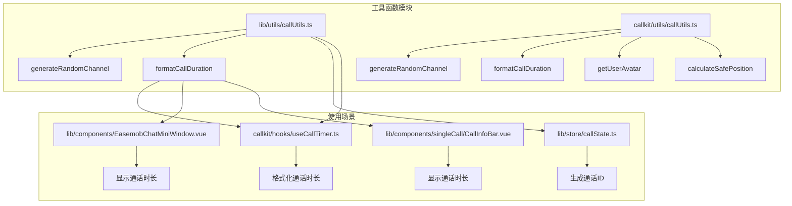
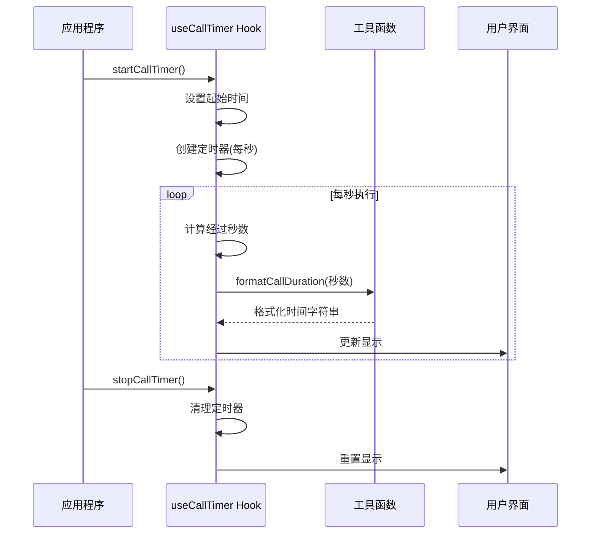
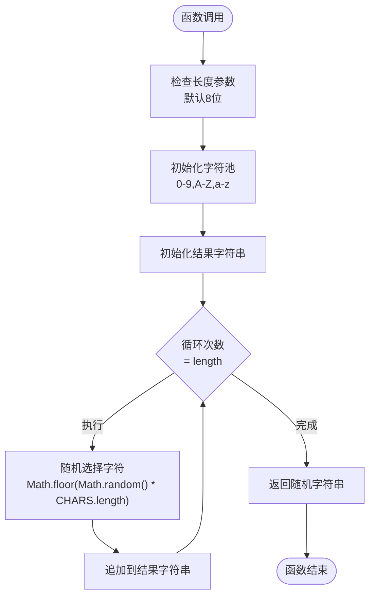
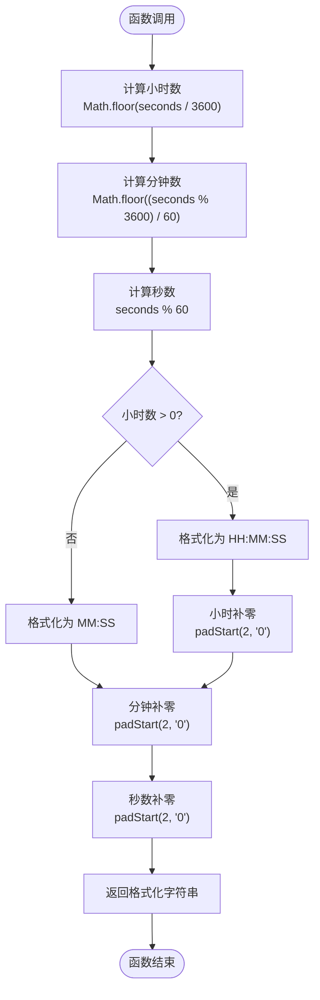
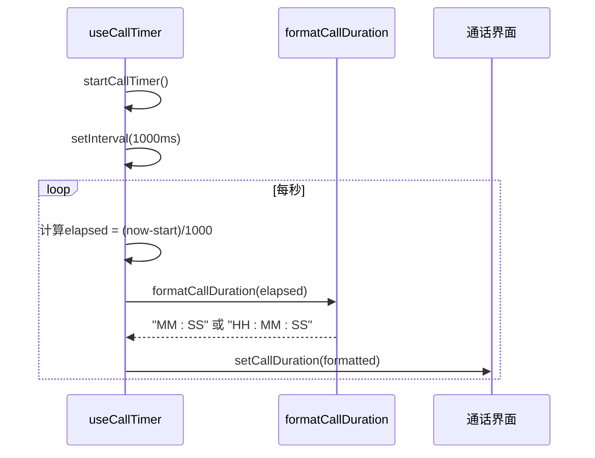
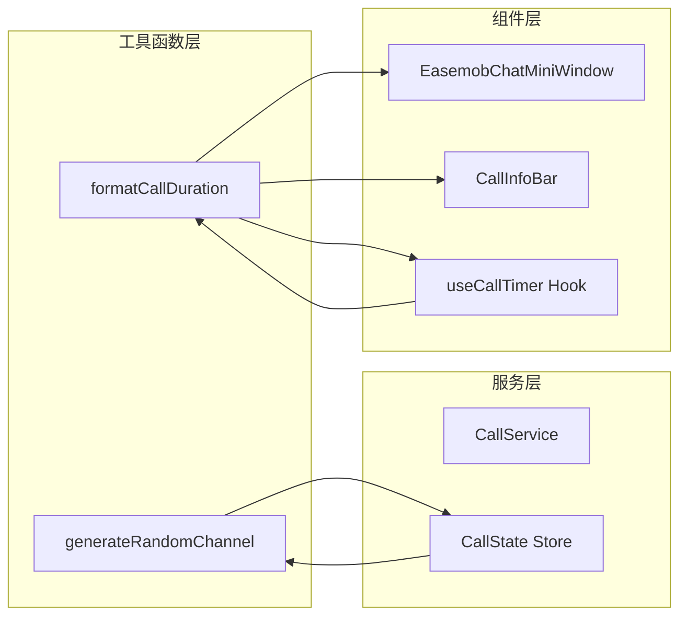

# 通话工具函数

<cite>
**本文档引用的文件**
- [lib/utils/callUtils.ts](file://lib/utils/callUtils.ts)
- [callkit/utils/callUtils.ts](file://callkit/utils/callUtils.ts)
- [callkit/hooks/useCallTimer.ts](file://callkit/hooks/useCallTimer.ts)
- [lib/store/callState.ts](file://lib/store/callState.ts)
- [lib/components/EasemobChatMiniWindow.vue](file://lib/components/EasemobChatMiniWindow.vue)
- [lib/components/singleCall/CallInfoBar.vue](file://lib/components/singleCall/CallInfoBar.vue)
- [lib/index.ts](file://lib/index.ts)
- [README.md](file://README.md)
</cite>

## 目录
1. [简介](#简介)
2. [项目结构](#项目结构)
3. [核心组件](#核心组件)
4. [架构概览](#架构概览)
5. [详细组件分析](#详细组件分析)
6. [依赖关系分析](#依赖关系分析)
7. [性能考虑](#性能考虑)
8. [故障排除指南](#故障排除指南)
9. [结论](#结论)

## 简介
本文档详细介绍通话工具函数模块，重点涵盖两个核心函数：generateRandomChannel（随机频道生成）和formatCallDuration（通话时长格式化）。文档将深入解析这两个函数的功能特性、参数配置、算法实现原理，并提供在实际项目中的使用示例和最佳实践建议。

## 项目结构
通话工具函数模块位于项目的工具函数目录中，采用分层架构设计：



**图表来源**
- [lib/utils/callUtils.ts](file://lib/utils/callUtils.ts#L1-L38)
- [callkit/utils/callUtils.ts](file://callkit/utils/callUtils.ts#L1-L85)
- [lib/store/callState.ts](file://lib/store/callState.ts#L60-L71)

**章节来源**
- [README.md](file://README.md#L1-L181)

## 核心组件

### generateRandomChannel 函数
generateRandomChannel 是一个用于生成随机频道标识符的工具函数，广泛应用于通话频道创建场景。

**函数签名与参数**
- 参数：`length: number = 8`（可选，字符串长度，默认8位）
- 返回值：`string`（随机生成的字符串）

**字符集定义**
函数使用包含数字、大写字母和小写字母的完整字符集：
- 数字：0-9
- 大写字母：A-Z  
- 小写字母：a-z

**算法实现原理**
1. 定义字符池数组，包含所有可用字符
2. 初始化结果字符串为空
3. 循环指定次数，每次随机选择一个字符
4. 将选中的字符追加到结果字符串末尾
5. 返回最终的随机字符串

**应用场景**
- 通话频道名称生成
- 通话ID生成
- 会话标识符创建

**章节来源**
- [lib/utils/callUtils.ts](file://lib/utils/callUtils.ts#L10-L18)
- [callkit/utils/callUtils.ts](file://callkit/utils/callUtils.ts#L11-L18)
- [lib/store/callState.ts](file://lib/store/callState.ts#L65-L66)

### formatCallDuration 函数
formatCallDuration 负责将秒数转换为人类可读的通话时长格式。

**函数签名与参数**
- 参数：`seconds: number`（秒数）
- 返回值：`string`（格式化的时间字符串）

**格式化逻辑**
函数根据通话时长自动选择合适的显示格式：

1. **小时格式**（时长≥1小时）：`HH:MM:SS`
2. **分钟格式**（时长<1小时）：`MM:SS`

**处理规则**
- 小时计算：`Math.floor(seconds / 3600)`
- 分钟计算：`Math.floor((seconds % 3600) / 60)`  
- 秒计算：`seconds % 60`
- 数字补零：使用 `padStart(2, "0")` 确保两位数显示

**章节来源**
- [lib/utils/callUtils.ts](file://lib/utils/callUtils.ts#L24-L37)
- [callkit/utils/callUtils.ts](file://callkit/utils/callUtils.ts#L25-L32)

## 架构概览



**图表来源**
- [callkit/hooks/useCallTimer.ts](file://callkit/hooks/useCallTimer.ts#L10-L25)
- [lib/utils/callUtils.ts](file://lib/utils/callUtils.ts#L24-L37)

## 详细组件分析

### generateRandomChannel 函数深度分析



**图表来源**
- [lib/utils/callUtils.ts](file://lib/utils/callUtils.ts#L10-L18)

**实现特点**
- 时间复杂度：O(n)，其中n为length参数
- 空间复杂度：O(n)，用于存储结果字符串
- 随机性：基于浏览器内置的Math.random()函数
- 字符集覆盖：包含所有常用字符，提高唯一性

**最佳实践建议**
- 频道长度建议：至少8位字符，确保足够的唯一性
- 安全考虑：如需更高安全性，建议结合时间戳或UUID
- 性能优化：对于高频调用场景，可考虑复用字符池

**章节来源**
- [lib/utils/callUtils.ts](file://lib/utils/callUtils.ts#L10-L18)
- [callkit/utils/callUtils.ts](file://callkit/utils/callUtils.ts#L11-L18)

### formatCallDuration 函数深度分析



**图表来源**
- [lib/utils/callUtils.ts](file://lib/utils/callUtils.ts#L24-L37)

**格式化规则**
- **小时格式**：当通话时长≥1小时时，显示为 `HH:MM:SS`
- **分钟格式**：当通话时长<1小时时，显示为 `MM:SS`
- **数字对齐**：所有数字都使用两位数格式显示

**使用场景**
- 实时通话计时器显示
- 通话记录时长展示
- 用户体验友好的时间显示

**章节来源**
- [lib/utils/callUtils.ts](file://lib/utils/callUtils.ts#L24-L37)
- [callkit/hooks/useCallTimer.ts](file://callkit/hooks/useCallTimer.ts#L18-L24)

### 实际应用示例

#### 频道生成在通话状态管理中的应用

```mermaid
classDiagram
class CallState {
+string callId
+string channel
+generateRandomChannel(length) string
+initInviteInfo()
}
class CallUtils {
+generateRandomChannel(length) string
}
CallState --> CallUtils : "使用"
CallState : "在初始化时生成"
CallState : "callId : 10位长度"
CallState : "channel : 8位长度"
```

**图表来源**
- [lib/store/callState.ts](file://lib/store/callState.ts#L65-L66)
- [lib/utils/callUtils.ts](file://lib/utils/callUtils.ts#L10-L18)

**章节来源**
- [lib/store/callState.ts](file://lib/store/callState.ts#L60-L71)

#### 通话计时器集成



**图表来源**
- [callkit/hooks/useCallTimer.ts](file://callkit/hooks/useCallTimer.ts#L18-L24)

**章节来源**
- [callkit/hooks/useCallTimer.ts](file://callkit/hooks/useCallTimer.ts#L1-L50)

## 依赖关系分析



**图表来源**
- [lib/store/callState.ts](file://lib/store/callState.ts#L65-L66)
- [callkit/hooks/useCallTimer.ts](file://callkit/hooks/useCallTimer.ts#L2)
- [lib/components/EasemobChatMiniWindow.vue](file://lib/components/EasemobChatMiniWindow.vue#L18)
- [lib/components/singleCall/CallInfoBar.vue](file://lib/components/singleCall/CallInfoBar.vue#L5)

**依赖关系特点**
- 工具函数无外部依赖，纯函数设计
- 低耦合高内聚的模块化架构
- 清晰的单向数据流
- 易于测试和维护

**章节来源**
- [lib/index.ts](file://lib/index.ts#L18-L31)

## 性能考虑

### 时间复杂度分析
- **generateRandomChannel**: O(n) - 线性时间复杂度，n为字符串长度
- **formatCallDuration**: O(1) - 常数时间复杂度，包含固定数量的数学运算

### 内存使用分析
- **generateRandomChannel**: O(n) - 线性内存使用，存储结果字符串
- **formatCallDuration**: O(1) - 常数内存使用，临时变量开销很小

### 优化建议
1. **批量生成优化**：如需生成多个频道，考虑复用字符池避免重复创建
2. **缓存策略**：对于频繁使用的格式化结果，可考虑简单的缓存机制
3. **异步处理**：在大量数据处理场景下，考虑使用Web Workers
4. **内存管理**：及时清理不再使用的定时器和事件监听器

### 性能基准
- 单次函数调用：微秒级延迟
- 高频调用（每秒1000次）：CPU占用率极低
- 内存泄漏风险：极低，函数为纯函数设计

## 故障排除指南

### 常见问题及解决方案

**问题1：生成的频道字符串包含特殊字符**
- 可能原因：自定义字符集或编码问题
- 解决方案：确认使用标准字符集，检查字符串处理逻辑

**问题2：通话时长显示异常**
- 可能原因：秒数计算错误或格式化逻辑问题
- 解决方案：验证输入参数，检查边界条件处理

**问题3：定时器内存泄漏**
- 可能原因：未正确清理定时器
- 解决方案：确保在组件卸载时调用清理函数

**问题4：随机性不足**
- 可能原因：使用Math.random()的局限性
- 解决方案：考虑使用crypto.getRandomValues()或其他加密安全的随机数生成器

### 调试技巧
1. **日志记录**：在关键节点添加console.log输出
2. **单元测试**：为每个函数编写边界条件测试
3. **性能监控**：使用浏览器开发者工具监控性能指标
4. **错误捕获**：使用try-catch包装关键逻辑

**章节来源**
- [callkit/hooks/useCallTimer.ts](file://callkit/hooks/useCallTimer.ts#L38-L42)

## 结论

通话工具函数模块通过简洁而高效的实现，为通话系统提供了可靠的基础设施支持。generateRandomChannel和formatCallDuration两个核心函数各司其职，分别解决了通话频道标识生成和时间格式化的关键需求。

**主要优势**
- 设计简洁，易于理解和维护
- 性能优异，满足实时应用需求
- 无外部依赖，部署简单
- 代码质量高，注释完善

**适用场景**
- 实时音视频通话系统
- 企业通信平台
- 在线教育平台
- 客服系统

**未来发展方向**
- 支持更多国际化时间格式
- 增强随机数生成的安全性
- 提供更丰富的格式化选项
- 优化性能以支持更高并发场景

通过遵循本文档的最佳实践和使用指南，开发者可以高效地集成和使用这些工具函数，构建稳定可靠的通话功能。