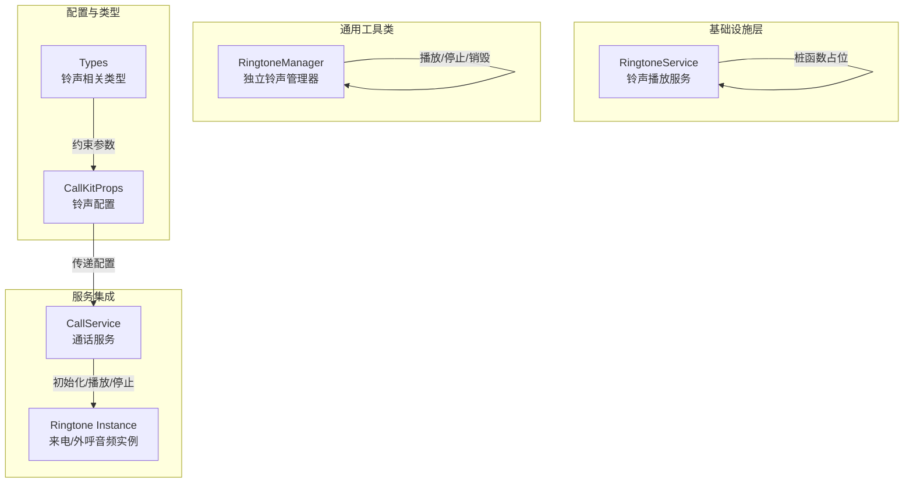
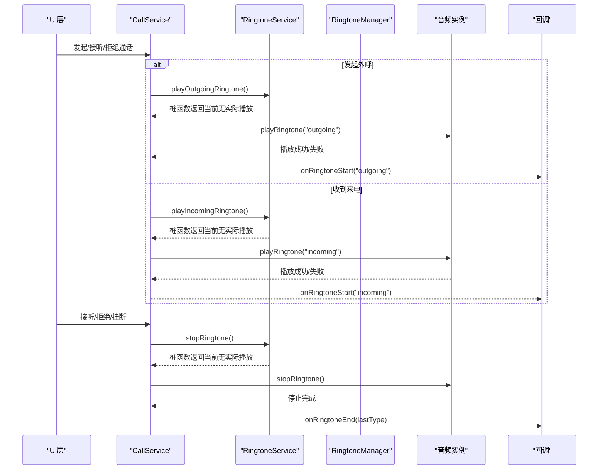
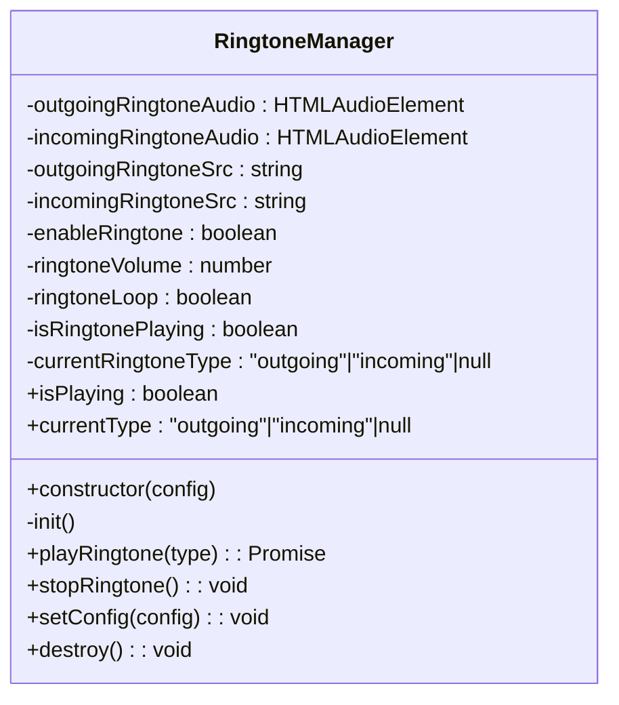
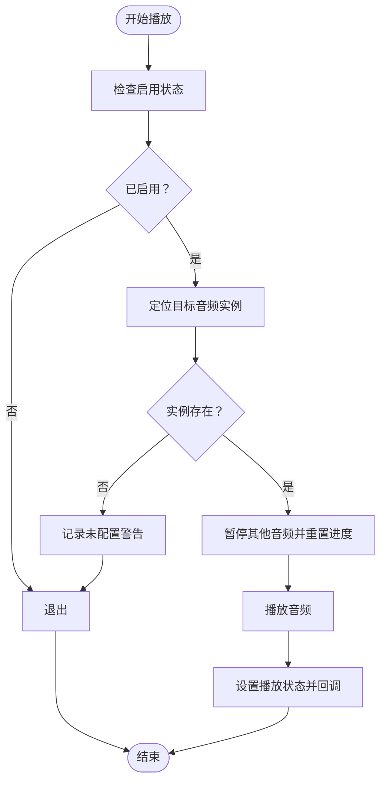
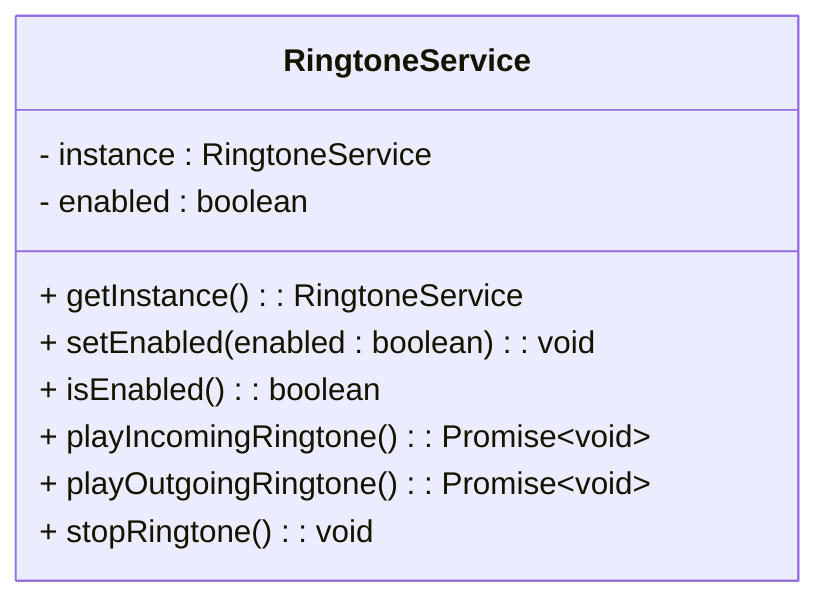
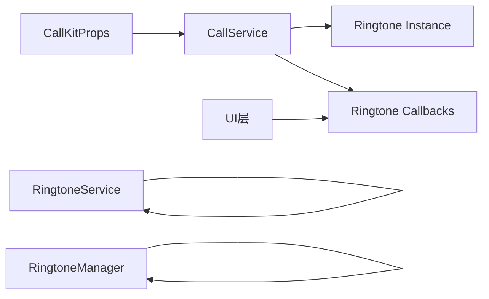

# 铃声管理器

<cite>
**本文档引用的文件**
- [ringtone.ts](file://lib/utils/ringtone.ts)
- [ringtoneManager.ts](file://callkit/utils/ringtoneManager.ts)
- [CallService.ts](file://callkit/services/CallService.ts)
- [index.ts](file://callkit/types/index.ts)
- [integration.md](file://callkit/docs/integration.md)
- [customization.md](file://callkit/docs/customization.md)
- [logger.ts](file://callkit/utils/logger.ts)
- [EasemobChatCallKitProvider.vue](file://lib/components/EasemobChatCallKitProvider.vue)
- [README.md](file://lib/callkit-static-assets/sounds/铃声说明.md)
</cite>

## 更新摘要
**变更内容**
- 新增 RingtoneService 基础设施类，作为铃声播放服务的核心实现
- RingtoneService 当前为桩函数占位，为后续音频集成做准备
- 保持原有 RingtoneManager 和 CallService 的现有功能不变
- 新增 RingtoneService 的架构设计和使用指导

## 目录
1. [简介](#简介)
2. [项目结构](#项目结构)
3. [核心组件](#核心组件)
4. [架构概览](#架构概览)
5. [详细组件分析](#详细组件分析)
6. [RingtoneService 基础设施](#ringtoneservice-基础设施)
7. [依赖关系分析](#依赖关系分析)
8. [性能考虑](#性能考虑)
9. [故障排查指南](#故障排查指南)
10. [结论](#结论)
11. [附录](#附录)

## 简介
本文件面向音视频通话场景中的铃声管理器模块，系统阐述其在通话生命周期中的作用与实现机制。铃声管理器负责来电铃声、外呼铃声等不同类型铃声的加载、播放控制与停止，确保在不同通话状态下（响铃、通话中、结束）提供恰当的声音反馈。文档同时覆盖铃声资源格式要求、自定义扩展方法、跨浏览器与设备兼容性处理，以及常见问题的调试排查路径。

**更新** 新增 RingtoneService 基础设施类，作为未来音频集成的核心实现基础。

## 项目结构
铃声管理器在项目中主要以三类形态出现：
- 基础设施类：RingtoneService 提供统一的铃声播放服务接口
- 通用工具类：RingtoneManager 提供独立的铃声播放能力
- 服务集成：CallService 中内嵌铃声播放逻辑，与通话状态机紧密耦合

**图表来源**
- [ringtone.ts:1-47](file://lib/utils/ringtone.ts#L1-L47)
- [ringtoneManager.ts:1-138](file://callkit/utils/ringtoneManager.ts#L1-L138)
- [CallService.ts:198-208](file://callkit/services/CallService.ts#L198-L208)

**章节来源**
- [ringtone.ts:1-47](file://lib/utils/ringtone.ts#L1-L47)
- [ringtoneManager.ts:1-138](file://callkit/utils/ringtoneManager.ts#L1-L138)
- [CallService.ts:198-208](file://callkit/services/CallService.ts#L198-L208)
- [index.ts:208-214](file://callkit/types/index.ts#L208-L214)

## 核心组件
- RingtoneService（基础设施类）
  - 单例模式设计，提供统一的铃声播放接口
  - 当前为桩函数占位，预留 playIncomingRingtone、playOutgoingRingtone、stopRingtone 方法
  - 支持启用状态管理和日志输出
- RingtoneManager（通用工具类）
  - 提供外呼/来电铃声的初始化、播放、停止与销毁能力
  - 支持音量、循环播放、启用开关等配置
  - 提供播放状态与当前类型查询
- CallService（服务集成）
  - 在通话状态机中内嵌铃声播放逻辑
  - 与邀请、响铃、接听、挂断等状态联动
  - 提供铃声开始/结束回调，便于UI同步

**章节来源**
- [ringtone.ts:8-46](file://lib/utils/ringtone.ts#L8-L46)
- [ringtoneManager.ts:6-138](file://callkit/utils/ringtoneManager.ts#L6-L138)
- [CallService.ts:4361-4477](file://callkit/services/CallService.ts#L4361-L4477)
- [index.ts:208-214](file://callkit/types/index.ts#L208-L214)

## 架构概览
铃声管理器在通话生命周期中的关键交互如下：

**图表来源**
- [CallService.ts:4377-4438](file://callkit/services/CallService.ts#L4377-L4438)
- [ringtone.ts:27-45](file://lib/utils/ringtone.ts#L27-L45)
- [ringtoneManager.ts:50-96](file://callkit/utils/ringtoneManager.ts#L50-L96)

**章节来源**
- [CallService.ts:4377-4438](file://callkit/services/CallService.ts#L4377-L4438)
- [ringtone.ts:27-45](file://lib/utils/ringtone.ts#L27-L45)
- [ringtoneManager.ts:50-96](file://callkit/utils/ringtoneManager.ts#L50-L96)

## 详细组件分析

### RingtoneManager（通用工具类）
- 设计要点
  - 私有音频实例分别承载外呼与来电铃声
  - 初始化时根据配置设置音量、循环与预加载策略
  - 播放前先停止当前播放，避免并发冲突
  - 提供安全的停止逻辑，确保暂停并重置播放位置
- 关键方法
  - playRingtone(type)：按类型播放铃声，触发播放状态更新
  - stopRingtone()：停止当前播放并清理状态
  - setConfig(config)：动态更新铃声配置并重建音频实例
  - destroy()：释放资源
  - getter：isPlaying/currentType
- 数据结构与复杂度
  - 音频实例：O(1) 初始化与操作
  - 播放/停止：O(1)
  - 配置更新：O(1) 重建实例

**图表来源**
- [ringtoneManager.ts:6-138](file://callkit/utils/ringtoneManager.ts#L6-L138)

**章节来源**
- [ringtoneManager.ts:6-138](file://callkit/utils/ringtoneManager.ts#L6-L138)

### CallService（服务集成）
- 设计要点
  - 在构造阶段延迟初始化铃声，确保其他资源就绪
  - 与通话状态机强耦合：发起外呼时播放外呼铃声；响铃状态播放来电铃声
  - 播放前遍历页面所有音频元素并暂停，避免浏览器自动播放限制
  - 提供onRingtoneStart/onRingtoneEnd回调，便于UI层同步
- 关键流程
  - 初始化：根据配置创建音频实例
  - 播放：检查启用状态与播放状态，暂停其他音频，播放目标铃声
  - 停止：根据当前类型定位音频实例，暂停并重置

**图表来源**
- [CallService.ts:4377-4410](file://callkit/services/CallService.ts#L4377-L4410)

**章节来源**
- [CallService.ts:4361-4477](file://callkit/services/CallService.ts#L4361-L4477)

### 铃声配置与类型约束
- CallKitProps中的铃声配置项
  - outgoingRingtoneSrc：外呼铃声资源路径
  - incomingRingtoneSrc：来电铃声资源路径
  - enableRingtone：是否启用铃声
  - ringtoneVolume：音量范围0-1
  - ringtoneLoop：是否循环播放
- 类型约束与默认值
  - ringtoneVolume默认0.8
  - ringtoneLoop默认true
  - enableRingtone默认true

**章节来源**
- [index.ts:208-214](file://callkit/types/index.ts#L208-L214)

## RingtoneService 基础设施

### 设计概述
RingtoneService 是铃声播放服务的基础实现，采用单例模式设计，为未来的音频集成提供统一接口。当前版本为桩函数占位，预留了完整的API接口，便于后续无缝集成实际音频播放功能。

### 核心特性
- **单例模式**：getInstance() 确保全局唯一实例
- **启用控制**：setEnabled()/isEnabled() 管理铃声播放开关
- **统一接口**：提供标准化的铃声播放方法
- **日志记录**：桩函数中包含详细的调试日志输出

### API 接口
- `playIncomingRingtone()`：播放来电铃声
- `playOutgoingRingtone()`：播放去电铃声  
- `stopRingtone()`：停止当前铃声播放
- `setEnabled(enabled: boolean)`：设置启用状态
- `isEnabled()`：获取启用状态

### 当前状态与迁移路径
- **桩函数状态**：所有播放方法当前只输出调试日志，不实际播放音频
- **迁移准备**：保留完整的API接口，便于后续接入真实音频资源
- **向后兼容**：现有CallService和RingtoneManager不受影响

**图表来源**
- [ringtone.ts:8-46](file://lib/utils/ringtone.ts#L8-L46)

**章节来源**
- [ringtone.ts:1-47](file://lib/utils/ringtone.ts#L1-L47)

## 依赖关系分析
- 组件耦合
  - RingtoneService 为基础设施层，提供统一接口
  - RingtoneManager 为独立工具类，低耦合，可复用
  - CallService 内嵌铃声逻辑，与通话状态机耦合较高
- 外部依赖
  - Web Audio API（HTMLAudioElement）
  - 浏览器自动播放策略与限制
- 回调链路
  - CallService 通过onRingtoneStart/onRingtoneEnd向上层回调
  - RingtoneService 当前为桩函数，不参与实际回调
  - UI层可据此更新响铃状态与提示

**图表来源**
- [index.ts:208-214](file://callkit/types/index.ts#L208-L214)
- [CallService.ts:198-208](file://callkit/services/CallService.ts#L198-L208)
- [ringtone.ts:1-47](file://lib/utils/ringtone.ts#L1-L47)

**章节来源**
- [index.ts:208-214](file://callkit/types/index.ts#L208-L214)
- [CallService.ts:198-208](file://callkit/services/CallService.ts#L198-L208)
- [ringtone.ts:1-47](file://lib/utils/ringtone.ts#L1-L47)

## 性能考虑
- 预加载策略：初始化时设置preload='auto'，减少首次播放延迟
- 并发控制：播放前暂停其他音频并重置进度，避免资源竞争
- 配置更新：setConfig会重建音频实例，避免频繁切换导致的状态混乱
- 音量边界：对ringtoneVolume进行0-1范围约束，防止异常值影响体验
- **RingtoneService 优化**：单例模式避免重复实例化开销

## 故障排查指南
- 常见问题与定位
  - 铃声未播放
    - 检查enableRingtone是否为true
    - 确认资源路径正确且可访问
    - 查看浏览器自动播放策略限制
    - **RingtoneService 检查**：确认 RingtoneService 实例已正确初始化
  - 铝声无法停止
    - 确认stopRingtone调用时机与播放状态一致
    - 检查是否有其他音频实例仍在播放
    - **RingtoneService 检查**：验证 stopRingtone 方法调用是否生效
  - 音量异常
    - 确认ringtoneVolume在0-1范围内
    - 检查设备音量与系统静音状态
- 日志辅助
  - 使用logger记录初始化、播放、停止过程中的关键信息
  - **RingtoneService 日志**：桩函数输出详细的调试信息
  - 通过日志级别调整输出详细程度，便于定位问题

**章节来源**
- [logger.ts:28-181](file://callkit/utils/logger.ts#L28-L181)
- [CallService.ts:4377-4438](file://callkit/services/CallService.ts#L4377-L4438)
- [ringtoneManager.ts:50-96](file://callkit/utils/ringtoneManager.ts#L50-L96)
- [ringtone.ts:28-45](file://lib/utils/ringtone.ts#L28-L45)

## 结论
铃声管理器在音视频通话中承担着重要的感知反馈职责。通过基础设施层的 RingtoneService、通用工具类与服务集成三种实现方式，既能满足灵活复用的需求，也能与通话状态机深度协同。RingtoneService 的引入为未来的音频集成提供了统一的基础设施，当前的桩函数占位确保了系统的稳定性，同时为后续的功能扩展做好了充分准备。遵循本文档的配置规范、格式要求与调试方法，可在多浏览器与设备环境下稳定运行，并提供良好的用户体验。

## 附录

### 铃声资源格式与推荐配置
- 格式：MP3
- 时长：建议2-5秒
- 音质：建议128kbps或更高
- 大小：建议不超过100KB
- 资源文件名：outgoing_ringtone.mp3、incoming_ringtone.mp3

**章节来源**
- [README.md:1-38](file://lib/callkit-static-assets/sounds/铃声说明.md#L1-L38)

### 铃声配置项一览
- outgoingRingtoneSrc：外呼铃声资源路径
- incomingRingtoneSrc：来电铃声资源路径
- enableRingtone：是否启用铃声
- ringtoneVolume：音量（0-1）
- ringtoneLoop：是否循环播放

**章节来源**
- [index.ts:208-214](file://callkit/types/index.ts#L208-L214)
- [customization.md:50-58](file://callkit/docs/customization.md#L50-L58)

### 铃声自定义与扩展
- 资源替换：将自定义铃声文件放置在静态资源目录，更新对应配置项
- 回调扩展：通过onRingtoneStart/onRingtoneEnd回调扩展UI提示或统计埋点
- Vue3集成：在Provider中设置enableRingtone等全局配置
- **RingtoneService 扩展**：基于现有桩函数接口，逐步替换为实际音频播放逻辑

**章节来源**
- [integration.md:105-108](file://callkit/docs/integration.md#L105-L108)
- [EasemobChatCallKitProvider.vue:20-26](file://lib/components/EasemobChatCallKitProvider.vue#L20-L26)
- [ringtone.ts:1-47](file://lib/utils/ringtone.ts#L1-L47)