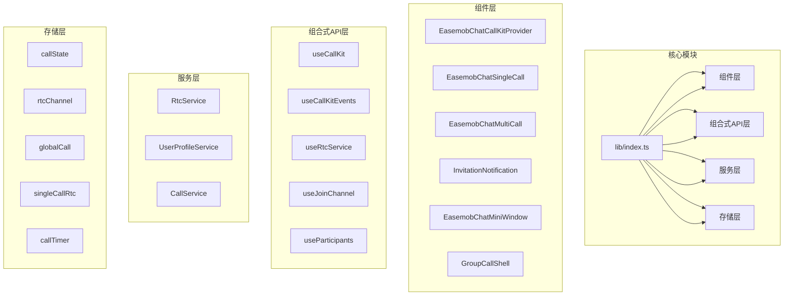
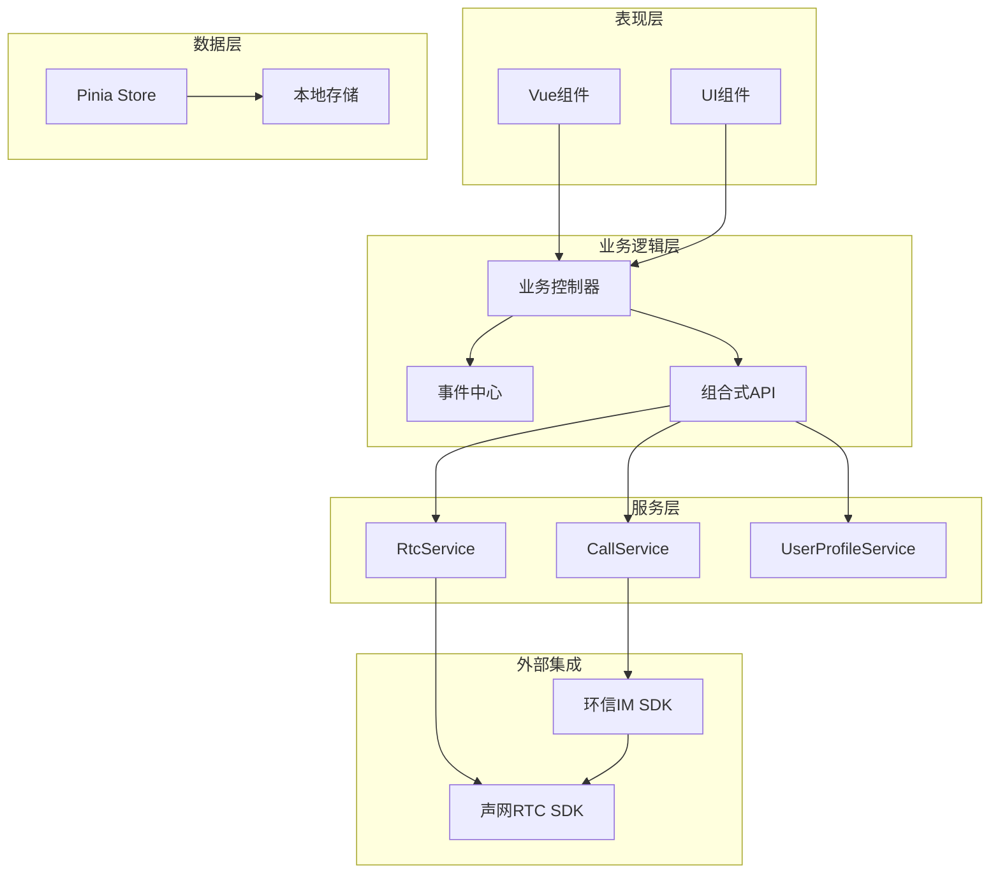
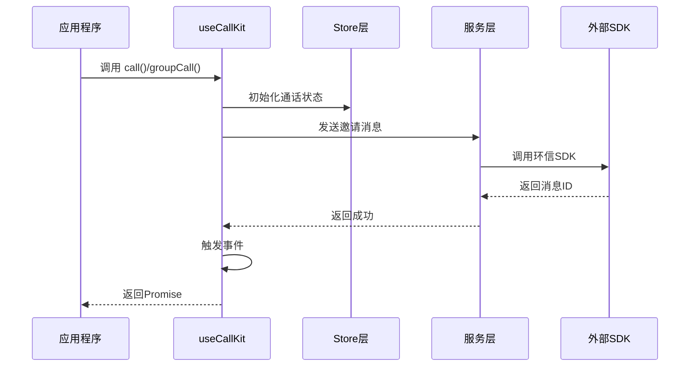
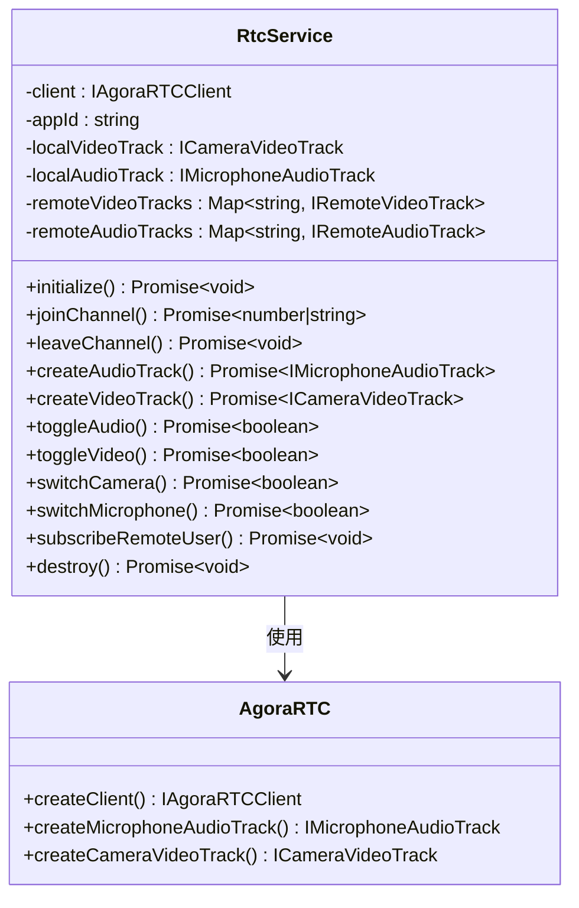
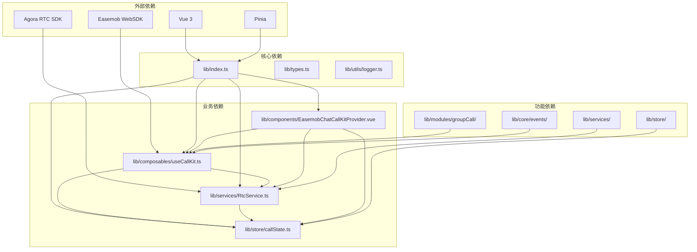

# AI集成技能

<cite>
**本文档引用的文件**
- [package.json](file://package.json)
- [lib/index.ts](file://lib/index.ts)
- [QUICK_START.md](file://QUICK_START.md)
- [USAGE.md](file://USAGE.md)
- [skills/callkit-integration.md](file://skills/callkit-integration.md)
- [lib/types.ts](file://lib/types.ts)
- [lib/composables/useCallKit.ts](file://lib/composables/useCallKit.ts)
- [lib/services/RtcService.ts](file://lib/services/RtcService.ts)
- [lib/store/callState.ts](file://lib/store/callState.ts)
- [lib/components/EasemobChatCallKitProvider.vue](file://lib/components/EasemobChatCallKitProvider.vue)
- [lib/modules/groupCall/index.ts](file://lib/modules/groupCall/index.ts)
- [lib/core/events/CallKitEventBus.ts](file://lib/core/events/CallKitEventBus.ts)
- [lib/utils/logger.ts](file://lib/utils/logger.ts)
</cite>

## 目录
1. [简介](#简介)
2. [项目结构](#项目结构)
3. [核心组件](#核心组件)
4. [架构概览](#架构概览)
5. [详细组件分析](#详细组件分析)
6. [依赖关系分析](#依赖关系分析)
7. [性能考虑](#性能考虑)
8. [故障排除指南](#故障排除指南)
9. [结论](#结论)
10. [附录](#附录)

## 简介

Easemob Chat CallKit Vue3 是一个专为 Vue 3 应用程序设计的即时通讯音视频通话解决方案。该项目集成了环信 IM SDK 和声网 RTC SDK，提供了完整的音视频通话功能，包括一对一通话、群组通话、通话状态管理、事件监听等核心能力。

该项目的核心优势在于其高度模块化的架构设计，通过插件化的方式无缝集成到现有的 Vue 3 项目中，开发者可以轻松地为应用程序添加专业的音视频通话功能。

## 项目结构

项目采用典型的 Vue 3 插件架构，主要分为以下几个核心模块：

**图表来源**
- [lib/index.ts:1-99](file://lib/index.ts#L1-L99)
- [lib/components/EasemobChatCallKitProvider.vue:1-155](file://lib/components/EasemobChatCallKitProvider.vue#L1-L155)

**章节来源**
- [lib/index.ts:1-99](file://lib/index.ts#L1-L99)
- [package.json:1-76](file://package.json#L1-L76)

## 核心组件

### 插件入口

项目通过一个统一的插件入口提供所有功能，开发者只需简单的几行代码即可集成完整的音视频通话功能。

### 组件体系

项目提供了完整的组件体系，包括通话控制组件、UI 组件和工具组件：

- **通话控制组件**: EasemobChatSingleCall、EasemobChatMultiCall
- **UI 组件**: InvitationNotification、EasemobChatMiniWindow
- **壳组件**: GroupCallShell
- **提供者组件**: EasemobChatCallKitProvider

### 组合式API

通过组合式API提供统一的通话控制接口，包括发起通话、接听、挂断、事件监听等功能。

**章节来源**
- [lib/index.ts:22-39](file://lib/index.ts#L22-L39)
- [lib/types.ts:67-102](file://lib/types.ts#L67-L102)

## 架构概览

项目采用了分层架构设计，确保各层之间的职责清晰分离：

**图表来源**
- [lib/composables/useCallKit.ts:14-246](file://lib/composables/useCallKit.ts#L14-L246)
- [lib/services/RtcService.ts:51-771](file://lib/services/RtcService.ts#L51-L771)

## 详细组件分析

### EasemobChatCallKitProvider 组件

Provider 组件是整个 CallKit 系统的根组件，负责初始化和协调各个子系统的工作。

#### 核心功能

1. **初始化管理**: 负责初始化环信客户端、RTC 服务和各种监听器
2. **配置管理**: 提供全局配置选项，包括日志级别、铃声、窗口行为等
3. **事件监听**: 挂载文本消息监听器和信号监听器
4. **资源清理**: 在组件卸载时清理 RTC 服务和用户资料提供者

#### 配置选项

| 配置项 | 类型 | 默认值 | 说明 |
|--------|------|--------|------|
| debug | boolean | false | 开启调试模式 |
| logLevel | LogLevel | LogLevel.ERROR | 日志输出级别 |
| enableRingtone | boolean | true | 开启来电铃声 |
| resizable | boolean | true | 通话窗口可调整大小 |
| draggable | boolean | true | 通话窗口可拖动 |
| inviteTimeout | number | 30000 | 邀请超时时间(毫秒) |

**章节来源**
- [lib/components/EasemobChatCallKitProvider.vue:20-82](file://lib/components/EasemobChatCallKitProvider.vue#L20-L82)
- [lib/components/EasemobChatCallKitProvider.vue:102-142](file://lib/components/EasemobChatCallKitProvider.vue#L102-L142)

### useCallKit 组合式API

useCallKit 提供了统一的通话控制接口，简化了音视频通话的复杂性。

#### 核心方法

**图表来源**
- [lib/composables/useCallKit.ts:22-149](file://lib/composables/useCallKit.ts#L22-L149)

#### 方法详解

1. **call()**: 发起一对一通话
   - 参数: targetId(目标用户ID), type(通话类型), msg(邀请消息), userInfo(用户信息)
   - 功能: 发送通话邀请消息，初始化通话状态

2. **groupCall()**: 发起群组通话
   - 参数: groupId(群组ID), members(成员列表), type(通话类型), msg(邀请消息)
   - 功能: 发送群组通话邀请，初始化群组通话状态

3. **hangup()**: 挂断通话
   - 参数: reason(挂断原因)
   - 功能: 结束当前通话，清理资源

4. **accept()/reject()/rejectBusy()**: 通话应答控制
   - 功能: 处理被叫方的通话应答、拒绝、忙碌拒绝

**章节来源**
- [lib/composables/useCallKit.ts:14-246](file://lib/composables/useCallKit.ts#L14-L246)

### RtcService 服务

RtcService 是音视频通话的核心服务，封装了所有与声网 RTC SDK 的交互。

#### 核心功能

1. **客户端管理**: 创建和管理 Agora RTC 客户端实例
2. **频道管理**: 加入、离开 RTC 频道
3. **轨道管理**: 管理本地和远程音视频轨道
4. **设备管理**: 管理摄像头、麦克风等音视频设备
5. **事件处理**: 处理用户加入、离开、发布等事件

#### 服务架构

**图表来源**
- [lib/services/RtcService.ts:51-771](file://lib/services/RtcService.ts#L51-L771)

**章节来源**
- [lib/services/RtcService.ts:18-49](file://lib/services/RtcService.ts#L18-L49)

### 状态管理系统

项目使用 Pinia 作为状态管理工具，提供了多个专门的状态存储：

#### callState Store

管理核心通话状态，包括通话状态、用户信息、超时计时器等。

| 状态字段 | 类型 | 说明 |
|----------|------|------|
| status | CALL_STATUS | 当前通话状态 |
| callId | string | 通话唯一ID |
| channel | string | RTC频道名 |
| token | string | RTC Token |
| type | CALL_TYPE | 通话类型 |
| callerUserId | string | 主叫方用户ID |
| calleeUserId | string | 被叫方用户ID |
| inviteTimeout | number | 邀请超时时间 |
| inviteTimeoutTimer | number | 超时定时器ID |

#### rtcChannel Store

管理 RTC 频道状态，包括本地/远程媒体流、频道列表等。

#### globalCall Store

管理跨通话域的共享状态，如用户资料映射、窗口最小化状态等。

**章节来源**
- [lib/store/callState.ts:9-31](file://lib/store/callState.ts#L9-L31)
- [lib/store/callState.ts:36-177](file://lib/store/callState.ts#L36-L177)

### 事件系统

项目实现了轻量级的事件总线系统，用于通话生命周期事件的发布和订阅。

#### 事件类型

| 事件名称 | 触发时机 | 参数说明 |
|----------|----------|----------|
| statusChanged | 通话状态变化 | from(旧状态), to(新状态), callInfo(通话信息) |
| incomingCall | 收到通话邀请 | callerUserId(主叫方ID), callerDevId(主叫方设备ID), type(通话类型) |
| callStarted | 通话开始 | isCaller(是否主叫), callId(通话ID), channel(频道), type(通话类型) |
| callEnded | 通话结束 | reason(结束原因), duration(持续时间) |
| callCanceled | 通话被取消 | isRemote(是否远端取消) |
| callRefused | 通话被拒绝 | isRemote(是否远端拒绝) |
| callTimeout | 通话邀请超时 | - |
| callBusy | 对方忙线 | - |
| participantJoined | 群通话成员加入 | userId(成员ID) |
| participantLeft | 群通话成员离开 | userId(成员ID), reason(离开原因) |

**章节来源**
- [lib/core/events/CallKitEventBus.ts:14-112](file://lib/core/events/CallKitEventBus.ts#L14-L112)

## 依赖关系分析

项目采用了清晰的依赖层次结构，确保模块间的松耦合：

**图表来源**
- [package.json:33-51](file://package.json#L33-L51)
- [lib/index.ts:1-40](file://lib/index.ts#L1-L40)

**章节来源**
- [package.json:33-51](file://package.json#L33-L51)
- [lib/index.ts:1-40](file://lib/index.ts#L1-L40)

## 性能考虑

### 资源管理

1. **内存管理**: 所有音视频轨道在通话结束后都会被正确清理
2. **网络优化**: 支持动态更新 appId 和自动订阅远程用户
3. **设备管理**: 提供设备切换功能，避免重复创建设备实例

### 缓存策略

1. **用户资料缓存**: 通过 UserProfileService 缓存用户资料，减少重复请求
2. **状态持久化**: 使用 Pinia 管理状态，支持状态持久化
3. **资源复用**: 音视频轨道支持复用，避免频繁创建销毁

### 性能监控

1. **日志系统**: 提供多级别的日志输出，便于性能分析
2. **事件统计**: 通过事件系统收集通话统计数据
3. **网络质量监控**: 支持网络质量实时监控

## 故障排除指南

### 常见问题及解决方案

| 问题现象 | 可能原因 | 解决方案 |
|----------|----------|----------|
| getActivePinia() was called but there was no active Pinia | 忘记调用 app.use() | 在 main.ts 中添加 app.use(EasemobChatCallKit) |
| Cannot find module 'pinia' | 项目中存在 pinia 依赖 | 卸载项目中的 pinia 依赖，让 CallKit 内部处理 |
| 通话组件不显示 | 没有调用 call() 或 groupCall() | 确保调用了 useCallKit().call() 或 useCallKit().groupCall() |
| 被叫方收不到邀请 | chatClient 未登录或未传入 Provider | 确保环信 IM 已登录且 chatClient 传入 Provider |
| 视频黑屏 | Agora 未正确初始化或 token 过期 | 检查 agoraClient 传入和 token 有效期 |

### 调试技巧

1. **启用详细日志**: 通过设置 logLevel 为 LogLevel.VERBOSE 获取详细调试信息
2. **事件监听**: 使用 useCallKitEvents 监听通话生命周期事件
3. **状态检查**: 通过各个 Store 的 getters 检查当前状态

**章节来源**
- [skills/callkit-integration.md:204-221](file://skills/callkit-integration.md#L204-L221)
- [lib/utils/logger.ts:50-231](file://lib/utils/logger.ts#L50-L231)

## 结论

Easemob Chat CallKit Vue3 提供了一个完整、专业且易于使用的音视频通话解决方案。其特点包括：

1. **高度模块化**: 通过插件化设计，轻松集成到现有 Vue 3 项目
2. **功能完整**: 支持一对一和群组通话，提供完整的通话生命周期管理
3. **易于使用**: 通过组合式API简化复杂的音视频通话逻辑
4. **性能优秀**: 优化的资源管理和缓存策略
5. **易于维护**: 清晰的架构设计和完善的错误处理机制

该项目特别适合需要快速集成专业音视频通话功能的 Vue 3 应用程序开发。

## 附录

### 快速开始步骤

1. **安装依赖**: `npm install easemob-chat-callkit-vue3`
2. **导入样式**: `import 'easemob-chat-callkit-vue3/style.css'`
3. **注册插件**: `app.use(EasemobChatCallKit)`
4. **配置 Provider**: 在根组件中添加 EasemobChatCallKitProvider
5. **发起通话**: 使用 useCallKit().call() 或 useCallKit().groupCall()

### 高级配置

- **自定义用户资料**: 通过 getUserInfo 和 getGroupInfo 提供者函数
- **日志配置**: 通过 initConfig 配置日志级别和输出行为
- **通话行为**: 通过 initConfig 配置铃声、窗口行为等

**章节来源**
- [QUICK_START.md:33-80](file://QUICK_START.md#L33-L80)
- [USAGE.md:80-90](file://USAGE.md#L80-L90)