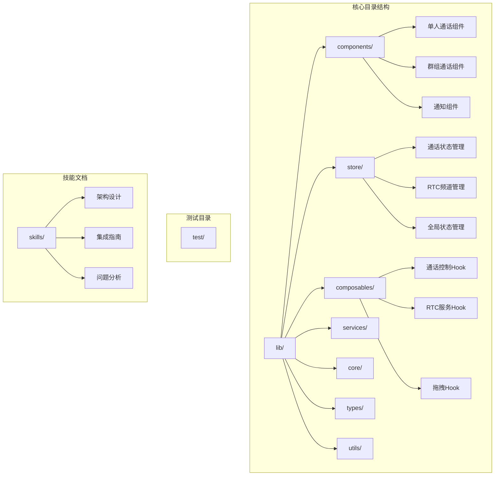
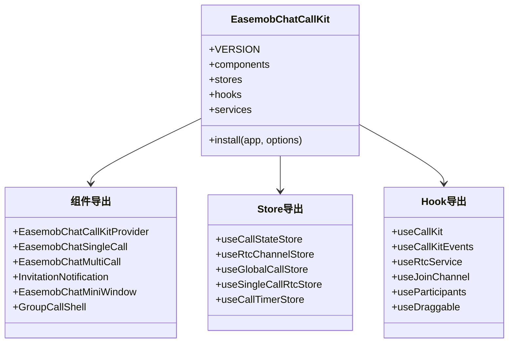
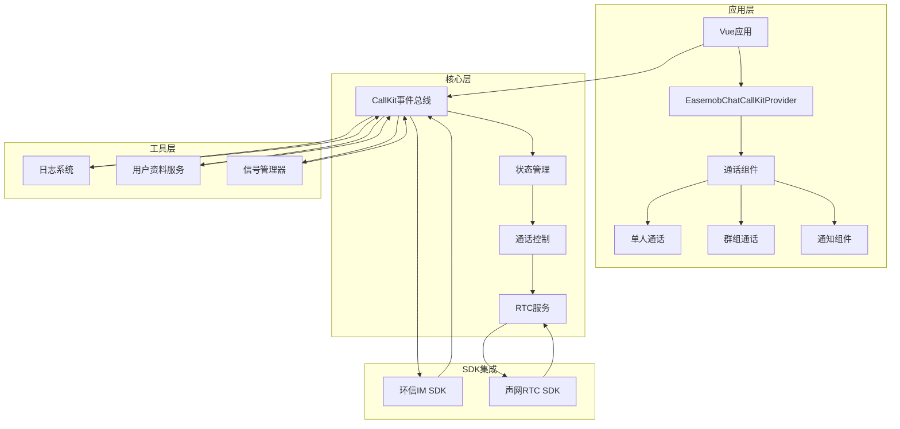
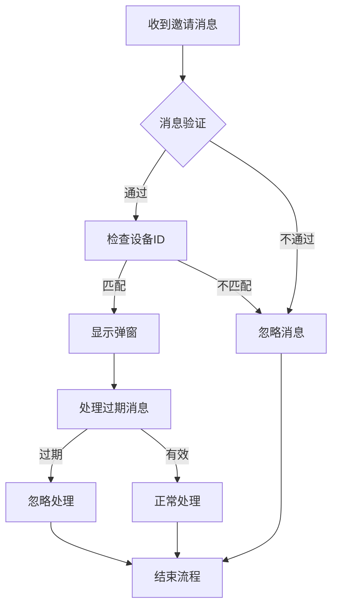
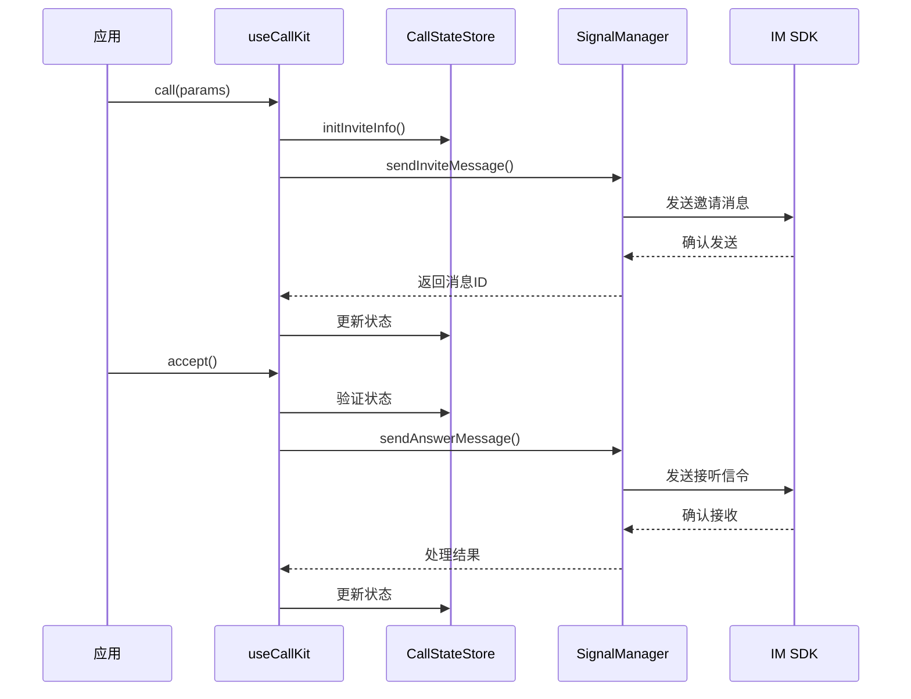
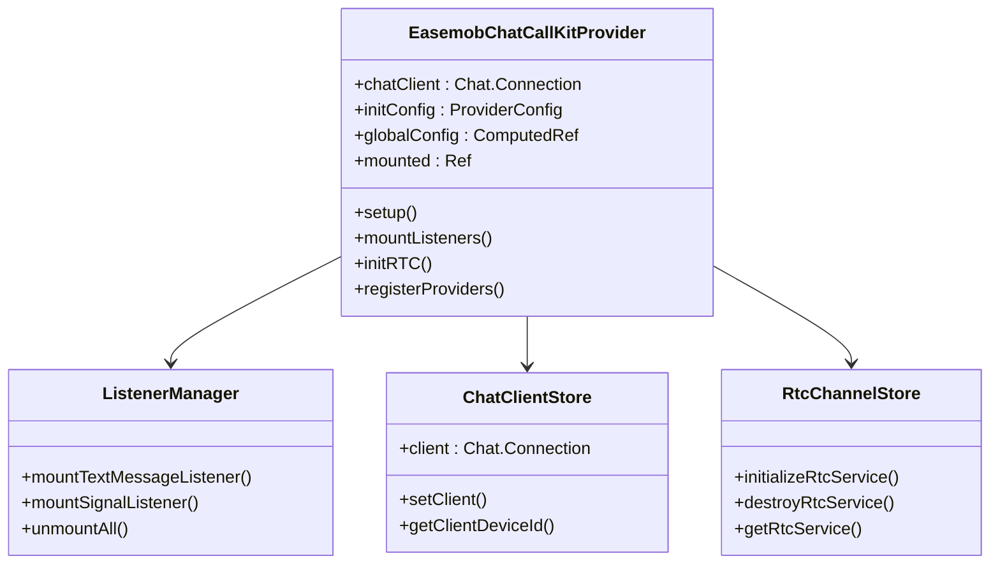
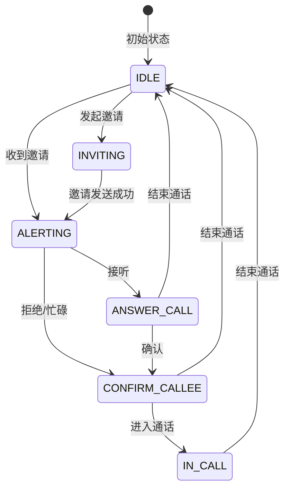
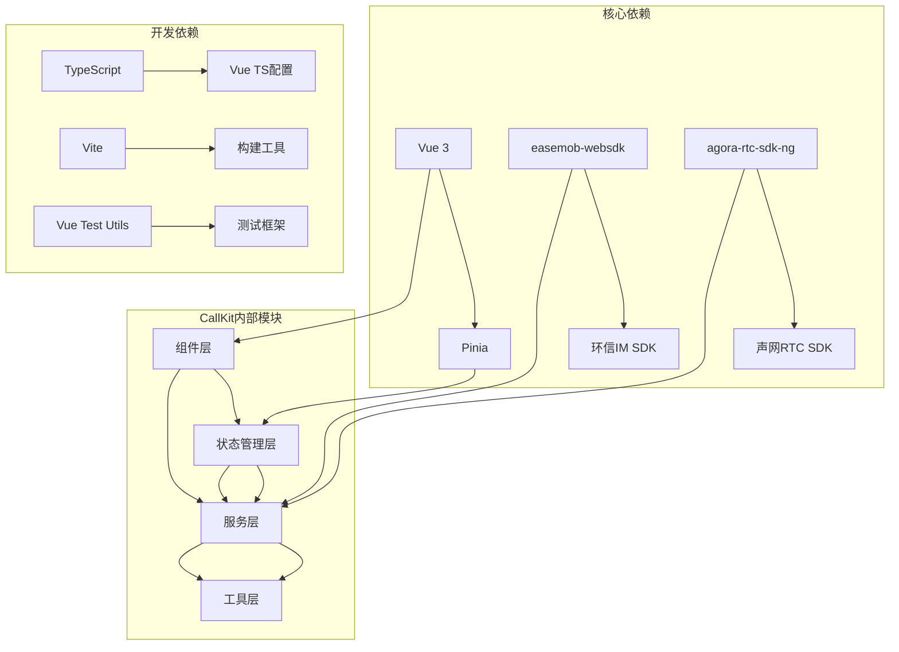

# CallKit 问题与根因分析

<cite>
**本文档引用的文件**
- [package.json](file://package.json)
- [index.ts](file://lib/index.ts)
- [callkit-problems.md](file://skills/callkit-problems.md)
- [QUICK_START.md](file://QUICK_START.md)
- [USAGE.md](file://USAGE.md)
- [types.ts](file://lib/core/events/types.ts)
- [callState.ts](file://lib/store/callState.ts)
- [useCallKit.ts](file://lib/composables/useCallKit.ts)
- [EasemobChatCallKitProvider.vue](file://lib/components/EasemobChatCallKitProvider.vue)
- [imSDK/index.ts](file://lib/core/sdk/imSDK/index.ts)
- [callstate.types.ts](file://lib/types/callstate.types.ts)
</cite>

## 目录
1. [简介](#简介)
2. [项目结构](#项目结构)
3. [核心组件](#核心组件)
4. [架构概览](#架构概览)
5. [详细组件分析](#详细组件分析)
6. [依赖分析](#依赖分析)
7. [性能考虑](#性能考虑)
8. [故障排除指南](#故障排除指南)
9. [结论](#结论)

## 简介

Easemob Chat CallKit Vue3 是一个基于 Vue3 的即时通讯通话组件库，集成了环信 IM SDK 和声网 RTC SDK，提供了完整的音视频通话解决方案。该项目专注于解决多端设备场景下的通话邀请问题，特别是针对 resourceId 固定导致的离线消息重投和过期邀请弹窗问题。

## 项目结构

**图表来源**
- [index.ts:1-108](file://lib/index.ts#L1-L108)
- [package.json:1-76](file://package.json#L1-L76)

**章节来源**
- [package.json:1-76](file://package.json#L1-L76)
- [index.ts:1-108](file://lib/index.ts#L1-L108)

## 核心组件

### 插件入口与导出

CallKit 通过一个统一的插件入口提供完整的功能：

**图表来源**
- [index.ts:24-41](file://lib/index.ts#L24-L41)
- [index.ts:89-108](file://lib/index.ts#L89-L108)

### 状态管理系统

项目采用 Pinia 进行状态管理，核心状态包括：

- **通话状态管理** (`useCallStateStore`): 管理通话生命周期状态
- **RTC频道管理** (`useRtcChannelStore`): 管理 RTC 连接和媒体流
- **全局状态管理** (`useGlobalCallStore`): 管理跨组件共享状态
- **单聊RTC状态** (`useSingleCallRtcStore`): 管理一对一通话的用户映射

**章节来源**
- [callState.ts:1-226](file://lib/store/callState.ts#L1-L226)
- [index.ts:11-16](file://lib/index.ts#L11-L16)

## 架构概览

**图表来源**
- [EasemobChatCallKitProvider.vue:10-178](file://lib/components/EasemobChatCallKitProvider.vue#L10-L178)
- [useCallKit.ts:15-266](file://lib/composables/useCallKit.ts#L15-L266)

## 详细组件分析

### 问题1：resourceId 固定导致的重复弹窗问题

#### 问题现象

在同一用户在不同设备登录场景下，由于 resourceId 固定为 `webim_web_xxxx`，IM 服务端会重新投递该用户在其他设备上已收到的离线消息，导致过期的通话邀请触发大量重复弹窗。

#### 根因分析

问题主要出现在邀请消息处理流程中，具体体现在以下几个方面：

**图表来源**
- [callkit-problems.md:31-41](file://skills/callkit-problems.md#L31-L41)

#### 修复方案

项目已经实施了多重防护机制：

1. **设备ID校验**：验证 `calleeDevId` 是否与当前设备匹配
2. **消息时效性检查**：区分 invite 消息和 cmd 信令的消息过期时间
3. **群聊成员校验**：验证被邀请成员列表

#### React 版本对比

React 版本存在相同的安全漏洞，主要体现在：
- 缺少 `calleeDevId` 校验
- 缺少时间戳过期判断
- 缺少 `message.to` 或 `invitedMembers` 校验

**章节来源**
- [callkit-problems.md:10-84](file://skills/callkit-problems.md#L10-L84)

### 通话控制组件分析

#### useCallKit Hook

**图表来源**
- [useCallKit.ts:23-52](file://lib/composables/useCallKit.ts#L23-L52)
- [useCallKit.ts:195-216](file://lib/composables/useCallKit.ts#L195-L216)

#### Provider 组件

Provider 组件负责整个 CallKit 的初始化和配置管理：

**图表来源**
- [EasemobChatCallKitProvider.vue:7-178](file://lib/components/EasemobChatCallKitProvider.vue#L7-L178)

**章节来源**
- [useCallKit.ts:15-266](file://lib/composables/useCallKit.ts#L15-L266)
- [EasemobChatCallKitProvider.vue:1-178](file://lib/components/EasemobChatCallKitProvider.vue#L1-L178)

### 状态管理分析

#### 通话状态流转

**图表来源**
- [callstate.types.ts:13-22](file://lib/types/callstate.types.ts#L13-L22)

#### 状态持久化与清理

项目实现了完善的状态清理机制，确保在多端场景下的状态一致性：

**章节来源**
- [callState.ts:14-32](file://lib/store/callState.ts#L14-L32)
- [callState.ts:152-170](file://lib/store/callState.ts#L152-L170)

## 依赖分析

### 外部依赖关系

**图表来源**
- [package.json:33-52](file://package.json#L33-L52)
- [index.ts:1-108](file://lib/index.ts#L1-L108)

### 内部模块耦合

项目采用了清晰的分层架构，各模块之间的依赖关系如下：

- **组件层**：低耦合，主要依赖状态管理和服务层
- **状态管理层**：中等耦合，依赖工具层和事件总线
- **服务层**：高耦合，依赖 SDK 和外部服务
- **工具层**：低耦合，提供通用工具函数

**章节来源**
- [package.json:38-52](file://package.json#L38-L52)
- [index.ts:1-108](file://lib/index.ts#L1-L108)

## 性能考虑

### 优化策略

1. **状态管理优化**：使用 Pinia 的响应式特性，避免不必要的组件重渲染
2. **资源清理**：及时清理定时器、事件监听器和 RTC 连接
3. **懒加载**：按需加载组件和资源，减少初始包体积
4. **缓存策略**：合理使用用户资料缓存，减少重复请求

### 性能监控

项目内置了完整的日志系统，支持不同级别的日志输出：
- ERROR: 错误级别
- WARN: 警告级别  
- INFO: 信息级别
- DEBUG: 调试级别
- VERBOSE: 详细调试级别

## 故障排除指南

### 常见问题诊断

#### 1. 通话邀请重复弹窗

**症状**：同一邀请消息多次触发弹窗
**排查步骤**：
1. 检查 `calleeDevId` 校验逻辑
2. 验证消息时间戳过期判断
3. 确认群聊成员列表匹配

#### 2. 通话状态异常

**症状**：通话状态不正确或状态机异常
**排查步骤**：
1. 检查状态流转逻辑
2. 验证超时处理机制
3. 确认状态重置逻辑

#### 3. RTC 连接问题

**症状**：音视频通话无法建立连接
**排查步骤**：
1. 检查 App ID 配置
2. 验证 Token 生成逻辑
3. 确认网络环境

**章节来源**
- [callkit-problems.md:16-29](file://skills/callkit-problems.md#L16-L29)
- [callState.ts:87-107](file://lib/store/callState.ts#L87-L107)

### 调试技巧

1. **启用详细日志**：设置 `logLevel` 为 VERBOSE 级别
2. **事件监听**：使用 `useCallKitEvents` 监听关键事件
3. **状态检查**：定期检查 Pinia store 的状态变化
4. **网络监控**：监控 IM 和 RTC 的网络连接状态

## 结论

Easemob Chat CallKit Vue3 项目通过以下关键改进解决了多端设备场景下的通话邀请问题：

1. **完善的消息验证机制**：实现了设备ID校验、消息时效性检查和群聊成员匹配
2. **健壮的状态管理**：通过 Pinia 提供了可靠的状态持久化和清理机制
3. **清晰的架构设计**：分层架构确保了模块间的低耦合和高内聚
4. **全面的错误处理**：提供了完善的异常处理和故障恢复机制

这些改进不仅解决了当前的问题，还为未来的功能扩展奠定了坚实的基础。项目的设计充分考虑了生产环境的稳定性要求，是一个值得学习的优秀开源项目。