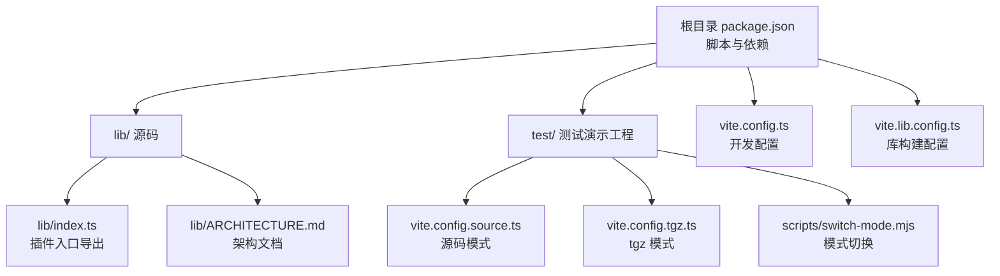
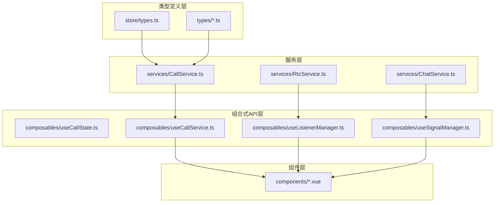
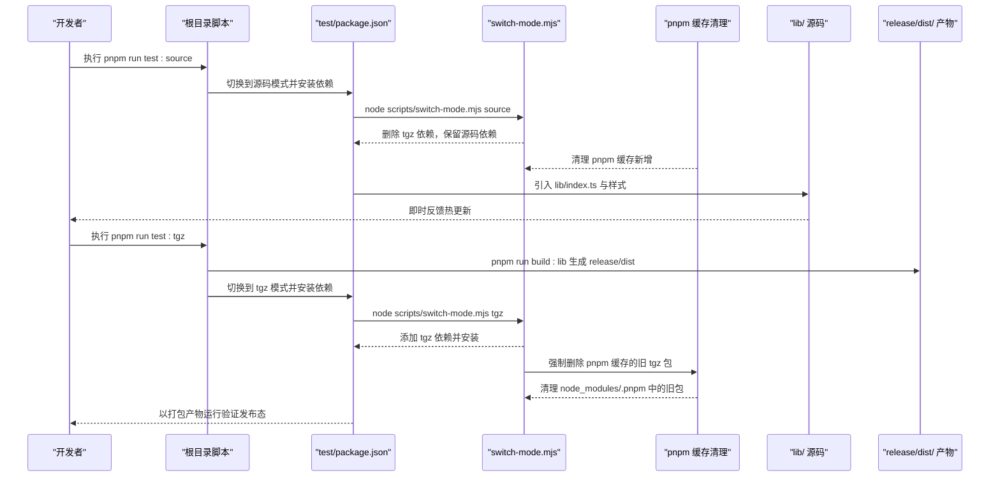
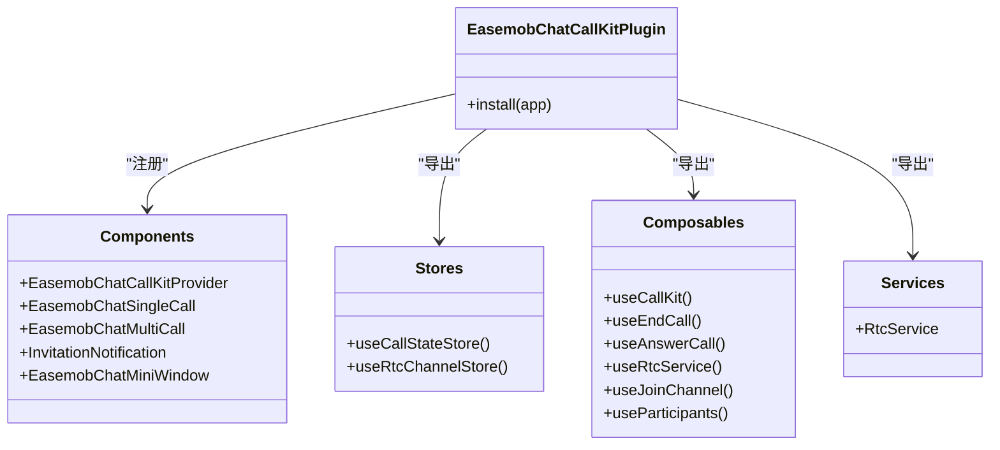
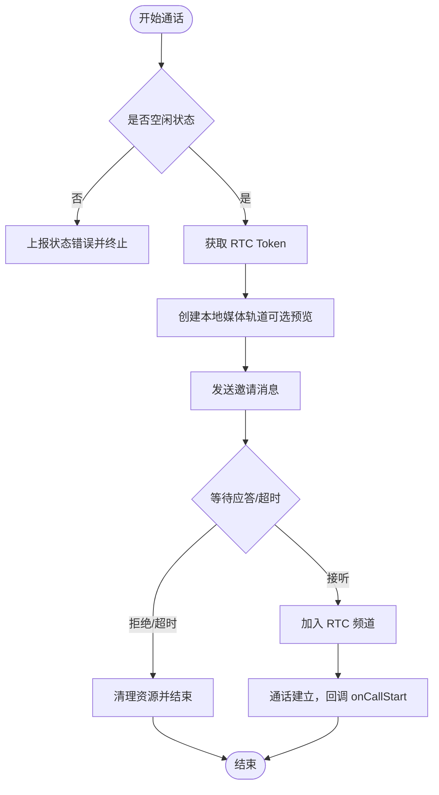
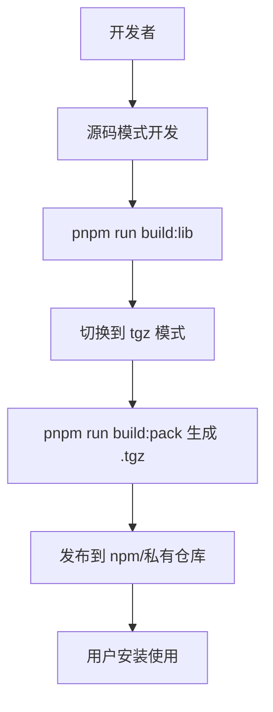
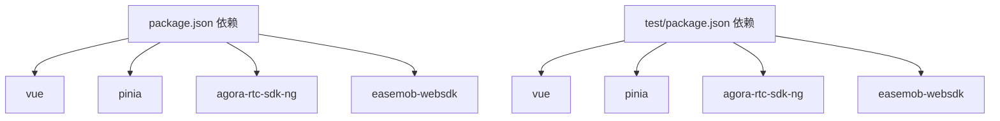

# 开发指南

<cite>
**本文引用的文件**
- [package.json](file://package.json)
- [README.md](file://README.md)
- [vite.config.ts](file://vite.config.ts)
- [vite.lib.config.ts](file://vite.lib.config.ts)
- [test/package.json](file://test/package.json)
- [test/vite.config.source.ts](file://test/vite.config.source.ts)
- [test/vite.config.tgz.ts](file://test/vite.config.tgz.ts)
- [test/scripts/switch-mode.mjs](file://test/scripts/switch-mode.mjs)
- [lib/index.ts](file://lib/index.ts)
- [lib/ARCHITECTURE.md](file://lib/ARCHITECTURE.md)
- [callkit/CallKit.tsx](file://callkit/CallKit.tsx)
- [callkit/services/CallService.ts](file://callkit/services/CallService.ts)
- [tsconfig.json](file://tsconfig.json)
- [tsconfig.app.json](file://tsconfig.app.json)
</cite>

## 更新摘要
**变更内容**
- 改进了测试模式切换机制，增加了 pnpm 缓存清理逻辑
- 增强了开发环境稳定性，确保源码模式和 tgz 模式的切换更加可靠
- 优化了依赖管理流程，避免缓存问题导致的构建失败

## 目录
1. [简介](#简介)
2. [项目结构](#项目结构)
3. [核心组件](#核心组件)
4. [架构总览](#架构总览)
5. [详细组件分析](#详细组件分析)
6. [依赖关系分析](#依赖关系分析)
7. [性能考虑](#性能考虑)
8. [故障排查指南](#故障排查指南)
9. [结论](#结论)
10. [附录](#附录)

## 简介
本开发指南面向贡献者与扩展开发者，帮助快速理解并参与本项目的开发。内容涵盖开发环境搭建、依赖安装、构建流程与测试方法；解释"源码模式"与"tgz 模式"的开发与验证差异；提供调试技巧、发布流程、代码与提交规范建议、版本管理策略，以及新功能开发的最佳实践。同时给出性能测试、兼容性测试与安全审计的实施建议。

## 项目结构
本项目采用"库代码 + 测试演示 + 构建配置 + 文档"的组织方式：
- lib/：库源码（组件、组合式 API、服务、类型、工具、样式入口）
- callkit/：React 版本的 CallKit 实现（与 Vue 版本并列）
- test/：测试演示工程，包含源码模式与 tgz 模式的 Vite 配置与模式切换脚本
- release/：构建产物输出目录
- vite.config.ts 与 vite.lib.config.ts：开发与库构建配置
- 多个文档：架构说明、快速开始、集成与使用示例等

**图表来源**
- [package.json:1-53](file://package.json#L1-L53)
- [vite.config.ts:1-21](file://vite.config.ts#L1-L21)
- [vite.lib.config.ts:1-68](file://vite.lib.config.ts#L1-L68)
- [test/vite.config.source.ts:1-25](file://test/vite.config.source.ts#L1-L25)
- [test/vite.config.tgz.ts:1-20](file://test/vite.config.tgz.ts#L1-L20)
- [test/scripts/switch-mode.mjs:1-77](file://test/scripts/switch-mode.mjs#L1-L77)
- [lib/index.ts:1-90](file://lib/index.ts#L1-L90)
- [lib/ARCHITECTURE.md:1-190](file://lib/ARCHITECTURE.md#L1-L190)

**章节来源**
- [README.md:5-31](file://README.md#L5-L31)
- [package.json:1-53](file://package.json#L1-L53)

## 核心组件
- 插件入口与导出：lib/index.ts 负责注册组件、导出 store、组合式 API、服务与类型，形成统一的插件对外接口。
- 架构文档：lib/ARCHITECTURE.md 提供分层架构、状态管理、服务与组合式 API 的职责分离说明。
- 主组件与服务：callkit/CallKit.tsx 为 React 版本主组件，callkit/services/CallService.ts 提供通话生命周期、媒体轨道、信令与错误处理等核心逻辑。

**章节来源**
- [lib/index.ts:1-90](file://lib/index.ts#L1-L90)
- [lib/ARCHITECTURE.md:1-190](file://lib/ARCHITECTURE.md#L1-L190)
- [callkit/CallKit.tsx:1-800](file://callkit/CallKit.tsx#L1-L800)
- [callkit/services/CallService.ts:1-800](file://callkit/services/CallService.ts#L1-L800)

## 架构总览
项目采用"类型定义层 → 服务层 → 组合式 API 层 → 组件层"的分层架构，结合响应式状态管理与组合式 API，实现业务逻辑与 UI 的解耦。开发与验证通过"源码模式"和"tgz 模式"双通道进行，保证开发效率与发布质量。

**图表来源**
- [lib/ARCHITECTURE.md:1-190](file://lib/ARCHITECTURE.md#L1-L190)

## 详细组件分析

### 源码模式与 tgz 模式的开发与验证
- 源码模式（推荐开发时使用）：直接引用 lib/ 源码，修改即时生效，适合联调与迭代。
- tgz 模式（推荐发布前验证）：使用打包后的 .tgz 包作为依赖，模拟真实用户安装与使用场景，验证构建产物与依赖解析。

**更新** 改进了测试模式切换机制，增加了 pnpm 缓存清理逻辑，确保开发环境的稳定性

**图表来源**
- [README.md:45-101](file://README.md#L45-L101)
- [test/package.json:1-30](file://test/package.json#L1-L30)
- [test/scripts/switch-mode.mjs:1-77](file://test/scripts/switch-mode.mjs#L1-L77)
- [vite.config.ts:1-21](file://vite.config.ts#L1-L21)
- [vite.lib.config.ts:1-68](file://vite.lib.config.ts#L1-L68)

**章节来源**
- [README.md:45-101](file://README.md#L45-L101)
- [test/package.json:1-30](file://test/package.json#L1-L30)
- [test/scripts/switch-mode.mjs:1-77](file://test/scripts/switch-mode.mjs#L1-L77)
- [test/vite.config.source.ts:1-25](file://test/vite.config.source.ts#L1-L25)
- [test/vite.config.tgz.ts:1-20](file://test/vite.config.tgz.ts#L1-L20)
- [vite.config.ts:1-21](file://vite.config.ts#L1-L21)
- [vite.lib.config.ts:1-68](file://vite.lib.config.ts#L1-L68)

### 插件入口与导出（lib/index.ts）
- 注册组件：提供 Provider、单人/多人通话组件、邀请通知与迷你窗口等。
- 导出 store：useCallStateStore、useRtcChannelStore。
- 导出组合式 API：useCallKit、useEndCall、useAnswerCall、useRtcService、useJoinChannel、useParticipants。
- 导出服务与类型：RtcService、CallKit 选项与实例类型、常量与枚举。

**图表来源**
- [lib/index.ts:1-90](file://lib/index.ts#L1-L90)

**章节来源**
- [lib/index.ts:1-90](file://lib/index.ts#L1-L90)

### 通话服务（callkit/services/CallService.ts）
- 职责：封装发起/接听/结束通话、媒体轨道管理、信令交互、错误处理、铃声控制、网络质量回调等。
- 关键流程：startCall → 发送邀请消息 → 等待应答 → 建立 RTC 通道 → 连接成功回调 → 结束通话清理。
- 错误处理：统一通过 onCallError 回调上报，便于上层捕获与展示。

**图表来源**
- [callkit/services/CallService.ts:345-527](file://callkit/services/CallService.ts#L345-L527)

**章节来源**
- [callkit/services/CallService.ts:1-800](file://callkit/services/CallService.ts#L1-L800)

### 主组件（callkit/CallKit.tsx）
- 职责：整合 UI 布局、控制按钮、预览/通话状态、邀请弹窗、拖拽/缩放/最小化等交互能力。
- 生命周期：根据 props 初始化 CallService，监听状态变化并驱动 UI 更新；在销毁时清理资源与定时器。
- 性能优化：对布局组件使用 memo 化，减少不必要的重渲染。

**章节来源**
- [callkit/CallKit.tsx:1-800](file://callkit/CallKit.tsx#L1-L800)

### 构建与发布流程
- 开发调试：使用源码模式，修改即时生效。
- 构建验证：执行构建生成 release/dist，再切换到 tgz 模式验证打包产物。
- 打包发布：生成 .tgz 包，上传至 npm 或私有仓库。

**图表来源**
- [README.md:167-181](file://README.md#L167-L181)
- [package.json:23-32](file://package.json#L23-L32)
- [vite.lib.config.ts:1-68](file://vite.lib.config.ts#L1-L68)

**章节来源**
- [README.md:167-181](file://README.md#L167-L181)
- [package.json:23-32](file://package.json#L23-L32)
- [vite.lib.config.ts:1-68](file://vite.lib.config.ts#L1-L68)

## 依赖关系分析
- 根依赖：Vue、Pinia、agora-rtc-sdk-ng、easemob-websdk。
- 开发依赖：Vite、Vue 插件、TypeScript、vite-plugin-dts、vue-tsc。
- 测试演示工程：独立的 Vite 配置与依赖，通过模式切换脚本动态替换依赖来源。

**图表来源**
- [package.json:36-51](file://package.json#L36-L51)
- [test/package.json:15-27](file://test/package.json#L15-L27)

**章节来源**
- [package.json:36-51](file://package.json#L36-L51)
- [test/package.json:15-27](file://test/package.json#L15-L27)

## 性能考虑
- 源码模式：利用 Vite 的热更新与按需编译，提升开发效率。
- 构建优化：库构建配置中启用 CSS 分割控制与资产命名规则，确保产物稳定。
- 组件优化：对高开销布局组件使用 memo 化，避免重复渲染。
- 媒体资源：合理管理本地/远端轨道与流对象，及时清理避免内存泄漏。
- 网络质量：通过网络质量回调动态提示，降低卡顿影响。

**章节来源**
- [vite.lib.config.ts:37-61](file://vite.lib.config.ts#L37-L61)
- [callkit/CallKit.tsx:41-45](file://callkit/CallKit.tsx#L41-L45)

## 故障排查指南
- 模式切换失败：确认已先执行构建生成 .tgz 文件，再切换到 tgz 模式。
- 依赖未安装：切换模式后会自动执行安装，若失败请检查网络与权限。
- 构建产物缺失：构建前会清空 release/dist 并重建，确保无残留。
- 通话异常：检查 onCallError 回调与日志级别设置，定位信令或媒体问题。
- **新增** pnpm 缓存问题：如果遇到 tgz 模式无法识别最新包的问题，检查 .pnpm 缓存是否被清理，模式切换脚本会自动清理旧缓存。

**更新** 增加了 pnpm 缓存清理逻辑，确保开发环境的稳定性

**章节来源**
- [test/scripts/switch-mode.mjs:38-77](file://test/scripts/switch-mode.mjs#L38-L77)
- [vite.lib.config.ts:7-21](file://vite.lib.config.ts#L7-L21)
- [callkit/services/CallService.ts:190-208](file://callkit/services/CallService.ts#L190-L208)

## 结论
本项目提供了清晰的分层架构与双通道验证机制，既能满足高效开发，又能确保发布质量。遵循本文档的开发与测试流程，可显著提升贡献效率与代码质量。最新的改进增强了测试模式切换的可靠性，通过自动清理 pnpm 缓存确保开发环境的稳定性。

## 附录

### 开发环境搭建与依赖安装
- 安装依赖：在根目录执行安装命令，无需手动进入 test 目录。
- 启动测试环境：推荐使用源码模式进行日常开发；发布前使用 tgz 模式验证构建产物。

**章节来源**
- [README.md:35-43](file://README.md#L35-L43)
- [README.md:45-79](file://README.md#L45-L79)

### 构建与测试方法
- 构建库文件：生成 release/dist。
- 构建并打包为 tgz：生成 .tgz 包，用于发布或用户侧验证。
- 测试演示：在 test 目录内切换模式并启动开发服务器。

**章节来源**
- [README.md:103-135](file://README.md#L103-L135)
- [package.json:23-32](file://package.json#L23-L32)
- [test/package.json:6-14](file://test/package.json#L6-L14)

### 调试技巧
- 设置日志级别与前缀，定位通话状态变化与媒体事件。
- 使用组合式 API 监听状态变化，配合断点观察数据流转。
- 在 tgz 模式下复现用户侧问题，确保与实际使用一致。
- **新增** 如果遇到 tgz 包版本不更新的问题，检查 .pnpm 缓存是否被正确清理。

**更新** 增加了 pnpm 缓存清理相关的调试建议

**章节来源**
- [callkit/CallKit.tsx:199-216](file://callkit/CallKit.tsx#L199-L216)
- [lib/ARCHITECTURE.md:40-66](file://lib/ARCHITECTURE.md#L40-L66)

### 发布流程
- 开发调试 → 构建验证 → 打包发布 → 上传 .tgz 包。

**章节来源**
- [README.md:167-172](file://README.md#L167-L172)

### 代码规范与提交规范（建议）
- 代码风格：遵循 TypeScript 与 Vue 生态通用规范，保持类型安全与可读性。
- 提交信息：采用清晰的类型前缀（feat/fix/docs/chore），简述变更与动机。
- 分支管理：建议采用基于版本的分支策略，合并前通过构建与测试验证。

### 版本管理策略（建议）
- 语义化版本：依据功能新增、破坏性变更与修复进行主/次/补丁号递增。
- 发布标签：在发布前打标签并附带变更摘要，便于回溯与审计。

### 新功能开发最佳实践
- 先在类型层补充接口定义，再实现服务与组合式 API，最后接入组件层。
- 保持职责分离，避免在组件中直接操作底层状态。
- 为新功能编写最小可用示例与测试用例，确保可维护性。

**章节来源**
- [lib/ARCHITECTURE.md:165-184](file://lib/ARCHITECTURE.md#L165-L184)

### 性能测试、兼容性测试与安全审计（建议）
- 性能测试：录制不同设备与网络条件下的通话时长、首帧时间与 CPU/内存占用。
- 兼容性测试：覆盖主流浏览器与移动端 WebView，验证媒体轨道与 UI 行为。
- 安全审计：检查密钥与 Token 的使用路径，确保仅在受控环境中暴露必要信息。