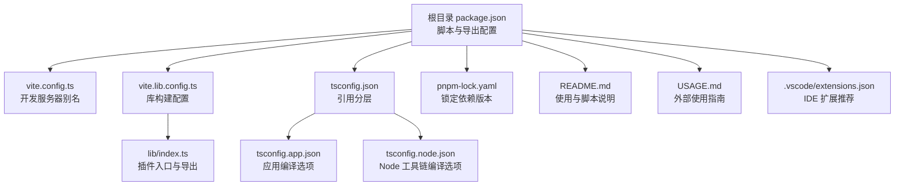
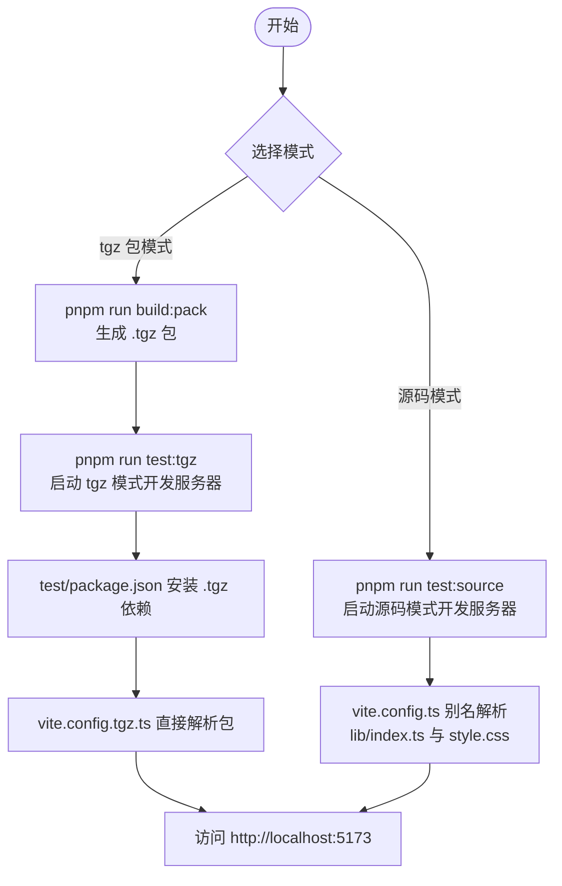
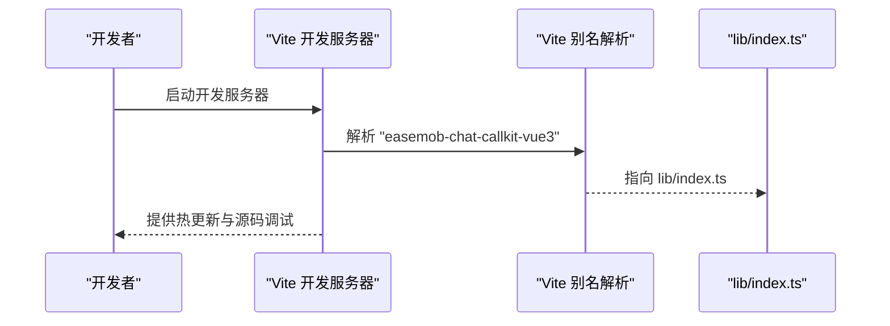
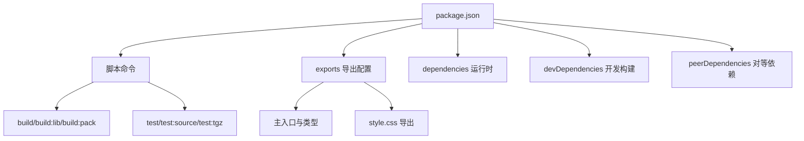
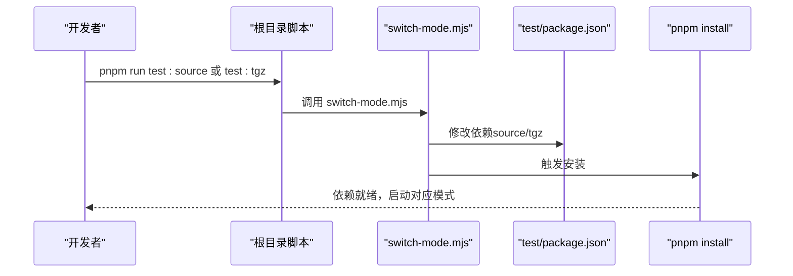
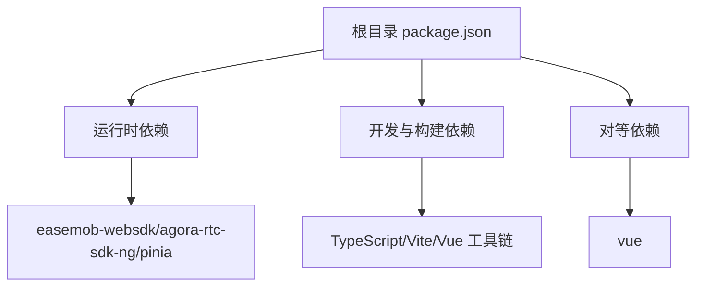

# 开发环境搭建

<cite>
**本文档引用的文件**
- [package.json](file://package.json)
- [vite.config.ts](file://vite.config.ts)
- [vite.lib.config.ts](file://vite.lib.config.ts)
- [tsconfig.json](file://tsconfig.json)
- [tsconfig.app.json](file://tsconfig.app.json)
- [tsconfig.node.json](file://tsconfig.node.json)
- [pnpm-lock.yaml](file://pnpm-lock.yaml)
- [README.md](file://README.md)
- [USAGE.md](file://USAGE.md)
- [lib/index.ts](file://lib/index.ts)
- [test/package.json](file://test/package.json)
- [test/vite.config.source.ts](file://test/vite.config.source.ts)
- [test/vite.config.tgz.ts](file://test/vite.config.tgz.ts)
- [test/scripts/switch-mode.mjs](file://test/scripts/switch-mode.mjs)
- [.vscode/extensions.json](file://.vscode/extensions.json)
</cite>

## 目录
1. [简介](#简介)
2. [项目结构](#项目结构)
3. [核心组件](#核心组件)
4. [架构总览](#架构总览)
5. [详细组件分析](#详细组件分析)
6. [依赖分析](#依赖分析)
7. [性能考虑](#性能考虑)
8. [故障排除指南](#故障排除指南)
9. [结论](#结论)
10. [附录](#附录)

## 简介
本指南面向需要搭建和维护该 Vue3 音视频通话 UI 组件库开发环境的工程师，涵盖 Node.js 版本要求、包管理器选择（推荐 pnpm）、依赖安装、脚本命令、导出配置与版本管理策略，以及跨平台环境配置建议与常见问题排查。同时提供 IDE 配置与调试工具设置建议，帮助快速上手开发与测试。

## 项目结构
该项目采用“库 + 测试样例 + 构建产物”的组织方式：
- lib/：库源码（组件、组合式 API、服务、Store、类型等）
- test/：测试样例与模式切换脚本，支持“源码模式”和“tgz 包模式”
- release/dist/：构建产物输出目录
- vite.config.ts 与 vite.lib.config.ts：开发与库构建配置
- tsconfig.*：TypeScript 编译配置分层

图表来源
- [package.json](file://package.json#L1-L53)
- [vite.config.ts](file://vite.config.ts#L1-L21)
- [vite.lib.config.ts](file://vite.lib.config.ts#L1-L68)
- [tsconfig.json](file://tsconfig.json#L1-L8)
- [tsconfig.app.json](file://tsconfig.app.json#L1-L22)
- [tsconfig.node.json](file://tsconfig.node.json#L1-L27)
- [pnpm-lock.yaml](file://pnpm-lock.yaml#L1-L200)
- [README.md](file://README.md#L1-L181)
- [USAGE.md](file://USAGE.md#L1-L162)
- [lib/index.ts](file://lib/index.ts#L1-L58)
- [.vscode/extensions.json](file://.vscode/extensions.json#L1-L4)

章节来源
- [README.md](file://README.md#L1-L181)
- [package.json](file://package.json#L1-L53)

## 核心组件
- Node.js 与包管理器
  - Node.js：项目未显式声明最低版本，但 TypeScript、Vite、Vue 等工具链通常要求较新版本。建议使用长期支持（LTS）或稳定版本的 Node.js（例如 18.x 或 20.x）。
  - 包管理器：项目明确指定并推荐使用 pnpm（通过 packageManager 字段与脚本命名体现）。使用 pnpm 可获得更快的安装速度、更严格的依赖隔离与一致的锁文件行为。
- TypeScript 配置
  - tsconfig.json 通过 references 引入 tsconfig.app.json 与 tsconfig.node.json，分别用于应用侧与工具链侧编译。
  - tsconfig.app.json 使用 bundler 模式，启用路径别名 @/* 指向 lib/*，便于库开发时的模块解析。
- Vite 配置
  - vite.config.ts 提供开发服务器别名，使 import “easemob-chat-callkit-vue3” 直接指向 lib/index.ts，便于源码模式开发。
  - vite.lib.config.ts 负责库构建，输出 ES 与 UMD 两种格式，外置 vue 与 pinia，并将样式文件命名为统一的 easemob-chat-callkit-vue3.css。
- 依赖与导出
  - package.json 的 exports 字段定义了主入口、类型与额外导出（如 style.css），并限制可被外部访问的路径范围。
  - peerDependencies 声明 vue 为对等依赖，避免重复打包导致体积膨胀与运行时冲突。

章节来源
- [package.json](file://package.json#L1-L53)
- [tsconfig.json](file://tsconfig.json#L1-L8)
- [tsconfig.app.json](file://tsconfig.app.json#L1-L22)
- [tsconfig.node.json](file://tsconfig.node.json#L1-L27)
- [vite.config.ts](file://vite.config.ts#L1-L21)
- [vite.lib.config.ts](file://vite.lib.config.ts#L1-L68)
- [lib/index.ts](file://lib/index.ts#L1-L58)

## 架构总览
下图展示了开发与测试模式的切换流程，以及构建产物的生成与发布路径。

图表来源
- [README.md](file://README.md#L33-L101)
- [test/package.json](file://test/package.json#L1-L29)
- [test/vite.config.source.ts](file://test/vite.config.source.ts#L1-L25)
- [test/vite.config.tgz.ts](file://test/vite.config.tgz.ts#L1-L20)
- [test/scripts/switch-mode.mjs](file://test/scripts/switch-mode.mjs#L1-L57)
- [vite.config.ts](file://vite.config.ts#L1-L21)

## 详细组件分析

### Node.js 与包管理器
- Node.js 版本建议
  - 由于项目使用 TypeScript 5.x、Vite 7.x、Vue 3.5.x 等现代工具链，建议使用 Node.js LTS（如 18.x 或 20.x）以获得最佳兼容性与稳定性。
- pnpm 优势
  - 快速安装、硬链接去重、严格依赖隔离、与 monorepo 友好。
  - 项目通过 packageManager 字段固定 pnpm 版本，确保团队一致性。
- 依赖安装
  - 根目录执行 pnpm install 即可一次性安装所有依赖（含 test 目录的依赖切换由脚本自动处理）。
  - test 目录的依赖切换通过 switch-mode.mjs 修改 test/package.json 并触发 pnpm install。

章节来源
- [package.json](file://package.json#L46-L46)
- [pnpm-lock.yaml](file://pnpm-lock.yaml#L1-L200)
- [README.md](file://README.md#L33-L101)
- [test/scripts/switch-mode.mjs](file://test/scripts/switch-mode.mjs#L1-L57)

### TypeScript 配置
- 分层配置
  - tsconfig.json 通过 references 引入应用与 Node 工具链两套配置，实现职责分离。
  - tsconfig.app.json 使用 bundler 模式与路径别名 @/*，适配库开发与 Vite 别名解析。
  - tsconfig.node.json 面向工具链（如 Vite 配置文件）进行严格类型检查。
- 编译选项要点
  - moduleResolution: bundler，确保与 Vite Rollup 生态兼容。
  - paths: @/* -> lib/*，与 Vite 别名保持一致。
  - skipLibCheck: true，减少类型检查开销。

章节来源
- [tsconfig.json](file://tsconfig.json#L1-L8)
- [tsconfig.app.json](file://tsconfig.app.json#L1-L22)
- [tsconfig.node.json](file://tsconfig.node.json#L1-L27)

### Vite 开发与库构建
- 开发服务器（源码模式）
  - vite.config.ts 通过别名将 “easemob-chat-callkit-vue3” 解析到 lib/index.ts，“easemob-chat-callkit-vue3/style.css” 解析到 lib/style.css，便于直接引用源码进行开发。
- 库构建（vite.lib.config.ts）
  - 清理 release/dist 目录（自定义插件），确保产物干净。
  - 输出 ES 与 UMD 两种格式，外置 vue 与 pinia，避免重复打包。
  - 样式文件统一命名为 easemob-chat-callkit-vue3.css，便于按需引入。
  - 使用 vite-plugin-dts 自动生成类型声明文件并复制到 release/dist。

图表来源
- [vite.config.ts](file://vite.config.ts#L1-L21)
- [lib/index.ts](file://lib/index.ts#L1-L58)

章节来源
- [vite.config.ts](file://vite.config.ts#L1-L21)
- [vite.lib.config.ts](file://vite.lib.config.ts#L1-L68)

### package.json 配置与脚本
- 主入口与导出
  - main/module/types 指向 release/dist 下的构建产物。
  - exports 字段定义主入口、类型与额外导出（如 style.css），并限制可访问路径。
- 脚本命令
  - dev：启动根目录开发服务器（一般不常用）。
  - build：先类型检查再构建。
  - build:lib：构建库文件至 release/dist。
  - build:pack：先构建库再打包为 .tgz，输出到 release/。
  - test/test:source：启动源码模式测试环境。
  - test:tgz：先构建 .tgz 再启动 tgz 模式测试环境。
- 依赖分类
  - dependencies：运行时依赖（agora-rtc-sdk-ng、easemob-websdk、pinia）。
  - devDependencies：开发与构建依赖（TypeScript、Vite、Vue 相关工具）。
  - peerDependencies：vue 对等依赖，避免重复打包。

图表来源
- [package.json](file://package.json#L1-L53)

章节来源
- [package.json](file://package.json#L1-L53)
- [README.md](file://README.md#L113-L135)

### 测试模式切换与验证
- 源码模式（推荐开发）
  - 直接引用 lib/ 源码，修改即时生效；适合日常开发与调试。
- tgz 包模式（推荐发布前验证）
  - 使用打包后的 .tgz 文件作为依赖，模拟真实用户使用场景，验证构建产物正确性。
- 自动切换机制
  - test/scripts/switch-mode.mjs 动态修改 test/package.json 的依赖字段，并触发 pnpm install。
  - README.md 提供一键启动命令（test 与 test:source/test:tgz），并说明自动切换与构建机制。

图表来源
- [README.md](file://README.md#L47-L101)
- [test/package.json](file://test/package.json#L1-L29)
- [test/scripts/switch-mode.mjs](file://test/scripts/switch-mode.mjs#L1-L57)

章节来源
- [README.md](file://README.md#L47-L101)
- [test/package.json](file://test/package.json#L1-L29)
- [test/scripts/switch-mode.mjs](file://test/scripts/switch-mode.mjs#L1-L57)

### IDE 配置与调试工具
- VS Code 扩展推荐
  - Vue.volar：提供 Vue 3 单文件组件（SFC）的语法高亮、智能感知与类型支持。
- 调试建议
  - 使用 Vite 开发服务器的浏览器调试能力即可满足大多数场景。
  - 若需 Node 工具链调试，可在 tsconfig.node.json 中启用必要的类型与模块解析选项。

章节来源
- [.vscode/extensions.json](file://.vscode/extensions.json#L1-L4)
- [tsconfig.node.json](file://tsconfig.node.json#L1-L27)

## 依赖分析
- 运行时依赖
  - easemob-websdk：环信 Web SDK，负责 IM 信令。
  - agora-rtc-sdk-ng：声网 RTC SDK，负责音视频通话。
  - pinia：状态管理库，作为对等依赖由使用者项目提供。
- 开发与构建依赖
  - TypeScript、vue-tsc：类型检查与编译。
  - Vite、@vitejs/plugin-vue：开发服务器与 Vue 支持。
  - vite-plugin-dts：生成类型声明文件。
- 对等依赖
  - vue：对等依赖，避免重复打包与版本冲突。

图表来源
- [package.json](file://package.json#L36-L51)
- [pnpm-lock.yaml](file://pnpm-lock.yaml#L10-L44)

章节来源
- [package.json](file://package.json#L36-L51)
- [pnpm-lock.yaml](file://pnpm-lock.yaml#L10-L44)

## 性能考虑
- 使用 pnpm：提升安装与缓存效率，减少磁盘占用。
- Vite 构建：按需打包与 Tree-shaking，结合外置对等依赖（vue/pinia）降低产物体积。
- 类型生成：通过 vite-plugin-dts 仅生成必要类型文件，避免重复扫描。
- 资源命名：统一样式文件名，便于 CDN 与缓存策略优化。

## 故障排除指南
- pnpm 安装失败或依赖不一致
  - 确认使用 pnpm 并检查 packageManager 字段与 pnpm-lock.yaml。
  - 清理缓存后重装：删除 node_modules、pnpm-lock.yaml 并重新安装。
- 源码模式无法热更新
  - 确认 vite.config.ts 的别名指向 lib/index.ts 与 lib/style.css。
  - 检查 tsconfig.app.json 的路径别名 @/* 是否与 Vite 别名一致。
- tgz 模式找不到 .tgz 文件
  - 先在根目录执行 pnpm run build:pack 生成 .tgz，再在 test 目录执行 pnpm run switch:tgz。
- 测试模式切换后依赖未更新
  - switch-mode.mjs 会自动触发 pnpm install，若失败请检查网络与权限。
- Node.js 版本不兼容
  - 升级到 LTS（如 18.x/20.x），确保 TypeScript、Vite、Vue 工具链正常工作。

章节来源
- [README.md](file://README.md#L174-L181)
- [test/scripts/switch-mode.mjs](file://test/scripts/switch-mode.mjs#L40-L56)
- [vite.config.ts](file://vite.config.ts#L8-L19)
- [tsconfig.app.json](file://tsconfig.app.json#L7-L9)

## 结论
本指南提供了从 Node.js 与 pnpm 选型、依赖安装、脚本命令、导出配置到跨平台环境与 IDE 设置的完整开发环境搭建路径。通过源码模式与 tgz 模式的双轨验证，可兼顾开发效率与发布质量。建议团队统一使用 pnpm 并遵循本指南的版本与配置建议，以获得稳定一致的开发体验。

## 附录
- 常用命令速查
  - 安装依赖：在根目录执行 pnpm install。
  - 启动源码模式：pnpm run test 或 pnpm run test:source。
  - 启动 tgz 模式：pnpm run test:tgz（需先执行 pnpm run build:pack）。
  - 构建库：pnpm run build:lib。
  - 打包 .tgz：pnpm run build:pack。
- 外部使用参考
  - 项目使用指南与 API 参考可参考 USAGE.md。

章节来源
- [README.md](file://README.md#L113-L135)
- [USAGE.md](file://USAGE.md#L1-L162)