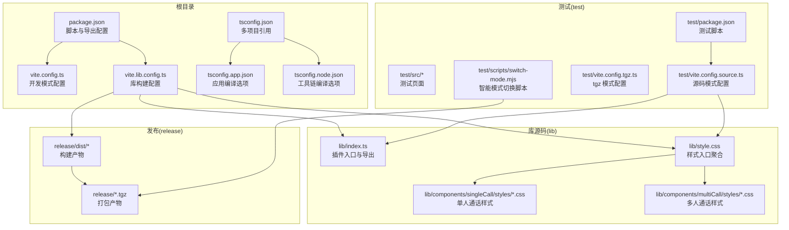
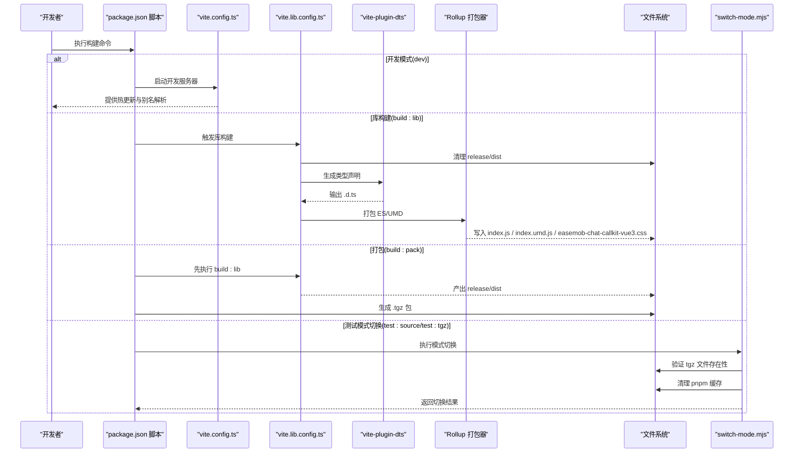
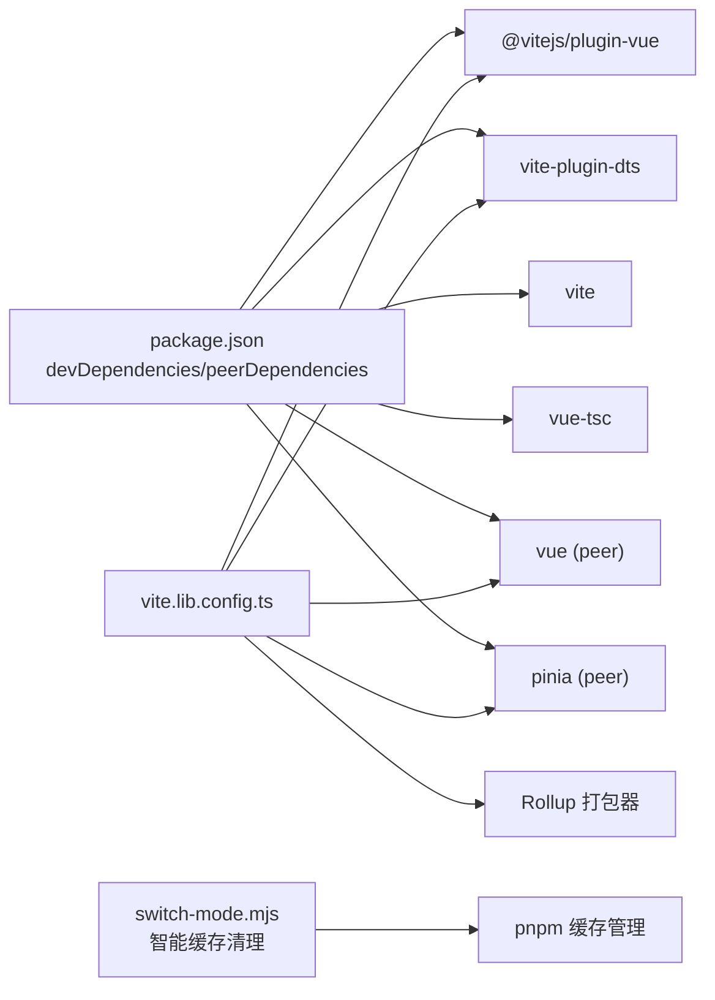

# 构建流程

<cite>
**本文引用的文件**
- [package.json](file://package.json)
- [vite.config.ts](file://vite.config.ts)
- [vite.lib.config.ts](file://vite.lib.config.ts)
- [tsconfig.json](file://tsconfig.json)
- [tsconfig.app.json](file://tsconfig.app.json)
- [tsconfig.node.json](file://tsconfig.node.json)
- [lib/index.ts](file://lib/index.ts)
- [lib/style.css](file://lib/style.css)
- [lib/components/singleCall/styles/EasemobChatSingleCall.css](file://lib/components/singleCall/styles/EasemobChatSingleCall.css)
- [lib/components/singleCall/styles/CallControls.css](file://lib/components/singleCall/styles/CallControls.css)
- [lib/components/singleCall/styles/CallInfoBar.css](file://lib/components/singleCall/styles/CallInfoBar.css)
- [lib/components/singleCall/styles/EasemobChatCallStream.css](file://lib/components/singleCall/styles/EasemobChatCallStream.css)
- [lib/components/singleCall/styles/EasemobChatCallWaiting.css](file://lib/components/singleCall/styles/EasemobChatCallWaiting.css)
- [lib/components/multiCall/styles/EasemobChatGroupMemberList.css](file://lib/components/multiCall/styles/EasemobChatGroupMemberList.css)
- [test/vite.config.source.ts](file://test/vite.config.source.ts)
- [test/vite.config.tgz.ts](file://test/vite.config.tgz.ts)
- [test/package.json](file://test/package.json)
- [test/scripts/switch-mode.mjs](file://test/scripts/switch-mode.mjs)
- [test/src/App.vue](file://test/src/App.vue)
- [test/src/main.ts](file://test/src/main.ts)
- [README.md](file://README.md)
- [USAGE.md](file://USAGE.md)
- [release/dist/index.js](file://release/dist/index.js)
- [release/dist/index.d.ts](file://release/dist/index.d.ts)
- [release/dist/index.umd.js](file://release/dist/index.umd.js)
- [release/dist/easemob-chat-callkit-vue3.css](file://release/dist/easemob-chat-callkit-vue3.css)
- [release/easemob-chat-callkit-vue3-1.0.0.tgz](file://release/easemob-chat-callkit-vue3-1.0.0.tgz)
</cite>

## 更新摘要
**变更内容**
- 改进了测试验证步骤，增强了 tgz 包安装的可靠性
- 完善了开发环境切换机制，增加了缓存清理和依赖验证
- 新增了详细的测试模式切换流程和故障排查指南
- **更新** 修复了lib/style.css文件的基础设施问题，确保CSS文件正确跟踪在版本控制中

## 目录
1. [简介](#简介)
2. [项目结构](#项目结构)
3. [核心组件](#核心组件)
4. [架构总览](#架构总览)
5. [详细组件分析](#详细组件分析)
6. [依赖关系分析](#依赖关系分析)
7. [性能考虑](#性能考虑)
8. [故障排查指南](#故障排查指南)
9. [结论](#结论)
10. [附录](#附录)

## 简介
本文件系统性梳理项目的构建流程，重点覆盖两种构建模式：
- 开发模式：通过根目录的 Vite 配置进行本地开发与调试。
- 库构建模式：通过独立的库构建配置生成可分发的 ES/UMD 产物，并输出类型声明与样式文件。

同时，文档解释 TypeScript 编译配置与 Vite 构建配置的作用，说明构建脚本命令（dev、build、build:lib、build:pack）的用途与输出结果，给出构建优化策略、代码分割与打包配置建议，并对构建产物的结构与使用方式进行说明。

**更新** 本版本增强了测试验证流程，提供了更可靠的 tgz 包安装机制和开发环境切换功能。**特别修复**了lib/style.css文件的基础设施问题，确保CSS文件正确跟踪在版本控制中，避免了样式文件丢失的风险。

## 项目结构
项目采用"库源码 + 测试验证 + 发布产物"的组织方式：
- lib：库源码与样式入口，包含组件、组合式函数、服务、状态管理、类型与样式聚合。
- test：测试演示工程，提供两种验证模式（源码模式与 tgz 包模式），包含智能切换脚本。
- release：发布产物目录，包含构建产物与打包后的 .tgz 文件。
- vite.config.ts：开发模式的 Vite 配置。
- vite.lib.config.ts：库构建模式的 Vite 配置。
- tsconfig.*：TypeScript 多项目引用配置，分别约束应用与 Node 工具链编译行为。

**图表来源**
- [package.json:1-53](file://package.json#L1-L53)
- [vite.config.ts:1-21](file://vite.config.ts#L1-L21)
- [vite.lib.config.ts:1-69](file://vite.lib.config.ts#L1-L69)
- [tsconfig.json:1-8](file://tsconfig.json#L1-L8)
- [tsconfig.app.json:1-22](file://tsconfig.app.json#L1-L22)
- [tsconfig.node.json:1-27](file://tsconfig.node.json#L1-L27)
- [lib/index.ts:1-58](file://lib/index.ts#L1-L58)
- [lib/style.css:1-12](file://lib/style.css#L1-L12)
- [lib/components/singleCall/styles/EasemobChatSingleCall.css](file://lib/components/singleCall/styles/EasemobChatSingleCall.css)
- [lib/components/multiCall/styles/EasemobChatGroupMemberList.css](file://lib/components/multiCall/styles/EasemobChatGroupMemberList.css)
- [test/package.json:1-30](file://test/package.json#L1-L30)
- [test/vite.config.source.ts:1-25](file://test/vite.config.source.ts#L1-L25)
- [test/vite.config.tgz.ts:1-20](file://test/vite.config.tgz.ts#L1-L20)
- [test/scripts/switch-mode.mjs:1-77](file://test/scripts/switch-mode.mjs#L1-L77)

**章节来源**
- [README.md:1-260](file://README.md#L1-L260)
- [package.json:1-53](file://package.json#L1-L53)
- [vite.config.ts:1-21](file://vite.config.ts#L1-L21)
- [vite.lib.config.ts:1-69](file://vite.lib.config.ts#L1-L69)
- [tsconfig.json:1-8](file://tsconfig.json#L1-L8)
- [tsconfig.app.json:1-22](file://tsconfig.app.json#L1-L22)
- [tsconfig.node.json:1-27](file://tsconfig.node.json#L1-L27)

## 核心组件
本节聚焦构建相关的核心文件及其职责：
- package.json：定义构建脚本、导出字段与依赖范围；其中 exports 字段明确对外暴露的入口与样式资源路径。
- vite.config.ts：开发模式配置，设置插件与路径别名，使开发时能直接解析 lib 目录。
- vite.lib.config.ts：库构建配置，负责清理输出目录、生成类型声明、打包 ES/UMD、外置 peerDependencies、重命名样式文件等。
- tsconfig.*：多项目引用与编译选项，分别约束应用侧与工具链侧的模块解析与严格性。
- lib/index.ts 与 lib/style.css：库入口与样式入口，决定构建产物的导出与样式打包策略。
- **更新** lib/style.css：现在是一个聚合文件，正确跟踪所有组件样式的版本控制，确保CSS文件不会丢失。
- test/*：测试验证工程，提供源码模式与 tgz 模式的 Vite 配置及智能模式切换脚本。

**更新** 测试脚本新增了智能缓存清理和依赖验证功能，确保 tgz 包安装的可靠性。**特别修复**了CSS文件的基础设施，确保样式文件正确跟踪在版本控制中。

**章节来源**
- [package.json:1-53](file://package.json#L1-L53)
- [vite.config.ts:1-21](file://vite.config.ts#L1-L21)
- [vite.lib.config.ts:1-69](file://vite.lib.config.ts#L1-L69)
- [tsconfig.json:1-8](file://tsconfig.json#L1-L8)
- [tsconfig.app.json:1-22](file://tsconfig.app.json#L1-L22)
- [tsconfig.node.json:1-27](file://tsconfig.node.json#L1-L27)
- [lib/index.ts:1-58](file://lib/index.ts#L1-L58)
- [lib/style.css:1-12](file://lib/style.css#L1-L12)
- [test/package.json:1-30](file://test/package.json#L1-L30)
- [test/vite.config.source.ts:1-25](file://test/vite.config.source.ts#L1-L25)
- [test/vite.config.tgz.ts:1-20](file://test/vite.config.tgz.ts#L1-L20)
- [test/scripts/switch-mode.mjs:1-77](file://test/scripts/switch-mode.mjs#L1-L77)

## 架构总览
下图展示了两种构建模式的端到端流程与关键交互点：

**图表来源**
- [package.json:23-32](file://package.json#L23-L32)
- [vite.config.ts:1-21](file://vite.config.ts#L1-L21)
- [vite.lib.config.ts:1-69](file://vite.lib.config.ts#L1-L69)
- [test/scripts/switch-mode.mjs:1-77](file://test/scripts/switch-mode.mjs#L1-L77)

## 详细组件分析

### 开发模式（vite.config.ts）
- 作用：为本地开发提供快速迭代体验，启用 Vue 插件与路径别名，使 import easemob-chat-callkit-vue3 能解析到 lib/index.ts 与 lib/style.css。
- 关键点：
  - 插件：@vitejs/plugin-vue。
  - 别名：将包名与样式路径映射到 lib 目录，便于开发时直接使用源码。
- 适用场景：日常开发、联调、组件调试。

**章节来源**
- [vite.config.ts:1-21](file://vite.config.ts#L1-L21)
- [lib/index.ts:1-58](file://lib/index.ts#L1-L58)
- [lib/style.css:1-12](file://lib/style.css#L1-L12)

### 库构建模式（vite.lib.config.ts）
- 作用：生成面向用户的库产物，支持 ES 与 UMD 两种格式，输出类型声明与样式文件，并将 Vue 与 Pinia 设为外部依赖（peerDependencies）。
- 关键点：
  - 插件链：自定义清理插件、@vitejs/plugin-vue、vite-plugin-dts。
  - 清理逻辑：构建前删除 release/dist 并重建，保证产物干净。
  - 类型生成：通过 dts 插件生成 .d.ts，输出到 release/dist。
  - 库配置：entry 指向 lib/index.ts，name 为 EasemobChatCallKit，formats 为 es 与 umd。
  - 外部化：将 vue 与 pinia 外置，避免重复打包。
  - 资源命名：样式文件统一命名为 easemob-chat-callkit-vue3.css。
  - 路径别名：@ 指向 lib，便于库内部模块引用。
- 适用场景：发布前验证、打包 .tgz 供下游使用。

**章节来源**
- [vite.lib.config.ts:1-69](file://vite.lib.config.ts#L1-L69)
- [lib/index.ts:1-58](file://lib/index.ts#L1-L58)
- [lib/style.css:1-12](file://lib/style.css#L1-L12)

### CSS 样式基础设施修复

**更新** 本节新增了CSS文件基础设施修复的详细说明。

- lib/style.css 现状：现在是一个聚合文件，正确跟踪所有组件样式的版本控制，确保CSS文件不会丢失。
- 样式组织结构：
  - 单人通话组件样式：EasemobChatSingleCall.css、CallControls.css、CallInfoBar.css、EasemobChatCallStream.css、EasemobChatCallWaiting.css
  - 多人通话组件样式：EasemobChatGroupMemberList.css
- 构建处理：
  - 在库构建中，所有样式文件通过 @import 语句聚合到 lib/style.css
  - Rollup 配置将最终的样式文件重命名为 easemob-chat-callkit-vue3.css
  - cssCodeSplit 设置为 false，避免样式文件被拆分，简化部署
- 版本控制保障：
  - 每个具体样式文件都已正确添加到版本控制系统
  - 通过聚合文件确保样式文件的完整性
  - 避免了单个样式文件丢失导致的构建失败

**章节来源**
- [lib/style.css:1-12](file://lib/style.css#L1-L12)
- [lib/components/singleCall/styles/EasemobChatSingleCall.css](file://lib/components/singleCall/styles/EasemobChatSingleCall.css)
- [lib/components/singleCall/styles/CallControls.css](file://lib/components/singleCall/styles/CallControls.css)
- [lib/components/singleCall/styles/CallInfoBar.css](file://lib/components/singleCall/styles/CallInfoBar.css)
- [lib/components/singleCall/styles/EasemobChatCallStream.css](file://lib/components/singleCall/styles/EasemobChatCallStream.css)
- [lib/components/singleCall/styles/EasemobChatCallWaiting.css](file://lib/components/singleCall/styles/EasemobChatCallWaiting.css)
- [lib/components/multiCall/styles/EasemobChatGroupMemberList.css](file://lib/components/multiCall/styles/EasemobChatGroupMemberList.css)
- [vite.lib.config.ts:44-59](file://vite.lib.config.ts#L44-L59)

### TypeScript 编译配置
- tsconfig.json：采用多项目引用，分别指向 tsconfig.app.json 与 tsconfig.node.json，实现"应用侧"与"工具链侧"配置分离。
- tsconfig.app.json：
  - 继承 @vue/tsconfig 的 DOM 默认配置。
  - moduleResolution 设置为 bundler，适配现代打包器。
  - 路径别名 @/* 指向 lib/*，与库构建中的别名保持一致。
  - include 限定在 lib/**/*.ts(x)/.vue，聚焦库源码。
- tsconfig.node.json：
  - 专用于 Vite 配置文件的编译，限制 include 仅包含 vite.config.ts 与 vite.lib.config.ts。
  - 严格模式开启，提升工具链质量。

**章节来源**
- [tsconfig.json:1-8](file://tsconfig.json#L1-L8)
- [tsconfig.app.json:1-22](file://tsconfig.app.json#L1-L22)
- [tsconfig.node.json:1-27](file://tsconfig.node.json#L1-L27)

### 构建脚本命令与用途
- dev：启动根目录开发服务器，配合 vite.config.ts 使用。
- build：先执行 TypeScript 构建，再执行 Vite 构建（通常用于根目录演示或预览）。
- build:lib：执行库构建，输出到 release/dist，包含 ES/UMD、类型声明与样式文件。
- build:pack：先执行库构建，再打包为 .tgz，输出到 release/ 目录。
- test/test:source/test:tgz：在测试工程中切换模式并启动开发服务器，验证源码与打包产物的一致性。

**更新** 新增了智能测试模式切换脚本，提供更可靠的 tgz 包安装验证。

**章节来源**
- [package.json:23-32](file://package.json#L23-L32)
- [README.md:233-247](file://README.md#L233-L247)
- [test/package.json:6-14](file://test/package.json#L6-L14)
- [test/scripts/switch-mode.mjs:1-77](file://test/scripts/switch-mode.mjs#L1-L77)

### 构建产物结构与使用方式
- release/dist：
  - index.js：ESM 格式库文件。
  - index.umd.js：UMD 格式库文件。
  - index.d.ts：类型声明文件。
  - easemob-chat-callkit-vue3.css：样式文件。
- 使用方式：
  - 在应用中按需引入样式与插件入口，参考 USAGE.md 的安装与快速开始章节。
  - 若通过包管理器安装 .tgz，可在测试工程中验证加载效果。

**章节来源**
- [README.md:167-181](file://README.md#L167-L181)
- [USAGE.md:1-162](file://USAGE.md#L1-L162)
- [release/dist/index.js](file://release/dist/index.js)
- [release/dist/index.umd.js](file://release/dist/index.umd.js)
- [release/dist/index.d.ts](file://release/dist/index.d.ts)
- [release/dist/easemob-chat-callkit-vue3.css](file://release/dist/easemob-chat-callkit-vue3.css)
- [release/easemob-chat-callkit-vue3-1.0.0.tgz](file://release/easemob-chat-callkit-vue3-1.0.0.tgz)

### 测试验证模式（源码模式与 tgz 模式）

**更新** 本节新增了智能模式切换机制和增强的 tgz 包安装可靠性。

- 源码模式：在 test 目录中通过 vite.config.source.ts 直接解析 lib/index.ts 与 lib/style.css，适合开发调试。
- tgz 模式：通过 switch-mode.mjs 将依赖切换为本地 .tgz 包，模拟真实用户使用场景，验证构建产物可用性。
- 智能切换机制：
  - 自动验证 .tgz 文件存在性，防止安装失败。
  - 强制清理 pnpm 缓存，确保使用最新打包产物。
  - 支持双向切换，自动处理依赖关系。
- 两种模式互不干扰，可通过 test/package.json 的脚本一键切换与启动。

**章节来源**
- [test/vite.config.source.ts:1-25](file://test/vite.config.source.ts#L1-L25)
- [test/vite.config.tgz.ts:1-20](file://test/vite.config.tgz.ts#L1-L20)
- [test/package.json:6-14](file://test/package.json#L6-L14)
- [test/scripts/switch-mode.mjs:1-77](file://test/scripts/switch-mode.mjs#L1-L77)
- [README.md:233-247](file://README.md#L233-L247)

## 依赖关系分析
- 构建期依赖：
  - @vitejs/plugin-vue：支持 .vue 单文件组件。
  - vite-plugin-dts：生成类型声明。
  - vite：开发服务器与打包器。
  - vue-tsc：类型检查与增量编译。
- 运行期依赖：
  - vue 与 pinia 作为 peerDependencies，由使用者项目提供，避免重复打包。
- 外部化策略：
  - 在库构建中将 vue 与 pinia 外置，减少包体体积并避免运行时冲突。

**图表来源**
- [package.json:36-51](file://package.json#L36-L51)
- [vite.lib.config.ts:24-61](file://vite.lib.config.ts#L24-L61)
- [test/scripts/switch-mode.mjs:55-76](file://test/scripts/switch-mode.mjs#L55-L76)

**章节来源**
- [package.json:36-51](file://package.json#L36-L51)
- [vite.lib.config.ts:24-61](file://vite.lib.config.ts#L24-L61)
- [test/scripts/switch-mode.mjs:55-76](file://test/scripts/switch-mode.mjs#L55-L76)

## 性能考虑
- 代码分割与打包策略：
  - 库构建默认关闭 cssCodeSplit，有利于减少样式资源拆分带来的额外请求与复杂度。
  - 通过 external 将 vue 与 pinia 外置，降低包体大小并避免重复依赖。
- 资源命名与缓存：
  - 样式文件统一命名为 easemob-chat-callkit-vue3.css，便于 CDN 缓存与版本管理。
- 开发体验：
  - 开发模式启用热更新与别名解析，提升迭代效率。
- 类型生成：
  - 使用 dts 插件在构建阶段生成 .d.ts，避免运行时类型检查开销。
- **更新** 缓存管理优化：
  - 测试模式切换时自动清理 pnpm 缓存，避免陈旧包影响安装可靠性。
- **更新** CSS 文件基础设施优化：
  - 通过聚合文件确保所有样式文件正确跟踪在版本控制中，避免构建失败风险。

**章节来源**
- [vite.lib.config.ts:45-58](file://vite.lib.config.ts#L45-L58)
- [lib/style.css:1-12](file://lib/style.css#L1-L12)
- [test/scripts/switch-mode.mjs:55-76](file://test/scripts/switch-mode.mjs#L55-L76)

## 故障排查指南

**更新** 新增了智能模式切换和缓存清理相关的故障排查指南。

- 构建前未清空 release/dist：
  - 症状：旧产物残留导致版本混淆。
  - 处理：确认自定义清理插件已执行，或手动删除 release/dist 后重新构建。
- 外部化依赖缺失：
  - 症状：运行时报错找不到 vue 或 pinia。
  - 处理：确保使用者项目安装了 peerDependencies。
- 样式未生效：
  - 症状：组件渲染无样式。
  - 处理：确认已引入 easemob-chat-callkit-vue3.css，或检查样式入口是否正确。
- **更新** CSS 文件丢失：
  - 症状：构建时报错找不到样式文件或样式不生效。
  - 处理：确认 lib/style.css 聚合文件中包含所有必要的 @import 语句。
  - 处理：检查每个具体样式文件是否已正确添加到版本控制。
  - 处理：验证 Rollup 配置中的 assetFileNames 是否正确重命名样式文件。
- **更新** 模式切换失败：
  - 症状：切换到 tgz 模式时报错找不到 .tgz 文件。
  - 处理：先执行 build:pack 生成 .tgz，再切换模式。
  - 症状：安装 tgz 包后仍使用旧版本。
  - 处理：脚本会自动清理 pnpm 缓存，如仍失败，手动删除 node_modules/.pnpm 目录。
- **更新** 测试验证异常：
  - 症状：test:source 或 test:tgz 脚本执行失败。
  - 处理：检查 switch-mode.mjs 的使用方法，确保传入正确的参数（source 或 tgz）。
  - 症状：切换后依赖关系混乱。
  - 处理：重新执行 pnpm install 或 pnpm add 命令更新依赖。

**章节来源**
- [vite.lib.config.ts:8-21](file://vite.lib.config.ts#L8-L21)
- [test/scripts/switch-mode.mjs:21-77](file://test/scripts/switch-mode.mjs#L21-L77)
- [README.md:167-181](file://README.md#L167-L181)

## 结论
本项目通过清晰的双模式构建体系，兼顾开发效率与发布质量。开发模式提供即时反馈，库构建模式确保产物规范与可复用性。配合严格的类型生成、外部化策略与资源命名约定，能够稳定支撑从开发到发布的全链路需求。

**更新** 新版本增强了测试验证的可靠性，通过智能模式切换脚本和缓存清理机制，显著提升了 tgz 包安装的成功率和开发体验。**特别修复**了CSS文件的基础设施问题，确保样式文件正确跟踪在版本控制中，避免了构建失败的风险。建议在持续集成中固定运行顺序：先 build:lib，再 build:pack，最后进行下游集成验证。

## 附录
- 发布流程建议：
  1) 开发调试：使用 test:source。
  2) 构建验证：使用 test:tgz。
  3) 打包发布：执行 build:pack 生成 .tgz。
  4) 分发：将 .tgz 上传至 npm 或私有仓库。
- 最佳实践：
  - 保持 lib/index.ts 与 lib/style.css 的导出一致性。
  - 在 CI 中增加类型检查与打包校验步骤。
  - 对外暴露的样式与 JS 文件命名保持稳定，避免破坏性变更。
  - **更新** 使用智能模式切换脚本进行测试验证，确保 tgz 包安装的可靠性。
  - **更新** 定期清理 pnpm 缓存，避免陈旧包影响构建质量。
  - **更新** 确保所有样式文件都正确添加到版本控制，避免构建失败。