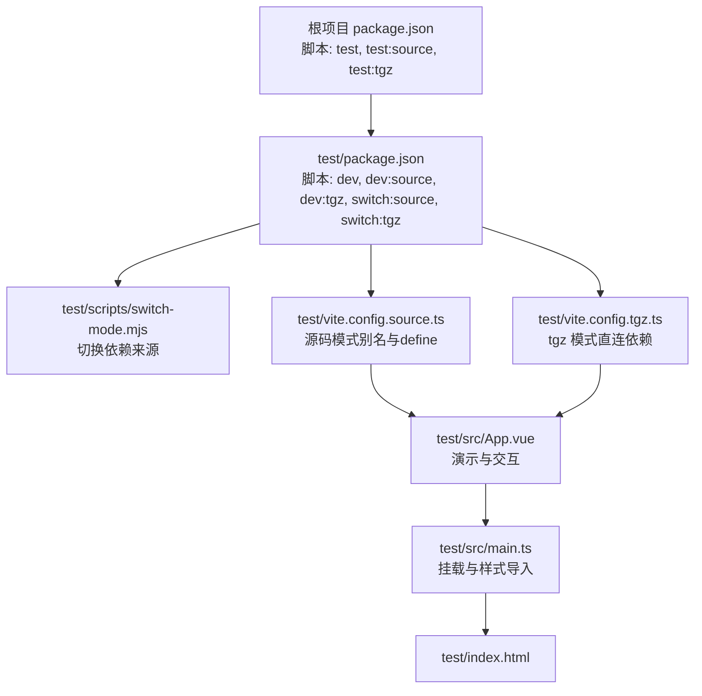
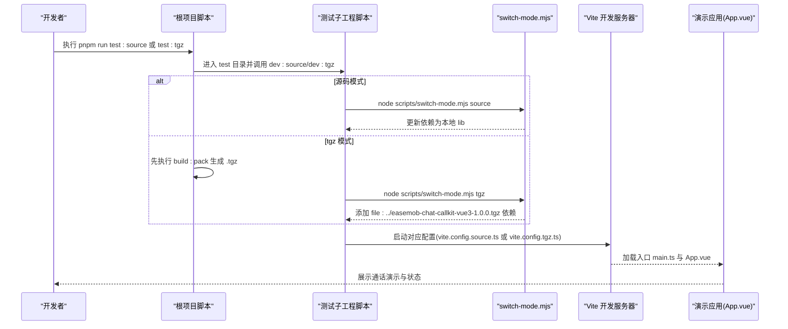
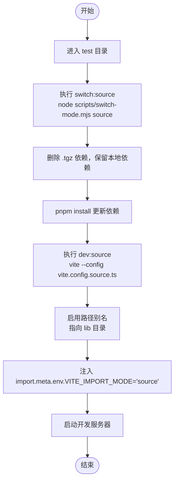
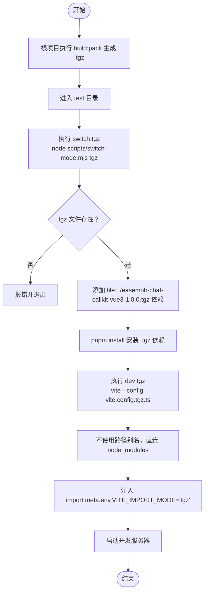
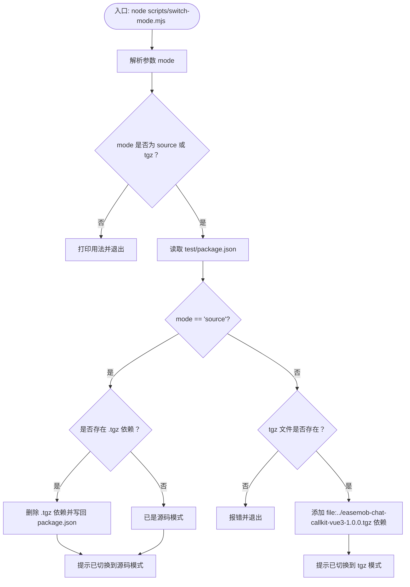
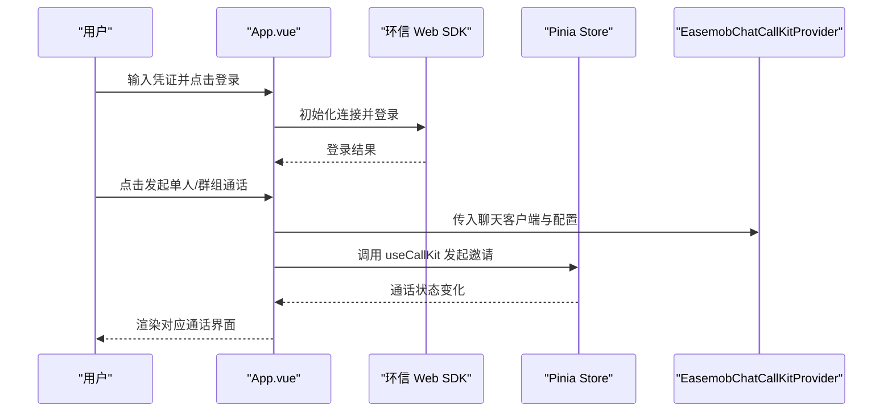
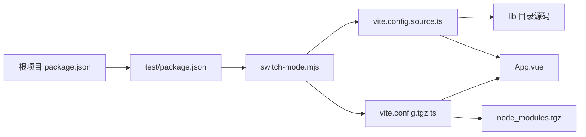

# 测试指南

<cite>
**本文引用的文件**
- [package.json](file://package.json)
- [test/package.json](file://test/package.json)
- [test/scripts/switch-mode.mjs](file://test/scripts/switch-mode.mjs)
- [test/vite.config.source.ts](file://test/vite.config.source.ts)
- [test/vite.config.tgz.ts](file://test/vite.config.tgz.ts)
- [test/src/main.ts](file://test/src/main.ts)
- [test/src/App.vue](file://test/src/App.vue)
- [test/index.html](file://test/index.html)
- [test/tsconfig.app.json](file://test/tsconfig.app.json)
- [test/tsconfig.json](file://test/tsconfig.json)
- [test/tsconfig.node.json](file://test/tsconfig.node.json)
</cite>

## 目录
1. [简介](#简介)
2. [项目结构](#项目结构)
3. [核心组件](#核心组件)
4. [架构总览](#架构总览)
5. [详细组件分析](#详细组件分析)
6. [依赖关系分析](#依赖关系分析)
7. [性能考量](#性能考量)
8. [故障排查指南](#故障排查指南)
9. [结论](#结论)
10. [附录](#附录)

## 简介
本测试指南面向 EaseMob Chat CallKit Vue3 组件库，系统性阐述测试架构与流程，重点覆盖两种测试模式：
- 源码模式测试（test:source）：直接基于 lib 源码开发与运行，便于联调与快速迭代
- tgz 包测试（test:tgz）：通过打包产物 .tgz 安装为依赖进行验证，模拟真实发布态

同时，文档将解释测试环境配置差异、切换机制（switch-mode.mjs）、测试脚本工作原理，并给出单元测试、集成测试与端到端测试的最佳实践，以及测试覆盖率与报告生成建议、新测试用例编写方法与常见问题调试策略。

## 项目结构
测试子工程位于 test 目录，采用 Vite + Vue3 技术栈，通过两套 Vite 配置分别适配“源码模式”和“tgz 包模式”。根项目提供统一的测试入口脚本，负责模式切换与启动。

图表来源
- [package.json](file://package.json#L23-L32)
- [test/package.json](file://test/package.json#L6-L14)
- [test/scripts/switch-mode.mjs](file://test/scripts/switch-mode.mjs#L1-L57)
- [test/vite.config.source.ts](file://test/vite.config.source.ts#L1-L25)
- [test/vite.config.tgz.ts](file://test/vite.config.tgz.ts#L1-L20)
- [test/src/App.vue](file://test/src/App.vue#L1-L565)
- [test/src/main.ts](file://test/src/main.ts#L1-L10)
- [test/index.html](file://test/index.html#L1-L13)

章节来源
- [package.json](file://package.json#L23-L32)
- [test/package.json](file://test/package.json#L6-L14)

## 核心组件
- 根项目测试脚本
  - test:source：进入 test 目录，先切换到源码模式，再启动源码模式开发服务器
  - test:tgz：先构建打包产物，再切换到 tgz 模式，启动 tgz 模式开发服务器
- 测试子工程
  - switch-mode.mjs：根据参数在“源码模式”和“tgz 模式”之间切换依赖来源
  - vite.config.source.ts：源码模式下通过路径别名指向 lib 目录，注入 import.meta.env.VITE_IMPORT_MODE
  - vite.config.tgz.ts：tgz 模式下不使用别名，直接从 node_modules 解析包
  - src/App.vue：演示组件库能力，包含登录、单人/群组通话发起与状态展示
  - src/main.ts：创建应用、注册 Pinia、挂载组件
  - index.html：页面入口
  - tsconfig.*：类型检查与编译配置

章节来源
- [package.json](file://package.json#L29-L31)
- [test/package.json](file://test/package.json#L6-L14)
- [test/scripts/switch-mode.mjs](file://test/scripts/switch-mode.mjs#L1-L57)
- [test/vite.config.source.ts](file://test/vite.config.source.ts#L1-L25)
- [test/vite.config.tgz.ts](file://test/vite.config.tgz.ts#L1-L20)
- [test/src/App.vue](file://test/src/App.vue#L1-L565)
- [test/src/main.ts](file://test/src/main.ts#L1-L10)
- [test/index.html](file://test/index.html#L1-L13)
- [test/tsconfig.app.json](file://test/tsconfig.app.json#L1-L16)
- [test/tsconfig.json](file://test/tsconfig.json#L1-L8)
- [test/tsconfig.node.json](file://test/tsconfig.node.json#L1-L26)

## 架构总览
测试架构围绕“模式切换 + 双配置 + 演示应用”的组合展开，确保在不同依赖来源下均能稳定运行并验证组件库行为。

图表来源
- [package.json](file://package.json#L29-L31)
- [test/package.json](file://test/package.json#L6-L14)
- [test/scripts/switch-mode.mjs](file://test/scripts/switch-mode.mjs#L1-L57)
- [test/vite.config.source.ts](file://test/vite.config.source.ts#L1-L25)
- [test/vite.config.tgz.ts](file://test/vite.config.tgz.ts#L1-L20)
- [test/src/main.ts](file://test/src/main.ts#L1-L10)
- [test/src/App.vue](file://test/src/App.vue#L1-L565)

## 详细组件分析

### 源码模式测试（test:source）
- 目标：直接使用 lib 源码作为依赖，避免打包产物差异带来的干扰，提升联调效率
- 关键点
  - 别名映射：将包名与样式文件指向 lib 目录，保证 import 与样式加载一致
  - 环境变量：通过 define 注入 import.meta.env.VITE_IMPORT_MODE，便于在演示应用中识别当前模式
  - 依赖来源：package.json 中删除对 .tgz 的依赖，确保解析到本地源码
- 典型流程
  - 运行 pnpm run test:source → 进入 test → 执行 switch:source → 执行 dev:source → 启动 Vite 源码模式配置

图表来源
- [test/package.json](file://test/package.json#L6-L14)
- [test/scripts/switch-mode.mjs](file://test/scripts/switch-mode.mjs#L29-L37)
- [test/vite.config.source.ts](file://test/vite.config.source.ts#L6-L24)

章节来源
- [test/package.json](file://test/package.json#L6-L14)
- [test/scripts/switch-mode.mjs](file://test/scripts/switch-mode.mjs#L29-L37)
- [test/vite.config.source.ts](file://test/vite.config.source.ts#L6-L24)

### tgz 包模式测试（test:tgz）
- 目标：验证真实发布态的依赖解析、样式与导出一致性
- 关键点
  - 依赖来源：先执行 build:pack 生成 .tgz，再通过 switch-mode.mjs 将依赖指向该文件
  - 别名禁用：tgz 模式下不使用路径别名，直接从 node_modules 解析包
  - 环境变量：同样注入 import.meta.env.VITE_IMPORT_MODE，值为 'tgz'
- 典型流程
  - 运行 pnpm run test:tgz → 先 build:pack → 进入 test → 执行 switch:tgz → 执行 dev:tgz → 启动 Vite tgz 模式配置

图表来源
- [package.json](file://package.json#L27-L31)
- [test/package.json](file://test/package.json#L6-L14)
- [test/scripts/switch-mode.mjs](file://test/scripts/switch-mode.mjs#L38-L56)
- [test/vite.config.tgz.ts](file://test/vite.config.tgz.ts#L6-L19)

章节来源
- [package.json](file://package.json#L27-L31)
- [test/package.json](file://test/package.json#L6-L14)
- [test/scripts/switch-mode.mjs](file://test/scripts/switch-mode.mjs#L38-L56)
- [test/vite.config.tgz.ts](file://test/vite.config.tgz.ts#L6-L19)

### switch-mode.mjs 切换机制
- 功能
  - 校验参数：仅允许 source 或 tgz
  - 源码模式：若存在 .tgz 依赖则删除，确保使用本地 lib
  - tgz 模式：校验 .tgz 是否存在，不存在则提示先执行 build:pack；存在则添加 file: 依赖
  - 输出提示：打印当前模式与后续操作建议
- 注意事项
  - 切换后需执行 pnpm install 以更新依赖树
  - tgz 模式依赖文件路径需与实际产物一致

图表来源
- [test/scripts/switch-mode.mjs](file://test/scripts/switch-mode.mjs#L1-L57)

章节来源
- [test/scripts/switch-mode.mjs](file://test/scripts/switch-mode.mjs#L1-L57)

### 演示应用（App.vue）与运行时验证
- 演示能力
  - 登录：使用环信 Web SDK 初始化连接
  - 单人/群组通话：通过 useCallKit 发起邀请，监听状态变化并渲染对应界面
  - 状态展示：根据当前通话类型与状态动态更新 UI
  - 调试：开启 debug 模式，结合控制台日志定位问题
- 与测试模式的关系
  - 通过 import.meta.env.VITE_IMPORT_MODE 判断当前模式并在 UI 上高亮显示
  - 源码模式与 tgz 模式在功能上应保持一致，差异主要体现在依赖解析与样式加载路径

图表来源
- [test/src/App.vue](file://test/src/App.vue#L91-L396)
- [test/src/main.ts](file://test/src/main.ts#L1-L10)

章节来源
- [test/src/App.vue](file://test/src/App.vue#L1-L565)
- [test/src/main.ts](file://test/src/main.ts#L1-L10)

## 依赖关系分析
- 根项目与测试子工程
  - 根项目提供统一测试入口与打包命令
  - 测试子工程负责模式切换与开发服务器启动
- 模式对依赖的影响
  - 源码模式：依赖指向 lib 目录，无需 .tgz
  - tgz 模式：依赖指向 .tgz 文件，需先打包
- Vite 配置对解析的影响
  - 源码模式：通过路径别名将包名解析到 lib
  - tgz 模式：不使用别名，直接从 node_modules 解析

图表来源
- [package.json](file://package.json#L23-L32)
- [test/package.json](file://test/package.json#L6-L14)
- [test/scripts/switch-mode.mjs](file://test/scripts/switch-mode.mjs#L1-L57)
- [test/vite.config.source.ts](file://test/vite.config.source.ts#L1-L25)
- [test/vite.config.tgz.ts](file://test/vite.config.tgz.ts#L1-L20)

章节来源
- [package.json](file://package.json#L23-L32)
- [test/package.json](file://test/package.json#L6-L14)
- [test/scripts/switch-mode.mjs](file://test/scripts/switch-mode.mjs#L1-L57)
- [test/vite.config.source.ts](file://test/vite.config.source.ts#L1-L25)
- [test/vite.config.tgz.ts](file://test/vite.config.tgz.ts#L1-L20)

## 性能考量
- 源码模式
  - 优点：热更新快、调试直观、无打包开销
  - 建议：仅在本地联调阶段使用；大改动前建议补充单元测试
- tgz 模式
  - 优点：更接近真实发布态，有助于发现打包或导出问题
  - 建议：在合并前与发布前各跑一次，确保依赖与导出一致
- 通用建议
  - 控制演示应用复杂度，避免在测试中引入无关性能负担
  - 对关键流程（如通话状态机）增加日志与断言，便于定位瓶颈

## 故障排查指南
- 切换失败
  - 症状：执行 switch:source 或 switch:tgz 后仍无法识别模式
  - 排查：确认已执行 pnpm install；检查 test/package.json 中依赖是否正确更新
- tgz 依赖缺失
  - 症状：tgz 模式提示找不到 .tgz 文件
  - 排查：先执行根项目 build:pack 生成 .tgz；核对文件路径与名称
- 样式或导出示错
  - 症状：样式未生效或组件导入失败
  - 排查：源码模式检查路径别名；tgz 模式检查 node_modules 解析
- 演示应用异常
  - 症状：登录失败、通话无法发起
  - 排查：检查环信 SDK 初始化与凭证；确认 Provider 配置与 debug 日志

章节来源
- [test/scripts/switch-mode.mjs](file://test/scripts/switch-mode.mjs#L40-L56)
- [test/vite.config.source.ts](file://test/vite.config.source.ts#L12-L23)
- [test/vite.config.tgz.ts](file://test/vite.config.tgz.ts#L13-L18)
- [test/src/App.vue](file://test/src/App.vue#L150-L162)

## 结论
本测试指南明确了两种测试模式的差异与适用场景，并提供了清晰的切换与运行流程。通过 switch-mode.mjs 与双 Vite 配置，既能满足本地高效联调，又能覆盖真实发布态验证。建议在日常开发中优先使用源码模式进行迭代，在关键节点使用 tgz 模式进行回归验证，配合完善的日志与断言，确保组件库质量与稳定性。

## 附录

### 测试最佳实践
- 单元测试
  - 针对纯函数与工具函数，使用最小化依赖与 Mock 数据
  - 重点覆盖边界条件与异常分支
- 集成测试
  - 验证 Store 状态流转与组件生命周期交互
  - 使用真实或模拟的环信 SDK 实例
- 端到端测试
  - 覆盖完整业务链路：登录 → 发起通话 → 接听/拒绝 → 结束通话
  - 在两种模式下重复执行，确保一致性

### 测试覆盖率与报告
- 建议
  - 使用 Vitest 并配置覆盖率收集（如百分比阈值）
  - 生成 HTML 报告并与 CI 集成
  - 对关键模块（如 CallService、store、hooks）设定最低覆盖率门槛

### 新测试用例编写指南
- 明确测试目标：针对具体功能点与边界条件
- 准备测试数据：构造合理的输入与期望输出
- 使用 Mock：隔离外部依赖（如 SDK、网络请求）
- 断言清晰：关注状态变更、事件触发与副作用
- 模式兼容：在两种模式下分别运行，确保行为一致