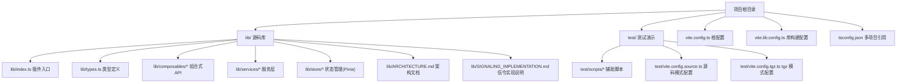
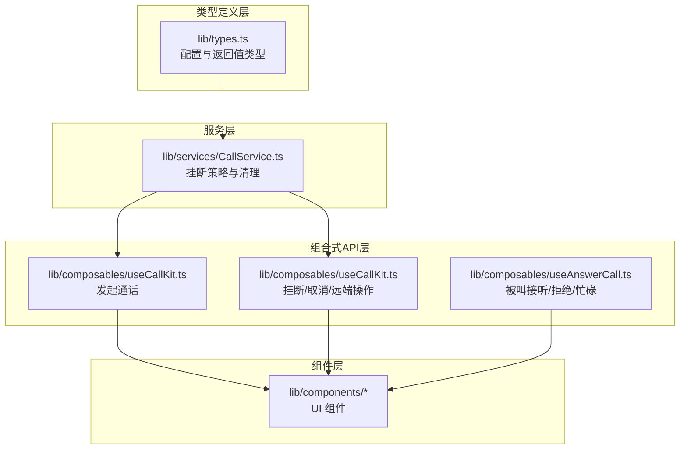
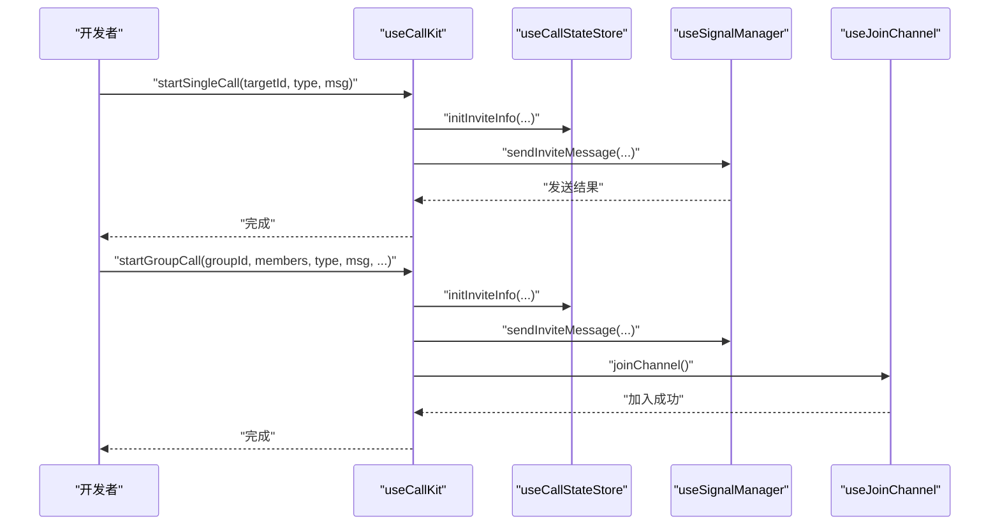
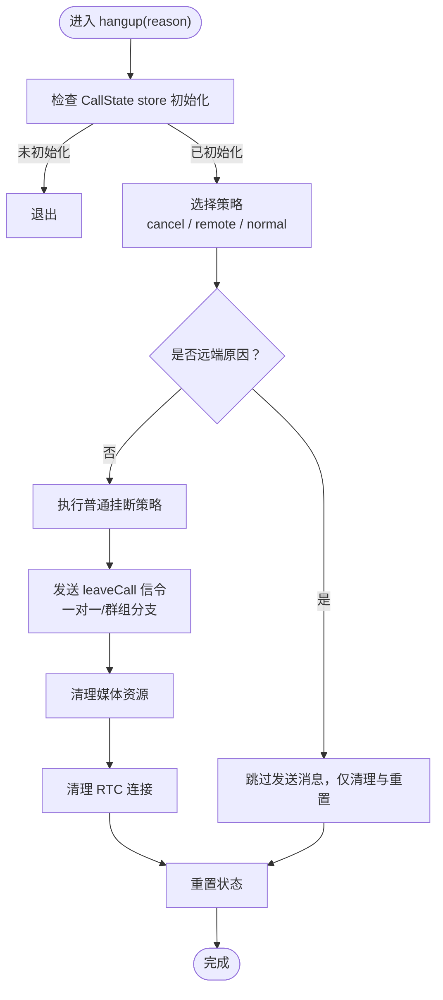
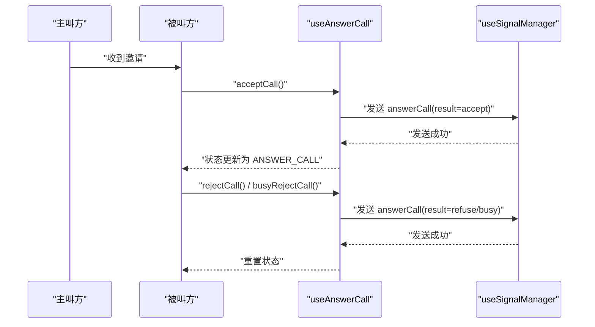
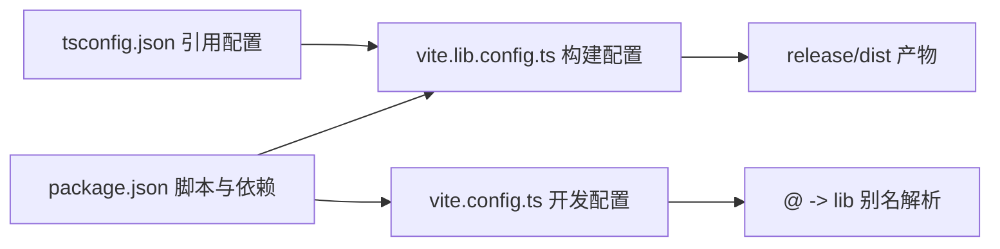

# 贡献流程

<cite>
**本文引用的文件**
- [README.md](file://README.md)
- [USAGE.md](file://USAGE.md)
- [package.json](file://package.json)
- [vite.config.ts](file://vite.config.ts)
- [vite.lib.config.ts](file://vite.lib.config.ts)
- [tsconfig.json](file://tsconfig.json)
- [lib/index.ts](file://lib/index.ts)
- [lib/types.ts](file://lib/types.ts)
- [lib/composables/useCallKit.ts](file://lib/composables/useCallKit.ts)
- [lib/services/CallService.ts](file://lib/services/CallService.ts)
- [lib/store/callState.ts](file://lib/store/callState.ts)
- [lib/ARCHITECTURE.md](file://lib/ARCHITECTURE.md)
- [lib/SIGNALING_IMPLEMENTATION.md](file://lib/SIGNALING_IMPLEMENTATION.md)
</cite>

## 目录
1. [简介](#简介)
2. [项目结构](#项目结构)
3. [核心组件](#核心组件)
4. [架构总览](#架构总览)
5. [详细组件分析](#详细组件分析)
6. [依赖关系分析](#依赖关系分析)
7. [性能考量](#性能考量)
8. [故障排查指南](#故障排查指南)
9. [结论](#结论)
10. [附录](#附录)

## 简介
本指南面向希望参与本项目的贡献者，覆盖从 Fork 项目、创建分支、提交代码到创建 Pull Request 的完整流程；说明代码规范（TypeScript 编码标准、Git 提交信息格式、分支命名约定）；文档化代码审查流程与合并要求；给出新功能开发的指导原则与最佳实践；提供问题报告与功能请求的模板与流程；并说明文档贡献的方式与要求。

## 项目结构
本项目采用“库（lib）+ 测试演示（test）+ 构建配置（vite.config）+ 类型配置（tsconfig）”的组织方式，核心能力以 Vue3 插件形式提供，配套多种验证模式（源码模式、tgz 包模式）与自动化脚本，便于开发与发布。

图表来源
- [README.md](file://README.md#L5-L31)
- [vite.config.ts](file://vite.config.ts#L1-L21)
- [vite.lib.config.ts](file://vite.lib.config.ts#L1-L68)
- [lib/index.ts](file://lib/index.ts#L1-L58)
- [lib/types.ts](file://lib/types.ts#L1-L91)

章节来源
- [README.md](file://README.md#L5-L31)
- [vite.config.ts](file://vite.config.ts#L1-L21)
- [vite.lib.config.ts](file://vite.lib.config.ts#L1-L68)

## 核心组件
- 插件入口与导出：统一导出 Provider、组件、Hook、Store、服务与类型，便于外部按需使用与全局安装。
- 组合式 API：如 useCallKit、useEndCall、useAnswerCall 等，封装业务逻辑与状态访问。
- 服务层：如 CallService，负责挂断策略、媒体资源清理、信令发送等。
- 状态管理：Pinia Store（如 useCallStateStore），集中管理通话状态、定时器、用户映射等。
- 类型系统：完善的类型定义与导出，保证类型安全与 IDE 支持。

章节来源
- [lib/index.ts](file://lib/index.ts#L1-L58)
- [lib/types.ts](file://lib/types.ts#L1-L91)
- [lib/composables/useCallKit.ts](file://lib/composables/useCallKit.ts#L1-L123)
- [lib/services/CallService.ts](file://lib/services/CallService.ts#L1-L298)
- [lib/store/callState.ts](file://lib/store/callState.ts#L1-L263)

## 架构总览
项目采用“类型定义层 → 服务层 → 组合式API层 → 组件层”的分层架构，配合响应式状态管理与类型系统，确保职责清晰、可扩展且易测试。

图表来源
- [lib/ARCHITECTURE.md](file://lib/ARCHITECTURE.md#L1-L190)
- [lib/types.ts](file://lib/types.ts#L1-L91)
- [lib/services/CallService.ts](file://lib/services/CallService.ts#L1-L298)
- [lib/composables/useCallKit.ts](file://lib/composables/useCallKit.ts#L1-L123)

## 详细组件分析

### 组件 A 分析：useCallKit 组合式 API
- 职责：封装发起单人/群组通话的流程，初始化邀请信息、发送邀请信令、必要时立即加入 RTC 频道。
- 关键点：
  - 校验 ChatClient 初始化状态，避免在 Provider 外使用。
  - 初始化邀请信息并设置状态为 INVITING。
  - 单人通话：通过信令管理器发送邀请消息。
  - 群组通话：初始化邀请信息后，主叫方立即加入 RTC 频道并更新状态为 IN_CALL。
- 时序示意：

图表来源
- [lib/composables/useCallKit.ts](file://lib/composables/useCallKit.ts#L1-L123)
- [lib/store/callState.ts](file://lib/store/callState.ts#L1-L263)

章节来源
- [lib/composables/useCallKit.ts](file://lib/composables/useCallKit.ts#L1-L123)
- [lib/store/callState.ts](file://lib/store/callState.ts#L1-L263)

### 组件 B 分析：CallService 服务层
- 职责：统一处理挂断流程（普通挂断、取消、远端操作等），清理媒体资源与连接，重置状态。
- 关键点：
  - 策略模式：根据挂断原因选择不同策略（cancel、remote、normal）。
  - 一对一/群组区分：分别发送 leaveCall 信令或群定向消息。
  - 媒体清理：取消发布本地轨道、关闭本地轨道、离开频道。
  - 状态重置：调用 store 的 reset 方法，触发 UI 回收。
- 流程示意：

图表来源
- [lib/services/CallService.ts](file://lib/services/CallService.ts#L1-L298)

章节来源
- [lib/services/CallService.ts](file://lib/services/CallService.ts#L1-L298)

### 组件 C 分析：useAnswerCall（被叫接听/拒绝/忙碌）
- 职责：提供被叫方接受、拒绝、忙碌拒绝的组合式 API，发送 answerCall 信令并更新状态。
- 关键点：
  - 接受通话：发送 answerCall(result=accept)，更新状态为 ANSWER_CALL。
  - 拒绝/忙碌：发送相应 result，重置状态。
  - 与信令管理器协作，预留 RTC 加入频道接口。
- 时序示意：

图表来源
- [lib/SIGNALING_IMPLEMENTATION.md](file://lib/SIGNALING_IMPLEMENTATION.md#L80-L98)

章节来源
- [lib/SIGNALING_IMPLEMENTATION.md](file://lib/SIGNALING_IMPLEMENTATION.md#L80-L98)

## 依赖关系分析
- 构建与打包：
  - 根配置 vite.config.ts 提供别名，将包名解析到 lib/index.ts 与样式文件，便于本地开发与测试。
  - 库构建 vite.lib.config.ts 在构建前清空 release/dist，确保产物干净；同时生成 d.ts 并输出 es/umj 两种格式。
- 类型与脚本：
  - tsconfig.json 通过 references 引用 app 与 node 两套 tsconfig，确保类型检查与构建一致性。
  - package.json 定义了常用脚本（dev/build/test 等），并声明 peerDependencies（vue、pinia）。

图表来源
- [package.json](file://package.json#L1-L53)
- [vite.config.ts](file://vite.config.ts#L1-L21)
- [vite.lib.config.ts](file://vite.lib.config.ts#L1-L68)
- [tsconfig.json](file://tsconfig.json#L1-L8)

章节来源
- [package.json](file://package.json#L1-L53)
- [vite.config.ts](file://vite.config.ts#L1-L21)
- [vite.lib.config.ts](file://vite.lib.config.ts#L1-L68)
- [tsconfig.json](file://tsconfig.json#L1-L8)

## 性能考量
- 构建前清空：库构建配置在构建前自动清空 release/dist，避免历史产物污染，提升一致性与可预测性。
- 资源清理：CallService 在挂断时统一清理媒体资源与 RTC 连接，防止资源泄漏与内存占用持续增长。
- 状态重置：Pinia Store 提供 resetCallState，确保状态在异常或正常结束时均能回到 IDLE，避免 UI 状态残留。

章节来源
- [vite.lib.config.ts](file://vite.lib.config.ts#L7-L21)
- [lib/services/CallService.ts](file://lib/services/CallService.ts#L194-L257)
- [lib/store/callState.ts](file://lib/store/callState.ts#L155-L188)

## 故障排查指南
- 无法发起通话
  - 确认已在 Provider 内提供有效的 chatClient，否则 useCallKit 会记录警告并返回。
  - 检查邀请信息初始化是否正确，状态是否设置为 INVITING。
- 通话结束后资源未释放
  - 确保调用挂断流程（hangup/cancel/handleRemote*），以便触发媒体清理与状态重置。
- 信令异常
  - 查看信令实现文档，确认 answerCall/confirmCallee/cancelCall/leaveCall 的发送与接收逻辑是否符合预期。
- 构建产物异常
  - 确认构建脚本已执行，且 release/dist 已被清空并重新生成；检查 d.ts 输出与样式文件命名。

章节来源
- [lib/composables/useCallKit.ts](file://lib/composables/useCallKit.ts#L22-L25)
- [lib/services/CallService.ts](file://lib/services/CallService.ts#L25-L72)
- [lib/SIGNALING_IMPLEMENTATION.md](file://lib/SIGNALING_IMPLEMENTATION.md#L105-L131)
- [vite.lib.config.ts](file://vite.lib.config.ts#L7-L21)

## 结论
本项目提供了清晰的分层架构、完善的类型系统与组合式 API，结合严格的构建与清理流程，为贡献者提供了良好的开发与维护体验。遵循本文的贡献流程与规范，有助于提升代码质量、减少回归风险并加速评审与合并。

## 附录

### 贡献流程（Fork → 分支 → 提交 → PR）
- Fork 仓库到个人账号
- 克隆到本地，创建功能/修复/文档分支（见“分支命名约定”）
- 在本地开发与测试（参考 README 的测试模式与脚本）
- 提交前运行构建与类型检查（参考 package.json 脚本）
- 推送分支并创建 Pull Request，填写 PR 模板（见“PR 模板”）

章节来源
- [README.md](file://README.md#L35-L181)
- [package.json](file://package.json#L23-L32)

### 代码规范与标准
- TypeScript 编码标准
  - 使用类型系统进行强类型约束，导出必要的类型别名与接口。
  - 遵循模块化与职责分离，避免在 UI 层直接操作业务逻辑。
- Git 提交信息格式
  - 建议采用“类型(scope): 描述”的格式，例如 feat(composables): 新增被叫接听组合式 API。
  - 重要变更需在提交信息中简述影响范围与注意事项。
- 分支命名约定
  - 功能开发：feature/xxx
  - 问题修复：fix/xxx
  - 文档更新：docs/xxx
  - 重构：refactor/xxx
  - 发布：release/xxx

章节来源
- [lib/types.ts](file://lib/types.ts#L1-L91)
- [lib/composables/useCallKit.ts](file://lib/composables/useCallKit.ts#L1-L123)
- [lib/services/CallService.ts](file://lib/services/CallService.ts#L1-L298)

### 代码审查流程与合并要求
- 提交前自检
  - 通过类型检查与构建脚本
  - 补充必要的类型定义与注释
  - 在 README/USAGE 中更新相关说明（如新增 API）
- 提交 PR
  - 选择合适的 base 分支（如 main）
  - 在 PR 描述中说明变更动机、具体改动与测试验证
- 审查与合并
  - 至少一名维护者同意
  - 通过 CI（如类型检查、构建）与代码风格检查
  - 合并后清理分支

章节来源
- [README.md](file://README.md#L167-L181)
- [USAGE.md](file://USAGE.md#L1-L162)

### 新功能开发指导原则与最佳实践
- 优先在组合式 API 层封装业务逻辑，保持服务层与组件层的职责清晰
- 为新功能补充类型定义与导出，确保对外 API 的一致性
- 提供最小可验证的测试用例或演示步骤
- 更新相关文档（README/USAGE/架构文档），保持内外一致

章节来源
- [lib/ARCHITECTURE.md](file://lib/ARCHITECTURE.md#L165-L184)
- [lib/index.ts](file://lib/index.ts#L18-L46)

### 问题报告与功能请求模板与流程
- 问题报告模板（建议）
  - 标题：简洁描述问题
  - 环境：操作系统、浏览器/Node 版本、依赖版本
  - 复现步骤：最小可复现步骤
  - 预期行为：期望的结果
  - 实际行为：实际出现的问题
  - 日志/截图：便于定位问题
- 功能请求模板（建议）
  - 背景：为什么需要该功能
  - 期望 API：简述对外暴露的接口
  - 使用场景：典型使用方式
  - 影响范围：对现有行为的影响评估
- 提交流程
  - 在 Issues 中创建对应条目
  - 讨论并通过后，分配任务到功能分支
  - 在 PR 描述中引用 Issue 编号

章节来源
- [README.md](file://README.md#L167-L181)

### 文档贡献方式与要求
- 文档位置
  - README/USAGE 为主要使用与贡献说明
  - lib/ARCHITECTURE.md 与 lib/SIGNALING_IMPLEMENTATION.md 为技术文档
- 贡献方式
  - 通过 PR 提交文档修改
  - 更新前后对比与示例（如适用）
  - 保持语言一致、术语统一

章节来源
- [README.md](file://README.md#L1-L181)
- [USAGE.md](file://USAGE.md#L1-L162)
- [lib/ARCHITECTURE.md](file://lib/ARCHITECTURE.md#L1-L190)
- [lib/SIGNALING_IMPLEMENTATION.md](file://lib/SIGNALING_IMPLEMENTATION.md#L1-L183)