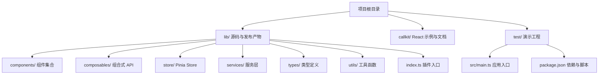
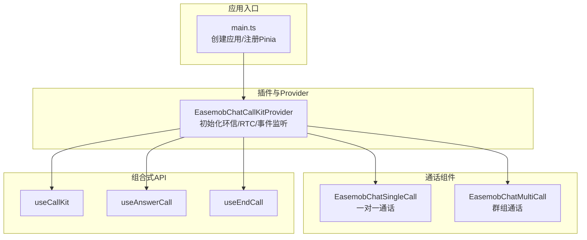
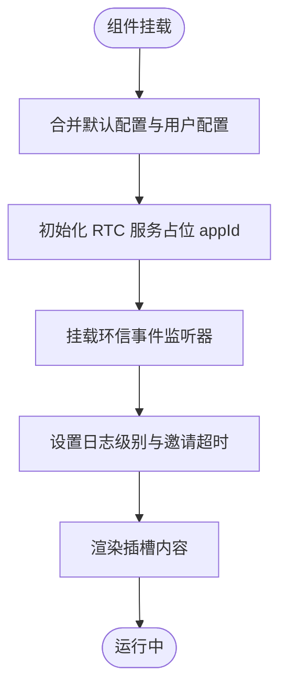
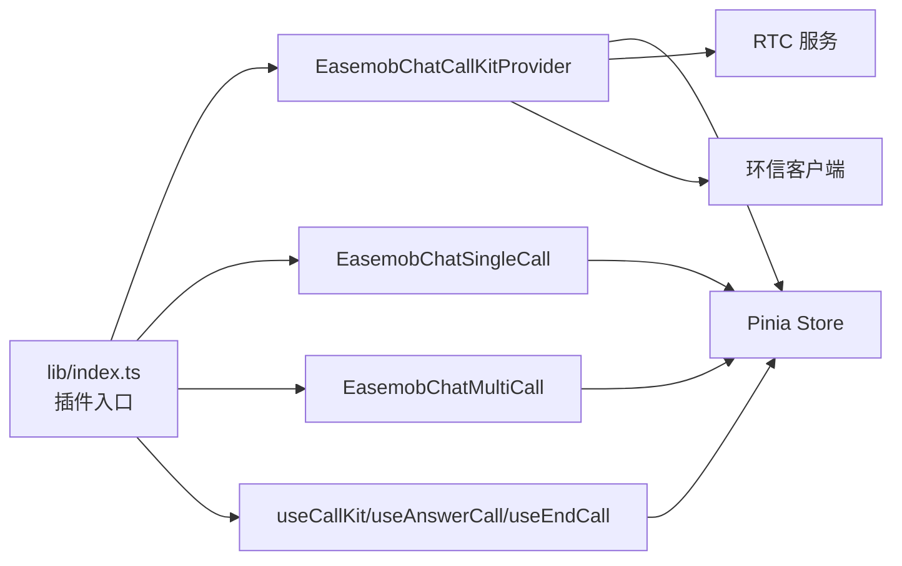

# 快速开始

<cite>
**本文档引用的文件**
- [README.md](file://README.md)
- [USAGE.md](file://USAGE.md)
- [package.json](file://package.json)
- [lib/index.ts](file://lib/index.ts)
- [lib/components/EasemobChatCallKitProvider.vue](file://lib/components/EasemobChatCallKitProvider.vue)
- [lib/components/singleCall/EasemobChatSingleCall.vue](file://lib/components/singleCall/EasemobChatSingleCall.vue)
- [lib/components/multiCall/EasemobChatMultiCall.vue](file://lib/components/multiCall/EasemobChatMultiCall.vue)
- [test/src/main.ts](file://test/src/main.ts)
- [test/package.json](file://test/package.json)
- [callkit/docs/quickstart.md](file://callkit/docs/quickstart.md)
</cite>

## 目录
1. [简介](#简介)
2. [项目结构](#项目结构)
3. [核心组件](#核心组件)
4. [架构总览](#架构总览)
5. [详细组件解析](#详细组件解析)
6. [依赖关系分析](#依赖关系分析)
7. [性能注意事项](#性能注意事项)
8. [故障排查指南](#故障排查指南)
9. [结论](#结论)
10. [附录](#附录)

## 简介
本指南面向希望在 Vue3 项目中快速集成 Easemob Chat CallKit Vue3 插件的开发者，覆盖安装方式（CDN、npm、源码）、Provider 组件的基础配置参数、在 Vue3 项目中的引入与初始化步骤，以及首个可运行示例的实现路径。文档同时提供常见问题的排查建议，帮助你在最短时间内成功运行示例。

## 项目结构
该仓库包含两套核心实现：
- lib/：Vue3 插件源码与发布产物，提供 Provider、单人/群组通话组件及组合式 API。
- callkit/：React 版本的 CallKit 文档与示例（可作为理解架构与流程的参考）。

此外，test/ 提供了演示工程，展示如何在真实项目中接入插件并切换“源码模式”和“tgz 包模式”。

图表来源
- [lib/index.ts](file://lib/index.ts#L1-L55)
- [README.md](file://README.md#L5-L31)

章节来源
- [README.md](file://README.md#L5-L31)
- [lib/index.ts](file://lib/index.ts#L1-L55)

## 核心组件
- Provider 组件：所有通话组件的上下文管理器，负责初始化环信客户端、RTC 服务、事件监听器与全局配置。
- 单人通话组件：封装一对一通话的 UI 与交互，支持最小化/展开。
- 群组通话组件：封装多人通话的 UI 与交互，支持成员邀请、主视频切换、音频轨道状态指示等。
- 组合式 API：如 useCallKit、useAnswerCall、useEndCall 等，便于在组件中以声明式方式控制通话生命周期。

章节来源
- [lib/components/EasemobChatCallKitProvider.vue](file://lib/components/EasemobChatCallKitProvider.vue#L1-L115)
- [lib/components/singleCall/EasemobChatSingleCall.vue](file://lib/components/singleCall/EasemobChatSingleCall.vue#L1-L134)
- [lib/components/multiCall/EasemobChatMultiCall.vue](file://lib/components/multiCall/EasemobChatMultiCall.vue#L1-L1035)
- [lib/index.ts](file://lib/index.ts#L17-L30)

## 架构总览
下图展示了在 Vue3 应用中集成插件的整体流程：应用入口引入插件与样式；根组件包裹 Provider 并注入环信客户端与声网 App ID；随后在路由视图中使用单人/群组通话组件或组合式 API 发起通话。

图表来源
- [test/src/main.ts](file://test/src/main.ts#L1-L10)
- [lib/components/EasemobChatCallKitProvider.vue](file://lib/components/EasemobChatCallKitProvider.vue#L1-L115)
- [lib/components/singleCall/EasemobChatSingleCall.vue](file://lib/components/singleCall/EasemobChatSingleCall.vue#L1-L134)
- [lib/components/multiCall/EasemobChatMultiCall.vue](file://lib/components/multiCall/EasemobChatMultiCall.vue#L1-L1035)
- [lib/index.ts](file://lib/index.ts#L17-L30)

## 详细组件解析

### Provider 组件（EasemobChatCallKitProvider）
- 作用：作为上下文容器，负责：
  - 合并默认配置与用户配置，形成全局 initConfig。
  - 初始化 RTC 服务（占位 appId，实际由信令动态下发）。
  - 挂载环信文本消息与信令监听器。
  - 设置日志级别与邀请超时等全局行为。
- 关键属性（Props）：
  - chatClient：环信 WebSDK 的 Connection 实例（必填）。
  - agoraAppId：声网 App ID（必填）。
  - initConfig：初始化配置对象（可选），包含 debug、enableRingtone、resizable、draggable、inviteTimeout 等。
- 生命周期：
  - 挂载后渲染插槽内容。
  - 卸载时销毁 RTC 服务。

图表来源
- [lib/components/EasemobChatCallKitProvider.vue](file://lib/components/EasemobChatCallKitProvider.vue#L19-L115)

章节来源
- [lib/components/EasemobChatCallKitProvider.vue](file://lib/components/EasemobChatCallKitProvider.vue#L1-L115)

### 单人通话组件（EasemobChatSingleCall）
- 作用：展示一对一通话界面，支持待接听状态与通话中状态，提供最小化/展开能力。
- 关键点：
  - 通过 Pinia store 管理通话状态（如 CALL_STATUS）。
  - 支持最小化窗口模式，展开后可恢复视频播放。
  - 提供事件发射（callStarted/callEnded/callCanceled）供父组件处理。

章节来源
- [lib/components/singleCall/EasemobChatSingleCall.vue](file://lib/components/singleCall/EasemobChatSingleCall.vue#L1-L134)

### 群组通话组件（EasemobChatMultiCall）
- 作用：展示群组通话界面，支持主视频/侧栏列表布局、成员邀请、音频轨道状态指示、远程用户订阅轮询等。
- 关键点：
  - 通过 store 管理通话时长、最小化状态、邀请成员列表等。
  - 提供成员列表弹窗与邀请流程，支持邀请超时管理。
  - 提供音频/视频开关、挂断等控制能力。

章节来源
- [lib/components/multiCall/EasemobChatMultiCall.vue](file://lib/components/multiCall/EasemobChatMultiCall.vue#L1-L1035)

### 组合式 API（useCallKit/useAnswerCall/useEndCall）
- 作用：以组合式方式在组件中控制通话生命周期，如发起单人/群组通话、接受/拒绝来电、挂断等。
- 适用场景：无需直接渲染通话 UI，仅需通过 API 控制通话流程。

章节来源
- [lib/index.ts](file://lib/index.ts#L17-L30)

## 依赖关系分析
- 插件入口导出 Provider、单人/群组通话组件、组合式 API、Store 与服务类。
- Provider 依赖环信客户端与声网 RTC 服务，负责初始化与事件监听。
- 组件内部依赖 Pinia Store 与组合式 API，实现状态管理与交互控制。

图表来源
- [lib/index.ts](file://lib/index.ts#L17-L30)
- [lib/components/EasemobChatCallKitProvider.vue](file://lib/components/EasemobChatCallKitProvider.vue#L1-L115)

章节来源
- [lib/index.ts](file://lib/index.ts#L17-L30)

## 性能注意事项
- Provider 在初始化时会创建 RTC 服务与事件监听器，应在应用根部尽早挂载，避免重复初始化。
- 组件内部对视频流渲染采用防抖与去重策略，避免频繁更新导致性能问题。
- 邀请超时与远程用户轮询机制有助于及时清理无效状态，减少资源占用。

## 故障排查指南
- 安装依赖顺序错误
  - 确保先安装环信 Web SDK、声网 RTC SDK、Pinia，再安装插件本身。
  - 参考：[安装与依赖](file://USAGE.md#L5-L14)
- Provider 缺少必要参数
  - 必须提供 chatClient 与 agoraAppId；initConfig 为可选但建议开启 debug 以便定位问题。
  - 参考：[Provider 配置](file://USAGE.md#L32-L56)
- 样式未生效
  - 确保引入插件样式文件（release/dist/easemob-chat-callkit-vue3.css）。
  - 参考：[全局注册与样式引入](file://USAGE.md#L16-L30)
- 通话无声音/无画面
  - 检查浏览器权限（麦克风/摄像头），并在生产环境使用 HTTPS。
  - 参考：[运行应用与常见问题](file://callkit/docs/quickstart.md#L602-L617)
- 演示工程模式切换
  - 若使用演示工程，可通过脚本在“源码模式”和“tgz 包模式”间切换，验证构建产物。
  - 参考：[README 中的测试与构建说明](file://README.md#L45-L111)

章节来源
- [USAGE.md](file://USAGE.md#L5-L14)
- [USAGE.md](file://USAGE.md#L16-L30)
- [USAGE.md](file://USAGE.md#L32-L56)
- [callkit/docs/quickstart.md](file://callkit/docs/quickstart.md#L602-L617)
- [README.md](file://README.md#L45-L111)

## 结论
通过 Provider 组件与单/群组通话组件的配合，结合组合式 API，你可以在 Vue3 项目中快速实现一对一与群组音视频通话功能。建议先在演示工程中验证环境与依赖，再在实际项目中按本文档的安装与配置步骤进行集成。

## 附录

### 安装方式与步骤
- npm 安装
  - 安装核心依赖与插件，参考：[安装与依赖](file://USAGE.md#L5-L14)
  - 在应用入口注册插件并引入样式，参考：[全局注册与样式引入](file://USAGE.md#L16-L30)
- CDN 引入
  - 可通过 CDN 引入插件与样式，再在应用入口中注册插件。
  - 注意：CDN 引入时需确保全局变量可用且样式文件路径正确。
- 源码引用
  - 在演示工程中，可通过切换模式加载 lib/ 源码或 tgz 构建产物，验证集成效果。
  - 参考：[README 中的测试与构建说明](file://README.md#L45-L111)

章节来源
- [USAGE.md](file://USAGE.md#L5-L14)
- [USAGE.md](file://USAGE.md#L16-L30)
- [README.md](file://README.md#L45-L111)

### 第一个可运行示例（步骤化）
- 准备工作
  - 确保已安装环信 Web SDK、声网 RTC SDK、Pinia 与插件。
  - 参考：[安装与依赖](file://USAGE.md#L5-L14)
- 在应用入口注册插件
  - 引入插件与样式，注册 Pinia，参考：[全局注册与样式引入](file://USAGE.md#L16-L30)
- 在根组件中放置 Provider
  - 传入 chatClient 与 agoraAppId，并设置 initConfig，参考：[Provider 配置](file://USAGE.md#L32-L56)
- 在路由视图中使用组件或组合式 API
  - 使用单人/群组通话组件，或通过 useCallKit 发起通话，参考：[核心功能用法](file://USAGE.md#L58-L136)
- 启动应用并授权权限
  - 在浏览器中访问页面，授权摄像头/麦克风等权限，参考：[运行应用与常见问题](file://callkit/docs/quickstart.md#L602-L617)

章节来源
- [USAGE.md](file://USAGE.md#L5-L14)
- [USAGE.md](file://USAGE.md#L16-L30)
- [USAGE.md](file://USAGE.md#L32-L56)
- [USAGE.md](file://USAGE.md#L58-L136)
- [callkit/docs/quickstart.md](file://callkit/docs/quickstart.md#L602-L617)