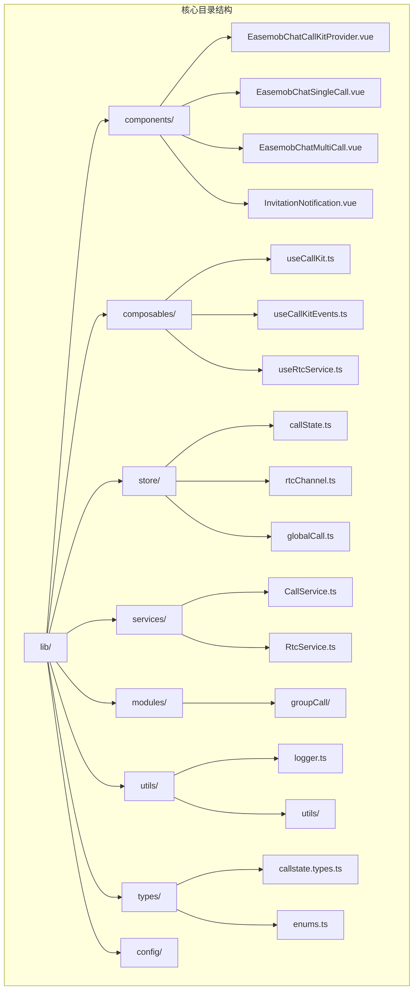
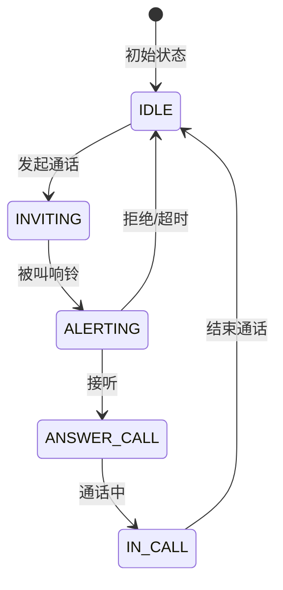

# 快速开始指南

<cite>
**本文档引用的文件**
- [QUICK_START.md](file://QUICK_START.md)
- [USAGE.md](file://USAGE.md)
- [package.json](file://package.json)
- [lib/index.ts](file://lib/index.ts)
- [lib/types.ts](file://lib/types.ts)
- [lib/components/EasemobChatCallKitProvider.vue](file://lib/components/EasemobChatCallKitProvider.vue)
- [lib/composables/useCallKit.ts](file://lib/composables/useCallKit.ts)
- [lib/store/callState.ts](file://lib/store/callState.ts)
- [lib/services/CallService.ts](file://lib/services/CallService.ts)
- [lib/utils/logger.ts](file://lib/utils/logger.ts)
- [vite.config.ts](file://vite.config.ts)
- [test/src/main.ts](file://test/src/main.ts)
</cite>

## 更新摘要
**变更内容**
- 更新了插件注册方式，现在可以直接使用`app.use(EasemobChatCallKit)`而无需手动配置Pinia
- 简化了安装步骤，移除了手动创建和注册Pinia的步骤
- 更新了示例代码以反映新的自动化Pinia注入机制

## 目录
1. [简介](#简介)
2. [项目结构](#项目结构)
3. [前置条件](#前置条件)
4. [安装步骤](#安装步骤)
5. [核心组件](#核心组件)
6. [通话控制](#通话控制)
7. [状态管理](#状态管理)
8. [事件监听](#事件监听)
9. [配置选项](#配置选项)
10. [常见问题](#常见问题)
11. [总结](#总结)

## 简介

Easemob Chat CallKit Vue3 是一个专为 Vue 3 应用设计的即时通讯通话解决方案。该库提供了完整的单人通话和群组通话功能，集成了环信 IM SDK 和声网 RTC SDK，为开发者提供了一站式的音视频通话集成方案。

**更新** 现在支持简化的插件注册方式，可以直接使用`app.use(EasemobChatCallKit)`而无需手动配置Pinia，大大简化了安装和配置流程。

本快速开始指南将帮助您在5分钟内完成 CallKit 的安装和基本配置，实现单人通话和群组通话的核心功能。

## 项目结构



**图表来源**
- [lib/index.ts:1-99](file://lib/index.ts#L1-L99)
- [lib/components/EasemobChatCallKitProvider.vue:1-151](file://lib/components/EasemobChatCallKitProvider.vue#L1-L151)

**章节来源**
- [lib/index.ts:1-99](file://lib/index.ts#L1-L99)
- [package.json:1-55](file://package.json#L1-L55)

## 前置条件

在开始使用 CallKit 之前，您需要准备以下环境和依赖：

### 必需依赖
- **Vue 3 项目**：确保您的项目已使用 Vue 3 框架
- **环信 IM SDK**：`easemob-websdk` 版本 ^4.16.0
- **声网 RTC SDK**：`agora-rtc-sdk-ng` 版本 ^4.24.2

### 安装命令
```bash
pnpm add vue easemob-websdk agora-rtc-sdk-ng
```

**章节来源**
- [QUICK_START.md:9-18](file://QUICK_START.md#L9-L18)
- [package.json:33-37](file://package.json#L33-L37)

## 安装步骤

### 步骤1：安装 CallKit 库

```bash
# 从 npm 安装（推荐）
pnpm add easemob-chat-callkit-vue3

# 或从本地 tgz 文件安装
pnpm add ./easemob-chat-callkit-vue3-1.0.0.tgz
```

### 步骤2：简化注册流程

**更新** 现在可以直接使用插件方式注册，无需手动配置Pinia：

```typescript
// main.ts
import { createApp } from 'vue'
import EasemobChatCallKit from 'easemob-chat-callkit-vue3'
import App from './App.vue'
import 'easemob-chat-callkit-vue3/style.css'

const app = createApp(App)
app.use(EasemobChatCallKit)
app.mount('#app')
```

**重要说明**：插件会自动检测并注入Pinia，如果应用中已有Pinia实例则不会重复创建。

**章节来源**
- [QUICK_START.md:22-46](file://QUICK_START.md#L22-L46)
- [test/src/main.ts:1-9](file://test/src/main.ts#L1-L9)
- [lib/index.ts:82-96](file://lib/index.ts#L82-L96)

## 核心组件

### Provider 组件

Provider 是所有 CallKit 组件的根容器，必须在应用顶层使用：

```vue
<template>
  <EasemobChatCallKitProvider :chat-client="chatClient">
    <!-- 你的应用内容 -->
    <router-view />
    
    <!-- 通话邀请通知 -->
    <InvitationNotification />
    
    <!-- 单人通话组件 -->
    <EasemobChatSingleCall />
    
    <!-- 群组通话组件 -->
    <EasemobChatMultiCall :group-id="groupId" />
  </EasemobChatCallKitProvider>
</template>
```

### 组件功能说明

| 组件 | 功能 | 自动显示/隐藏 |
|------|------|---------------|
| EasemobChatCallKitProvider | 通话根上下文组件 | ❌ |
| EasemobChatSingleCall | 单人通话界面 | ✅ |
| EasemobChatMultiCall | 群组通话界面 | ✅ |
| InvitationNotification | 通话邀请通知 | ✅ |
| EasemobChatMiniWindow | 最小化通话窗口 | ✅ |

**章节来源**
- [QUICK_START.md:50-81](file://QUICK_START.md#L50-L81)
- [USAGE.md:58-210](file://USAGE.md#L58-L210)

## 通话控制

### 使用 useCallKit Hook

CallKit 提供了一个统一的通话控制入口 `useCallKit`，包含所有通话相关的操作：

```vue
<script setup>
import { ref } from 'vue'
import { useCallKit } from 'easemob-chat-callkit-vue3'

const targetUserId = ref('')
const { call, groupCall, hangup } = useCallKit()

// 发起单人语音通话
const startAudio = async () => {
  await call({ targetId: targetUserId.value, type: 'audio' })
}

// 发起单人视频通话
const startVideo = async () => {
  await call({ targetId: targetUserId.value, type: 'video' })
}

// 发起群组通话
const startGroupCall = async () => {
  await groupCall({
    groupId: 'group001',
    members: ['user1', 'user2'],
    type: 'video',
    groupName: '产品组'
  })
}

// 结束通话
const endCall = async () => {
  await hangup()
}
</script>
```

### 通话参数说明

#### 单人通话参数
| 参数 | 类型 | 必填 | 说明 |
|------|------|------|------|
| targetId | string | ✅ | 目标用户 ID |
| type | 'audio' \| 'video' | ✅ | 通话类型 |
| msg | string | ❌ | 邀请消息 |
| userInfo | object | ❌ | 用户信息（昵称、头像） |

#### 群组通话参数
| 参数 | 类型 | 必填 | 说明 |
|------|------|------|------|
| groupId | string | ✅ | 群组 ID |
| members | string[] | ✅ | 成员列表 |
| type | 'audio' \| 'video' | ✅ | 通话类型 |
| msg | string | ❌ | 邀请消息 |
| groupName | string | ❌ | 群组名称 |
| userInfo | object | ❌ | 用户信息 |

**章节来源**
- [QUICK_START.md:85-143](file://QUICK_START.md#L85-L143)
- [lib/composables/useCallKit.ts:22-149](file://lib/composables/useCallKit.ts#L22-L149)

## 状态管理

### CallState Store

CallKit 使用 Pinia 管理通话状态，核心状态包括：

```typescript
// 核心状态字段
interface CallState {
  status: CALL_STATUS        // 当前通话状态
  callId: string            // 通话唯一标识
  channel: string           // RTC 频道
  token: string             // RTC Token
  type: CALL_TYPE           // 通话类型
  callerUserId: string      // 主叫用户ID
  calleeUserId: string      // 被叫用户ID
  inviteTimeout: number     // 邀请超时时间
  inviteTimeoutTimer: number|null // 超时定时器
}
```

### 通话状态流转



**图表来源**
- [lib/store/callState.ts:13-31](file://lib/store/callState.ts#L13-L31)
- [lib/store/callState.ts:112-136](file://lib/store/callState.ts#L112-L136)

**章节来源**
- [lib/store/callState.ts:1-215](file://lib/store/callState.ts#L1-L215)
- [USAGE.md:549-596](file://USAGE.md#L549-L596)

## 事件监听

### 使用 useCallKitEvents

CallKit 提供了完整的事件监听机制，可以监听通话生命周期中的各种事件：

```typescript
import { useCallKitEvents } from 'easemob-chat-callkit-vue3'
import { onUnmounted } from 'vue'

const { onCallStarted, onCallEnded, onIncomingCall } = useCallKitEvents()

// 监听通话开始
const unbindStarted = onCallStarted((event) => {
  console.log('通话开始:', event.callId)
})

// 监听通话结束
const unbindEnded = onCallEnded((event) => {
  const duration = Math.round(event.duration / 1000)
  console.log('通话结束，时长:', duration, '秒')
})

// 监听来电
const unbindIncoming = onIncomingCall((event) => {
  console.log('收到来电:', event.callerUserId)
})

// 组件卸载时解绑
onUnmounted(() => {
  unbindStarted()
  unbindEnded()
  unbindIncoming()
})
```

### 事件类型

| 事件名 | 触发时机 | 用途 |
|--------|----------|------|
| callStarted | 通话接通 | 发送系统消息、记录时长 |
| callEnded | 通话结束 | 清理资源、统计分析 |
| incomingCall | 收到来电邀请 | 显示通知、自动响铃 |
| callCanceled | 通话被取消 | 更新UI状态 |
| callRefused | 通话被拒绝 | 处理拒绝逻辑 |
| callTimeout | 通话超时 | 清理状态、提示用户 |
| callBusy | 对方忙线 | 提示用户稍后再试 |

**章节来源**
- [USAGE.md:379-474](file://USAGE.md#L379-L474)

## 配置选项

### Provider 配置

Provider 支持多种配置选项：

```typescript
const providerConfig = {
  chatClient: /* 环信客户端实例 */,
  agoraAppId: /* 声网 App ID */,
  initConfig: {
    debug: false,              // 调试模式
    logLevel: LogLevel.ERROR,  // 日志级别
    enableRingtone: true,      // 启用铃声
    resizable: true,           // 可调整大小
    draggable: true,           // 可拖拽
    inviteTimeout: 30000       // 邀请超时时间(ms)
  }
}
```

### 日志级别

| 级别 | 数值 | 说明 |
|------|------|------|
| ERROR | 0 | 错误日志 |
| WARN | 1 | 警告日志 |
| INFO | 2 | 信息日志 |
| DEBUG | 3 | 调试日志 |
| VERBOSE | 4 | 详细日志 |

**章节来源**
- [USAGE.md:80-91](file://USAGE.md#L80-L91)
- [lib/utils/logger.ts:1-200](file://lib/utils/logger.ts#L1-L200)

## 常见问题

### 1. 如何处理通话超时？

当被叫方在设定时间内没有接听，通话会自动超时：

```typescript
// 监听超时事件
const unbindTimeout = onCallTimeout(() => {
  console.log('通话超时')
  // 可以在这里添加超时处理逻辑
})
```

### 2. 如何获取用户信息？

CallKit 支持自定义用户信息提供者：

```typescript
// 自定义用户信息提供者
const getUserInfo = async (userIds: string[]) => {
  // 从自定义API获取用户信息
  const response = await fetch('/api/users', {
    method: 'POST',
    body: JSON.stringify({ userIds })
  })
  return response.json()
}

// 在 Provider 中注册
<EasemobChatCallKitProvider 
  :chat-client="chatClient"
  :get-user-info="getUserInfo"
/>
```

### 3. 如何自定义样式？

CallKit 提供了丰富的CSS变量和样式定制选项：

```css
/* 自定义通话背景 */
.easemob-callkit-single-call {
  --call-background-color: #f0f0f0;
  --call-button-color: #007aff;
}

/* 自定义尺寸 */
.easemob-callkit-single-call {
  width: 400px;
  height: 600px;
}
```

**章节来源**
- [lib/components/EasemobChatCallKitProvider.vue:124-138](file://lib/components/EasemobChatCallKitProvider.vue#L124-L138)

## 总结

通过以上步骤，您已经完成了 Easemob Chat CallKit Vue3 的基本配置和使用。**更新** 现在的安装流程更加简洁，主要变化如下：

1. **简化安装**：无需手动安装和配置Pinia，直接使用`app.use(EasemobChatCallKit)`即可
2. **自动Pinia注入**：插件会自动检测并注入Pinia实例，避免重复配置
3. **保持功能完整**：所有核心功能保持不变，包括通话控制、状态管理和事件监听

以下是关键要点：

1. **安装依赖**：确保 Vue 3、环信 IM SDK 和声网 RTC SDK 已正确安装
2. **简化注册**：使用`app.use(EasemobChatCallKit)`完成插件注册
3. **Provider 配置**：在应用顶层使用 EasemobChatCallKitProvider 包裹应用
4. **组件使用**：在合适的位置放置 InvitationNotification、EasemobChatSingleCall 和 EasemobChatMultiCall 组件
5. **通话控制**：使用 useCallKit hook 进行通话操作
6. **状态管理**：利用 Pinia store 管理通话状态
7. **事件监听**：通过 useCallKitEvents 监听通话生命周期事件

现在您可以开始在项目中集成音视频通话功能了。如需更详细的 API 说明，请参考完整的 [USAGE.md](./USAGE.md) 文档。

**章节来源**
- [QUICK_START.md:149-154](file://QUICK_START.md#L149-L154)
- [USAGE.md:1-800](file://USAGE.md#L1-L800)
- [lib/index.ts:82-96](file://lib/index.ts#L82-L96)