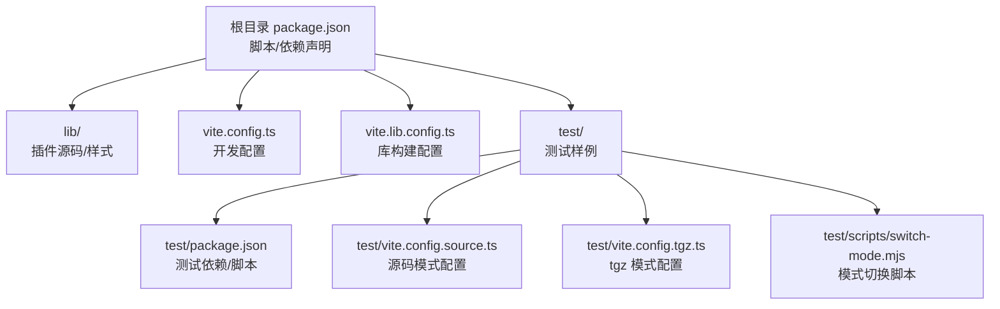
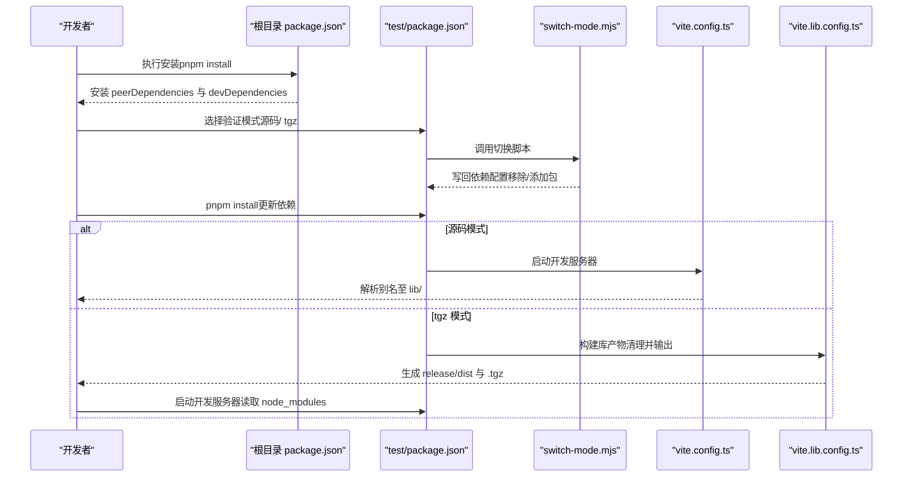
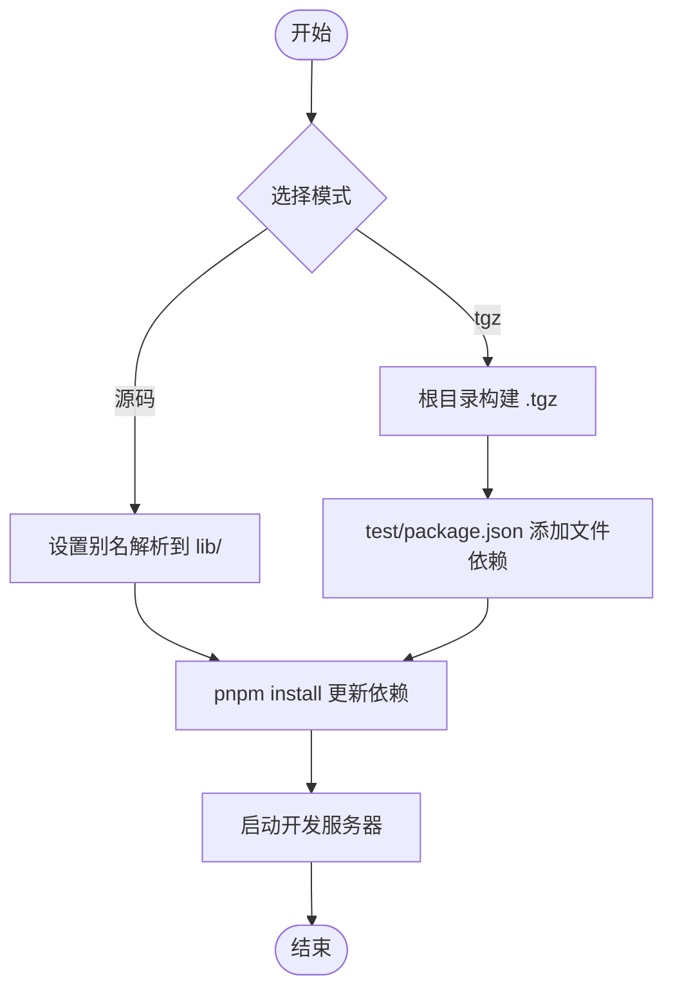
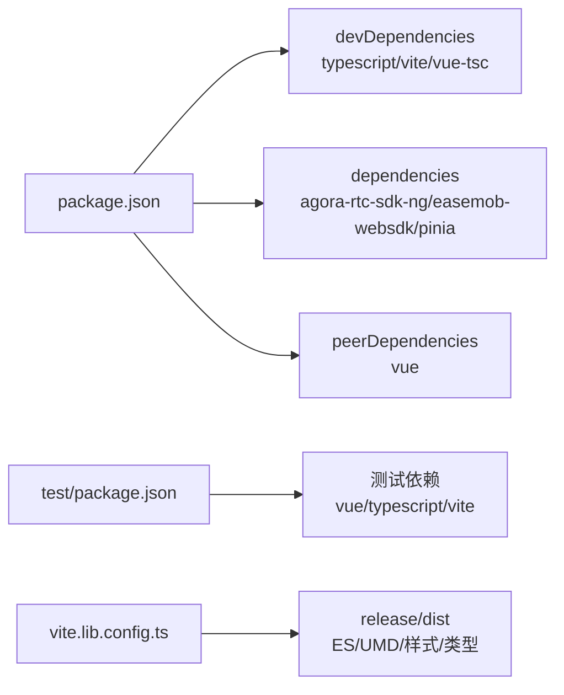

# 安装问题

<cite>
**本文引用的文件**
- [package.json](file://package.json)
- [pnpm-lock.yaml](file://pnpm-lock.yaml)
- [README.md](file://README.md)
- [USAGE.md](file://USAGE.md)
- [vite.config.ts](file://vite.config.ts)
- [vite.lib.config.ts](file://vite.lib.config.ts)
- [test/package.json](file://test/package.json)
- [test/vite.config.source.ts](file://test/vite.config.source.ts)
- [test/vite.config.tgz.ts](file://test/vite.config.tgz.ts)
- [test/scripts/switch-mode.mjs](file://test/scripts/switch-mode.mjs)
- [callkit/docs/common_issue.md](file://callkit/docs/common_issue.md)
</cite>

## 目录
1. [简介](#简介)
2. [项目结构](#项目结构)
3. [核心组件](#核心组件)
4. [架构总览](#架构总览)
5. [详细组件分析](#详细组件分析)
6. [依赖分析](#依赖分析)
7. [性能考量](#性能考量)
8. [故障排查指南](#故障排查指南)
9. [结论](#结论)
10. [附录](#附录)

## 简介
本指南聚焦于该 Vue3 CallKit 项目的安装与验证流程，覆盖常见安装失败场景（依赖冲突、版本不兼容、Node.js/包管理器问题、构建失败等），并提供针对不同操作系统与包管理器（pnpm、npm、yarn）的具体解决方案；同时给出验证安装结果的方法、常见错误信息解读与手动/替代安装路径，帮助初学者按步骤完成安装与排障。

## 项目结构
该项目采用“库 + 测试样例 + 构建配置”的组织方式：
- 根目录提供库构建与测试脚本
- lib/ 提供插件源码与样式
- test/ 提供两种验证模式（源码模式与 tgz 包模式）
- vite.config.ts 与 vite.lib.config.ts 分别用于开发与库构建
- package.json 声明了 peerDependencies、devDependencies、dependencies 与脚本

图表来源
- [package.json](file://package.json#L1-L53)
- [vite.config.ts](file://vite.config.ts#L1-L21)
- [vite.lib.config.ts](file://vite.lib.config.ts#L1-L68)
- [test/package.json](file://test/package.json#L1-L29)
- [test/vite.config.source.ts](file://test/vite.config.source.ts#L1-L25)
- [test/vite.config.tgz.ts](file://test.vite.config.tgz.ts#L1-L20)
- [test/scripts/switch-mode.mjs](file://test/scripts/switch-mode.mjs#L1-L57)

章节来源
- [package.json](file://package.json#L1-L53)
- [README.md](file://README.md#L1-L181)

## 核心组件
- 根依赖与脚本
  - package.json 声明了 peerDependencies（vue）、devDependencies（typescript、vite、vue-tsc 等）与 dependencies（agora-rtc-sdk-ng、easemob-websdk、pinia）；并提供 dev/build/test 等脚本。
- 测试与验证
  - test/package.json 定义了测试环境的依赖与脚本，支持源码模式与 tgz 模式切换。
  - switch-mode.mjs 负责在两种模式间切换并写回依赖配置。
- 构建与发布
  - vite.lib.config.ts 负责清理 release/dist 并输出 ES/UMD 产物，同时导出样式文件与类型声明。
- 开发体验
  - vite.config.ts 与 test 下的两套配置分别提供开发时的别名与模式切换能力。

章节来源
- [package.json](file://package.json#L23-L51)
- [test/package.json](file://test/package.json#L6-L27)
- [test/scripts/switch-mode.mjs](file://test/scripts/switch-mode.mjs#L29-L56)
- [vite.lib.config.ts](file://vite.lib.config.ts#L7-L67)
- [vite.config.ts](file://vite.config.ts#L6-L20)

## 架构总览
下图展示了安装与验证的整体流程：从根目录安装依赖，到选择源码或 tgz 模式，再到启动开发服务器与验证构建产物。

图表来源
- [package.json](file://package.json#L23-L51)
- [test/package.json](file://test/package.json#L6-L27)
- [test/scripts/switch-mode.mjs](file://test/scripts/switch-mode.mjs#L29-L56)
- [vite.config.ts](file://vite.config.ts#L6-L20)
- [vite.lib.config.ts](file://vite.lib.config.ts#L7-L67)

## 详细组件分析

### 组件 A：安装与依赖管理
- 核心依赖
  - peerDependencies：vue（要求宿主项目已安装）
  - dependencies：agora-rtc-sdk-ng、easemob-websdk、pinia
  - devDependencies：typescript、vite、vue-tsc、@vitejs/plugin-vue、vite-plugin-dts 等
- 版本约束
  - Vite 与 @vitejs/plugin-vue 对 Node 版本有要求（参见锁文件中的引擎字段）
  - Vue 与 TypeScript 版本在 peerDependencies 与 devDependencies 中保持一致
- 锁文件与缓存
  - pnpm-lock.yaml 记录了完整依赖树与完整性校验，避免跨平台差异导致的安装不稳定

章节来源
- [package.json](file://package.json#L33-L51)
- [pnpm-lock.yaml](file://pnpm-lock.yaml#L3-L44)

### 组件 B：测试与验证模式
- 源码模式
  - 通过别名将 easemob-chat-callkit-vue3 指向 lib/，便于开发调试
  - 切换脚本会移除 tgz 依赖并安装源码依赖
- tgz 模式
  - 通过文件依赖指向打包好的 .tgz 文件，模拟真实用户安装场景
  - 需先在根目录执行构建，再在 test 目录安装 .tgz

图表来源
- [test/vite.config.source.ts](file://test/vite.config.source.ts#L13-L22)
- [test/vite.config.tgz.ts](file://test/vite.config.tgz.ts#L13-L18)
- [test/scripts/switch-mode.mjs](file://test/scripts/switch-mode.mjs#L29-L56)
- [vite.lib.config.ts](file://vite.lib.config.ts#L7-L21)

章节来源
- [test/package.json](file://test/package.json#L6-L27)
- [test/vite.config.source.ts](file://test/vite.config.source.ts#L1-L25)
- [test/vite.config.tgz.ts](file://test.vite.config.tgz.ts#L1-L20)
- [test/scripts/switch-mode.mjs](file://test/scripts/switch-mode.mjs#L1-L57)

### 组件 C：构建与发布
- 清理策略
  - 构建前自动删除 release/dist 并重建，确保产物干净
- 输出产物
  - ES 与 UMD 两种格式，样式文件单独输出
  - 自动生成类型声明与入口
- 发布前验证
  - 通过 test:tgz 验证打包产物在真实依赖场景下的可用性

章节来源
- [vite.lib.config.ts](file://vite.lib.config.ts#L7-L67)
- [README.md](file://README.md#L167-L181)

## 依赖分析
- 耦合关系
  - 根 package.json 与 test/package.json 通过脚本与模式切换耦合
  - 构建配置与发布产物通过 release/dist 与 .tgz 形成闭环
- 外部依赖
  - Vue 与 TypeScript 版本需与 devDependencies 保持一致
  - Vite 与 @vitejs/plugin-vue 对 Node 版本有明确要求（参见锁文件引擎字段）

图表来源
- [package.json](file://package.json#L36-L51)
- [test/package.json](file://test/package.json#L15-L27)
- [vite.lib.config.ts](file://vite.lib.config.ts#L37-L61)

章节来源
- [package.json](file://package.json#L36-L51)
- [test/package.json](file://test/package.json#L15-L27)
- [pnpm-lock.yaml](file://pnpm-lock.yaml#L3-L44)

## 性能考量
- 依赖体积与安装时间
  - 通过 pnpm 锁定版本与缓存可减少重复下载
  - 构建阶段仅输出必要产物，避免冗余资源
- 开发体验
  - 源码模式下热更新更快，适合频繁改动
  - tgz 模式更贴近真实安装，有助于提前发现兼容问题

## 故障排查指南

### 一、通用安装失败场景与步骤
- 场景 1：安装依赖时报错（跨平台/权限/网络）
  - 步骤
    - 清理缓存与锁文件后重试（例如 pnpm store prune）
    - 更换镜像源或代理
    - 确认 Node 版本满足 Vite/@vitejs/plugin-vue 的引擎要求
  - 验证
    - 查看 pnpm-lock.yaml 中各包的 engines 字段
    - 在本地执行 pnpm install 成功后，再执行根目录脚本

- 场景 2：源码模式无法解析包
  - 步骤
    - 确认已执行切换脚本并安装依赖
    - 检查 vite.config.ts 与 test/vite.config.source.ts 的别名配置是否正确
  - 验证
    - 启动开发服务器后，浏览器控制台不再出现模块解析错误

- 场景 3：tgz 模式找不到包
  - 步骤
    - 先在根目录执行构建，生成 .tgz
    - 在 test 目录执行切换脚本，确保依赖写回
    - 再次安装依赖
  - 验证
    - test/node_modules 中存在对应包，开发服务器可正常启动

- 场景 4：构建失败（release/dist 为空或样式缺失）
  - 步骤
    - 确认构建前清理逻辑已执行
    - 检查 rollupOptions.external 与样式输出配置
  - 验证
    - release/dist 存在 index.js/umd.js 与 easemob-chat-callkit-vue3.css

- 场景 5：Node.js 版本不兼容
  - 现象
    - 安装时报引擎版本不匹配
  - 步骤
    - 升级 Node 至满足 Vite 与相关插件要求的版本
  - 验证
    - pnpm install 成功，开发服务器可启动

- 场景 6：包管理器选择与兼容性
  - pnpm（推荐）
    - 与锁文件配合最佳，安装稳定
  - npm/yarn
    - 若必须使用 npm/yarn，建议先用 pnpm 生成锁文件，再在 CI 中统一使用 pnpm

章节来源
- [test/scripts/switch-mode.mjs](file://test/scripts/switch-mode.mjs#L29-L56)
- [vite.config.ts](file://vite.config.ts#L6-L20)
- [vite.lib.config.ts](file://vite.lib.config.ts#L7-L67)
- [pnpm-lock.yaml](file://pnpm-lock.yaml#L3-L44)

### 二、常见错误信息与解读
- “找不到模块”或“无法解析别名”
  - 可能原因：未执行切换脚本或未安装依赖
  - 解决：执行切换脚本并安装依赖；检查别名配置
- “Node 版本过低”
  - 可能原因：Node 版本低于 Vite/@vitejs/plugin-vue 要求
  - 解决：升级 Node 至满足引擎要求的版本
- “找不到 .tgz 文件”
  - 可能原因：未先构建 .tgz
  - 解决：先在根目录执行构建，再切换到 tgz 模式
- “样式未生效”
  - 可能原因：未引入样式或样式输出路径不正确
  - 解决：确认样式导入路径与构建输出一致

章节来源
- [test/scripts/switch-mode.mjs](file://test/scripts/switch-mode.mjs#L40-L46)
- [vite.lib.config.ts](file://vite.lib.config.ts#L53-L58)

### 三、验证安装结果的方法
- 验证依赖安装
  - 检查 node_modules 是否存在关键依赖（vue、pinia、agora-rtc-sdk-ng、easemob-websdk）
  - 检查 package.json 的 peerDependencies 是否与宿主项目一致
- 验证构建产物
  - 检查 release/dist 是否包含 ES/UMD 产物与样式文件
  - 检查类型声明文件是否存在
- 验证开发服务器
  - 源码模式：访问本地地址，确认页面可正常加载
  - tgz 模式：确认依赖来自 node_modules 中的 .tgz 包

章节来源
- [vite.lib.config.ts](file://vite.lib.config.ts#L37-L61)
- [README.md](file://README.md#L74-L79)

### 四、手动安装与替代方案
- 手动安装
  - 在根目录执行 pnpm install 安装所有依赖
  - 在 test 目录执行 pnpm install 安装测试依赖
- 替代方案
  - 使用 pnpm store prune 清理缓存后重试
  - 使用 pnpm install --frozen-lockfile 严格遵循锁文件
  - 在 CI 环境统一使用 pnpm，避免 npm/yarn 的差异

章节来源
- [package.json](file://package.json#L23-L32)
- [test/package.json](file://test/package.json#L6-L13)

### 五、面向初学者的逐步故障排除流程
- 第一步：确认 Node 版本满足要求
  - 参考 pnpm-lock.yaml 中各包的 engines 字段
- 第二步：在根目录安装依赖
  - 执行 pnpm install
- 第三步：选择验证模式
  - 源码模式：执行 pnpm run test 或 pnpm run test:source
  - tgz 模式：先执行 pnpm run build:pack，再执行 pnpm run test:tgz
- 第四步：检查开发服务器
  - 访问本地地址，确认页面可加载
- 第五步：查看控制台与日志
  - 关注模块解析错误、样式缺失、权限提示等

章节来源
- [README.md](file://README.md#L33-L79)
- [pnpm-lock.yaml](file://pnpm-lock.yaml#L3-L44)

## 结论
本指南围绕该 Vue3 CallKit 项目的安装与验证提供了系统化的排查方法与实践步骤。通过理解依赖关系、掌握源码/ tgz 两种验证模式、关注 Node 版本与包管理器兼容性，以及遵循验证安装结果的标准流程，可有效降低安装失败率并提升开发效率。

## 附录
- 相关文档与参考
  - 安装与使用说明：参见 USAGE.md
  - 常见问题：参见 callkit/docs/common_issue.md
  - 快速开始与环境要求：参见 callkit/docs/quickstart.md

章节来源
- [USAGE.md](file://USAGE.md#L5-L12)
- [callkit/docs/common_issue.md](file://callkit/docs/common_issue.md#L1-L28)
- [callkit/docs/quickstart.md](file://callkit/docs/quickstart.md#L5-L14)