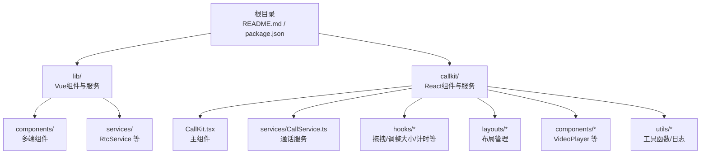
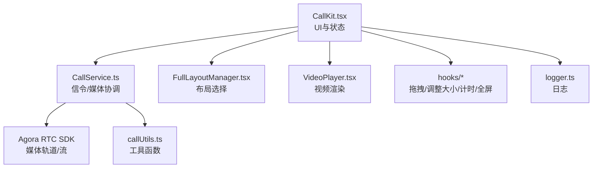
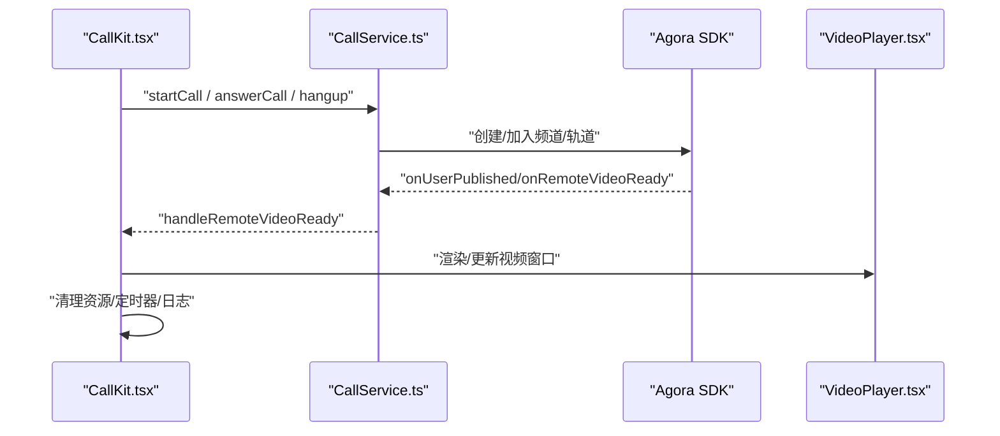
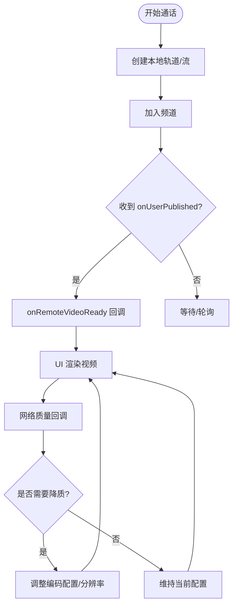
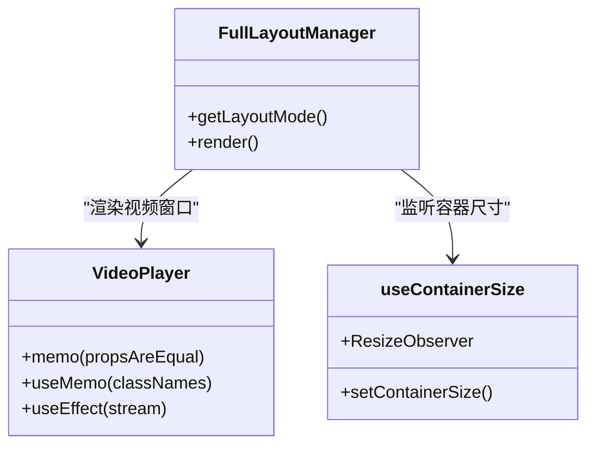
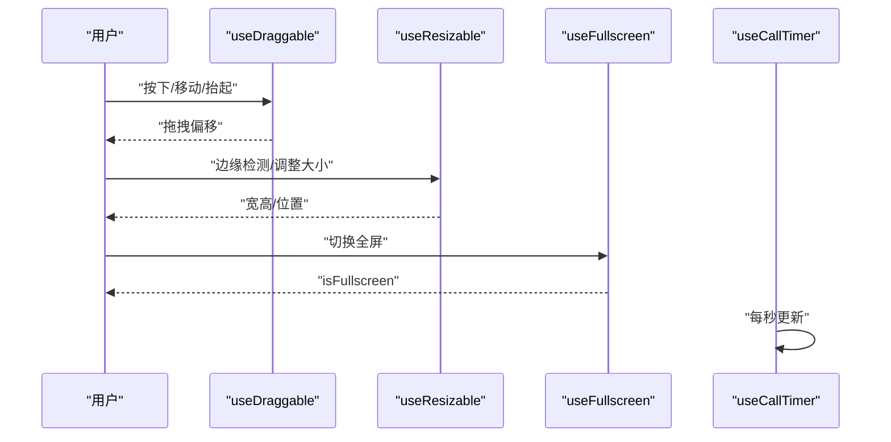
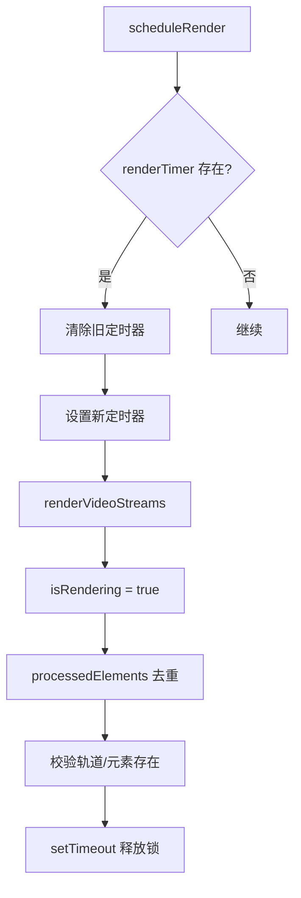
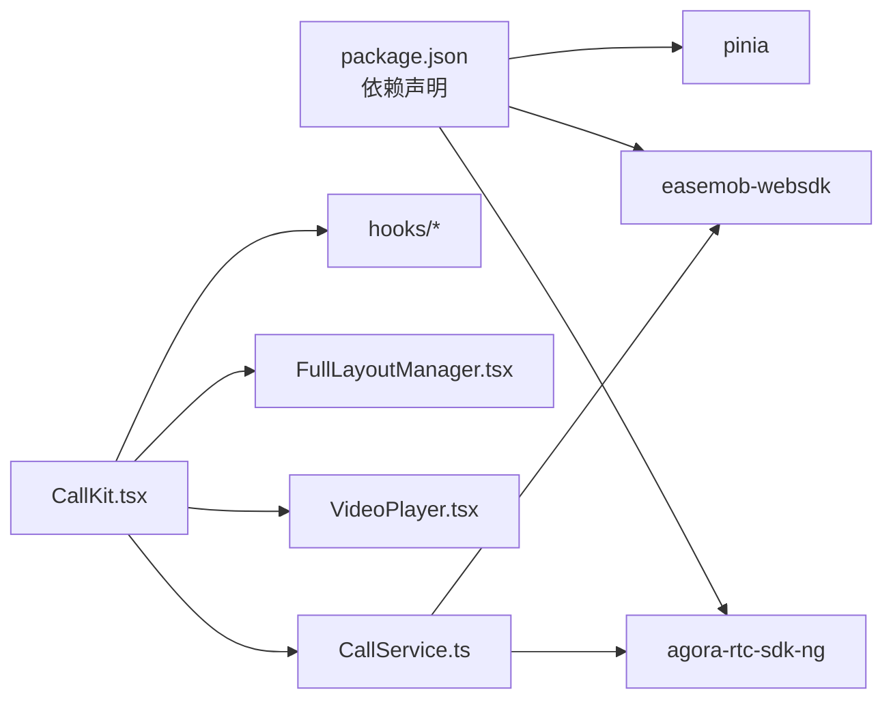

# 性能问题

<cite>
**本文引用的文件**
- [README.md](file://README.md)
- [package.json](file://package.json)
- [CallKit.tsx](file://callkit/CallKit.tsx)
- [CallService.ts](file://callkit/services/CallService.ts)
- [logger.ts](file://callkit/utils/logger.ts)
- [useCallTimer.ts](file://callkit/hooks/useCallTimer.ts)
- [useContainerSize.ts](file://callkit/hooks/useContainerSize.ts)
- [useDraggable.ts](file://callkit/hooks/useDraggable.ts)
- [useResizable.ts](file://callkit/hooks/useResizable.ts)
- [useFullscreen.ts](file://callkit/hooks/useFullscreen.ts)
- [FullLayoutManager.tsx](file://callkit/layouts/FullLayoutManager.tsx)
- [VideoPlayer.tsx](file://callkit/components/VideoPlayer.tsx)
- [callUtils.ts](file://callkit/utils/callUtils.ts)
- [EasemobChatMultiCall.vue](file://lib/components/multiCall/EasemobChatMultiCall.vue)
- [RtcService.ts](file://lib/services/RtcService.ts)
</cite>

## 目录
1. [简介](#简介)
2. [项目结构](#项目结构)
3. [核心组件](#核心组件)
4. [架构总览](#架构总览)
5. [详细组件分析](#详细组件分析)
6. [依赖关系分析](#依赖关系分析)
7. [性能考量](#性能考量)
8. [故障排查指南](#故障排查指南)
9. [结论](#结论)
10. [附录](#附录)

## 简介
本指南聚焦于音视频通话组件在运行过程中的性能问题诊断与优化，覆盖以下方面：
- 常见性能瓶颈：卡顿、延迟高、CPU 占用异常、内存泄漏
- 性能监控指标与测量方法
- 渲染性能优化：减少不必要重渲染、优化状态更新频率
- 网络优化策略、音视频质量调节、设备资源管理
- 性能分析工具使用与最佳实践

## 项目结构
该项目采用模块化组织，核心位于 callkit 目录，提供 Vue3 插件形态；lib 目录提供基于 Vue 的组件与服务封装，便于在业务工程中直接使用。

图表来源
- [README.md](file://README.md#L5-L31)
- [package.json](file://package.json#L1-L53)

章节来源
- [README.md](file://README.md#L5-L31)
- [package.json](file://package.json#L1-L53)

## 核心组件
- 主组件与状态管理：CallKit.tsx 负责通话生命周期、UI 状态、邀请与计时、日志开关等，并通过 CallService 协调底层信令与媒体。
- 通话服务：CallService.ts 封装 Agora RTC 客户端、媒体轨道创建与销毁、网络质量回调、铃声播放、邀请发送与接听流程。
- 渲染与布局：FullLayoutManager.tsx 根据通话模式与状态选择不同布局；VideoPlayer.tsx 通过浅比较与 memo 降低重渲染。
- 交互与性能钩子：useDraggable/useResizable/useFullscreen/useCallTimer/useContainerSize 提供拖拽、调整大小、全屏、计时与容器尺寸监听，避免频繁重排与事件风暴。
- 工具与日志：logger.ts 提供可配置的日志等级与前缀；callUtils.ts 提供格式化、头像获取、安全位置计算等。

章节来源
- [CallKit.tsx](file://callkit/CallKit.tsx#L1-L800)
- [CallService.ts](file://callkit/services/CallService.ts#L1-L800)
- [FullLayoutManager.tsx](file://callkit/layouts/FullLayoutManager.tsx#L1-L158)
- [VideoPlayer.tsx](file://callkit/components/VideoPlayer.tsx#L1-L104)
- [useDraggable.ts](file://callkit/hooks/useDraggable.ts#L1-L291)
- [useResizable.ts](file://callkit/hooks/useResizable.ts#L1-L603)
- [useFullscreen.ts](file://callkit/hooks/useFullscreen.ts#L1-L82)
- [useCallTimer.ts](file://callkit/hooks/useCallTimer.ts#L1-L50)
- [useContainerSize.ts](file://callkit/hooks/useContainerSize.ts#L1-L35)
- [logger.ts](file://callkit/utils/logger.ts#L1-L181)
- [callUtils.ts](file://callkit/utils/callUtils.ts#L1-L85)

## 架构总览
整体架构围绕“UI 组件 + 服务层 + 媒体引擎”的分层设计，UI 通过 CallService 抽象与 Agora 通信，服务层负责状态机与资源管理，媒体层负责轨道与流的生命周期。

图表来源
- [CallKit.tsx](file://callkit/CallKit.tsx#L1-L800)
- [CallService.ts](file://callkit/services/CallService.ts#L1-L800)
- [FullLayoutManager.tsx](file://callkit/layouts/FullLayoutManager.tsx#L1-L158)
- [VideoPlayer.tsx](file://callkit/components/VideoPlayer.tsx#L1-L104)
- [logger.ts](file://callkit/utils/logger.ts#L1-L181)
- [callUtils.ts](file://callkit/utils/callUtils.ts#L1-L85)

## 详细组件分析

### CallKit 主组件（性能相关要点）
- 状态收敛与引用更新：通过 useRef 存储关键布尔状态，避免闭包陷阱导致的重渲染；在 effect 中同步更新，保证回调读取最新值。
- 计时器管理：useCallTimer 提供秒级计时，组件卸载时自动清理，避免内存泄漏。
- 邀请与超时：邀请定时器集合与清理，防止重复定时器与泄漏。
- 日志开关：按需开启/关闭日志与级别，避免生产环境冗余输出影响性能。
- 视频窗口合并与去重：在处理远端视频就绪时，对本地/远端窗口进行合并与去重，避免重复渲染。
- 网络质量回调：聚合 uplink/downlink 质量，避免抖动导致的频繁重渲染。
- 资源清理：通话结束时清理 video 元素的 srcObject、移除 data-* 属性，防止悬挂引用。

图表来源
- [CallKit.tsx](file://callkit/CallKit.tsx#L319-L426)
- [CallService.ts](file://callkit/services/CallService.ts#L345-L527)
- [VideoPlayer.tsx](file://callkit/components/VideoPlayer.tsx#L34-L99)

章节来源
- [CallKit.tsx](file://callkit/CallKit.tsx#L175-L426)
- [useCallTimer.ts](file://callkit/hooks/useCallTimer.ts#L1-L50)

### CallService 服务（媒体与资源管理）
- 轨道与流缓存：本地/远端视频轨道与 MediaStream 缓存，避免重复创建与抖动。
- 设备 ID 管理：保存当前摄像头设备 ID，切换摄像头时复用设备，兼容部分 Android 设备。
- 邀请超时与状态机：邀请超时自动挂断，避免僵尸连接。
- 网络质量回调：透传 uplink/downlink 质量，供 UI 侧做降分辨率/降帧率决策。
- 铃声播放：异步初始化与播放/停止，避免阻塞主线程。
- 错误上报：统一错误类型与消息，便于上层定位。

图表来源
- [CallService.ts](file://callkit/services/CallService.ts#L221-L3330)
- [callUtils.ts](file://callkit/utils/callUtils.ts#L25-L32)

章节来源
- [CallService.ts](file://callkit/services/CallService.ts#L116-L285)
- [CallService.ts](file://callkit/services/CallService.ts#L2769-L2800)
- [CallService.ts](file://callkit/services/CallService.ts#L2887-L2914)
- [CallService.ts](file://callkit/services/CallService.ts#L3041-L3068)
- [CallService.ts](file://callkit/services/CallService.ts#L3296-L3330)

### 布局与渲染（减少重渲染）
- FullLayoutManager：根据最小化、预览、群组/1v1 等模式选择布局，避免不必要的 DOM 重建。
- VideoPlayer：浅比较 props，仅在 stream 真正变化时重渲染，镜像本地视频样式通过 useMemo 缓存。
- ResizeObserver：useContainerSize 监听容器尺寸变化，避免频繁的 window resize 事件风暴。

图表来源
- [FullLayoutManager.tsx](file://callkit/layouts/FullLayoutManager.tsx#L16-L157)
- [VideoPlayer.tsx](file://callkit/components/VideoPlayer.tsx#L15-L99)
- [useContainerSize.ts](file://callkit/hooks/useContainerSize.ts#L1-L35)

章节来源
- [FullLayoutManager.tsx](file://callkit/layouts/FullLayoutManager.tsx#L16-L157)
- [VideoPlayer.tsx](file://callkit/components/VideoPlayer.tsx#L15-L99)
- [useContainerSize.ts](file://callkit/hooks/useContainerSize.ts#L1-L35)

### 交互与性能钩子（拖拽/调整大小/全屏/计时）
- useDraggable/useResizable：分离拖拽与调整大小事件，避免相互干扰；通过 data-* 属性与 CSS 光标控制，减少样式冲突。
- useFullscreen：跨浏览器全屏 API 封装，监听 fullscreenchange 并更新状态。
- useCallTimer：秒级计时，组件卸载时清理，避免泄漏。

图表来源
- [useDraggable.ts](file://callkit/hooks/useDraggable.ts#L83-L225)
- [useResizable.ts](file://callkit/hooks/useResizable.ts#L401-L516)
- [useFullscreen.ts](file://callkit/hooks/useFullscreen.ts#L11-L73)
- [useCallTimer.ts](file://callkit/hooks/useCallTimer.ts#L9-L35)

章节来源
- [useDraggable.ts](file://callkit/hooks/useDraggable.ts#L1-L291)
- [useResizable.ts](file://callkit/hooks/useResizable.ts#L1-L603)
- [useFullscreen.ts](file://callkit/hooks/useFullscreen.ts#L1-L82)
- [useCallTimer.ts](file://callkit/hooks/useCallTimer.ts#L1-L50)

### 多端组件与视频渲染（lib/components/multiCall）
- 防抖渲染：scheduleRender + isRendering 防止并发渲染导致的重复设置与闪烁。
- 去重渲染：processedElements 集合避免同一 video 元素重复处理。
- 轨道存在性校验：远程视频轨道不存在时记录日志，避免空引用。
- 渲染完成释放锁：setTimeout 延迟释放渲染锁，平滑后续变更。

图表来源
- [EasemobChatMultiCall.vue](file://lib/components/multiCall/EasemobChatMultiCall.vue#L340-L370)
- [EasemobChatMultiCall.vue](file://lib/components/multiCall/EasemobChatMultiCall.vue#L459-L602)

章节来源
- [EasemobChatMultiCall.vue](file://lib/components/multiCall/EasemobChatMultiCall.vue#L340-L602)

### 日志与监控（logger）
- 可配置日志级别与前缀，生产环境建议仅保留 error/warn。
- 提供便捷方法：logError/logWarn/logInfo/logDebug/logVerbose，便于在关键路径埋点。

章节来源
- [logger.ts](file://callkit/utils/logger.ts#L1-L181)

## 依赖关系分析
- 外部依赖：agora-rtc-sdk-ng、easemob-websdk、pinia（Vue Store）。
- 组件耦合：CallKit 与 CallService 解耦，通过回调与事件驱动；布局与视频渲染通过 props 传递，降低耦合。
- 资源依赖：媒体轨道与流的生命周期由 CallService 统一管理，UI 仅负责消费状态。

图表来源
- [package.json](file://package.json#L47-L51)
- [CallKit.tsx](file://callkit/CallKit.tsx#L1-L800)
- [CallService.ts](file://callkit/services/CallService.ts#L1-L800)

章节来源
- [package.json](file://package.json#L47-L51)
- [CallKit.tsx](file://callkit/CallKit.tsx#L1-L800)
- [CallService.ts](file://callkit/services/CallService.ts#L1-L800)

## 性能考量

### 常见性能瓶颈与定位
- 音视频卡顿
  - 现象：画面撕裂、掉帧、声音断续
  - 可能原因：轨道重复创建、渲染线程阻塞、分辨率/帧率过高、网络波动
  - 定位手段：网络质量回调、日志级别提升、帧率/码率统计
- 延迟过高
  - 现象：按键延迟、通话建立慢、邀请超时
  - 可能原因：信令通道拥塞、媒体协商耗时、设备初始化慢
  - 定位手段：统计 startCall 至 connected 时间、设备初始化耗时
- CPU 占用异常
  - 现象：发热、风扇转速升高、电量消耗快
  - 可能原因：高频重渲染、定时器泄漏、媒体轨道未释放
  - 定位手段：Profiler 截图、事件监听器数量、轨道引用计数
- 内存泄漏
  - 现象：内存持续增长、GC 后不回落
  - 可能原因：定时器未清理、事件监听器未移除、video.srcObject 未置空
  - 定位手段：Heap Snapshot、WeakRef/FinalizationRegistry 辅助

### 性能监控指标与测量方法
- 网络质量
  - 指标：上行/下行网络等级、丢包率、抖动
  - 来源：CallService 网络质量回调
- 媒体质量
  - 指标：轨道帧率、分辨率、码率、解码失败次数
  - 方法：Agora SDK 提供的统计接口（可在服务层扩展）
- UI 渲染
  - 指标：重渲染次数、首屏时间、交互响应时间
  - 方法：React DevTools Profiler、Performance API
- 资源占用
  - 指标：CPU 百分比、内存使用、GPU 占用
  - 方法：浏览器任务管理器、Chrome DevTools Memory/Performance 面板

### 渲染性能优化
- 减少不必要重渲染
  - 使用 React.memo 与浅比较（VideoPlayer 已实现）
  - 使用 useMemo 缓存计算结果（VideoPlayer 类名拼接）
  - 使用 useRef 存储状态引用，避免闭包陷阱
- 优化状态更新频率
  - 使用节流/防抖（scheduleRender 已实现）
  - 合并多次状态变更（CallKit 中合并视频窗口更新）
- 布局与事件
  - 使用 ResizeObserver 替代 window resize
  - 分离拖拽与调整大小事件，避免互相干扰

### 网络优化策略
- 信令与媒体分离
  - 信令走 WebIM，媒体走 Agora，降低耦合
- 动态质量调节
  - 根据网络质量回调动态调整编码配置（分辨率/帧率）
- 邀请超时与重试
  - 合理设置邀请超时，避免僵尸连接

### 音视频质量调节
- 编码配置
  - 通过 encoderConfig 控制分辨率与码率
- 设备管理
  - 保存摄像头设备 ID，切换时复用设备
- 音量指示
  - 通过 speakingVolumeThreshold 控制说话检测灵敏度

### 设备资源管理
- 轨道生命周期
  - 创建/销毁成对出现，避免泄漏
- 视频元素
  - 清理 video.srcObject，移除 data-* 属性
- 全屏与窗口
  - 全屏切换时避免重复注册事件监听

## 故障排查指南
- 无法创建本地视频轨道
  - 现象：预览/本地视频黑屏
  - 排查：检查设备权限、encoderConfig、设备 ID 保存与复用
- 远端视频轨道缺失
  - 现象：远端用户无画面
  - 排查：确认 onUserPublished 回调、轨道存在性、渲染锁状态
- 邀请超时未挂断
  - 现象：邀请界面停留
  - 排查：定时器集合、清理逻辑、状态同步
- 全屏失败
  - 现象：全屏 API 报错
  - 排查：浏览器兼容性、用户手势要求
- 日志过多影响性能
  - 现象：主线程阻塞
  - 排查：降低日志级别、关闭前缀输出

章节来源
- [CallService.ts](file://callkit/services/CallService.ts#L2769-L2800)
- [CallService.ts](file://callkit/services/CallService.ts#L2887-L2914)
- [CallService.ts](file://callkit/services/CallService.ts#L3041-L3068)
- [CallService.ts](file://callkit/services/CallService.ts#L3296-L3330)
- [EasemobChatMultiCall.vue](file://lib/components/multiCall/EasemobChatMultiCall.vue#L459-L602)
- [useFullscreen.ts](file://callkit/hooks/useFullscreen.ts#L11-L73)
- [logger.ts](file://callkit/utils/logger.ts#L64-L86)

## 结论
通过在服务层统一管理媒体轨道与状态机、在 UI 层采用浅比较与去重渲染、在交互层分离事件与优化光标控制，项目在复杂多端场景下具备良好的性能可维护性。建议在生产环境中：
- 严格控制日志级别
- 基于网络质量回调动态调节编码参数
- 使用防抖/去重策略处理视频渲染
- 完善资源清理与泄漏检测

## 附录
- 性能分析工具
  - Chrome DevTools：Performance/Memory/Profiler
  - React DevTools：Profiler 分析重渲染
  - Heap Snapshot：定位内存泄漏
- 最佳实践清单
  - 仅在必要时更新状态
  - 使用 memo 与 useMemo
  - 合理使用 ResizeObserver
  - 清理定时器与事件监听器
  - 保存并复用设备 ID