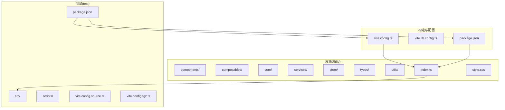
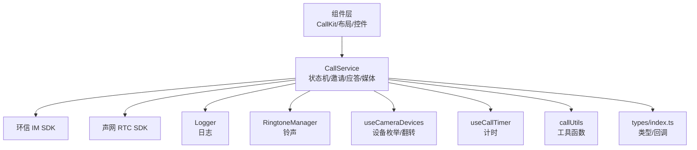
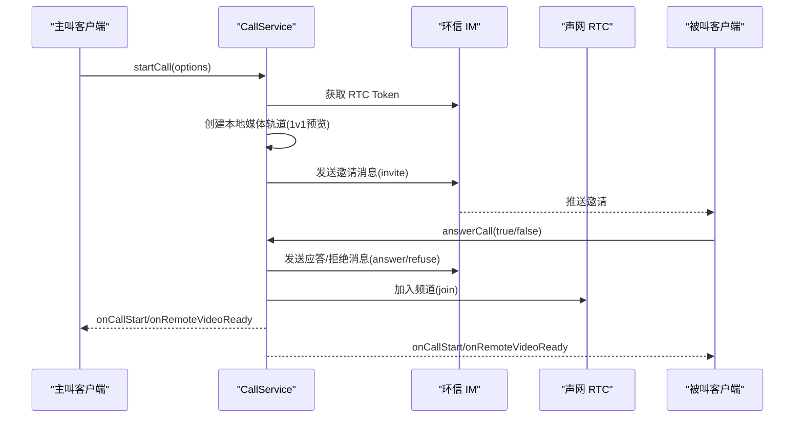
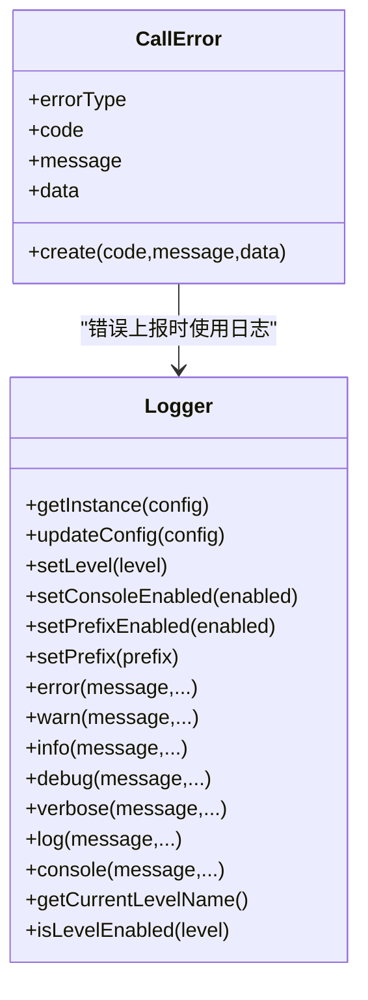
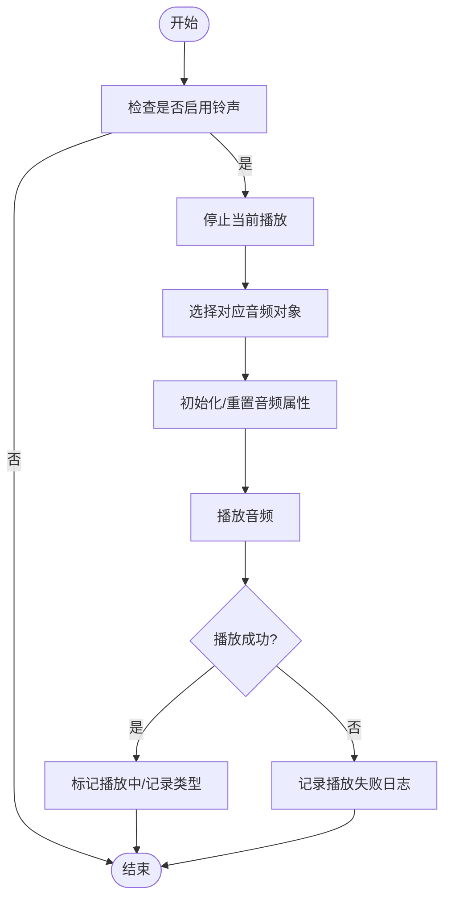
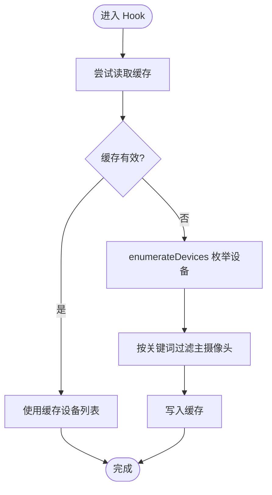
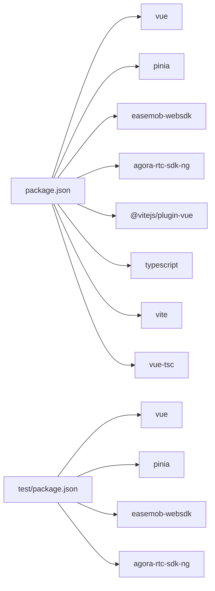
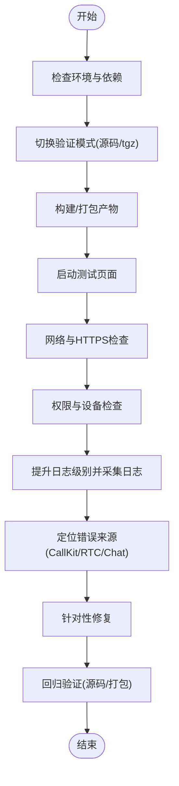

# 故障排除

<cite>
**本文引用的文件**
- [README.md](file://README.md)
- [package.json](file://package.json)
- [common_issue.md](file://callkit/docs/common_issue.md)
- [CallError.ts](file://callkit/services/CallError.ts)
- [CallService.ts](file://callkit/services/CallService.ts)
- [logger.ts](file://callkit/utils/logger.ts)
- [ringtoneManager.ts](file://callkit/utils/ringtoneManager.ts)
- [useCallTimer.ts](file://callkit/hooks/useCallTimer.ts)
- [useCameraDevices.ts](file://callkit/hooks/useCameraDevices.ts)
- [callUtils.ts](file://callkit/utils/callUtils.ts)
- [index.ts](file://callkit/types/index.ts)
- [vite.config.ts](file://vite.config.ts)
- [test/package.json](file://test/package.json)
</cite>

## 目录
1. [简介](#简介)
2. [项目结构](#项目结构)
3. [核心组件](#核心组件)
4. [架构总览](#架构总览)
5. [详细组件分析](#详细组件分析)
6. [依赖关系分析](#依赖关系分析)
7. [性能考虑](#性能考虑)
8. [故障排除指南](#故障排除指南)
9. [结论](#结论)
10. [附录](#附录)

## 简介
本指南面向不同技术背景的开发者，提供系统化的故障排除流程与调试技巧，覆盖环境配置、依赖冲突、运行时错误、日志采集与分析、网络与权限问题诊断，以及性能问题的分析与优化建议。文档结合项目实际代码结构与实现细节，帮助快速定位并解决问题。

## 项目结构
该工程采用模块化组织方式，核心能力集中在 lib/callkit 目录下，包含组件、组合式函数、核心服务、状态管理、类型定义与工具函数。测试样例位于 test 目录，并提供两种验证模式：源码模式与 tgz 包模式，便于在真实依赖与打包产物之间对比验证。

图表来源
- [README.md](file://README.md#L5-L31)
- [vite.config.ts](file://vite.config.ts#L1-L21)
- [package.json](file://package.json#L1-L53)
- [test/package.json](file://test/package.json#L1-L29)

章节来源
- [README.md](file://README.md#L5-L31)
- [package.json](file://package.json#L1-L53)
- [vite.config.ts](file://vite.config.ts#L1-L21)
- [test/package.json](file://test/package.json#L1-L29)

## 核心组件
- 通话服务 CallService：负责与环信 IM 与声网 RTC 的交互、状态机推进、邀请与应答流程、媒体轨道管理、铃声播放、错误上报等。
- 错误模型 CallError：统一错误类型与来源（CallKit、RTC、Chat），便于上层统一处理。
- 日志系统 Logger：集中化日志输出与级别控制，支持前缀、时间戳格式化与动态更新配置。
- 铃声管理 RingtoneManager：封装外呼/来电铃声播放与生命周期管理。
- 摄像头设备 Hook useCameraDevices：枚举设备、识别前后摄像头、缓存与翻转逻辑。
- 计时 Hook useCallTimer：通话时长计时与清理。
- 工具函数 callUtils：频道号生成、通话时长格式化、头像获取、安全位置计算等。
- 类型定义 index.ts：对外暴露的接口、回调、布局与配置类型。

章节来源
- [CallService.ts](file://callkit/services/CallService.ts#L116-L285)
- [CallError.ts](file://callkit/services/CallError.ts#L1-L43)
- [logger.ts](file://callkit/utils/logger.ts#L28-L172)
- [ringtoneManager.ts](file://callkit/utils/ringtoneManager.ts#L6-L139)
- [useCameraDevices.ts](file://callkit/hooks/useCameraDevices.ts#L272-L388)
- [useCallTimer.ts](file://callkit/hooks/useCallTimer.ts#L1-L50)
- [callUtils.ts](file://callkit/utils/callUtils.ts#L1-L85)
- [index.ts](file://callkit/types/index.ts#L1-L356)

## 架构总览
整体架构围绕 CallService 为核心的服务层，向上通过类型定义与回调暴露能力，向下对接环信 IM 与声网 RTC，配合日志、铃声、设备与计时等工具模块协同工作。

图表来源
- [CallService.ts](file://callkit/services/CallService.ts#L116-L285)
- [logger.ts](file://callkit/utils/logger.ts#L28-L172)
- [ringtoneManager.ts](file://callkit/utils/ringtoneManager.ts#L6-L139)
- [useCameraDevices.ts](file://callkit/hooks/useCameraDevices.ts#L272-L388)
- [useCallTimer.ts](file://callkit/hooks/useCallTimer.ts#L1-L50)
- [callUtils.ts](file://callkit/utils/callUtils.ts#L1-L85)
- [index.ts](file://callkit/types/index.ts#L1-L356)

## 详细组件分析

### 通话服务 CallService
- 状态机与流程
  - 状态包括空闲、发起邀请、响铃、确认铃声、接收确认铃声、应答、确认被叫、通话中等。
  - 发起通话时会自动获取 RTC Token、创建本地媒体轨道（1v1 预览）、发送邀请消息、设置超时与回调。
  - 接听/拒绝流程中会发送相应指令消息并清理资源。
- 错误处理
  - 通过 onCallError 回调上报 CallError，错误类型区分 CallKit、RTC、Chat。
  - 在关键节点记录日志，便于定位问题。
- 媒体与轨道
  - 本地/远端轨道缓存与去重，避免重复创建导致资源泄漏。
  - 提供全局媒体轨道清理逻辑，防止遗留轨道影响后续通话。
- 铃声与网络质量
  - 支持外呼/来电铃声配置与播放控制。
  - 提供网络质量回调，便于 UI 展示与性能监控。

图表来源
- [CallService.ts](file://callkit/services/CallService.ts#L345-L527)
- [CallService.ts](file://callkit/services/CallService.ts#L686-L727)
- [CallService.ts](file://callkit/services/CallService.ts#L764-L800)

章节来源
- [CallService.ts](file://callkit/services/CallService.ts#L116-L285)
- [CallService.ts](file://callkit/services/CallService.ts#L345-L527)
- [CallService.ts](file://callkit/services/CallService.ts#L686-L727)
- [CallService.ts](file://callkit/services/CallService.ts#L764-L800)

### 错误模型与日志
- CallError
  - 统一错误码与来源类型，便于上层按类型分流处理。
- Logger
  - 单例日志管理，支持级别、前缀、时间戳格式化与动态更新。
  - 提供 error/warn/info/debug/verbose/log/console 等方法，满足不同场景。

图表来源
- [CallError.ts](file://callkit/services/CallError.ts#L18-L42)
- [logger.ts](file://callkit/utils/logger.ts#L28-L172)

章节来源
- [CallError.ts](file://callkit/services/CallError.ts#L1-L43)
- [logger.ts](file://callkit/utils/logger.ts#L1-L181)

### 铃声管理 RingtoneManager
- 支持外呼/来电铃声独立配置与播放控制。
- 提供播放/停止、音量/循环、配置更新与销毁等能力。
- 播放失败时记录错误日志，便于定位资源或浏览器限制问题。

图表来源
- [ringtoneManager.ts](file://callkit/utils/ringtoneManager.ts#L50-L96)

章节来源
- [ringtoneManager.ts](file://callkit/utils/ringtoneManager.ts#L1-L139)

### 摄像头设备 Hook useCameraDevices
- 使用设备枚举接口获取设备列表，避免与 RTC SDK 冲突。
- 通过标签关键词识别前置/后置摄像头，过滤广角/超广角等非主摄像头。
- 支持缓存与失效策略、设备变更监听、翻转摄像头等。

图表来源
- [useCameraDevices.ts](file://callkit/hooks/useCameraDevices.ts#L279-L319)

章节来源
- [useCameraDevices.ts](file://callkit/hooks/useCameraDevices.ts#L1-L388)

### 计时 Hook useCallTimer
- 提供通话计时与清理能力，组件卸载时自动清理定时器，避免内存泄漏。

章节来源
- [useCallTimer.ts](file://callkit/hooks/useCallTimer.ts#L1-L50)

### 工具函数 callUtils
- 随机频道号生成、通话时长格式化、头像获取、安全位置计算等通用能力。

章节来源
- [callUtils.ts](file://callkit/utils/callUtils.ts#L1-L85)

## 依赖关系分析
- 运行时依赖
  - Vue 生态（Vue 3、Pinia）、环信 Web SDK、声网 RTC SDK。
- 构建与开发依赖
  - Vite、Vue 插件、TypeScript、TS 编译与类型导出插件。
- 测试与验证
  - 提供源码模式与 tgz 包模式，自动切换依赖配置并安装。

图表来源
- [package.json](file://package.json#L36-L51)
- [test/package.json](file://test/package.json#L15-L28)

章节来源
- [package.json](file://package.json#L1-L53)
- [test/package.json](file://test/package.json#L1-L29)

## 性能考虑
- 媒体轨道复用与清理
  - 本地/远端轨道缓存与去重，避免重复创建导致资源占用上升。
  - 提供全局媒体轨道清理逻辑，防止遗留轨道影响后续通话。
- 日志级别控制
  - 通过 Logger 动态调整日志级别，减少生产环境日志开销。
- 铃声播放优化
  - 预加载与循环控制，降低播放延迟与 CPU 占用。
- 设备枚举与缓存
  - 使用设备枚举而非频繁调用媒体权限 API，减少阻塞与冲突。

章节来源
- [CallService.ts](file://callkit/services/CallService.ts#L4182-L4215)
- [logger.ts](file://callkit/utils/logger.ts#L64-L86)
- [ringtoneManager.ts](file://callkit/utils/ringtoneManager.ts#L30-L48)
- [useCameraDevices.ts](file://callkit/hooks/useCameraDevices.ts#L279-L319)

## 故障排除指南

### 一、环境与依赖问题
- 症状
  - 依赖安装失败、模式切换后无法启动、打包产物缺失。
- 排查步骤
  - 确认包管理器与版本：项目声明使用 pnpm，确保使用匹配版本。
  - 源码模式与 tgz 模式切换
    - 源码模式：在根目录执行测试命令，自动切换到源码模式并安装依赖。
    - tgz 模式：先构建 tgz 包，再切换到 tgz 模式并安装依赖。
  - 构建产物
    - 构建库文件与打包 tgz 的输出目录与命名符合预期。
- 解决方案
  - 使用项目提供的脚本进行模式切换与启动，避免手动修改依赖配置。
  - 若出现依赖冲突，优先使用项目内置的 peerDependencies 与 devDependencies 版本。

章节来源
- [README.md](file://README.md#L33-L101)
- [README.md](file://README.md#L103-L135)
- [package.json](file://package.json#L23-L32)
- [test/package.json](file://test/package.json#L6-L14)

### 二、运行时错误与异常
- 症状
  - 发起通话无响应、通话无法建立、音视频异常、浏览器兼容性问题。
- 排查步骤
  - 检查 IM SDK 初始化与登录状态，确保用户存在且在线。
  - 确认网络连通性与 HTTPS 环境要求。
  - 查看日志级别与错误回调，定位 CallError 来源（CallKit/RTC/Chat）。
  - 验证 RTC Token 获取与加入频道流程。
- 解决方案
  - 按常见问题文档逐项核对，必要时提升日志级别至 debug/verbose。
  - 对于 RTC 错误，参考声网 SDK 错误码并结合日志定位具体环节。

章节来源
- [common_issue.md](file://callkit/docs/common_issue.md#L1-L28)
- [CallError.ts](file://callkit/services/CallError.ts#L12-L16)
- [CallService.ts](file://callkit/services/CallService.ts#L292-L308)
- [logger.ts](file://callkit/utils/logger.ts#L64-L86)

### 三、日志收集与分析
- 症状
  - 问题难以复现、定位困难、跨模块问题排查复杂。
- 排查步骤
  - 通过 Logger 动态调整日志级别，启用详细日志观察关键流程。
  - 在关键节点（如邀请发送、应答、加入频道、轨道创建/清理）增加日志。
  - 使用日志前缀与时间戳，便于聚合与排序分析。
- 解决方案
  - 在开发阶段将日志级别设为 debug/verbose，生产环境降为 error/warn。
  - 将日志输出到控制台与外部日志系统，结合错误回调统一上报。

章节来源
- [logger.ts](file://callkit/utils/logger.ts#L28-L172)
- [CallService.ts](file://callkit/services/CallService.ts#L530-L684)

### 四、网络连接与权限问题
- 症状
  - 音频/视频无输出、设备不可用、权限弹窗频繁触发。
- 排查步骤
  - 检查浏览器权限状态与设备可用性，使用摄像头设备 Hook 获取设备列表与权限状态。
  - 验证 HTTPS 环境与浏览器兼容性，确保 WebRTC 支持。
  - 关注媒体轨道创建与播放过程中的异常，必要时清理遗留轨道。
- 解决方案
  - 优先使用设备枚举接口获取设备列表，避免与媒体权限 API 冲突。
  - 在通话结束后执行全局媒体轨道清理，释放资源。

章节来源
- [common_issue.md](file://callkit/docs/common_issue.md#L13-L23)
- [useCameraDevices.ts](file://callkit/hooks/useCameraDevices.ts#L272-L388)
- [CallService.ts](file://callkit/services/CallService.ts#L4182-L4215)

### 五、铃声与用户体验问题
- 症状
  - 铃声不播放、重复播放、音量异常。
- 排查步骤
  - 检查铃声配置（启用开关、音量、循环）与资源路径。
  - 观察播放/停止流程，确认当前播放类型与状态。
- 解决方案
  - 确保铃声资源可访问且浏览器允许自动播放。
  - 使用铃声管理器统一控制播放与停止，避免竞态。

章节来源
- [ringtoneManager.ts](file://callkit/utils/ringtoneManager.ts#L50-L96)
- [CallService.ts](file://callkit/services/CallService.ts#L405-L407)

### 六、性能问题分析与优化
- 症状
  - 画面卡顿、CPU 占用高、通话时长统计异常。
- 排查步骤
  - 关注网络质量回调与 UI 渲染频率，避免高频重绘。
  - 检查媒体轨道创建与播放链路，减少不必要的重复创建。
  - 使用计时 Hook 管理计时器生命周期，防止内存泄漏。
- 解决方案
  - 合理设置编码配置与分辨率，平衡清晰度与性能。
  - 通过日志与性能分析工具定位热点，优化关键路径。

章节来源
- [CallService.ts](file://callkit/services/CallService.ts#L162-L167)
- [useCallTimer.ts](file://callkit/hooks/useCallTimer.ts#L1-L50)
- [callUtils.ts](file://callkit/utils/callUtils.ts#L25-L32)

### 七、系统化诊断流程

图表来源
- [README.md](file://README.md#L45-L101)
- [package.json](file://package.json#L23-L32)
- [logger.ts](file://callkit/utils/logger.ts#L64-L86)

## 结论
通过统一的日志体系、明确的错误模型、完善的媒体与设备管理，以及系统化的验证与构建流程，本项目提供了可靠的故障排除基础。建议在开发与集成过程中遵循本文提供的诊断流程与最佳实践，以快速定位并解决问题，保障通话体验的稳定性与性能。

## 附录
- 常见问题速查
  - 发起通话无响应：检查 IM 初始化与用户状态。
  - 通话无法建立：确认对方在线与网络状态。
  - 音视频问题：检查权限、设备与浏览器兼容性。
  - 浏览器兼容性：确保现代浏览器与 HTTPS 环境。
- 类型与回调参考
  - 对外接口、回调与配置类型可参考类型定义文件，便于在上层统一处理。

章节来源
- [common_issue.md](file://callkit/docs/common_issue.md#L1-L28)
- [index.ts](file://callkit/types/index.ts#L178-L356)