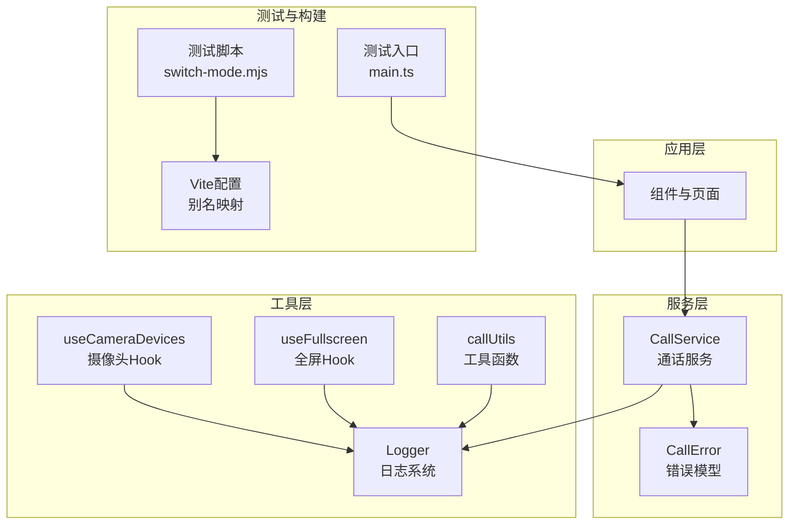
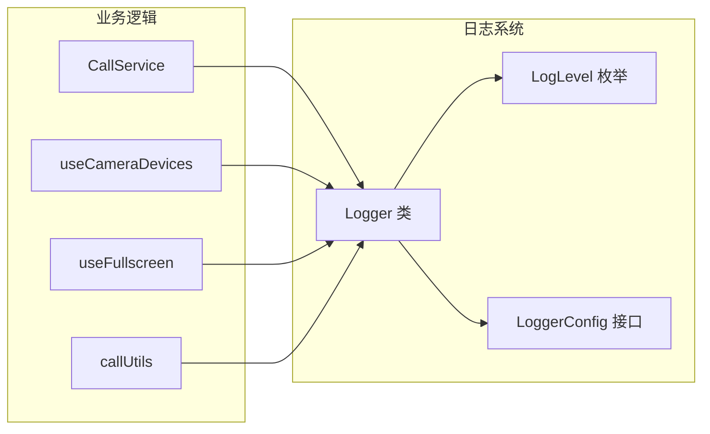
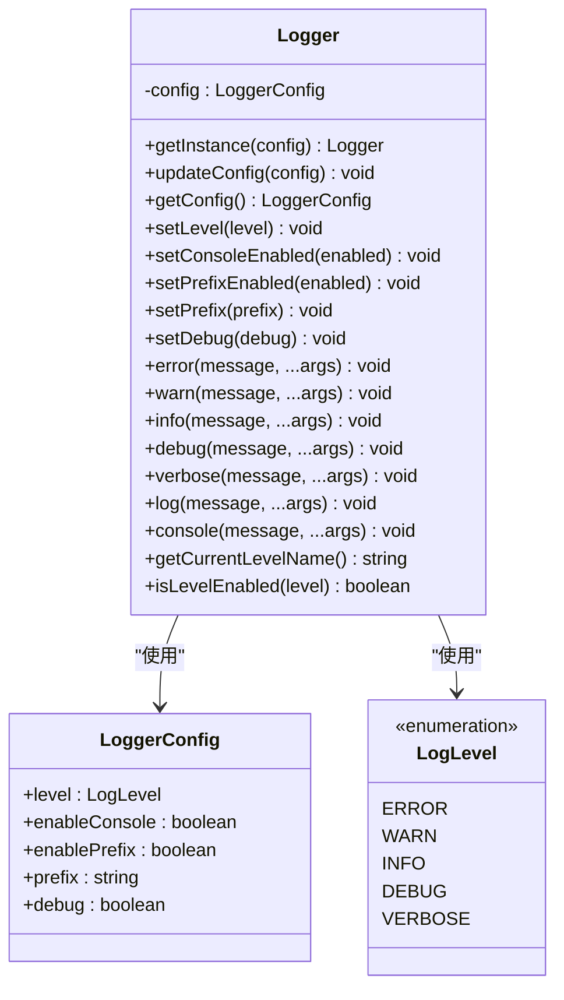
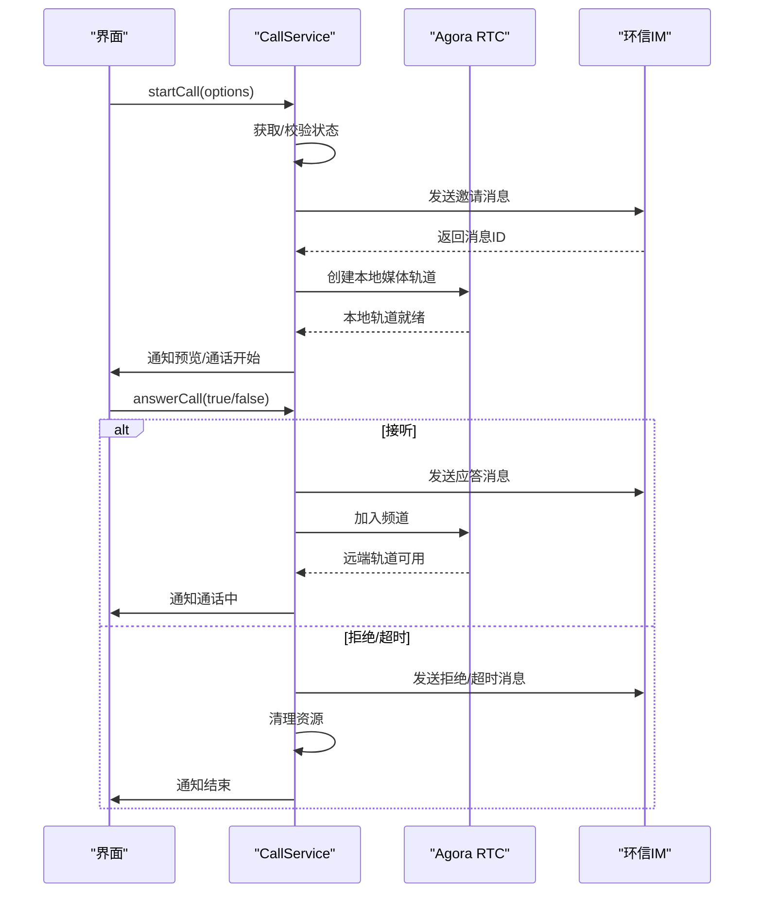
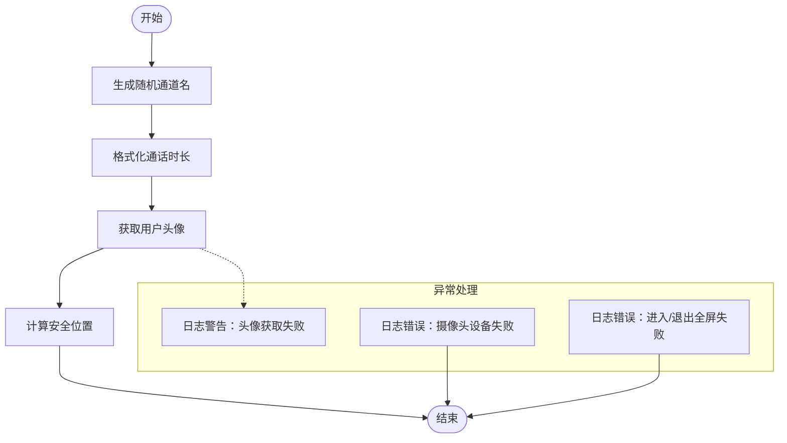
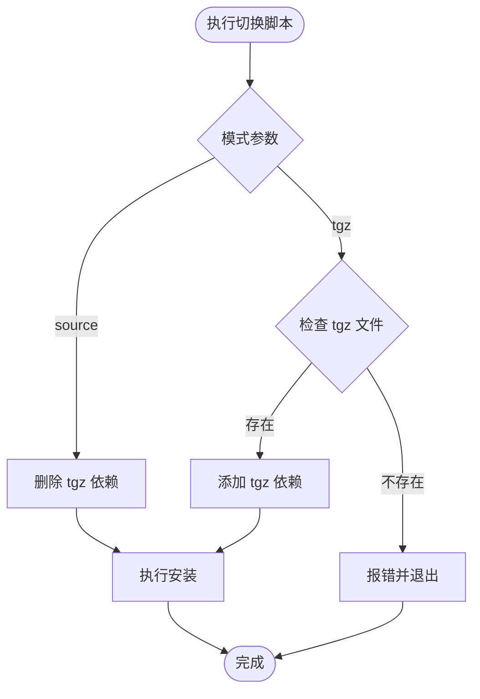
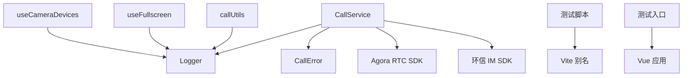

# 调试工具与技巧

<cite>
**本文档引用的文件**
- [logger.ts](file://callkit/utils/logger.ts)
- [CallService.ts](file://callkit/services/CallService.ts)
- [callUtils.ts](file://callkit/utils/callUtils.ts)
- [useCameraDevices.ts](file://callkit/hooks/useCameraDevices.ts)
- [useFullscreen.ts](file://callkit/hooks/useFullscreen.ts)
- [switch-mode.mjs](file://test/scripts/switch-mode.mjs)
- [vite.config.ts](file://vite.config.ts)
- [main.ts](file://test/src/main.ts)
- [package.json](file://package.json)
- [CallError.ts](file://callkit/services/CallError.ts)
- [CallKit.stories.tsx](file://callkit/CallKit.stories.tsx)
</cite>

## 目录
1. [简介](#简介)
2. [项目结构](#项目结构)
3. [核心组件](#核心组件)
4. [架构概览](#架构概览)
5. [详细组件分析](#详细组件分析)
6. [依赖关系分析](#依赖关系分析)
7. [性能考虑](#性能考虑)
8. [故障排查指南](#故障排查指南)
9. [结论](#结论)
10. [附录](#附录)

## 简介
本指南围绕 Vue3 CallKit 项目的调试工具与技巧展开，系统介绍内置日志系统的使用方法（日志级别配置、输出格式、调试模式切换）、浏览器开发者工具的实战技巧（网络面板、性能面板、控制台调试）、断点设置与状态监控、异步操作跟踪，以及第三方调试工具的集成与自动化调试脚本的编写方法。目标是帮助开发者快速定位问题、优化性能并提升开发效率。

## 项目结构
该项目采用模块化组织方式，核心模块包括：
- callkit/utils：通用工具与日志系统
- callkit/services：业务服务层（如通话服务）
- callkit/hooks：React Hooks（如摄像头设备、全屏控制）
- test：测试与演示环境（包含切换模式脚本）
- lib：打包产物与样式资源
- vite.config.ts：构建别名配置

**图表来源**
- [CallService.ts](file://callkit/services/CallService.ts#L116-L285)
- [logger.ts](file://callkit/utils/logger.ts#L28-L172)
- [useCameraDevices.ts](file://callkit/hooks/useCameraDevices.ts#L1-L200)
- [useFullscreen.ts](file://callkit/hooks/useFullscreen.ts#L1-L82)
- [switch-mode.mjs](file://test/scripts/switch-mode.mjs#L1-L57)
- [vite.config.ts](file://vite.config.ts#L1-L21)
- [main.ts](file://test/src/main.ts#L1-L10)

**章节来源**
- [vite.config.ts](file://vite.config.ts#L1-L21)
- [package.json](file://package.json#L1-L53)

## 核心组件
- 内置日志系统：提供多级别日志输出、可配置前缀、时间戳格式化、兼容控制台输出方法，并支持调试模式一键切换。
- 通话服务：封装 Agora RTC 与环信 IM 的交互流程，包含完整的日志记录点，便于问题追踪。
- 工具函数：提供通话时长格式化、头像获取、安全位置计算等实用工具。
- React Hooks：摄像头设备管理与全屏控制，均集成日志输出以便调试设备权限与状态变化。
- 测试与构建：提供源码模式与 tgz 包模式的切换脚本，配合 Vite 别名实现开发与打包的无缝衔接。

**章节来源**
- [logger.ts](file://callkit/utils/logger.ts#L28-L172)
- [CallService.ts](file://callkit/services/CallService.ts#L116-L285)
- [callUtils.ts](file://callkit/utils/callUtils.ts#L1-L85)
- [useCameraDevices.ts](file://callkit/hooks/useCameraDevices.ts#L1-L200)
- [useFullscreen.ts](file://callkit/hooks/useFullscreen.ts#L1-L82)
- [switch-mode.mjs](file://test/scripts/switch-mode.mjs#L1-L57)

## 架构概览
下图展示了日志系统在整体架构中的位置与调用关系：

**图表来源**
- [CallService.ts](file://callkit/services/CallService.ts#L11-L12)
- [logger.ts](file://callkit/utils/logger.ts#L2-L17)
- [logger.ts](file://callkit/utils/logger.ts#L19-L25)

## 详细组件分析

### 日志系统（Logger）
- 功能特性
  - 多级别日志：ERROR、WARN、INFO、DEBUG、VERBOSE
  - 配置项：日志级别、控制台开关、前缀开关、自定义前缀、调试模式
  - 输出格式：时间戳、级别、消息体，支持彩色输出（lib 版本）
  - 单例模式：全局统一配置与输出
- 使用建议
  - 开发阶段：开启调试模式，级别设为 VERBOSE，便于捕获详细流程
  - 生产阶段：默认仅输出 ERROR，必要时临时提升至 INFO/WARN
  - 前缀统一：通过自定义前缀区分模块（如 CallKit），便于过滤
- 调试模式切换
  - 通过配置项 debug 控制日志级别（true 对应 VERBOSE，false 对应 ERROR）

**图表来源**
- [logger.ts](file://callkit/utils/logger.ts#L28-L172)

**章节来源**
- [logger.ts](file://callkit/utils/logger.ts#L28-L172)

### 通话服务（CallService）
- 关键职责
  - 初始化 Agora RTC 客户端、设置日志级别
  - 发起/接听/挂断通话、发送邀请与应答消息
  - 管理本地/远端媒体流、设备状态与 UI 通知
  - 错误处理与回调分发
- 调试要点
  - 在关键流程（如创建本地视频轨道、发送邀请消息、接听/拒绝通话）添加日志
  - 监控状态机转换（IDLE → INVITING → ALERTING → IN_CALL）
  - 异常分支（资源清理、超时处理）需记录错误日志
- 性能关注
  - 避免重复创建媒体轨道，使用缓存与清理策略
  - 合理设置编码配置与音量阈值，减少不必要的重渲染

**图表来源**
- [CallService.ts](file://callkit/services/CallService.ts#L345-L527)
- [CallService.ts](file://callkit/services/CallService.ts#L686-L727)
- [CallService.ts](file://callkit/services/CallService.ts#L259-L284)

**章节来源**
- [CallService.ts](file://callkit/services/CallService.ts#L116-L285)
- [CallService.ts](file://callkit/services/CallService.ts#L345-L527)
- [CallService.ts](file://callkit/services/CallService.ts#L686-L727)

### 工具函数与 Hooks
- 工具函数
  - 生成随机通道名、格式化通话时长、获取用户头像、计算安全位置
  - 在异常场景使用日志记录错误与警告
- Hooks
  - 摄像头设备 Hook：设备列表缓存、关键词识别、翻转摄像头、异常处理
  - 全屏 Hook：跨浏览器全屏 API 封装、状态监听、错误日志

**图表来源**
- [callUtils.ts](file://callkit/utils/callUtils.ts#L11-L85)
- [useCameraDevices.ts](file://callkit/hooks/useCameraDevices.ts#L86-L126)
- [useFullscreen.ts](file://callkit/hooks/useFullscreen.ts#L11-L40)

**章节来源**
- [callUtils.ts](file://callkit/utils/callUtils.ts#L1-L85)
- [useCameraDevices.ts](file://callkit/hooks/useCameraDevices.ts#L1-L200)
- [useFullscreen.ts](file://callkit/hooks/useFullscreen.ts#L1-L82)

### 测试与构建（调试脚本）
- 模式切换脚本
  - 支持在源码模式与 tgz 包模式之间切换，自动更新依赖配置
  - 提供错误提示与安装指引
- Vite 别名
  - 将包名解析到 lib 目录，便于本地开发与预览
- 测试入口
  - 创建 Vue 应用并挂载根组件，结合 Pinia 状态管理

**图表来源**
- [switch-mode.mjs](file://test/scripts/switch-mode.mjs#L18-L56)
- [vite.config.ts](file://vite.config.ts#L8-L19)
- [main.ts](file://test/src/main.ts#L1-L10)

**章节来源**
- [switch-mode.mjs](file://test/scripts/switch-mode.mjs#L1-L57)
- [vite.config.ts](file://vite.config.ts#L1-L21)
- [main.ts](file://test/src/main.ts#L1-L10)
- [package.json](file://package.json#L23-L32)

## 依赖关系分析
- 模块耦合
  - CallService 依赖 Logger、CallError、Agora RTC SDK、环信 IM SDK
  - Hooks 依赖 Logger 与浏览器 API
  - 工具函数独立，被多处调用
- 外部依赖
  - Agora RTC SDK：音视频编解码与传输
  - 环信 IM SDK：信令与消息传递
  - Vue/Pinia：前端框架与状态管理
- 构建与测试
  - Vite 别名映射 lib 目录，简化开发体验
  - 测试脚本自动化切换依赖模式

**图表来源**
- [CallService.ts](file://callkit/services/CallService.ts#L1-L12)
- [logger.ts](file://callkit/utils/logger.ts#L28-L172)
- [CallError.ts](file://callkit/services/CallError.ts#L1-L43)
- [vite.config.ts](file://vite.config.ts#L8-L19)
- [main.ts](file://test/src/main.ts#L1-L10)

**章节来源**
- [CallService.ts](file://callkit/services/CallService.ts#L1-L12)
- [CallError.ts](file://callkit/services/CallError.ts#L1-L43)

## 性能考虑
- 日志级别控制
  - 生产环境仅保留 ERROR/INFO，避免高频日志影响性能
  - 调试阶段使用 VERBOSE，但注意控制输出频率
- 资源管理
  - 避免重复创建媒体轨道，及时清理不再使用的轨道与流
  - 合理设置编码配置与音量阈值，降低 CPU/GPU 压力
- 网络与渲染
  - 使用浏览器网络面板监控信令与媒体传输质量
  - 使用性能面板观察主线程卡顿与重绘情况

## 故障排查指南
- 常见问题定位
  - 通话状态异常：检查 CallService 状态机转换日志，确认 INVITING/ALERTING/IN_CALL 各阶段的触发条件
  - 设备权限问题：摄像头 Hook 的缓存与关键词识别日志，确认设备列表与翻转逻辑
  - 全屏失败：全屏 Hook 的错误日志，检查浏览器兼容性与用户手势要求
- 错误模型
  - CallError 提供统一的错误类型与代码，便于分类处理与上报
- 调试脚本
  - 使用切换脚本验证源码与包模式差异，确保构建产物正确

**章节来源**
- [CallService.ts](file://callkit/services/CallService.ts#L374-L472)
- [useCameraDevices.ts](file://callkit/hooks/useCameraDevices.ts#L309-L367)
- [useFullscreen.ts](file://callkit/hooks/useFullscreen.ts#L21-L39)
- [CallError.ts](file://callkit/services/CallError.ts#L18-L42)

## 结论
通过内置日志系统、完善的业务服务与工具链，以及可配置的测试与构建流程，本项目提供了全面的调试能力。建议在开发阶段充分利用日志与浏览器开发者工具，在生产阶段严格控制日志级别与资源消耗，结合自动化脚本与别名配置提升开发效率与一致性。

## 附录
- 浏览器开发者工具使用要点
  - 网络面板：监控信令与媒体传输，关注重试、超时与带宽变化
  - 性能面板：录制交互过程，分析主线程占用与内存增长
  - 控制台：结合日志前缀与级别过滤，快速定位问题
- 断点与状态监控
  - 在 CallService 的关键流程（创建轨道、发送消息、状态切换）设置断点
  - 使用 Hooks 的日志输出观察设备与全屏状态变化
- 第三方工具集成
  - 可结合性能分析工具（如 Lighthouse、WebPageTest）评估用户体验
  - 使用日志聚合平台收集运行时日志，建立告警机制