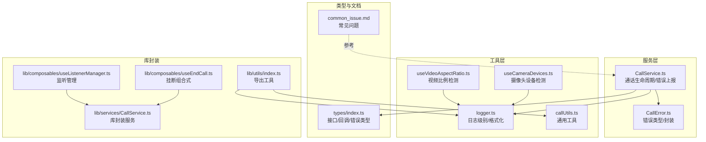
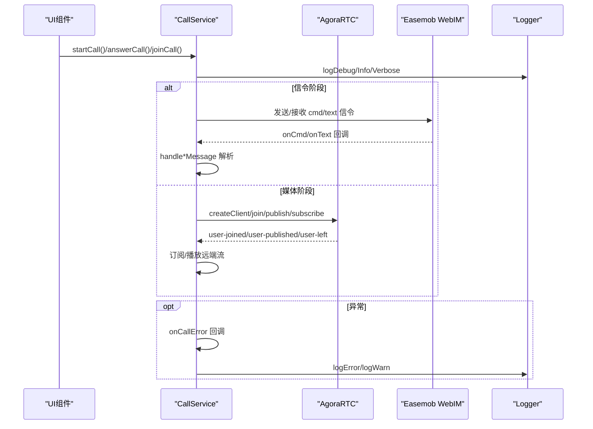
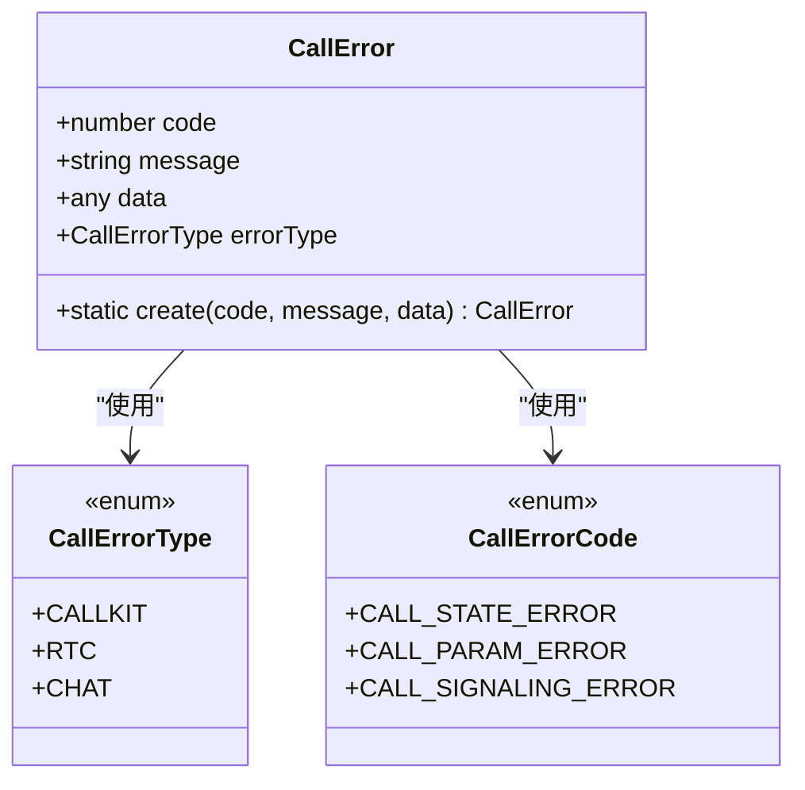
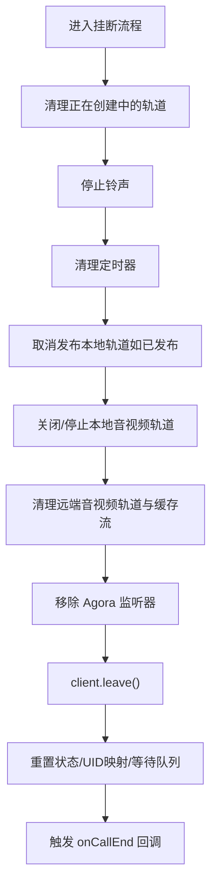
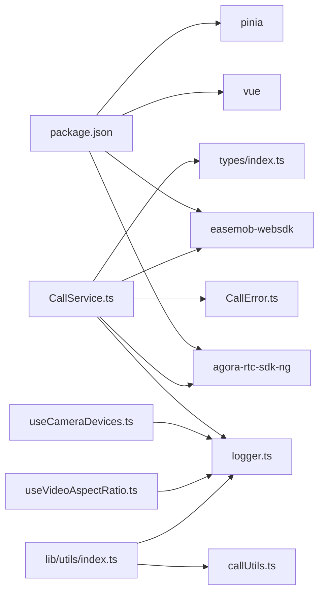

# 运行时错误

<cite>
**本文引用的文件**   
- [callkit/services/CallError.ts](file://callkit/services/CallError.ts)
- [callkit/services/CallService.ts](file://callkit/services/CallService.ts)
- [callkit/utils/logger.ts](file://callkit/utils/logger.ts)
- [callkit/utils/callUtils.ts](file://callkit/utils/callUtils.ts)
- [callkit/types/index.ts](file://callkit/types/index.ts)
- [callkit/docs/common_issue.md](file://callkit/docs/common_issue.md)
- [callkit/hooks/useCameraDevices.ts](file://callkit/hooks/useCameraDevices.ts)
- [callkit/hooks/useVideoAspectRatio.ts](file://callkit/hooks/useVideoAspectRatio.ts)
- [lib/utils/index.ts](file://lib/utils/index.ts)
- [lib/composables/useEndCall.ts](file://lib/composables/useEndCall.ts)
- [lib/composables/useListenerManager.ts](file://lib/composables/useListenerManager.ts)
- [lib/services/CallService.ts](file://lib/services/CallService.ts)
- [package.json](file://package.json)
</cite>

## 目录
1. [简介](#简介)
2. [项目结构](#项目结构)
3. [核心组件](#核心组件)
4. [架构总览](#架构总览)
5. [详细组件分析](#详细组件分析)
6. [依赖分析](#依赖分析)
7. [性能考虑](#性能考虑)
8. [故障排查指南](#故障排查指南)
9. [结论](#结论)
10. [附录](#附录)

## 简介
本指南聚焦于 Easemob Vue3 CallKit 在运行时可能出现的各类错误，覆盖通话连接失败、媒体设备访问错误、权限被拒绝、网络连接中断、浏览器兼容性与移动端适配、跨域问题等，并提供系统化的排查步骤、日志定位方法、错误代码对照与恢复/降级策略。读者可据此快速定位问题根因并采取有效措施。

## 项目结构
该项目采用分层模块化组织，核心运行时错误处理集中在服务层与工具层：
- 服务层：通话服务负责信令、媒体轨道、远端订阅、状态机与错误上报
- 工具层：日志系统、通用工具、设备检测与视频比例 Hook
- 类型与文档：统一错误类型、回调接口、常见问题说明

图表来源
- [callkit/services/CallService.ts](file://callkit/services/CallService.ts#L116-L285)
- [callkit/services/CallError.ts](file://callkit/services/CallError.ts#L1-L43)
- [callkit/utils/logger.ts](file://callkit/utils/logger.ts#L1-L181)
- [callkit/utils/callUtils.ts](file://callkit/utils/callUtils.ts#L1-L85)
- [callkit/types/index.ts](file://callkit/types/index.ts#L1-L356)
- [callkit/docs/common_issue.md](file://callkit/docs/common_issue.md#L1-L28)
- [callkit/hooks/useCameraDevices.ts](file://callkit/hooks/useCameraDevices.ts#L1-L387)
- [callkit/hooks/useVideoAspectRatio.ts](file://callkit/hooks/useVideoAspectRatio.ts#L1-L35)
- [lib/utils/index.ts](file://lib/utils/index.ts#L1-L2)
- [lib/composables/useEndCall.ts](file://lib/composables/useEndCall.ts#L44-L98)
- [lib/composables/useListenerManager.ts](file://lib/composables/useListenerManager.ts#L80-L114)
- [lib/services/CallService.ts](file://lib/services/CallService.ts#L49-L110)

章节来源
- [callkit/services/CallService.ts](file://callkit/services/CallService.ts#L116-L285)
- [callkit/services/CallError.ts](file://callkit/services/CallError.ts#L1-L43)
- [callkit/utils/logger.ts](file://callkit/utils/logger.ts#L1-L181)
- [callkit/utils/callUtils.ts](file://callkit/utils/callUtils.ts#L1-L85)
- [callkit/types/index.ts](file://callkit/types/index.ts#L1-L356)
- [callkit/docs/common_issue.md](file://callkit/docs/common_issue.md#L1-L28)
- [callkit/hooks/useCameraDevices.ts](file://callkit/hooks/useCameraDevices.ts#L1-L387)
- [callkit/hooks/useVideoAspectRatio.ts](file://callkit/hooks/useVideoAspectRatio.ts#L1-L35)
- [lib/utils/index.ts](file://lib/utils/index.ts#L1-L2)
- [lib/composables/useEndCall.ts](file://lib/composables/useEndCall.ts#L44-L98)
- [lib/composables/useListenerManager.ts](file://lib/composables/useListenerManager.ts#L80-L114)
- [lib/services/CallService.ts](file://lib/services/CallService.ts#L49-L110)

## 核心组件
- 错误模型与分类
  - CallError：统一错误封装，包含错误类型、代码、消息与附加数据
  - 错误类型：CallErrorType（CALLKIT/RTC/CHAT），错误码：CallErrorCode（状态/参数/信令）
- 日志系统
  - Logger：支持多级别（ERROR/WARN/INFO/DEBUG/VERBOSE）、前缀、时间戳、格式化输出
  - 便捷方法：logError/logWarn/logInfo/logDebug/logVerbose
- 通话服务
  - CallService：负责信令收发、加入/发布/订阅、远端用户管理、挂断清理、错误上报
  - 关键回调：onCallError、onReceivedCall、onRemoteUserJoined/Left、onNetworkQualityChange 等
- 设备与适配
  - useCameraDevices：摄像头枚举、标签解析、前后置识别、缓存与翻转
  - useVideoAspectRatio：视频流实际分辨率检测，动态计算画中画高度
- 类型与文档
  - types/index.ts：对外暴露的接口、回调、CallKit 属性与日志配置
  - common_issue.md：常见问题与建议

章节来源
- [callkit/services/CallError.ts](file://callkit/services/CallError.ts#L1-L43)
- [callkit/utils/logger.ts](file://callkit/utils/logger.ts#L1-L181)
- [callkit/services/CallService.ts](file://callkit/services/CallService.ts#L116-L285)
- [callkit/hooks/useCameraDevices.ts](file://callkit/hooks/useCameraDevices.ts#L1-L387)
- [callkit/hooks/useVideoAspectRatio.ts](file://callkit/hooks/useVideoAspectRatio.ts#L1-L35)
- [callkit/types/index.ts](file://callkit/types/index.ts#L1-L356)
- [callkit/docs/common_issue.md](file://callkit/docs/common_issue.md#L1-L28)

## 架构总览
运行时错误贯穿“信令—媒体—UI”链路，CallService 作为中枢，通过日志系统记录关键节点，通过 CallError 上报错误类型与码值，配合 UI 回调与设备检测 Hook 完成定位与恢复。

图表来源
- [callkit/services/CallService.ts](file://callkit/services/CallService.ts#L800-L1358)
- [callkit/utils/logger.ts](file://callkit/utils/logger.ts#L104-L181)
- [callkit/types/index.ts](file://callkit/types/index.ts#L281-L307)

## 详细组件分析

### 错误模型与分类
- 错误类型
  - CallErrorType：CALLKIT（业务层）、RTC（Agora SDK）、CHAT（IM 信令）
- 错误码
  - CallErrorCode：CALL_STATE_ERROR（状态错误）、CALL_PARAM_ERROR（参数错误）、CALL_SIGNALING_ERROR（信令错误）
- CallError 封装
  - 提供静态工厂 create，便于集中构造错误对象
- 使用方式
  - 通过 onCallError 回调上抛，供 UI 或上层捕获与展示

图表来源
- [callkit/services/CallError.ts](file://callkit/services/CallError.ts#L1-L43)

章节来源
- [callkit/services/CallError.ts](file://callkit/services/CallError.ts#L1-L43)
- [callkit/types/index.ts](file://callkit/types/index.ts#L295-L296)

### 日志系统与关键日志点
- 日志级别与配置
  - 支持 ERROR/WARN/INFO/DEBUG/VERBOSE，可通过 props 配置 logLevel、enableLogging、logPrefix
  - Logger 单例，支持动态更新配置
- 关键日志点
  - 通话生命周期：startCall/answerCall/joinCall/hangup
  - 媒体轨道：创建/发布/订阅/播放、轨道状态变更
  - 信令：邀请/响铃/确认/取消/离开
  - 设备：摄像头枚举、标签解析、翻转、分辨率检测
  - 异常：onCallError 回调、错误码与消息
- 日志建议
  - 生产环境保留 ERROR/WARN，开发联调提升到 DEBUG/VERBOSE
  - 使用统一前缀与时间戳，便于检索

章节来源
- [callkit/utils/logger.ts](file://callkit/utils/logger.ts#L1-L181)
- [callkit/types/index.ts](file://callkit/types/index.ts#L281-L284)
- [callkit/services/CallService.ts](file://callkit/services/CallService.ts#L374-L472)
- [callkit/hooks/useCameraDevices.ts](file://callkit/hooks/useCameraDevices.ts#L272-L387)
- [callkit/hooks/useVideoAspectRatio.ts](file://callkit/hooks/useVideoAspectRatio.ts#L8-L35)

### 通话服务与错误上报
- 信令流程
  - 邀请/响铃/确认/应答/取消/离开，均通过 IM 信令通道传递
  - 多端场景：校验 callerDevId/calleeDevId 与当前设备资源，避免重复处理
- 媒体流程
  - join：客户端连接状态检查、等待 CONNECTED、启用音量指示
  - publish/subscribe：音频/视频轨道发布与订阅，错误通过 onCallError 上报
  - 挂断：清理轨道、取消发布、离开频道、移除监听器、重置状态
- 错误上报
  - Chat/RTC/Agora 错误分别封装为 CallErrorType/Code，携带 message 与附加数据

图表来源
- [callkit/services/CallService.ts](file://callkit/services/CallService.ts#L1360-L1683)

章节来源
- [callkit/services/CallService.ts](file://callkit/services/CallService.ts#L800-L1358)
- [callkit/services/CallService.ts](file://callkit/services/CallService.ts#L1360-L1683)
- [callkit/services/CallService.ts](file://callkit/services/CallService.ts#L2225-L2254)

### 设备与适配
- 摄像头设备
  - 通过 enumerateDevices 获取设备列表，解析 label 关键词识别前后置
  - 缓存设备列表，避免频繁枚举；提供翻转摄像头能力
- 视频比例
  - 监听视频元数据加载，计算实际宽高比，动态适配画中画布局

章节来源
- [callkit/hooks/useCameraDevices.ts](file://callkit/hooks/useCameraDevices.ts#L1-L387)
- [callkit/hooks/useVideoAspectRatio.ts](file://callkit/hooks/useVideoAspectRatio.ts#L1-L35)

## 依赖分析
- 外部依赖
  - agora-rtc-sdk-ng：音视频引擎与轨道管理
  - easemob-websdk：IM 信令通道
  - vue/pinia：UI 与状态管理（库封装）
- 内部依赖
  - CallService 依赖 Logger、CallError、类型定义与工具函数
  - Hooks 依赖 Logger 与媒体设备 API
  - 库封装通过 lib/utils/index.ts 汇总导出

图表来源
- [package.json](file://package.json#L47-L51)
- [callkit/services/CallService.ts](file://callkit/services/CallService.ts#L1-L12)
- [callkit/utils/logger.ts](file://callkit/utils/logger.ts#L1-L181)
- [callkit/services/CallError.ts](file://callkit/services/CallError.ts#L1-L43)
- [callkit/types/index.ts](file://callkit/types/index.ts#L1-L356)
- [callkit/utils/callUtils.ts](file://callkit/utils/callUtils.ts#L1-L85)
- [lib/utils/index.ts](file://lib/utils/index.ts#L1-L2)

章节来源
- [package.json](file://package.json#L47-L51)
- [lib/utils/index.ts](file://lib/utils/index.ts#L1-L2)

## 性能考虑
- 资源释放
  - 挂断时严格顺序：停止铃声 → 清理定时器 → 取消发布 → 关闭轨道 → 清理缓存 → 移除监听 → leave 频道
  - 对于禁用/关闭的轨道，确保底层 MediaStreamTrack.stop 与轨道 close，避免资源泄漏
- 等待与重试
  - 客户端连接状态等待（CONNECTING→CONNECTED）与指数退避重试播放远端视频
- 平台差异
  - Android 设备切换摄像头后等待资源释放，减少创建失败概率
- 日志级别
  - 生产环境降低日志量，避免 I/O 抖动

章节来源
- [callkit/services/CallService.ts](file://callkit/services/CallService.ts#L874-L907)
- [callkit/services/CallService.ts](file://callkit/services/CallService.ts#L2760-L2767)
- [callkit/services/CallService.ts](file://callkit/services/CallService.ts#L3817-L3876)
- [callkit/utils/logger.ts](file://callkit/utils/logger.ts#L64-L86)

## 故障排查指南

### 一、常见运行时错误与定位步骤
- 通话连接失败
  - 现象：join 失败、无法加入频道、连接超时
  - 定位要点
    - 检查客户端连接状态（CONNECTED/CONNECTING/DISCONNECTED）
    - 等待连接完成或抛出异常并挂断
    - 校验 useRTCToken 与 token 有效性
  - 建议
    - 提升日志级别到 DEBUG，观察 join 与连接状态转换
    - 若多次失败，触发异常挂断并清理资源
- 媒体设备访问错误
  - 现象：无法创建本地音视频轨道、摄像头不可用、麦克风权限被拒
  - 定位要点
    - 检查摄像头枚举与标签解析，确认前置/后置识别
    - Android 切换摄像头后等待资源释放
    - 挂断时彻底停止底层 MediaStreamTrack 并关闭轨道
  - 建议
    - 使用 useCameraDevices 缓存设备列表，避免频繁枚举
    - 出错时通过 onCallError 上报 RTC/CHAT 错误码
- 权限被拒绝
  - 现象：getUserMedia 失败、轨道创建失败
  - 定位要点
    - 检查浏览器权限状态与用户交互时机
    - 避免与 Agora SDK 轨道创建冲突
  - 建议
    - 仅使用 enumerateDevices 获取设备列表，不调用 getUserMedia
    - 出错时清理轨道并提示用户授权
- 网络连接中断
  - 现象：远端用户离开、网络质量下降、user-left 触发
  - 定位要点
    - 监听 network-quality 事件，聚合自身与他人网络质量
    - 多人通话中，远端离开触发 UI 移除窗口
  - 建议
    - 降级策略：关闭视频轨道、仅音频通话
- 浏览器兼容性与移动端适配
  - 现象：HTTPS 要求、WebRTC 不支持、移动端页面不可用
  - 定位要点
    - 检查浏览器版本与 HTTPS 环境
    - 移动端横竖屏适配与视频比例检测
  - 建议
    - 使用 useVideoAspectRatio 动态计算比例
    - 生产环境必须 HTTPS
- 跨域问题
  - 现象：IM/信令请求失败、CORS 报错
  - 定位要点
    - 检查 IM 服务端 CORS 配置与域名白名单
  - 建议
    - 与服务端确认跨域配置，确保 WebSocket/HTTP 请求放行

章节来源
- [callkit/services/CallService.ts](file://callkit/services/CallService.ts#L842-L917)
- [callkit/services/CallService.ts](file://callkit/services/CallService.ts#L940-L952)
- [callkit/hooks/useCameraDevices.ts](file://callkit/hooks/useCameraDevices.ts#L272-L387)
- [callkit/hooks/useVideoAspectRatio.ts](file://callkit/hooks/useVideoAspectRatio.ts#L8-L35)
- [callkit/services/CallService.ts](file://callkit/services/CallService.ts#L2168-L2181)
- [callkit/docs/common_issue.md](file://callkit/docs/common_issue.md#L19-L23)

### 二、日志系统定位问题
- 日志级别设置
  - 通过 props 配置 logLevel（error/warn/info/debug/verbose），默认 error
  - 可启用/禁用控制台输出与前缀
- 关键日志点标记
  - 通话生命周期：startCall/answerCall/joinCall/hangup
  - 媒体：createClient/join/publish/subscribe/play
  - 信令：invite/alert/confirm/answer/cancel/leave
  - 设备：enumerateDevices/flipCamera/aspect ratio
- 错误堆栈分析
  - onCallError 回调中记录 errorType/code/message
  - 结合日志时间戳与上下文，定位具体调用链

章节来源
- [callkit/types/index.ts](file://callkit/types/index.ts#L281-L284)
- [callkit/utils/logger.ts](file://callkit/utils/logger.ts#L1-L181)
- [callkit/services/CallService.ts](file://callkit/services/CallService.ts#L374-L472)

### 三、错误代码对照表
- 业务层错误（CallErrorType.CALLKIT）
  - CALL_STATE_ERROR：当前状态不允许的操作（如非空闲状态发起通话）
  - CALL_PARAM_ERROR：参数非法（如缺少必要字段）
  - CALL_SIGNALING_ERROR：信令动作异常（如未知 action）
- 媒体层错误（CallErrorType.RTC）
  - AgoraRTCErrorCode：由 Agora SDK 抛出的具体错误码
- IM 信令错误（CallErrorType.CHAT）
  - 由 IM SDK 抛出的错误类型与消息

章节来源
- [callkit/services/CallError.ts](file://callkit/services/CallError.ts#L1-L43)
- [callkit/services/CallService.ts](file://callkit/services/CallService.ts#L374-L382)
- [callkit/services/CallService.ts](file://callkit/services/CallService.ts#L2359-L2364)

### 四、错误恢复机制与降级策略
- 恢复机制
  - 挂断流程：严格顺序清理，确保轨道与监听器释放
  - 重置状态：清空 UID 映射、等待队列、缓存流，重建客户端（必要时）
  - 多端处理：校验设备 ID，避免重复处理
- 降级策略
  - 网络差：关闭视频轨道，仅音频通话
  - 设备不可用：提示用户授权或更换设备
  - 超时/异常：自动挂断并清理，触发 onCallEnd 回调

章节来源
- [callkit/services/CallService.ts](file://callkit/services/CallService.ts#L1360-L1683)
- [callkit/services/CallService.ts](file://callkit/services/CallService.ts#L2168-L2181)
- [lib/composables/useEndCall.ts](file://lib/composables/useEndCall.ts#L44-L98)
- [lib/composables/useListenerManager.ts](file://lib/composables/useListenerManager.ts#L80-L114)
- [lib/services/CallService.ts](file://lib/services/CallService.ts#L49-L110)

## 结论
通过统一的错误模型、完善的日志体系与严格的媒体资源管理，CallKit 能够在复杂运行环境中快速定位并恢复错误。建议在生产环境合理设置日志级别，在移动端与弱网环境下优先采用音频降级策略，并持续关注浏览器与 IM 服务端的跨域与兼容性配置。

## 附录
- 常见问题参考
  - 发起通话无反应、通话无法建立、音视频问题、浏览器兼容性、好友检查
- 通用工具
  - 生成随机 channel、格式化通话时长、计算安全位置

章节来源
- [callkit/docs/common_issue.md](file://callkit/docs/common_issue.md#L1-L28)
- [callkit/utils/callUtils.ts](file://callkit/utils/callUtils.ts#L11-L32)